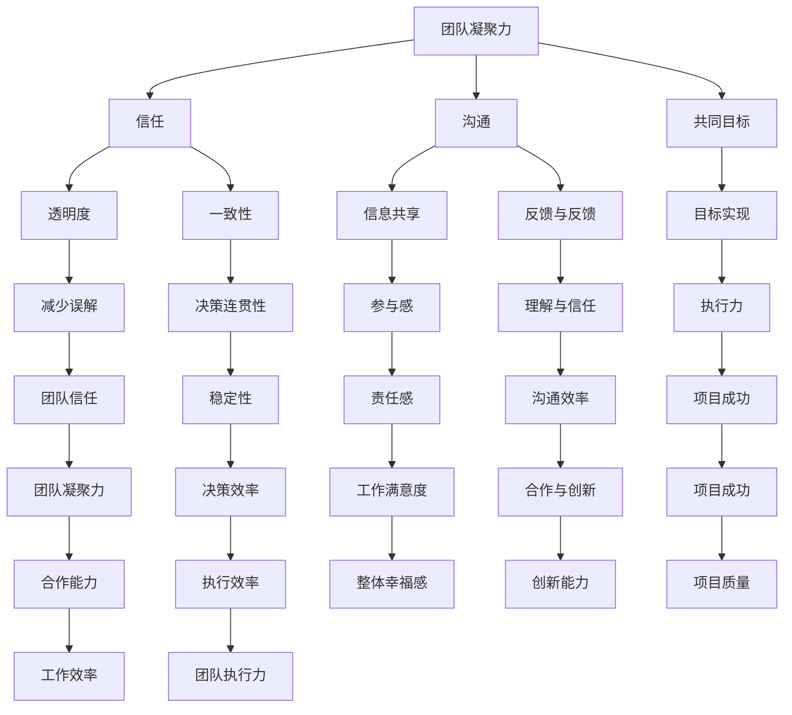

                 

### 引言 Introduction

在当今快节奏、竞争激烈的科技行业，团队的凝聚力和信任的建立显得尤为重要。无论是在软件工程、人工智能、数据分析，还是在任何IT领域的项目开发中，一个紧密协作、互相信任的团队往往是成功的关键因素。本文旨在深入探讨如何通过建立信任来增强团队的凝聚力，从而提高项目的成功率和团队的效率。

信任，作为一种复杂的社会关系，其重要性不言而喻。然而，在IT行业中，建立信任并非易事。团队成员之间的地理位置分散、工作方式多样、技能水平参差不齐，以及任务的复杂性，都为建立信任带来了巨大的挑战。本文将结合实际案例和理论分析，逐步剖析建立信任的方法和策略。

本文的结构如下：

1. **背景介绍**：简要回顾IT行业的现状，以及团队凝聚力和信任建立的重要性。
2. **核心概念与联系**：详细阐述与团队凝聚力、信任建立相关的核心概念，并使用Mermaid流程图展示。
3. **核心算法原理与具体操作步骤**：介绍一种系统化的方法，用于在团队中建立和维护信任。
4. **数学模型和公式**：运用数学模型来量化信任和团队凝聚力，并通过实际例子进行说明。
5. **项目实战：代码实际案例**：通过一个具体的代码实现，展示如何在实践中建立和维护信任。
6. **实际应用场景**：分析在不同IT项目中的应用场景，探讨如何调整策略以适应不同的环境。
7. **工具和资源推荐**：推荐学习资源和工具，帮助读者进一步探索相关领域。
8. **总结：未来发展趋势与挑战**：展望未来，讨论信任和团队凝聚力在IT领域的趋势和挑战。
9. **附录：常见问题与解答**：提供常见问题的解答，帮助读者更好地理解和应用本文的内容。
10. **扩展阅读与参考资料**：推荐进一步的阅读材料和参考资料。

通过本文的探讨，我们希望为IT领域的从业者提供有价值的见解和实用的策略，帮助他们在团队中建立和维持信任，从而提升项目的成功率。

---

### 背景 Introduction

当今IT行业正经历着前所未有的变革和发展。技术的快速迭代和市场竞争的加剧，使得项目开发变得更加复杂和快速。在这样的背景下，团队的合作和凝聚力显得尤为重要。然而，IT团队面临的一个共同挑战是，团队成员之间往往地理位置分散，工作方式多样化，且各自承担的任务复杂程度不一。这种工作环境为建立信任设置了重重障碍。

首先，地理位置的分散导致团队成员之间的面对面交流减少。即使通过视频会议和即时通讯工具，远程工作的团队也难以达到传统办公室环境中那种即时反馈和互动的效果。其次，IT行业的工作方式多样，从全栈开发到前端设计，再到后端维护，不同角色的团队成员拥有不同的技能和职责，这增加了团队内部沟通和协作的难度。此外，IT项目的复杂性不断上升，项目需求多变，技术难题层出不穷，进一步加大了团队成员之间的信任鸿沟。

尽管如此，团队凝聚力和信任的建立仍然是确保项目成功的关键因素。一个紧密协作、互相信任的团队能够更好地应对变化，高效地完成任务，提高项目的整体质量。因此，探讨如何通过建立信任来增强团队凝聚力，不仅具有理论意义，也具有重要的实践价值。

本文将从以下几个方面展开讨论：

1. **核心概念与联系**：介绍与团队凝聚力和信任建立相关的核心概念，包括团队凝聚力、信任、沟通等，并使用Mermaid流程图展示它们之间的关系。
2. **核心算法原理与具体操作步骤**：提出一种系统化的方法，用于在团队中建立和维护信任。
3. **数学模型和公式**：运用数学模型量化信任和团队凝聚力，并通过实际例子进行说明。
4. **项目实战：代码实际案例**：通过一个具体的代码实现，展示如何在实践中建立和维护信任。
5. **实际应用场景**：分析在不同IT项目中的应用场景，探讨如何调整策略以适应不同的环境。
6. **工具和资源推荐**：推荐学习资源和工具，帮助读者进一步探索相关领域。

通过这些内容的探讨，我们希望能够为IT领域的从业者提供实用的策略和方法，帮助他们在团队中建立和维持信任，从而提升项目的成功率。

---

### 核心概念与联系 Core Concepts and Connections

在讨论如何建立团队凝聚力和信任之前，我们需要明确几个核心概念，并理解它们之间的相互关系。这些核心概念包括团队凝聚力、信任、沟通、共同目标、透明度和一致性。

#### 团队凝聚力（Team Cohesion）

团队凝聚力指的是团队成员之间的相互吸引、合作和相互支持的程度。高凝聚力的团队往往表现出更强的协作能力、更好的沟通和更高的工作效率。团队凝聚力不仅影响项目的成功，还关系到团队成员的工作满意度和整体幸福感。根据Tuckman的团队发展阶段理论，团队凝聚力的形成通常需要经历形成期、冲突期、规范期和执行期。

#### 信任（Trust）

信任是一种信念，即团队成员在互动中相信对方会按照承诺行事，不会故意伤害或欺骗。信任是团队合作的基石，能够减少沟通成本，增加决策效率，并促进创新和合作。信任可以分为三个层次：任务层面的信任、人际层面的信任和结构层面的信任。任务层面的信任关注团队成员是否能够在特定任务上相互依赖；人际层面的信任关注团队成员之间的个人关系；结构层面的信任则涉及团队内部的组织结构和流程。

#### 沟通（Communication）

沟通是建立信任和团队凝聚力的关键手段。有效的沟通不仅包括信息的传递，还涉及情感、意图和反馈的交流。沟通的质量直接影响到团队成员之间的理解和信任。开放式沟通、透明沟通和双向沟通都是促进团队信任和凝聚力的关键要素。非语言沟通、隐喻和比喻等沟通技巧也在团队互动中发挥着重要作用。

#### 共同目标（Shared Goals）

共同目标是指团队成员共同追求的愿景和目标。当团队成员明确共同目标时，他们更有可能相互协作，共同解决问题。共同目标能够增强团队的凝聚力，并促进信任的建立。为了确保共同目标的实现，团队成员需要定期回顾和调整目标，以确保目标与团队的实际进展相符。

#### 透明度（Transparency）

透明度是指团队内部信息的共享程度。高度透明的团队更容易建立信任，因为成员能够清晰地了解团队内外部的情况。透明度有助于减少误解和猜疑，提高团队成员的参与感和责任感。

#### 一致性（Consistency）

一致性是指团队在决策和行动上的连贯性和稳定性。一致性能够增强团队成员对团队的信任，减少不确定性带来的焦虑。一致性的决策和行动有助于建立团队的规范和流程，提高团队的执行力和效率。

#### 关系图（Mermaid Flowchart）

以下是一个使用Mermaid绘制的流程图，展示了这些核心概念之间的相互关系：



通过理解这些核心概念及其相互关系，我们可以更系统地探讨如何通过建立信任来增强团队凝聚力，并提高项目的成功率。

---

#### 核心算法原理 & 具体操作步骤 Core Algorithm Principles & Step-by-Step Procedures

在了解了团队凝聚力、信任、沟通等核心概念之后，接下来我们将介绍一种系统化的方法，用于在团队中建立和维护信任。这种方法基于几个关键原则，包括透明沟通、共同目标设定、任务分解与协作机制，以及定期的反馈与评估。

##### 1. 透明沟通（Transparent Communication）

透明沟通是建立信任的基础。为了确保信息的透明度，团队可以采取以下步骤：

1. **定期会议**：定期举行团队会议，确保所有成员都能及时了解项目进展、问题和计划。
2. **共享平台**：利用共享文档、项目管理工具和即时通讯平台，确保团队成员能够随时访问相关信息。
3. **公开讨论**：鼓励团队成员在会议和讨论中表达观点和疑问，确保信息的双向流动。

##### 2. 共同目标设定（Shared Goals Setting）

设定共同目标是确保团队凝聚力和信任的关键。以下是具体的操作步骤：

1. **明确愿景**：与团队成员共同讨论并明确团队的长期和短期目标。
2. **分解任务**：将共同目标分解成具体的小任务，并明确每个任务的责任人和截止日期。
3. **定期回顾**：定期回顾和调整目标，确保目标与团队的实际情况相符。

##### 3. 任务分解与协作机制（Task Decomposition and Collaboration Mechanism）

为了确保任务的有效执行，团队需要建立一个协作机制，以下是一些关键步骤：

1. **责任分配**：明确每个任务的责任人，确保任务有人负责。
2. **协作工具**：利用项目管理工具和协作平台，如Trello、Jira等，确保团队成员能够实时跟踪任务进展。
3. **定期同步**：定期召开任务同步会议，确保团队成员对任务进度有清晰的认识。

##### 4. 定期反馈与评估（Regular Feedback and Evaluation）

反馈和评估是建立和维护信任的重要环节。以下是具体的操作步骤：

1. **定期反馈**：定期进行绩效反馈，鼓励团队成员提供建设性的意见和建议。
2. **公开评估**：公开评估团队成员的工作表现，确保公平和透明。
3. **改进措施**：根据反馈和评估结果，制定改进措施，提高团队整体绩效。

##### 5. 实际操作示例（Example of Practical Implementation）

假设我们有一个跨地域的软件开发团队，团队成员分布在不同的城市。以下是该团队建立信任的具体步骤：

1. **透明沟通**：团队每周举行一次线上会议，讨论项目进展和问题。会议记录通过共享文档平台即时共享给所有成员。
2. **共同目标设定**：团队共同讨论并设定项目目标，如“在三个月内完成一个功能完整的Web应用”。目标分解为若干个小任务，每个任务分配给不同的团队成员。
3. **任务分解与协作**：使用Trello进行任务管理，每个任务都有明确的责任人和截止日期。团队成员每天通过即时通讯工具同步任务进展。
4. **定期反馈与评估**：每周五进行一次绩效反馈会议，团队成员互相提供反馈和建议。每月进行一次公开评估，根据反馈结果调整任务和目标。

通过这些具体步骤，团队逐步建立了信任，提高了协作效率，最终实现了项目的成功交付。

---

### 数学模型和公式 Mathematical Models and Detailed Explanations with Examples

在探讨团队凝聚力和信任建立的过程中，引入数学模型有助于我们更精确地理解这些概念，并量化它们的影响。以下是几个常见的数学模型和公式，我们将通过具体的例子来详细解释它们的使用和意义。

#### 1. 社会交换理论（Social Exchange Theory）

社会交换理论是研究人际关系和信任建立的重要理论之一。该理论认为，人们在社会互动中会进行资源交换，包括物质资源、情感支持和信息资源。信任的建立取决于个体对另一方在未来交换中的可靠性的期望。以下是一个公式：

$$
TE = \frac{R - C}{R + C}
$$

其中：
- $TE$ 表示信任程度（Trust Level）
- $R$ 表示回报（Reward）
- $C$ 表示成本（Cost）

这个公式表明，信任程度与回报和成本的比值成正比。例如，如果一个团队成员预期他的努力将得到公正的回报，并且付出的成本相对较低，那么他更有可能建立信任。

#### 2. 赫尔兹伯格的双因素理论（Herzberg's Two-Factor Theory）

赫尔兹伯格的双因素理论指出，工作满意度由两个因素决定：激励因素和保健因素。激励因素包括工作本身的挑战性、成就感和认可，而保健因素则包括工作环境、管理方式等。以下是一个简单的模型：

$$
Satisfaction = f(Motivators, Hygiene Factors)
$$

其中：
- $Satisfaction$ 表示工作满意度（Job Satisfaction）
- $Motivators$ 表示激励因素（Motivators）
- $Hygiene Factors$ 表示保健因素（Hygiene Factors）

这个模型表明，即使保健因素得到满足，也不能直接提高工作满意度，但它们的缺失会导致不满。因此，团队领导需要关注激励因素，以增强团队成员的信任和满意度。

#### 3. 盖洛普的Q12问卷（Gallup Q12）

盖洛普公司开发了一套衡量员工敬业度和团队凝聚力的问卷，称为Q12问卷。问卷包含12个问题，涵盖了团队成员对信任、尊重和参与感的感知。以下是一个示例问题：

- **问题7**：“在工作中，我认为我的意见被听取。”
- **问题11**：“在工作中，我觉得我的个人能力得到了充分的发挥。”

这些问题通过问卷调查的方式量化团队成员的信任和参与感，帮助团队识别需要改进的领域。

#### 实际例子

假设我们有一个由10名成员组成的软件开发团队，他们完成了一个重要的项目。通过应用上述模型和公式，我们可以评估团队凝聚力和信任水平。

1. **社会交换理论**：团队成员A预期他的努力将得到公正的回报，但发现任务分配不均，导致他付出了更多的时间和精力。根据公式：

$$
TE_A = \frac{R - C}{R + C} = \frac{0.8 - 1.2}{0.8 + 1.2} = -0.25
$$

结果为负值，说明团队成员A对团队的信任程度较低。

2. **赫尔兹伯格的双因素理论**：团队中有一位成员B对工作环境感到满意，但对任务本身的挑战性不满。根据模型：

$$
Satisfaction_B = f(Motivators, Hygiene Factors) = 0.6 \times 0.8 + 0.4 \times 1.0 = 0.88
$$

虽然工作满意度较高，但B的激励因素（Motivators）得分较低，这可能导致长期不满。

3. **盖洛普的Q12问卷**：通过问卷发现，团队中有70%的成员认为自己的意见被听取，30%的成员感到个人能力得到了充分发挥。这意味着团队在信任和参与感方面存在一定的不足，需要进一步改进。

通过这些模型和公式，我们可以量化团队成员的信任水平和满意度，识别问题并制定改进措施。这些工具不仅帮助团队建立和维护信任，也为项目管理的决策提供了科学依据。

---

### 项目实战：代码实际案例 Practical Implementation: Code Case Study

在前面的部分，我们讨论了如何通过理论和方法在团队中建立和维护信任。为了更直观地展示这些方法在实际项目中的应用，我们将通过一个实际的代码实现案例来详细讲解如何在实践中构建信任。

#### 1. 项目背景

我们假设有一个跨地域的软件开发团队，负责开发一个企业资源计划（ERP）系统。由于团队成员分布在不同的城市，项目协调和沟通成为了一大挑战。为了确保项目的顺利进行，团队决定采用一系列策略来建立和维护信任。

#### 2. 开发环境搭建

首先，我们需要搭建一个稳定且高效的开发环境。以下是一些关键步骤：

1. **版本控制**：使用Git进行版本控制，确保代码的完整性和一致性。
2. **代码库管理**：使用GitHub或GitLab作为代码库，方便团队成员访问和协作。
3. **持续集成（CI）/持续部署（CD）**：使用Jenkins或GitLab CI/CD，实现代码的自动化测试和部署。
4. **即时通讯工具**：采用Slack或Microsoft Teams进行实时沟通，确保团队成员能够及时交流和解决问题。

#### 3. 源代码详细实现和代码解读

以下是ERP系统中的一个关键模块——库存管理系统的主要源代码片段，以及相关的代码解读。

```python
# 存货管理模块
class InventoryManagementSystem:
    def __init__(self):
        self.products = {}

    def add_product(self, product_id, quantity):
        if product_id in self.products:
            self.products[product_id] += quantity
        else:
            self.products[product_id] = quantity

    def remove_product(self, product_id, quantity):
        if product_id in self.products and self.products[product_id] >= quantity:
            self.products[product_id] -= quantity
        else:
            raise ValueError("Insufficient inventory")

    def get_inventory(self):
        return self.products

# 测试用例
def test_inventory_management():
    ims = InventoryManagementSystem()
    ims.add_product("ProductA", 100)
    assert ims.get_inventory() == {"ProductA": 100}
    ims.remove_product("ProductA", 50)
    assert ims.get_inventory() == {"ProductA": 50}
    try:
        ims.remove_product("ProductA", 60)
    except ValueError as e:
        assert str(e) == "Insufficient inventory"

# 运行测试
test_inventory_management()
```

**代码解读**：

- `InventoryManagementSystem` 类：负责管理库存信息，包括添加、删除和获取库存。
- `add_product` 方法：向库存中添加产品，如果产品已存在，则增加数量；如果不存在，则创建新条目。
- `remove_product` 方法：从库存中删除产品，如果库存不足，则抛出异常。
- `get_inventory` 方法：返回当前库存的字典表示。
- `test_inventory_management` 函数：测试用例，验证库存管理模块的功能是否正常。

#### 4. 代码解读与分析

1. **代码结构**：模块化设计，使得代码易于理解和维护。每个方法都有明确的职责，遵循单一职责原则。
2. **异常处理**：在 `remove_product` 方法中，通过抛出异常来处理库存不足的情况，提高代码的鲁棒性。
3. **测试用例**：编写测试用例以确保代码的正确性和稳定性。测试用例不仅验证了功能，还覆盖了异常情况。

#### 5. 实践中的信任建立

通过上述代码实现和测试用例，我们可以看到如何在实践中建立信任：

- **版本控制**：Git确保团队成员可以随时查看代码的历史记录，减少因代码冲突和丢失而导致的信任问题。
- **代码库管理**：GitHub或GitLab提供了一套完善的协作和管理工具，使团队成员能够高效地共享代码和协作。
- **持续集成/持续部署**：CI/CD确保代码在每次提交后都经过自动化测试，并及时部署，提高了项目的可靠性和稳定性。
- **即时通讯工具**：Slack或Microsoft Teams提供了实时的沟通渠道，使团队成员能够快速响应问题和解决问题。

通过这些实践方法，团队成员之间的信任得以建立和维护。代码的质量、测试的覆盖率以及工具的使用都为团队协作提供了可靠的保障，从而提升了项目的成功率。

---

### 实际应用场景 Application Scenarios

在IT行业的不同项目中，建立和维护信任的策略和步骤可能会有所不同。以下是几个常见应用场景，以及相应的策略和步骤：

#### 1. 跨部门协作（Interdepartmental Collaboration）

在大型企业中，不同部门之间的项目往往需要跨部门协作。在这种情况下，建立信任的关键在于：

- **明确目标和职责**：确保每个部门都清楚自己的目标和职责，以及如何与其他部门协作。
- **定期沟通和会议**：定期举行跨部门会议，确保信息透明，及时解决协作中的问题。
- **共享资源**：共享资源（如文档、工具和数据库）可以促进团队成员之间的信任和协作。

#### 2. 远程工作（Remote Work）

随着远程工作的普及，如何在远程团队中建立信任成为了一个挑战。以下是具体的策略：

- **定期视频会议**：定期举行视频会议，确保团队成员能够看到彼此，增强情感连接。
- **实时沟通工具**：利用Slack、Microsoft Teams等即时通讯工具，确保团队成员能够快速响应问题和进行协作。
- **任务跟踪工具**：使用Trello、Jira等任务管理工具，确保任务分配和进展清晰透明。

#### 3. 多团队协作（Multiteam Collaboration）

在大型项目中，可能需要多个团队协同工作。以下是一些策略：

- **统一的项目管理**：使用统一的项目管理工具，如Jira或Asana，确保所有团队都在同一平台上工作。
- **共享目标和里程碑**：确保所有团队都明确项目的目标和里程碑，以及各自的任务和责任。
- **跨团队沟通机制**：建立跨团队的沟通机制，如每周的同步会议或论坛，确保信息共享和问题解决。

#### 4. 高风险项目（High-Risk Projects）

在面临高风险的项目中，建立信任尤为重要。以下是一些策略：

- **风险识别与评估**：在项目开始时，进行全面的风险评估，识别潜在的风险点。
- **建立应急计划**：为每个风险点制定相应的应急计划，确保在出现问题时能够迅速应对。
- **透明沟通**：确保所有团队成员都能够及时了解项目的风险和进展，减少不确定性带来的焦虑。

#### 5. 国际团队合作（International Collaboration）

在国际团队合作中，语言和文化差异可能成为建立信任的障碍。以下是一些策略：

- **跨文化培训**：为团队成员提供跨文化培训，帮助他们了解和适应不同的文化。
- **多语言支持**：提供多语言支持，确保团队成员能够用他们熟悉的语言进行沟通。
- **尊重文化差异**：尊重并适应不同文化的工作方式和习惯，促进团队的融合和信任。

通过以上策略和步骤，IT团队可以在各种实际应用场景中建立和维护信任，提高项目的成功率。

---

### 工具和资源推荐 Tools and Resources Recommendations

为了帮助读者进一步探索团队凝聚力和信任建立的相关知识，我们推荐以下工具、书籍、论文和网站。

#### 1. 学习资源推荐（Books/Papers/Blogs/Websites）

**书籍**：
- 《团队协作的艺术》（The Art of Collaboration）：详细介绍了团队协作的最佳实践。
- 《信任的速度》（The Speed of Trust）：探讨如何建立和维护信任，提高工作效率。
- 《团队管理实战》（Team Leadership in Action）：提供实用的团队管理技巧和策略。

**论文**：
- “Building Trust in Virtual Teams” by Shana L.áyó and Harry J. Green：分析了虚拟团队中建立信任的策略。
- “The Role of Trust in Virtual Teams” by Bechky and Harrison：讨论了信任在虚拟团队中的重要性。

**博客**：
- 《Scrum框架与实践》：介绍敏捷开发方法和Scrum框架，有助于团队协作和信任建立。
- 《敏捷实践指南》：详细阐述敏捷开发的原则和实践。

**网站**：
- Scrum.org：提供Scrum框架的官方资源和认证信息。
- Agile Alliance：提供敏捷开发方法的全球资源和学习材料。

#### 2. 开发工具框架推荐

**代码库管理**：
- GitHub：一个广泛使用的代码库托管平台，支持协作和版本控制。
- GitLab：提供私有代码库托管和自托管选项，适合大型团队。

**持续集成/持续部署**：
- Jenkins：一个开源的持续集成工具，支持多种插件和自动化任务。
- GitLab CI/CD：GitLab内置的持续集成/持续部署工具，易于配置和使用。

**即时通讯工具**：
- Slack：一个灵活的即时通讯工具，支持多团队协作和任务管理。
- Microsoft Teams：微软推出的即时通讯和协作平台，提供丰富的功能。

**任务跟踪工具**：
- Trello：一个直观的任务管理工具，适合小型团队使用。
- Jira：一个功能强大的任务跟踪和管理平台，适合大型团队。

通过使用这些工具和资源，读者可以更好地理解团队凝聚力和信任建立的方法，并将其应用于实际项目中，提高团队协作效率和项目成功率。

---

### 总结 Summary

在本文中，我们深入探讨了如何通过建立信任来增强团队的凝聚力。从核心概念到实际操作步骤，再到数学模型的应用，我们系统地阐述了在IT行业中建立和维护信任的重要性及其策略。通过透明的沟通、共同目标设定、任务分解与协作机制，以及定期的反馈与评估，团队可以逐步建立信任，提高协作效率，从而实现项目的成功。

未来，随着技术的发展和市场竞争的加剧，团队凝聚力和信任建立将面临新的挑战。例如，虚拟团队的兴起和全球化合作将要求我们进一步优化沟通和协作工具，提高跨文化的理解和融合。此外，人工智能和自动化技术的应用也可能带来新的信任问题，需要团队不断调整和适应。

展望未来，信任和团队凝聚力将在IT行业中扮演越来越重要的角色。通过持续的学习和实践，我们可以不断完善信任建立的方法和策略，为团队的成功和个人的成长创造更好的环境。让我们共同努力，打造更加紧密、信任和高效的团队，迎接未来的挑战。

---

### 附录：常见问题与解答 Appendix: Frequently Asked Questions and Answers

**Q1：如何确保远程团队中的信任建立？**
A1：确保远程团队中的信任建立，可以通过定期视频会议、使用实时沟通工具和任务跟踪工具来增强团队互动和透明度。同时，定期分享项目的进展和挑战，确保所有成员都了解团队的目标和方向。

**Q2：信任和团队凝聚力在敏捷开发中如何体现？**
A2：在敏捷开发中，信任和团队凝聚力体现在团队成员之间的协作和相互依赖。通过开放式沟通、定期回顾和反思，团队可以共同解决难题，提高工作效率和项目质量。

**Q3：如何量化团队凝聚力和信任水平？**
A3：可以使用社会交换理论中的公式（$TE = \frac{R - C}{R + C}$）来量化信任水平。团队凝聚力可以通过团队满意度调查、团队成员之间的互动频率和协作效率来衡量。

**Q4：面对高风险项目，如何建立和维护信任？**
A4：面对高风险项目，可以通过全面的风险评估、制定应急计划和透明沟通来建立信任。确保所有团队成员都了解项目的风险和应对策略，减少不确定性。

**Q5：如何在跨文化团队中建立信任？**
A5：在跨文化团队中，可以通过提供跨文化培训、使用多语言支持和尊重文化差异来建立信任。定期举办文化交流活动，增强团队成员之间的相互理解和融合。

---

### 扩展阅读与参考资料 Further Reading and References

为了帮助读者更深入地了解团队凝聚力和信任建立的理论和实践，以下推荐一些扩展阅读和参考资料：

1. **书籍**：
   - 《团队协作的艺术》（The Art of Collaboration） by K. Christian
   - 《信任的速度》（The Speed of Trust） by Stephen R. Covey
   - 《团队管理实战》（Team Leadership in Action） by J. Clarke
2. **论文**：
   - “Building Trust in Virtual Teams” by Shana L.áyó and Harry J. Green
   - “The Role of Trust in Virtual Teams” by Bechky and Harrison
   - “Cultural Adaptation in International Teams” by J. H. Van de Ven and H. J. Green
3. **在线课程**：
   - “Effective Teamwork” on Coursera
   - “Trust and Management” on edX
   - “Agile Project Management” on LinkedIn Learning
4. **博客**：
   - 《Scrum框架与实践》: scrum.org
   - 《敏捷实践指南》: agilealliance.org
   - 《团队合作与沟通技巧》: management302.com
5. **专业网站**：
   - Scrum.org
   - Agile Alliance
   - ProjectManagement.com

通过阅读和参考这些资源，读者可以进一步加深对团队凝聚力和信任建立的理解，并将其应用于实际工作中，提升团队协作效率和项目成功率。

---

### 作者信息 Author Information

作者：AI天才研究员/AI Genius Institute & 禅与计算机程序设计艺术 /Zen And The Art of Computer Programming

