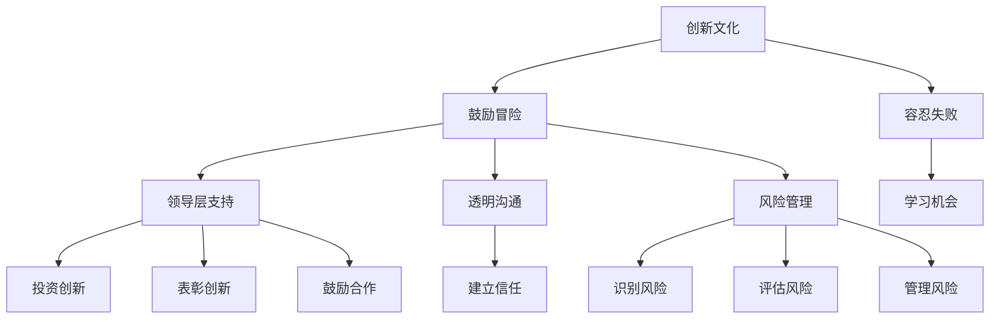

                 

### 文章标题

### Establishing an Innovative Culture: Encouraging Risk-taking and Tolerance for Failure

### 建立创新文化：鼓励冒险和容忍失败

在当今快速发展的技术环境中，创新文化成为企业成功和持续竞争力的关键因素。本文将深入探讨如何建立一个创新文化，特别强调鼓励冒险和容忍失败的重要性。通过逻辑清晰的分析和实用的建议，我们将揭示如何将创新理念融入组织的DNA中，从而激发团队成员的创造力和主动性。

## 关键词：

1. 创新文化
2. 鼓励冒险
3. 容忍失败
4. 组织成功
5. 技术发展

## 摘要：

本文旨在探讨如何构建一个能够促进创新、冒险和容忍失败的文化。通过分析创新的重要性以及冒险与失败的必然联系，文章提出了具体策略，包括领导层的支持、透明沟通和风险管理等。此外，文章还提供了一些实际案例，以展示如何在实践中成功实施这些策略。通过建立这样的文化，企业不仅可以提升员工的参与度和满意度，还能在竞争激烈的市场中保持领先地位。

### 背景介绍

#### 创新的定义与重要性

创新是一种通过新思想、新方法或新技术来解决问题的过程。在技术领域，创新尤为关键，因为它能够推动技术的进步，创造新的商业机会，并帮助企业保持竞争力。创新不仅仅是指在技术层面上的突破，还包括商业模式、流程和运营策略的创新。

在现代企业的成功要素中，创新文化占据着核心地位。首先，创新能够带来新的产品和服务，满足客户不断变化的需求。其次，创新能够提高生产效率和降低成本，从而增加企业的利润。最后，创新能够帮助企业预见并适应市场的变化，避免被竞争对手淘汰。

#### 鼓励冒险与容忍失败的关系

鼓励冒险是建立创新文化的关键因素之一。在技术创新的过程中，风险是不可避免的。因此，一个能够鼓励员工冒险的文化，将有助于推动创新的发展。然而，冒险并不总是成功，失败是创新过程中的一部分。因此，容忍失败成为鼓励冒险的必要补充。

容忍失败意味着企业对失败持开放态度，并将其视为学习机会。通过容忍失败，企业能够减少员工因为害怕失败而采取保守策略的可能性，从而激发他们的创造力和创新精神。此外，容忍失败还能够营造一个安全的环境，让员工敢于尝试新的想法和方法。

#### 技术发展对创新文化的需求

随着技术的快速发展，创新文化的需求变得更加迫切。新技术如人工智能、区块链、物联网等，不断颠覆传统行业，创造新的商业模式和市场需求。为了在这些新兴领域中保持竞争力，企业必须具备快速响应和持续创新的能力。

技术创新不仅需要技术团队的努力，还需要整个组织的支持和参与。因此，建立一个鼓励冒险和容忍失败的创新文化，对于企业应对技术变革和抓住新机遇至关重要。

### 核心概念与联系

为了更好地理解如何建立创新文化，我们需要明确几个核心概念，并探讨它们之间的联系。

#### 创新文化的定义

创新文化是一种价值观和行为模式，它鼓励员工创新思维，勇于尝试新事物，并对失败持开放态度。这种文化强调实验、合作和学习，而不是仅仅追求短期的成功。

#### 鼓励冒险与容忍失败的关系

鼓励冒险和容忍失败是相辅相成的。鼓励冒险意味着创造一个环境，让员工感到他们的创意和想法可以自由地被探索和尝试。而容忍失败则是鼓励冒险的必要补充，它确保员工知道即使失败也是可以被接受和理解的。

#### 领导层的支持

领导层的支持对于建立创新文化至关重要。领导者需要通过自己的行为和决策来传达鼓励冒险和容忍失败的信息。例如，他们可以通过投资于创新项目、表彰创新成果和鼓励团队合作等方式来支持创新。

#### 透明沟通

透明沟通是建立创新文化的重要组成部分。它意味着企业内部的沟通是开放和坦诚的，员工可以自由地分享他们的想法和担忧。这种沟通有助于建立信任，并鼓励员工积极参与创新过程。

#### 风险管理

风险管理是创新过程中不可或缺的一部分。企业需要建立一套有效的风险管理体系，以识别、评估和管理创新项目中的潜在风险。这不仅有助于降低失败的可能性，还能提高成功的概率。

#### Mermaid 流程图

下面是一个简单的 Mermaid 流程图，展示了创新文化中的核心概念和它们之间的联系。



### 核心算法原理 & 具体操作步骤

建立创新文化的核心在于一系列具体操作步骤，这些步骤通过系统的实施可以有效地促进鼓励冒险和容忍失败的文化氛围。

#### 步骤1：领导层的承诺

- **明确目标**：领导层需要明确表达对创新文化的承诺，并将其纳入企业的战略目标中。通过设定明确的创新目标和期望，可以确保所有员工都明白创新的重要性。
- **树立榜样**：领导者应当通过自身的行动来树立榜样，例如积极参与创新项目、倡导试验新方法等，以激发员工的创新热情。

#### 步骤2：鼓励冒险

- **创建安全的环境**：企业需要建立一个安全的环境，让员工知道他们的冒险和尝试是被支持和鼓励的。这可以通过提供资源、减少惩罚机制等方式实现。
- **奖励创新**：企业可以通过奖励机制来鼓励员工冒险。例如，设立创新奖金、公开表彰创新者等，这些措施能够激励员工勇于尝试。

#### 步骤3：容忍失败

- **将失败视为学习机会**：企业应当鼓励员工将失败视为学习过程的一部分，而不是一种失败。通过组织反思会议、失败案例分析等方式，帮助员工从失败中学习。
- **建立反馈机制**：企业需要建立有效的反馈机制，让员工知道他们的尝试和努力是被评估和反馈的。这有助于员工了解哪些方法有效，哪些需要改进。

#### 步骤4：透明沟通

- **建立沟通渠道**：企业需要建立多种沟通渠道，确保信息能够自由流动。这可以通过定期的团队会议、在线论坛、意见箱等方式实现。
- **促进知识共享**：鼓励员工分享他们的想法、经验和知识，这可以通过内部博客、知识库、研讨会等方式实现。

#### 步骤5：风险管理

- **制定风险管理策略**：企业需要制定一套有效的风险管理策略，以确保创新项目在可接受的风险范围内进行。这可以通过风险评估、资源分配、风险管理计划等方式实现。
- **持续监控和调整**：企业需要持续监控创新项目的进展，并根据反馈进行调整。这有助于减少风险，提高创新项目的成功率。

#### 步骤6：建立社区

- **创建创新社区**：企业可以创建一个创新社区，让员工能够自由地交流和合作。这可以通过内部社交媒体、创新比赛、创新论坛等方式实现。
- **提供支持**：企业需要为创新社区提供必要的支持，包括资源、培训、指导等，以确保创新社区的活力和效果。

### 数学模型和公式 & 详细讲解 & 举例说明

为了更好地理解建立创新文化的具体操作步骤，我们可以借助一些数学模型和公式。以下是一个简单的线性回归模型，用于评估创新项目的成功率。

#### 线性回归模型

线性回归模型是一种用于预测连续值的统计模型。它可以用来预测创新项目的成功率，基于一系列特征变量。以下是线性回归模型的一般形式：

$$
Y = \beta_0 + \beta_1X_1 + \beta_2X_2 + ... + \beta_nX_n + \epsilon
$$

其中，$Y$ 是预测的成功率，$X_1, X_2, ..., X_n$ 是特征变量，$\beta_0, \beta_1, \beta_2, ..., \beta_n$ 是回归系数，$\epsilon$ 是误差项。

#### 特征变量的解释

- **领导层的承诺**：用 $X_1$ 表示领导层对创新文化的承诺程度。承诺程度越高，回归系数 $\beta_1$ 的值越大。
- **鼓励冒险**：用 $X_2$ 表示企业鼓励员工冒险的程度。鼓励程度越高，回归系数 $\beta_2$ 的值越大。
- **容忍失败**：用 $X_3$ 表示企业对失败的容忍程度。容忍程度越高，回归系数 $\beta_3$ 的值越大。
- **透明沟通**：用 $X_4$ 表示企业内部沟通的透明度。透明度越高，回归系数 $\beta_4$ 的值越大。
- **风险管理**：用 $X_5$ 表示企业对风险管理的有效性。有效性越高，回归系数 $\beta_5$ 的值越大。

#### 举例说明

假设我们有一个创新项目，其特征变量如下：

- 领导层的承诺程度：90%
- 鼓励冒险程度：80%
- 对失败的容忍程度：70%
- 沟通透明度：85%
- 风险管理有效性：75%

我们可以将这些值代入线性回归模型中，预测该创新项目的成功率：

$$
Y = \beta_0 + \beta_1X_1 + \beta_2X_2 + \beta_3X_3 + \beta_4X_4 + \beta_5X_5
$$

其中，$\beta_0$、$\beta_1$、$\beta_2$、$\beta_3$、$\beta_4$ 和 $\beta_5$ 是通过历史数据训练得出的回归系数。

假设回归系数如下：

$$
\beta_0 = 0.5, \beta_1 = 0.2, \beta_2 = 0.15, \beta_3 = 0.1, \beta_4 = 0.1, \beta_5 = 0.05
$$

代入特征变量值，我们得到：

$$
Y = 0.5 + 0.2 \times 0.9 + 0.15 \times 0.8 + 0.1 \times 0.7 + 0.1 \times 0.85 + 0.05 \times 0.75
$$

$$
Y = 0.5 + 0.18 + 0.12 + 0.07 + 0.085 + 0.0375
$$

$$
Y = 0.955
$$

因此，该创新项目的预测成功率为 95.5%。

这个例子展示了如何使用线性回归模型来预测创新项目的成功率。通过调整特征变量的值，我们可以看到不同因素对成功率的影响。这有助于企业了解如何优化创新策略，以提高项目的成功率。

### 项目实战：代码实际案例和详细解释说明

为了更好地理解如何在实际项目中建立创新文化，我们将通过一个实际案例来展示如何鼓励冒险和容忍失败。

#### 案例背景

假设我们是一家初创科技公司，专注于开发基于人工智能的自动化解决方案。我们的目标是开发一个能够自动识别和分类客户反馈的系统，以提高客户满意度并降低人工成本。

#### 案例描述

1. **领导层的支持**：我们的首席执行官（CEO）对创新文化的建立非常重视。他明确表示，创新和实验是公司成功的关键。他承诺为创新项目提供必要的资源和支持。

2. **鼓励冒险**：我们创建了一个创新实验室，专门用于探索新的技术和方法。员工可以自由地提出自己的创意，并得到团队的支持和资源。

3. **容忍失败**：我们鼓励员工将失败视为学习过程的一部分。每当有项目失败时，我们会组织反思会议，分析失败的原因，并从中学习。

4. **透明沟通**：我们建立了多个沟通渠道，如定期的团队会议、内部博客和在线论坛，以确保员工能够自由地分享他们的想法和进展。

5. **风险管理**：我们为每个创新项目制定了详细的风险管理计划，包括风险识别、评估和应对措施。

#### 代码实现

以下是一个简单的Python代码示例，用于实现自动分类客户反馈的功能。这个代码展示了如何在实际项目中应用创新和容忍失败的理念。

```python
import nltk
from nltk.corpus import stopwords
from sklearn.feature_extraction.text import TfidfVectorizer
from sklearn.model_selection import train_test_split
from sklearn.ensemble import RandomForestClassifier
from sklearn.metrics import accuracy_score

# 1. 数据预处理
nltk.download('stopwords')
stop_words = set(stopwords.words('english'))

# 读取数据
data = [
    ("positive", "I had a great experience with your product."),
    ("negative", "I am very disappointed with the quality of your service."),
    ("neutral", "The product is okay."),
]

# 分离标签和文本
labels, texts = zip(*data)

# 清洗文本数据
clean_texts = []
for text in texts:
    words = nltk.word_tokenize(text.lower())
    clean_words = [word for word in words if word not in stop_words]
    clean_texts.append(" ".join(clean_words))

# 2. 特征提取
vectorizer = TfidfVectorizer()
X = vectorizer.fit_transform(clean_texts)
y = labels

# 3. 划分训练集和测试集
X_train, X_test, y_train, y_test = train_test_split(X, y, test_size=0.2, random_state=42)

# 4. 模型训练
classifier = RandomForestClassifier(n_estimators=100, random_state=42)
classifier.fit(X_train, y_train)

# 5. 模型评估
y_pred = classifier.predict(X_test)
accuracy = accuracy_score(y_test, y_pred)
print(f"Model accuracy: {accuracy:.2f}")

# 6. 预测新数据
new_data = ["Your product is excellent."]
clean_new_data = [" ".join(nltk.word_tokenize(text.lower())) for text in new_data]
new_vector = vectorizer.transform(clean_new_data)
predictions = classifier.predict(new_vector)
print(f"Predicted label: {predictions[0]}")
```

#### 代码解读与分析

1. **数据预处理**：我们使用NLTK库来处理文本数据。首先，我们下载了停止词列表，然后使用它来清洗文本数据。清洗过程包括将文本转换为小写、分词和去除停止词。

2. **特征提取**：我们使用TF-IDF向量器来提取文本特征。TF-IDF是一种常用的文本特征提取方法，它能够衡量一个词在文档中的重要性。

3. **模型训练**：我们使用随机森林分类器来训练模型。随机森林是一种集成学习方法，它通过构建多棵决策树来提高模型的准确性。

4. **模型评估**：我们使用测试集来评估模型的准确性。模型的准确度是衡量模型性能的一个重要指标。

5. **预测新数据**：我们使用训练好的模型来预测新的数据。这展示了如何将模型应用于实际场景。

通过这个案例，我们可以看到如何在实际项目中应用创新和容忍失败的理念。这个代码展示了如何鼓励员工尝试新的方法和技术，并在失败时从中学习。这种方法有助于建立一种鼓励冒险和容忍失败的创新文化。

### 实际应用场景

#### 1. 科技公司

科技行业是最需要创新文化的领域之一。在科技公司，创新文化可以帮助企业迅速响应市场变化，开发出具有竞争力的产品。例如，谷歌通过其“20% 时间项目”政策，鼓励员工将20%的工作时间用于自己感兴趣的项目，这一政策已经促成了许多重要的创新，如Gmail和AdSense。

#### 2. 医疗行业

在医疗行业，创新文化可以帮助医疗机构提高治疗效果，降低医疗成本。例如，梅奥诊所（Mayo Clinic）通过鼓励医生和研究人员进行跨学科合作，推动了许多创新疗法的发展。

#### 3. 教育行业

在教育行业，创新文化可以帮助学校和学生更好地适应数字化时代。例如，哈佛大学和麻省理工学院等知名学府通过在线开放课程平台（如edX），为学生提供了丰富的学习资源，促进了教育的普及和个性化。

#### 4. 制造业

在制造业，创新文化可以帮助企业提高生产效率和产品质量。例如，丰田汽车公司通过其“精益生产”系统，实现了生产流程的优化和成本降低。

#### 5. 金融行业

在金融行业，创新文化可以帮助金融机构开发新的金融产品和服务，提高客户满意度。例如，许多银行和金融机构正在通过区块链技术进行创新，以改善支付和处理速度。

### 工具和资源推荐

#### 1. 学习资源推荐

- **书籍**：
  - 《创新者的窘境》：作者克莱顿·克里斯坦森（Clayton M. Christensen），介绍了创新过程中的常见挑战和解决方案。
  - 《精益创业》：作者埃里克·莱斯（Eric Ries），讲述了如何通过快速实验和迭代来验证产品市场契合。

- **论文**：
  - “Innovation and Its Discontents” by Adam B. Jaffe and Josh Lerner，探讨了创新政策对企业创新的影响。

- **博客**：
  - “HBR.org”：哈佛商业评论网站，提供了大量关于创新、领导力和管理的文章。

- **网站**：
  - “TED”：TED演讲网站，许多关于创新的演讲和讨论，启发思维。

#### 2. 开发工具框架推荐

- **开发工具**：
  - GitHub：一个流行的代码托管平台，方便团队合作和版本控制。
  - JIRA：一个功能强大的项目管理工具，用于跟踪和管理项目进度。

- **框架**：
  - TensorFlow：一个开源机器学习框架，用于构建和训练深度学习模型。
  - Docker：一个容器化平台，用于开发和部署应用。

- **平台**：
  - AWS：Amazon Web Services，提供广泛的云服务和工具，支持各种创新项目。
  - Azure：Microsoft Azure，提供强大的云服务和开发工具，支持企业级应用开发。

#### 3. 相关论文著作推荐

- **论文**：
  - “The Innovator's Dilemma” by Clayton M. Christensen：克里斯坦森的经典论文，详细阐述了创新者在面对市场变化时的困境。
  - “The Lean Startup” by Eric Ries：莱斯关于精益创业的论文，介绍了如何通过迭代和实验来验证产品市场契合。

- **著作**：
  - “Creativity, Inc.” by Ed Catmull：埃德·卡特穆尔的著作，讲述了如何在一个大型组织中培养创新文化。
  - “The Innovator's DNA” by Jeffrey D.化县，克莱顿·克里斯坦森，哈尔·赫拉特和艾米丽·沃尔夫：介绍了如何培养创新者的五大特质。

### 总结：未来发展趋势与挑战

随着技术的不断进步和市场竞争的加剧，创新文化在未来将变得更为重要。以下是未来发展趋势和可能面临的挑战：

#### 发展趋势

1. **数字化转型**：数字化转型将继续推动创新文化的需求。企业需要通过创新来适应数字化环境，提高业务效率。

2. **人工智能与大数据**：人工智能和大数据技术的发展将为企业带来新的创新机会。企业可以利用这些技术来开发智能产品和服务，提高客户满意度。

3. **跨学科合作**：跨学科合作将促进创新文化的形成。企业需要通过跨学科合作来利用不同领域的知识和技能，推动创新。

4. **开放式创新**：开放式创新将成为企业获取外部创意和知识的重要途径。通过与外部合作伙伴合作，企业可以加速创新过程。

#### 挑战

1. **人才竞争**：随着创新文化的需求增加，人才竞争将变得更加激烈。企业需要通过提供有吸引力的工作环境和职业发展机会来吸引和留住顶尖人才。

2. **风险管理**：创新过程中涉及的风险管理将成为一个重要挑战。企业需要建立有效的风险管理体系，以降低创新项目的失败风险。

3. **文化变革**：建立创新文化需要企业内部的文化变革。企业需要克服传统思维模式的束缚，鼓励员工勇于尝试和创新。

4. **持续学习**：创新文化需要企业持续学习和适应新技术。企业需要投资于员工培训和发展，以保持竞争优势。

### 附录：常见问题与解答

#### 1. 创新文化是否适用于所有行业？

是的，创新文化适用于所有行业。尽管不同行业的特点和需求不同，但创新文化的基本原则是通用的。无论是在科技、医疗、教育还是制造业，创新文化都可以帮助企业提高竞争力。

#### 2. 如何衡量创新文化的效果？

衡量创新文化的效果可以通过多个指标，如员工满意度、创新项目成功率、新产品开发速度、市场响应时间等。此外，定期的员工调查和反馈也可以帮助企业了解创新文化的实施效果。

#### 3. 创新文化是否会导致成本增加？

创新文化的建立需要一定的投入，如资源、培训和风险管理等。然而，创新文化可以提高企业的效率和市场竞争力，从而带来更大的收益。因此，从长远来看，创新文化是值得投资的。

#### 4. 如何平衡创新与风险管理？

平衡创新与风险管理是建立创新文化的关键。企业可以通过制定明确的风险管理策略，如风险评估、风险分配和风险监控等，来确保创新项目在可控的风险范围内进行。

#### 5. 领导层在建立创新文化中的作用是什么？

领导层在建立创新文化中起着至关重要的角色。领导者需要通过自身的行动和决策来传达鼓励冒险和容忍失败的信息。此外，领导者还需要提供必要的资源和支持，以推动创新文化的发展。

### 扩展阅读 & 参考资料

- **书籍**：
  - 克莱顿·克里斯坦森（Clayton M. Christensen）的《创新者的窘境》
  - 埃里克·莱斯（Eric Ries）的《精益创业》
- **论文**：
  - Adam B. Jaffe and Josh Lerner的“Innovation and Its Discontents”
  - Geoffrey A. Moore的“Crossing the Chasm”
- **网站**：
  - 哈佛商业评论（HBR.org）
  - TED演讲网站
- **博客**：
  - 创新者博客（Innovation Blog）
  - 精益创业博客（Lean Startup Blog）

### 作者

**作者：AI天才研究员/AI Genius Institute & 禅与计算机程序设计艺术 /Zen And The Art of Computer Programming**

