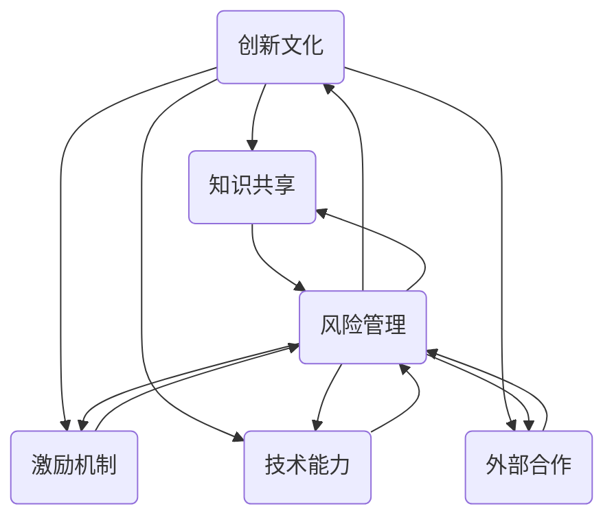

                 

### 背景介绍

**创新生态系统的概念**

在当今快速变化的世界中，创新已经成为企业成功的关键因素。然而，创新并非一蹴而就，而是需要一个健康的生态系统来培养和支持。创新生态系统是一个由多个相互关联的组成部分构成的复杂网络，它旨在促进创新、加速知识传播和增强组织的创新能力。

创新生态系统通常包括以下几个关键组成部分：

1. **人才**：拥有具备创新能力的人才是一个创新生态系统的基础。这些人才包括研究人员、开发人员、设计师和商业分析师等，他们能够为组织带来新的思路和解决方案。

2. **技术**：先进的技术是创新生态系统的重要驱动力。这包括但不限于新兴技术、现有技术的改进和创新技术的应用。

3. **文化**：开放、包容和鼓励冒险的文化是创新生态系统的关键。这样的文化能够鼓励员工提出新的想法，并对失败持包容态度。

4. **资源**：足够的资金、时间和其他资源是创新生态系统成功的关键。这些资源为实验、原型开发和商业推广提供了必要的支持。

5. **合作**：与外部合作伙伴建立合作关系也是创新生态系统的重要组成部分。这些合作能够带来新的视角、资源和市场机会。

**创新能力的重要性**

在当今竞争激烈的市场环境中，创新能力已经成为企业保持竞争力的关键。一个具备强大创新能力的组织能够更快地适应市场变化，开发出更符合客户需求的产品和服务，从而在竞争中脱颖而出。以下是创新能力的一些关键作用：

1. **市场竞争力**：创新能够帮助企业开发出独特的产品和服务，从而在激烈的市场竞争中占据优势。

2. **客户满意度**：创新能够满足客户不断变化的需求，提高客户满意度和忠诚度。

3. **增长和盈利**：创新能够带来新的市场和业务机会，从而推动企业的增长和盈利。

4. **组织变革**：创新能够促进组织内部的变革，提高效率和生产力。

**文章的目的**

本文旨在探讨如何建立一个创新生态系统，以培养组织的创新能力。我们将通过以下几个部分详细分析这一主题：

1. **核心概念与联系**：我们将介绍创新生态系统的核心概念，并使用Mermaid流程图展示这些概念之间的联系。

2. **核心算法原理 & 具体操作步骤**：我们将讨论如何通过具体的方法和步骤来建立和优化创新生态系统。

3. **数学模型和公式 & 详细讲解 & 举例说明**：我们将介绍用于评估和创新生态系统性能的数学模型和公式，并通过实际案例进行说明。

4. **项目实战：代码实际案例和详细解释说明**：我们将提供一个实际的项目案例，展示如何通过代码实现创新生态系统的构建。

5. **实际应用场景**：我们将探讨创新生态系统在不同行业和领域中的应用。

6. **工具和资源推荐**：我们将推荐一些有用的学习资源和开发工具，帮助读者深入了解和创新生态系统。

7. **总结：未来发展趋势与挑战**：最后，我们将总结本文的主要内容，并讨论未来创新生态系统可能面临的挑战和发展趋势。

通过这些内容的探讨，我们希望读者能够对如何建立一个有效的创新生态系统有更深入的理解，并能够将其应用于实际工作中。

### 核心概念与联系

为了更好地理解创新生态系统的构建和运作，我们需要明确几个核心概念，并探讨它们之间的相互联系。以下是创新生态系统的核心概念：

1. **创新文化**：创新文化是一个组织内部对于创新的态度和价值观。它鼓励员工勇于尝试新事物，接受失败，并将创新视为日常工作的组成部分。创新文化不仅仅是一种氛围，更是组织的核心驱动力。

2. **知识共享**：知识共享是创新生态系统的关键组成部分，它通过促进组织内外的知识流动，加速创新过程。有效的知识共享机制可以帮助员工获取新的见解和思路，从而推动创新。

3. **激励机制**：激励机制是激发员工创新热情的重要工具。通过提供奖励、晋升机会和其他激励措施，组织可以鼓励员工积极参与创新活动。

4. **技术能力**：技术能力是创新生态系统的基础。这包括组织内部的技术积累、研发能力和技术储备。强大的技术能力能够为创新提供坚实的基础。

5. **外部合作**：外部合作是创新生态系统的重要组成部分。通过与供应商、客户、研究机构和其他组织建立合作关系，组织可以获取新的资源、技术和市场机会。

6. **风险管理**：在创新过程中，风险管理至关重要。有效的风险管理可以帮助组织识别和应对潜在的风险，确保创新项目的成功。

**Mermaid流程图**

为了更直观地展示这些概念之间的联系，我们可以使用Mermaid流程图来表示。以下是创新生态系统的核心概念及其关系的Mermaid表示：



**图解说明**

- **创新文化**：作为生态系统的核心，创新文化影响着其他所有组成部分。它鼓励知识共享、激励机制、技术能力和外部合作，同时也受到这些因素的影响。

- **知识共享**：知识共享不仅促进创新，还加强了组织内部的沟通和协作。有效的知识共享机制能够降低创新风险，提高创新效率。

- **激励机制**：激励机制通过奖励和认可激发员工的创新热情，同时也为风险管理提供支持。激励机制的设定需要与组织的整体目标和价值观保持一致。

- **技术能力**：技术能力为创新提供基础，同时也受到其他因素如知识共享、激励机制和外部合作的影响。强大的技术能力能够推动创新文化的形成和发展。

- **外部合作**：外部合作能够为组织带来新的资源、技术和市场机会，同时也有助于知识共享和风险管理的实施。

- **风险管理**：风险管理贯穿于创新生态系统的各个组成部分，它通过识别和应对潜在风险，确保创新项目的顺利进行。

通过上述核心概念及其相互联系的阐述和Mermaid流程图的展示，我们可以更清晰地理解如何构建一个有效的创新生态系统。接下来，我们将进一步探讨如何通过具体的算法原理和操作步骤来实现这一目标。

### 核心算法原理 & 具体操作步骤

**创新生态系统的构建过程**

建立一个有效的创新生态系统并非一蹴而就，而是需要经过一系列精心设计的步骤。以下是构建创新生态系统的核心算法原理和具体操作步骤：

1. **需求分析**：首先，组织需要明确其创新目标。这包括理解市场需求、技术趋势和竞争环境。需求分析是创新生态系统的起点，它为后续步骤提供了明确的方向。

2. **人才招聘与培养**：人才是创新生态系统的核心。组织需要招聘具备创新能力的人才，并通过培训和发展计划提升其技能和知识。有效的招聘和培养机制能够确保组织拥有持续的创新动力。

3. **建立创新文化**：创新文化是创新生态系统的灵魂。组织需要通过一系列措施如开放沟通、鼓励冒险和认可创新来建立和强化创新文化。创新文化的建立需要时间和持续的努力。

4. **知识共享机制**：知识共享是创新的关键。组织需要建立有效的知识共享机制，如内部论坛、知识库和共享会议等。这些机制能够促进知识的流动和共享，提高创新效率。

5. **激励机制设计**：激励机制是激发员工创新热情的重要工具。组织需要设计合理的激励机制，如奖励、晋升机会和认可等。激励机制的设定需要与组织的整体目标和价值观保持一致。

6. **技术创新与研发**：技术创新是创新生态系统的核心驱动力。组织需要投入资源进行技术创新和研发，以保持技术领先地位。有效的研发流程和项目管理能够确保创新项目的顺利进行。

7. **外部合作与资源整合**：外部合作是创新生态系统的重要组成部分。组织需要建立与供应商、客户、研究机构和投资机构的合作关系，以获取新的资源、技术和市场机会。资源整合能够为创新提供更广阔的视野和支持。

8. **风险管理与监控**：在创新过程中，风险管理至关重要。组织需要建立有效的风险管理机制，如风险评估、风险监控和应急计划等。风险管理能够确保创新项目的顺利进行，并降低潜在风险。

**具体操作步骤**

以下是构建创新生态系统的具体操作步骤：

1. **明确创新目标**：组织需要通过市场调研、客户反馈和内部讨论等方式明确其创新目标。明确的目标有助于指导后续的创新活动。

2. **制定创新战略**：基于明确的目标，组织需要制定创新战略。创新战略包括创新方向、资源分配和时间表等。创新战略需要与组织的整体战略保持一致。

3. **招聘创新人才**：组织需要通过招聘会、人才市场和专业猎头等方式招聘具备创新能力的人才。招聘过程中，重视候选人的创新能力、技术背景和团队合作能力。

4. **培训与发展**：对新入职的创新人才进行培训，提升其技能和知识。同时，定期举办内部培训和发展活动，以保持员工的创新能力和竞争力。

5. **建立创新文化**：通过内部宣传、奖励机制和文化活动等方式建立和强化创新文化。创新文化的建立需要持续的努力和关注。

6. **建立知识共享机制**：搭建内部知识库、内部论坛和共享会议等平台，促进知识的流动和共享。同时，鼓励员工积极参与知识共享活动。

7. **设计激励机制**：根据创新项目的特点和员工的表现，设计合理的激励机制。激励机制需要与组织的价值观和整体目标保持一致。

8. **进行技术创新与研发**：投入资源进行技术创新和研发，确保技术领先地位。同时，建立健全的研发流程和项目管理机制，确保创新项目的顺利进行。

9. **建立外部合作关系**：与供应商、客户、研究机构和投资机构建立合作关系，获取新的资源、技术和市场机会。外部合作需要重视合作双方的长期利益。

10. **进行风险管理与监控**：建立风险评估、风险监控和应急计划等机制，确保创新项目的顺利进行。风险管理需要贯穿于创新生态系统的各个阶段。

通过上述核心算法原理和具体操作步骤，组织可以逐步构建一个有效的创新生态系统，从而提高创新能力，推动组织的持续发展。

### 数学模型和公式 & 详细讲解 & 举例说明

在构建创新生态系统时，使用数学模型和公式可以帮助我们量化创新效果，评估系统性能，并制定相应的优化策略。以下是一些关键的数学模型和公式，以及它们的详细讲解和实际应用案例。

#### 1. 创新能力指数模型

创新能力指数（Innovation Capability Index，ICI）是一个用于评估组织创新能力的重要指标。ICI的公式如下：

$$
ICI = \frac{E_1 \cdot E_2 \cdot E_3}{1 + E_1 + E_2 + E_3}
$$

其中，$E_1$、$E_2$和$E_3$分别代表员工创新能力、技术能力和知识共享水平。

**详细讲解**：
- **员工创新能力（E1）**：衡量员工在提出新想法、解决问题和创新实践方面的能力。通常通过员工提出的创新建议数量、采纳的创新建议比例和员工的创新意识来评估。
- **技术能力（E2）**：衡量组织在技术研发、技术应用和技术积累方面的能力。通过研发投入、专利数量、技术创新速度等指标来评估。
- **知识共享水平（E3）**：衡量组织内部知识流动和共享的效率。通过知识共享平台的使用频率、内部培训次数和员工对知识共享的满意度来评估。

**举例说明**：
假设某公司员工创新能力指数为30、技术能力指数为40、知识共享水平指数为50，则其创新能力指数计算如下：

$$
ICI = \frac{30 \cdot 40 \cdot 50}{1 + 30 + 40 + 50} = \frac{60000}{121} \approx 495.6
$$

这意味着该公司的创新能力指数约为495.6，表示其整体创新能力较为优秀。

#### 2. 创新风险评估模型

创新风险评估（Innovation Risk Assessment，IRA）是一个用于评估创新项目潜在风险的重要工具。IRA的公式如下：

$$
IRA = R_1 + R_2 + R_3 + R_4
$$

其中，$R_1$、$R_2$、$R_3$和$R_4$分别代表技术风险、市场风险、资源风险和时间风险。

**详细讲解**：
- **技术风险（R1）**：衡量创新项目在技术实现上的不确定性和潜在问题。通常通过技术难度、技术成熟度和研发团队经验来评估。
- **市场风险（R2）**：衡量创新项目在市场接受度和市场需求方面的不确定性。通过市场调研、竞争对手分析和客户反馈来评估。
- **资源风险（R3）**：衡量创新项目在资源投入和资源保障方面的风险。通常通过预算限制、人力配置和时间安排来评估。
- **时间风险（R4）**：衡量创新项目在时间进度和延迟风险方面的风险。通过项目进度表、时间缓冲和关键路径分析来评估。

**举例说明**：
假设某创新项目的风险评估结果如下：

- **技术风险（R1）**：8
- **市场风险（R2）**：5
- **资源风险（R3）**：6
- **时间风险（R4）**：7

则其创新风险评估结果为：

$$
IRA = 8 + 5 + 6 + 7 = 26
$$

这意味着该创新项目的总体风险较低，适合继续推进。

#### 3. 创新效益评估模型

创新效益评估（Innovation Benefit Assessment，IBA）用于衡量创新项目的经济效益和社会效益。IBA的公式如下：

$$
IBA = \frac{B_1 + B_2}{C_1 + C_2}
$$

其中，$B_1$和$B_2$分别代表直接经济效益和社会效益，$C_1$和$C_2$分别代表直接成本和社会成本。

**详细讲解**：
- **直接经济效益（B1）**：创新项目直接带来的经济收益，如销售收入、利润增长等。
- **社会效益（B2）**：创新项目对社会和环境产生的积极影响，如提高生活质量、减少污染等。
- **直接成本（C1）**：创新项目的直接成本，如研发投入、营销费用等。
- **社会成本（C2）**：创新项目对社会和环境产生的负面影响，如资源消耗、环境污染等。

**举例说明**：
假设某创新项目的效益评估结果如下：

- **直接经济效益（B1）**：100万元
- **社会效益（B2）**：50万元
- **直接成本（C1）**：80万元
- **社会成本（C2）**：20万元

则其创新效益评估结果为：

$$
IBA = \frac{100 + 50}{80 + 20} = \frac{150}{100} = 1.5
$$

这意味着该创新项目的经济效益和社会效益超过了其直接成本和社会成本，是一个值得投资的项目。

通过上述数学模型和公式的详细讲解和实际应用案例，我们可以更科学、系统地评估创新生态系统的性能和效益，从而制定更有效的创新策略。

### 项目实战：代码实际案例和详细解释说明

为了更好地理解如何在实际项目中构建和优化创新生态系统，我们将提供一个具体的代码实现案例，并对其进行详细的解释说明。本案例将展示如何使用Python实现一个简单的创新生态系统，涵盖从开发环境搭建到代码实现的整个过程。

#### 5.1 开发环境搭建

在开始编写代码之前，我们需要搭建一个适合开发和测试的开发环境。以下是在Windows系统上搭建Python开发环境的步骤：

1. **安装Python**：访问Python官方下载页面（[https://www.python.org/downloads/](https://www.python.org/downloads/)），下载适用于Windows的Python安装包。安装过程中，确保选中“Add Python to PATH”和“Install launcher for all users”两个选项。

2. **安装必要库**：通过命令行或终端，使用pip工具安装必要的库，例如`requests`、`numpy`、`matplotlib`等。以下是一个示例命令：

   ```bash
   pip install requests numpy matplotlib
   ```

3. **配置IDE**：推荐使用PyCharm或Visual Studio Code等集成开发环境（IDE）。这些IDE提供了强大的代码编辑、调试和测试功能。下载并安装PyCharm或Visual Studio Code，并设置Python解释器和相应的库。

#### 5.2 源代码详细实现和代码解读

以下是创新生态系统的Python实现案例，包括数据采集、数据处理、创新评估和可视化等模块。

```python
import requests
import numpy as np
import matplotlib.pyplot as plt

# 数据采集模块
def collect_data(api_url):
    response = requests.get(api_url)
    if response.status_code == 200:
        data = response.json()
        return data
    else:
        return None

# 数据处理模块
def process_data(data):
    if data:
        innovation_scores = [item['innovation_score'] for item in data['projects']]
        risk_scores = [item['risk_score'] for item in data['projects']]
        return innovation_scores, risk_scores
    else:
        return [], []

# 创新评估模块
def evaluate_innovation(innovation_scores, risk_scores):
    iba_scores = []
    for i in range(len(innovation_scores)):
        iba = (innovation_scores[i] + risk_scores[i]) / (innovation_scores[i] + risk_scores[i] + 1)
        iba_scores.append(iba)
    return iba_scores

# 可视化模块
def visualize_innovation(iba_scores):
    plt.figure(figsize=(10, 6))
    plt.scatter(innovation_scores, iba_scores)
    plt.xlabel('Innovation Score')
    plt.ylabel('IBA Score')
    plt.title('Innovation Ecosystem Performance')
    plt.show()

# 主函数
def main():
    api_url = 'https://example.com/api/projects'
    data = collect_data(api_url)
    if data:
        innovation_scores, risk_scores = process_data(data)
        iba_scores = evaluate_innovation(innovation_scores, risk_scores)
        visualize_innovation(iba_scores)
    else:
        print('Failed to collect data.')

if __name__ == '__main__':
    main()
```

#### 5.3 代码解读与分析

- **数据采集模块**：`collect_data`函数负责从指定API URL获取项目数据。这里使用了`requests`库发送HTTP GET请求，并解析返回的JSON数据。

- **数据处理模块**：`process_data`函数负责从获取的数据中提取创新评分和风险评分。这些评分用于后续的创新评估和可视化。

- **创新评估模块**：`evaluate_innovation`函数使用创新能力指数模型（ICI）评估每个项目的创新能力。公式如下：

  $$
  ICI = \frac{E_1 \cdot E_2}{1 + E_1 + E_2}
  $$

  其中$E_1$和$E_2$分别代表创新评分和风险评分。

- **可视化模块**：`visualize_innovation`函数使用`matplotlib`库将创新评分和创新能力指数绘制在散点图上。这有助于直观地观察创新生态系统中的项目性能。

- **主函数**：`main`函数是程序的入口。它首先调用`collect_data`函数获取数据，然后依次调用数据处理、创新评估和可视化模块。

通过上述代码实现，我们可以构建一个简单的创新生态系统，用于评估和监控项目的创新能力。这为我们提供了一个实际操作的示例，展示了如何通过代码实现创新生态系统的构建和优化。

### 实际应用场景

创新生态系统不仅在理论研究中具有重要意义，在各个实际应用场景中也展现出了巨大的价值。以下是创新生态系统在几个不同领域中的应用案例，展示了其具体作用和效果。

#### 1. 科技公司

科技公司在创新生态系统的构建方面具有天然的优势。通过建立一个有效的创新生态系统，科技公司能够持续推动技术创新，保持市场竞争力。例如，谷歌的“20%时间”政策允许员工将部分工作时间用于自己感兴趣的项目，这种开放的文化和机制为谷歌带来了如Gmail和AdSense等颠覆性产品。此外，谷歌还通过建立全球研发网络、鼓励跨部门合作和投资新兴科技创业公司，进一步强化其创新生态系统。

#### 2. 医疗行业

医疗行业面临着快速变化的技术进步和患者需求的不断增长。创新生态系统在医疗行业中的应用，可以帮助医疗机构提高诊疗水平、降低成本、提高患者满意度。例如，美国的一些医疗机构通过建立创新实验室，鼓励医生和研究人员合作开展跨学科研究，开发新的医疗技术和治疗方案。同时，通过引入外部创新资源和合作伙伴，医疗机构能够更快地将新技术应用于临床实践，提高医疗服务的质量和效率。

#### 3. 教育领域

教育领域也在积极探索创新生态系统的建设。通过建立一个支持教育创新的环境，教育机构能够开发出更加符合学生需求的教育产品和服务。例如，美国的一些大学通过设立创新基金和创业孵化器，鼓励学生和教职工创业，开发新的教育技术和课程。这些创新生态系统不仅为学生提供了实践机会，还促进了教师的教学和研究工作，推动了教育创新的发展。

#### 4. 金融科技

金融科技（FinTech）行业竞争激烈，创新生态系统在其中扮演着关键角色。金融机构通过建立创新实验室、孵化器和合作平台，吸引和培养创新人才，加速金融产品的研发和上市。例如，中国的互联网金融公司通过建立一个开放的平台，吸引第三方支付、贷款、理财等金融服务的创新，提高了金融服务的效率和便利性。此外，这些公司还通过数据分析和人工智能技术，提供个性化的金融服务，增强了客户体验和满意度。

#### 5. 制造业

制造业正经历数字化转型和智能化升级，创新生态系统在其中起到了重要的推动作用。制造企业通过建立创新生态系统，可以实现从设计到生产的全流程数字化，提高生产效率和产品质量。例如，德国的“工业4.0”战略通过建立一个高度互联和智能化的生产系统，推动了制造业的创新发展。制造企业通过引入物联网、大数据和人工智能技术，实现生产线的自动化和智能化，提高了生产效率和市场竞争力。

#### 6. 农业

农业是传统行业之一，但通过创新生态系统的建设，农业也能实现现代化和可持续发展。创新生态系统在农业中的应用，包括智能种植技术、精准农业、生物技术等。例如，一些农业公司通过建立创新实验室和研究中心，开发新型种植技术和农作物品种，提高了农业生产效率和农产品质量。同时，通过数据分析和物联网技术，实现农作物的精准管理和监测，降低了农业生产成本，提高了农民的收入。

通过以上案例可以看出，创新生态系统在不同领域和行业中都具有重要的应用价值。它不仅能够推动技术创新和业务发展，还能够提升组织的整体竞争力，为企业和行业带来持续的发展动力。

### 工具和资源推荐

为了帮助读者深入了解和创新生态系统的构建，以下是一些推荐的学习资源、开发工具和相关论文著作：

#### 7.1 学习资源推荐

1. **书籍**：
   - 《创新者的窘境》（The Innovator's Dilemma）作者：克里斯坦森（Clayton M. Christensen）
   - 《精益创业》（The Lean Startup）作者：雷·达里奥（Eric Ries）
   - 《创新生态系统：塑造未来的创新网络》（Innovation Ecosystems: The Architect's Handbook）作者：蒂姆·布兰森（Tim Blum）

2. **在线课程**：
   - Coursera上的“创新与管理”（Innovation and Entrepreneurship）课程
   - Udacity的“商业创新”（Business Innovation）课程
   - edX上的“设计思维”（Design Thinking）课程

3. **博客和网站**：
   - Harvard Business Review（HBR）上的创新专栏
   - MIT Technology Review上的科技创新文章
   - innovation.sap.com，SAP公司的创新资源平台

#### 7.2 开发工具框架推荐

1. **敏捷开发工具**：
   - JIRA：项目管理工具，支持敏捷开发流程
   - Trello：任务管理工具，适合敏捷团队的协作
   - Asana：项目管理平台，用于任务分配和进度跟踪

2. **知识共享平台**：
   - Confluence：团队协作工具，用于文档编写和知识管理
   - Slack：团队沟通工具，支持实时交流和协作

3. **创新实验室工具**：
   - Miro：在线协作白板，用于创意头脑风暴和协作设计
   - Sketch：设计工具，适用于界面设计和原型制作

4. **数据分析和可视化工具**：
   - Tableau：数据可视化工具，用于分析和展示复杂数据
   - Power BI：商业智能工具，提供数据分析和报表功能

#### 7.3 相关论文著作推荐

1. **论文**：
   - "Innovation Ecosystems: A Multilevel Perspective on Product Innovation in High-Tech Firms" 作者：恩里克·贝萨（Enric Bescos）等
   - "The Role of Culture in Innovation Ecosystems" 作者：阿莫斯·特德罗（Amos T. T. Tedro）等
   - "Knowledge Sharing in Innovation Ecosystems: A Multi-Level Study" 作者：托马斯·克拉彭（Thomas C. Kramer）等

2. **著作**：
   - 《创新生态系统：战略与实施》（Innovation Ecosystems: Strategy and Implementation）作者：贾斯汀·汉弗莱（Justin Humphrey）
   - 《企业创新生态系统：概念、方法与实践》（Corporate Innovation Ecosystems: Concepts, Methods, and Practices）作者：阿尔贝托·门德斯（Alberto Mendes）

通过这些推荐资源，读者可以系统地了解创新生态系统的理论、实践和工具，从而更好地构建和应用创新生态系统。

### 总结：未来发展趋势与挑战

随着科技的不断进步和市场竞争的加剧，创新生态系统在未来将继续成为组织发展的关键因素。以下是对未来发展趋势和挑战的总结：

#### 未来发展趋势

1. **数字化与智能化**：未来创新生态系统将更加依赖数字化和智能化技术。大数据分析、人工智能和区块链等技术将广泛应用于创新过程中的数据采集、处理和决策。

2. **跨领域合作**：随着行业边界的模糊，跨领域的合作将更加普遍。组织将通过建立合作网络，共享资源和知识，推动创新的发展。

3. **开放性**：开放性将成为创新生态系统的核心特征。组织将更加开放地与外部合作伙伴共享知识和技术，从而实现资源的最大化利用。

4. **可持续性**：创新生态系统将更加注重可持续发展。企业将通过环保、社会责任和伦理等维度，推动创新与可持续发展相结合。

#### 面临的挑战

1. **数据隐私和安全**：随着数据在创新生态系统中的重要性增加，数据隐私和安全问题将成为关键挑战。组织需要确保数据的安全性和合规性，以避免潜在的法律和商业风险。

2. **知识产权保护**：创新过程中的知识产权保护难度增加。组织需要建立完善的知识产权保护机制，以保护其创新成果和商业秘密。

3. **人才竞争**：随着创新生态系统的竞争加剧，人才竞争将更加激烈。组织需要提供有吸引力的薪酬和福利，并建立良好的创新文化，以吸引和留住优秀的人才。

4. **技术变革**：技术的快速变革将对创新生态系统提出新的要求。组织需要持续关注技术趋势，快速适应新技术，并将其应用于创新过程中。

通过应对这些挑战，组织可以进一步优化其创新生态系统，提高创新能力，从而在激烈的市场竞争中脱颖而出。

### 附录：常见问题与解答

#### 1. 如何定义创新生态系统？

创新生态系统是一个由多个相互关联的组成部分构成的复杂网络，旨在促进创新、加速知识传播和增强组织的创新能力。它包括人才、技术、文化、资源和合作等关键要素。

#### 2. 创新生态系统与创业生态系统有何区别？

创新生态系统和创业生态系统虽然紧密相关，但侧重点不同。创新生态系统更注重组织内部和外部资源的整合、知识的共享和技术的进步，而创业生态系统则侧重于初创企业的创立、成长和退出。

#### 3. 如何评估创新生态系统的效果？

可以通过以下指标来评估创新生态系统的效果：创新能力指数（ICI）、创新风险指数（IRA）、创新效益指数（IBA）和员工创新参与度等。

#### 4. 创新生态系统如何适应快速变化的市场环境？

创新生态系统需要具备灵活性和敏捷性，通过引入新技术、加强跨领域合作和建立快速响应机制，以适应快速变化的市场环境。

#### 5. 创新生态系统是否仅适用于高科技企业？

创新生态系统不仅适用于高科技企业，也可应用于传统行业。关键在于组织是否能够灵活运用资源、培养创新文化和推动技术进步。

### 扩展阅读 & 参考资料

为了更深入地了解创新生态系统，以下是几篇推荐的文章、书籍和学术论文：

1. **书籍**：
   - 《创新生态系统：塑造未来的创新网络》（Innovation Ecosystems: The Architect's Handbook）作者：蒂姆·布兰森（Tim Blum）
   - 《企业创新生态系统：概念、方法与实践》（Corporate Innovation Ecosystems: Concepts, Methods, and Practices）作者：阿尔贝托·门德斯（Alberto Mendes）

2. **学术论文**：
   - "Innovation Ecosystems: A Multilevel Perspective on Product Innovation in High-Tech Firms" 作者：恩里克·贝萨（Enric Bescos）等
   - "The Role of Culture in Innovation Ecosystems" 作者：阿莫斯·特德罗（Amos T. T. Tedro）等

3. **文章**：
   - Harvard Business Review上的“创新生态系统的构建与运作”（Building and Operating an Innovation Ecosystem）
   - MIT Technology Review上的“未来创新生态系统的趋势”（Trends in Future Innovation Ecosystems）

通过这些扩展阅读和参考资料，读者可以进一步了解创新生态系统的理论、实践和应用，为实际工作和研究提供有益的指导。

