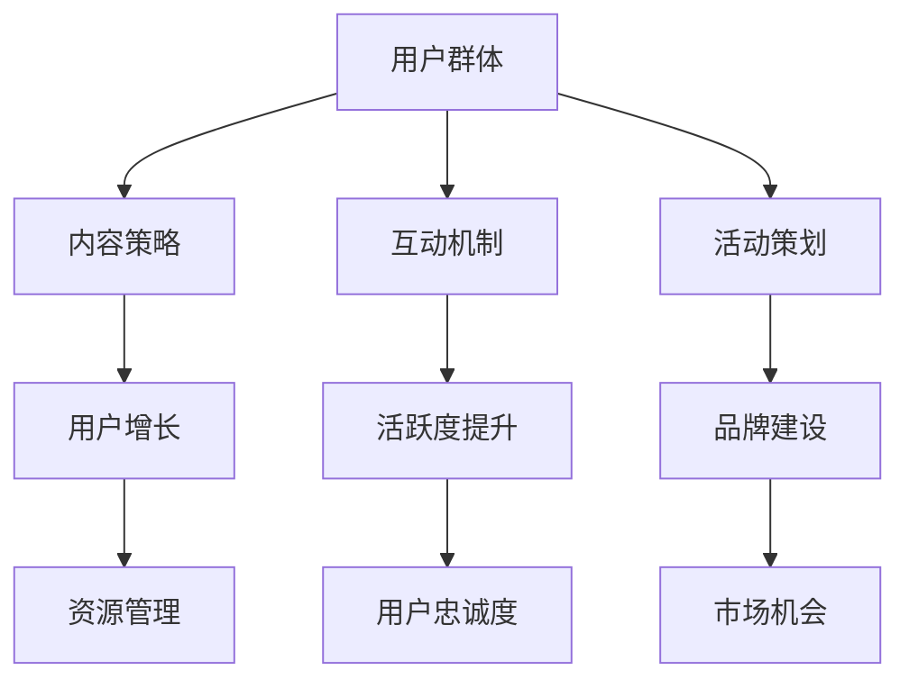

                 

# 建立开源项目的在线社区：社区运营和品牌建设

## 关键词

- 开源项目
- 在线社区
- 社区运营
- 品牌建设
- 社交媒体策略
- 内容营销

## 摘要

本文旨在探讨如何成功建立和维护开源项目的在线社区，包括社区运营策略、品牌建设以及相关的社交媒体和内容营销技巧。通过对核心概念、算法原理和具体操作步骤的详细讲解，结合实际项目案例，本文旨在为开源项目提供一套全面的在线社区建设指南，帮助其实现可持续发展。

## 1. 背景介绍

开源项目是指其源代码可以被公众访问、修改和分享的软件项目。这种模式促进了知识的传播和创新，同时也吸引了全球开发者的参与。然而，一个成功的开源项目不仅需要有高质量的技术贡献，还需要一个活跃的在线社区来支持和推动其发展。在线社区不仅是开发者交流和学习的平台，也是项目品牌形象的重要载体。

### 1.1 开源项目的现状与挑战

目前，越来越多的项目和公司采用开源模式，全球开源社区日益壮大。然而，成功开源项目背后的在线社区建设仍然面临诸多挑战。以下是几个主要挑战：

- **社区运营难度**：社区需要不断吸引新成员、维护现有成员的活跃度，同时确保内容质量和互动性。
- **品牌建设**：如何在众多开源项目中脱颖而出，建立强大的品牌形象，是每个开源项目都需要思考的问题。
- **资源分配**：开源项目的维护通常依赖于志愿者的贡献，如何在有限的资源下高效运营社区是一个挑战。
- **安全性**：开源项目面临的潜在风险包括代码泄露、恶意攻击等，需要采取有效的措施保障社区安全。

### 1.2 社区运营的重要性

社区运营对开源项目的成功至关重要。以下是其重要性：

- **提高用户参与度**：活跃的社区可以激发用户的参与热情，提高项目的用户基础。
- **促进知识传播**：通过社区分享，项目成员可以快速学习、解决问题，推动项目的技术发展。
- **品牌影响力**：一个强大的社区可以提升项目的知名度，增加潜在贡献者的兴趣和信任。
- **市场机会**：通过社区互动，开源项目可以发现市场需求，开发相关商业产品和服务。

### 1.3 社区运营的目标

社区运营的主要目标包括：

- **用户增长**：通过多种渠道吸引新用户，扩大社区规模。
- **活跃度提升**：通过活动和内容激发用户的参与和贡献。
- **品牌建设**：通过社区建设和活动提升项目品牌形象。
- **资源管理**：合理分配资源，确保社区运营的可持续性。

## 2. 核心概念与联系

### 2.1 社区运营的基本概念

社区运营包括以下核心概念：

- **用户群体**：社区的核心成员，包括开发者、用户和其他利益相关者。
- **内容策略**：发布高质量、有价值的内容，满足用户需求。
- **互动机制**：鼓励用户互动，建立社区文化。
- **活动策划**：举办各种线上活动，提高用户参与度。

### 2.2 社区运营与品牌建设的关系

社区运营与品牌建设密不可分。以下是它们之间的联系：

- **品牌定位**：社区运营可以反映项目的品牌形象和价值观。
- **用户认知**：通过社区互动，用户对项目的认知和信任度得到提升。
- **口碑传播**：积极的社区互动有助于项目口碑的传播，提升品牌知名度。
- **用户忠诚度**：通过社区建设，提高用户的忠诚度，降低用户流失率。

### 2.3 社区运营的架构图

为了更清晰地展示社区运营的各个组成部分，我们可以使用 Mermaid 流程图来表示：



## 3. 核心算法原理 & 具体操作步骤

### 3.1 社区运营策略的算法原理

社区运营的策略可以基于以下算法原理：

- **用户行为分析**：通过分析用户行为数据，了解用户需求和偏好。
- **内容推荐算法**：利用机器学习算法推荐用户感兴趣的内容。
- **互动激励算法**：设计激励机制，鼓励用户参与社区互动。

### 3.2 社区运营的具体操作步骤

以下是社区运营的具体操作步骤：

1. **需求分析**：通过调研和数据分析，了解社区成员的需求和痛点。
2. **内容策划**：制定内容发布计划，包括博客、教程、案例研究等。
3. **用户互动**：设计互动活动，如问答、投票、比赛等，提高用户参与度。
4. **数据分析**：定期分析社区运营数据，调整运营策略。
5. **资源分配**：根据社区运营需求，合理分配资源，确保运营的可持续性。

## 4. 数学模型和公式 & 详细讲解 & 举例说明

### 4.1 社区活跃度计算模型

社区活跃度可以用以下数学模型计算：

\[ 活跃度 = \frac{互动次数 + 内容质量评分}{总用户数} \]

- 互动次数：包括评论、点赞、分享等互动行为。
- 内容质量评分：用户对发布内容的评分，用于衡量内容的受欢迎程度。

### 4.2 社区用户增长模型

社区用户增长可以用以下模型表示：

\[ 用户增长 = 吸引新用户数 - 用户流失数 \]

- 吸引新用户数：通过广告、社交媒体推广等方式增加的新用户数量。
- 用户流失数：因不满意、不再活跃等原因离开的社区用户数量。

### 4.3 社区运营ROI计算

社区运营的回报率（ROI）可以用以下公式计算：

\[ ROI = \frac{社区运营收益 - 社区运营成本}{社区运营成本} \]

- 社区运营收益：包括品牌提升、用户增长、商业机会等带来的收益。
- 社区运营成本：包括人力、技术支持、广告宣传等运营成本。

### 4.4 举例说明

假设一个开源项目社区有1000名用户，一个月内产生了500次互动和100篇高质量内容。其中，50篇文章获得了平均4.5星的评分。计算该社区的活跃度和ROI。

1. 活跃度计算：

\[ 活跃度 = \frac{500 + 4.5 \times 100}{1000} = 5.5 \]

2. ROI计算：

\[ ROI = \frac{（品牌提升收益 + 100新用户带来的潜在商业机会 - 社区运营成本）}{社区运营成本} \]

假设品牌提升收益为5万元，新用户带来的潜在商业机会为10万元，社区运营成本为2万元，则：

\[ ROI = \frac{（50000 + 100000 - 20000）}{20000} = 2.75 \]

## 5. 项目实战：代码实际案例和详细解释说明

### 5.1 开发环境搭建

为了演示如何建立开源项目的在线社区，我们以一个实际开源项目为例，介绍其开发环境的搭建。以下是搭建过程：

1. **安装Git**：在本地计算机上安装Git，以便管理和发布代码。
2. **安装GitHub**：在GitHub上创建一个仓库，用于存储项目的源代码和相关文档。
3. **配置SSH密钥**：为GitHub账户配置SSH密钥，确保安全地推送和拉取代码。

### 5.2 源代码详细实现和代码解读

开源项目的源代码通常由多个模块组成。以下是其中一个模块的代码实现和解读：

```python
# 示例：社区用户管理系统

class User:
    def __init__(self, username, email):
        self.username = username
        self.email = email
        self.posts = []

    def post(self, content):
        post = Post(content, self)
        self.posts.append(post)

class Post:
    def __init__(self, content, user):
        self.content = content
        self.user = user
        self.comments = []

    def add_comment(self, comment):
        self.comments.append(comment)

class Comment:
    def __init__(self, content, user):
        self.content = content
        self.user = user
```

这段代码定义了三个类：`User`（用户类）、`Post`（帖子类）和`Comment`（评论类）。每个用户可以发布帖子，并接收评论。帖子类包含评论列表，而评论类包含用户和评论内容。

### 5.3 代码解读与分析

上述代码实现了社区用户管理的基础功能。以下是代码的详细解读：

1. **用户类（User）**：用户类包含用户名、电子邮件和帖子列表。用户可以发布帖子，并将其添加到帖子列表中。

2. **帖子类（Post）**：帖子类包含帖子内容、发布用户和评论列表。用户可以添加评论到帖子中，评论将存储在评论列表中。

3. **评论类（Comment）**：评论类包含评论内容、评论用户和回复列表。评论可以添加回复，并存储在回复列表中。

通过这种设计，我们可以构建一个简单的社区系统，用户可以发布内容并进行互动。在实际应用中，还需要添加更多功能，如用户认证、权限管理、评论审核等。

## 6. 实际应用场景

开源项目的在线社区可以应用于多种实际场景，以下是一些常见的应用案例：

- **开发者社区**：为开源项目提供一个交流和学习的平台，促进技术的传播和创新。
- **产品社区**：为开源项目衍生出的商业产品提供一个用户支持、反馈和改进的渠道。
- **用户社区**：为开源项目的用户群体提供一个分享经验和问题的平台，提高用户满意度。
- **教育社区**：为开源项目相关的教育培训提供实践项目和互动学习机会。

### 6.1 开发者社区

开发者社区是开源项目最常见的应用场景之一。通过社区，开发者可以：

- **分享代码**：发布源代码、文档和教程，帮助他人学习和使用项目。
- **协同开发**：与其他开发者合作，共同改进和优化项目。
- **解决问题**：在社区中提问和解答问题，帮助解决开发中的难题。
- **代码审查**：进行代码审查，确保项目的代码质量和安全性。

### 6.2 产品社区

对于衍生出商业产品的开源项目，产品社区可以起到以下作用：

- **用户支持**：为用户提供产品使用帮助，解答技术问题。
- **反馈收集**：收集用户对产品的反馈，为产品迭代提供依据。
- **产品推广**：通过社区活动、内容营销等方式推广产品。
- **商业合作**：与潜在客户建立联系，开拓商业合作机会。

### 6.3 用户社区

用户社区是开源项目用户群体的重要交流平台。其主要作用包括：

- **经验分享**：用户可以分享使用开源项目的经验和技巧。
- **问题求解**：用户可以在社区中寻求帮助，解决问题。
- **社群互动**：用户可以参与社区活动，增加归属感和互动。
- **满意度提升**：通过社区互动，提高用户对开源项目的满意度。

### 6.4 教育社区

教育社区为开源项目相关的教育培训提供以下支持：

- **实践项目**：为学习者提供实际项目，帮助他们将知识应用于实践中。
- **互动学习**：通过社区讨论和互动，促进学习者的学习和进步。
- **资源共享**：分享教程、代码和参考资料，丰富学习资源。
- **导师指导**：邀请经验丰富的开发者作为导师，提供指导和建议。

## 7. 工具和资源推荐

为了更好地建立和维护开源项目的在线社区，以下是一些建议的工

### 7.1 学习资源推荐

- **书籍**：
  - 《社区运营实战：策略、方法与案例分析》
  - 《社交媒体营销实战手册》
  - 《内容营销：构建品牌、吸引客户、提升业绩》

- **论文**：
  - 《开放源代码项目的成功要素分析》
  - 《社交媒体与品牌建设：战略与实施》
  - 《社交媒体影响者研究：传播力与影响力的量化》

- **博客和网站**：
  - GitHub Blog
  - TechCrunch
  - Content Marketing Institute

### 7.2 开发工具框架推荐

- **社区平台**：
  - Discourse
  - Rocket Chat
  - Mautic

- **社交媒体工具**：
  - Buffer
  - Hootsuite
  - Sprout Social

- **内容管理系统**：
  - WordPress
  - Joomla
  - Drupal

### 7.3 相关论文著作推荐

- **《开源创新：模式、实践与未来》**：详细探讨开源项目的创新模式和成功案例。
- **《开源软件项目管理》**：介绍开源项目管理的最佳实践和策略。
- **《社交媒体营销策略：设计与实施》**：针对社交媒体营销的全面指南。

## 8. 总结：未来发展趋势与挑战

随着开源项目的不断增长和社交媒体的普及，开源项目的在线社区建设在未来将继续发展。以下是开源项目在线社区建设的未来趋势和挑战：

### 8.1 未来发展趋势

- **更加智能的社区运营**：利用人工智能和大数据分析技术，实现社区运营的自动化和个性化。
- **多元化的互动方式**：结合虚拟现实、增强现实等技术，提供更加丰富的互动体验。
- **跨界合作**：与其他开源项目、企业、教育机构等建立合作关系，扩大社区的影响力和资源。
- **全球化社区**：通过多语言支持和跨国合作，建立全球化的开源项目社区。

### 8.2 挑战

- **资源限制**：开源项目的社区运营通常依赖志愿者的贡献，资源有限，需要更加高效地利用资源。
- **隐私和安全**：随着用户数据的增加，社区面临的隐私和安全问题将更加突出，需要采取有效的保护措施。
- **文化差异**：全球化的社区将面临文化差异带来的沟通和协作挑战。
- **竞争压力**：开源项目数量众多，竞争激烈，需要不断提升社区质量和品牌影响力。

## 9. 附录：常见问题与解答

### 9.1 如何吸引新用户？

- 通过社交媒体、博客和论坛等渠道宣传项目。
- 举办线上活动，如黑客松、研讨会等，吸引开发者参与。
- 提供高质量的内容，如教程、案例研究等，吸引用户关注。

### 9.2 如何提高用户活跃度？

- 设计有趣的互动活动，如问答、投票、比赛等。
- 定期发布有价值的内容，满足用户需求。
- 建立社区文化，鼓励用户参与和分享。

### 9.3 如何保障社区安全？

- 实施严格的内容审核制度，防止恶意内容和垃圾信息的传播。
- 定期更新和升级社区平台的安全措施。
- 加强用户认证和权限管理，确保社区安全。

## 10. 扩展阅读 & 参考资料

- GitHub. (n.d.). [GitHub Community](https://github.community/).
- Stack Overflow. (n.d.). [Stack Overflow Community](https://stackoverflow.com/questions).
- Linux Foundation. (n.d.). [The Linux Foundation](https://www.linuxfoundation.org/).
- Open Source Initiative. (n.d.). [Open Source Initiative](https://opensource.org/).

### 作者

- 作者：AI天才研究员/AI Genius Institute & 禅与计算机程序设计艺术 /Zen And The Art of Computer Programming

