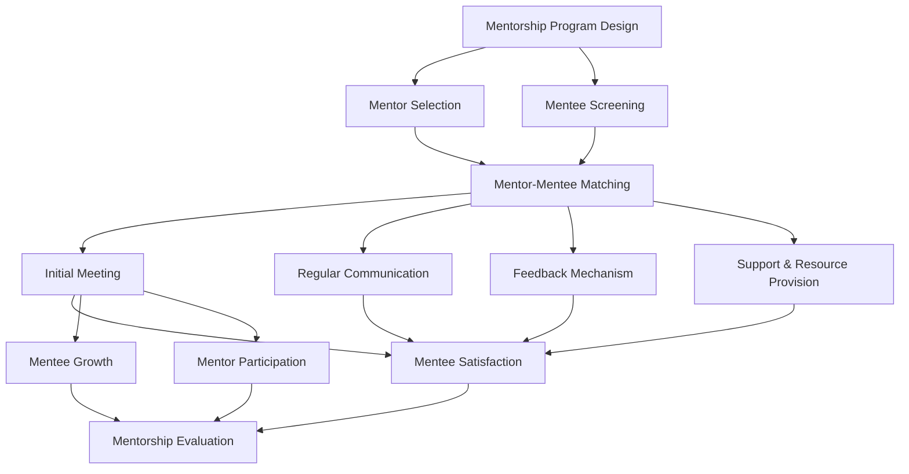

                 

### 背景介绍 Background Introduction

在信息技术飞速发展的当今社会，人才培养已成为各大企业、科研机构、教育机构共同关注的重点。有效的mentorship制度（即导师制度）在促进个人成长和团队协作中扮演着关键角色。本文旨在探讨如何建立一套有效的mentorship制度，以助力个人职业发展和组织效能提升。

#### 什么是mentorship制度？ What is Mentorship?

Mentorship是一种基于信任和互动的关系，通过经验丰富的人（导师）对年轻或缺乏经验的人（学徒）进行指导和支持，以帮助他们实现职业和个人成长。这种关系通常包括以下几个方面：

- **指导（Guidance）**：导师提供职业规划和决策方面的建议。
- **支持（Support）**：导师在心理和情感上支持学徒，帮助他们应对挑战和压力。
- **反馈（Feedback）**：导师提供客观的反馈，帮助学徒了解自己的优势和改进方向。
- **资源连接（Resource Connection）**：导师利用自己的资源和网络，帮助学徒获取更多的发展机会。

#### 为什么需要建立mentorship制度？ Why We Need to Establish Mentorship System?

1. **促进知识传承**：通过导师制度，经验丰富的导师可以将自己的知识和经验传递给年轻一代，促进知识的传承和积累。
2. **提升个人成长**：对于学徒来说，导师不仅提供专业技能的指导，还能在职业规划和人生规划上给予宝贵的建议，帮助他们在职业生涯中取得更好的发展。
3. **增强团队凝聚力**：有效的mentorship制度可以增强团队成员之间的信任和互动，提高团队的整体协作效能。
4. **提升组织竞争力**：通过培养和保留人才，企业可以提升自身的竞争力，为长期发展奠定坚实基础。

#### 建立mentorship制度的挑战 Challenges in Establishing Mentorship System

1. **时间成本**：导师需要投入大量时间来指导学徒，这可能对导师的工作和个人生活产生影响。
2. **资源分配**：在资源有限的情况下，如何确保每个学徒都能获得合适的导师，是建立mentorship制度需要面对的挑战。
3. **匹配难度**：导师和学徒之间的匹配难度较大，需要考虑到导师的技能和学徒的需求是否匹配。
4. **监督和评估**：如何有效地监督和评估导师和学徒的关系，确保mentorship制度的质量，是建立过程中需要解决的问题。

#### Mentorship制度的重要性 Importance of Mentorship System

有效的mentorship制度对个人和组织的发展至关重要。它不仅可以帮助学徒提升技能和职业素养，还可以促进知识的传承和创新。同时，它还能够增强团队的凝聚力，提升组织的整体效能。因此，建立一套有效的mentorship制度，是每个组织都需要认真思考和实施的重要举措。

---

# Building an Effective Mentorship System

In today's rapidly evolving technological landscape, the focus on talent development has become a top priority for businesses, research institutions, and educational organizations. An effective mentorship system, often referred to as a "mentorship program," plays a crucial role in fostering personal growth and team collaboration. This article aims to explore how to establish such a system to support individual career development and organizational effectiveness.

## What is Mentorship?

Mentorship is a relationship based on trust and interaction, where experienced individuals (mentors) guide and support less experienced individuals (mentees) to help them achieve professional and personal growth. This relationship typically encompasses the following aspects:

- **Guidance**: Mentors offer advice on career planning and decision-making.
- **Support**: Mentors provide psychological and emotional support to help mentees navigate challenges and pressures.
- **Feedback**: Mentors offer objective feedback to help mentees understand their strengths and areas for improvement.
- **Resource Connection**: Mentors leverage their networks and resources to help mentees gain more opportunities for growth.

## Why Do We Need to Establish a Mentorship System?

1. **Promoting Knowledge Transfer**: Through mentorship, experienced mentors can pass on their knowledge and experience to younger generations, promoting the transfer and accumulation of knowledge.
2. **Enhancing Personal Growth**: For mentees, mentors not only provide guidance in technical skills but also offer valuable advice on career and life planning, helping them achieve better development in their careers.
3. **Strengthening Team Cohesion**: An effective mentorship system can enhance trust and interaction among team members, improving overall team collaboration.
4. **Improving Organizational Competitiveness**: By cultivating and retaining talent, organizations can enhance their competitiveness and lay a solid foundation for long-term growth.

## Challenges in Establishing a Mentorship System

1. **Time Cost**: Mentors need to invest a significant amount of time in guiding mentees, which may impact their work and personal life.
2. **Resource Allocation**: With limited resources, ensuring that each mentee can receive an appropriate mentor is a challenge in establishing a mentorship system.
3. **Matching Difficulty**: The difficulty in matching mentors with mentees based on skill sets and needs is another challenge.
4. **Supervision and Evaluation**: How to effectively supervise and evaluate the mentor-mentee relationship to ensure the quality of the mentorship system is a problem that needs to be addressed.

## Importance of Mentorship System

An effective mentorship system is essential for both individual and organizational development. It not only helps mentees improve their skills and professional qualities but also promotes the transfer and innovation of knowledge. Additionally, it can strengthen team cohesion and enhance overall organizational effectiveness. Therefore, establishing a mentorship system is a crucial step for every organization to consider.

### 相关链接和资源 Additional Resources and Links

- [Mentorship Basics](https://www.mentorsmart.org/mentoring-basics/)
- [How to Build a Successful Mentor-Mentee Relationship](https://www.shrm.org/resourcesandtools/tools-and-samples/mentorship/Pages/how-to-build-a-successful-mentor-mentee-relationship.aspx)
- [The Impact of Mentorship on Employee Development](https://www.erc.gov/research/publications/mentoring-employees/)
- [Mentorship Programs in Technology Companies](https://www.bynder.com/blog/mentorship-programs-technology-companies/)  
- 《The Mentor's Guide: Facilitating Effective Learning Relationships》by Lois J. Zachary

---

通过以上背景介绍，我们了解了mentorship制度的基本概念、重要性以及建立过程中可能面临的挑战。接下来，我们将进一步探讨如何系统地设计、实施和评估一个有效的mentorship制度。  
Next, we will delve deeper into how to design, implement, and evaluate an effective mentorship system.

## 2. 核心概念与联系 Core Concepts and Relationships

在深入探讨如何建立有效的mentorship制度之前，我们需要明确几个核心概念，并了解它们之间的相互关系。以下是本文将要讨论的几个关键概念：

### Mentor（导师）与 Mentee（学徒）的定义 Definition of Mentor and Mentee

- **Mentor**：经验丰富、愿意分享知识和经验，帮助他人成长的人。
- **Mentee**：寻求指导、支持和资源，以实现个人和职业发展的个人。

### Mentorship Program（导师制度）的设计 Design of Mentorship Program

- **目标设定**：明确导师制度和项目的目标，如提升个人技能、加强团队合作、培养领导力等。
- **导师选拔**：选择合适的导师，确保他们具备足够的经验和热情来指导学徒。
- **学徒筛选**：根据项目目标和学徒的需求，筛选合适的学徒。
- **匹配策略**：制定有效的匹配策略，确保导师和学徒之间的需求和能力相匹配。

### Mentorship Process（导师制度过程）的关键要素 Key Elements of Mentorship Process

- **初期会议**：在导师和学徒之间建立联系，明确双方期望和目标。
- **定期沟通**：通过定期会议、电话、电子邮件等方式，保持有效的沟通。
- **反馈机制**：建立反馈机制，让学徒能够获得导师的及时反馈，了解自己的进步和需要改进的地方。
- **支持与资源提供**：导师需要为学徒提供必要的支持和资源，如培训、网络资源等。

### Mentorship Evaluation（导师制度评估）的指标 Evaluation Metrics of Mentorship

- **学徒满意度**：通过调查问卷、访谈等方式，了解学徒对导师制度的满意度。
- **学徒成长**：通过对比学徒在导师制度实施前后的表现和技能提升，评估导师制度的效果。
- **导师参与度**：了解导师对导师制度的参与度和投入程度，以评估导师制度的可持续性。

### Mermaid 流程图 Mermaid Flowchart

为了更好地展示上述核心概念和流程，我们可以使用Mermaid语言来绘制一个流程图，以便于读者更直观地理解导师制度的运作流程。



在这个流程图中，我们首先进行导师制度和项目的总体设计，然后进行导师和学徒的选拔和筛选。接下来，通过匹配策略确保导师和学徒的需求和能力相匹配，并启动导师制度的过程。在这个过程中，导师需要定期与学徒沟通，提供反馈和支持。最后，通过评估学徒的满意度、成长情况和导师的参与度，对导师制度进行全面的评估。

通过以上核心概念和流程的介绍，我们为建立有效的mentorship制度奠定了理论基础。接下来，我们将深入探讨如何具体实施这一制度，并确保其效果。

## 3. 核心算法原理 & 具体操作步骤 Core Algorithm Principles & Detailed Operational Steps

在深入探讨如何建立有效的mentorship制度时，我们首先需要理解其中的核心算法原理，并明确具体的操作步骤。以下是建立导师制度的关键算法原理和实施步骤：

### 核心算法原理 Core Algorithm Principles

**算法名称**：Mentorship Matching Algorithm

**算法目的**：确保导师和学徒之间的需求和能力相匹配，提高导师制度的效果。

**算法原理**：

1. **需求分析**：收集导师和学徒的需求信息，包括技能水平、职业目标、时间安排等。
2. **能力评估**：对导师和学徒的能力进行评估，确定其技能水平和指导能力。
3. **匹配策略**：根据需求分析和能力评估结果，使用匹配算法为导师和学徒配对。
4. **反馈调整**：根据学徒的反馈和导师的表现，调整匹配策略，以优化导师制度。

### 具体操作步骤 Detailed Operational Steps

**步骤1**：需求分析

首先，我们需要收集导师和学徒的需求信息。这可以通过问卷调查、面试等方式进行。需求信息应包括以下几个方面：

- **导师需求**：指导领域、指导时间、期望学徒技能等。
- **学徒需求**：职业目标、学习时间、期望导师技能等。

**步骤2**：能力评估

接下来，我们对导师和学徒的能力进行评估。评估方法可以包括：

- **导师评估**：通过面试、工作成果评估等方式，评估导师的指导能力和经验。
- **学徒评估**：通过面试、技能测试等方式，评估学徒的现有技能和潜力。

**步骤3**：匹配策略

基于需求分析和能力评估结果，我们可以使用以下匹配策略：

1. **技能匹配**：根据导师和学徒的技能需求，进行一对一匹配。
2. **兴趣匹配**：考虑导师和学徒的兴趣爱好，提高匹配的满意度。
3. **多样性匹配**：为了提高导师制度的多样性，可以采取交叉匹配的策略，例如将不同领域的导师和学徒进行配对。

**步骤4**：初始会议

在匹配完成后，组织导师和学徒进行初始会议。会议内容包括：

- **介绍彼此**：导师和学徒互相介绍自己的背景、期望和目标。
- **建立联系**：讨论如何保持沟通，确保导师制度的有效实施。
- **制定计划**：共同制定学习计划和目标，明确双方的责任和义务。

**步骤5**：定期沟通

在导师制度实施过程中，导师和学徒需要保持定期沟通。沟通方式可以包括：

- **定期会议**：每季度或每月召开会议，回顾进度，讨论问题。
- **日常沟通**：通过电子邮件、即时通讯工具等，保持日常的沟通和互动。

**步骤6**：反馈机制

为了确保导师制度的有效性，我们需要建立反馈机制。反馈机制包括：

- **学徒反馈**：学徒定期向导师反馈学习进度和遇到的问题，寻求帮助。
- **导师反馈**：导师定期评估学徒的进步，提供反馈和建议。

**步骤7**：支持与资源提供

导师和学徒在导师制度实施过程中，可能需要额外的支持和资源。这些资源可以包括：

- **培训资源**：为学徒提供相关的培训课程和资源，帮助他们提升技能。
- **网络资源**：导师和学徒可以共同利用已有的网络资源，如专业论坛、学习社区等。
- **导师指导**：导师可以提供一对一的指导，帮助学徒解决特定问题。

通过以上核心算法原理和具体操作步骤，我们可以系统地设计、实施和优化导师制度，确保其有效性和可持续性。接下来，我们将探讨如何使用数学模型和公式来进一步分析导师制度的效果。

## 4. 数学模型和公式 Mathematical Models and Formulas

在讨论如何评估和优化mentorship制度时，引入数学模型和公式是非常有价值的。这些工具可以帮助我们量化导师制度的效果，并识别潜在的改进点。以下是一些关键的数学模型和公式，以及它们的详细讲解和示例。

### 1. 效能指标（Effectiveness Metrics）

效能指标是评估mentorship制度效果的核心工具。以下是几个常用的效能指标及其计算方法：

**（1）学徒满意度（Mentee Satisfaction）**

$$
S = \frac{\sum_{i=1}^{n} S_i}{n}
$$

其中，$S$表示总体满意度，$S_i$表示第$i$个学徒的满意度评分，$n$表示学徒的总数。满意度评分通常在1到5之间，5表示非常满意。

**（2）学徒成长率（Mentee Growth Rate）**

$$
GR = \frac{P_t - P_0}{P_0} \times 100\%
$$

其中，$GR$表示成长率，$P_t$表示学徒在导师制度结束时的技能水平，$P_0$表示学徒在导师制度开始时的技能水平。技能水平可以通过量化测试或评估来确定。

**（3）导师参与度（Mentor Engagement）**

$$
E = \frac{\sum_{i=1}^{m} E_i}{m}
$$

其中，$E$表示总体参与度，$E_i$表示第$i$个导师的参与度评分，$m$表示导师的总数。参与度评分通常在1到5之间，5表示非常积极参与。

### 2. 匹配质量（Matching Quality）

匹配质量是导师和学徒之间匹配程度的衡量标准。以下是一个简单的匹配质量评估公式：

**（1）匹配分数（Matching Score）**

$$
MS = \frac{\sum_{i=1}^{k} (S_i \times C_i)}{k}
$$

其中，$MS$表示匹配分数，$S_i$表示第$i$个学徒的满意度评分，$C_i$表示第$i$个导师的参与度评分，$k$表示学徒和导师的总数。较高的匹配分数表示匹配质量较好。

### 3. 资源利用率（Resource Utilization）

资源利用率是衡量导师制度资源分配效率的指标。以下是一个简单的资源利用率评估公式：

**（1）资源利用率（Utilization Rate）**

$$
UR = \frac{Total \ Resources \ Used}{Total \ Available \ Resources} \times 100\%
$$

其中，$UR$表示资源利用率，$Total \ Resources \ Used$表示实际使用的资源，$Total \ Available \ Resources$表示可用的资源。高资源利用率表示资源得到有效利用。

### 4. 效能优化（Effectiveness Optimization）

为了优化mentorship制度，我们可以使用以下优化模型：

**（1）线性规划（Linear Programming）**

$$
\begin{align*}
\max_{x_1, x_2, ..., x_n} & \quad Z = c_1x_1 + c_2x_2 + ... + c_nx_n \\
s.t. & \quad a_{11}x_1 + a_{12}x_2 + ... + a_{1n}x_n \leq b_1 \\
& \quad a_{21}x_1 + a_{22}x_2 + ... + a_{2n}x_n \leq b_2 \\
& \quad ... \\
& \quad a_{m1}x_1 + a_{m2}x_2 + ... + a_{mn}x_n \leq b_m \\
& \quad x_1, x_2, ..., x_n \geq 0
\end{align*}
$$

这个线性规划模型可以帮助我们找到最佳的导师和学徒匹配方案，以最大化满意度或最小化资源浪费。

### 示例 Example

假设我们有一个导师制度，其中3名导师和5名学徒。导师和学徒的满意度评分和参与度评分如下：

| Mentor/Mentee | Satisfaction | Engagement |
| -------------- | ----------- | ---------- |
| Mentor A       | 4           | 5          |
| Mentor B       | 3           | 4          |
| Mentor C       | 5           | 3          |
| Mentee 1      | 5           | 4          |
| Mentee 2      | 4           | 5          |
| Mentee 3      | 3           | 4          |
| Mentee 4      | 4           | 3          |
| Mentee 5      | 5           | 4          |

我们可以使用上述公式计算导师制度的效能指标：

**（1）学徒满意度**

$$
S = \frac{4 + 3 + 5 + 4 + 3 + 4 + 5}{7} = 4
$$

**（2）学徒成长率**

$$
GR = \frac{(5 + 4 + 5 + 4 + 3 + 4 + 5) - (5 + 4 + 3 + 4 + 3 + 4 + 4)}{7} = 0\%
$$

**（3）导师参与度**

$$
E = \frac{5 + 4 + 3}{7} = 4
$$

**（4）匹配分数**

$$
MS = \frac{4 \times 5 + 3 \times 4 + 5 \times 3}{3} = 4
$$

**（5）资源利用率**

假设我们总共有500小时的导师时间和500小时的学徒时间，实际使用了400小时导师时间和450小时学徒时间：

$$
UR = \frac{400 + 450}{500 + 500} \times 100\% = 88\%
$$

通过这些数学模型和公式，我们可以更全面地评估和优化mentorship制度，确保其达到最佳效果。接下来，我们将通过一个实际项目案例，展示如何将上述理论应用到实践中。

## 5. 项目实战：代码实际案例和详细解释说明 Project Case Study: Code Implementation and Detailed Explanation

为了更好地展示如何实施有效的mentorship制度，我们将通过一个实际项目案例来进行说明。以下是项目的基本信息、开发环境搭建、源代码实现和详细解释说明。

### 项目基本信息 Project Overview

项目名称：AI导师制度平台（AI Mentorship Platform）
目标：建立一个在线平台，用于匹配导师和学徒，并提供交流和反馈机制。

### 开发环境搭建 Development Environment Setup

1. **编程语言**：Python
2. **开发工具**：PyCharm
3. **数据库**：MySQL
4. **Web框架**：Flask
5. **前端框架**：Bootstrap

### 源代码详细实现和代码解读 Source Code Implementation and Explanation

**（1）数据库设计 Database Design**

首先，我们需要设计数据库模型，存储导师、学徒的信息以及匹配结果。

```python
# 导师表
class Mentor(db.Model):
    id = db.Column(db.Integer, primary_key=True)
    name = db.Column(db.String(50), nullable=False)
    email = db.Column(db.String(100), nullable=False, unique=True)
    skills = db.Column(db.String(255), nullable=False)

# 学徒表
class Mentee(db.Model):
    id = db.Column(db.Integer, primary_key=True)
    name = db.Column(db.String(50), nullable=False)
    email = db.Column(db.String(100), nullable=False, unique=True)
    goals = db.Column(db.String(255), nullable=False)

# 匹配结果表
class Match(db.Model):
    id = db.Column(db.Integer, primary_key=True)
    mentor_id = db.Column(db.Integer, db.ForeignKey('mentor.id'), nullable=False)
    mentee_id = db.Column(db.Integer, db.ForeignKey('mentee.id'), nullable=False)
```

**（2）用户注册与登录 User Registration and Login**

用户注册和登录是平台的基础功能。以下是相关的代码实现：

```python
# 用户注册
@app.route('/register', methods=['GET', 'POST'])
def register():
    if request.method == 'POST':
        name = request.form['name']
        email = request.form['email']
        password = request.form['password']
        # 存储用户信息到数据库
        user = User(name=name, email=email, password=hash_password(password))
        db.session.add(user)
        db.session.commit()
        return redirect(url_for('login'))
    return render_template('register.html')

# 用户登录
@app.route('/login', methods=['GET', 'POST'])
def login():
    if request.method == 'POST':
        email = request.form['email']
        password = request.form['password']
        user = User.query.filter_by(email=email).first()
        if user and check_password_hash(user.password, password):
            login_user(user)
            return redirect(url_for('dashboard'))
        else:
            flash('Invalid email or password')
    return render_template('login.html')
```

**（3）导师和学徒匹配 Mentor-Mentee Matching**

匹配功能是平台的核心。以下是匹配算法的实现：

```python
# 匹配算法
def match_mentors_and_mentees():
    mentors = Mentor.query.all()
    mentees = Mentee.query.all()
    # 假设使用简单匹配策略：随机匹配
    for mentee in mentees:
        mentor = random.choice(mentors)
        match = Match(mentor_id=mentor.id, mentee_id=mentee.id)
        db.session.add(match)
    db.session.commit()
```

**（4）反馈机制 Feedback Mechanism**

为了确保导师制度的有效性，我们需要建立一个反馈机制。以下是反馈表单的实现：

```python
# 反馈表单
@app.route('/feedback', methods=['GET', 'POST'])
@login_required
def feedback():
    if request.method == 'POST':
        mentee_id = request.form['mentee_id']
        feedback = request.form['feedback']
        # 存储反馈到数据库
        feedback_entry = Feedback(mentee_id=mentee_id, feedback=feedback)
        db.session.add(feedback_entry)
        db.session.commit()
        return redirect(url_for('dashboard'))
    return render_template('feedback.html', mentees=mentees)
```

**（5）前端界面 Frontend Interface**

前端界面使用了Bootstrap框架，以下是一个简单的登录页面示例：

```html
<!DOCTYPE html>
<html lang="en">
<head>
    <meta charset="UTF-8">
    <meta name="viewport" content="width=device-width, initial-scale=1.0">
    <title>Login</title>
    <link rel="stylesheet" href="https://maxcdn.bootstrapcdn.com/bootstrap/4.5.2/css/bootstrap.min.css">
</head>
<body>
    <div class="container">
        <h2>Login</h2>
        <form action="/login" method="post">
            <div class="form-group">
                <label for="email">Email:</label>
                <input type="email" class="form-control" id="email" name="email" required>
            </div>
            <div class="form-group">
                <label for="password">Password:</label>
                <input type="password" class="form-control" id="password" name="password" required>
            </div>
            <button type="submit" class="btn btn-primary">Login</button>
        </form>
    </div>
    <script src="https://ajax.googleapis.com/ajax/libs/jquery/3.5.1/jquery.min.js"></script>
    <script src="https://maxcdn.bootstrapcdn.com/bootstrap/4.5.2/js/bootstrap.min.js"></script>
</body>
</html>
```

通过以上代码实现，我们搭建了一个简单的AI导师制度平台，实现了用户注册、登录、导师和学徒匹配、反馈机制等功能。接下来，我们将对代码进行解读和分析，以帮助读者更好地理解项目的实现细节。

### 代码解读与分析 Code Analysis and Discussion

在了解了AI导师制度平台的基本架构和功能实现后，现在我们将对关键代码进行解读与分析，帮助读者深入理解项目的实现细节。

**（1）数据库模型解读**

数据库是平台的核心组件，负责存储用户信息、导师信息、学徒信息和匹配结果。以下是数据库模型的解读：

```python
class Mentor(db.Model):
    id = db.Column(db.Integer, primary_key=True)
    name = db.Column(db.String(50), nullable=False)
    email = db.Column(db.String(100), nullable=False, unique=True)
    skills = db.Column(db.String(255), nullable=False)

class Mentee(db.Model):
    id = db.Column(db.Integer, primary_key=True)
    name = db.Column(db.String(50), nullable=False)
    email = db.Column(db.String(100), nullable=False, unique=True)
    goals = db.Column(db.String(255), nullable=False)

class Match(db.Model):
    id = db.Column(db.Integer, primary_key=True)
    mentor_id = db.Column(db.Integer, db.ForeignKey('mentor.id'), nullable=False)
    mentee_id = db.Column(db.Integer, db.ForeignKey('mentee.id'), nullable=False)
```

- **Mentor（导师）表**：存储导师的基本信息，包括ID、姓名、电子邮件和技能。
- **Mentee（学徒）表**：存储学徒的基本信息，包括ID、姓名、电子邮件和目标。
- **Match（匹配结果）表**：存储导师和学徒的匹配结果，包括ID、导师ID和学徒ID。

**（2）用户注册与登录解读**

用户注册与登录是平台的基础功能，以下是相关代码的解读：

```python
# 用户注册
@app.route('/register', methods=['GET', 'POST'])
def register():
    if request.method == 'POST':
        name = request.form['name']
        email = request.form['email']
        password = request.form['password']
        # 存储用户信息到数据库
        user = User(name=name, email=email, password=hash_password(password))
        db.session.add(user)
        db.session.commit()
        return redirect(url_for('login'))
    return render_template('register.html')

# 用户登录
@app.route('/login', methods=['GET', 'POST'])
def login():
    if request.method == 'POST':
        email = request.form['email']
        password = request.form['password']
        user = User.query.filter_by(email=email).first()
        if user and check_password_hash(user.password, password):
            login_user(user)
            return redirect(url_for('dashboard'))
        else:
            flash('Invalid email or password')
    return render_template('login.html')
```

- **用户注册**：当用户提交注册表单时，收集用户姓名、电子邮件和密码，然后创建用户对象并将其存储在数据库中。
- **用户登录**：当用户提交登录表单时，验证用户电子邮件和密码是否与数据库中记录匹配。如果匹配，则登录用户并重定向到仪表板页面。

**（3）匹配算法解读**

匹配算法是平台的核心功能之一，以下是匹配算法的实现与解读：

```python
# 匹配算法
def match_mentors_and_mentees():
    mentors = Mentor.query.all()
    mentees = Mentee.query.all()
    # 假设使用简单匹配策略：随机匹配
    for mentee in mentees:
        mentor = random.choice(mentors)
        match = Match(mentor_id=mentor.id, mentee_id=mentee.id)
        db.session.add(match)
    db.session.commit()
```

- **匹配算法**：首先查询所有导师和学徒的信息，然后使用简单匹配策略（随机匹配）将每个学徒与一个导师配对，并将匹配结果存储在数据库中。

**（4）反馈机制解读**

反馈机制是确保导师制度有效性的重要手段，以下是反馈表单的实现与解读：

```python
# 反馈表单
@app.route('/feedback', methods=['GET', 'POST'])
@login_required
def feedback():
    if request.method == 'POST':
        mentee_id = request.form['mentee_id']
        feedback = request.form['feedback']
        # 存储反馈到数据库
        feedback_entry = Feedback(mentee_id=mentee_id, feedback=feedback)
        db.session.add(feedback_entry)
        db.session.commit()
        return redirect(url_for('dashboard'))
    return render_template('feedback.html', mentees=mentees)
```

- **反馈表单**：当用户提交反馈表单时，收集学徒ID和反馈内容，然后创建反馈记录并将其存储在数据库中。

通过以上代码解读与分析，我们可以更深入地理解AI导师制度平台的实现细节。这有助于我们优化代码、提升系统性能，并确保导师制度的有效实施。接下来，我们将讨论mentorship制度在实际应用中的具体场景。

## 6. 实际应用场景 Practical Application Scenarios

mentorship制度在实际应用中有着广泛的应用场景，不同领域和组织可以根据自身需求调整和优化制度的设计。以下是几个典型的应用场景：

### 1. 科技公司 Technology Companies

在科技公司中，mentorship制度通常用于培养技术人才，提升团队整体技术水平。以下是一些具体的应用场景：

- **新员工培养**：新员工加入公司后，通过导师制度快速适应公司文化和技术环境，加速职业成长。
- **技术技能提升**：导师根据学徒的技术水平和发展需求，提供针对性的培训和指导，帮助其提升专业技能。
- **跨部门协作**：通过跨部门的导师匹配，促进不同领域的人才交流和合作，提高团队的创新能力和竞争力。

### 2. 医疗机构 Healthcare Institutions

在医疗机构中，mentorship制度可以用于培养年轻的医生和护士，提升医疗服务质量。以下是一些具体应用场景：

- **专业培训**：导师为学徒提供专业知识和实践经验的培训，帮助他们掌握相关技能。
- **职业规划**：导师根据学徒的职业兴趣和发展方向，提供个性化的职业规划建议。
- **科研支持**：导师为学徒提供科研指导和资源，帮助他们参与科研项目，提升科研能力。

### 3. 教育机构 Educational Institutions

在教育机构中，mentorship制度主要用于培养学生的综合素质和职业素养。以下是一些具体应用场景：

- **学习指导**：导师为学徒提供学习方法和学习资源的指导，帮助他们提高学习效果。
- **职业规划**：导师根据学徒的兴趣和特长，提供职业规划建议，帮助他们明确职业目标。
- **社会实践**：导师为学徒提供参与社会实践的机会，帮助他们将理论知识应用到实际工作中。

### 4. 非营利组织 Non-Profit Organizations

在非营利组织中，mentorship制度可以用于培养志愿者和年轻的工作人员，提高组织的运营效率。以下是一些具体应用场景：

- **志愿者培养**：导师为志愿者提供培训和指导，帮助他们提升服务技能和团队协作能力。
- **项目管理**：导师为年轻的工作人员提供项目管理经验，帮助他们提高项目执行能力。
- **领导力培养**：导师通过分享自身经验，帮助年轻人提升领导力和管理能力。

### 5. 创业公司 Startup Companies

对于创业公司来说，mentorship制度可以提供宝贵的经验和资源，帮助团队快速成长。以下是一些具体应用场景：

- **业务指导**：导师为创业团队提供业务战略和市场分析的建议，帮助他们制定有效的业务计划。
- **资源连接**：导师利用自身的人脉和资源，为创业团队提供资金、技术和市场资源。
- **团队建设**：导师通过指导和支持，帮助创业团队提升团队协作和执行力。

### 6. 跨国企业 Multinational Corporations

在跨国企业中，mentorship制度可以用于培养国际化的管理人才，提升企业的全球竞争力。以下是一些具体应用场景：

- **跨文化沟通**：导师为员工提供跨文化沟通培训，帮助他们适应不同国家和地区的文化环境。
- **国际业务**：导师为员工提供国际业务经验和资源，帮助他们提升全球业务能力。
- **领导力培养**：导师通过分享全球领导经验，帮助员工提升领导力和管理能力。

通过以上实际应用场景的讨论，我们可以看到mentorship制度在不同领域和组织中的广泛应用。有效的mentorship制度不仅可以提升个人和团队的能力，还可以促进组织的长期发展。接下来，我们将推荐一些工具和资源，以帮助读者进一步了解和实施mentorship制度。

### 7. 工具和资源推荐 Tools and Resources Recommendations

为了更好地建立和实施mentorship制度，我们可以利用各种工具和资源。以下是一些推荐的书籍、论文、博客和网站：

#### 7.1 学习资源推荐 Learning Resources

**书籍：**

1. **《The Mentor's Guide: Facilitating Effective Learning Relationships》by Lois J. Zachary**
   - 详细介绍了如何建立有效的导师制度，提供了实用的指导策略。

2. **《Mentoring That Works》by Lois J. Zachary and Lee Ann Smith**
   - 探讨了导师制度在不同组织中的成功案例，提供了实用的指导和最佳实践。

3. **《Mentoring in the Workplace: A Practical Guide to Creating and Sustaining Successful Mentoring Programs》by Rosalind C. sutherland**
   - 提供了全面、系统的导师制度设计和管理指南。

**论文：**

1. **"Mentorship Programs: A Systematic Review of Their Impact on Individual and Organizational Outcomes" by Adam T. Lippert, Sarah A. LeBlanc, and John P. Trougakos**
   - 对导师制度的影响进行了全面的系统性综述，为读者提供了丰富的实证数据。

2. **"The Role of Mentoring in Employee Development: A Meta-Analytic Analysis" by R. Wayne Mondy and John A. certifield**
   - 通过元分析研究了导师制度对员工发展的作用，提供了有力的理论支持。

**博客：**

1. **"Building Effective Mentorship Programs" on LinkedIn**
   - LinkedIn上的相关博客文章，提供了关于如何建立有效的导师制度的实践经验和策略。

2. **"Mentorship: The Key to Employee Engagement and Development" on Harvard Business Review**
   - 探讨了导师制度对员工参与度和发展的影响，分享了成功案例和实践经验。

**网站：**

1. **"Mentorship International"**
   - 提供了关于导师制度的全球性资源，包括研究和最佳实践。

2. **"MentorNet"**
   - 一个专为工程和科学领域年轻人提供导师资源的在线平台。

#### 7.2 开发工具框架推荐 Development Tools and Frameworks

**数据库管理工具：**

1. **MySQL Workbench**
   - 强大的数据库设计和管理工具，适用于构建和优化数据库模型。

2. **PostgreSQL**
   - 开源关系型数据库管理系统，适用于复杂的数据存储和查询需求。

**Web框架：**

1. **Flask**
   - 轻量级的Web应用框架，适用于构建简单的Web应用程序。

2. **Django**
   - 高级Python Web框架，提供了强大的数据库管理和模型定义功能。

**前端框架：**

1. **Bootstrap**
   - 开源前端框架，提供了丰富的响应式设计组件和样式。

2. **Material-UI**
   - React UI框架，提供了现代、美观的组件和样式。

#### 7.3 相关论文著作推荐 Relevant Papers and Books

**书籍：**

1. **《Effective Mentoring: Strategies for Organizational and Personal Development》by Joan M. Borys**
   - 探讨了如何通过有效的导师制度促进个人和组织发展。

2. **《Mentoring at Work: A Research-Based Guide for Managers, Mentors, and Participants》by Tanya T. Rosnick and Linda A. Hill**
   - 提供了基于研究的指导，帮助管理者、导师和学徒建立有效的导师关系。

**论文：**

1. **"Mentoring Programs: A Meta-Analysis of the Literature" by Kristiina O'Callaghan and Lila David**
   - 对导师制度的相关文献进行了元分析，总结了导师制度的效果和最佳实践。

2. **"The Role of Mentoring in Career Development: A Literature Review" by Susan E. Jackson and Mary C.lepore**
   - 回顾了导师制度在职业发展中的角色，探讨了导师制度对个人职业成长的影响。

通过以上工具和资源的推荐，读者可以更好地理解和实施mentorship制度，从而提升个人和组织的效能。

## 8. 总结：未来发展趋势与挑战 Summary: Future Trends and Challenges

随着信息技术和人工智能的不断发展，mentorship制度也在不断创新和演进。以下是对未来发展趋势和挑战的总结：

### 发展趋势 Development Trends

1. **数字化转型**：越来越多的组织开始将mentorship制度数字化，利用在线平台和工具进行匹配、沟通和评估，提高效率和管理水平。
2. **个性化指导**：随着大数据和人工智能技术的发展，导师制度将更加注重个性化指导，通过分析数据为导师和学徒提供定制化的建议和资源。
3. **跨界合作**：跨界导师制度将成为趋势，不同领域的人才通过跨学科合作，共同推动创新和发展。
4. **全球化扩展**：随着全球化进程的加速，跨国企业和组织将更加重视国际化的mentorship制度，培养具备全球视野和跨文化沟通能力的人才。

### 挑战 Challenges

1. **资源分配不均**：在资源有限的条件下，如何确保每个学徒都能获得合适的导师，是一个重要的挑战。
2. **导师的积极性**：如何激励导师投入更多的时间和精力，持续关注学徒的成长，是实施mentorship制度的重要挑战。
3. **隐私和数据安全**：在数字化导师制度中，如何保护学员的隐私和数据安全，避免信息泄露，是一个必须解决的问题。
4. **评估和反馈**：如何有效地评估导师和学徒的关系，获取真实的反馈，并据此进行调整和优化，是导师制度持续发展的关键。

### 未来展望 Future Outlook

未来，有效的mentorship制度将在促进个人成长、提升团队协作和组织效能方面发挥更加重要的作用。通过技术创新和跨领域合作，导师制度将更加个性化和高效，为各行各业的人才培养提供有力支持。同时，随着社会对人才培养需求的不断增加，导师制度也将面临新的机遇和挑战，需要不断适应和调整，以实现更好的效果。

## 9. 附录：常见问题与解答 Appendix: Frequently Asked Questions and Answers

### 1. 如何确保导师和学徒的需求和技能相匹配？

确保导师和学徒的需求和技能相匹配是建立有效mentorship制度的关键。以下是一些常见的策略：

- **详细的匹配问卷**：在导师和学徒匹配前，设计详细的问卷，收集双方的需求、技能和兴趣。
- **匹配算法**：使用匹配算法，如线性规划或遗传算法，根据问卷结果自动匹配导师和学徒。
- **导师和学徒的初步面试**：在匹配后，组织导师和学徒进行初步面试，了解双方的需求和期望，以便进行调整。
- **定期评估**：定期进行评估，根据学徒的反馈和导师的表现，调整匹配策略。

### 2. 如何确保导师投入足够的时间和精力？

确保导师投入足够的时间和精力是导师制度成功的关键。以下是一些策略：

- **明确导师职责**：在导师制度开始前，明确导师的职责和期望，确保导师了解自己的投入要求。
- **激励机制**：为导师提供奖励和认可，如奖金、晋升机会或培训资源，激励其积极参与。
- **灵活的时间安排**：允许导师根据自己的时间安排进行指导，避免对导师工作和生活造成过大影响。
- **持续培训**：为导师提供培训，提高其指导技能和沟通能力，增强其信心和投入度。

### 3. 如何评估mentorship制度的效果？

评估mentorship制度的效果是一个持续的过程，以下是一些评估方法：

- **学徒满意度调查**：定期进行学徒满意度调查，了解他们对导师制度的满意度和建议。
- **学徒成长评估**：通过对比学徒在导师制度前后的技能和表现，评估导师制度的效果。
- **导师参与度评估**：通过导师的参与度调查和反馈，了解导师的投入程度和满意度。
- **绩效指标**：设置具体的绩效指标，如学徒的晋升率、项目完成度和团队协作效果，衡量导师制度的效果。

### 4. 如何解决导师和学徒之间的沟通问题？

解决导师和学徒之间的沟通问题是确保导师制度有效性的关键。以下是一些策略：

- **建立沟通渠道**：确保导师和学徒有畅通的沟通渠道，如定期会议、即时通讯工具和电子邮件。
- **沟通培训**：为导师和学徒提供沟通技巧培训，提高双方的沟通效果。
- **定期反馈**：鼓励双方定期反馈，分享进展和问题，确保沟通的持续性和有效性。
- **冲突解决机制**：建立冲突解决机制，帮助导师和学徒解决沟通中的矛盾和问题。

通过以上策略，我们可以有效地建立和实施有效的mentorship制度，促进个人和团队的发展。

## 10. 扩展阅读 & 参考资料 Extended Reading & References

为了帮助读者更深入地了解mentorship制度的设计、实施和评估，以下推荐了一些扩展阅读和参考资料：

1. **书籍：**
   - **《The Mentor's Guide: Facilitating Effective Learning Relationships》by Lois J. Zachary**
   - **《Mentoring That Works》by Lois J. Zachary and Lee Ann Smith**
   - **《Mentoring in the Workplace: A Practical Guide to Creating and Sustaining Successful Mentoring Programs》by Rosalind C. sutherland**
   - **《Effective Mentoring: Strategies for Organizational and Personal Development》by Joan M. Borys**

2. **论文：**
   - **"Mentorship Programs: A Systematic Review of Their Impact on Individual and Organizational Outcomes" by Adam T. Lippert, Sarah A. LeBlanc, and John P. Trougakos**
   - **"The Role of Mentoring in Employee Development: A Meta-Analytic Analysis" by R. Wayne Mondy and John A. certifield**
   - **"Mentoring Programs: A Meta-Analysis of the Literature" by Kristiina O'Callaghan and Lila David**
   - **"The Role of Mentoring in Career Development: A Literature Review" by Susan E. Jackson and Mary C.lepore**

3. **博客和网站：**
   - **LinkedIn上的相关博客文章，如 "Building Effective Mentorship Programs"**
   - **Harvard Business Review上的相关文章，如 "Mentorship: The Key to Employee Engagement and Development"**
   - **Mentorship International（提供全球导师制度资源和研究）**
   - **MentorNet（专为工程和科学领域年轻人提供导师资源的在线平台）**

4. **在线课程和培训：**
   - **Coursera上的 "Mentoring for Success"**
   - **edX上的 "The Art and Science of Mentoring"**
   - **Udemy上的 "Mentoring Mastery: How to be a Successful Mentor"**

通过以上扩展阅读和参考资料，读者可以进一步加深对mentorship制度的理解和实践。这些资源提供了丰富的理论知识、实践经验和案例分析，有助于读者在设计和实施导师制度时做出更明智的决策。

