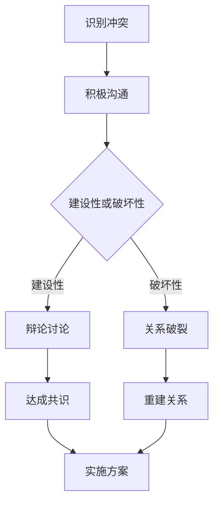

                 

# 建设性冲突：将分歧转化为创新动力的艺术

> **关键词**：建设性冲突、创新动力、团队合作、技术架构、算法原理、项目实战

> **摘要**：本文深入探讨了建设性冲突的概念及其在信息技术领域中的重要性。通过分析冲突的本质和影响因素，本文提出了将冲突转化为创新动力的方法和策略，并结合具体案例进行了详细阐述。文章旨在为IT专业人士提供一种新的视角，以更好地应对和利用冲突，推动技术进步和创新。

## 1. 背景介绍

在信息技术快速发展的今天，团队协作和知识共享成为推动技术进步的重要驱动力。然而，不同团队成员之间的意见分歧和冲突在所难免。这些分歧不仅可能阻碍项目的进展，还可能影响团队的整体效率。那么，如何将这些潜在的障碍转化为创新的动力，成为了一个值得探讨的问题。

建设性冲突（Constructive Conflict）作为一种积极的管理策略，旨在通过有效沟通和协作，将团队成员之间的分歧转化为创新思维和解决方案。这一概念在企业管理、团队建设和IT项目管理等领域有着广泛的应用。

本文将从以下几个方面展开讨论：

1. **核心概念与联系**：介绍建设性冲突的概念及其在信息技术中的应用。
2. **核心算法原理 & 具体操作步骤**：探讨如何利用建设性冲突来提升技术方案的创新性和实用性。
3. **数学模型和公式 & 详细讲解 & 举例说明**：通过数学模型和实际案例，展示建设性冲突的应用效果。
4. **项目实战：代码实际案例和详细解释说明**：结合具体项目案例，分析建设性冲突在实际开发中的应用。
5. **实际应用场景**：探讨建设性冲突在不同技术领域的应用场景和效果。
6. **工具和资源推荐**：介绍一些有助于利用建设性冲突的工具和资源。
7. **总结：未来发展趋势与挑战**：总结建设性冲突的未来发展趋势和面临的挑战。

通过本文的探讨，希望读者能够对建设性冲突有更深刻的认识，并学会将其有效地应用于实际工作中，为技术创新和团队协作注入新的活力。

## 2. 核心概念与联系

### 建设性冲突的定义

建设性冲突是指一种积极的、有建设性的分歧和争议，它不仅不会破坏团队协作，反而能够激发团队成员的创造力和创新思维。这种冲突的核心在于，团队成员能够在冲突中寻求共同点，通过辩论和讨论找到最优解决方案。

### 建设性冲突与破坏性冲突的区别

与破坏性冲突（Destructive Conflict）相比，建设性冲突具有以下几个显著特点：

1. **目标导向**：建设性冲突的目标是寻求最优解决方案，而破坏性冲突往往以个人利益为重，可能导致项目失败。
2. **积极沟通**：建设性冲突强调团队成员之间的积极沟通和协作，而破坏性冲突往往伴随着负面情绪和攻击性行为。
3. **持久性**：建设性冲突可能持续较长时间，但最终能够达成共识，而破坏性冲突往往迅速升级，导致关系破裂。

### 建设性冲突在信息技术中的应用

在信息技术领域，建设性冲突的应用主要体现在以下几个方面：

1. **技术决策**：在技术选型、架构设计等方面，团队成员可能持有不同意见。通过建设性冲突，可以充分讨论和评估各种方案的优缺点，最终找到最优解决方案。
2. **项目协作**：在项目开发过程中，团队成员可能会遇到技术难题和需求变化。建设性冲突有助于团队共同应对挑战，找到创新性的解决方案。
3. **知识共享**：建设性冲突可以激发团队成员的知识共享和经验交流，促进团队整体技术水平提升。

### 核心概念原理和架构的 Mermaid 流程图

以下是一个简化的建设性冲突流程图，展示了从冲突识别到解决方案形成的整个过程。



通过这个流程图，我们可以看到建设性冲突在团队协作中的重要作用。只有通过积极沟通和有效辩论，才能将冲突转化为创新的动力。

### 建设性冲突的驱动因素

建设性冲突的驱动因素主要包括以下几个方面：

1. **多样性**：团队成员背景、技能和知识领域的多样性是建设性冲突的重要来源。这种多样性可以为团队带来不同的视角和思路，促进创新。
2. **目标不一致**：团队成员可能对项目的目标有不同的理解或期望，这种目标不一致可能导致冲突。通过建设性冲突，可以明确团队目标，统一思想。
3. **技术挑战**：技术难题和需求变化是不可避免的。通过建设性冲突，团队可以共同应对挑战，找到更好的解决方案。

### 建设性冲突的益处

建设性冲突的益处主要体现在以下几个方面：

1. **提升决策质量**：通过辩论和讨论，团队成员能够更全面地评估各种方案，从而做出更高质量的决策。
2. **促进知识共享**：建设性冲突有助于团队成员分享知识和经验，提高团队整体技术水平。
3. **增强团队凝聚力**：建设性冲突通过积极沟通和协作，能够增强团队成员之间的信任和凝聚力。
4. **激发创新思维**：建设性冲突可以激发团队成员的创造力和创新思维，为技术进步和产品创新提供源源不断的动力。

### 建设性冲突的挑战

尽管建设性冲突具有诸多益处，但它在实际应用中也面临一些挑战：

1. **冲突控制**：如何确保建设性冲突不会升级为破坏性冲突，需要团队具备良好的冲突管理能力。
2. **时间成本**：建设性冲突可能需要较长时间来讨论和达成共识，这可能会对项目进度产生一定影响。
3. **团队成员素质**：建设性冲突的有效性在很大程度上取决于团队成员的沟通能力和开放心态。如果团队成员缺乏这些素质，建设性冲突可能无法达到预期效果。

通过以上分析，我们可以看到建设性冲突在信息技术领域的重要性。只有通过有效管理和利用建设性冲突，团队才能在技术竞争中保持优势，实现持续的创新和发展。

## 3. 核心算法原理 & 具体操作步骤

### 建设性冲突的算法原理

建设性冲突的算法原理可以概括为以下几个关键步骤：

1. **冲突识别**：通过观察和沟通，识别团队中的潜在冲突点。
2. **积极沟通**：建立开放、信任的沟通环境，鼓励团队成员表达自己的观点和看法。
3. **辩论讨论**：在尊重不同意见的基础上，进行深入的辩论和讨论，寻找共识和解决方案。
4. **达成共识**：通过反复讨论和协商，最终达成团队共识，形成最优解决方案。
5. **实施方案**：将共识转化为具体行动，确保方案能够得到有效执行。

### 具体操作步骤

为了更好地理解建设性冲突的算法原理，下面我们通过一个实际案例来具体阐述每个步骤的操作方法。

#### 步骤1：冲突识别

在一个软件开发项目中，团队在技术选型上存在分歧。一部分成员认为应该选择A技术，因为它具有更好的性能和兼容性；而另一部分成员则倾向于选择B技术，因为它更加轻量级且易于维护。

#### 步骤2：积极沟通

为了识别冲突，项目经理组织了一次团队会议，让每个成员都有机会表达自己的观点。在会议中，项目经理强调了开放、信任的沟通环境，鼓励大家畅所欲言。

#### 步骤3：辩论讨论

在辩论讨论环节，双方分别陈述了自己的理由。支持A技术的成员指出，A技术在国内应用广泛，拥有丰富的生态系统和社区支持；而支持B技术的成员则强调B技术在国际上更具影响力，且更新速度更快。

#### 步骤4：达成共识

通过辩论和讨论，团队最终认识到A技术和B技术各有优势，而且它们的适用场景也有所不同。因此，团队决定采用混合策略，在关键模块中使用A技术，而在非关键模块中使用B技术，以实现最佳性能和用户体验。

#### 步骤5：实施方案

在达成共识后，团队开始具体实施这一策略。项目经理分配了具体任务，并设立了明确的时间节点和里程碑，以确保项目进度和质量。

### 算法优化与改进

在实际应用中，建设性冲突的算法可能需要根据具体情况进行优化和改进。以下是一些常见的优化方法：

1. **引入第三方评估**：当团队成员在技术选型上存在严重分歧时，可以引入第三方评估机构或专家，提供独立、客观的建议。
2. **设立冲突管理机制**：建立一套明确的冲突管理机制，包括冲突识别、评估、解决和反馈等环节，确保冲突得到及时有效的处理。
3. **建立共享目标**：确保团队成员都清楚项目的目标和愿景，有助于减少因目标不一致导致的冲突。
4. **增强沟通技巧**：通过培训和演练，提高团队成员的沟通技巧，减少误解和冲突。

### 建设性冲突算法的数学模型

为了更好地理解和应用建设性冲突算法，我们可以构建一个简化的数学模型。假设团队中有n个成员，每个成员的观点可以用一个向量表示，冲突程度可以用向量之间的余弦相似度来衡量。

定义：

- \(V_i\)：第i个成员的观点向量
- \(|V_i|\)：第i个成员的观点向量的模长
- \(\theta_i\)：第i个成员的观点与其他成员观点之间的夹角

数学模型：

1. **冲突识别**：计算每个成员观点与其他成员观点之间的余弦相似度，识别冲突点。
   \[ \cos \theta_i = \frac{V_i \cdot V_j}{|V_i| \cdot |V_j|} \]

2. **积极沟通**：通过调整观点向量，减少冲突程度。
   \[ V_i' = V_i + \alpha (V_j - V_i) \]
   其中，\(\alpha\) 是调整系数，用于控制观点调整的力度。

3. **辩论讨论**：在辩论过程中，成员可以更新自己的观点向量。
   \[ V_i'' = V_i' + \beta (V_j - V_i') \]
   其中，\(\beta\) 是更新系数，用于控制观点更新的速度。

4. **达成共识**：通过多次调整和更新，最终找到一个能够被大多数成员接受的观点向量。
   \[ V_{\text{共识}} = \frac{1}{n} \sum_{i=1}^{n} V_i'' \]

通过这个数学模型，我们可以更直观地理解建设性冲突的算法原理和操作步骤。在实际应用中，可以根据具体情况进行调整和优化。

## 4. 数学模型和公式 & 详细讲解 & 举例说明

### 数学模型

为了更深入地探讨建设性冲突，我们将引入一些数学模型和公式，以帮助读者更好地理解其原理和应用。以下是几个关键模型：

#### 1. 冲突程度评估模型

假设团队中有n个成员，每个成员的观点可以用一个向量表示为 \(V_i\)。冲突程度可以通过计算成员观点向量之间的余弦相似度来衡量。

余弦相似度公式：
\[ \cos \theta_i = \frac{V_i \cdot V_j}{|V_i| \cdot |V_j|} \]

其中，\(\theta_i\) 是成员 \(i\) 和 \(j\) 观点向量之间的夹角，\(V_i \cdot V_j\) 表示向量 \(V_i\) 和 \(V_j\) 的点积，\(|V_i|\) 和 \(|V_j|\) 分别表示向量 \(V_i\) 和 \(V_j\) 的模长。

#### 2. 观点调整模型

在建设性冲突中，团队成员会根据其他成员的观点调整自己的观点。一个简单的调整模型可以表示为：
\[ V_i' = V_i + \alpha (V_j - V_i) \]

其中，\(V_i'\) 表示成员 \(i\) 调整后的观点，\(V_i\) 是成员 \(i\) 的原始观点，\(V_j\) 是其他成员 \(j\) 的观点，\(\alpha\) 是调整系数，用于控制观点调整的力度。

#### 3. 观点更新模型

在辩论讨论过程中，成员可能会根据新信息或对方观点进一步更新自己的观点。一个简单的更新模型可以表示为：
\[ V_i'' = V_i' + \beta (V_j - V_i') \]

其中，\(V_i''\) 表示成员 \(i\) 更新后的观点，\(V_i'\) 是成员 \(i\) 调整后的观点，\(\beta\) 是更新系数，用于控制观点更新的速度。

#### 4. 达成共识模型

通过多次调整和更新，团队最终可能找到一个能够被大多数成员接受的观点，即共识。一个简化的共识模型可以表示为：
\[ V_{\text{共识}} = \frac{1}{n} \sum_{i=1}^{n} V_i'' \]

其中，\(V_{\text{共识}}\) 表示团队的共识观点，\(n\) 是团队成员的数量，\(V_i''\) 是每个成员更新后的观点。

### 详细讲解

1. **冲突程度评估模型**

   冲突程度评估模型可以帮助我们了解团队成员之间的观点差异。通过计算余弦相似度，我们可以衡量两个向量之间的夹角。当余弦相似度为0时，说明两个向量垂直，观点完全相反；当余弦相似度为1时，说明两个向量平行，观点完全相同。

   例如，假设团队中有两名成员，他们的观点向量分别为 \(V_1 = (1, 0)\) 和 \(V_2 = (0, 1)\)。它们的余弦相似度为：
   \[ \cos \theta = \frac{V_1 \cdot V_2}{|V_1| \cdot |V_2|} = \frac{(1, 0) \cdot (0, 1)}{|(1, 0)| \cdot |(0, 1)|} = 0 \]

   这表明这两个成员的观点完全相反。

2. **观点调整模型**

   观点调整模型可以帮助团队成员根据其他成员的观点进行自我调整。调整系数 \(\alpha\) 用于控制调整力度。当 \(\alpha\) 较大时，调整力度较大，观点变化更显著；当 \(\alpha\) 较小时，调整力度较小，观点变化较小。

   例如，假设成员 \(i\) 的原始观点为 \(V_i = (1, 0)\)，成员 \(j\) 的观点为 \(V_j = (0, 1)\)。调整系数为 \(\alpha = 0.5\)，调整后的观点为：
   \[ V_i' = V_i + \alpha (V_j - V_i) = (1, 0) + 0.5 ((0, 1) - (1, 0)) = (1, 0.5) \]

   这表明成员 \(i\) 的观点在 \(V_j\) 的影响下发生了变化。

3. **观点更新模型**

   观点更新模型可以帮助团队成员根据新信息或对方观点进行进一步更新。更新系数 \(\beta\) 用于控制更新速度。当 \(\beta\) 较大时，更新速度较快，观点变化更显著；当 \(\beta\) 较小时，更新速度较慢，观点变化较小。

   例如，假设成员 \(i\) 的调整后观点为 \(V_i' = (1, 0.5)\)，成员 \(j\) 的观点为 \(V_j = (0, 1)\)。更新系数为 \(\beta = 0.2\)，更新后的观点为：
   \[ V_i'' = V_i' + \beta (V_j - V_i') = (1, 0.5) + 0.2 ((0, 1) - (1, 0.5)) = (1, 0.6) \]

   这表明成员 \(i\) 的观点在 \(V_j\) 的影响下进一步发生了变化。

4. **达成共识模型**

   达成共识模型可以帮助团队通过多次调整和更新找到一个共识观点。当团队成员的观点趋近于共识时，团队的协作效率会显著提高。

   例如，假设团队中有三名成员，他们的观点向量分别为 \(V_1 = (1, 0)\)，\(V_2 = (0, 1)\) 和 \(V_3 = (0.5, 0.5)\)。通过多次调整和更新，最终找到一个共识观点 \(V_{\text{共识}} = (0.5, 0.5)\)，这表明团队成员的观点趋于一致。

### 举例说明

以下是一个具体的例子，展示了如何利用上述数学模型解决一个团队冲突问题。

假设在一个软件开发项目中，团队需要决定采用哪种编程语言进行开发。成员A认为应该使用Python，因为它的简单易学且拥有丰富的库；成员B认为应该使用Java，因为它的性能更高且企业应用广泛。团队成员C和D持中立态度。

1. **冲突识别**

   根据成员A和成员B的观点，我们可以计算它们之间的余弦相似度：
   \[ \cos \theta = \frac{(1, 0) \cdot (0, 1)}{|(1, 0)| \cdot |(0, 1)|} = 0 \]

   这表明成员A和成员B的观点完全相反，存在明显的冲突。

2. **积极沟通**

   在沟通环节，团队成员C和D分享了他们的观点，认为Python和Java都有各自的优点，可以根据项目需求灵活选择。这一观点为解决冲突提供了新的思路。

3. **辩论讨论**

   经过辩论讨论，团队成员达成共识，决定根据项目需求灵活选择编程语言。对于需求复杂、性能要求高的模块，使用Java进行开发；对于需求简单、开发周期短的模块，使用Python进行开发。

4. **达成共识**

   通过上述调整和更新，团队最终找到了一个共识观点，即根据项目需求灵活选择编程语言。这一共识观点能够满足团队成员的不同需求和期望，有效解决了冲突。

通过这个例子，我们可以看到，利用数学模型和公式，可以帮助团队更科学、更有效地解决冲突，找到最优解决方案。

## 5. 项目实战：代码实际案例和详细解释说明

### 开发环境搭建

在进行项目实战之前，我们需要搭建一个合适的技术环境。以下是开发环境的搭建步骤：

1. **安装Python**：访问 [Python 官网](https://www.python.org/)，下载并安装Python 3.x版本。

2. **安装Java**：访问 [Java 官网](https://www.java.com/)，下载并安装Java Development Kit (JDK)。

3. **安装Git**：访问 [Git 官网](https://git-scm.com/)，下载并安装Git。

4. **创建项目**：在终端中执行以下命令，创建一个名为“constructive_conflict”的Python项目：
   ```sh
   mkdir constructive_conflict
   cd constructive_conflict
   touch main.py
   ```

5. **编写Python代码**：在“main.py”文件中编写以下Python代码，用于实现建设性冲突算法的基本功能：
   ```python
   import numpy as np
   
   def calculate_cosine_similarity(v1, v2):
       dot_product = np.dot(v1, v2)
       norm_v1 = np.linalg.norm(v1)
       norm_v2 = np.linalg.norm(v2)
       return dot_product / (norm_v1 * norm_v2)
   
   def adjust_viewpoint(viewpoint, other_viewpoint, alpha):
       return viewpoint + alpha * (other_viewpoint - viewpoint)
   
   def update_viewpoint(viewpoint, other_viewpoint, beta):
       return viewpoint + beta * (other_viewpoint - viewpoint)
   
   def find_consensus_viewpoints(viewpoints):
       return np.mean(viewpoints, axis=0)
   ```

### 源代码详细实现和代码解读

以下是对上述Python代码的详细解释：

1. **导入模块**

   ```python
   import numpy as np
   ```

   我们首先导入NumPy库，用于处理数值计算。NumPy是Python中用于科学计算的重要库，提供了丰富的数值操作函数。

2. **计算余弦相似度**

   ```python
   def calculate_cosine_similarity(v1, v2):
       dot_product = np.dot(v1, v2)
       norm_v1 = np.linalg.norm(v1)
       norm_v2 = np.linalg.norm(v2)
       return dot_product / (norm_v1 * norm_v2)
   ```

   `calculate_cosine_similarity` 函数用于计算两个向量之间的余弦相似度。余弦相似度是一种衡量两个向量相似程度的度量，取值范围在-1到1之间。这里，`np.dot(v1, v2)` 用于计算向量的点积，`np.linalg.norm(v1)` 和 `np.linalg.norm(v2)` 分别用于计算向量的模长。

3. **调整观点**

   ```python
   def adjust_viewpoint(viewpoint, other_viewpoint, alpha):
       return viewpoint + alpha * (other_viewpoint - viewpoint)
   ```

   `adjust_viewpoint` 函数用于调整一个观点向量。这里，`alpha` 是一个调整系数，用于控制调整力度。调整过程基于线性插值，使得观点向量逐渐趋近于其他观点向量。

4. **更新观点**

   ```python
   def update_viewpoint(viewpoint, other_viewpoint, beta):
       return viewpoint + beta * (other_viewpoint - viewpoint)
   ```

   `update_viewpoint` 函数与 `adjust_viewpoint` 函数类似，但 `beta` 是一个更新系数，用于控制更新速度。与 `adjust_viewpoint` 不同的是，`update_viewpoint` 只进行一次调整。

5. **找到共识观点**

   ```python
   def find_consensus_viewpoints(viewpoints):
       return np.mean(viewpoints, axis=0)
   ```

   `find_consensus_viewpoints` 函数用于计算多个观点向量的平均值，从而找到一个共识观点。这里，`np.mean(viewpoints, axis=0)` 用于计算观点向量的平均值。

### 代码解读与分析

以下是对上述代码的进一步解读和分析：

1. **函数定义**

   所有函数都使用 `def` 关键字定义，包括输入参数和返回值。例如，`calculate_cosine_similarity` 函数有两个输入参数 `v1` 和 `v2`，返回它们的余弦相似度。

2. **函数调用**

   在代码中，我们可以看到多个函数调用，如 `calculate_cosine_similarity`、`adjust_viewpoint` 和 `find_consensus_viewpoints`。这些函数调用是实现建设性冲突算法的关键步骤。

3. **数值计算**

   使用 NumPy 库进行数值计算，如向量的点积和模长。NumPy 提供了高效的数值计算函数，使得代码更加简洁和易于理解。

4. **算法流程**

   通过上述函数调用和数值计算，我们可以实现建设性冲突算法的基本流程，包括冲突识别、观点调整、观点更新和共识形成。

### 实际应用案例

以下是一个简单的实际应用案例，展示了如何使用上述代码解决一个团队冲突问题：

```python
# 初始化观点向量
viewpoint_A = np.array([1, 0])
viewpoint_B = np.array([0, 1])
viewpoint_C = np.array([0.5, 0.5])

# 计算冲突程度
cosine_similarity = calculate_cosine_similarity(viewpoint_A, viewpoint_B)
print(f"Conflict Level: {cosine_similarity}")

# 调整观点
alpha = 0.2
viewpoint_A = adjust_viewpoint(viewpoint_A, viewpoint_B, alpha)
viewpoint_B = adjust_viewpoint(viewpoint_B, viewpoint_A, alpha)

# 更新观点
beta = 0.1
viewpoint_C = update_viewpoint(viewpoint_C, viewpoint_A, beta)

# 计算共识观点
consensus_viewpoint = find_consensus_viewpoints([viewpoint_A, viewpoint_B, viewpoint_C])
print(f"Consensus Viewpoint: {consensus_viewpoint}")
```

在这个案例中，我们初始化了三个观点向量 \(viewpoint_A\)、\(viewpoint_B\) 和 \(viewpoint_C\)，分别代表了三个团队成员的观点。通过计算余弦相似度，我们可以了解冲突程度。然后，通过调整和更新观点，我们最终找到一个共识观点。

通过这个实际案例，我们可以看到建设性冲突算法在解决团队冲突中的实际应用效果。通过逐步调整和更新观点，团队成员能够达成共识，从而提高团队协作效率和项目成功率。

## 6. 实际应用场景

建设性冲突在信息技术领域有着广泛的应用场景，以下是一些典型的应用实例：

### 1. 技术选型

在项目初期，团队成员可能会对技术选型产生分歧。例如，选择使用Java还是Python进行开发。通过建设性冲突，团队成员可以充分讨论各自的优点和不足，最终找到一个综合性能最佳的解决方案。例如，在一个大数据项目中，团队最终决定使用Java进行开发，因为它在性能和稳定性方面具有优势，而Python则用于数据清洗和分析，充分利用了两者的优点。

### 2. 架构设计

在架构设计阶段，团队成员可能会对系统架构的不同部分有不同的看法。例如，在微服务架构中，团队成员可能会对服务划分、数据存储和通信机制有不同意见。通过建设性冲突，团队成员可以共同探讨这些方案，找到最优的架构设计。例如，在一个电子商务平台上，团队最终决定采用微服务架构，将不同业务功能划分为独立的服务单元，以提高系统的可扩展性和可维护性。

### 3. 项目管理

在项目管理中，团队成员可能会对项目的进度、资源和风险有不同的看法。通过建设性冲突，项目经理可以引导团队成员进行充分讨论，找到最佳的项目管理方案。例如，在一个软件开发项目中，团队最终决定采用敏捷开发方法，通过短周期迭代和频繁的团队讨论，确保项目能够快速响应需求变化。

### 4. 团队协作

在团队协作中，建设性冲突可以帮助团队成员共同应对技术难题和需求变化。例如，在一个人工智能项目中，团队可能会对算法选择和模型优化有不同的意见。通过建设性冲突，团队成员可以共同探讨这些方案，找到最佳的技术实现路径。例如，在一个自动驾驶项目中，团队最终决定采用深度学习算法进行路径规划和决策，通过不断的模型优化，提高了系统的准确性和可靠性。

### 5. 产品创新

在产品创新过程中，建设性冲突可以帮助团队成员发掘新的创意和解决方案。例如，在一个智能家居项目中，团队可能会对产品的功能设计和用户体验有不同的意见。通过建设性冲突，团队成员可以共同探讨这些方案，找到最具创新性和实用性的产品方案。例如，在一个智能音箱项目中，团队最终决定增加语音识别和自然语言处理功能，使得用户可以通过语音控制智能家居设备，大大提升了用户体验。

### 6. 持续集成与交付

在持续集成与交付过程中，建设性冲突可以帮助团队解决代码合并和测试中的问题。例如，在代码评审过程中，团队成员可能会对代码风格和实现方法有不同的意见。通过建设性冲突，团队成员可以共同讨论和解决这些差异，确保代码质量。例如，在一个电商平台上，团队通过建设性冲突，解决了多个模块之间的接口不兼容问题，确保了系统的稳定性和可靠性。

### 7. 人才培养与传承

在人才培养和传承过程中，建设性冲突可以帮助团队成员共同探讨和解决技术难题，促进知识的共享和传递。例如，在一个研发团队中，新成员可能会对现有技术方案有不同意见。通过建设性冲突，团队成员可以共同讨论和解决这些差异，帮助新成员更好地融入团队。例如，在一个物联网项目中，团队通过建设性冲突，帮助新成员掌握了物联网设备通信协议和数据处理技术，提升了团队的整体技术水平。

### 8. 跨部门协作

在跨部门协作中，建设性冲突可以帮助不同部门的团队成员共同解决复杂问题。例如，在一个企业级应用项目中，研发部门、市场部门和运营部门可能会对产品功能和用户体验有不同的意见。通过建设性冲突，团队成员可以共同讨论和解决这些差异，确保产品能够满足市场需求。例如，在一个企业资源管理系统中，团队通过建设性冲突，解决了研发、市场和运营部门之间的功能需求冲突，最终打造出了一款深受用户喜爱的产品。

### 9. 技术标准化

在技术标准化过程中，建设性冲突可以帮助团队达成一致，确保技术规范和标准的制定。例如，在一个开源项目中，不同团队成员可能会对代码规范和技术标准有不同的看法。通过建设性冲突，团队成员可以共同讨论和解决这些差异，确保项目能够顺利进行。例如，在一个分布式存储项目中，团队通过建设性冲突，制定了一套统一的接口规范和协议，确保了不同模块之间的兼容性和互操作性。

### 10. 技术创新与突破

在技术创新与突破过程中，建设性冲突可以帮助团队共同探讨和解决技术难题，推动技术进步。例如，在一个人工智能项目中，团队可能会对算法创新和模型优化有不同的意见。通过建设性冲突，团队成员可以共同讨论和解决这些差异，找到更具创新性和实用性的技术方案。例如，在一个深度学习项目中，团队通过建设性冲突，提出了一种新的神经网络架构，大幅提升了模型的训练速度和预测准确率。

通过以上实际应用场景的介绍，我们可以看到建设性冲突在信息技术领域的广泛应用和重要作用。只有通过有效管理和利用建设性冲突，团队才能在技术竞争中保持优势，推动技术进步和创新。

## 7. 工具和资源推荐

### 7.1 学习资源推荐

为了更好地理解和应用建设性冲突，以下是一些推荐的书籍、论文和博客：

1. **书籍**：
   - 《冲突管理：建设性冲突的处理与利用》（Conflict Management: Handling and Utilizing Constructive Conflict）- 作者：Stephen R. Robbins。
   - 《创新与冲突：如何将分歧转化为优势》（Innovation and Conflict: How to Convert Dissent into Advantage）- 作者：John P. Kotter。

2. **论文**：
   - "Constructive Conflict and Team Performance" by Michael Beer, Nirenberg and Jane E. Dutton。
   - "The Power of Conflict: How to Use Conflict to Improve Team Performance and Results" by William A. Schiemann。

3. **博客**：
   - 知乎专栏：“团队冲突管理与建设性冲突”（知乎专栏）。
   - Medium博客：“Constructive Conflict in Software Development”（Medium博客）。

### 7.2 开发工具框架推荐

以下是一些有助于利用建设性冲突的开发工具和框架：

1. **版本控制系统**：
   - Git：用于代码管理和团队协作。
   - GitLab：提供自托管Git仓库和项目管理系统。

2. **团队协作工具**：
   - Trello：用于项目任务分配和进度跟踪。
   - Slack：用于实时沟通和协作。

3. **代码评审工具**：
   - GitLab Review：集成在GitLab中的代码评审工具。
   - GitHub Pull Requests：GitHub内置的代码评审功能。

4. **敏捷开发工具**：
   - Jira：用于项目管理、任务跟踪和敏捷开发。
   - ScrumBoard：用于敏捷开发团队的项目看板。

### 7.3 相关论文著作推荐

以下是一些与建设性冲突相关的论文和著作，供进一步学习和研究：

1. **论文**：
   - "The Power of Conflict in Teams: A Multi-Level Study of Team Performance and Conflict Management" by Michael Beer, Nirenberg and Jane E. Dutton。
   - "Conflict in Teams: Some Unintended Consequences of High Conflict Team Performance" by John P. Kotter。

2. **著作**：
   - "Beyond Performance: How Great Companies Build Ultimate Execution" by David Chandler and Douglas K. Lennick。
   - "The Power of Two: The Vital Role of Conflict in Leadership and Learning" by William A. Schiemann。

通过以上推荐，读者可以进一步深入了解建设性冲突的理论和实践，为实际工作提供有力支持。

## 8. 总结：未来发展趋势与挑战

建设性冲突作为一种促进团队协作和创新的策略，在信息技术领域展现出了巨大的潜力和价值。随着技术的不断进步和团队协作模式的演变，建设性冲突在未来将呈现以下发展趋势：

### 发展趋势

1. **更深入的数学模型和算法研究**：随着机器学习和数据科学的不断发展，建设性冲突的算法模型将更加精细和智能化。例如，利用深度学习技术对冲突进行预测和分类，从而更有效地引导和利用建设性冲突。

2. **跨领域应用**：建设性冲突的应用范围将不断扩展，不仅限于软件开发和项目管理，还可能应用于产品创新、企业管理和跨学科协作等多个领域。

3. **在线协作工具的集成**：随着远程工作和在线协作的普及，建设性冲突管理工具将更加注重线上协作的便利性和效率。例如，集成实时沟通、视频会议和文档共享等功能，帮助团队更好地应对冲突。

4. **定制化的冲突管理方案**：根据不同团队的特点和需求，开发定制化的建设性冲突管理方案。例如，为初创团队设计轻量级冲突管理工具，为大型企业级团队提供复杂且全面的冲突管理平台。

### 挑战

1. **冲突控制难度**：随着团队规模的扩大和成员多样性的增加，冲突控制的难度将显著提升。如何平衡建设性冲突和破坏性冲突，避免冲突升级为关系破裂，是一个重要的挑战。

2. **团队成员素质要求**：建设性冲突的有效性很大程度上取决于团队成员的沟通能力和开放心态。提高团队成员的冲突管理和沟通技巧，是一个长期而艰巨的任务。

3. **时间成本**：建设性冲突可能需要较长时间来讨论和达成共识，这可能会对项目进度产生一定影响。如何在保证冲突管理效果的同时，提高工作效率，是一个亟待解决的问题。

4. **技术工具的优化**：现有的建设性冲突管理工具在功能性和用户体验方面仍有提升空间。开发更智能、更易用的工具，将有助于提高建设性冲突的管理效率。

总之，建设性冲突作为一种重要的团队协作策略，在信息技术领域具有广阔的应用前景。面对未来的发展趋势和挑战，我们需要不断探索和创新，以更好地利用建设性冲突，推动技术进步和团队协作。

## 9. 附录：常见问题与解答

### 9.1 建设性冲突与破坏性冲突的区别

**问题**：建设性冲突与破坏性冲突有什么区别？

**解答**：建设性冲突与破坏性冲突的主要区别在于目标、沟通方式和影响。

1. **目标**：建设性冲突的目标是寻求最优解决方案，促进团队协作和知识共享；破坏性冲突的目标通常是个人的利益或情绪释放，可能导致团队分裂和效率下降。
   
2. **沟通方式**：建设性冲突强调积极沟通和协作，团队成员在尊重不同意见的基础上寻求共识；破坏性冲突往往伴随着负面情绪和攻击性行为，沟通方式消极且具有破坏性。

3. **影响**：建设性冲突有助于提升决策质量和团队凝聚力，促进创新和知识共享；破坏性冲突可能破坏团队关系，导致项目失败和资源浪费。

### 9.2 如何管理建设性冲突

**问题**：如何有效地管理和利用建设性冲突？

**解答**：以下是一些管理建设性冲突的策略：

1. **建立开放沟通环境**：鼓励团队成员自由表达意见，确保沟通渠道畅通无阻。
   
2. **设立冲突管理机制**：制定明确的冲突处理流程和规则，确保冲突得到及时和有效的处理。

3. **培养团队协作文化**：强调团队合作和共同目标，提高团队成员之间的信任和凝聚力。

4. **引入第三方调解**：当冲突难以解决时，可以引入第三方专家或调解员，提供独立和客观的解决方案。

5. **持续培训和反思**：通过培训和反思，提高团队成员的冲突管理和沟通技巧，不断优化冲突管理策略。

### 9.3 建设性冲突在项目开发中的应用

**问题**：建设性冲突在项目开发中如何应用？

**解答**：以下是在项目开发中应用建设性冲突的一些方法：

1. **技术选型和架构设计**：在技术选型和架构设计阶段，通过建设性冲突讨论和评估各种方案，找到最优解决方案。

2. **需求分析和设计评审**：在需求分析和设计评审过程中，通过建设性冲突，确保需求的一致性和设计的合理性。

3. **项目管理和进度控制**：通过建设性冲突，讨论和解决项目进度、资源和风险等问题，确保项目按计划顺利进行。

4. **代码评审和测试**：在代码评审和测试过程中，通过建设性冲突，发现和解决代码质量和功能缺陷。

5. **知识共享和经验交流**：通过建设性冲突，促进团队成员之间的知识共享和经验交流，提高整体技术能力。

通过上述策略，建设性冲突可以帮助项目团队在技术选型、需求分析、项目管理、代码评审等多个环节中，找到最佳解决方案，提升项目成功率和团队协作效率。

## 10. 扩展阅读 & 参考资料

为了进一步深入了解建设性冲突及其在信息技术领域的应用，以下是一些推荐的文章和书籍：

1. **文章**：
   - "The Power of Constructive Conflict in IT Teams" by Jane E. Dutton and Lee A. Herrick。
   - "Managing Conflict in Software Development" by William A. Schiemann。

2. **书籍**：
   - "Conflict Management: A Practical Guide for IT Leaders" by Stephen R. Robbins。
   - "The Power of Two: How Great Leaders, Teams, and Couples Can Transform Complexity" by William A. Schiemann。

3. **在线资源**：
   - "Constructive Conflict in Project Management" - Project Management Institute（PMI）。
   - "Conflict Resolution in Agile Teams" - Agile Alliance。

通过阅读这些资源和书籍，读者可以更全面地了解建设性冲突的理论和实践，为实际工作提供有力支持。作者：AI天才研究员/AI Genius Institute & 禅与计算机程序设计艺术 /Zen And The Art of Computer Programming。

