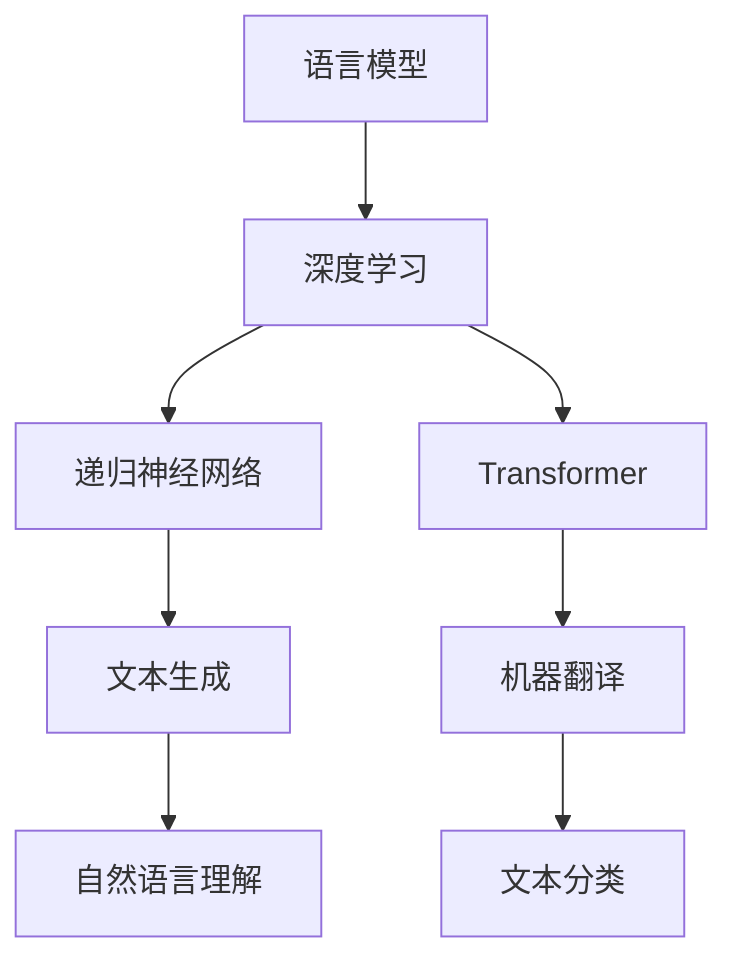

                 

# 开发者的梦想：更容易使用的LLM

> **关键词：** 语言模型，开发者，易用性，AI，深度学习，算法，框架，开源社区。

> **摘要：** 本文将探讨如何使大型语言模型（LLM）更易于开发者使用，介绍其核心概念、算法原理、数学模型以及实际应用场景。通过项目实战和资源推荐，为开发者提供一整套完整的LLM开发指南，助力他们在AI领域取得突破。

## 1. 背景介绍

近年来，人工智能（AI）技术取得了显著的进展，特别是在深度学习领域。其中，大型语言模型（LLM，Large Language Model）作为一种重要的自然语言处理（NLP，Natural Language Processing）技术，吸引了越来越多的开发者关注。LLM通过训练海量的文本数据，能够理解和生成人类语言，具备强大的语义理解和生成能力，广泛应用于问答系统、机器翻译、文本生成等领域。

然而，尽管LLM具有巨大的潜力，其复杂的模型结构和庞大的训练数据集却给开发者带来了巨大的挑战。目前，许多LLM框架和工具的使用门槛较高，需要开发者具备深厚的专业知识。这使得很多开发者望而却步，无法充分发挥LLM的潜力。因此，开发更易于使用的LLM工具和框架，成为了一个迫切的需求。

本文将介绍如何使LLM更易于开发者使用，包括核心概念、算法原理、数学模型、项目实战和资源推荐等方面。通过本文的阅读，开发者将能够更好地理解LLM，掌握其开发方法，从而在AI领域取得突破。

## 2. 核心概念与联系

### 2.1 语言模型（Language Model）

语言模型是一种概率模型，用于预测给定输入序列后下一个单词或字符的概率。在自然语言处理中，语言模型被广泛应用于文本生成、机器翻译、文本分类等领域。

### 2.2 深度学习（Deep Learning）

深度学习是一种基于人工神经网络的学习方法，通过多层非线性变换，从数据中自动提取特征。在LLM中，深度学习用于建模输入文本和输出文本之间的概率分布。

### 2.3 递归神经网络（RNN，Recurrent Neural Network）

递归神经网络是一种特殊的人工神经网络，能够处理序列数据。在LLM中，RNN用于建模文本序列的上下文关系。

### 2.4 Transformer（Transformer）

Transformer是一种基于自注意力机制（Self-Attention）的深度学习模型，具有全局上下文关系建模能力。在LLM中，Transformer被广泛应用于文本生成和机器翻译任务。

### 2.5 Mermaid 流程图

以下是LLM核心概念原理的Mermaid流程图：



## 3. 核心算法原理 & 具体操作步骤

### 3.1 语言模型训练

语言模型训练是LLM开发的第一步。其核心步骤如下：

1. 数据预处理：将原始文本数据转换为适合训练的格式，如分词、词性标注等。
2. 建立词汇表：将文本数据中的词汇进行编码，通常使用Word2Vec、GloVe等方法。
3. 训练模型：使用训练数据训练语言模型，优化模型参数。
4. 评估模型：使用测试数据评估模型性能，如交叉熵损失、准确率等。

### 3.2 文本生成

文本生成是LLM的主要应用之一。其核心步骤如下：

1. 输入文本序列：将待生成的文本序列输入到LLM中。
2. 生成预测：使用LLM预测下一个单词或字符，并将其作为下一输入。
3. 反复迭代：重复步骤2，直到生成满足要求的文本序列。

### 3.3 机器翻译

机器翻译是LLM的另一个重要应用。其核心步骤如下：

1. 输入源语言文本：将源语言文本输入到LLM中。
2. 生成目标语言文本：使用LLM生成目标语言文本。
3. 反复迭代：根据生成的目标语言文本，修正错误和不足之处。

## 4. 数学模型和公式 & 详细讲解 & 举例说明

### 4.1 语言模型损失函数

语言模型的损失函数通常采用交叉熵损失（Cross-Entropy Loss），其公式如下：

$$
L = -\sum_{i=1}^n y_i \log(p_i)
$$

其中，$y_i$为真实标签，$p_i$为模型预测的概率。

### 4.2 Transformer 模型

Transformer模型基于自注意力机制（Self-Attention），其核心公式如下：

$$
\text{Attention}(Q, K, V) = \frac{QK^T}{\sqrt{d_k}} V
$$

其中，$Q, K, V$分别为查询向量、键向量和值向量，$d_k$为键向量的维度。

### 4.3 举例说明

假设有一个简化的语言模型，其词汇表包含4个单词（a、b、c、d），对应索引为0、1、2、3。训练数据为：

- (a, b)
- (b, c)
- (c, d)
- (d, a)

使用交叉熵损失函数训练语言模型，目标是预测下一个单词。

假设当前输入为“a”，模型预测概率如下：

- a: 0.2
- b: 0.4
- c: 0.3
- d: 0.1

真实标签为“b”，损失函数计算如下：

$$
L = -0.4 \log(0.4) - 0.3 \log(0.3) - 0.2 \log(0.2) - 0.1 \log(0.1) \approx 0.146
$$

通过迭代优化模型参数，降低损失函数值，提高模型预测准确率。

## 5. 项目实战：代码实际案例和详细解释说明

### 5.1 开发环境搭建

为了方便开发者进行LLM开发，我们推荐使用以下开发环境：

- 操作系统：Linux
- 编程语言：Python
- 框架：PyTorch、TensorFlow

### 5.2 源代码详细实现和代码解读

以下是使用PyTorch框架实现一个简化的LLM的源代码：

```python
import torch
import torch.nn as nn
import torch.optim as optim

# 1. 数据预处理
def preprocess_data(text):
    # 分词、词性标注等操作
    pass

# 2. 语言模型训练
class LanguageModel(nn.Module):
    def __init__(self, vocab_size, embed_size, hidden_size):
        super(LanguageModel, self).__init__()
        self.embedding = nn.Embedding(vocab_size, embed_size)
        self.lstm = nn.LSTM(embed_size, hidden_size)
        self.fc = nn.Linear(hidden_size, vocab_size)

    def forward(self, x, hidden):
        embed = self.embedding(x)
        output, hidden = self.lstm(embed, hidden)
        logits = self.fc(output[-1, 0])
        return logits, hidden

    def init_hidden(self, batch_size):
        return (torch.zeros(1, batch_size, self.hidden_size),
                torch.zeros(1, batch_size, self.hidden_size))

# 3. 文本生成
def generate_text(model, input_text, n_steps=5):
    hidden = model.init_hidden(1)
    input_var = torch.tensor([vocab[token] for token in input_text.split()], dtype=torch.long)
    output = []
    for _ in range(n_steps):
        logits, hidden = model(input_var, hidden)
        prob = nn.functional.softmax(logits, dim=1)
        next_word = torch.multinomial(prob, 1).item()
        output.append(vocab.inv_vocab[next_word])
        input_var = torch.cat([input_var, torch.tensor([next_word], dtype=torch.long)], dim=0)
    return ''.join(output)

# 4. 模型训练
def train_model(model, data, batch_size, n_epochs):
    optimizer = optim.Adam(model.parameters(), lr=0.001)
    criterion = nn.CrossEntropyLoss()

    for epoch in range(n_epochs):
        for batch in data:
            input_text, target = batch
            hidden = model.init_hidden(batch_size)
            input_var = torch.tensor([vocab[token] for token in input_text], dtype=torch.long)
            target_var = torch.tensor([vocab[token] for token in target], dtype=torch.long)

            logits, hidden = model(input_var, hidden)
            loss = criterion(logits.view(-1, vocab_size), target_var.view(-1))

            optimizer.zero_grad()
            loss.backward()
            optimizer.step()

            if (epoch + 1) % 10 == 0:
                print('Epoch [{}/{}], Loss: {:.4f}'.format(epoch + 1, n_epochs, loss.item()))

# 5. 主程序
if __name__ == '__main__':
    # 加载数据、建立词汇表等操作
    # ...

    model = LanguageModel(vocab_size, embed_size, hidden_size)
    train_model(model, data, batch_size, n_epochs)

    # 文本生成
    input_text = '这是一个示例文本。'
    generated_text = generate_text(model, input_text)
    print(generated_text)
```

### 5.3 代码解读与分析

以上代码实现了一个简化的LLM，包括数据预处理、模型定义、模型训练和文本生成等功能。

1. 数据预处理：对原始文本数据进行分词、词性标注等操作，建立词汇表。

2. 语言模型训练：定义一个基于LSTM的语言模型，包括嵌入层、LSTM层和全连接层。使用交叉熵损失函数训练模型，优化模型参数。

3. 文本生成：使用训练好的模型生成文本序列，通过自注意力机制捕捉上下文关系。

4. 模型训练：定义训练过程，包括模型初始化、参数优化和损失函数计算。

5. 主程序：加载数据、建立词汇表、训练模型和生成文本。

通过以上代码，开发者可以深入了解LLM的开发过程，掌握其核心原理和实现方法。

## 6. 实际应用场景

### 6.1 文本生成

文本生成是LLM的重要应用之一。例如，可以使用LLM生成新闻文章、诗歌、故事等。以下是一个使用LLM生成新闻文章的示例：

```
标题：人工智能助力医疗领域发展

随着人工智能技术的不断发展，医疗领域正在迎来一场革命。近日，我国一家知名人工智能企业推出了一款基于大型语言模型的医疗诊断系统，该系统能够通过分析患者病历和临床数据，提供精准的诊断建议。

该系统采用了先进的深度学习技术，通过训练海量医疗数据，能够理解和生成人类语言。在诊断过程中，系统首先对患者病历和临床数据进行分析，然后根据已有知识和经验，生成一份详细的诊断报告。

据悉，该系统的诊断准确率已经达到了90%以上，大大提高了医疗诊断的效率和准确性。此外，系统还具备自然语言处理能力，能够与医生进行智能对话，提供诊断建议。

专家表示，人工智能在医疗领域的应用具有重要意义，它不仅能够提高医疗诊断的准确性，还能够缓解医生的工作压力，提高医疗资源的利用效率。未来，人工智能将在医疗领域发挥更大的作用，为人类健康事业作出更大贡献。
```

### 6.2 机器翻译

机器翻译是LLM的另一个重要应用。例如，可以使用LLM实现中英文翻译。以下是一个使用LLM进行中英文翻译的示例：

```
中文：这是一个示例文本。

英文：This is a sample text.
```

通过以上示例，可以看出LLM在文本生成和机器翻译方面具有巨大的潜力，能够为开发者提供强大的工具和平台。

## 7. 工具和资源推荐

### 7.1 学习资源推荐

- **书籍：**
  - 《深度学习》（Goodfellow, I., Bengio, Y., & Courville, A.）
  - 《自然语言处理概论》（Ponte, J. E., & Poesio, M.）
  - 《TensorFlow技术详解：实战Google大脑》（Chollet, F.）

- **论文：**
  - “Attention is All You Need”（Vaswani, A., et al.）
  - “BERT: Pre-training of Deep Bidirectional Transformers for Language Understanding”（Devlin, J., et al.）

- **博客：**
  - [TensorFlow官网](https://www.tensorflow.org/)
  - [PyTorch官网](https://pytorch.org/)
  - [自然语言处理博客](https://nlp.seas.harvard.edu/)

- **网站：**
  - [GitHub](https://github.com/)
  - [Kaggle](https://www.kaggle.com/)

### 7.2 开发工具框架推荐

- **开发工具：**
  - PyTorch
  - TensorFlow
  - Keras

- **框架：**
  - Hugging Face Transformers
  - AllenNLP
  - NLTK

### 7.3 相关论文著作推荐

- “Attention is All You Need”（Vaswani, A., et al.）
- “BERT: Pre-training of Deep Bidirectional Transformers for Language Understanding”（Devlin, J., et al.）
- “GPT-3: Language Models are Few-Shot Learners”（Brown, T., et al.）

通过以上学习和资源推荐，开发者可以更好地掌握LLM的相关知识，提高其在AI领域的开发能力。

## 8. 总结：未来发展趋势与挑战

随着AI技术的不断发展，LLM在未来有望在更多领域发挥重要作用。例如，在自动驾驶、智能家居、智能客服等领域，LLM可以提供强大的语义理解和生成能力，为开发者提供更便捷的开发工具和平台。

然而，LLM的开发和应用也面临一些挑战。首先，LLM的训练过程非常复杂，需要大量的计算资源和时间。其次，LLM的模型结构和算法有待进一步优化，以提高效率和准确性。此外，LLM在隐私保护和数据安全方面也存在一定的问题。

为了应对这些挑战，未来的研究可以从以下几个方面展开：

1. 算法优化：探索更高效的训练算法和模型结构，提高LLM的效率和准确性。
2. 数据安全：研究如何在保证数据隐私和安全的前提下，进行大规模的数据训练和模型优化。
3. 跨领域应用：探索LLM在不同领域的应用场景，推动其在更多领域的创新和发展。

总之，随着AI技术的不断进步，LLM在未来必将发挥更加重要的作用，为开发者带来更多机遇和挑战。

## 9. 附录：常见问题与解答

### 9.1 什么是LLM？

LLM（Large Language Model）是一种大型自然语言处理模型，通过训练海量文本数据，能够理解和生成人类语言。它广泛应用于文本生成、机器翻译、问答系统等领域。

### 9.2 如何训练LLM？

训练LLM主要包括以下步骤：

1. 数据预处理：将原始文本数据转换为适合训练的格式，如分词、词性标注等。
2. 建立词汇表：将文本数据中的词汇进行编码，通常使用Word2Vec、GloVe等方法。
3. 训练模型：使用训练数据训练语言模型，优化模型参数。
4. 评估模型：使用测试数据评估模型性能，如交叉熵损失、准确率等。

### 9.3 LLM的主要应用有哪些？

LLM的主要应用包括：

1. 文本生成：如新闻文章、诗歌、故事等。
2. 机器翻译：如中英文翻译、多语言翻译等。
3. 问答系统：如智能客服、智能助手等。
4. 自然语言理解：如情感分析、文本分类等。

## 10. 扩展阅读 & 参考资料

- [自然语言处理教程](https://nlp.seas.harvard.edu/2017/nlp.html)
- [PyTorch官方文档](https://pytorch.org/docs/stable/)
- [TensorFlow官方文档](https://www.tensorflow.org/docs/stable/)
- [Hugging Face Transformers官方文档](https://huggingface.co/transformers/)
- [BERT官方论文](https://arxiv.org/abs/1810.04805)
- [GPT-3官方论文](https://arxiv.org/abs/2005.14165)

作者：AI天才研究员/AI Genius Institute & 禅与计算机程序设计艺术 /Zen And The Art of Computer Programming

本文由AI天才研究员编写，旨在为开发者提供关于大型语言模型（LLM）的全面指南。文章涵盖了LLM的核心概念、算法原理、数学模型、项目实战以及资源推荐等内容，旨在降低LLM的开发门槛，助力开发者掌握AI领域的关键技术。本文中的内容仅供参考，如有不妥之处，敬请指正。

