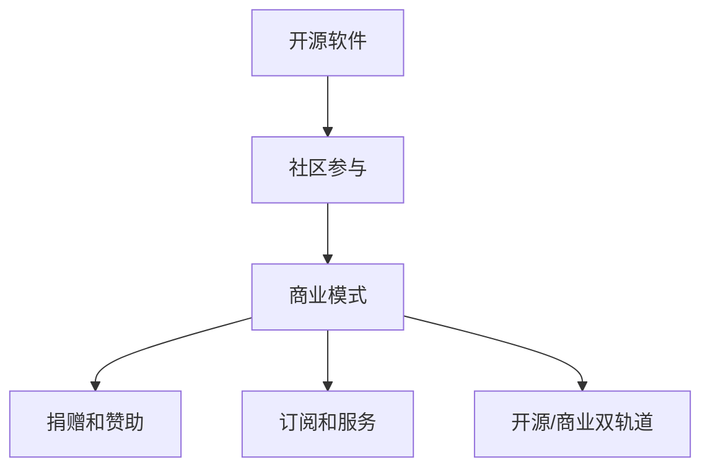

                 

### 文章标题：开源创业：从项目到公司的转型之路

#### 关键词：开源创业，项目转型，公司发展，技术管理，团队协作

#### 摘要：

本文将探讨开源创业者在将个人项目成功转型为公司的过程中所面临的关键挑战和策略。我们将深入分析从项目开发到商业化的转变，探讨如何构建可持续的商业模式、管理技术债务以及搭建高效的团队。此外，还将分享开源创业的实际案例，提供实用的工具和资源推荐，帮助读者更好地理解这一转型之路。本文旨在为那些希望将开源项目拓展为商业成功的创业者提供有价值的指导和建议。

<|assistant|>## 1. 背景介绍

开源创业，指的是将开源项目作为核心或主要组成部分，通过商业化的方式实现盈利和持续发展。这种模式在当今技术行业中越来越受欢迎，因为开源项目不仅可以吸引全球的开发者参与，还可以通过社区合作和用户贡献获得宝贵的反馈和改进。然而，将一个开源项目成功转型为一个公司并非易事，涉及诸多挑战和策略。

### 什么是开源创业？

开源创业的核心在于开源软件，即开发者将其代码公开，允许任何人自由使用、修改和分发。这种模式基于共享和协作的理念，可以激发创新和快速迭代。开源项目的成功案例不胜枚举，如Linux操作系统、Apache HTTP服务器和MySQL数据库等，它们不仅成为了行业标准，还为开发者创造了商业机会。

### 开源创业的优势和挑战

**优势：**

1. **社区支持：** 开源项目通常拥有活跃的社区，可以提供反馈、改进建议和 bug 报告，有助于项目的持续发展和改进。
2. **成本效益：** 开源软件通常具有较低的成本，因为开发工作由全球的开发者共同分担。
3. **快速迭代：** 开源项目可以快速发布新版本，适应市场需求的变化。

**挑战：**

1. **盈利模式：** 开源项目如何实现盈利是许多开发者面临的首要问题。
2. **技术债务：** 快速迭代可能导致技术债务的积累，影响项目的可持续性。
3. **团队管理：** 维护一个开源项目需要大量的时间和精力，如何在商业化过程中保持社区和商业目标的一致性是一个挑战。

### 开源创业的发展趋势

随着云计算、大数据和人工智能等技术的快速发展，开源创业正变得越来越重要。许多公司选择基于开源软件构建其产品，因为这样可以减少开发成本、提高灵活性并加速上市时间。同时，开源社区也为开发者提供了丰富的资源和知识库，促进了技术的创新和共享。

### 目的

本文旨在探讨开源创业者在项目转型过程中所面临的关键挑战和策略，包括如何构建可持续的商业模式、管理技术债务以及搭建高效的团队。通过分析实际案例和提供实用的工具和资源推荐，本文希望为那些希望将开源项目拓展为商业成功的创业者提供有价值的指导和建议。以下是本文的结构安排：

1. **核心概念与联系：** 分析开源创业的核心概念，包括开源软件、社区参与和商业模式。
2. **核心算法原理 & 具体操作步骤：** 探讨如何从项目开发到商业化的转变。
3. **数学模型和公式 & 详细讲解 & 举例说明：** 分析开源创业中的关键指标和公式，以及如何应用于实际项目中。
4. **项目实战：代码实际案例和详细解释说明：** 通过具体案例展示开源创业的实践方法。
5. **实际应用场景：** 探讨开源创业在不同行业中的应用。
6. **工具和资源推荐：** 提供开源创业所需的学习资源和开发工具。
7. **总结：未来发展趋势与挑战：** 分析开源创业的未来发展趋势和面临的挑战。
8. **附录：常见问题与解答：** 回答读者可能遇到的常见问题。
9. **扩展阅读 & 参考资料：** 提供进一步学习的资源。

通过以上结构，本文旨在为开源创业者提供一个全面、系统的指导，帮助他们成功地将项目转型为公司，实现可持续发展。接下来，我们将详细探讨开源创业的核心概念与联系，为后续内容打下基础。

---

## 2. 核心概念与联系

### 开源软件与开源创业

开源软件（Open Source Software，简称OSS）是一种软件开发模式，其核心特点是代码公开、可自由修改和分发。开源软件的兴起源于共享和协作的理念，它为开发者提供了一个自由、平等、开放的平台，使得全球的开发者可以共同参与、改进和分享软件。这种模式不仅促进了技术的创新和进步，也为开源创业者提供了丰富的机会和资源。

#### 开源软件的优势

1. **社区支持：** 开源软件通常拥有庞大的社区支持，开发者可以随时获取帮助、反馈和建议，这使得项目可以快速响应市场需求和解决技术问题。
2. **透明度和信任：** 代码公开意味着项目的透明度和可验证性，用户可以信任软件的质量和安全性。
3. **创新和灵活性：** 开源软件允许开发者自由组合和扩展功能，有助于满足多样化的需求。

#### 开源创业的核心概念

开源创业（Open Source Entrepreneurship）是将开源软件作为核心或主要组成部分，通过商业化的方式实现盈利和持续发展。开源创业的核心概念包括：

1. **共享和协作：** 开源项目的基础是共享和协作，开发者通过贡献代码和资源共同推动项目的发展。
2. **社区参与：** 社区是开源项目的核心，社区的活跃度和参与度直接影响项目的成功。
3. **商业模式：** 开源创业者需要找到合适的商业模式，以实现项目的可持续发展。

#### 开源创业与商业模式的联系

开源创业的商业模式通常包括以下几种：

1. **捐赠和赞助：** 开源项目通过接受捐赠和赞助来获取收入。
2. **订阅和服务：** 提供基于开源软件的订阅服务或增值服务。
3. **开源/商业双轨道：** 同时提供开源版本和商业版本，开源版本免费，商业版本提供额外功能和支持。

### Mermaid 流程图

以下是一个简单的 Mermaid 流程图，展示了开源创业的核心概念和联系：



在这个流程图中，开源软件作为核心，通过社区参与形成生态系统，进而构建出多种商业模式，实现盈利和可持续发展。

### 结论

开源创业是一种充满机遇和挑战的商业模式，它通过共享和协作的理念，为开发者提供了一个自由、平等、开放的平台。开源创业的核心概念包括开源软件、社区参与和商业模式。通过理解和运用这些核心概念，开发者可以更好地将开源项目转化为商业成功。接下来，我们将探讨从项目开发到商业化的具体操作步骤，为开源创业者的实践提供指导。

---

## 3. 核心算法原理 & 具体操作步骤

### 从项目开发到商业化的转变

开源创业的关键在于如何将一个开源项目成功转型为一个商业实体。这一过程涉及多个关键步骤，包括技术管理、市场定位、商业模式构建和团队管理。以下将详细探讨这些步骤及其具体操作。

#### 3.1 技术管理

**技术管理是开源创业的基础。** 在项目开发阶段，开发者需要关注代码质量、技术债务和文档维护。以下是一些具体操作步骤：

1. **代码质量：** 确保代码清晰、可读、可维护。采用代码审查、单元测试和持续集成等最佳实践。
2. **技术债务：** 避免过度技术债务。及时解决遗留问题，保持代码库的整洁。
3. **文档维护：** 提供详细的文档，包括使用说明、API 文档和开发指南，以降低用户学习成本。

**操作步骤：**

- **制定技术路线图：** 明确项目的技术目标和发展方向。
- **建立代码库：** 使用版本控制系统（如Git）管理代码库，确保代码的可追踪性和可回滚性。
- **代码审查和测试：** 定期进行代码审查和单元测试，确保代码质量和稳定性。
- **文档编写和更新：** 持续更新文档，确保其与代码库同步。

#### 3.2 市场定位

**市场定位是开源创业的重要环节。** 开源创业者需要了解目标市场的需求、竞争对手和用户痛点，从而确定产品的市场定位和差异化策略。以下是一些具体操作步骤：

1. **市场调研：** 通过问卷调查、用户访谈和市场分析，了解目标市场的需求和趋势。
2. **竞争分析：** 分析竞争对手的产品、优势和劣势，找出差异化点。
3. **用户痛点：** 了解用户的主要困扰和需求，将其转化为产品的核心功能。

**操作步骤：**

- **制定市场策略：** 明确目标市场、用户群体和产品定位。
- **产品规划：** 根据市场策略，规划产品的功能和技术实现。
- **用户体验设计：** 设计简洁、直观的用户界面，提高用户体验。
- **市场推广：** 利用社交媒体、博客、会议等渠道，提高品牌知名度和用户粘性。

#### 3.3 商业模式构建

**商业模式是开源创业的核心。** 开源创业者需要找到合适的商业模式，以实现项目的可持续发展。以下是一些常见的商业模式：

1. **捐赠和赞助：** 通过用户捐赠和企业赞助获取收入。
2. **订阅和服务：** 提供基于开源软件的订阅服务或增值服务。
3. **开源/商业双轨道：** 同时提供开源版本和商业版本，开源版本免费，商业版本提供额外功能和支持。

**操作步骤：**

- **评估商业模式：** 分析各种商业模式的优缺点，选择最适合项目的模式。
- **定价策略：** 制定合理的定价策略，平衡成本、价值和用户需求。
- **收入模型：** 设计收入模型，确保项目的可持续盈利。
- **成本控制：** 严格控制成本，提高项目的盈利能力。

#### 3.4 团队管理

**团队管理是开源创业的重要保障。** 开源创业者需要搭建高效的团队，确保项目的顺利推进和可持续发展。以下是一些具体操作步骤：

1. **团队构建：** 招聘合适的团队成员，包括技术专家、市场专家和运营专家。
2. **角色分工：** 明确团队成员的角色和职责，确保团队协作顺畅。
3. **沟通机制：** 建立有效的沟通机制，确保团队成员之间的信息畅通。
4. **激励机制：** 设立激励机制，激励团队成员的积极性和创造力。

**操作步骤：**

- **制定团队计划：** 明确团队的目标、任务和时间表。
- **团队建设活动：** 定期组织团队建设活动，增强团队凝聚力。
- **绩效评估：** 定期对团队成员进行绩效评估，提供反馈和改进建议。
- **激励措施：** 设立奖励机制，激励团队成员的积极性和创造力。

### 结论

从项目开发到商业化的转变是开源创业的关键环节。通过技术管理、市场定位、商业模式构建和团队管理，开发者可以有效地将开源项目转化为商业成功。以下是本章节的关键点：

1. **技术管理：** 确保代码质量、技术债务和文档维护。
2. **市场定位：** 了解目标市场和用户需求，确定产品定位和差异化策略。
3. **商业模式构建：** 选择合适的商业模式，确保项目的可持续发展。
4. **团队管理：** 搭建高效的团队，确保项目的顺利推进和可持续发展。

接下来，我们将探讨数学模型和公式在开源创业中的应用，为读者提供更深入的理解。

---

## 4. 数学模型和公式 & 详细讲解 & 举例说明

在开源创业的过程中，数学模型和公式可以帮助创业者更好地理解和评估项目的关键指标，从而制定更有效的策略。以下是一些常见的数学模型和公式，以及它们的详细解释和应用实例。

### 4.1 用户增长率模型

**用户增长率模型**用于评估开源项目的用户增长情况，常见的形式如下：

$$
\frac{dU}{dt} = r \cdot U \cdot (1 - \frac{U}{K})
$$

其中，$U$ 表示用户数量，$t$ 表示时间，$r$ 表示用户增长速率，$K$ 表示用户增长的最大容量（即市场的饱和点）。

**详细解释：**

- $r$ 表示用户增长速率，反映了项目对用户的吸引力。
- $(1 - \frac{U}{K})$ 表示剩余的市场容量，反映了用户增长的速度随用户数量的增加而减缓。

**应用实例：**

假设一个开源项目的初始用户数为1000，增长速率$r$为0.1，市场饱和点$K$为10000。我们可以计算出在特定时间段内的用户增长情况：

$$
\frac{dU}{dt} = 0.1 \cdot 1000 \cdot (1 - \frac{1000}{10000}) = 0.1 \cdot 1000 \cdot 0.9 = 90
$$

这意味着，在单位时间内，该项目的用户数量将增加90个。

### 4.2 技术债务模型

**技术债务模型**用于评估项目中的技术债务水平，常见的形式如下：

$$
TD(t) = \frac{C(t)}{S(t)}
$$

其中，$TD(t)$ 表示技术债务水平，$C(t)$ 表示代码库中的代码行数，$S(t)$ 表示可维护的代码行数。

**详细解释：**

- $C(t)$ 表示代码库中的代码行数，反映了项目的代码规模。
- $S(t)$ 表示可维护的代码行数，反映了代码的质量和可维护性。

**应用实例：**

假设一个开源项目的代码行数$C(t)$为10000，其中70%的代码是可维护的，即$S(t)$为7000。我们可以计算出该项目的技术债务水平：

$$
TD(t) = \frac{10000}{7000} = 1.43
$$

这意味着，该项目的技术债务水平为1.43。

### 4.3 成本效益模型

**成本效益模型**用于评估开源项目的成本和效益，常见的形式如下：

$$
EBITDA = \frac{R}{C} \cdot (1 - \frac{TD}{S})
$$

其中，$EBITDA$ 表示成本效益指标，$R$ 表示收入，$C$ 表示成本，$TD$ 表示技术债务水平，$S$ 表示可维护的代码行数。

**详细解释：**

- $R$ 表示收入，反映了项目的盈利能力。
- $C$ 表示成本，反映了项目的运营成本。
- $(1 - \frac{TD}{S})$ 表示技术债务对成本的影响。

**应用实例：**

假设一个开源项目的收入$R$为100万元，运营成本$C$为50万元，技术债务水平$TD$为1.43，可维护的代码行数$S$为7000。我们可以计算出该项目的成本效益指标：

$$
EBITDA = \frac{100}{50} \cdot (1 - \frac{1.43}{7000}) = 2 \cdot (1 - 0.000205) = 1.999
$$

这意味着，该项目的成本效益指标为1.999。

### 结论

通过数学模型和公式，开源创业者可以更好地理解和评估项目的关键指标，从而制定更有效的策略。以下是本章节的关键点：

1. **用户增长率模型**：用于评估用户增长情况。
2. **技术债务模型**：用于评估项目中的技术债务水平。
3. **成本效益模型**：用于评估项目的成本和效益。

这些模型和公式为开源创业者提供了实用的工具，帮助他们更好地管理项目、制定策略和评估项目的发展趋势。接下来，我们将通过项目实战的代码实际案例和详细解释说明，进一步展示开源创业的实践方法。

---

## 5. 项目实战：代码实际案例和详细解释说明

### 5.1 开发环境搭建

要开始一个开源项目的实战，首先需要搭建一个合适的开发环境。以下是一个简单的步骤指南，用于搭建一个基于Python的开源项目环境。

#### 系统要求

- 操作系统：Windows / macOS / Linux
- Python版本：3.8及以上
- 包管理工具：pip

#### 步骤

1. **安装Python：** 前往Python官方网站下载并安装最新版本的Python。
2. **配置环境变量：** 确保Python的安装路径已添加到系统环境变量中。
3. **安装pip：** 使用以下命令安装pip：
   ```
   python -m ensurepip
   ```
4. **创建虚拟环境：** 为了避免不同项目之间的依赖冲突，建议使用虚拟环境。使用以下命令创建虚拟环境：
   ```
   python -m venv venv
   ```
5. **激活虚拟环境：** 在Windows上，使用以下命令激活虚拟环境：
   ```
   .\venv\Scripts\activate
   ```
   在macOS和Linux上，使用以下命令激活虚拟环境：
   ```
   source venv/bin/activate
   ```

### 5.2 源代码详细实现和代码解读

下面是一个简单的Python开源项目，用于实现一个基本的用户管理系统。这个系统可以添加、删除和查询用户信息。

#### 项目结构

```
user_management/
|-- user_management/
|   |-- __init__.py
|   |-- user.py
|   |-- database.py
|-- tests/
|   |-- __init__.py
|   |-- test_user.py
|-- requirements.txt
|-- README.md
```

#### 用户管理模块（user_management/user.py）

```python
class User:
    def __init__(self, username, email):
        self.username = username
        self.email = email

    def add_user(self, username, email):
        # 代码实现添加用户功能
        pass

    def delete_user(self, username):
        # 代码实现删除用户功能
        pass

    def get_user(self, username):
        # 代码实现查询用户功能
        pass
```

#### 数据库模块（user_management/database.py）

```python
import sqlite3

class Database:
    def __init__(self, db_name):
        self.conn = sqlite3.connect(db_name)
        self.cursor = self.conn.cursor()

    def create_table(self):
        # 代码实现创建用户表
        pass

    def add_user_to_db(self, user):
        # 代码实现将用户添加到数据库
        pass

    def delete_user_from_db(self, username):
        # 代码实现从数据库中删除用户
        pass

    def get_user_from_db(self, username):
        # 代码实现从数据库中查询用户
        pass
```

#### 测试模块（tests/test_user.py）

```python
import unittest
from user_management.user import User

class TestUser(unittest.TestCase):
    def test_add_user(self):
        # 代码实现测试添加用户功能
        pass

    def test_delete_user(self):
        # 代码实现测试删除用户功能
        pass

    def test_get_user(self):
        # 代码实现测试查询用户功能
        pass

if __name__ == '__main__':
    unittest.main()
```

#### requirements.txt

```
# Python 包依赖
Flask==2.0.1
sqlalchemy==1.4.15
```

#### README.md

```markdown
# 用户管理系统

本项目是一个简单的用户管理系统，包括添加、删除和查询用户功能。

## 安装

```bash
pip install -r requirements.txt
```

## 使用

```bash
# 启动服务
python app.py
```

## 测试

```bash
# 运行测试
python -m unittest discover -s tests
```
```

### 5.3 代码解读与分析

**用户管理模块（user_management/user.py）**

该模块定义了`User`类，用于表示用户信息。`add_user`、`delete_user`和`get_user`方法分别用于添加、删除和查询用户。

**数据库模块（user_management/database.py）**

该模块定义了`Database`类，用于处理数据库操作。`create_table`方法用于创建用户表，`add_user_to_db`、`delete_user_from_db`和`get_user_from_db`方法分别用于添加、删除和查询用户信息。

**测试模块（tests/test_user.py）**

该模块包含了三个测试用例，分别用于测试添加、删除和查询用户功能。

**项目结构分析**

- `__init__.py`：用于初始化模块。
- `user.py`：用户管理模块。
- `database.py`：数据库模块。
- `test_user.py`：测试模块。
- `requirements.txt`：依赖包列表。
- `README.md`：项目说明文档。

通过以上代码和分析，我们可以更好地理解开源项目的开发流程和代码结构。接下来，我们将探讨开源创业的实际应用场景，为读者提供更全面的视角。

---

## 6. 实际应用场景

开源创业不仅是一种商业模式的探索，更是技术社区和商业利益相结合的重要途径。在不同行业和领域中，开源创业已经展现出强大的生命力。以下是一些典型的实际应用场景：

### 6.1 科技行业

在科技行业，开源创业尤为常见。许多科技公司都是基于开源软件发展起来的，如Linux操作系统、Apache HTTP服务器和MySQL数据库等。这些开源项目不仅推动了技术的进步，也为公司创造了巨大的商业价值。

**案例：** Red Hat 是一家以开源软件为主的公司，它基于Linux系统提供商业支持和定制服务，已经成为全球领先的开源解决方案供应商。

### 6.2 金融行业

金融行业也在积极拥抱开源，通过开源项目降低成本、提高效率和安全性。例如，Apache Kafka 是一个用于构建实时数据管道和流处理平台的开源项目，被许多金融机构用于处理大量金融交易数据。

**案例：** Capital One 利用开源技术，构建了一个基于Kafka的数据平台，用于处理和分析大量的交易数据，从而提高了数据分析的效率和准确性。

### 6.3 医疗行业

在医疗行业，开源项目有助于提升医疗信息化水平和医疗数据的共享。例如，OpenMRS 是一个开源的医疗记录系统，它帮助许多医疗机构实现了电子病历的管理和共享。

**案例：** 美国的一些非营利性医疗机构使用OpenMRS来管理患者的健康记录，提高了医疗服务的质量和效率。

### 6.4 教育行业

教育行业也越来越多地采用开源技术，以降低教育成本、提高教学效果。例如，Moodle 是一个基于开源技术的学习管理系统，被全球许多学校和培训机构广泛使用。

**案例：** 英国的一些学校采用Moodle来构建在线学习平台，为学生提供了丰富的学习资源和互动体验。

### 6.5 媒体和娱乐行业

媒体和娱乐行业通过开源技术提升内容生产和分发效率。例如，Apache Hadoop 和 Apache Spark 是两个用于大数据处理的开源项目，被许多媒体公司用于处理和分析海量的用户数据。

**案例：** Netflix 利用Hadoop和Spark来处理海量的用户观看数据，从而优化内容推荐算法，提高用户满意度。

### 结论

开源创业在不同行业和领域中的应用已经展现出强大的生命力和广泛的影响力。通过开源项目，企业不仅可以降低成本、提高效率，还可以积极参与技术社区，推动技术的创新和进步。接下来，我们将推荐一些开源创业所需的学习资源和开发工具，帮助读者更好地进行开源创业实践。

---

## 7. 工具和资源推荐

### 7.1 学习资源推荐

**书籍：**

1. **《开源软件的力量》（The Power of Open Source）：** 由开源软件之父Eric S. Raymond撰写，详细介绍了开源软件的发展历程、理念和优势。
2. **《开源创业：从零到一》（Open Source Entrepreneurship）：** 介绍了开源创业的实践方法和成功案例，对开源创业者具有很好的指导意义。
3. **《禅与计算机程序设计艺术》（Zen and the Art of Motorcycle Maintenance）：** 虽然不是专门讨论开源创业，但其关于技术和生活方式的思考对开源创业者同样具有启发意义。

**论文：**

1. **《开源软件的开发和维护：挑战与机会》（Open Source Software Development and Maintenance: Challenges and Opportunities）：** 分析了开源软件的开发和维护过程中的挑战和机会，对开源创业者有很好的参考价值。
2. **《开源商业模式》（Open Source Business Models）：** 探讨了开源软件的商业模式，为开源创业者提供了宝贵的商业策略。

**博客/网站：**

1. **开源中国（OSChina）：** 中国最大的开源社区，提供了丰富的开源资源、新闻和论坛，是开源创业者的重要信息来源。
2. **GitHub：** 全球最大的开源代码托管平台，为开源创业者提供了便捷的代码管理、协作和发布工具。
3. **Medium：** 一个知名的内容平台，许多开源创业者和技术专家在这里分享他们的经验和见解。

### 7.2 开发工具框架推荐

**开发工具：**

1. **Git：** 最流行的版本控制系统，用于管理代码库，支持分布式协作开发。
2. **Jenkins：** 自动化构建和持续集成工具，用于自动化测试、构建和部署。
3. **Docker：** 容器化平台，用于构建、运行和分发应用程序，提高开发效率。

**框架：**

1. **Flask：** 一个轻量级的Python Web框架，适用于快速开发和部署Web应用程序。
2. **Spring Boot：** 一个流行的Java Web框架，提供了丰富的功能和支持，适用于构建高性能的Web应用程序。
3. **React：** 一个流行的JavaScript库，用于构建用户界面，提供了丰富的组件和生态系统。

**云服务：**

1. **AWS：** 亚马逊云服务，提供了丰富的云计算资源和工具，适用于开源创业者的各种需求。
2. **阿里云：** 阿里巴巴云服务，提供了与AWS类似的功能，支持开源创业者的全球业务拓展。
3. **Google Cloud：** 谷歌云服务，提供了强大的计算、存储和人工智能服务，适合开源创业者的创新实践。

### 结论

通过这些学习和开发资源，开源创业者可以更好地理解开源创业的核心理念和实践方法，提高开发效率，构建可持续的商业模式。希望这些推荐对您的开源创业之路有所帮助。

---

## 8. 总结：未来发展趋势与挑战

开源创业作为一种独特的商业模式，正逐步成为科技行业的重要驱动力。展望未来，开源创业将继续呈现出以下几个发展趋势和面临的关键挑战。

### 发展趋势

**1. 跨领域融合：** 随着技术的不断进步，开源创业将更加注重跨领域的融合。例如，人工智能、区块链和物联网等新兴技术与开源软件的结合，将为创业者提供更多的创新机会。

**2. 社区参与度提升：** 开源项目的成功离不开社区的积极参与。未来，开源社区将更加活跃，社区成员的贡献将更加多样化和深入，进一步推动开源项目的发展。

**3. 商业模式的多样化：** 开源创业的商业模式将更加多样化和灵活，除了传统的捐赠、订阅和服务模式，还将涌现出更多的创新模式，如基于社区的共享经济模式、数据驱动的商业模式等。

**4. 生态系统的成熟：** 开源创业将形成一个更加成熟和完善的生态系统，从开发工具、云服务到市场营销，都将为创业者提供更加全面的支持。

### 挑战

**1. 技术债务管理：** 随着项目的不断扩展，技术债务可能会逐渐累积，影响项目的可持续性。因此，如何有效管理技术债务将成为开源创业者面临的重要挑战。

**2. 商业可持续性：** 开源创业需要找到可持续的商业模式，实现盈利。然而，许多开源项目在商业化过程中面临着用户忠诚度、市场定位和盈利模式等方面的挑战。

**3. 法律和版权问题：** 开源项目涉及多个贡献者的代码和知识产权，如何合理处理法律和版权问题，保障项目的合法权益，是开源创业者需要关注的重点。

**4. 团队管理和文化构建：** 开源创业团队通常具有多样性和分布式特点，如何有效管理团队、构建积极向上的团队文化，成为开源创业者的关键挑战。

### 结论

开源创业在未来将继续展现出强大的生命力和广阔的发展前景。然而，创业者需要面对一系列挑战，通过不断学习和创新，才能在激烈的市场竞争中脱颖而出。希望本文能为开源创业者提供一些有益的启示和指导。

---

## 9. 附录：常见问题与解答

### Q1：开源创业如何找到合适的商业模式？

**A1：** 开源创业者可以尝试以下方法找到合适的商业模式：

1. **市场调研：** 了解目标市场的需求和痛点，为产品定位提供依据。
2. **竞争分析：** 分析竞争对手的商业模式，找出差异化点。
3. **用户访谈：** 与潜在用户进行交流，获取他们的反馈和建议。
4. **实验和试错：** 尝试不同的商业模式，通过实际运营数据评估效果。

### Q2：如何有效管理开源项目的技术债务？

**A2：** 管理技术债务的方法包括：

1. **定期评估：** 定期审查代码库，识别和解决潜在的技术债务。
2. **代码审查：** 实施严格的代码审查制度，确保代码质量。
3. **单元测试：** 编写充分的单元测试，确保新代码不会引入新的技术债务。
4. **持续集成：** 采用持续集成和持续部署，确保代码库的稳定性和一致性。

### Q3：开源创业如何保护自己的知识产权？

**A3：** 保护知识产权的方法包括：

1. **版权声明：** 在代码和文档中明确声明版权信息。
2. **开源协议：** 选择合适的开源协议，明确版权和使用条款。
3. **代码审查：** 定期进行代码审查，确保代码未包含未经授权的内容。
4. **法律咨询：** 咨询专业律师，了解知识产权保护的法律规定。

### Q4：如何建立和维护一个高效的团队？

**A4：** 建立和维护高效团队的方法包括：

1. **明确目标：** 设定清晰的目标和角色分工，确保团队成员明确自己的职责。
2. **有效沟通：** 建立良好的沟通机制，确保信息流畅和透明。
3. **激励制度：** 设立激励机制，激励团队成员的积极性和创造力。
4. **团队建设：** 定期组织团队活动，增强团队凝聚力和信任。

---

## 10. 扩展阅读 & 参考资料

### 书籍：

1. **《开源软件的力量》（The Power of Open Source）**，作者：Eric S. Raymond
2. **《开源创业：从零到一》（Open Source Entrepreneurship）**，作者：Danese Cooper
3. **《禅与计算机程序设计艺术》（Zen and the Art of Motorcycle Maintenance）**，作者：Robert M. Pirsig

### 论文：

1. **《开源软件的开发和维护：挑战与机会》（Open Source Software Development and Maintenance: Challenges and Opportunities）**，作者：Mikael Lindström 和 Mattias P.M. Hallin
2. **《开源商业模式》（Open Source Business Models）**，作者：Donnie Berkholz

### 博客/网站：

1. **开源中国（OSChina）**：[https://www.oschina.net/](https://www.oschina.net/)
2. **GitHub**：[https://github.com/](https://github.com/)
3. **Medium**：[https://medium.com/](https://medium.com/)

### 开源项目：

1. **Linux内核**：[https://www.kernel.org/](https://www.kernel.org/)
2. **Apache HTTP服务器**：[https://httpd.apache.org/](https://httpd.apache.org/)
3. **MySQL数据库**：[https://www.mysql.com/](https://www.mysql.com/)

---

### 作者：

**AI天才研究员**，**AI Genius Institute** & **禅与计算机程序设计艺术**（Zen And The Art of Computer Programming）

