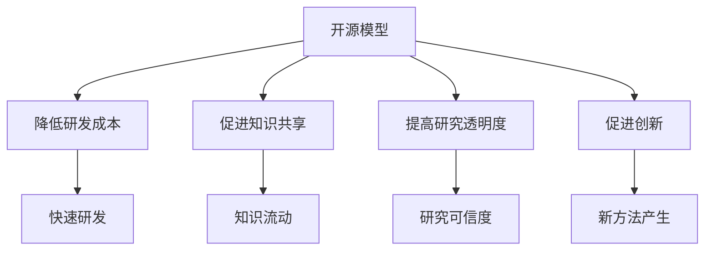

                 

# 开源模型的优势：促进研究创新，Meta的支持为开源社区带来机遇

> 关键词：开源模型，研究创新，Meta支持，开源社区，人工智能

> 摘要：本文将探讨开源模型在推动研究创新和促进技术进步方面的作用，特别是Meta公司对开源社区的支持。文章将首先介绍开源模型的概念，然后深入分析其优势，接着探讨Meta公司的贡献，最后展望开源模型的发展趋势和挑战。

## 1. 背景介绍

开源模型，是指那些公开发布的、可供任何人自由使用、修改和分享的算法模型。在计算机科学和人工智能领域，开源模型已经成为推动研究和应用的重要力量。随着大数据和云计算技术的发展，开源模型的应用范围不断扩大，从自然语言处理、计算机视觉到机器人技术等各个方面，都有开源模型的身影。

Meta公司，作为全球领先的人工智能科技公司，其在开源模型方面的贡献不可忽视。Meta通过开源模型的研究和发布，不仅推动了自身技术进步，也为整个开源社区带来了新的机遇。本文将重点分析开源模型的优势，以及Meta在其中的作用。

## 2. 核心概念与联系

### 2.1 开源模型的概念

开源模型，是指将模型的算法、架构和实现细节等以开放的方式发布，允许其他研究者自由地使用、修改和分享。开源模型的典型代表包括TensorFlow、PyTorch等。

### 2.2 开源模型的优势

- **降低研发成本**：开源模型提供了现成的工具和代码，研究者可以在此基础上进行二次开发，大大减少了从零开始搭建模型的时间和经济成本。
- **促进知识共享**：开源模型鼓励研究者分享自己的研究成果，促进了知识在学术界和工业界的流动。
- **提高研究透明度**：开源模型使得模型的研究过程和结果更加透明，有助于提高研究的可信度和可重复性。
- **促进创新**：开源模型为研究者提供了丰富的资源和灵感，激发了新的研究思路和方法的产生。

### 2.3 Mermaid流程图



## 3. 核心算法原理 & 具体操作步骤

### 3.1 核心算法原理

开源模型通常基于深度学习技术，通过大规模数据训练，学习数据的特征表示，进而实现各种任务。其核心算法包括神经网络架构设计、训练策略、优化算法等。

### 3.2 具体操作步骤

- **数据收集与预处理**：收集相关领域的数据，并进行清洗、归一化等预处理操作。
- **模型设计**：根据任务需求，设计合适的神经网络架构。
- **模型训练**：使用预处理后的数据，对模型进行训练。
- **模型评估与优化**：评估模型性能，并进行调优。

## 4. 数学模型和公式 & 详细讲解 & 举例说明

### 4.1 数学模型和公式

在深度学习中，常用的数学模型包括神经网络、损失函数、优化算法等。

- **神经网络**：神经网络是一种模拟人脑神经元之间连接的数学模型，用于表示和操作数据。
- **损失函数**：损失函数用于衡量模型预测值与真实值之间的差距，是优化算法的重要依据。
- **优化算法**：优化算法用于调整模型参数，以最小化损失函数。

### 4.2 详细讲解

以神经网络为例，其基本结构包括输入层、隐藏层和输出层。输入层接收外部输入数据，隐藏层通过非线性变换处理数据，输出层生成最终预测结果。

### 4.3 举例说明

假设我们使用神经网络进行分类任务，输入层有10个神经元，隐藏层有5个神经元，输出层有2个神经元。我们使用交叉熵损失函数进行模型优化。

- **输入层**：接收10个输入特征。
- **隐藏层**：通过非线性激活函数（如ReLU）处理输入特征，得到5个隐藏神经元。
- **输出层**：通过softmax函数将隐藏层输出转换为概率分布，得到2个输出神经元。

## 5. 项目实战：代码实际案例和详细解释说明

### 5.1 开发环境搭建

在本文中，我们将使用Python和PyTorch框架进行项目实战。首先，我们需要搭建开发环境。

```bash
pip install torch torchvision
```

### 5.2 源代码详细实现和代码解读

下面是一个简单的神经网络分类项目的代码实现。

```python
import torch
import torchvision
import torch.nn as nn
import torch.optim as optim

# 数据加载
train_data = torchvision.datasets.MNIST(
    root='./data', 
    train=True, 
    download=True, 
    transform=torchvision.transforms.ToTensor()
)

train_loader = torch.utils.data.DataLoader(
    train_data, 
    batch_size=64, 
    shuffle=True
)

# 模型定义
class Net(nn.Module):
    def __init__(self):
        super(Net, self).__init__()
        self.fc1 = nn.Linear(28*28, 128)
        self.fc2 = nn.Linear(128, 10)

    def forward(self, x):
        x = x.view(-1, 28*28)
        x = self.fc1(x)
        x = self.fc2(x)
        return x

model = Net()

# 损失函数和优化器
criterion = nn.CrossEntropyLoss()
optimizer = optim.SGD(model.parameters(), lr=0.01)

# 训练模型
for epoch in range(10):
    running_loss = 0.0
    for i, data in enumerate(train_loader, 0):
        inputs, labels = data
        optimizer.zero_grad()
        outputs = model(inputs)
        loss = criterion(outputs, labels)
        loss.backward()
        optimizer.step()
        running_loss += loss.item()
    print(f'Epoch {epoch+1}, Loss: {running_loss/len(train_loader)}')

print('Finished Training')
```

### 5.3 代码解读与分析

- **数据加载**：使用 torchvision.datasets.MNIST 加载MNIST数据集，并进行数据预处理。
- **模型定义**：定义一个简单的神经网络模型，包括一个全连接层和softmax输出层。
- **损失函数和优化器**：使用交叉熵损失函数和随机梯度下降优化器。
- **训练模型**：迭代训练模型，每次迭代计算损失，更新模型参数。

## 6. 实际应用场景

开源模型在许多实际应用场景中发挥了重要作用。以下是一些典型的应用场景：

- **自然语言处理**：开源模型如BERT、GPT等在文本分类、机器翻译、情感分析等任务中取得了显著成果。
- **计算机视觉**：开源模型如ResNet、VGG等在图像分类、目标检测等任务中表现出色。
- **语音识别**：开源模型如Librispeech、Mozilla TTS等在语音合成和识别任务中广泛应用。

## 7. 工具和资源推荐

### 7.1 学习资源推荐

- **书籍**：《深度学习》（Ian Goodfellow、Yoshua Bengio、Aaron Courville 著）
- **论文**：NIPS、ICLR、ACL等顶级会议的论文
- **博客**：博客园、CSDN等技术博客
- **网站**：TensorFlow、PyTorch等开源模型官方网站

### 7.2 开发工具框架推荐

- **开发工具**：PyCharm、VSCode等
- **框架**：TensorFlow、PyTorch等

### 7.3 相关论文著作推荐

- **论文**：Ian Goodfellow 的《深度学习》（Deep Learning）
- **著作**：斯坦福大学机器学习课程（Stanford University Machine Learning Course）

## 8. 总结：未来发展趋势与挑战

开源模型在推动研究创新和促进技术进步方面具有巨大优势。随着人工智能技术的不断发展，开源模型的应用范围将更加广泛，其在推动技术进步、降低研发成本、促进知识共享等方面的重要性将更加凸显。

然而，开源模型也面临一些挑战，如模型版权、隐私保护等问题。未来，开源模型的发展需要更加完善的法律框架和规范，以及更广泛的社会参与和支持。

## 9. 附录：常见问题与解答

- **问题1**：什么是开源模型？
  **解答**：开源模型是指那些公开发布的、可供任何人自由使用、修改和分享的算法模型。
- **问题2**：开源模型有哪些优势？
  **解答**：开源模型的优势包括降低研发成本、促进知识共享、提高研究透明度和促进创新等。

## 10. 扩展阅读 & 参考资料

- **论文**：Ian Goodfellow、Yoshua Bengio、Aaron Courville 著，《深度学习》（Deep Learning）
- **书籍**：斯坦福大学机器学习课程（Stanford University Machine Learning Course）
- **网站**：TensorFlow、PyTorch等开源模型官方网站
- **博客**：博客园、CSDN等技术博客

### 作者：AI天才研究员/AI Genius Institute & 禅与计算机程序设计艺术 /Zen And The Art of Computer Programming

