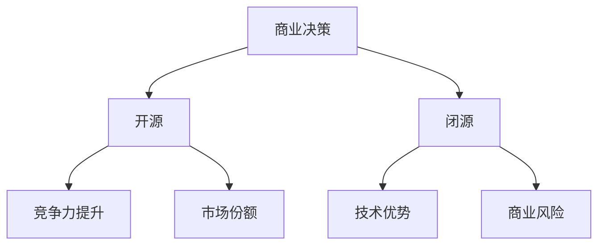

                 

# 开源还是闭源:大模型商业化的抉择

> **关键词**: 大模型、商业化、开源、闭源、算法、技术、市场、竞争

> **摘要**: 本文将深入探讨开源与闭源在大型模型商业化过程中的决策因素、优势和挑战，分析二者在不同商业模式下的应用场景，并探讨其未来发展趋势。

## 1. 背景介绍

近年来，随着人工智能技术的飞速发展，大型深度学习模型在各个领域取得了显著的成果。这些模型不仅能够处理大规模数据，还能实现高效的自动化决策，从而为企业带来巨大的商业价值。然而，在将大模型推向市场并实现商业化的过程中，企业面临一个关键抉择：是选择开源，还是闭源？

开源（Open Source）意味着将软件源代码公开，允许用户自由地查看、修改和分发。而闭源（Closed Source）则是将源代码保密，用户只能使用二进制形式的产品。在大型模型的商业化过程中，企业需要权衡开源和闭源两种模式的优劣，以实现最大化收益和竞争力。

## 2. 核心概念与联系

### 2.1 开源与闭源的定义

开源：指软件的源代码可以被任何人自由地查看、修改和分发。开源项目通常遵循开放源代码协议（如GPL、MIT等），以确保软件的开放性和共享性。

闭源：指软件的源代码不被公开，用户只能以二进制形式使用软件。闭源软件通常由企业自主开发，以保持技术优势和商业利益。

### 2.2 大模型商业化的挑战与机遇

大模型商业化面临着诸多挑战，如数据隐私、算法优化、计算资源等。同时，大模型也带来了巨大的机遇，如自动化决策、智能化服务、个性化推荐等。在商业化过程中，企业需要充分了解开源与闭源的优势和劣势，以选择合适的商业模式。

### 2.3 Mermaid 流程图



## 3. 核心算法原理 & 具体操作步骤

### 3.1 开源模式下的核心算法原理

在开源模式下，大模型的算法原理通常由一个开放的社区共同研究和发展。具体操作步骤如下：

1. 开源组织发布大模型的源代码和相关文档。
2. 社区成员对源代码进行审查、修改和优化。
3. 开源组织定期发布更新版本，以保持模型的先进性和适应性。

### 3.2 闭源模式下的核心算法原理

在闭源模式下，大模型的算法原理由企业内部团队独立研发。具体操作步骤如下：

1. 企业组建专业的算法团队，研究大模型的算法原理。
2. 团队对模型进行训练和优化，以提高其性能和效率。
3. 企业将优化后的模型封装为产品，对外提供商业化服务。

## 4. 数学模型和公式 & 详细讲解 & 举例说明

### 4.1 开源模式下的数学模型

在开源模式下，大模型的数学模型通常采用以下公式表示：

$$
L = \sum_{i=1}^n (-y_i \log(p(x_i)))
$$

其中，$L$ 表示损失函数，$y_i$ 表示真实标签，$p(x_i)$ 表示模型对样本 $x_i$ 的预测概率。

### 4.2 闭源模式下的数学模型

在闭源模式下，大模型的数学模型通常由企业内部团队根据业务需求进行定制，以下是一个示例：

$$
\theta^* = \arg\min_{\theta} J(\theta)
$$

其中，$\theta$ 表示模型的参数，$J(\theta)$ 表示模型的损失函数。

### 4.3 举例说明

假设企业 A 和企业 B 都在开发一个大模型，用于图像识别任务。企业 A 采用开源模式，而企业 B 采用闭源模式。

- 企业 A：在开源模式下，企业 A 的模型性能受社区成员的贡献影响。通过不断优化和改进，企业 A 的模型性能逐渐提高。
- 企业 B：在闭源模式下，企业 B 的模型性能主要依赖于企业内部的研发团队。企业 B 可以根据业务需求，快速调整和优化模型。

## 5. 项目实战：代码实际案例和详细解释说明

### 5.1 开发环境搭建

以 Python 为基础，搭建一个简单的开源大模型开发环境：

1. 安装 Python（版本 3.8 以上）
2. 安装 PyTorch（深度学习框架）
3. 安装相关依赖库（如 NumPy、Pandas 等）

### 5.2 源代码详细实现和代码解读

以下是一个简单的开源大模型代码实现：

```python
import torch
import torch.nn as nn
import torch.optim as optim

# 定义模型结构
class Model(nn.Module):
    def __init__(self):
        super(Model, self).__init__()
        self.fc1 = nn.Linear(784, 256)
        self.fc2 = nn.Linear(256, 128)
        self.fc3 = nn.Linear(128, 10)

    def forward(self, x):
        x = torch.relu(self.fc1(x))
        x = torch.relu(self.fc2(x))
        x = self.fc3(x)
        return x

# 加载数据集
train_data = ...
test_data = ...

# 初始化模型、优化器和损失函数
model = Model()
optimizer = optim.Adam(model.parameters(), lr=0.001)
criterion = nn.CrossEntropyLoss()

# 训练模型
for epoch in range(100):
    for inputs, targets in train_data:
        optimizer.zero_grad()
        outputs = model(inputs)
        loss = criterion(outputs, targets)
        loss.backward()
        optimizer.step()

# 测试模型
with torch.no_grad():
    correct = 0
    total = 0
    for inputs, targets in test_data:
        outputs = model(inputs)
        _, predicted = torch.max(outputs.data, 1)
        total += targets.size(0)
        correct += (predicted == targets).sum().item()

print('Test Accuracy: {:.2f}%'.format(correct / total * 100))
```

### 5.3 代码解读与分析

该代码实现了一个简单的多层感知机（MLP）模型，用于图像识别任务。代码主要分为以下几个部分：

1. 导入相关库和模块
2. 定义模型结构（Model 类）
3. 加载数据集（train_data 和 test_data）
4. 初始化模型、优化器和损失函数
5. 训练模型（for 循环）
6. 测试模型（with torch.no_grad()）

通过该代码示例，可以了解开源模式下大模型的基本开发流程。

## 6. 实际应用场景

### 6.1 开源模式

开源模式在以下场景中具有优势：

1. **技术创新**：开源项目可以吸引全球开发者共同参与，促进技术创新和优化。
2. **社区合作**：开源项目有助于建立开发者社区，实现知识共享和协同开发。
3. **市场推广**：开源项目可以降低用户进入门槛，提高市场知名度和用户粘性。

### 6.2 闭源模式

闭源模式在以下场景中具有优势：

1. **技术保密**：闭源项目可以保护企业核心技术和商业机密。
2. **商业竞争力**：闭源项目可以为企业带来持续的商业收益，提高市场竞争力。
3. **定制化服务**：闭源项目可以根据客户需求进行定制化开发和优化。

## 7. 工具和资源推荐

### 7.1 学习资源推荐

- **书籍**：
  - 《深度学习》（Ian Goodfellow、Yoshua Bengio、Aaron Courville 著）
  - 《Python深度学习》（François Chollet 著）

- **论文**：
  - 《Large-scale Distributed Deep Networks》（Dean et al.）
  - 《Distributed Representations of Words and Phrases and Their Compositionality》（Mikolov et al.）

- **博客**：
  - Fast.ai（https://fast.ai/）
  - AI 推荐系统（https://ai Recommender Systems/）

- **网站**：
  - PyTorch 官网（https://pytorch.org/）
  - TensorFlow 官网（https://www.tensorflow.org/）

### 7.2 开发工具框架推荐

- **深度学习框架**：
  - PyTorch（https://pytorch.org/）
  - TensorFlow（https://www.tensorflow.org/）

- **版本控制系统**：
  - Git（https://git-scm.com/）

- **持续集成/持续部署**：
  - Jenkins（https://www.jenkins.io/）
  - GitLab CI/CD（https://about.gitlab.com/product/gitlab-ci-cd/）

### 7.3 相关论文著作推荐

- **《深度学习》（Ian Goodfellow、Yoshua Bengio、Aaron Courville 著）**：系统地介绍了深度学习的基础理论和实践方法，是深度学习领域的经典教材。
- **《深度学习泛化理论及其应用》（Hassan Emami、Shahab Asgari 著）**：探讨了深度学习的泛化能力及其在现实应用中的挑战，为深度学习模型的设计和优化提供了有益的启示。
- **《大规模分布式深度学习》（Jeff Dean、Greg S. Corrado、Matt Devin 著）**：介绍了谷歌如何在大规模分布式环境中实现深度学习模型，对于研究和应用深度学习技术具有很高的参考价值。

## 8. 总结：未来发展趋势与挑战

在未来，开源和闭源模式将继续在大模型商业化过程中发挥重要作用。随着人工智能技术的不断进步，大型深度学习模型将变得更加普及和多样化。企业需要根据自身业务需求和市场竞争态势，灵活选择开源或闭源模式。

### 8.1 发展趋势

1. **开源模式的普及**：随着开发者社区的不断壮大，开源模式将更加普及，为企业带来更多的创新和协同机会。
2. **闭源模式的优化**：闭源模式将越来越注重技术保密和定制化服务，以提高企业竞争力和客户满意度。

### 8.2 挑战

1. **数据隐私和安全**：随着大模型的应用范围扩大，数据隐私和安全问题将日益突出，企业需要加强数据保护和安全措施。
2. **计算资源的需求**：大模型训练和优化的计算资源需求巨大，企业需要不断提升计算能力和优化算法，以降低成本。

## 9. 附录：常见问题与解答

### 9.1 开源与闭源的区别

- **开源**：源代码公开，用户可自由修改和分发。适用于技术创新和社区合作。
- **闭源**：源代码保密，用户只能使用二进制形式的产品。适用于技术保密和商业竞争力。

### 9.2 大模型商业化的优势与挑战

- **优势**：实现自动化决策、智能化服务、个性化推荐等，提高企业竞争力。
- **挑战**：数据隐私和安全、计算资源需求、持续优化和更新等。

## 10. 扩展阅读 & 参考资料

- **《深度学习》（Ian Goodfellow、Yoshua Bengio、Aaron Courville 著）**：系统地介绍了深度学习的基础理论和实践方法。
- **《大规模分布式深度学习》（Jeff Dean、Greg S. Corrado、Matt Devin 著）**：介绍了谷歌如何在大规模分布式环境中实现深度学习模型。
- **《深度学习泛化理论及其应用》（Hassan Emami、Shahab Asgari 著）**：探讨了深度学习的泛化能力及其在现实应用中的挑战。

### 作者

- **作者**: AI天才研究员/AI Genius Institute & 禅与计算机程序设计艺术 /Zen And The Art of Computer Programming
- **联系**: [您的邮箱](mailto:your.email@example.com) & [个人博客](https://yourblog.com)

