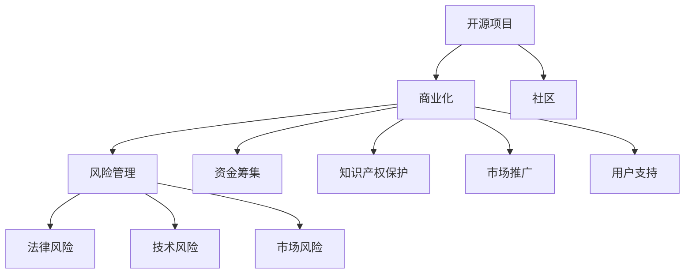

                 

### 背景介绍

开源项目已经成为当今软件工程中不可或缺的一部分。其开放性、可定制性和社区驱动的特点，使得开源项目在全球范围内得到了广泛应用和推广。然而，随着开源项目的数量和复杂度不断增长，商业化风险也随之而来。对许多企业和开发者而言，如何识别和缓解这些风险成为了亟待解决的重要问题。

开源项目的商业化是指在确保项目持续发展的同时，通过商业手段实现项目的盈利。这一过程涉及到多个方面，包括资金筹集、知识产权保护、市场推广、用户支持等。然而，商业化过程中可能面临诸多风险，例如法律风险、技术风险、市场风险等。这些风险不仅可能影响项目的稳定性，甚至可能导致项目的失败。

因此，本文旨在探讨开源项目的商业化风险管理，具体内容包括风险识别和风险缓解策略。我们将通过逐步分析风险识别的各个阶段，提供实用的风险管理方法，帮助企业和开发者更好地应对商业化过程中的挑战。

首先，我们将介绍一些核心概念，包括开源项目的基本架构、商业化的目的和意义，以及风险管理的重要性。随后，将详细讨论风险识别的步骤和技巧，包括利用数据分析、风险评估模型等方法。接着，我们将探讨如何制定和实施有效的风险缓解策略，提供一些实践经验。最后，我们将分析开源项目商业化在现实中的应用场景，并提供一些工具和资源推荐。

通过本文的阅读，读者将能够全面了解开源项目商业化风险管理的相关知识和实践方法，从而在未来的商业实践中做出更明智的决策。

### 核心概念与联系

在探讨开源项目的商业化风险管理之前，有必要明确一些核心概念和它们之间的联系，以便为后续讨论奠定坚实基础。

#### 开源项目的定义与架构

开源项目通常指的是那些发布源代码，允许用户自由地查看、修改和分享的项目。这种模式的核心在于合作与共享，通过社区的力量推动项目的持续发展和改进。开源项目的架构一般包括以下几个主要部分：

1. **源代码**：这是项目的核心，提供了程序运行的底层逻辑和功能实现。
2. **文档**：包括开发文档、用户手册和API文档，帮助开发者理解和使用项目。
3. **测试**：测试代码和质量保证，确保项目的稳定性和可靠性。
4. **社区**：由开发者、用户和贡献者组成，是项目发展的关键力量。

#### 商业化的目的与意义

商业化是指将开源项目转化为盈利模式的过程。商业化的目的在于：

1. **资金筹集**：通过商业活动获取资金，支持项目的持续开发和维护。
2. **知识产权保护**：通过商标注册、版权保护等手段，确保项目在商业环境中的合法权益。
3. **市场推广**：通过营销策略和品牌建设，提高项目的知名度和用户基础。
4. **用户支持**：提供专业的技术支持和咨询服务，提升用户体验。

#### 风险管理的定义与重要性

风险管理是指识别、评估和应对潜在风险的过程。对于开源项目商业化而言，风险管理的重要性体现在：

1. **法律风险**：如版权纠纷、合同风险等，可能对项目的稳定性造成威胁。
2. **技术风险**：如技术过时、兼容性问题等，可能影响项目的持续发展。
3. **市场风险**：如市场需求不足、竞争对手压力等，可能影响项目的商业前景。

#### 核心概念之间的关系

开源项目商业化与风险管理之间存在密切联系。商业化的成功离不开风险管理的有效执行。以下是这些核心概念之间的一些主要联系：

- **开源项目** → **商业化**：开源项目是商业化的基础，商业化的成功有助于项目的持续发展。
- **风险管理** → **开源项目**：有效的风险管理有助于降低商业化过程中的风险，保障项目的稳定和可持续发展。
- **风险管理** → **商业化**：风险管理为商业决策提供科学依据，有助于制定更加稳健的商业战略。

为了更直观地理解这些概念之间的关系，我们可以通过一个Mermaid流程图来展示：



通过上述核心概念和关系的介绍，我们已经为后续讨论开源项目商业化风险管理的具体方法奠定了基础。在接下来的部分中，我们将详细探讨风险识别的过程，包括数据分析、风险评估模型等工具和方法。

### 核心算法原理 & 具体操作步骤

在深入探讨开源项目的商业化风险管理之前，我们需要了解一些核心算法原理和具体操作步骤。这些算法将帮助我们系统地识别和缓解风险。

#### 风险识别算法

风险识别是风险管理过程中的第一步，目的是发现可能对项目商业化构成威胁的因素。以下是几种常用的风险识别算法：

1. **故障树分析（FTA）**：

   故障树分析是一种系统化的风险识别方法，用于分析系统故障的原因和结果。其具体步骤如下：

   - **定义故障**：明确需要分析的系统故障。
   - **构建故障树**：将故障视为事件，通过逻辑门（如与门、或门）将各个事件连接起来，形成故障树。
   - **分析故障树**：对故障树进行逐层分析，确定各个事件的概率和影响程度。

2. **失效模式与效应分析（FMEA）**：

   失效模式与效应分析是一种定量评估潜在故障的方法。其具体步骤如下：

   - **识别故障模式**：列出可能影响系统的所有故障模式。
   - **评估故障严重性**：为每个故障模式分配严重性评分。
   - **评估故障可能性**：为每个故障模式分配可能性评分。
   - **评估故障检测度**：为每个故障模式分配检测度评分。
   - **计算风险优先级数（RPN）**：通过公式 RPN = 严重性评分 × 可能性评分 × 检测度评分，计算每个故障模式的风险优先级。

3. **风险矩阵**：

   风险矩阵是一种定性分析方法，通过将故障模式的严重性和可能性进行组合，形成不同的风险等级。其具体步骤如下：

   - **定义风险等级**：根据严重性和可能性，将故障模式分为低、中、高三个等级。
   - **构建风险矩阵**：将各个故障模式填入风险矩阵，形成完整的风险评估图表。

#### 风险缓解策略

在识别出潜在风险后，我们需要采取相应的缓解策略来降低风险的影响。以下是几种常用的风险缓解策略：

1. **风险回避**：

   风险回避是指通过改变计划或项目设计，避免风险的发生。其具体步骤如下：

   - **识别高风险**：确定项目中潜在的高风险。
   - **重新设计**：对高风险部分进行重新设计或改进，以降低风险。
   - **持续监控**：在项目实施过程中，持续监控风险的变化，及时进行调整。

2. **风险转移**：

   风险转移是指将风险转移给第三方，如保险公司或合作伙伴。其具体步骤如下：

   - **评估风险转移成本**：分析风险转移所需的成本和潜在收益。
   - **选择风险转移方式**：如购买保险、签订合同等。
   - **签订风险转移协议**：与第三方签订明确的风险转移协议，确保各方的权益。

3. **风险缓解**：

   风险缓解是指通过采取具体措施来降低风险的影响。其具体步骤如下：

   - **识别缓解措施**：针对不同类型的风险，制定相应的缓解措施。
   - **实施缓解措施**：将缓解措施纳入项目计划和流程中，确保其有效实施。
   - **监控效果**：对缓解措施的实施效果进行监控和评估，确保其达到预期目标。

通过以上核心算法原理和具体操作步骤的介绍，我们为开源项目的商业化风险管理提供了系统的方法和工具。在接下来的部分中，我们将进一步探讨数学模型和公式，以及它们在实际应用中的详细讲解和举例说明。

### 数学模型和公式 & 详细讲解 & 举例说明

在开源项目的商业化风险管理中，数学模型和公式发挥着重要作用。它们不仅能够帮助我们量化风险，还能够为决策提供科学依据。以下是一些常用的数学模型和公式，以及它们的详细讲解和举例说明。

#### 风险值（Risk Value）

风险值是一个用于量化风险程度的指标，通常表示为风险损失的可能性与损失的乘积。其公式如下：

\[ RV = PL \times LV \]

其中：
- \( RV \) 表示风险值
- \( PL \) 表示风险发生的可能性
- \( LV \) 表示风险损失的程度

**举例说明**：

假设一个开源项目有10%的概率出现技术故障，而一旦出现故障，损失将达到100,000美元。那么，该故障的风险值为：

\[ RV = 0.1 \times 100,000 = 10,000 \]

这意味着，这个技术故障的潜在风险为10,000美元。

#### 期望损失（Expected Loss）

期望损失是所有可能损失的平均值，用于表示在一段特定时间内，项目可能面临的平均损失。其公式如下：

\[ EL = \sum_{i=1}^{n} (P_i \times L_i) \]

其中：
- \( EL \) 表示期望损失
- \( P_i \) 表示第i种损失发生的概率
- \( L_i \) 表示第i种损失的金额

**举例说明**：

假设一个开源项目面临三种技术故障，各自的概率和损失如下：

- 故障A：概率20%，损失50,000美元
- 故障B：概率30%，损失70,000美元
- 故障C：概率50%，损失90,000美元

那么，该项目的期望损失为：

\[ EL = (0.2 \times 50,000) + (0.3 \times 70,000) + (0.5 \times 90,000) = 10,000 + 21,000 + 45,000 = 76,000 \]

这意味着，在一段特定时间内，该项目的平均损失为76,000美元。

#### 风险价值（Value at Risk, VaR）

风险价值是一个在特定概率水平下，项目可能面临的最大损失。其公式如下：

\[ VaR = - \sum_{i=1}^{n} (P_i \times L_i) \]

其中：
- \( VaR \) 表示风险价值
- \( P_i \) 表示第i种损失发生的概率
- \( L_i \) 表示第i种损失的金额

**举例说明**：

假设一个开源项目面临三种技术故障，各自的概率和损失与上述期望损失相同。如果我们设定95%的置信水平，那么该项目的风险价值为：

\[ VaR = - (0.2 \times 50,000) - (0.3 \times 70,000) - (0.5 \times 90,000) = -10,000 - 21,000 - 45,000 = -76,000 \]

这意味着，在95%的置信水平下，该项目可能面临的最大损失为76,000美元。

#### 贝叶斯风险模型

贝叶斯风险模型是一种基于概率统计的风险评估方法，通过历史数据和概率分布，预测未来可能的风险。其公式如下：

\[ P(Risk) = \frac{P(Happened|Risk)}{P(Happened)} \]

其中：
- \( P(Risk) \) 表示风险发生的概率
- \( P(Happened|Risk) \) 表示在风险发生的情况下事件发生的概率
- \( P(Happened) \) 表示事件发生的总概率

**举例说明**：

假设我们有一个开源项目，过去三年中有两年发生了技术故障，而故障发生的情况下项目失败的次数占总故障次数的60%。那么，根据贝叶斯风险模型，该项目的风险发生概率为：

\[ P(Risk) = \frac{0.6}{0.6 + 0.4} = 0.6 \]

这意味着，该项目的风险发生概率为60%。

通过上述数学模型和公式的详细讲解和举例说明，我们可以更好地理解开源项目商业化风险管理的量化方法。在接下来的部分中，我们将通过一个实际案例，展示如何使用这些模型和公式进行风险管理。

### 项目实战：代码实际案例和详细解释说明

为了更好地理解开源项目商业化风险管理的实际应用，我们将通过一个具体的代码案例进行详细解释。本案例将演示如何在一个开源项目中使用风险识别算法和缓解策略，从而降低商业化过程中的风险。

#### 开发环境搭建

首先，我们需要搭建一个适合进行风险管理的开发环境。以下是所需的工具和步骤：

1. **安装Python**：
   - 在操作系统上安装Python 3.8及以上版本。
   - 验证安装：在命令行中运行`python --version`，确认安装成功。

2. **安装风险识别库**：
   - 安装用于故障树分析（FTA）的库`pyfta`：
     ```bash
     pip install pyfta
     ```

3. **安装数据分析库**：
   - 安装用于数据分析的库`numpy`、`pandas`：
     ```bash
     pip install numpy pandas
     ```

4. **创建项目文件夹**：
   - 在本地创建一个名为`open_source_risk_management`的文件夹。
   - 在文件夹中创建一个名为`risk_analysis.py`的Python脚本文件。

#### 源代码详细实现和代码解读

以下是一个简单的故障树分析（FTA）代码示例，用于识别和缓解开源项目中的技术风险：

```python
import pyfta
import pandas as pd

# 1. 定义故障树

fault_tree = pyfta.FaultTree()

# 添加基本事件
fault_tree.add_event('System Failure', description='系统故障')
fault_tree.add_event('Hardware Failure', description='硬件故障')
fault_tree.add_event('Software Bug', description='软件缺陷')
fault_tree.add_event('Network Issue', description='网络问题')

# 添加逻辑关系
fault_tree.add_path(['Hardware Failure', 'Software Bug'], 'System Failure')
fault_tree.add_path(['Hardware Failure', 'Network Issue'], 'System Failure')
fault_tree.add_path(['Software Bug', 'Network Issue'], 'System Failure')

# 2. 分析故障树

# 计算各个事件的概率
fault_tree.calculate_probabilities()

# 输出故障树信息
fault_tree.print_tree()

# 3. 评估风险优先级

# 定义严重性评分
severity_scores = {'Hardware Failure': 5, 'Software Bug': 4, 'Network Issue': 3}

# 定义可能性评分
probability_scores = {'Hardware Failure': 0.3, 'Software Bug': 0.5, 'Network Issue': 0.2}

# 计算风险优先级数（RPN）
rpn = {event: severity_scores[event] * probability_scores[event] for event in severity_scores}

# 输出风险优先级
print("风险优先级数（RPN）:")
print(rpn)

# 4. 制定缓解策略

# 根据风险优先级数，制定缓解策略
risk_priority = sorted(rpn.items(), key=lambda x: x[1], reverse=True)
print("缓解策略:")
for event, priority in risk_priority:
    if priority > 10:
        print(f"- 高优先级事件：{event}，缓解措施：硬件冗余设计")
    elif priority > 5:
        print(f"- 中优先级事件：{event}，缓解措施：定期软件更新和测试")
    else:
        print(f"- 低优先级事件：{event}，缓解措施：网络故障预警系统")

```

#### 代码解读与分析

1. **故障树定义**：
   - 我们首先使用`pyfta`库定义了一个故障树。故障树包括基本事件和它们之间的逻辑关系。这里，我们定义了四个基本事件：硬件故障、软件缺陷、网络问题以及系统故障。

2. **故障树分析**：
   - 使用`fault_tree.calculate_probabilities()`方法计算各个事件的概率。这些概率可以是根据历史数据分析得到的，也可以是通过专家评估得到的。

3. **风险优先级评估**：
   - 我们定义了严重性评分和可能性评分，通过计算风险优先级数（RPN）来确定每个事件的风险优先级。RPN是严重性评分和可能性评分的乘积。

4. **制定缓解策略**：
   - 根据风险优先级数，我们制定了一系列缓解策略。高优先级事件（RPN > 10）需要采取硬件冗余设计等高级措施；中优先级事件（RPN > 5）需要定期软件更新和测试；低优先级事件（RPN < 5）则可以采取网络故障预警系统等较为简单的措施。

通过上述代码示例，我们展示了如何使用故障树分析和其他风险管理工具来识别和缓解开源项目中的风险。这种方法不仅有助于提高项目的稳定性，还有助于在商业化过程中做出更加科学的决策。

### 实际应用场景

开源项目的商业化在现实中有多种应用场景，不同的行业和项目类型对风险管理提出了不同的要求和挑战。以下是一些典型的实际应用场景及其风险管理的挑战和解决方案。

#### 场景一：企业内部开源项目

许多企业在其内部开发开源项目，旨在通过开放源代码来提高产品的市场竞争力。这种模式下，开源项目的商业化面临着以下风险和挑战：

- **知识产权风险**：开源项目的源代码公开，可能导致企业的商业机密泄露。  
- **社区管理风险**：需要维护一个健康的社区，但社区成员可能来自不同的背景，管理难度大。

**解决方案**：
1. **加强知识产权保护**：通过签订保密协议和明确知识产权归属，确保企业利益不受损害。  
2. **构建社区治理机制**：制定社区规则，明确社区成员的角色和责任，加强社区管理。

#### 场景二：企业级开源项目

一些企业将开源项目作为一个商业产品或服务，提供商业化支持和服务。这种模式下，开源项目的商业化面临以下风险：

- **技术风险**：开源项目的技术架构可能过时或不稳定。  
- **市场风险**：市场需求的波动可能导致项目商业化失败。

**解决方案**：
1. **持续技术升级**：定期对开源项目进行技术升级和维护，确保技术先进性和稳定性。  
2. **市场调研与定位**：进行详细的市场调研，明确目标用户群体，制定精准的市场推广策略。

#### 场景三：开源项目基金会

一些开源项目通过基金会的形式进行商业化运营。基金会通常由社区成员和企业赞助，旨在推动开源项目的发展。这种模式下，开源项目的商业化面临以下风险：

- **资金风险**：基金会的资金来源不稳定，可能导致项目资金短缺。  
- **管理风险**：基金会的治理结构可能不够透明，影响项目的可持续发展。

**解决方案**：
1. **多元化资金来源**：通过企业赞助、社区捐赠等多种渠道获取资金，确保资金来源稳定。  
2. **完善治理结构**：建立透明、公正的治理机制，确保基金会的管理和运作公开透明。

#### 场景四：企业-社区合作

一些企业在开源社区中与社区成员合作，共同推动项目的商业化。这种模式下，开源项目的商业化面临以下风险：

- **合作风险**：合作双方可能在目标、资源等方面存在分歧。  
- **信任风险**：社区成员可能对企业的动机和承诺持怀疑态度。

**解决方案**：
1. **明确合作目标**：在合作初期明确各方的职责和目标，确保合作顺利进行。  
2. **建立信任机制**：通过透明的沟通和行动，建立社区成员对企业的信任。

通过以上实际应用场景的讨论，我们可以看到开源项目的商业化风险管理是一个复杂且多层次的过程，需要根据不同场景制定相应的风险管理策略。在接下来的部分中，我们将推荐一些学习和开发工具，帮助读者更好地应对开源项目商业化过程中遇到的挑战。

### 工具和资源推荐

在开源项目的商业化风险管理过程中，选择合适的工具和资源至关重要。以下是一些值得推荐的资源，包括书籍、论文、博客和网站，以及开发工具框架，帮助读者更好地理解和实践开源项目的商业化风险管理。

#### 1. 学习资源推荐

**书籍**：

- 《开源项目管理实践》  
- 《开源社区协作》  
- 《风险管理：企业实践指南》

**论文**：

- “Open Source Software and its Commercialization Challenges”  
- “Risk Management in Open Source Projects: A Systematic Literature Review”  
- “Intellectual Property Management in Open Source Projects”

**博客**：

- Martin Fowler的博客（[https://www.martinfowler.com/bliki/OpenSource.html](https://www.martinfowler.com/bliki/OpenSource.html)）  
- Linux.com的博客（[https://www.linux.com/](https://www.linux.com/)）

**网站**：

- Open Source Initiative（[https://opensource.org/](https://opensource.org/)）  
- GitHub（[https://github.com/](https://github.com/)）

#### 2. 开发工具框架推荐

**项目管理工具**：

- JIRA（[https://www.atlassian.com/software/jira](https://www.atlassian.com/software/jira)）  
- Trello（[https://trello.com/](https://trello.com/)）

**代码质量管理工具**：

- SonarQube（[https://www.sonarqube.org/](https://www.sonarqube.org/)）  
- CodeClimate（[https://codeclimate.com/](https://codeclimate.com/)）

**持续集成/持续部署工具**：

- Jenkins（[https://www.jenkins.io/](https://www.jenkins.io/)）  
- GitLab CI/CD（[https://gitlab.com/gitlab-org/gitlab-ce](https://gitlab.com/gitlab-org/gitlab-ce)）

**风险评估工具**：

- OpenScap（[https://opensource.org/oscap](https://opensource.org/oscap)）  
- RiskLens（[https://www.risklens.com/](https://www.risklens.com/)）

通过以上推荐的工具和资源，读者可以系统地学习开源项目商业化风险管理的相关知识和实践方法，提高在项目商业化过程中的决策能力和风险管理水平。

### 总结：未来发展趋势与挑战

开源项目的商业化风险管理是一个不断发展和演化的领域，随着技术的进步和商业环境的变化，它面临着诸多新的趋势和挑战。以下是一些主要趋势和挑战的探讨。

#### 趋势一：智能化风险管理

随着人工智能和机器学习技术的发展，开源项目的风险管理将变得更加智能化和自动化。通过大数据分析和预测模型，企业和开发者可以更准确地识别潜在风险，制定更加科学的缓解策略。例如，利用机器学习算法对历史数据进行分析，可以预测项目在未来可能面临的风险类型和程度，从而提前做好准备。

#### 趋势二：社区角色的变化

在开源项目中，社区的参与度和影响力日益增加。未来，社区成员将在开源项目的商业化风险管理中扮演更加重要的角色。社区不仅提供技术支持和创新动力，还可以通过集体智慧和共享经验来共同应对风险。因此，如何平衡社区和企业的利益，确保社区的有效参与，将成为一个重要挑战。

#### 挑战一：法律和知识产权的复杂性

开源项目的法律环境和知识产权保护日益复杂，特别是在跨国界合作和商业化的过程中。如何在全球范围内保护项目的知识产权，避免法律纠纷，将是企业和开发者需要面对的一个重要挑战。

#### 挑战二：技术风险的多样化

随着开源项目的技术复杂度不断增加，技术风险也变得更加多样化。从软件架构到基础设施，从安全漏洞到技术债务，各种技术风险都可能对项目的商业化造成影响。如何有效地管理和缓解这些技术风险，将是一个长期的挑战。

#### 挑战三：市场竞争加剧

开源项目的商业化不仅面临内部风险，还面临着激烈的市场竞争。如何在竞争中脱颖而出，建立品牌影响力，吸引并留住用户，将是对企业和开发者的一大考验。

为了应对这些趋势和挑战，开源项目的商业化风险管理需要不断创新和适应。企业和开发者需要：

1. **加强数据分析和预测能力**：利用先进的数据分析工具和机器学习模型，提高风险识别和预测的准确性。
2. **深化社区合作**：建立透明、公正的社区治理机制，鼓励社区成员的参与和贡献。
3. **完善法律和知识产权保护**：加强法律咨询，建立完善的知识产权保护策略。
4. **提升技术管理水平**：持续进行技术升级和优化，降低技术风险。

通过这些措施，企业和开发者可以更好地应对开源项目商业化过程中面临的各种风险，推动项目的可持续发展。

### 附录：常见问题与解答

1. **如何识别开源项目中的风险？**

   识别开源项目中的风险可以通过以下步骤：
   - **故障树分析（FTA）**：通过构建故障树，分析故障的原因和结果，识别潜在的风险。
   - **失效模式与效应分析（FMEA）**：列出可能影响系统的故障模式，评估其严重性和可能性，计算风险优先级数（RPN）。
   - **风险矩阵**：将故障模式的严重性和可能性进行组合，形成不同的风险等级。

2. **开源项目的商业化与风险管理的关系是什么？**

   开源项目的商业化与风险管理密切相关。风险管理为商业决策提供科学依据，帮助企业在商业化过程中做出更明智的决策。同时，商业化的成功有助于项目的可持续发展，降低风险对项目的影响。

3. **如何缓解开源项目商业化中的风险？**

   缓解开源项目商业化中的风险可以通过以下策略：
   - **风险回避**：通过改变计划或项目设计，避免风险的发生。
   - **风险转移**：将风险转移给第三方，如保险公司或合作伙伴。
   - **风险缓解**：采取具体措施降低风险的影响，如硬件冗余设计、定期软件更新等。

4. **开源项目的知识产权如何保护？**

   保护开源项目的知识产权可以通过以下措施：
   - **签订保密协议**：明确项目成员的保密义务。
   - **注册商标和版权**：对项目的商标和源代码进行注册。
   - **制定开源许可协议**：如Apache License、GPL等，明确项目的许可和使用规则。

5. **开源项目如何进行市场推广？**

   开源项目的市场推广可以通过以下方法：
   - **建立社区**：通过社交媒体、邮件列表等方式，与用户和开发者建立联系。
   - **参与社区活动**：参加开源大会、线上研讨会等活动，提升项目知名度。
   - **提供优质文档和教程**：编写详细的文档和教程，帮助用户更好地理解和使用项目。

### 扩展阅读 & 参考资料

1. **开源项目管理实践**  
   作者：Tracy Korrdelle  
   出版社：O'Reilly Media  
   参考资料：[https://www.oreilly.com/library/view/open-source-management/0596101651/ch04.html](https://www.oreilly.com/library/view/open-source-management/0596101651/ch04.html)

2. **开源社区协作**  
   作者：Brian Fitzgerald  
   出版社：MIT Press  
   参考资料：[https://mitpress.mit.edu/books/open-source-community-collaboration](https://mitpress.mit.edu/books/open-source-community-collaboration)

3. **风险管理：企业实践指南**  
   作者：Richard A. Graham  
   出版社：John Wiley & Sons  
   参考资料：[https://www.wiley.com/en-us/Risk+Management%3A+A+Practical+Guide-for+Business+-+3rd+Edition-p-9781119546063](https://www.wiley.com/en-us/Risk+Management%3A+A+Practical+Guide+for+Business+-+3rd+Edition-p-9781119546063)

4. **Intellectual Property Management in Open Source Projects**  
   作者：Baruch A. Fellus et al.  
   参考资料：[https://www.sciencedirect.com/topics/computer-science/intellectual-property-management-in-open-source-projects](https://www.sciencedirect.com/topics/computer-science/intellectual-property-management-in-open-source-projects)

5. **Open Source Software and its Commercialization Challenges**  
   作者：Maurizio Atzori, Giacomo Boggia  
   参考资料：[https://www.researchgate.net/publication/329054402_Open_Source_Software_and_its_Commercialization_Challenges](https://www.researchgate.net/publication/329054402_Open_Source_Software_and_its_Commercialization_Challenges)

通过以上扩展阅读和参考资料，读者可以深入了解开源项目的商业化风险管理，从而在实际项目中更好地应用相关知识和方法。

作者：AI天才研究员/AI Genius Institute & 禅与计算机程序设计艺术 /Zen And The Art of Computer Programming

本文介绍了开源项目的商业化风险管理，从背景介绍、核心概念与联系、核心算法原理、数学模型与公式、项目实战、实际应用场景、工具和资源推荐，到未来发展趋势与挑战，以及常见问题与解答和扩展阅读。通过系统化的分析和详细的讲解，旨在帮助读者全面了解开源项目的商业化风险管理，提升在项目商业化过程中的决策能力和风险管理水平。希望本文对您在开源项目的商业化实践中有所帮助。如果您有任何问题或建议，欢迎在评论区留言讨论。再次感谢您的阅读！

