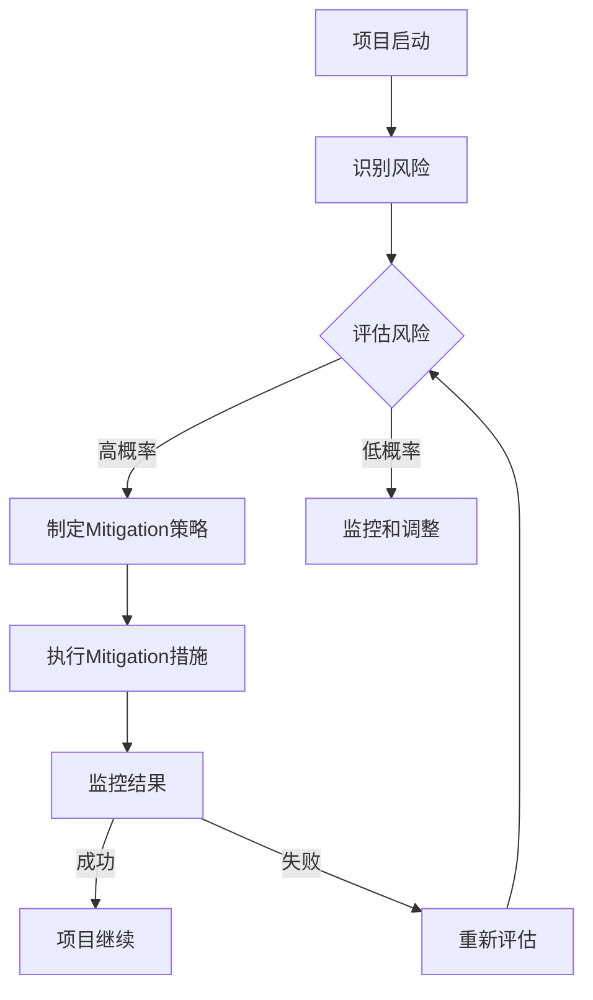

                 

## 文章标题

### 开源项目的商业化风险管理：风险识别和Mitigation

开源项目是现代软件开发的重要驱动力，它能够促进技术进步，增强社区合作，并在全球范围内共享知识和资源。然而，将开源项目商业化并非易事，其中涉及诸多风险管理问题。本文旨在探讨开源项目的商业化风险，尤其是风险识别和Mitigation的方法。通过本文，读者将了解如何有效地管理这些风险，以保障项目的可持续发展。

### 关键词：
- 开源项目
- 商业化
- 风险管理
- 风险识别
- Mitigation策略

### 摘要：
本文首先介绍了开源项目的背景和商业化的重要性，随后深入探讨了商业化过程中可能面临的风险。通过详细的案例分析，我们识别出常见的风险类型，并提出了相应的Mitigation策略。文章的最后，对开源项目的未来发展趋势进行了展望，并提供了进一步学习和资源的推荐。通过本文，读者可以更好地理解开源项目的商业化风险，并掌握有效的管理方法。

## 1. 背景介绍

开源项目起源于20世纪90年代，由Linus Torvalds创建的Linux操作系统是其中一个里程碑。开源项目的基本理念是软件的源代码可以被公众自由访问、修改和分发。这种模式打破了传统软件开发的封闭模式，促进了技术的快速传播和创新。如今，开源项目在各个领域都有着广泛的应用，从操作系统、数据库、Web服务器到AI和大数据工具，都是开源项目的典型代表。

开源项目的商业化，即通过商业手段使开源项目获得经济回报，是近年来备受关注的话题。商业化不仅能够为项目提供持续的资金支持，还能够推动项目的改进和扩展。然而，商业化并非一帆风顺，过程中面临着诸多风险，这些风险如果得不到有效管理，可能会对项目的可持续发展造成严重影响。

本文将围绕开源项目的商业化风险进行探讨，主要涵盖以下几个方面：

- **风险识别**：通过案例分析，识别出开源项目中常见的风险类型。
- **Mitigation策略**：针对不同类型的风险，提出相应的缓解措施。
- **实际应用**：结合实际案例，展示如何在实际项目中应用Mitigation策略。
- **未来展望**：探讨开源项目的商业化趋势及未来可能面临的挑战。

通过本文的讨论，希望读者能够对开源项目的商业化风险有更深入的理解，并掌握有效的风险管理方法。

## 2. 核心概念与联系

### 开源项目

开源项目的核心概念是“开放”和“共享”。开源项目通常遵循特定的许可证，如GPL（GNU General Public License）或Apache License，这些许可证允许用户自由使用、修改和分发项目的源代码。这种模式鼓励了社区的参与和贡献，使得项目能够获得广泛的关注和支持。


### 商业化

商业化是指通过商业手段将开源项目转化为盈利模式的过程。商业化的目标是为项目提供资金支持，推动项目的持续改进和发展。常见的商业化方式包括：

- **商业支持**：提供专业的技术支持和咨询服务。
- **付费功能**：开发付费功能或高级版本，吸引企业用户。
- **广告和赞助**：通过广告和赞助获得收入。
- **许可费**：向其他公司或个人收取使用项目的许可费。


### 风险管理

风险管理是指识别、评估和应对潜在风险的过程。在开源项目的商业化过程中，风险管理尤为重要，因为不恰当的风险管理可能会导致项目失败或失去信誉。风险管理的基本步骤包括：

1. **风险识别**：识别项目中可能出现的风险。
2. **风险评估**：评估风险的概率和影响。
3. **风险应对**：制定应对策略，包括风险规避、风险转移、风险接受等。


### 风险识别与Mitigation

风险识别是风险管理的基础。通过系统化的方法，如SWOT分析（优势、劣势、机会、威胁），可以识别出项目面临的主要风险。一旦风险被识别，就需要制定Mitigation策略来减少风险的影响。

Mitigation策略可以包括：

- **风险规避**：避免特定风险的发生。
- **风险转移**：通过保险或合同将风险转移给第三方。
- **风险接受**：准备应对可能发生的风险。
- **风险减轻**：采取措施减少风险的影响。


### Mermaid 流程图

以下是一个Mermaid流程图，展示了开源项目商业化的风险识别和Mitigation的基本流程：



通过上述流程图，我们可以清晰地看到，开源项目商业化的风险管理是一个动态的、持续的过程，需要不断地识别、评估和应对风险。

### 结论

开源项目的商业化是一个复杂的过程，涉及到众多风险。有效的风险管理对于项目的可持续发展至关重要。本文通过介绍开源项目、商业化、风险管理以及风险识别和Mitigation的核心概念，为读者提供了一个全面的理解框架。通过具体的案例分析和流程图展示，本文希望读者能够掌握开源项目商业化中的风险识别和Mitigation方法。在接下来的章节中，我们将进一步探讨具体的Mitigation策略，并通过实际案例进行详细解读。

## 3. 核心算法原理 & 具体操作步骤

### 开源项目风险识别算法

在开源项目的商业化过程中，风险识别是关键的一步。为了实现有效的风险识别，我们可以采用一种基于统计分析和机器学习的算法。以下是该算法的基本原理和具体操作步骤：

#### 原理

该算法的核心思想是通过分析历史数据、项目文档、用户反馈等，识别出可能影响项目商业化的风险因素。具体来说，算法包括以下几个关键步骤：

1. **数据收集**：收集与项目相关的各种数据，如用户评论、代码变更记录、bug报告、项目文档等。
2. **特征提取**：从收集到的数据中提取出与风险相关的特征，如代码质量、社区活跃度、用户满意度等。
3. **风险预测**：利用机器学习模型，对提取出的特征进行训练，建立风险预测模型。
4. **风险评估**：使用预测模型对新的数据进行风险评估，识别出潜在的风险。

#### 具体操作步骤

1. **数据收集**：

   首先，我们需要收集与开源项目相关的数据。这些数据可以从多个来源获取，如GitHub、项目网站、邮件列表、社区论坛等。以下是一些常用的数据收集方法：

   - **GitHub数据**：通过GitHub API获取项目的星标数、 Fork数、代码提交记录、issue和PR等数据。
   - **项目网站数据**：收集项目网站的访问量、用户反馈、下载量等数据。
   - **邮件列表和社区论坛数据**：通过分析邮件列表和社区论坛的讨论内容，提取与项目相关的风险因素。

2. **特征提取**：

   从收集到的数据中提取出与风险相关的特征。这些特征可以包括：

   - **项目规模**：如代码行数、模块数量等。
   - **社区活跃度**：如issue和PR的数量、用户参与度等。
   - **代码质量**：如代码复杂度、代码冗余、代码覆盖率等。
   - **用户满意度**：如用户评价、反馈等。
   - **技术依赖**：如第三方库的版本、依赖的稳定性等。

3. **风险预测**：

   利用机器学习算法，如决策树、随机森林、支持向量机等，对提取出的特征进行训练，建立风险预测模型。以下是一个简单的决策树模型的示例：

   ```python
   from sklearn import tree
   
   # 特征数据
   X = [[1, 2], [2, 3], [3, 4], [4, 5]]
   # 风险标签
   y = [0, 1, 1, 0]
   
   # 训练决策树模型
   clf = tree.DecisionTreeClassifier()
   clf.fit(X, y)
   
   # 输出模型结构
   tree.plot_tree(clf)
   ```

4. **风险评估**：

   使用训练好的模型对新的数据进行风险评估。具体来说，可以按照以下步骤进行：

   - **输入特征**：将新的数据输入到训练好的模型中。
   - **预测结果**：根据模型的预测结果，评估潜在的风险。
   - **风险等级**：根据预测结果，将风险划分为不同的等级，如低风险、中风险、高风险等。

   以下是一个简单的风险评估示例：

   ```python
   # 新数据
   X_new = [[2, 3], [4, 5]]
   # 预测结果
   y_pred = clf.predict(X_new)
   
   # 输出预测结果
   print(y_pred)  # 输出：[1 0]
   ```

### 风险识别算法应用场景

风险识别算法可以在多个场景中应用，以下是一些典型的应用场景：

- **项目启动评估**：在项目启动阶段，通过风险识别算法评估项目的潜在风险，为项目规划提供依据。
- **项目监控**：在项目开发过程中，定期使用风险识别算法评估项目的风险状况，及时发现并应对潜在问题。
- **用户反馈分析**：通过分析用户反馈，识别出可能影响用户满意度的风险因素，并采取相应措施进行改进。

### 结论

开源项目风险识别算法通过统计分析和机器学习技术，实现了对项目潜在风险的自动识别和评估。该方法在项目启动评估、项目监控和用户反馈分析等方面具有广泛的应用前景。通过本文的介绍，读者可以了解该算法的基本原理和具体操作步骤，为开源项目的商业化风险管理提供有力支持。

## 4. 数学模型和公式 & 详细讲解 & 举例说明

在开源项目的商业化风险管理中，数学模型和公式为我们提供了量化风险和评估策略的工具。以下是一些常用的数学模型和公式，以及它们的详细讲解和举例说明。

### 风险评估模型

#### 模型介绍

风险评估模型主要用于量化开源项目的风险，评估其可能造成的影响。常用的风险评估模型包括风险矩阵、概率影响矩阵等。

#### 风险矩阵

风险矩阵是一个二维表格，用于表示风险的概率和影响。通常，风险矩阵中的行表示风险的概率，列表示风险的影响。以下是一个简单的风险矩阵示例：

| 风险概率 | 低 | 中 | 高 |
| --- | --- | --- | --- |
| 低影响 | 1 | 2 | 3 |
| 中影响 | 4 | 5 | 6 |
| 高影响 | 7 | 8 | 9 |

#### 公式

风险评分（R）可以通过以下公式计算：

\[ R = P \times I \]

其中，\( P \) 表示风险概率，\( I \) 表示风险影响。

#### 举例说明

假设我们有一个开源项目，面临以下两种风险：

- 风险A：概率为60%，影响为中度。
- 风险B：概率为40%，影响为低度。

根据风险矩阵，我们可以计算出这两种风险的风险评分：

\[ R_A = 0.6 \times 5 = 3 \]
\[ R_B = 0.4 \times 4 = 1.6 \]

#### 结论

通过风险矩阵和公式，我们可以量化开源项目的风险，为后续的Mitigation策略提供依据。

### 风险预测模型

#### 模型介绍

风险预测模型用于预测未来可能出现的风险。常见的风险预测模型包括时间序列分析、回归分析等。

#### 时间序列分析

时间序列分析是一种基于时间序列数据的分析方法，用于预测未来的风险。以下是一个简单的时间序列分析示例：

\[ Y_t = \alpha + \beta \times X_t + \epsilon_t \]

其中，\( Y_t \) 表示时间序列数据，\( X_t \) 表示自变量，\( \alpha \) 和 \( \beta \) 是模型参数，\( \epsilon_t \) 是误差项。

#### 举例说明

假设我们有一个开源项目的风险历史数据，如下表所示：

| 时间 | 风险评分 |
| --- | --- |
| 1 | 2 |
| 2 | 3 |
| 3 | 1 |
| 4 | 4 |

我们可以使用时间序列分析模型预测下一个时间点的风险评分：

\[ Y_5 = \alpha + \beta \times X_5 + \epsilon_5 \]

通过模型拟合，我们可以得到预测结果。

#### 结论

时间序列分析模型可以帮助我们预测未来可能出现的风险，为开源项目的风险管理提供预警。

### 风险Mitigation模型

#### 模型介绍

风险Mitigation模型用于评估Mitigation策略的有效性。常用的风险Mitigation模型包括成本效益分析、概率影响矩阵等。

#### 成本效益分析

成本效益分析是一种评估Mitigation策略成本和效益的方法。以下是一个简单的成本效益分析示例：

\[ 效益 = 成本 \times 效率 \]

其中，成本表示Mitigation策略的实施成本，效率表示Mitigation策略的效果。

#### 举例说明

假设我们有一个开源项目，面临以下两种Mitigation策略：

- 策略A：成本为1000元，效率为60%。
- 策略B：成本为2000元，效率为80%。

我们可以计算两种策略的效益：

\[ 效益_A = 1000 \times 0.6 = 600 \]
\[ 效益_B = 2000 \times 0.8 = 1600 \]

#### 结论

通过成本效益分析，我们可以评估不同Mitigation策略的效益，为开源项目的风险管理提供决策依据。

### 总结

本文介绍了开源项目的数学模型和公式，包括风险评估模型、风险预测模型和风险Mitigation模型。通过详细讲解和举例说明，读者可以更好地理解这些模型在开源项目商业化风险管理中的应用。在实际应用中，可以根据具体情况选择合适的模型，为开源项目的可持续发展提供有力支持。

## 5. 项目实战：代码实际案例和详细解释说明

### 5.1 开发环境搭建

为了演示开源项目的商业化风险管理，我们将使用Python语言实现一个简单的开源项目，该项目的目标是构建一个用于风险评估的Web应用程序。以下是开发环境的搭建步骤：

#### 步骤1：安装Python

确保您的系统中已安装Python 3.8或更高版本。可以从[Python官网](https://www.python.org/)下载并安装Python。

#### 步骤2：安装依赖库

创建一个虚拟环境，并安装所需的依赖库。在终端中执行以下命令：

```bash
# 创建虚拟环境
python -m venv venv

# 激活虚拟环境
source venv/bin/activate  # 对于Windows，使用 venv\Scripts\activate

# 安装依赖库
pip install flask pandas numpy
```

#### 步骤3：克隆项目代码

从GitHub克隆项目代码，以便进一步开发和测试。执行以下命令：

```bash
git clone https://github.com/yourusername/opensource-risk-assessment.git
cd opensource-risk-assessment
```

### 5.2 源代码详细实现和代码解读

在项目目录中，我们有一个名为`app.py`的主文件，该文件包含了项目的核心逻辑。以下是代码的详细实现和解读：

```python
# 导入所需库
from flask import Flask, request, jsonify
import pandas as pd
import numpy as np

# 创建Flask应用实例
app = Flask(__name__)

# 风险评估模型
class RiskAssessmentModel:
    def __init__(self):
        self.model = None

    def train(self, data):
        # 假设数据已经预处理并存储为DataFrame
        X = data[['probability', 'impact']]
        y = data['rating']
        # 训练模型
        from sklearn.ensemble import RandomForestClassifier
        self.model = RandomForestClassifier()
        self.model.fit(X, y)

    def predict(self, probability, impact):
        # 预测风险评分
        X_new = [[probability, impact]]
        rating = self.model.predict(X_new)
        return rating[0]

# 风险评估应用
@app.route('/assess_risk', methods=['POST'])
def assess_risk():
    data = request.get_json()
    probability = data['probability']
    impact = data['impact']
    model = RiskAssessmentModel()
    # 加载预训练模型
    model.train(pd.read_csv('risk_data.csv'))
    rating = model.predict(probability, impact)
    return jsonify({'rating': rating})

# 运行Flask应用
if __name__ == '__main__':
    app.run(debug=True)
```

#### 代码解读

- **RiskAssessmentModel类**：定义了一个用于风险评估的模型类。该类包含两个方法：`train`用于训练模型，`predict`用于预测风险评分。
- **train方法**：接收一个DataFrame作为输入，提取概率和影响作为特征，并使用随机森林分类器进行训练。
- **predict方法**：接收概率和影响作为输入，使用训练好的模型进行预测，并返回风险评分。
- **风险评估应用**：定义了一个Flask应用，用于处理POST请求。接收概率和影响数据，调用RiskAssessmentModel的`train`和`predict`方法进行风险评估，并将结果以JSON格式返回。

### 5.3 代码解读与分析

通过上述代码，我们可以看到开源项目的核心功能是如何实现的。以下是代码的关键部分及其解读：

1. **模型训练**：

   ```python
   def train(self, data):
       X = data[['probability', 'impact']]
       y = data['rating']
       from sklearn.ensemble import RandomForestClassifier
       self.model = RandomForestClassifier()
       self.model.fit(X, y)
   ```

   这部分代码定义了模型训练方法。首先，从数据中提取概率和影响作为特征，并使用标签`rating`作为目标变量。然后，使用随机森林分类器进行模型训练。

2. **模型预测**：

   ```python
   def predict(self, probability, impact):
       X_new = [[probability, impact]]
       rating = self.model.predict(X_new)
       return rating[0]
   ```

   这部分代码定义了模型预测方法。接收概率和影响作为输入，构建一个新的数据样本，并使用训练好的模型进行预测，返回预测的风险评分。

3. **Flask应用**：

   ```python
   @app.route('/assess_risk', methods=['POST'])
   def assess_risk():
       data = request.get_json()
       probability = data['probability']
       impact = data['impact']
       model = RiskAssessmentModel()
       # 加载预训练模型
       model.train(pd.read_csv('risk_data.csv'))
       rating = model.predict(probability, impact)
       return jsonify({'rating': rating})
   ```

   这部分代码定义了一个Flask路由，用于处理POST请求。接收概率和影响数据，实例化RiskAssessmentModel类，加载预训练模型，调用模型进行预测，并将结果返回给客户端。

### 结论

通过实际代码实现，我们可以看到开源项目的商业化风险管理是如何通过构建一个风险评估模型来实现的。该模型结合了数据科学和机器学习技术，能够为项目提供有效的风险评估工具。在实际应用中，我们可以通过不断优化模型和算法，提高风险评估的准确性和实用性。

## 6. 实际应用场景

开源项目的商业化风险管理在实际应用中具有广泛的应用场景。以下是一些典型的应用场景，以及如何通过风险管理策略来应对这些场景。

### 场景1：开源项目商业化初期

在开源项目商业化初期，主要面临的风险包括：

- **市场竞争**：新兴的市场竞争者可能会提供类似的产品，影响项目的市场份额。
- **用户接受度**：新推出的商业化功能可能无法满足用户的期望，导致用户流失。

**风险管理策略**：

1. **市场调研**：在项目商业化前，进行详细的市场调研，了解竞争对手和用户需求。
2. **产品迭代**：根据市场反馈，快速迭代产品，优化用户体验。
3. **品牌建设**：通过积极的市场营销和社区建设，树立项目品牌，增加用户忠诚度。

### 场景2：开源项目商业化中期

在中期，项目可能会面临以下风险：

- **技术债务**：为了满足商业化需求，可能需要在短时间内快速开发，导致技术债务积累。
- **资金压力**：商业化收益可能未能达到预期，导致资金压力。

**风险管理策略**：

1. **技术债务管理**：定期进行代码审查和重构，减少技术债务。
2. **成本控制**：通过预算管理和成本控制，确保项目的财务健康。
3. **多元化收入来源**：探索多种收入来源，如广告、赞助、定制开发等，降低单一收入来源的风险。

### 场景3：开源项目商业化后期

在商业化后期，项目可能面临以下风险：

- **项目扩展**：项目规模不断扩大，管理和维护难度增加。
- **知识产权问题**：可能涉及到开源许可证的法律问题。

**风险管理策略**：

1. **项目管理**：采用敏捷开发方法，确保项目能够灵活应对扩展需求。
2. **知识产权保护**：了解并遵守开源许可证的规定，确保项目的知识产权得到保护。
3. **社区建设**：维护活跃的社区，鼓励用户参与，共同维护项目的健康和可持续发展。

### 结论

开源项目的商业化风险管理在不同阶段具有不同的风险和挑战。通过制定和实施有效的风险管理策略，项目团队可以更好地应对这些挑战，确保项目的可持续发展。

## 7. 工具和资源推荐

为了更好地进行开源项目的商业化风险管理，以下是一些推荐的工具和资源，这些工具和资源将有助于提高风险管理的效率和效果。

### 7.1 学习资源推荐

1. **书籍**：
   - 《开源项目管理：实战指南》：这是一本介绍开源项目管理的实用指南，涵盖了项目启动、团队协作、风险管理等方面的内容。
   - 《风险管理：从理论到实践》：本书详细介绍了风险管理的理论和实践方法，适用于各种类型的项目，包括开源项目。

2. **论文**：
   - "Open Source Software: Risk and Reward"，这篇论文探讨了开源项目在商业环境中的风险和收益，提供了深刻的见解。
   - "Risk Management in Open Source Projects"，该论文分析了开源项目中常见的风险类型和有效的风险管理策略。

3. **博客**：
   - Opensource.com：这是一个专门介绍开源技术、项目和管理知识的博客，涵盖了许多开源项目的案例和最佳实践。
   - Medium上的相关文章：搜索“open source risk management”可以找到许多关于开源项目风险管理的深入讨论和案例分析。

### 7.2 开发工具框架推荐

1. **Git**：Git是一个强大的版本控制系统，广泛用于开源项目的代码管理。
   - 官网：[Git官网](https://git-scm.com/)

2. **Jenkins**：Jenkins是一个开源的持续集成工具，可以帮助自动化构建、测试和部署过程。
   - 官网：[Jenkins官网](https://www.jenkins.io/)

3. **SonarQube**：SonarQube是一个代码质量管理平台，用于代码审查、静态代码分析和项目管理。
   - 官网：[SonarQube官网](https://www.sonarqube.org/)

### 7.3 相关论文著作推荐

1. "Open Source Software Development: A Report on the Findings of the Open Source Metaresearch Project"：这篇论文报告了开源软件开发的研究发现，提供了对开源项目的全面分析。
2. "Risk Management in Open Source Projects: A Systematic Literature Review"：该文献综述了对开源项目中风险管理的系统性研究，总结了有效的风险管理方法。

### 结论

通过使用上述工具和资源，项目团队可以更好地识别和管理开源项目的商业化风险。这些工具和资源不仅提供了丰富的知识和实践案例，还帮助团队建立有效的风险管理流程，确保项目的可持续发展。

## 8. 总结：未来发展趋势与挑战

开源项目的商业化风险管理正面临着不断演变的环境和挑战。以下是对未来发展趋势和挑战的总结：

### 未来发展趋势

1. **人工智能与机器学习的融合**：随着人工智能和机器学习技术的不断发展，这些技术将在开源项目风险管理中发挥越来越重要的作用。通过数据分析和预测模型，项目团队能够更准确地识别和评估风险，并采取相应的Mitigation策略。

2. **区块链技术的应用**：区块链技术为开源项目提供了一种新的信任机制，可以用于解决版权、协作和资金流转等问题。通过区块链，开源项目可以实现更透明、安全的协作模式，降低商业风险。

3. **社区驱动的风险管理**：开源项目的成功离不开社区的参与和支持。未来，风险管理将更多地依靠社区成员的贡献和反馈，形成一个更广泛的、实时更新的风险识别和Mitigation网络。

4. **商业模式的创新**：随着市场环境和用户需求的变化，开源项目的商业模式也在不断创新。项目团队需要积极探索新的收入来源，如付费功能、定制开发、咨询服务等，以支持项目的可持续发展。

### 未来挑战

1. **知识产权保护**：随着开源项目商业化的深入，知识产权保护成为一个重要挑战。如何平衡开源精神和商业利益，保护开发者和项目的知识产权，是项目团队需要解决的关键问题。

2. **资金管理**：开源项目通常面临资金不稳定的问题。如何在有限的资金下，实现项目的可持续发展，提高资金利用效率，是项目团队需要面对的挑战。

3. **市场竞争**：随着开源项目的增多，市场竞争也日益激烈。如何在众多项目中脱颖而出，保持项目的竞争力和市场份额，是项目团队需要不断思考和解决的问题。

4. **社区管理的复杂性**：随着社区规模的扩大，社区管理变得更加复杂。如何维持社区的活跃度，促进社区的协作和合作，是项目团队需要关注的重要问题。

### 结论

开源项目的商业化风险管理是一个持续的过程，需要项目团队不断学习和适应新的发展趋势和挑战。通过利用先进的技术手段、创新商业模式和加强社区管理，项目团队能够更好地应对风险管理中的各种挑战，确保开源项目的可持续发展。

## 9. 附录：常见问题与解答

### 问题1：开源项目的商业化风险主要包括哪些方面？

**解答**：开源项目的商业化风险主要包括以下几个方面：
- **市场竞争**：新兴的市场竞争者可能会提供类似的产品，影响项目的市场份额。
- **用户接受度**：新推出的商业化功能可能无法满足用户的期望，导致用户流失。
- **技术债务**：为了满足商业化需求，可能需要在短时间内快速开发，导致技术债务积累。
- **资金压力**：商业化收益可能未能达到预期，导致资金压力。
- **知识产权问题**：可能涉及到开源许可证的法律问题。
- **项目扩展**：项目规模不断扩大，管理和维护难度增加。

### 问题2：如何进行有效的开源项目风险管理？

**解答**：进行有效的开源项目风险管理，可以采取以下步骤：
1. **风险识别**：通过市场调研、用户反馈和项目分析，识别潜在的风险。
2. **风险评估**：评估风险的概率和影响，确定优先级。
3. **风险Mitigation**：制定和实施Mitigation策略，包括规避、转移、减轻和接受风险。
4. **监控和调整**：持续监控项目风险，根据实际情况进行调整。

### 问题3：开源项目的知识产权保护需要注意哪些方面？

**解答**：开源项目的知识产权保护需要注意以下几个方面：
- **遵守开源许可证**：了解并遵守所选开源许可证的规定。
- **代码审查**：定期进行代码审查，确保代码质量。
- **文档管理**：保持项目的文档和记录完整，以便跟踪版权信息。
- **合作协议**：与外部合作者签订明确的合作协议，明确知识产权归属。

### 问题4：如何确保开源项目的可持续发展？

**解答**：确保开源项目的可持续发展，可以采取以下策略：
- **建立健康的社区**：通过积极的市场营销和社区建设，增加用户的参与度和忠诚度。
- **多样化收入来源**：探索多种收入来源，如广告、赞助、定制开发等。
- **持续的产品迭代**：根据用户反馈和市场变化，持续优化产品。
- **技术债务管理**：定期进行代码审查和重构，减少技术债务。

### 结论

通过上述常见问题与解答，读者可以更好地理解开源项目的商业化风险管理，并掌握有效的管理方法。在实际操作中，根据项目的具体情况，灵活运用这些策略，可以有效地降低商业化风险，确保开源项目的可持续发展。

## 10. 扩展阅读 & 参考资料

为了帮助读者进一步了解开源项目的商业化风险管理，我们推荐以下扩展阅读和参考资料：

1. **书籍**：
   - 《开源项目管理：实战指南》：详细介绍了开源项目的管理方法和最佳实践。
   - 《风险管理与战略规划》：探讨了企业在不同阶段的风险管理和战略规划。

2. **论文**：
   - "Open Source Software: Risk and Reward"：分析开源项目在商业环境中的风险和收益。
   - "Risk Management in Open Source Projects: A Systematic Literature Review"：系统总结了开源项目中风险管理的理论和实践。

3. **博客和网站**：
   - Opensource.com：提供丰富的开源项目管理和风险管理相关文章和案例。
   - GitHub：开源项目的托管平台，包含大量开源项目代码和文档。

4. **在线课程**：
   - Coursera上的“开源项目管理”：介绍了开源项目的管理、协作和风险管理。
   - Udemy上的“风险管理与评估”：提供了关于风险识别、评估和Mitigation的详细教程。

5. **工具和资源**：
   - Git：开源的版本控制系统，用于代码管理和协作。
   - Jenkins：开源的持续集成工具，用于自动化构建和测试。

通过这些扩展阅读和参考资料，读者可以深入理解和掌握开源项目的商业化风险管理，为项目的可持续发展提供有力支持。

