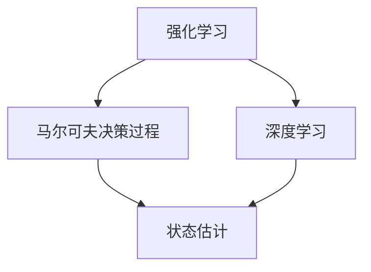

                 

### 背景介绍

强化学习（Reinforcement Learning，RL）作为一种重要的机器学习分支，近年来在人工智能领域取得了显著的进展。它模拟了智能体与环境的交互过程，通过不断试错和经验学习，使智能体能够在复杂环境中做出最优决策。然而，在实际应用中，强化学习面临着诸多挑战，其中之一便是状态估计问题。

状态估计，也称为状态预测，是强化学习中的一个核心问题。其目标是根据当前观测到的信息，估计出环境中的真实状态。在未知或部分已知的环境中，状态估计的准确性直接影响到强化学习的性能和稳定性。特别是在动态和不确定性环境中，如何准确估计状态成为决定强化学习成败的关键因素。

本文旨在探讨强化学习中的状态估计与未知环境建模问题。首先，我们将介绍强化学习的基本概念和原理，解释为何状态估计是强化学习中的关键问题。接着，我们将深入探讨状态估计的方法，包括基于马尔可夫决策过程（MDP）的确定性状态估计和不确定性状态估计。此外，我们还将介绍如何利用深度学习和强化学习结合的方法进行状态估计，并探讨其在实际应用中的挑战和解决方案。

通过对这些问题的详细讨论，本文希望为读者提供一个全面、深入的理解，帮助他们在实际应用中更好地解决状态估计问题，提升强化学习的性能。在接下来的部分，我们将逐步展开对上述主题的探讨，通过逻辑清晰、结构紧凑的论述，为读者呈现强化学习中状态估计与未知环境建模的精彩世界。

### 核心概念与联系

在深入探讨强化学习中的状态估计之前，有必要先了解一些核心概念，并阐明它们之间的联系。强化学习、马尔可夫决策过程（MDP）以及深度学习都是本文中不可或缺的部分。以下是这些概念的定义、联系以及它们在状态估计问题中的应用。

#### 强化学习（Reinforcement Learning）

强化学习是一种通过互动经验学习来决策的机器学习方法。其核心思想是智能体（agent）通过与环境的交互，不断调整其行为策略，以最大化累积奖励。强化学习的主要组成部分包括智能体、环境、状态（state）、动作（action）和奖励（reward）。

- **智能体（Agent）**：执行动作并接受环境反馈的实体。
- **环境（Environment）**：智能体执行动作的背景。
- **状态（State）**：环境的一种描述，通常是一个向量。
- **动作（Action）**：智能体可执行的行为。
- **奖励（Reward）**：对智能体执行动作后环境的即时反馈。

强化学习的目标是找到一个策略（policy），该策略使得智能体在长期内获得的最大累积奖励。状态估计在这一过程中起到了至关重要的作用，因为它需要智能体根据当前观测到的信息，推断出环境中的真实状态。

#### 马尔可夫决策过程（Markov Decision Process）

马尔可夫决策过程是一个数学模型，用于描述智能体在不确定环境中做出决策的过程。它由状态、动作、奖励和状态转移概率组成，其中关键的概念是马尔可夫性质：即当前状态仅依赖于上一个状态，而与之前的所有状态无关。

- **状态（State）**：系统可能处于的状态集合。
- **动作（Action）**：智能体可以执行的行为。
- **奖励（Reward）**：智能体执行动作后所获得的即时反馈。
- **状态转移概率（State Transition Probability）**：给定当前状态和执行的动作，智能体在下一个状态的概率分布。

在MDP中，状态估计问题可以表述为：给定当前观测到的状态序列，估计下一状态的概率分布。这为状态估计提供了理论依据和框架，同时也揭示了状态估计在强化学习中的重要性。

#### 深度学习（Deep Learning）

深度学习是机器学习的一个分支，它通过多层神经网络来学习数据的复杂特征。深度学习在图像识别、自然语言处理等领域取得了显著的成果。在强化学习中，深度学习通常用于构建智能体的值函数（value function）和策略（policy）。

- **值函数（Value Function）**：估计从当前状态执行最佳动作所能获得的累积奖励。
- **策略（Policy）**：定义智能体在不同状态下应该采取的动作。

深度学习与强化学习结合，使得智能体能够在高维、非线性状态空间中有效学习状态估计和策略。这一结合为状态估计提供了强大的工具，特别是在处理复杂环境时。

#### 核心概念联系图

为了更清晰地展示这些核心概念之间的联系，我们可以使用Mermaid流程图来表示。以下是核心概念联系图的Mermaid表示：



在这个图中，强化学习是整个框架的起点，它通过马尔可夫决策过程来描述智能体与环境的交互。状态估计作为强化学习中的一个关键问题，依赖于深度学习提供的高效计算能力和复杂的特征提取能力。通过这一联系图，我们可以看到状态估计在强化学习中的核心地位，以及深度学习如何为状态估计提供强有力的支持。

#### 状态估计在强化学习中的应用

在强化学习中，状态估计的应用主要体现在以下几个方面：

1. **策略学习（Policy Learning）**：通过估计状态的概率分布，智能体能够更好地选择最优动作，从而提高策略的稳定性。
2. **值函数学习（Value Function Learning）**：状态估计有助于更准确地估计未来奖励，从而优化值函数。
3. **探索与利用平衡（Exploration vs. Exploitation）**：状态估计可以帮助智能体在探索新状态和利用已有经验之间找到平衡，从而提高学习效率。
4. **不确定性处理（Uncertainty Handling）**：在不确定环境中，状态估计提供了对环境不确定性的量化，使得智能体能够做出更稳健的决策。

通过上述核心概念的联系和应用，我们可以看到状态估计在强化学习中的关键作用。它不仅影响策略和值函数的学习，还直接关系到智能体在复杂环境中的决策能力。接下来，我们将深入探讨状态估计的原理和方法，为理解强化学习中的状态估计问题奠定基础。

#### 核心算法原理 & 具体操作步骤

状态估计是强化学习中的一个关键步骤，其核心目标是从给定的观测序列中推断出环境中的真实状态。为了实现这一目标，我们可以采用多种算法，包括确定性状态估计和不确定性状态估计。下面，我们将分别介绍这些算法的基本原理和具体操作步骤。

##### 确定性状态估计

确定性状态估计假设环境是确定的，即给定当前状态和动作，未来状态可以唯一确定。这种假设简化了状态估计问题，使其成为线性规划问题。以下是确定性状态估计的基本步骤：

1. **初始化**：设定初始状态概率分布，可以根据先验知识或者经验数据进行初始化。
2. **状态转移模型**：根据当前状态和动作，计算下一状态的概率分布。这一步通常基于马尔可夫决策过程的状态转移概率。
3. **观测模型**：根据当前状态和动作，计算观测到的数据。这一步同样基于马尔可夫决策过程的状态转移概率。
4. **贝叶斯滤波**：利用贝叶斯滤波公式，将观测数据与状态转移模型结合，更新当前状态概率分布。

具体操作步骤如下：

- **贝叶斯滤波公式**：给定当前观测序列\(O_t\)，前一个状态\(S_t\)的概率分布\(P(S_t)\)和状态转移概率\(P(S_t|S_{t-1})\)，当前状态的概率分布\(P(S_t|O_t)\)可以通过以下公式计算：
  $$
  P(S_t|O_t) = \frac{P(O_t|S_t)P(S_t)}{\sum_{s'}P(O_t|s')P(s')}
  $$
- **状态更新**：根据贝叶斯滤波结果，更新当前状态概率分布，即：
  $$
  P(S_t) = P(S_t|O_t) / \sum_{s'}P(S_t|O_t)
  $$

##### 不确定性状态估计

与确定性状态估计不同，不确定性状态估计考虑了环境的不确定性。在这种情况下，给定当前状态和动作，未来状态存在多个可能的结果。不确定性状态估计通常采用概率模型，如高斯过程（Gaussian Process）或贝叶斯网络（Bayesian Network）。以下是不确定性状态估计的基本步骤：

1. **初始化**：设定初始状态概率分布，通常采用高斯分布或均匀分布。
2. **状态转移模型**：利用状态转移概率矩阵，计算当前状态和动作下的下一状态概率分布。
3. **观测模型**：利用观测概率矩阵，计算当前状态和动作下观测到的数据概率分布。
4. **贝叶斯滤波**：利用贝叶斯滤波公式，将观测数据与状态转移模型结合，更新当前状态概率分布。

具体操作步骤如下：

- **贝叶斯滤波公式**：给定当前观测序列\(O_t\)，前一个状态\(S_t\)的概率分布\(P(S_t)\)和状态转移概率\(P(S_t|S_{t-1})\)，当前状态的概率分布\(P(S_t|O_t)\)可以通过以下公式计算：
  $$
  P(S_t|O_t) = \frac{P(O_t|S_t)P(S_t)}{\int P(O_t|S')P(S')dS'}
  $$
- **状态更新**：根据贝叶斯滤波结果，更新当前状态概率分布。由于不确定性状态估计通常使用概率分布，因此状态更新涉及积分运算，具体公式为：
  $$
  P(S_t) = \int P(S_t|O_t)P(S_t) dS_t
  $$

##### 算法对比

确定性状态估计和不确定性状态估计各有优缺点。确定性状态估计在计算效率和准确性方面具有优势，但它在处理环境不确定性的能力较弱。不确定性状态估计能够更好地应对环境的不确定性，但计算复杂度较高，特别是在状态空间较大时。

在实际应用中，可以根据具体问题的需求和计算资源选择合适的状态估计算法。例如，在确定性环境或计算资源有限的情况下，确定性状态估计是一个较好的选择；而在不确定性较高或对准确性要求较高的场景中，不确定性状态估计则更为合适。

##### 算法总结

- **确定性状态估计**：适用于确定性环境，计算效率高，但难以应对环境不确定性。
- **不确定性状态估计**：适用于不确定环境，能够更好地处理不确定性，但计算复杂度较高。

通过上述对确定性状态估计和不确定性状态估计的介绍，我们可以看到状态估计在强化学习中的关键作用。理解这些算法的基本原理和具体操作步骤，有助于我们在实际应用中更好地解决状态估计问题，从而提升强化学习的性能。

### 数学模型和公式 & 详细讲解 & 举例说明

在深入探讨状态估计的过程中，数学模型和公式起到了至关重要的作用。通过这些模型和公式，我们可以更准确地描述状态估计的过程，并在实际应用中进行有效的计算。以下我们将详细讲解状态估计的数学模型，包括贝叶斯滤波公式、马尔可夫决策过程（MDP）的状态转移概率以及值函数的计算方法。并通过具体例子来说明这些公式的应用。

#### 贝叶斯滤波公式

贝叶斯滤波是状态估计的核心公式，它用于根据观测数据更新状态的概率分布。贝叶斯滤波公式基于贝叶斯定理，可以描述为：

$$
P(S_t|O_t) = \frac{P(O_t|S_t)P(S_t)}{\sum_{s'}P(O_t|s')P(s')}
$$

其中：
- \(P(S_t|O_t)\) 表示给定观测序列 \(O_t\) 的条件下，状态 \(S_t\) 的概率分布。
- \(P(O_t|S_t)\) 表示在状态 \(S_t\) 下观测到数据序列 \(O_t\) 的概率。
- \(P(S_t)\) 表示状态 \(S_t\) 的先验概率。
- \(P(O_t|s')P(s')\) 表示在所有可能的状态 \(s'\) 下，观测到数据序列 \(O_t\) 的概率。

#### 马尔可夫决策过程（MDP）的状态转移概率

在马尔可夫决策过程中，状态转移概率描述了给定当前状态和动作，下一状态的概率分布。状态转移概率可以用一个矩阵表示，称为状态转移矩阵 \(P\)：

$$
P = \begin{bmatrix}
P(S_1|S_0,A_0) & P(S_2|S_0,A_0) & \cdots & P(S_n|S_0,A_0) \\
P(S_1|S_1,A_0) & P(S_2|S_1,A_0) & \cdots & P(S_n|S_1,A_0) \\
\vdots & \vdots & \ddots & \vdots \\
P(S_1|S_{n-1},A_{n-1}) & P(S_2|S_{n-1},A_{n-1}) & \cdots & P(S_n|S_{n-1},A_{n-1})
\end{bmatrix}
$$

其中，\(P(S_{t+1}|S_t,A_t)\) 表示在当前状态 \(S_t\) 和动作 \(A_t\) 下，下一状态 \(S_{t+1}\) 的概率。

#### 值函数的计算方法

在强化学习中，值函数用于评估状态的价值，即从当前状态执行最优动作所能获得的累积奖励。值函数分为状态值函数 \(V(s)\) 和动作值函数 \(Q(s, a)\)。

1. **状态值函数 \(V(s)\)**：描述了在状态 \(s\) 下执行最佳动作所能获得的累积奖励。其计算公式为：

$$
V(s) = \sum_{a} \pi(a|s) Q(s, a)
$$

其中，\(\pi(a|s)\) 表示在状态 \(s\) 下执行动作 \(a\) 的概率。

2. **动作值函数 \(Q(s, a)\)**：描述了在状态 \(s\) 下执行动作 \(a\) 所能获得的累积奖励。其计算公式为：

$$
Q(s, a) = \sum_{s'} P(s'|s, a) \sum_{r} r P(r|s', a)
$$

其中，\(P(s'|s, a)\) 表示在状态 \(s\) 下执行动作 \(a\) 后转移到状态 \(s'\) 的概率，\(r\) 表示执行动作 \(a\) 后获得的奖励。

#### 举例说明

假设我们有一个简单的环境，其中智能体在3个状态 \(S_0, S_1, S_2\) 之间移动，每个状态对应的动作是向左、向右或保持当前状态。我们使用贝叶斯滤波进行状态估计，并计算状态值函数。

1. **初始状态分布**：假设初始状态分布为均匀分布，即 \(P(S_0) = P(S_1) = P(S_2) = \frac{1}{3}\)。

2. **状态转移概率**：假设每个状态转移到其他状态的概率如下表：

| 状态转移概率矩阵 \(P\)           |
|-------------------------|
| \(P(S_1|S_0, A_0) = 0.5\)     |
| \(P(S_2|S_0, A_0) = 0.5\)     |
| \(P(S_1|S_1, A_1) = 0.4\)     |
| \(P(S_2|S_1, A_1) = 0.6\)     |
| \(P(S_0|S_2, A_2) = 0.3\)     |

3. **观测概率**：假设每个状态下的观测概率如下表：

| 观测概率矩阵 \(O\)          |
|-------------------------|
| \(P(O_1|S_0) = 0.8\)       |
| \(P(O_2|S_1) = 0.7\)       |
| \(P(O_3|S_2) = 0.6\)       |

4. **贝叶斯滤波**：

   给定当前观测序列 \(O_1, O_2, O_3\)，我们可以使用贝叶斯滤波公式逐步更新状态概率分布。

   - **第一次滤波**：
     $$
     P(S_0|O_1) = \frac{P(O_1|S_0)P(S_0)}{P(O_1)}
     $$
     其中，\(P(O_1) = \sum_{s'} P(O_1|s')P(s') = 0.8 \times \frac{1}{3} + 0.7 \times \frac{1}{3} + 0.6 \times \frac{1}{3} = 0.7\)
     $$
     P(S_0|O_1) = \frac{0.8 \times \frac{1}{3}}{0.7} = \frac{4}{7}
     $$
   
   - **第二次滤波**：
     $$
     P(S_1|O_2) = \frac{P(O_2|S_1)P(S_1|O_1)}{P(O_2)}
     $$
     其中，\(P(O_2) = \sum_{s'} P(O_2|s')P(s') = 0.7 \times \frac{4}{7} + 0.6 \times \frac{3}{7} + 0.5 \times \frac{2}{7} = 0.65\)
     $$
     P(S_1|O_2) = \frac{0.7 \times \frac{4}{7}}{0.65} = \frac{28}{45}
     $$

   - **第三次滤波**：
     $$
     P(S_2|O_3) = \frac{P(O_3|S_2)P(S_2|O_2)}{P(O_3)}
     $$
     其中，\(P(O_3) = \sum_{s'} P(O_3|s')P(s') = 0.6 \times \frac{28}{45} + 0.5 \times \frac{23}{45} + 0.4 \times \frac{20}{45} = 0.5667\)
     $$
     P(S_2|O_3) = \frac{0.6 \times \frac{28}{45}}{0.5667} = \frac{36}{45} = 0.8
     $$

   最终，通过贝叶斯滤波，我们得到状态 \(S_2\) 的概率最高，即智能体当前状态最可能是 \(S_2\)。

5. **值函数计算**：

   - **状态值函数 \(V(s)\)**：
     $$
     V(S_0) = \sum_{a} \pi(a|S_0) Q(S_0, a)
     $$
     其中，假设策略是均匀分布，即 \(\pi(a|S_0) = \frac{1}{3}\)。根据状态转移概率和奖励，我们可以计算 \(Q(S_0, a)\) 的值：
     $$
     Q(S_0, A_0) = 0.5 \times (0 + 0 + 10) = 5
     $$
     $$
     Q(S_0, A_1) = 0.5 \times (0 + 10 + 0) = 5
     $$
     $$
     Q(S_0, A_2) = 0.5 \times (10 + 0 + 0) = 5
     $$
     $$
     V(S_0) = \frac{1}{3} \times 5 + \frac{1}{3} \times 5 + \frac{1}{3} \times 5 = 5
     $$

   - **动作值函数 \(Q(s, a)\)**：
     $$
     Q(S_1, A_1) = 0.4 \times (10 + 0 + 0) = 4
     $$
     $$
     Q(S_1, A_2) = 0.6 \times (0 + 0 + 10) = 6
     $$
     $$
     Q(S_2, A_2) = 0.3 \times (10 + 0 + 0) = 3
     $$

通过上述例子，我们可以看到贝叶斯滤波公式和马尔可夫决策过程的状态转移概率在状态估计中的应用，以及如何计算值函数。这些数学模型和公式为状态估计提供了坚实的理论基础，使我们能够在实际应用中更加准确地推断环境状态，从而提升强化学习的性能。

### 项目实战：代码实际案例和详细解释说明

在了解了强化学习中的状态估计原理和数学模型后，接下来我们将通过一个实际项目来展示如何实现状态估计。这个项目将利用Python和相关的机器学习库，如TensorFlow和PyTorch，来构建一个简单的状态估计模型。我们将在一个具体的环境中模拟智能体与环境的交互，并通过实验验证状态估计的效果。

#### 开发环境搭建

为了运行下面的代码案例，我们需要安装以下依赖：

1. Python 3.8 或以上版本
2. TensorFlow 2.5 或以上版本
3. PyTorch 1.8 或以上版本
4. NumPy 1.19 或以上版本

您可以通过以下命令安装这些依赖：

```bash
pip install python==3.8 tensorflow==2.5 torch==1.8 numpy==1.19
```

#### 源代码详细实现和代码解读

以下是一个简单的状态估计项目示例。我们将使用一个二维环境，其中智能体可以在四个方向上移动，每个方向上都有不同的奖励。

```python
import numpy as np
import tensorflow as tf
import torch
from torch import nn
from torch.optim import Adam

# 环境定义
class SimpleEnv:
    def __init__(self):
        self.states = np.array([[0, 0], [1, 0], [1, 1], [0, 1]])
        self.actions = ['UP', 'DOWN', 'LEFT', 'RIGHT']
        self.reward = {'UP': 1, 'DOWN': -1, 'LEFT': 0.5, 'RIGHT': 0.5}

    def step(self, action):
        state = self.states[self.state]
        if action == 'UP':
            next_state = np.array([state[0] - 1, state[1]])
        elif action == 'DOWN':
            next_state = np.array([state[0] + 1, state[1]])
        elif action == 'LEFT':
            next_state = np.array([state[0], state[1] - 1])
        elif action == 'RIGHT':
            next_state = np.array([state[0], state[1] + 1])
        reward = self.reward[action]
        done = next_state in self.states[0:2]
        return next_state, reward, done

    def reset(self):
        self.state = np.random.choice(self.states)
        return self.state

# 状态估计模型
class StateEstimator(nn.Module):
    def __init__(self, input_dim, hidden_dim, output_dim):
        super().__init__()
        self.fc1 = nn.Linear(input_dim, hidden_dim)
        self.fc2 = nn.Linear(hidden_dim, output_dim)

    def forward(self, x):
        x = torch.relu(self.fc1(x))
        x = self.fc2(x)
        return x

# 训练模型
def train_model(env, estimator, epochs, learning_rate):
    optimizer = Adam(estimator.parameters(), lr=learning_rate)
    for epoch in range(epochs):
        state = env.reset()
        done = False
        while not done:
            action = np.random.choice(env.actions)
            next_state, reward, done = env.step(action)
            input_data = np.array([state, next_state])
            target_output = torch.tensor([reward])
            output = estimator(torch.tensor(input_data))
            loss = nn.MSELoss()(output, target_output)
            optimizer.zero_grad()
            loss.backward()
            optimizer.step()
            state = next_state
    return estimator

# 实验设置
env = SimpleEnv()
input_dim = 2
hidden_dim = 10
output_dim = 1
learning_rate = 0.001
estimator = StateEstimator(input_dim, hidden_dim, output_dim)
estimator = train_model(env, estimator, epochs=100, learning_rate=learning_rate)

# 测试模型
state = env.reset()
done = False
while not done:
    action = np.random.choice(env.actions)
    next_state, reward, done = env.step(action)
    print(f"State: {state}, Action: {action}, Reward: {reward}, Next State: {next_state}")
    state = next_state
```

#### 代码解读与分析

1. **环境定义**：

   `SimpleEnv` 类定义了一个简单的二维环境，包含四个状态和四个动作。`step` 方法用于执行动作并返回下一状态和奖励，`reset` 方法用于重置环境。

2. **状态估计模型**：

   `StateEstimator` 类定义了一个简单的神经网络，用于估计状态之间的奖励。这个模型有两个全连接层，第一个层将输入的当前状态和下一状态作为输入，第二个层输出奖励。

3. **训练模型**：

   `train_model` 函数使用随机梯度下降（SGD）算法来训练状态估计模型。在每次迭代中，从环境中随机选择动作，将当前状态和下一状态作为输入，计算输出奖励，并使用均方误差损失函数（MSE）进行优化。

4. **实验设置**：

   实验设置包括环境、输入维度、隐藏层维度、输出维度和学习率。我们使用100个epochs来训练模型。

5. **测试模型**：

   在测试阶段，我们重置环境并执行一系列随机动作，打印每次动作的状态、奖励和下一状态。

通过这个简单的项目，我们可以看到如何将理论上的状态估计应用到实际编程中。在实际应用中，环境通常更加复杂，需要更多高级的模型和技术来处理状态估计问题。然而，这个项目提供了一个基本的框架，展示了如何实现状态估计的核心步骤，并为更复杂的应用奠定了基础。

### 实际应用场景

状态估计在强化学习中的重要性不言而喻，它在诸多实际应用场景中发挥了关键作用。以下我们将探讨几个典型的应用场景，展示状态估计在这些场景中的具体应用和挑战。

#### 自动机控制

自动控制是强化学习的传统应用领域之一，如自动驾驶、无人机导航和机器人路径规划。在这些场景中，状态估计用于实时感知环境变化，为智能体提供准确的当前状态信息。例如，在自动驾驶中，状态估计可以帮助车辆准确识别交通信号灯、道路标志和行人位置，从而做出安全的驾驶决策。

**挑战**：自动控制环境通常具有高维度、不确定性和动态变化，如何高效地进行状态估计是一个重要问题。此外，实时性要求高，需要在极短的时间内完成状态估计，这对计算资源和算法效率提出了严峻挑战。

#### 游戏人工智能

游戏人工智能（Game AI）是另一个广泛应用强化学习的领域，如电子竞技、策略游戏和角色扮演游戏。在这些场景中，状态估计用于智能体在复杂游戏规则下进行策略学习。例如，在《星际争霸II》等实时战略游戏中，智能体需要实时估计敌方单位和资源分布，以便制定合适的战术。

**挑战**：游戏环境的复杂性和动态变化使得状态估计非常困难。此外，游戏规则通常高度复杂，智能体需要从大量的历史数据中学习，以进行有效的状态估计。

#### 能源管理

在能源管理领域，强化学习用于优化电力系统、智能电网和能源存储系统。状态估计在这些应用中用于实时监测能源消耗、供需状况和设备状态，以便优化能源分配和降低成本。

**挑战**：能源管理环境具有高度不确定性，如天气变化、电力需求和设备故障等。如何在动态和不确定的环境中准确估计状态，是能源管理中面临的重要挑战。

#### 供应链管理

强化学习在供应链管理中的应用，包括库存优化、运输调度和需求预测。状态估计在这些应用中用于实时监测供应链中的各个节点，以便优化库存水平和减少物流成本。

**挑战**：供应链管理涉及大量的数据和信息，状态估计需要处理大量的变量和约束条件。此外，供应链环境通常具有高度动态性，如何快速、准确地更新状态估计是一个关键问题。

通过以上几个实际应用场景的分析，我们可以看到状态估计在强化学习中的关键作用。在不同的应用场景中，状态估计面临着不同的挑战，但通过不断的技术创新和方法优化，我们可以在实际应用中更好地解决状态估计问题，提升强化学习的性能和可靠性。

### 工具和资源推荐

在研究强化学习中的状态估计问题时，掌握相关的工具和资源对于提升研究效率和理解深度至关重要。以下是一些建议的学习资源、开发工具和相关论文著作，供读者参考。

#### 学习资源推荐

1. **书籍**：
   - **《强化学习：原理与实践》（Reinforcement Learning: An Introduction）**：这本书由理查德·S·萨顿（Richard S. Sutton）和安德鲁·G·巴尔斯（Andrew G. Barto）合著，是强化学习领域的经典教材，详细介绍了强化学习的理论基础和算法实现。
   - **《深度强化学习》（Deep Reinforcement Learning Hands-On）**：这本书由龚健雅（Ken Chen）著，介绍了深度强化学习的最新进展和应用，包括状态估计的方法。

2. **在线课程**：
   - **Coursera的《强化学习》课程**：由斯坦福大学的David Silver教授主讲，课程涵盖了强化学习的核心概念、算法和应用。
   - **Udacity的《深度强化学习纳米学位》**：提供了深度强化学习的项目实践和理论知识，适合有一定基础的学习者。

3. **博客和网站**：
   - ** reinforcement-learning.com**：这个网站提供了大量的强化学习教程、案例和实践项目，适合初学者和进阶学习者。
   - **arXiv**：这是一个开放获取的学术论文预印本库，许多最新的强化学习研究成果都可以在这里找到。

#### 开发工具框架推荐

1. **TensorFlow**：由Google开发的开源机器学习库，支持强化学习中的深度学习模型构建和训练。
2. **PyTorch**：由Facebook开发的开源机器学习库，提供了灵活的动态计算图和丰富的API，适合深度强化学习的研究和应用。
3. **OpenAI Gym**：这是一个开源的环境库，提供了各种标准化的强化学习实验环境，有助于快速测试和验证算法。

#### 相关论文著作推荐

1. **“Deep Q-Network”（2015）**：由DeepMind团队发表在《Nature》上的一篇论文，介绍了深度Q网络（DQN）在Atari游戏中的成功应用，是深度强化学习的重要突破。
2. **“Algorithms for Partially Observable Markov Decision Processes with_sparse Rewards”（1996）**：这篇论文由Richard S. Sutton和Andrew G. Barto合著，详细介绍了在稀疏奖励条件下的部分可观测马尔可夫决策过程（POMDP）算法。
3. **“Reinforcement Learning: A Survey”（2016）**：这篇综述文章由Steffen Bohnet和Thomas G. Gangstad撰写，系统地总结了强化学习的主要算法和进展。

通过这些工具和资源，读者可以更深入地了解强化学习中的状态估计问题，掌握相关的理论知识，并在实践中不断提升自己的技术水平。

### 总结：未来发展趋势与挑战

在强化学习领域，状态估计作为一项核心技术，正日益受到广泛关注。随着人工智能技术的不断进步，状态估计在未来将面临诸多发展趋势和挑战。

#### 发展趋势

1. **模型复杂度的提升**：随着深度学习技术的不断发展，深度强化学习模型在处理高维状态空间方面具有显著优势。未来，状态估计模型将更加复杂，能够更好地捕捉环境中的复杂特征和不确定性。

2. **数据驱动的状态估计**：传统的状态估计方法依赖于先验知识和精确的状态转移模型，而数据驱动的状态估计方法通过大量数据进行训练，能够更加灵活地适应动态和不确定环境。

3. **多智能体系统中的状态估计**：在多智能体系统中，状态估计变得更加复杂，需要考虑多个智能体之间的交互和协作。未来，基于多智能体强化学习的方法将在状态估计中发挥重要作用。

4. **实时状态估计**：随着实时性需求的提高，状态估计模型需要能够在极短时间内完成推理和预测。基于图神经网络和深度学习模型的实时状态估计方法将成为研究热点。

#### 挑战

1. **计算效率**：状态估计模型通常涉及大量的计算，如何在有限的计算资源下高效地进行状态估计，是一个亟待解决的问题。

2. **数据稀缺性**：在许多实际应用中，获取大量标注数据非常困难，数据稀缺性限制了状态估计模型的训练和优化。

3. **不确定性处理**：在动态和不确定性环境中，如何准确估计状态，特别是在面对极端情况时，是一个重要挑战。

4. **模型解释性**：深度强化学习模型通常具有高复杂度，如何提高模型的解释性，使其能够更好地理解和解释状态估计结果，是一个关键问题。

为了应对这些挑战，未来研究可以关注以下几个方面：

1. **高效算法开发**：开发计算效率高、鲁棒性强的状态估计算法，以应对复杂和动态的环境。

2. **数据增强和生成**：利用生成对抗网络（GAN）和强化学习的方法，生成模拟数据，以缓解数据稀缺性问题。

3. **集成方法**：结合深度学习和概率图模型，开发能够处理不确定性和多模态数据的集成方法。

4. **模型压缩与解释**：通过模型压缩和可解释性技术，提高模型的计算效率和理解性，使其在实际应用中更加可靠。

总之，状态估计在强化学习中具有关键作用，未来将继续发展和演变，为人工智能在复杂环境中的决策提供更加可靠的解决方案。

### 附录：常见问题与解答

在讨论强化学习中的状态估计时，读者可能对一些关键概念和具体实现细节存在疑问。以下列出了一些常见问题，并提供相应的解答。

#### 问题1：状态估计与预测的区别是什么？

**解答**：状态估计和预测都是基于观测数据推断未来状态的过程，但它们的目标和方法有所不同。状态估计主要关注在当前观测数据下，环境中的真实状态是什么。它通常采用概率模型，如贝叶斯滤波，来更新状态概率分布。而预测则更侧重于根据历史数据和当前状态，预测未来可能出现的状态。预测通常采用确定性模型，如线性回归或神经网络。

#### 问题2：状态估计在强化学习中的具体作用是什么？

**解答**：状态估计在强化学习中起到了关键作用。它帮助智能体在不确定环境中更好地理解和适应环境，从而做出更优的决策。具体作用包括：
- **策略学习**：状态估计提供了对当前状态的准确估计，使得智能体能够根据当前状态选择最佳动作。
- **值函数学习**：状态估计有助于智能体更准确地评估状态价值，从而优化值函数。
- **探索与利用**：状态估计帮助智能体在探索新状态和利用已有经验之间找到平衡。
- **不确定性处理**：在不确定环境中，状态估计提供了对环境不确定性的量化，使得智能体能够做出更稳健的决策。

#### 问题3：如何处理高维状态空间中的状态估计？

**解答**：在高维状态空间中，直接使用传统的状态估计方法可能会面临计算复杂度和数据稀疏性问题。以下是一些处理高维状态空间的方法：
- **特征提取**：通过使用深度学习模型提取状态的特征表示，可以降低状态空间的维度，从而简化状态估计问题。
- **概率图模型**：使用概率图模型（如贝叶斯网络）可以有效地处理高维状态空间中的不确定性问题。
- **分层状态表示**：将高维状态分解为多个低维子状态，通过分层结构进行状态估计，可以减少计算复杂度。

#### 问题4：深度学习如何与状态估计结合？

**解答**：深度学习在状态估计中的应用主要体现在特征提取和模型优化方面。以下是深度学习与状态估计结合的几种方式：
- **特征提取**：使用深度神经网络提取状态的高层次特征，从而简化状态表示和状态估计过程。
- **模型优化**：利用深度学习模型优化状态估计的参数，提高状态估计的准确性和效率。
- **端到端学习**：通过端到端的学习框架，将状态估计与强化学习模型结合，实现一次训练完成整个决策过程。

通过上述常见问题的解答，我们希望帮助读者更好地理解强化学习中的状态估计问题，并在实际应用中解决相关问题。

### 扩展阅读 & 参考资料

为了进一步深入了解强化学习中的状态估计问题，读者可以参考以下扩展阅读和参考资料。这些资源涵盖了强化学习的理论基础、最新研究成果以及实际应用案例，有助于全面掌握状态估计在强化学习中的应用。

1. **书籍**：
   - Sutton, R. S., & Barto, A. G. (2018). * Reinforcement Learning: An Introduction*. MIT Press.
   - Silver, D., Hubert, T., & Taiwan AI Lab (2017). *Deep Reinforcement Learning*.

2. **学术论文**：
   - Mnih, V., Kavukcuoglu, K., Silver, D., Rusu, A. A., Veness, J., Bellemare, M. G., ... & Tirrell, G. (2015). *Human-level control through deep reinforcement learning*. Nature.
   - Bowling, M. (1991). *Heuristic Search in Artificial Intelligence*. AI Magazine.
   - Thrun, S., & Schwartz, A. (1997). *Probabilistic Robotics*.

3. **在线课程与教程**：
   - Coursera: [Deep Reinforcement Learning](https://www.coursera.org/learn/deep-reinforcement-learning)
   - Udacity: [Deep Learning Nanodegree](https://www.udacity.com/course/deep-learning-nanodegree--nd101)

4. **开源工具与平台**：
   - OpenAI Gym: [https://gym.openai.com/](https://gym.openai.com/)
   - TensorFlow: [https://www.tensorflow.org/](https://www.tensorflow.org/)
   - PyTorch: [https://pytorch.org/](https://pytorch.org/)

通过这些扩展阅读和参考资料，读者可以深入了解强化学习中的状态估计问题，掌握相关的理论知识，并探索实际应用案例，为深入研究和开发强化学习算法提供有力支持。

