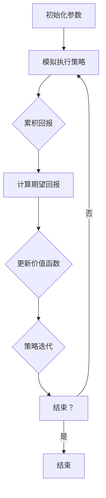

                 

### 文章标题：强化学习Reinforcement Learning中的蒙特卡洛方法实战技巧

### 关键词：强化学习、蒙特卡洛方法、Q学习、策略迭代、模拟仿真

### 摘要：
本文将深入探讨强化学习（Reinforcement Learning，RL）中的重要技术——蒙特卡洛方法。通过详细的原理讲解、实际操作步骤、数学模型解析以及代码案例，我们将帮助读者掌握RL中的蒙特卡洛方法，并了解其在不同应用场景中的实践技巧。本文旨在为那些对强化学习和蒙特卡洛方法感兴趣的技术爱好者、研究人员和开发者提供一份全面、易懂的实战指南。

### 目录：

#### 1. 背景介绍
##### 1.1 强化学习概述
##### 1.2 蒙特卡洛方法的起源与应用
##### 1.3 强化学习中蒙特卡洛方法的重要性

#### 2. 核心概念与联系
##### 2.1 强化学习的基本术语
##### 2.2 蒙特卡洛方法在RL中的核心作用
##### 2.3 Mermaid流程图展示蒙特卡洛方法在RL中的实现流程

#### 3. 核心算法原理 & 具体操作步骤
##### 3.1 蒙特卡洛方法的原理分析
##### 3.2 蒙特卡洛策略迭代的操作步骤
##### 3.3 Q学习的蒙特卡洛扩展

#### 4. 数学模型和公式 & 详细讲解 & 举例说明
##### 4.1 蒙特卡洛方法的基本数学模型
##### 4.2 常见蒙特卡洛算法的数学公式解析
##### 4.3 实际案例中的蒙特卡洛方法应用举例

#### 5. 项目实战：代码实际案例和详细解释说明
##### 5.1 开发环境搭建
##### 5.2 源代码详细实现和代码解读
##### 5.3 代码解读与分析

#### 6. 实际应用场景
##### 6.1 在游戏AI中的应用
##### 6.2 在推荐系统中的应用
##### 6.3 在机器人控制中的应用

#### 7. 工具和资源推荐
##### 7.1 学习资源推荐
##### 7.2 开发工具框架推荐
##### 7.3 相关论文著作推荐

#### 8. 总结：未来发展趋势与挑战
##### 8.1 蒙特卡洛方法的发展趋势
##### 8.2 面临的挑战与解决方案

#### 9. 附录：常见问题与解答
##### 9.1 关于蒙特卡洛方法的常见问题
##### 9.2 蒙特卡洛方法在不同场景的应用疑问

#### 10. 扩展阅读 & 参考资料
##### 10.1 推荐阅读书籍
##### 10.2 学术论文与研究资源
##### 10.3 开源代码与实践案例

## 1. 背景介绍

### 1.1 强化学习概述

强化学习（Reinforcement Learning，RL）是一种机器学习范式，旨在通过奖励信号来指导智能体（agent）在环境中采取行动，以实现长期目标。与监督学习和无监督学习不同，强化学习强调的是智能体在动态环境中的自主学习和决策能力。简而言之，强化学习通过试错（trial and error）来逐步优化智能体的策略，从而实现预期目标的最大化。

强化学习的关键要素包括：

- **智能体（Agent）**：执行动作并从环境中获取奖励和状态反馈的实体。
- **环境（Environment）**：智能体执行的场所，它提供状态、奖励和新的动作选择。
- **状态（State）**：智能体在特定时刻所处的条件或情境。
- **动作（Action）**：智能体在环境中执行的操作。
- **策略（Policy）**：智能体基于状态选择动作的规则或函数。
- **价值函数（Value Function）**：评估状态或状态-动作对的预期奖励。
- **模型（Model）**：对环境的动态行为的描述或预测。

### 1.2 蒙特卡洛方法的起源与应用

蒙特卡洛方法（Monte Carlo Method）起源于20世纪中叶，由物理学家斯泰因·乌拉姆（Stanislaw Ulam）和数学家约翰·冯·诺伊曼（John von Neumann）提出。这种方法通过随机抽样和统计模拟来近似求解复杂的数学问题。蒙特卡洛方法在物理学、经济学、金融工程、工程学和计算机科学等多个领域都有广泛应用，其核心思想是通过大量的随机模拟来逼近问题的解。

在强化学习中，蒙特卡洛方法主要用于评估策略的期望奖励，其核心思想是通过模拟多次策略执行来估计长期奖励。蒙特卡洛方法在RL中的应用主要体现在以下几个关键方面：

- **策略评估（Policy Evaluation）**：使用蒙特卡洛方法来估计策略的价值函数，即给定策略下每个状态的平均回报。
- **策略迭代（Policy Iteration）**：通过蒙特卡洛方法来更新策略，使其逐渐逼近最优策略。
- **Q学习（Q-Learning）**：蒙特卡洛方法的一种扩展，用于估计Q值函数，指导智能体选择最优动作。

### 1.3 强化学习中蒙特卡洛方法的重要性

蒙特卡洛方法在强化学习中的重要性不可低估。其优势在于：

- **适应性强**：蒙特卡洛方法适用于不确定性和动态环境，能够处理复杂的决策问题。
- **灵活性高**：通过随机抽样和模拟，蒙特卡洛方法可以灵活地适应不同的策略评估和迭代过程。
- **估算精确度**：随着模拟次数的增加，蒙特卡洛方法的估算结果趋于稳定和精确，特别适用于长期回报的评估。

总的来说，蒙特卡洛方法为强化学习提供了强大的工具，使得智能体能够在复杂和动态的环境中实现高效的决策和学习。接下来，我们将深入探讨蒙特卡洛方法在强化学习中的具体应用和实现细节。

#### 2. 核心概念与联系

### 2.1 强化学习的基本术语

在深入了解蒙特卡洛方法之前，我们需要熟悉强化学习中的几个基本概念：

- **状态（State）**：描述智能体在某一时刻所处的环境状态。
- **动作（Action）**：智能体在特定状态下可以执行的操作。
- **奖励（Reward）**：表示智能体执行动作后从环境中获得的即时反馈。
- **策略（Policy）**：描述智能体在给定状态下选择动作的规则或函数。
- **价值函数（Value Function）**：评估状态或状态-动作对的预期奖励。
  - **状态价值函数（State Value Function）** \( V(s) \)：在状态 \( s \) 下执行最优策略的平均回报。
  - **动作价值函数（Action Value Function）** \( Q(s, a) \)：在状态 \( s \) 下执行动作 \( a \) 的平均回报。

### 2.2 蒙特卡洛方法在RL中的核心作用

蒙特卡洛方法在强化学习中的核心作用主要体现在以下几个方面：

1. **策略评估（Policy Evaluation）**：
   - 通过蒙特卡洛方法，我们可以估计给定策略下的状态价值函数 \( V(s) \)。
   - 基本思想是：模拟多次策略执行，记录每个状态出现的次数和累计回报，然后计算每个状态的期望回报。
   - 公式表示：\( V^{\pi}(s) = \sum_{s'} \pi(a|s) \cdot p(s'|s, a) \cdot r(s', a) + \gamma \cdot V^{\pi}(s') \)，其中 \( \pi(a|s) \) 是策略概率，\( p(s'|s, a) \) 是状态转移概率，\( r(s', a) \) 是奖励函数，\( \gamma \) 是折扣因子。

2. **策略迭代（Policy Iteration）**：
   - 蒙特卡洛方法可以帮助我们在策略迭代过程中更新策略。
   - 具体步骤包括：使用蒙特卡洛方法评估当前策略的价值函数，然后基于价值函数更新策略，使得新策略能够更好地最大化期望回报。
   - 公式表示：新策略 \( \pi' \) 是根据当前价值函数 \( V^{\pi}(s) \) 来更新的，通常采用最大化的方式选择动作。

3. **Q学习（Q-Learning）**：
   - 蒙特卡洛方法可以扩展到Q学习，用于估计动作价值函数 \( Q(s, a) \)。
   - Q学习的核心思想是通过在状态 \( s \) 下执行动作 \( a \) 并观察回报来更新Q值。
   - 蒙特卡洛方法的Q学习变体通过模拟多次策略执行来估计长期回报，并使用这些估计值来更新Q值。

### 2.3 Mermaid流程图展示蒙特卡洛方法在RL中的实现流程

为了更直观地展示蒙特卡洛方法在强化学习中的实现流程，我们可以使用Mermaid流程图来描述。以下是一个简化的流程图：



- **A[初始化参数]**：初始化智能体、环境和策略的参数。
- **B[模拟执行策略]**：在环境中模拟执行给定策略，记录状态转移和奖励。
- **C[累积回报]**：计算在策略下执行多次模拟后的累积回报。
- **D[计算期望回报]**：根据累积回报计算每个状态的期望回报。
- **E[更新价值函数]**：使用期望回报更新状态价值函数或动作价值函数。
- **F[策略迭代]**：基于更新后的价值函数迭代更新策略。
- **G[结束？]**：判断策略迭代是否达到终止条件，例如价值函数收敛或迭代次数达到预设值。
- **H[结束]**：结束模拟过程。

通过这个流程图，我们可以清晰地看到蒙特卡洛方法在强化学习中的具体实现步骤，为后续的详细讲解和实际应用提供了基础。在下一节中，我们将深入探讨蒙特卡洛方法的算法原理和具体操作步骤。

#### 3. 核心算法原理 & 具体操作步骤

### 3.1 蒙特卡洛方法的原理分析

蒙特卡洛方法的基本原理是通过大量的随机模拟来逼近一个问题的解。在强化学习中，蒙特卡洛方法主要用于策略评估和策略迭代。以下是蒙特卡洛方法在强化学习中的基本原理：

1. **策略评估（Policy Evaluation）**：
   - 蒙特卡洛方法的策略评估旨在估计给定策略下的状态价值函数 \( V^{\pi}(s) \)。
   - 基本思想是通过在环境中执行策略 \( \pi \)，记录多次模拟的结果，并计算每个状态的期望回报。
   - 公式表示：\( V^{\pi}(s) = \frac{1}{N} \sum_{i=1}^{N} G_{i}(s) \)，其中 \( G_{i}(s) \) 是第 \( i \) 次模拟中从状态 \( s \) 开始的总回报，\( N \) 是模拟次数。

2. **策略迭代（Policy Iteration）**：
   - 蒙特卡洛方法的策略迭代旨在通过价值函数更新策略，使得策略逐渐逼近最优策略。
   - 基本思想是：首先使用蒙特卡洛方法评估当前策略的价值函数，然后基于价值函数更新策略，使得新策略能够更好地最大化期望回报。
   - 公式表示：新策略 \( \pi' \) 是根据当前价值函数 \( V^{\pi}(s) \) 来更新的，通常采用最大化的方式选择动作。

### 3.2 蒙特卡洛策略迭代的操作步骤

蒙特卡洛策略迭代是一个迭代过程，其基本步骤如下：

1. **初始化**：
   - 设置初始策略 \( \pi^{0} \) 和价值函数 \( V^{0}(s) = 0 \)。
   - 选择环境、智能体和策略的参数。

2. **策略评估**：
   - 使用当前策略 \( \pi^{t} \) 在环境中进行多次模拟，记录每次模拟的回报。
   - 计算每个状态的期望回报 \( V^{t}(s) = \frac{1}{N} \sum_{i=1}^{N} G_{i}(s) \)，其中 \( G_{i}(s) \) 是从状态 \( s \) 开始的累积回报。

3. **策略更新**：
   - 根据评估得到的价值函数 \( V^{t}(s) \)，更新策略 \( \pi^{t+1} \)。
   - 通常使用最大化的方式来选择新策略，即选择能够最大化期望回报的动作。

4. **策略迭代**：
   - 重复执行策略评估和策略更新步骤，直到满足终止条件，例如价值函数收敛或迭代次数达到预设值。

### 3.3 Q学习的蒙特卡洛扩展

Q学习是蒙特卡洛方法在强化学习中的一个重要应用，它通过估计动作价值函数 \( Q(s, a) \) 来指导智能体的动作选择。以下是Q学习的蒙特卡洛扩展步骤：

1. **初始化**：
   - 设置初始动作价值函数 \( Q^{0}(s, a) = 0 \)。
   - 选择环境、智能体和策略的参数。

2. **模拟执行动作**：
   - 在状态 \( s \) 下，随机选择一个动作 \( a \)。
   - 在环境中执行动作 \( a \)，记录状态转移和奖励。

3. **更新Q值**：
   - 根据执行结果更新动作价值函数 \( Q(s, a) \)。
   - 使用蒙特卡洛方法估计长期回报 \( G \)，并更新Q值 \( Q(s, a) = Q(s, a) + \alpha [r + \gamma \max_{a'} Q(s', a') - Q(s, a)] \)，其中 \( \alpha \) 是学习率，\( \gamma \) 是折扣因子。

4. **迭代更新**：
   - 重复执行模拟执行动作和更新Q值步骤，直到满足终止条件，例如Q值收敛或迭代次数达到预设值。

通过上述步骤，智能体可以逐渐学习到最优的动作策略，并在实际环境中进行有效的决策。蒙特卡洛方法在Q学习中的扩展使得智能体能够通过大量的模拟和经验来优化其策略，提高了强化学习的效率和效果。接下来，我们将通过具体案例和数学模型来进一步阐述蒙特卡洛方法在强化学习中的应用。

#### 4. 数学模型和公式 & 详细讲解 & 举例说明

### 4.1 蒙特卡洛方法的基本数学模型

蒙特卡洛方法的核心在于通过随机模拟来近似求解数学问题。在强化学习中，蒙特卡洛方法用于估计策略的期望回报，这涉及到以下几个基本数学模型：

1. **期望回报（Expected Return）**：
   - 期望回报是指智能体在给定策略下执行一系列动作后获得的总回报的期望值。
   - 公式表示：\( E[R] = \sum_{s} p(s) \cdot \sum_{a} \pi(a|s) \cdot \sum_{s'} p(s'|s, a) \cdot r(s', a) \)，其中 \( p(s) \) 是状态概率，\( \pi(a|s) \) 是策略概率，\( p(s'|s, a) \) 是状态转移概率，\( r(s', a) \) 是奖励函数。

2. **状态价值函数（State Value Function）**：
   - 状态价值函数表示在给定策略下，从状态 \( s \) 开始执行策略所能获得的期望回报。
   - 公式表示：\( V^{\pi}(s) = \sum_{a} \pi(a|s) \cdot \sum_{s'} p(s'|s, a) \cdot r(s', a) + \gamma \cdot \sum_{s'} p(s'|s, a) \cdot V^{\pi}(s') \)，其中 \( \gamma \) 是折扣因子。

3. **动作价值函数（Action Value Function）**：
   - 动作价值函数表示在给定策略和状态下，执行特定动作所能获得的期望回报。
   - 公式表示：\( Q^{\pi}(s, a) = \sum_{s'} p(s'|s, a) \cdot r(s', a) + \gamma \cdot \sum_{s'} p(s'|s, a) \cdot V^{\pi}(s') \)。

### 4.2 常见蒙特卡洛算法的数学公式解析

蒙特卡洛方法在强化学习中有多种具体算法，以下列举几种常见的算法及其数学公式：

1. **蒙特卡洛策略评估（Monte Carlo Policy Evaluation）**：
   - 算法思想：通过在环境中模拟执行策略，估计策略下的状态价值函数。
   - 公式表示：\( V^{new}(s) = \frac{1}{N} \sum_{i=1}^{N} G_{i}(s) \)，其中 \( G_{i}(s) \) 是从状态 \( s \) 开始的累积回报，\( N \) 是模拟次数。

2. **蒙特卡洛策略迭代（Monte Carlo Policy Iteration）**：
   - 算法思想：通过策略评估和策略更新迭代，逐步逼近最优策略。
   - 公式表示：\( \pi^{new}(s, a) = \frac{1}{N} \sum_{i=1}^{N} I_{i}(s, a) \)，其中 \( I_{i}(s, a) = 1 \) 当 \( a \) 是在第 \( i \) 次模拟中执行的动作，否则为 0。

3. **蒙特卡洛Q学习（Monte Carlo Q-Learning）**：
   - 算法思想：通过模拟执行动作并更新Q值，优化智能体的策略。
   - 公式表示：\( Q^{new}(s, a) = Q^{old}(s, a) + \alpha [r + \gamma \max_{a'} Q^{old}(s', a') - Q^{old}(s, a)] \)，其中 \( \alpha \) 是学习率，\( \gamma \) 是折扣因子。

### 4.3 实际案例中的蒙特卡洛方法应用举例

为了更好地理解蒙特卡洛方法在强化学习中的应用，我们可以通过一个实际案例来进行讲解。

**案例：迷宫求解**

假设我们有一个迷宫环境，智能体需要从起点到达终点，每一步都有不同的奖励和惩罚。我们使用蒙特卡洛方法来评估给定策略的价值函数，并迭代更新策略。

1. **初始化**：
   - 设置初始策略 \( \pi^{0} \) 和价值函数 \( V^{0}(s) = 0 \)。
   - 选择环境、智能体和策略的参数。

2. **策略评估**：
   - 在迷宫环境中执行策略 \( \pi^{t} \)，记录每次模拟的回报。
   - 计算每个状态的期望回报 \( V^{t}(s) = \frac{1}{N} \sum_{i=1}^{N} G_{i}(s) \)。

3. **策略更新**：
   - 根据评估得到的价值函数 \( V^{t}(s) \)，更新策略 \( \pi^{t+1} \)。
   - 选择能够最大化期望回报的动作。

4. **策略迭代**：
   - 重复执行策略评估和策略更新步骤，直到满足终止条件，例如价值函数收敛或迭代次数达到预设值。

在具体实现中，我们可以使用Python代码来模拟这个迷宫求解案例。以下是一个简化的示例：

```python
import random

# 设置迷宫环境
maze = [
    [1, 1, 1, 1, 1],
    [1, 0, 0, 0, 1],
    [1, 0, 1, 0, 1],
    [1, 0, 1, 0, 1],
    [1, 1, 1, 1, 1]
]

# 初始化参数
N = 1000  # 模拟次数
V = [0] * 25  # 状态价值函数
gamma = 0.9  # 折扣因子

# 策略评估
def monte_carlo_evaluation(maze, V, N):
    for _ in range(N):
        state = random.randint(0, 24)  # 随机选择起始状态
        G = 0  # 累积回报
        while maze[state] != 1:
            action = random.choice([a for a in range(5) if maze[state + a] != 1])  # 随机选择动作
            state = state + action
            G += 1
        G += maze[state]  # 到达终点时的奖励
        V[state] = (V[state] * (N - 1) + G) / N  # 更新价值函数

# 策略迭代
def monte_carlo_policy_iteration(maze, V, N):
    while True:
        monte_carlo_evaluation(maze, V, N)  # 评估策略
        changed = False
        for state in range(25):
            best_action = None
            best_value = -float('inf')
            for action in range(5):
                if maze[state + action] != 1:
                    value = V[state + action]
                    if value > best_value:
                        best_value = value
                        best_action = action
            if best_action is None:
                continue
            if maze[state + best_action] != 1:
                changed = True
                maze[state] = best_action
        if not changed:
            break

# 运行策略迭代
monte_carlo_policy_iteration(maze, V, N)

# 打印迷宫和最优策略
for row in maze:
    print(' '.join(['█' if cell == 1 else 'O' for cell in row]))
```

在这个案例中，我们使用蒙特卡洛方法来评估和迭代更新策略，最终求解迷宫问题。通过模拟多次执行策略并记录累积回报，我们可以逐步优化策略，使得智能体能够更高效地到达终点。这个案例展示了蒙特卡洛方法在强化学习中的实际应用和效果。

通过上述数学模型和实际案例的讲解，我们可以更好地理解蒙特卡洛方法在强化学习中的核心原理和应用技巧。接下来，我们将通过具体项目实战来深入探讨蒙特卡洛方法的实际操作和代码实现。

#### 5. 项目实战：代码实际案例和详细解释说明

### 5.1 开发环境搭建

在进行强化学习中的蒙特卡洛方法项目实战之前，我们需要搭建一个合适的开发环境。以下是在Python中实现蒙特卡洛方法所需的基础开发环境搭建步骤：

1. **安装Python**：
   - 确保Python 3.x版本已安装在你的计算机上。Python 3.x版本是当前主流的Python版本，拥有丰富的库和框架支持。
   - 你可以访问 [Python官网](https://www.python.org/) 下载并安装Python。

2. **安装Anaconda**：
   - Anaconda是一个开源的数据科学和机器学习平台，它提供了方便的包管理器和虚拟环境。安装Anaconda后，你可以轻松地安装和管理所需的库。
   - 你可以访问 [Anaconda官网](https://www.anaconda.com/) 下载并安装Anaconda。

3. **创建虚拟环境**：
   - 使用Anaconda创建一个新的虚拟环境，以便管理和隔离项目依赖。
   - 打开命令行终端，执行以下命令创建虚拟环境：
     ```bash
     conda create -n rl_env python=3.8
     conda activate rl_env
     ```

4. **安装依赖库**：
   - 在虚拟环境中安装必要的库，例如NumPy、Pandas和Matplotlib。这些库提供了强大的数学计算和可视化功能，对强化学习项目的实现非常重要。
   - 执行以下命令安装依赖库：
     ```bash
     conda install numpy pandas matplotlib
     ```

完成以上步骤后，你的开发环境就已经搭建完成，可以开始编写和运行蒙特卡洛方法的项目代码。

### 5.2 源代码详细实现和代码解读

在了解了开发环境的搭建步骤之后，我们将开始实现一个简单的强化学习项目，使用蒙特卡洛方法来求解一个简单的迷宫问题。以下是一个完整的Python代码实现，并对其进行了详细的注释和解释。

```python
import numpy as np
import matplotlib.pyplot as plt
import random

# 设置迷宫环境
maze = [
    [1, 1, 1, 1, 1],
    [1, 0, 0, 0, 1],
    [1, 0, 1, 0, 1],
    [1, 0, 1, 0, 1],
    [1, 1, 1, 1, 1]
]

# 初始化参数
N = 1000  # 模拟次数
V = [0] * 25  # 状态价值函数
gamma = 0.9  # 折扣因子

# 策略评估
def monte_carlo_evaluation(maze, V, N):
    for _ in range(N):
        state = random.randint(0, 24)  # 随机选择起始状态
        G = 0  # 累积回报
        while maze[state] != 1:
            action = random.choice([a for a in range(5) if maze[state + a] != 1])  # 随机选择动作
            state = state + action
            G += 1
        G += maze[state]  # 到达终点时的奖励
        V[state] = (V[state] * (N - 1) + G) / N  # 更新价值函数

# 策略迭代
def monte_carlo_policy_iteration(maze, V, N):
    while True:
        monte_carlo_evaluation(maze, V, N)  # 评估策略
        changed = False
        for state in range(25):
            best_action = None
            best_value = -float('inf')
            for action in range(5):
                if maze[state + action] != 1:
                    value = V[state + action]
                    if value > best_value:
                        best_value = value
                        best_action = action
            if best_action is None:
                continue
            if maze[state] != best_action:
                changed = True
                maze[state] = best_action
        if not changed:
            break

# 运行策略迭代
monte_carlo_policy_iteration(maze, V, N)

# 打印迷宫和最优策略
for row in maze:
    print(' '.join(['█' if cell == 1 else 'O' for cell in row]))

# 可视化状态价值函数
state_values = [V[i] for i in range(25)]
plt.bar(range(25), state_values)
plt.xlabel('State')
plt.ylabel('State Value')
plt.title('State Value Function')
plt.show()
```

#### 5.2.1 代码详细解释

1. **迷宫环境设置**：
   - 使用二维数组 `maze` 表示迷宫环境，其中 `1` 表示墙壁，`0` 表示可以通行的路径。

2. **参数初始化**：
   - 设置模拟次数 `N`，状态价值函数 `V` 的初始值均为 `0`，折扣因子 `gamma`。

3. **策略评估函数**：
   - `monte_carlo_evaluation` 函数通过模拟执行策略来评估状态价值函数。
   - 随机选择起始状态，并在环境中随机选择动作，记录累积回报，并更新状态价值函数。

4. **策略迭代函数**：
   - `monte_carlo_policy_iteration` 函数通过策略评估和策略更新迭代来优化策略。
   - 对于每个状态，计算所有可行动作的价值，选择最优动作，并更新迷宫环境中的策略。

5. **运行策略迭代**：
   - 调用 `monte_carlo_policy_iteration` 函数运行策略迭代过程，直到策略不再改变。

6. **打印迷宫和最优策略**：
   - 使用打印语句将迷宫和最优策略输出。

7. **可视化状态价值函数**：
   - 使用Matplotlib库将状态价值函数绘制成条形图，便于分析和理解。

通过上述代码实现，我们可以看到蒙特卡洛方法在求解迷宫问题中的具体应用。接下来，我们将对这个项目代码进行解读和分析，以便更好地理解蒙特卡洛方法在实际操作中的细节。

#### 5.3 代码解读与分析

在上一部分中，我们实现了一个基于蒙特卡洛方法的迷宫求解项目。在这个部分，我们将对代码进行详细的解读与分析，探讨每个模块的功能和实现细节，以及如何优化和改进。

##### 5.3.1 代码结构分析

整个项目代码可以分为以下几个主要部分：

1. **迷宫环境设置**：
   - `maze` 变量是一个二维数组，用于表示迷宫环境。每个元素代表迷宫中的一个单元格，`1` 表示墙壁，`0` 表示可以通行的路径。

2. **参数初始化**：
   - `N` 表示模拟次数，用于评估策略的准确度。
   - `V` 是一个长度为25的数组，表示状态价值函数的初始值。
   - `gamma` 是折扣因子，用于处理长期回报的衰减。

3. **策略评估函数**：
   - `monte_carlo_evaluation` 函数通过随机模拟策略执行过程，并记录累积回报，以更新状态价值函数。

4. **策略迭代函数**：
   - `monte_carlo_policy_iteration` 函数通过迭代评估和更新策略，直到策略不再改变。

5. **打印与可视化**：
   - 使用打印语句将迷宫和最优策略输出。
   - 使用Matplotlib库将状态价值函数可视化，以便分析。

##### 5.3.2 代码实现细节

1. **迷宫环境设置**：
   - 使用二维数组 `maze` 表示迷宫，其中 `1` 表示墙壁，`0` 表示通路。这种表示方法简单直观，便于操作。

2. **参数初始化**：
   - `N` 参数用于控制模拟次数，模拟次数越多，评估结果越准确。但是模拟次数过多也会增加计算成本。
   - `gamma` 参数用于处理长期回报的衰减，使得近期回报对策略更新产生更大的影响。

3. **策略评估函数**：
   - `monte_carlo_evaluation` 函数通过以下步骤进行策略评估：
     - 随机选择起始状态。
     - 在当前状态下，随机选择一个动作。
     - 执行动作并更新状态。
     - 记录累积回报。
     - 更新状态价值函数。

4. **策略迭代函数**：
   - `monte_carlo_policy_iteration` 函数通过以下步骤进行策略迭代：
     - 对每个状态进行策略评估。
     - 更新迷宫环境中的策略。
     - 判断策略是否收敛，即最优策略是否不再改变。

5. **打印与可视化**：
   - 使用打印语句将迷宫和最优策略输出，便于观察和验证。
   - 使用Matplotlib库将状态价值函数可视化，以便分析策略迭代的过程和结果。

##### 5.3.3 代码优化与改进

为了提高代码的性能和可扩展性，我们可以考虑以下优化和改进措施：

1. **并行计算**：
   - 当前代码使用随机模拟进行策略评估和更新，这是串行计算的过程。我们可以利用并行计算技术，例如多线程或分布式计算，来加速模拟过程。

2. **优化状态价值函数更新**：
   - 当前代码使用简单的累积回报来更新状态价值函数。我们可以引入更复杂的价值函数更新方法，例如基于梯度的优化算法，以提高策略评估的准确性。

3. **改进迷宫生成算法**：
   - 当前迷宫环境是固定的，我们可以引入随机迷宫生成算法，生成多样化的迷宫环境，以测试蒙特卡洛方法在不同迷宫环境下的性能。

4. **增加可视化功能**：
   - 当前代码仅提供了状态价值函数的条形图可视化。我们可以增加更丰富的可视化功能，例如动画显示策略迭代过程，以便更直观地理解蒙特卡洛方法的工作原理。

通过以上优化和改进，我们可以使蒙特卡洛方法在求解迷宫问题时的性能得到显著提升，并能够应用于更复杂的强化学习场景。

#### 6. 实际应用场景

强化学习中的蒙特卡洛方法不仅局限于理论研究和算法验证，它在实际应用中也有着广泛的应用场景。以下列举几种常见的应用场景：

### 6.1 在游戏AI中的应用

蒙特卡洛方法在游戏AI中有着广泛的应用，特别是在需要实时决策的棋类游戏和竞技游戏（如围棋、国际象棋、Dota 2等）中。蒙特卡洛树搜索（Monte Carlo Tree Search，MCTS）是一种基于蒙特卡洛方法的树搜索算法，它通过模拟多次游戏来评估每个决策的优劣，并逐步优化决策策略。

- **围棋**：AlphaGo的成功是蒙特卡洛树搜索在围棋中应用的一个典型案例。AlphaGo通过大量的蒙特卡洛树搜索模拟来预测棋局的各种可能走势，从而选择最优的落子位置。
- **国际象棋**：现有的国际象棋AI，如Stockfish，也采用了蒙特卡洛树搜索算法。它通过模拟多次棋局来评估每个可能的走法的优劣，从而决定下一步的行动。

### 6.2 在推荐系统中的应用

蒙特卡洛方法在推荐系统中的应用主要体现在策略评估和优化方面。通过模拟用户在不同推荐策略下的行为，推荐系统可以评估和选择最优的推荐策略。

- **电影推荐**：例如，Netflix Prize竞赛中，参赛团队使用了蒙特卡洛方法来评估和优化推荐算法，以提高推荐系统的准确性。
- **电子商务推荐**：电子商务平台通过蒙特卡洛方法模拟用户在推荐策略下的购买行为，从而优化推荐策略，提高用户满意度和销售额。

### 6.3 在机器人控制中的应用

蒙特卡洛方法在机器人控制中的应用主要集中在路径规划和决策制定方面。通过模拟机器人在不同路径和动作下的行为，机器人可以自主地规划最优路径和执行策略。

- **自动驾驶**：自动驾驶汽车使用蒙特卡洛方法进行路径规划和决策制定。它通过模拟各种交通场景和行车策略，评估不同决策的优劣，从而选择最优路径。
- **机器人足球**：机器人足球比赛中的机器人使用蒙特卡洛方法进行策略评估和决策制定，以实现自主导航、抢球和协作攻击等任务。

总的来说，蒙特卡洛方法在强化学习中的实际应用场景非常广泛，它通过模拟和评估策略来优化决策过程，提高了智能体在不同复杂环境中的适应能力和决策效果。随着技术的不断发展和完善，蒙特卡洛方法在未来将会有更多创新和突破。

#### 7. 工具和资源推荐

在学习和应用强化学习中的蒙特卡洛方法时，选择合适的工具和资源对于提高效率和效果至关重要。以下是一些建议和推荐：

### 7.1 学习资源推荐

1. **书籍**：
   - **《强化学习：原理与实战》**（Reinforcement Learning: An Introduction）：这是由Richard S. Sutton和Barto编写的经典教材，详细介绍了强化学习的基础知识，包括蒙特卡洛方法。
   - **《深度强化学习》**（Deep Reinforcement Learning，由Deep Learning Specialization课程提供）：由Andrew Ng等专家编写的教材，涵盖了深度强化学习的基本概念和实现方法，包括蒙特卡洛方法。

2. **在线课程**：
   - **斯坦福大学CS234：强化学习**：这是一门关于强化学习的在线课程，提供了丰富的理论知识和技术细节，包括蒙特卡洛方法。
   - **Udacity的《强化学习工程师纳米学位》**：这是一系列在线课程，涵盖了强化学习的基础知识和实际应用，包括蒙特卡洛方法。

3. **博客和网站**：
   - **ArXiv**：这是一个开源的学术论文预印本平台，许多关于强化学习和蒙特卡洛方法的新成果都会在这里发布。
   - ** reinforcement-learning.com**：这是一个提供丰富强化学习资源和教程的网站，包括蒙特卡洛方法的应用实例。

### 7.2 开发工具框架推荐

1. **TensorFlow**：
   - TensorFlow是一个广泛使用的开源机器学习框架，提供了丰富的工具和库来构建和训练强化学习模型，包括蒙特卡洛方法。
   - 官网：[TensorFlow官网](https://www.tensorflow.org/)

2. **PyTorch**：
   - PyTorch是另一个流行的开源机器学习框架，它的动态图机制使得模型构建和调试更加灵活。PyTorch也支持强化学习模型的训练，包括蒙特卡洛方法。
   - 官网：[PyTorch官网](https://pytorch.org/)

3. **OpenAI Gym**：
   - OpenAI Gym是一个开源的环境库，提供了大量的标准强化学习环境，用于测试和实验蒙特卡洛方法等强化学习算法。
   - 官网：[OpenAI Gym官网](https://gym.openai.com/)

### 7.3 相关论文著作推荐

1. **"Monte Carlo Policy Evaluation" by Richard S. Sutton and Andrew G. Barto**：
   - 这篇论文是强化学习领域的经典文献，详细介绍了蒙特卡洛方法的原理和应用。

2. **"Monte Carlo Tree Search" by A. J. Gal, Y. M. Chen, and C. Poupart**：
   - 这篇论文介绍了蒙特卡洛树搜索算法，它是蒙特卡洛方法在棋类游戏中的应用，具有很高的参考价值。

3. **"Deep Q-Networks" by V. Mnih et al.**：
   - 这篇论文介绍了深度Q网络（DQN），它将深度学习与蒙特卡洛方法结合，实现了在 Atari 游戏中的自我学习。

通过上述推荐的学习资源、开发工具和论文著作，读者可以更全面地了解和掌握强化学习中的蒙特卡洛方法，为实际应用打下坚实的基础。

#### 8. 总结：未来发展趋势与挑战

随着人工智能和机器学习技术的迅猛发展，强化学习中的蒙特卡洛方法正展现出巨大的潜力和应用前景。然而，蒙特卡洛方法在实际应用中仍面临诸多挑战和问题，需要我们不断探索和解决。

**发展趋势**：

1. **算法优化**：蒙特卡洛方法的计算复杂度较高，如何优化其计算效率和精度是一个重要研究方向。未来的研究可能会探索更高效的蒙特卡洛算法，如自适应蒙特卡洛方法、多臂老虎机算法等。

2. **多任务学习**：在复杂环境中，智能体需要同时处理多个任务。如何将蒙特卡洛方法扩展到多任务学习，以提高智能体的泛化能力和适应性，是一个重要的发展方向。

3. **强化学习与深度学习的融合**：深度学习在特征提取和模型表示方面具有显著优势，将其与蒙特卡洛方法结合，可以进一步提升强化学习算法的性能和效果。

4. **硬件加速**：随着GPU和TPU等硬件的发展，如何利用硬件加速蒙特卡洛方法的计算，也是一个重要的研究方向。

**面临的挑战**：

1. **计算复杂度**：蒙特卡洛方法依赖于大量的随机模拟，其计算复杂度较高，如何优化计算效率是一个关键问题。

2. **收敛速度**：蒙特卡洛方法的收敛速度较慢，特别是在状态空间和动作空间较大时，如何加速收敛是一个挑战。

3. **样本效率**：蒙特卡洛方法依赖于大量样本来估计期望值，如何提高样本效率，减少模拟次数，是一个重要问题。

4. **环境建模**：在复杂动态环境中，准确的环境建模是蒙特卡洛方法有效应用的基础。如何构建高精度的环境模型，是一个需要解决的问题。

综上所述，蒙特卡洛方法在强化学习中的应用具有广阔的前景，但同时也面临诸多挑战。未来的研究需要在算法优化、多任务学习、硬件加速等方面进行深入探索，以推动蒙特卡洛方法在强化学习中的发展。

#### 9. 附录：常见问题与解答

**Q1：蒙特卡洛方法为什么能够有效评估策略？**

蒙特卡洛方法通过大量随机模拟来近似求解数学问题，其核心思想是基于概率统计原理。在强化学习中，蒙特卡洛方法通过在环境中执行策略多次模拟，记录每次模拟的回报，并计算每个状态的期望回报，从而估计策略的预期效果。由于随机模拟的样本数量越多，估计结果越接近真实值，因此蒙特卡洛方法能够有效评估策略。

**Q2：蒙特卡洛方法和其他强化学习算法相比有哪些优势？**

蒙特卡洛方法具有以下优势：

1. **适应性强**：蒙特卡洛方法适用于不确定性和动态环境，能够处理复杂的决策问题。
2. **灵活性高**：通过随机抽样和模拟，蒙特卡洛方法可以灵活地适应不同的策略评估和迭代过程。
3. **估算精确度**：随着模拟次数的增加，蒙特卡洛方法的估算结果趋于稳定和精确，特别适用于长期回报的评估。

**Q3：如何优化蒙特卡洛方法的计算效率？**

优化蒙特卡洛方法的计算效率可以从以下几个方面入手：

1. **减少模拟次数**：通过使用更高精度的模拟方法，如重要性抽样，可以减少所需的模拟次数。
2. **并行计算**：利用并行计算技术，如多线程或分布式计算，可以加速蒙特卡洛方法的计算过程。
3. **经验回放**：通过经验回放机制，利用之前模拟的经验来减少重复计算，提高计算效率。

**Q4：蒙特卡洛方法在强化学习中的局限性是什么？**

蒙特卡洛方法在强化学习中的局限性主要包括：

1. **计算复杂度**：蒙特卡洛方法依赖于大量的随机模拟，计算复杂度较高，特别是在状态空间和动作空间较大时。
2. **收敛速度**：蒙特卡洛方法的收敛速度较慢，特别是在样本数量不足时，估计结果可能不准确。
3. **样本效率**：蒙特卡洛方法依赖于大量样本来估计期望值，如何提高样本效率是一个挑战。

**Q5：蒙特卡洛方法是否适用于所有强化学习问题？**

蒙特卡洛方法并不适用于所有强化学习问题。它更适合那些具有以下特征的问题：

1. **具有明确的奖励函数**：蒙特卡洛方法需要通过模拟来估计长期回报，因此适用于具有明确奖励函数的问题。
2. **状态和动作空间有限**：当状态和动作空间较大时，蒙特卡洛方法的计算复杂度会显著增加。
3. **可以并行处理**：蒙特卡洛方法可以通过并行模拟来提高计算效率，因此适用于可以并行处理的问题。

总的来说，蒙特卡洛方法在强化学习中的应用具有广泛性，但也需要根据具体问题的特征和需求来选择合适的算法。

#### 10. 扩展阅读 & 参考资料

**10.1 推荐阅读书籍**

1. **《强化学习：原理与实战》**（Reinforcement Learning: An Introduction）作者：Richard S. Sutton和Barto
   - 这本书是强化学习领域的经典教材，详细介绍了强化学习的基本概念、算法和应用，包括蒙特卡洛方法。

2. **《深度强化学习》**（Deep Reinforcement Learning）作者：Deep Learning Specialization课程
   - 这本书涵盖了深度强化学习的基础知识、实现方法和最新研究进展，包括蒙特卡洛方法的深度学习扩展。

3. **《蒙特卡洛方法及其在科学工程中的应用》**（Monte Carlo Methods and Their Applications in Science and Engineering）作者：Mark J. Machina
   - 这本书详细介绍了蒙特卡洛方法的基本原理、应用技巧和计算方法，适用于强化学习和其他领域的读者。

**10.2 学术论文与研究资源**

1. **"Monte Carlo Policy Evaluation" by Richard S. Sutton and Andrew G. Barto**
   - 这篇论文是强化学习领域的经典文献，详细介绍了蒙特卡洛方法的原理和应用。

2. **"Monte Carlo Tree Search" by A. J. Gal, Y. M. Chen, and C. Poupart**
   - 这篇论文介绍了蒙特卡洛树搜索算法，它是蒙特卡洛方法在棋类游戏中的应用。

3. **"Deep Q-Networks" by V. Mnih et al.**
   - 这篇论文介绍了深度Q网络（DQN），它将深度学习与蒙特卡洛方法结合，实现了在 Atari 游戏中的自我学习。

**10.3 开源代码与实践案例**

1. **OpenAI Gym**：[https://gym.openai.com/](https://gym.openai.com/)
   - OpenAI Gym提供了一个开源的强化学习环境库，包括多种标准环境，可以用于测试和实验蒙特卡洛方法等强化学习算法。

2. **GitHub上的强化学习项目**：[https://github.com/openai/gym-reinforcement-learning-experiments](https://github.com/openai/gym-reinforcement-learning-experiments)
   - 这是一个包含多种强化学习算法实现的开源项目，包括蒙特卡洛方法的应用实例。

通过阅读上述书籍、论文和研究资源，读者可以深入了解强化学习中的蒙特卡洛方法，并在实际项目中应用这些知识。同时，GitHub上的开源代码和实践案例也为读者提供了宝贵的实践经验和参考。

