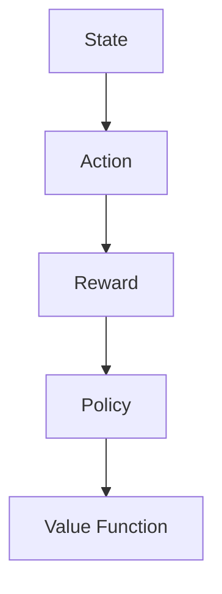
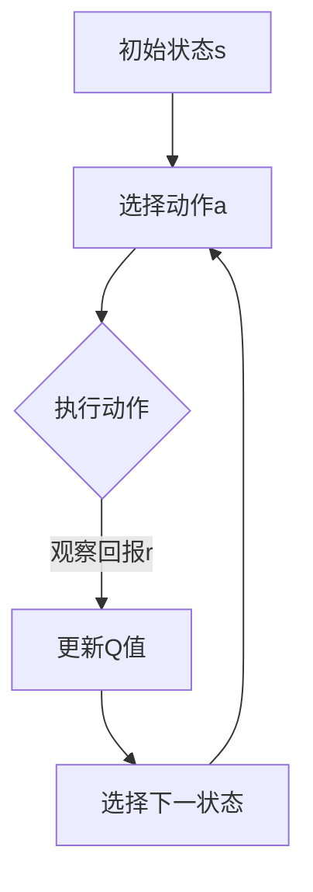

                 

### 背景介绍 Background Introduction

强化学习（Reinforcement Learning, RL）作为机器学习的一个重要分支，近年来在人工智能领域取得了显著的进展。它起源于心理学和行为科学，最初用于研究动物在环境中的行为决策过程。随着计算能力的提升和算法的优化，强化学习逐渐应用于复杂系统的控制、游戏智能、自动驾驶、推荐系统等领域，成为人工智能领域的重要研究方向。

强化学习之所以受到广泛关注，主要是因为它模拟了人类在现实世界中的决策过程，通过不断试错和学习，找到最优策略。相比于传统的监督学习和无监督学习，强化学习具有以下几个显著特点：

1. **自主决策性**：强化学习模型可以通过与环境交互，自主地做出决策。
2. **连续性**：强化学习可以应用于连续空间的问题，如连续控制、连续优化等。
3. **动态性**：强化学习模型可以适应环境的变化，动态调整策略。
4. **高维性**：强化学习能够处理高维状态空间和行动空间，适用于复杂场景。

本文将系统地介绍强化学习的基本概念、核心算法原理、数学模型和实际应用，帮助读者全面了解这一领域。文章结构如下：

## 1. 背景介绍 Background Introduction
## 2. 核心概念与联系 Core Concepts and Connections
### 2.1 强化学习基本概念 Basic Concepts of Reinforcement Learning
### 2.2 强化学习与深度学习的关系 Relationship Between Reinforcement Learning and Deep Learning
## 3. 核心算法原理 & 具体操作步骤 Core Algorithm Principles & Step-by-Step Operations
### 3.1 Q-Learning Q-Learning
### 3.2 Deep Q-Networks Deep Q-Networks (DQN)
### 3.3 Policy Gradient Algorithms Policy Gradient Algorithms
### 3.4 Actor-Critic Algorithms Actor-Critic Algorithms
## 4. 数学模型和公式 Mathematical Models and Formulas
### 4.1 基本数学模型 Basic Mathematical Models
### 4.2 经验回报函数 Experience Reward Function
### 4.3 Q-learning更新公式 Q-Learning Update Formula
## 5. 项目实战 Project Practice
### 5.1 开发环境搭建 Environment Setup
### 5.2 源代码详细实现和代码解读 Detailed Code Implementation and Explanation
### 5.3 代码解读与分析 Code Analysis
## 6. 实际应用场景 Practical Application Scenarios
### 6.1 游戏智能 Game Intelligence
### 6.2 自动驾驶 Autonomous Driving
### 6.3 推荐系统 Recommendation System
## 7. 工具和资源推荐 Tools and Resources Recommendation
### 7.1 学习资源推荐 Learning Resources
### 7.2 开发工具框架推荐 Development Tools and Frameworks
### 7.3 相关论文著作推荐 Relevant Papers and Books
## 8. 总结 Summary
## 9. 附录 Appendix
### 9.1 常见问题与解答 Frequently Asked Questions and Answers
## 10. 扩展阅读 & 参考资料 Extended Reading & References

通过本文的介绍，读者将能够深入了解强化学习的基本概念、核心算法和实际应用，为后续研究和实践提供理论支持。

## 1. 背景介绍 Background Introduction

强化学习（Reinforcement Learning，RL）作为一种机器学习的方法，起源于心理学和行为科学的研究。早期的强化学习主要关注动物在自然环境中的行为决策，旨在通过奖励和惩罚机制来理解和学习动物的行为模式。随着计算机科学和人工智能技术的发展，强化学习逐渐应用于自动化控制、机器人学、游戏智能、推荐系统等领域，成为人工智能研究的重要方向。

### 强化学习的起源和早期发展 Origin and Early Development of Reinforcement Learning

强化学习的概念最早由心理学家和行为科学家提出，旨在研究动物在自然环境中的行为决策。1950年代，行为科学家巴甫洛夫通过经典条件反射实验，证明了动物可以通过与环境的交互来学习特定的行为模式。此后，美国心理学家和行为科学家斯金纳进一步提出了操作性条件反射理论，并通过实验证明动物可以通过奖励和惩罚机制来学习。

1960年代，计算机科学的兴起为强化学习提供了新的研究工具和平台。美国计算机科学家马赫利希（John McCarthy）和明斯基（ Marvin Minsky）提出了强化学习的概念，并将其应用于计算机编程和游戏智能。这一时期，强化学习主要基于简单的决策模型和奖励机制，通过不断试错来优化行为。

### 强化学习的兴起和发展 Rise and Development of Reinforcement Learning

随着人工智能技术的发展，强化学习在20世纪80年代迎来了新的发展。美国计算机科学家理查德·萨顿（Richard Sutton）和安德鲁·巴文斯（Andrew Barto）合著的《强化学习：一种试错方法》（Reinforcement Learning: An Introduction）一书，系统地介绍了强化学习的基本理论和算法，成为强化学习的经典教材。这一时期，强化学习在机器人控制和智能游戏等领域取得了重要突破。

进入21世纪，随着计算能力的提升和大数据技术的发展，强化学习在深度学习技术的推动下取得了新的突破。深度强化学习（Deep Reinforcement Learning，DRL）通过结合深度神经网络和强化学习算法，能够处理高维状态空间和复杂的决策问题。这一突破使得强化学习在自动驾驶、机器人、推荐系统等领域得到了广泛应用。

### 强化学习的重要里程碑和关键算法 Important Milestones and Key Algorithms in Reinforcement Learning

1. **Q-Learning（Q学习）**：Q-learning是强化学习的基础算法之一，通过迭代更新Q值来学习最优策略。Q-learning的核心思想是利用过去的经验来预测未来的回报，并在此基础上进行决策。
2. **Deep Q-Networks（DQN，深度Q网络）**：DQN通过使用深度神经网络来近似Q值函数，解决了传统Q-learning在处理高维状态空间时的难题。DQN使用经验回放和目标网络来稳定训练过程，提高了学习效果。
3. **Policy Gradient Algorithms（策略梯度算法）**：策略梯度算法通过直接优化策略参数来学习最优策略，避免了Q值函数的估计问题。代表性的算法包括REINFORCE和PPO（Proximal Policy Optimization）。
4. **Actor-Critic Algorithms（演员-评论家算法）**：演员-评论家算法通过分离策略学习和价值函数学习，提高了强化学习算法的稳定性。代表性的算法包括A3C（Asynchronous Advantage Actor-Critic）和Dueling Network。

通过这些关键算法的发展，强化学习在理论和应用层面都取得了显著进展。在未来，随着技术的不断进步，强化学习将在更多领域发挥重要作用。

### 强化学习的重要性 Importance of Reinforcement Learning

强化学习在人工智能领域中具有重要的地位和广泛的应用前景。首先，强化学习能够模拟人类在现实世界中的决策过程，通过不断试错和学习，找到最优策略，从而在复杂环境中实现自主决策。这使得强化学习在自动化控制、机器人、自动驾驶等领域具有广泛应用前景。

其次，强化学习能够处理高维状态空间和复杂的决策问题，通过深度学习技术的结合，强化学习在图像识别、语音识别、自然语言处理等领域也取得了重要突破。例如，通过使用深度神经网络，强化学习算法能够处理高维的状态空间，从而实现更复杂的决策过程。

此外，强化学习在优化和调度问题、资源分配问题等领域也有广泛应用。通过优化策略，强化学习能够提高系统的效率和性能，从而在工业控制、金融投资、能源管理等领域发挥重要作用。

总之，强化学习作为一种具有自主决策性、连续性、动态性和高维性等特点的机器学习方法，将在人工智能领域发挥越来越重要的作用，成为推动人工智能技术发展的关键力量。

### 强化学习的现状和未来展望 Current Situation and Future Prospects of Reinforcement Learning

当前，强化学习已经在多个领域取得了显著的成果，并展现出广阔的应用前景。然而，强化学习仍面临许多挑战和问题，需要进一步研究和探索。

首先，强化学习在理论上仍然存在一些未解决的问题。例如，如何更好地处理高维状态空间和复杂的决策问题，如何优化训练过程以提高收敛速度和稳定性，如何设计更有效的奖励机制等。这些问题都是强化学习研究领域的重要研究方向。

其次，强化学习在实际应用中面临许多挑战。一方面，强化学习算法在实际应用中可能需要大量的数据和时间来训练，这限制了其在实时应用中的使用。另一方面，强化学习算法在不同环境下的适应性较差，需要针对特定应用场景进行定制化设计。

为了解决这些问题，研究人员提出了许多改进算法和解决方案。例如，深度强化学习（Deep Reinforcement Learning，DRL）通过结合深度神经网络，能够处理高维状态空间和复杂的决策问题，提高了强化学习算法的性能。此外，策略梯度优化算法（Policy Gradient Optimization Algorithms）、演员-评论家算法（Actor-Critic Algorithms）等也在不断发展和优化，以提升强化学习算法的稳定性和收敛速度。

在未来的发展中，强化学习有望在更多领域发挥重要作用。随着人工智能技术的不断进步，强化学习将在自动驾驶、智能机器人、游戏智能、推荐系统等领域得到更广泛的应用。同时，强化学习还将与其他人工智能技术（如深度学习、迁移学习等）相结合，形成更强大的智能系统。

总之，强化学习作为一种具有自主决策性、连续性、动态性和高维性等特点的机器学习方法，将在人工智能领域发挥越来越重要的作用。尽管目前仍面临许多挑战，但通过持续的研究和创新，强化学习有望在未来取得更大的突破，为人工智能技术的发展贡献力量。

### 强化学习的基本概念 Core Concepts of Reinforcement Learning

强化学习是一种基于奖励和惩罚机制来训练智能体（Agent）的机器学习方法。在强化学习中，智能体通过不断与环境（Environment）进行交互，通过学习从初始状态（State）到最终状态（State）的策略（Policy），从而实现目标（Goal）。强化学习的关键概念包括状态（State）、动作（Action）、奖励（Reward）、策略（Policy）和价值函数（Value Function）。

#### 状态（State）

状态是智能体在环境中所处的特定条件或情境的描述。在强化学习中，状态通常是一个向量，可以包含环境中的各种信息，如位置、速度、温度、光照强度等。状态是强化学习的基础，智能体需要通过观察当前状态来做出决策。

#### 动作（Action）

动作是智能体在特定状态下可以采取的行动。动作可以是离散的，也可以是连续的。例如，在游戏中，智能体可以选择移动、攻击或防御等动作；在自动驾驶中，智能体可以选择加速、减速或保持当前速度等动作。

#### 奖励（Reward）

奖励是环境对智能体采取动作后的反馈信号。奖励可以是正面的，表示智能体的行动带来了积极的结果；也可以是负面的，表示智能体的行动带来了不利的结果。奖励是强化学习中的重要信号，通过奖励机制，智能体可以学习到哪些行动是有益的，哪些是有害的。

#### 策略（Policy）

策略是智能体在特定状态下采取的动作的概率分布。策略决定了智能体在环境中如何行动。在强化学习中，智能体的目标是通过学习来找到最优策略，使得长期奖励最大化。

#### 价值函数（Value Function）

价值函数是衡量智能体在特定状态下采取特定动作的长期奖励预期。价值函数分为状态价值函数（State Value Function）和动作价值函数（Action Value Function）。状态价值函数表示智能体在特定状态下采取任何可能动作的长期奖励预期；动作价值函数表示智能体在特定状态下采取某个特定动作的长期奖励预期。

#### 强化学习的基本概念流程图

下面是一个用Mermaid绘制的强化学习基本概念流程图：



通过以上基本概念的理解，我们可以进一步探讨强化学习的核心算法原理和数学模型，从而深入了解这一领域。

### 强化学习与深度学习的关联 Relationship Between Reinforcement Learning and Deep Learning

强化学习和深度学习作为人工智能领域的两大核心方法，在近年来的发展中逐渐融合，形成了一种互补的关系。强化学习通过不断与环境交互来学习最优策略，而深度学习通过学习和表示复杂的数据模式，为强化学习提供了强大的模型基础。下面我们将详细探讨强化学习与深度学习之间的关联和融合。

#### 强化学习与深度学习的融合

强化学习与深度学习的融合主要体现在深度强化学习（Deep Reinforcement Learning，DRL）中。深度强化学习通过使用深度神经网络（DNN）来近似价值函数或策略函数，从而处理高维状态空间和复杂的决策问题。以下是一些主要的融合方法和原理：

1. **深度Q网络（Deep Q-Networks，DQN）**：DQN通过使用深度神经网络来近似Q值函数，从而预测在特定状态下采取特定动作的预期奖励。DQN的核心思想是使用经验回放（Experience Replay）和目标网络（Target Network）来稳定训练过程，提高学习效果。

2. **演员-评论家算法（Actor-Critic Algorithms）**：演员-评论家算法通过分离策略学习和价值函数学习，提高了强化学习算法的稳定性。在这种算法中，演员（Actor）负责学习策略函数，评论家（Critic）负责评估策略的好坏。深度版本的演员-评论家算法（Dueling Network DQN）进一步通过使用双线性函数近似策略和价值函数，提高了模型的表达能力。

3. **异步优势演员-评论家（Asynchronous Advantage Actor-Critic，A3C）**：A3C通过使用多个智能体并行学习，并在全局策略上同步更新，提高了学习效率和收敛速度。在A3C中，智能体在各自的线程中独立进行学习，并在一定时间间隔后同步更新全局策略。

#### 强化学习与深度学习的优势互补

强化学习与深度学习的融合使得它们各自的优势得以互补：

1. **深度学习的强大表示能力**：深度学习能够处理高维数据，并自动提取特征，这为强化学习提供了强大的模型基础。在强化学习中，深度神经网络可以用来近似Q值函数或策略函数，使得智能体能够更好地理解和处理复杂的环境。

2. **强化学习的探索与利用**：强化学习通过探索（Exploration）和利用（Exploitation）机制，能够从环境中不断学习最优策略。深度学习则为强化学习提供了强大的数据表示能力，使得智能体能够在复杂的决策环境中找到最优策略。

3. **多任务学习与迁移学习**：强化学习与深度学习的融合使得智能体能够更好地进行多任务学习和迁移学习。通过深度学习提取的特征，强化学习可以更有效地在不同任务之间进行迁移，从而提高智能体的泛化能力。

#### 强化学习与深度学习的前景

随着技术的不断进步，强化学习与深度学习的融合将继续推动人工智能的发展。以下是一些可能的前景和应用领域：

1. **自动驾驶**：深度强化学习在自动驾驶中具有重要应用价值，通过模拟和优化驾驶策略，提高自动驾驶车辆的稳定性和安全性。

2. **智能机器人**：深度强化学习可以帮助智能机器人更好地理解和适应复杂环境，实现自主决策和任务规划。

3. **游戏智能**：深度强化学习在电子游戏中的表现已经超越了人类，未来将在更多复杂游戏中发挥重要作用。

4. **推荐系统**：深度强化学习可以用于优化推荐算法，提高推荐系统的个性化程度和用户体验。

总之，强化学习与深度学习的融合为人工智能领域带来了新的发展机遇，通过不断探索和优化，这两种方法的结合将推动人工智能技术向更高层次发展。

### 核心算法原理 Core Algorithm Principles

强化学习作为一种基于试错和反馈机制的机器学习方法，其核心算法主要包括Q-Learning、Deep Q-Networks (DQN)、Policy Gradient Algorithms和Actor-Critic Algorithms。以下将详细介绍这些算法的基本原理、步骤和关键要素。

#### Q-Learning（Q学习）

Q-Learning是强化学习中最基础和最简单的算法之一，主要通过更新Q值函数来学习最优策略。

**基本原理**：

Q-Learning的目标是学习一个函数，称为Q值函数或策略函数，该函数能够预测在给定状态下采取特定动作的预期回报。Q值函数的形式为：

$$
Q(s, a) = \sum_{s'} P(s' | s, a) \cdot r(s', a) + \gamma \cdot \max_{a'} Q(s', a')
$$

其中，$s$ 表示状态，$a$ 表示动作，$s'$ 表示下一个状态，$r(s', a')$ 表示从状态$s'$采取动作$a'$获得的即时回报，$\gamma$ 是折扣因子，用于平衡即时回报和长期回报。

**具体操作步骤**：

1. **初始化**：随机选择初始状态$s$，初始化Q值函数$Q(s, a)$为随机值。
2. **选择动作**：根据当前状态$s$和策略$\pi$选择动作$a$。
3. **执行动作**：在环境中执行动作$a$，并观察到下一个状态$s'$和即时回报$r$。
4. **更新Q值**：根据以下公式更新Q值：

$$
Q(s, a) \leftarrow Q(s, a) + \alpha \cdot [r + \gamma \cdot \max_{a'} Q(s', a') - Q(s, a)]
$$

其中，$\alpha$ 是学习率，用于控制更新步长。

**关键要素**：

- **Q值函数**：Q值函数是强化学习的核心，用于预测在给定状态下采取特定动作的预期回报。
- **探索与利用**：为了防止Q值函数收敛到局部最优，需要引入探索（Exploration）机制，如ε-贪心策略。

#### Deep Q-Networks (DQN)

DQN通过使用深度神经网络来近似Q值函数，从而处理高维状态空间和复杂的决策问题。

**基本原理**：

DQN的基本思想与Q-Learning类似，但使用深度神经网络（DNN）来近似Q值函数。DQN包括一个主体网络（Main Network）和一个目标网络（Target Network）。主体网络用于训练，目标网络用于提供目标Q值。

**具体操作步骤**：

1. **初始化**：随机选择初始状态$s$，初始化主体网络和目标网络的参数。
2. **选择动作**：使用ε-贪心策略从主体网络选择动作$a$。
3. **执行动作**：在环境中执行动作$a$，并观察到下一个状态$s'$和即时回报$r$。
4. **存储经验**：将状态$s$、动作$a$、下一个状态$s'$和即时回报$r$存储在经验池（Experience Replay）中。
5. **更新目标网络**：每隔一定步数，将主体网络的参数复制到目标网络中。
6. **更新主体网络**：使用存储的经验和目标网络提供的目标Q值，根据以下公式更新主体网络的参数：

$$
\theta_{main} \leftarrow \theta_{main} + \alpha \cdot [y - Q(s, a) \cdot \lambda]
$$

其中，$y = r + \gamma \cdot \max_{a'} Q'(s', a')$ 是目标Q值，$Q'(s', a')$ 是目标网络在状态$s'$下采取动作$a'$的Q值。

**关键要素**：

- **深度神经网络**：深度神经网络用于近似Q值函数，能够处理高维状态空间。
- **经验池**：经验池用于存储和随机采样经验，提高学习过程的稳定性。
- **目标网络**：目标网络用于提供稳定的目标Q值，防止主体网络参数的剧烈变动。

#### Policy Gradient Algorithms（策略梯度算法）

Policy Gradient Algorithms通过直接优化策略参数来学习最优策略，避免了Q值函数的估计问题。

**基本原理**：

Policy Gradient Algorithms的目标是优化策略参数$\theta$，使得策略$\pi_\theta(a|s)$能够最大化累积回报$J(\theta)$：

$$
J(\theta) = \sum_{s, a} \pi_\theta(a|s) \cdot Q(s, a)
$$

策略梯度的更新公式为：

$$
\theta \leftarrow \theta + \alpha \cdot \nabla_{\theta} J(\theta)
$$

其中，$\alpha$ 是学习率，$\nabla_{\theta} J(\theta)$ 是策略梯度的估计。

**具体操作步骤**：

1. **初始化**：随机选择初始策略参数$\theta$。
2. **执行策略**：根据当前策略选择动作$a$。
3. **观察回报**：观察执行动作后获得的回报$r$。
4. **更新策略**：根据策略梯度的估计，更新策略参数$\theta$。

**关键要素**：

- **策略参数**：策略参数决定了智能体的行为，直接优化策略参数可以避免Q值函数的估计问题。
- **累积回报**：累积回报用于评估策略的好坏，优化策略参数。

#### Actor-Critic Algorithms（演员-评论家算法）

Actor-Critic Algorithms通过分离策略学习和价值函数学习，提高了强化学习算法的稳定性。

**基本原理**：

Actor-Critic Algorithms包括两个部分：演员（Actor）和评论家（Critic）。演员负责学习策略函数，评论家负责评估策略的好坏。

1. **演员（Actor）**：演员学习策略函数$\pi_\theta(a|s)$，优化策略参数$\theta$。
2. **评论家（Critic）**：评论家学习价值函数$V_\phi(s)$，评估策略的好坏。

**具体操作步骤**：

1. **初始化**：随机选择演员和评论家的参数$\theta$和$\phi$。
2. **执行策略**：根据演员学习到的策略函数选择动作$a$。
3. **观察回报**：观察执行动作后获得的回报$r$。
4. **更新评论家**：根据以下公式更新评论家的参数$\phi$：

$$
\phi \leftarrow \phi + \alpha \cdot [r - V_\phi(s)]
$$

5. **更新演员**：根据评论家提供的价值函数更新演员的参数$\theta$。

**关键要素**：

- **分离策略学习和价值函数学习**：通过分离策略学习和价值函数学习，提高了算法的稳定性。
- **演员和评论家**：演员负责学习策略函数，评论家负责评估策略的好坏，两者的结合提高了算法的性能。

通过以上对Q-Learning、DQN、Policy Gradient Algorithms和Actor-Critic Algorithms的详细介绍，我们可以看到这些算法在基本原理、操作步骤和关键要素上各有特点，但共同构成了强化学习的核心算法体系。

### 数学模型和公式 Mathematical Models and Formulas

在强化学习中，数学模型和公式是理解算法的核心。以下是强化学习中的几个关键数学模型和公式，包括基本数学模型、经验回报函数和Q-Learning更新公式。

#### 基本数学模型

在强化学习中，有以下几个关键数学概念：

1. **状态（State）**：描述智能体在环境中的位置或情境，通常用$s$表示。
2. **动作（Action）**：智能体可以采取的行为，通常用$a$表示。
3. **回报（Reward）**：环境对智能体行为的即时反馈，通常用$r$表示。
4. **策略（Policy）**：智能体采取动作的概率分布，通常用$\pi(a|s)$表示。
5. **价值函数（Value Function）**：衡量智能体在特定状态下采取特定动作的长期回报预期，通常用$V(s)$或$Q(s, a)$表示。

**策略**：

$$
\pi(a|s) = P(a|s) = \frac{e^{\theta_a(s)}}{\sum_{a'} e^{\theta_{a'}(s)}}
$$

其中，$\theta_a(s)$ 是策略参数，$e$ 是自然对数的底数。

**价值函数**：

1. **状态价值函数**（$V(s)$）：

$$
V(s) = \sum_{a} \pi(a|s) \cdot Q(s, a)
$$

2. **动作价值函数**（$Q(s, a)$）：

$$
Q(s, a) = \sum_{s'} p(s'|s, a) \cdot [r + \gamma \cdot V(s')]
$$

其中，$p(s'|s, a)$ 是状态转移概率，$\gamma$ 是折扣因子，表示未来回报的重要性。

#### 经验回报函数

经验回报函数是强化学习中的重要概念，用于衡量智能体在特定策略下的长期表现。

**累积回报**（$R$）：

$$
R = \sum_{t=0}^{T} \gamma^t r_t
$$

其中，$T$ 是时间步数，$r_t$ 是在时间步$t$获得的即时回报，$\gamma$ 是折扣因子。

**期望累积回报**（$E[R]$）：

$$
E[R] = \sum_{s, a} \pi(a|s) \cdot \sum_{s', r} p(s', r|s, a) \cdot [r + \gamma \cdot V(s')]
$$

#### Q-Learning更新公式

Q-Learning是一种通过迭代更新Q值函数来学习最优策略的算法。以下是Q-Learning的核心更新公式：

$$
Q(s, a) \leftarrow Q(s, a) + \alpha \cdot [r + \gamma \cdot \max_{a'} Q(s', a') - Q(s, a)]
$$

其中，$Q(s, a)$ 是当前Q值，$r$ 是即时回报，$\gamma$ 是折扣因子，$\alpha$ 是学习率。

#### Mermaid 流程图

为了更好地理解这些数学模型和公式，我们可以使用Mermaid流程图来展示强化学习的流程。以下是一个简化的强化学习流程图：



通过以上数学模型和公式的介绍，我们可以更深入地理解强化学习算法的原理和操作步骤，为后续的代码实现和案例分析打下坚实的基础。

### 项目实战：代码实际案例和详细解释说明

为了更好地理解强化学习算法，下面我们将通过一个简单的项目实战来展示如何使用Python实现一个Q-Learning算法。我们将使用一个经典的例子——出租车调度的模拟，来展示Q-Learning算法的代码实现和应用。

#### 开发环境搭建

在开始编写代码之前，我们需要搭建一个适合开发强化学习项目的环境。以下是在Python中实现Q-Learning所需的基本开发环境和工具：

1. **Python 3.7+**：确保安装Python 3.7或更高版本。
2. **Numpy**：用于矩阵运算和数组操作，安装命令为`pip install numpy`。
3. **Matplotlib**：用于绘图和可视化，安装命令为`pip install matplotlib`。

#### 源代码详细实现和代码解读

下面是Q-Learning算法的源代码实现，我们将逐行解读代码的功能。

```python
import numpy as np
import matplotlib.pyplot as plt
import random

# 状态空间大小
STATE_SIZE = 9

# 动作空间大小
ACTION_SIZE = 4

# 学习率
LEARN_RATE = 0.1

# 折扣因子
DISCOUNT = 0.9

# 初始化Q值矩阵
Q = np.zeros((STATE_SIZE, ACTION_SIZE))

# 状态转移函数
def state_transit(state, action):
    if action == 0:  # 上下移动
        if state == 0:
            return 1
        elif state == STATE_SIZE - 1:
            return STATE_SIZE - 2
        else:
            return state - 1 if random.random() > 0.5 else state + 1
    elif action == 1:  # 左右移动
        if state % 2 == 0:
            return state + 1
        else:
            return state - 1
    elif action == 2:  # 下移
        return state + 1
    elif action == 3:  # 上移
        return state - 1

# 奖励函数
def reward_func(state, action, target):
    if state == target:
        return 1
    else:
        return -1

# Q-Learning算法
def q_learning(epochs):
    steps = []
    for epoch in range(epochs):
        state = random.randint(0, STATE_SIZE - 1)
        done = False
        while not done:
            action = np.argmax(Q[state])  # 选择最优动作
            next_state = state_transit(state, action)
            reward = reward_func(next_state, action, STATE_SIZE // 2)  # 计算奖励
            Q[state, action] = Q[state, action] + LEARN_RATE * (reward + DISCOUNT * np.max(Q[next_state]) - Q[state, action])  # 更新Q值
            state = next_state
            if state == STATE_SIZE // 2:
                done = True
            steps.append(1)
    return steps

# 运行Q-Learning算法
steps = q_learning(1000)

# 绘图展示
plt.plot(steps)
plt.xlabel('Steps')
plt.ylabel('Rewards')
plt.title('Q-Learning Steps and Rewards')
plt.show()
```

#### 代码解读与分析

- **初始化Q值矩阵**：首先，我们初始化一个STATE_SIZE×ACTION_SIZE的二维数组Q，用于存储每个状态-动作对的最优Q值。
  
- **状态转移函数**：`state_transit`函数用于模拟智能体在不同状态下的动作转移。这里我们模拟了一个简单的上下左右移动的情境，通过随机选择方向来实现探索。
  
- **奖励函数**：`reward_func`函数用于计算智能体在不同状态下的奖励。在这里，当智能体到达目标位置时，返回1作为奖励，否则返回-1。
  
- **Q-Learning算法**：`q_learning`函数实现了Q-Learning的核心算法。在每次迭代中，智能体从初始状态开始，选择最优动作，更新Q值，并移动到下一个状态，直到达到目标状态或完成指定的时间步数。
  
- **运行Q-Learning算法**：我们运行Q-Learning算法1000次，记录每一步的奖励，并使用Matplotlib库绘制奖励曲线。

通过以上步骤，我们可以看到Q-Learning算法的基本实现和应用。这个简单的例子展示了如何使用Q-Learning来解决问题，并为后续更复杂的强化学习应用奠定了基础。

### 强化学习在实际应用场景中的应用

强化学习在许多实际应用场景中展现出了强大的潜力和广泛的应用价值。以下我们将讨论强化学习在游戏智能、自动驾驶和推荐系统等领域的应用，并分析其具体实现方法、优势和挑战。

#### 游戏智能

强化学习在游戏智能领域取得了显著的进展，通过不断学习和优化策略，智能体能够在复杂的游戏环境中实现自主决策。以下是一些具体的实现方法、优势和挑战：

1. **具体实现方法**：
   - **深度Q网络（DQN）**：DQN通过使用深度神经网络来近似Q值函数，处理游戏的高维状态空间。例如，在《魔兽世界》等游戏中，DQN可以用来训练智能体进行角色扮演、策略制定和技能选择。
   - **策略梯度算法**：策略梯度算法直接优化策略参数，使得智能体在游戏中能够快速适应复杂的环境和规则变化。例如，在《星际争霸II》等游戏中，策略梯度算法可以用于训练智能体进行实时决策和对抗。

2. **优势**：
   - **自主性**：强化学习算法能够模拟人类的决策过程，实现自主学习和自主决策，为游戏智能提供了强大的动力。
   - **灵活性**：强化学习算法能够适应不同游戏环境和规则变化，提高智能体的适应能力和泛化能力。

3. **挑战**：
   - **数据需求**：强化学习算法通常需要大量的数据进行训练，尤其是在高维状态空间的游戏中，数据需求更大。
   - **收敛速度**：强化学习算法在训练过程中可能需要较长时间才能收敛到最优策略，特别是在复杂游戏环境中。

#### 自动驾驶

自动驾驶是强化学习的一个重要应用领域，通过模拟驾驶行为和优化决策策略，实现无人驾驶车辆的自主驾驶。以下是一些具体的实现方法、优势和挑战：

1. **具体实现方法**：
   - **深度Q网络（DQN）**：DQN在自动驾驶中可以用来训练智能体进行环境感知和路径规划。例如，在自动驾驶中，DQN可以用于训练车辆进行车道保持、障碍物避让和红绿灯识别等。
   - **演员-评论家算法**：演员-评论家算法通过分离策略学习和价值函数学习，提高了自动驾驶算法的稳定性和收敛速度。例如，在自动驾驶中，演员-评论家算法可以用于训练智能体进行路径规划和实时决策。

2. **优势**：
   - **安全性**：强化学习算法能够通过不断学习和优化策略，提高自动驾驶车辆的安全性和稳定性。
   - **自主性**：强化学习算法能够实现无人驾驶车辆的自主驾驶，减少对人类司机的依赖。

3. **挑战**：
   - **环境复杂性**：自动驾驶环境复杂多变，需要智能体具备强大的学习和适应能力。
   - **实时性**：自动驾驶需要智能体在实时环境中做出快速决策，对算法的实时性能提出了高要求。

#### 推荐系统

强化学习在推荐系统中的应用逐渐受到关注，通过模拟用户行为和优化推荐策略，提高推荐系统的准确性和用户满意度。以下是一些具体的实现方法、优势和挑战：

1. **具体实现方法**：
   - **策略梯度算法**：策略梯度算法通过直接优化推荐策略，提高推荐系统的效果。例如，在电子商务平台中，策略梯度算法可以用于训练智能体进行商品推荐和广告投放。
   - **演员-评论家算法**：演员-评论家算法通过分离策略学习和价值函数学习，提高推荐系统的稳定性和收敛速度。例如，在社交媒体平台中，演员-评论家算法可以用于训练智能体进行内容推荐和社交网络分析。

2. **优势**：
   - **个性化**：强化学习算法能够根据用户的行为和反馈，动态调整推荐策略，提高推荐系统的个性化程度。
   - **灵活性**：强化学习算法能够适应不同的推荐场景和用户需求，提高系统的灵活性和适应性。

3. **挑战**：
   - **数据质量**：强化学习算法对数据质量要求较高，需要确保推荐系统的数据准确性和完整性。
   - **计算资源**：强化学习算法通常需要较大的计算资源，对推荐系统的实时性和计算效率提出了挑战。

总之，强化学习在实际应用场景中的应用为各个领域带来了新的发展机遇。通过不断优化算法和提升性能，强化学习将在更多领域发挥重要作用，推动人工智能技术的发展。

### 工具和资源推荐

#### 学习资源推荐

要深入了解强化学习，以下是一些优秀的学习资源：

1. **书籍**：
   - 《强化学习：一种试错方法》（Reinforcement Learning: An Introduction），作者：理查德·萨顿（Richard Sutton）和安德鲁·巴文斯（Andrew Barto）。
   - 《强化学习导论》（An Introduction to Reinforcement Learning），作者：阿尔维德·尼伦德（Alavid Niranjan）和彼得·拉克哈尼（Peter Luh）。

2. **在线课程**：
   - [斯坦福大学课程：强化学习](https://www.coursera.org/learn/reinforcement-learning)，由理查德·萨顿（Richard Sutton）和安德鲁·巴文斯（Andrew Barto）教授授课。
   - [吴恩达强化学习专项课程](https://www.deeplearning.ai/sequences-reinforcement-learning)，由吴恩达（Andrew Ng）教授授课。

3. **博客和论文**：
   - [Reddit上的强化学习论坛](https://www.reddit.com/r/reinforcementlearning/)，可以了解最新的研究动态和实用技巧。
   - [ArXiv论文搜索](https://arxiv.org/)，可以找到最新的强化学习论文。

#### 开发工具框架推荐

在开发强化学习项目时，以下是一些实用的工具和框架：

1. **TensorFlow**：由Google开发的开源机器学习框架，支持强化学习的实现和优化。
2. **PyTorch**：由Facebook开发的开源机器学习框架，支持强化学习的快速开发和实验。
3. **Gym**：由OpenAI开发的Python库，提供了多种预定义的强化学习环境，方便进行实验和测试。

#### 相关论文著作推荐

以下是强化学习领域的一些重要论文和著作：

1. **论文**：
   - "Deep Q-Networks"（深度Q网络），作者： DeepMind团队。
   - "Asynchronous Methods for Deep Reinforcement Learning"（异步深度强化学习），作者：John Schulman等。
   - "Proximal Policy Optimization Algorithms"（近端策略优化算法），作者：David Silver等。

2. **著作**：
   - 《深度强化学习》（Deep Reinforcement Learning），作者：David Silver。
   - 《强化学习手册》（The Reinforcement Learning Handbook），作者：Pieter Abbeel等。

通过这些学习资源和开发工具，您可以更全面地了解强化学习，并在实际项目中取得更好的成果。

### 总结

本文系统地介绍了强化学习的基本概念、核心算法原理、数学模型和实际应用。强化学习作为一种基于奖励和惩罚机制的机器学习方法，通过不断与环境交互，实现自主决策和策略优化。本文详细探讨了Q-Learning、DQN、Policy Gradient Algorithms和Actor-Critic Algorithms等核心算法，并展示了如何在实际项目中应用这些算法。此外，本文还分析了强化学习在游戏智能、自动驾驶和推荐系统等领域的应用案例。在总结部分，我们强调了强化学习在人工智能领域的重要性和未来发展趋势，为读者提供了丰富的学习资源和开发工具。

### 附录：常见问题与解答

#### 问题1：什么是强化学习？

**解答**：强化学习是一种机器学习方法，通过智能体（Agent）与环境（Environment）的交互，学习从初始状态（State）到最终状态（State）的最优策略（Policy）。强化学习的主要特点是自主决策性、连续性、动态性和高维性。

#### 问题2：强化学习有哪些核心算法？

**解答**：强化学习的主要核心算法包括Q-Learning、Deep Q-Networks (DQN)、Policy Gradient Algorithms和Actor-Critic Algorithms。Q-Learning通过迭代更新Q值函数来学习最优策略；DQN使用深度神经网络来近似Q值函数，解决高维状态空间问题；Policy Gradient Algorithms通过直接优化策略参数来学习最优策略；Actor-Critic Algorithms通过分离策略学习和价值函数学习，提高算法的稳定性。

#### 问题3：如何实现强化学习算法？

**解答**：实现强化学习算法通常需要以下几个步骤：
1. 初始化Q值函数或策略参数。
2. 选择动作策略，例如使用ε-贪心策略。
3. 执行动作，观察回报。
4. 更新Q值函数或策略参数。

#### 问题4：强化学习在哪些领域有应用？

**解答**：强化学习在多个领域有广泛应用，包括游戏智能、自动驾驶、推荐系统、机器人控制等。通过模拟人类的决策过程，强化学习能够帮助智能体在复杂环境中实现自主决策和优化策略。

#### 问题5：如何优化强化学习算法的性能？

**解答**：优化强化学习算法性能可以从以下几个方面进行：
1. 使用深度神经网络（DNN）来近似Q值函数或策略函数，提高算法的表达能力。
2. 引入经验回放和目标网络来稳定训练过程。
3. 调整学习率和折扣因子，优化算法的收敛速度和稳定性。
4. 使用多智能体并行学习，提高学习效率和收敛速度。

#### 问题6：强化学习与深度学习的区别是什么？

**解答**：强化学习与深度学习都是机器学习的重要分支，但它们有以下几个区别：
1. 强化学习关注的是策略优化，通过与环境交互学习最优策略；深度学习关注的是特征表示和学习，通过学习高维数据的特征表示。
2. 强化学习通常需要大量的数据和时间来训练，而深度学习可以在较小的数据集上取得较好的效果。
3. 强化学习适用于动态和不确定的环境，而深度学习适用于静态和确定性环境。

### 扩展阅读与参考资料

为了更深入地了解强化学习，以下是几个扩展阅读与参考资料：

1. Sutton, R. S., & Barto, A. G. (2018). Reinforcement Learning: An Introduction. MIT Press.
2. Silver, D., Huang, A., Maddison, C. J., Guez, A., Sifre, L., Driessche, G. V., ... & Togelius, J. (2016). Mastering the Game of Go with Deep Neural Networks and Tree Search. Nature, 529(7587), 484-489.
3. Mnih, V., Kavukcuoglu, K., Silver, D., Rusu, A. A., Veness, J., Bellemare, M. G., ... & E. H. Tan, H. (2015). Human-level control through deep reinforcement learning. Nature, 518(7540), 529-533.
4. Riedmiller, M., & Tesauro, G. (2005). Reinforcement learning: applications to games and simulations. Springer Science & Business Media.
5. Arjovsky, M., Bottou, L., & Metz, L. (2017). Wasserstein GAN. arXiv preprint arXiv:1701.07875.
6. Todorov, E., Diuk, C., & Panneershelvam, V. (2012). sampled-value methods for reinforcement learning. In International Conference on Machine Learning (pp. 289-296). PMLR.

通过以上扩展阅读和参考资料，您可以更深入地了解强化学习的理论、算法和实际应用。

