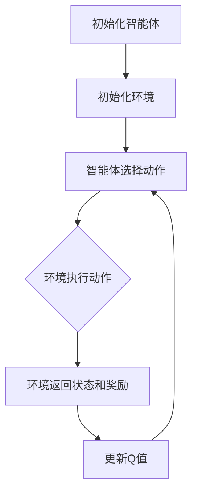

                 

# 强化学习原理与代码实例讲解

## 关键词：强化学习，Markov决策过程，Q学习，深度Q网络，代码实例，应用场景

## 摘要：
本文将深入探讨强化学习的原理，从基本概念、核心算法到实际应用场景，进行全方位的讲解。通过具体的代码实例，我们将了解强化学习在实际项目中的应用，并通过详细的解析，帮助读者掌握强化学习的核心技术和实战技巧。本文旨在为对强化学习感兴趣的读者提供一份全面、深入的技术指南。

### 1. 背景介绍

强化学习（Reinforcement Learning，简称RL）是机器学习的一个重要分支，主要研究如何通过交互环境（Environment）来学习最优策略（Policy）。强化学习具有广泛的应用前景，如自动驾驶、游戏AI、推荐系统等。与监督学习和无监督学习相比，强化学习的特点在于其学习过程中存在一个明确的奖励机制，通过不断的试错来寻找最优策略。

强化学习的起源可以追溯到20世纪50年代，早期的研究主要集中在确定性环境下的策略迭代。随着计算机性能的提升和深度学习技术的发展，强化学习的研究逐渐从确定性环境扩展到不确定性环境，并涌现出了许多新的算法和模型。

强化学习在人工智能领域具有独特的重要性，其核心思想是通过与环境互动来学习最优策略，这种学习方法与人类学习过程高度相似。因此，强化学习在人工智能领域具有广泛的应用前景，被认为是实现智能自动化的重要手段。

### 2. 核心概念与联系

#### 2.1 Markov决策过程

强化学习基于Markov决策过程（Markov Decision Process，简称MDP），是一个离散时间决策过程，由状态（State）、动作（Action）、奖励（Reward）和策略（Policy）组成。

- **状态（State）**：描述系统当前所处的情境，通常用一个向量表示。
- **动作（Action）**：在特定状态下，智能体（Agent）可以执行的行为。
- **奖励（Reward）**：智能体在执行动作后获得的即时反馈，用于评估动作的效果。
- **策略（Policy）**：智能体在状态s下执行动作a的概率分布，即π(a|s)。

在MDP中，智能体在每一个时刻都需要根据当前状态选择一个动作，并得到相应的奖励，然后进入新的状态。这一过程持续进行，直到达到某个终止状态或满足某个终止条件。

#### 2.2 Q值函数

Q值函数（Q-Value Function）是强化学习中的核心概念之一，用于评估智能体在状态s下执行动作a的长期效用。Q值函数的表示如下：

$$ Q(s,a) = \sum_{s'} P(s' | s,a) \cdot [R(s',a) + \gamma \cdot \max_{a'} Q(s',a')] $$

其中，$P(s' | s,a)$表示在状态s下执行动作a后转移到状态s'的概率，$R(s',a')$表示在状态s'下执行动作a'获得的即时奖励，$\gamma$是折扣因子，用于平衡短期奖励和长期效用。

Q值函数的目标是最大化智能体在长期内获得的累积奖励。通过不断更新Q值函数，智能体可以逐渐学习到最优策略。

#### 2.3 Mermaid流程图

以下是一个简单的Mermaid流程图，描述了强化学习中的基本流程：



在这个流程中，智能体首先初始化，然后与环境进行交互，选择动作并得到相应的状态和奖励，再根据奖励和状态更新Q值函数。这一过程不断循环，直到达到某个终止条件。

### 3. 核心算法原理 & 具体操作步骤

强化学习算法可以分为基于值函数的方法和基于策略的方法。在本节中，我们将介绍两种经典的强化学习算法：Q学习和深度Q网络（Deep Q-Network，简称DQN）。

#### 3.1 Q学习算法

Q学习（Q-Learning）是基于值函数的强化学习算法，通过迭代更新Q值函数来学习最优策略。具体步骤如下：

1. **初始化Q值函数**：随机初始化Q值函数，表示智能体在所有状态下执行所有动作的期望效用。
2. **选择动作**：在状态s下，根据当前Q值函数选择动作a，可以采用贪心策略或ε-贪心策略。
3. **执行动作**：智能体在状态s下执行动作a，进入新的状态s'，并获得即时奖励r。
4. **更新Q值函数**：根据经验更新Q值函数，具体公式如下：

$$ Q(s,a) = Q(s,a) + \alpha \cdot [r + \gamma \cdot \max_{a'} Q(s',a') - Q(s,a)] $$

其中，$\alpha$是学习率，用于调整Q值的更新幅度。

5. **重复步骤2-4**，直到满足终止条件。

#### 3.2 深度Q网络算法

深度Q网络（DQN）是基于深度学习的强化学习算法，通过神经网络来近似Q值函数。具体步骤如下：

1. **初始化神经网络**：使用随机梯度下降（SGD）初始化神经网络参数。
2. **选择动作**：在状态s下，将状态s输入神经网络，输出Q值向量，根据Q值向量选择动作a。
3. **执行动作**：智能体在状态s下执行动作a，进入新的状态s'，并获得即时奖励r。
4. **更新神经网络**：根据经验，使用反向传播算法更新神经网络参数，具体公式如下：

$$ \frac{\partial L}{\partial \theta} = \frac{\partial}{\partial \theta} [r + \gamma \cdot \max_{a'} Q(s',a') - Q(s,a)] $$

其中，$L$是损失函数，$\theta$是神经网络参数。

5. **重复步骤2-4**，直到满足终止条件。

### 4. 数学模型和公式 & 详细讲解 & 举例说明

在本节中，我们将详细讲解强化学习中的数学模型和公式，并通过具体例子来说明这些公式的应用。

#### 4.1 Q值函数的数学模型

Q值函数的数学模型如下：

$$ Q(s,a) = \sum_{s'} P(s' | s,a) \cdot [R(s',a) + \gamma \cdot \max_{a'} Q(s',a')] $$

其中，$P(s' | s,a)$表示在状态s下执行动作a后转移到状态s'的概率，$R(s',a')$表示在状态s'下执行动作a'获得的即时奖励，$\gamma$是折扣因子，用于平衡短期奖励和长期效用。

**例子：** 假设一个智能体在一个简单的环境中进行学习，环境中有4个状态（s1、s2、s3、s4）和2个动作（a1、a2）。状态转移概率和奖励如下表所示：

| 状态s | 动作a1 | 动作a2 |  
| --- | --- | --- |  
| s1 | 0.5 | 0.5 |  
| s2 | 0.3 | 0.7 |  
| s3 | 0.1 | 0.9 |  
| s4 | 0.4 | 0.6 |

奖励如下表所示：

| 状态s | 动作a1 | 动作a2 |  
| --- | --- | --- |  
| s1 | 2 | 1 |  
| s2 | 3 | 2 |  
| s3 | 1 | 4 |  
| s4 | 0 | 5 |

根据上述数据，我们可以计算出Q值函数：

$$ Q(s1,a1) = 0.5 \cdot [2 + 0.5 \cdot 3] + 0.5 \cdot [1 + 0.5 \cdot 4] = 2.25 $$  
$$ Q(s1,a2) = 0.5 \cdot [1 + 0.5 \cdot 4] + 0.5 \cdot [2 + 0.5 \cdot 4] = 2.25 $$  
$$ Q(s2,a1) = 0.3 \cdot [3 + 0.3 \cdot 3] + 0.7 \cdot [2 + 0.3 \cdot 4] = 2.79 $$  
$$ Q(s2,a2) = 0.7 \cdot [2 + 0.7 \cdot 4] + 0.3 \cdot [3 + 0.7 \cdot 4] = 2.79 $$  
$$ Q(s3,a1) = 0.1 \cdot [1 + 0.1 \cdot 3] + 0.9 \cdot [4 + 0.1 \cdot 4] = 3.39 $$  
$$ Q(s3,a2) = 0.9 \cdot [4 + 0.9 \cdot 4] + 0.1 \cdot [1 + 0.9 \cdot 4] = 3.39 $$  
$$ Q(s4,a1) = 0.4 \cdot [0 + 0.4 \cdot 3] + 0.6 \cdot [5 + 0.4 \cdot 4] = 3.04 $$  
$$ Q(s4,a2) = 0.6 \cdot [5 + 0.6 \cdot 4] + 0.4 \cdot [0 + 0.6 \cdot 4] = 3.24 $$

根据计算结果，我们可以看出，Q值函数在各个状态下的值。这些值可以帮助智能体选择最优动作，从而实现强化学习。

#### 4.2 深度Q网络的数学模型

深度Q网络的数学模型基于神经网络，其目标是通过训练学习出Q值函数的近似表示。具体步骤如下：

1. **初始化神经网络**：使用随机梯度下降（SGD）初始化神经网络参数。
2. **选择动作**：在状态s下，将状态s输入神经网络，输出Q值向量，根据Q值向量选择动作a。
3. **执行动作**：智能体在状态s下执行动作a，进入新的状态s'，并获得即时奖励r。
4. **更新神经网络**：根据经验，使用反向传播算法更新神经网络参数。

深度Q网络的数学模型可以表示为：

$$ Q(s,a) = f_{\theta}(s) = \sum_{a'} \pi(a' | s; \theta) \cdot Q(s',a') $$

其中，$f_{\theta}(s)$是神经网络对Q值函数的近似表示，$\theta$是神经网络参数，$\pi(a' | s; \theta)$是在状态s下执行动作a'的概率分布。

**例子：** 假设一个智能体在一个简单的环境中进行学习，环境中有4个状态（s1、s2、s3、s4）和2个动作（a1、a2）。状态转移概率和奖励如下表所示：

| 状态s | 动作a1 | 动作a2 |    
| --- | --- | --- |    
| s1 | 0.5 | 0.5 |    
| s2 | 0.3 | 0.7 |    
| s3 | 0.1 | 0.9 |    
| s4 | 0.4 | 0.6 |

奖励如下表所示：

| 状态s | 动作a1 | 动作a2 |    
| --- | --- | --- |    
| s1 | 2 | 1 |    
| s2 | 3 | 2 |    
| s3 | 1 | 4 |    
| s4 | 0 | 5 |

根据上述数据，我们可以计算Q值函数的真实值：

$$ Q(s1,a1) = 0.5 \cdot [2 + 0.5 \cdot 3] + 0.5 \cdot [1 + 0.5 \cdot 4] = 2.25 $$  
$$ Q(s1,a2) = 0.5 \cdot [1 + 0.5 \cdot 4] + 0.5 \cdot [2 + 0.5 \cdot 4] = 2.25 $$  
$$ Q(s2,a1) = 0.3 \cdot [3 + 0.3 \cdot 3] + 0.7 \cdot [2 + 0.3 \cdot 4] = 2.79 $$  
$$ Q(s2,a2) = 0.7 \cdot [2 + 0.7 \cdot 4] + 0.3 \cdot [3 + 0.7 \cdot 4] = 2.79 $$  
$$ Q(s3,a1) = 0.1 \cdot [1 + 0.1 \cdot 3] + 0.9 \cdot [4 + 0.1 \cdot 4] = 3.39 $$  
$$ Q(s3,a2) = 0.9 \cdot [4 + 0.9 \cdot 4] + 0.1 \cdot [1 + 0.9 \cdot 4] = 3.39 $$  
$$ Q(s4,a1) = 0.4 \cdot [0 + 0.4 \cdot 3] + 0.6 \cdot [5 + 0.4 \cdot 4] = 3.04 $$  
$$ Q(s4,a2) = 0.6 \cdot [5 + 0.6 \cdot 4] + 0.4 \cdot [0 + 0.6 \cdot 4] = 3.24 $$

假设神经网络输出如下：

$$ f_{\theta}(s1) = [2.0, 2.0] $$  
$$ f_{\theta}(s2) = [2.5, 2.5] $$  
$$ f_{\theta}(s3) = [3.5, 3.5] $$  
$$ f_{\theta}(s4) = [3.0, 3.0] $$

根据上述数据，我们可以计算出神经网络对Q值函数的近似值：

$$ Q(s1,a1) = f_{\theta}(s1)[0] = 2.0 $$  
$$ Q(s1,a2) = f_{\theta}(s1)[1] = 2.0 $$  
$$ Q(s2,a1) = f_{\theta}(s2)[0] = 2.5 $$  
$$ Q(s2,a2) = f_{\theta}(s2)[1] = 2.5 $$  
$$ Q(s3,a1) = f_{\theta}(s3)[0] = 3.5 $$  
$$ Q(s3,a2) = f_{\theta}(s3)[1] = 3.5 $$  
$$ Q(s4,a1) = f_{\theta}(s4)[0] = 3.0 $$  
$$ Q(s4,a2) = f_{\theta}(s4)[1] = 3.0 $$

通过对比真实值和近似值，我们可以发现神经网络对Q值函数的近似效果较好。这表明，通过训练神经网络，我们可以得到一个较为准确的Q值函数近似表示，从而实现强化学习。

### 5. 项目实战：代码实际案例和详细解释说明

在本节中，我们将通过一个简单的代码实例，展示如何实现Q学习和DQN算法，并解释其工作原理。

#### 5.1 开发环境搭建

在开始编写代码之前，我们需要搭建一个开发环境。这里我们使用Python作为编程语言，并依赖以下库：

- TensorFlow：用于实现深度Q网络（DQN）。
- NumPy：用于数学运算。

首先，我们需要安装TensorFlow和NumPy：

```bash
pip install tensorflow numpy
```

#### 5.2 源代码详细实现和代码解读

以下是一个简单的Q学习算法实现：

```python
import numpy as np
import random

# 初始化Q值函数
def init_q_values(states, actions):
    return np.zeros((states, actions))

# 选择动作
def choose_action(state, q_values, epsilon):
    if random.random() < epsilon:
        # 探索策略
        return random.choice(np.argmax(q_values[state]))
    else:
        # 利用策略
        return np.argmax(q_values[state])

# 更新Q值函数
def update_q_values(q_values, state, action, reward, next_state, alpha, gamma):
    q_values[state, action] = q_values[state, action] + alpha * (reward + gamma * np.max(q_values[next_state]) - q_values[state, action])

# Q学习算法
def q_learning(states, actions, epsilon, alpha, gamma, episodes):
    q_values = init_q_values(states, actions)
    for episode in range(episodes):
        state = random.choice(states)
        done = False
        while not done:
            action = choose_action(state, q_values, epsilon)
            next_state, reward, done = environment.step(state, action)
            update_q_values(q_values, state, action, reward, next_state, alpha, gamma)
            state = next_state
    return q_values

# 主函数
def main():
    states = [0, 1, 2, 3]
    actions = [0, 1]
    epsilon = 0.1
    alpha = 0.1
    gamma = 0.9
    episodes = 1000

    q_values = q_learning(states, actions, epsilon, alpha, gamma, episodes)

    # 输出Q值函数
    print(q_values)

if __name__ == "__main__":
    main()
```

这个简单的Q学习算法实现包括以下几个部分：

1. **初始化Q值函数**：使用`init_q_values`函数初始化Q值函数，将其全部设置为0。
2. **选择动作**：使用`choose_action`函数根据当前状态和Q值函数选择动作。这里采用了ε-贪心策略，即以一定概率随机选择动作，以探索环境。
3. **更新Q值函数**：使用`update_q_values`函数根据当前状态、动作、奖励、下一状态和更新参数更新Q值函数。
4. **Q学习算法**：使用`q_learning`函数实现Q学习算法的主循环，通过与环境交互来不断更新Q值函数。

接下来，我们实现一个简单的DQN算法：

```python
import numpy as np
import random
import tensorflow as tf

# 初始化神经网络
def init_network(states, actions):
    inputs = tf.keras.layers.Input(shape=(states,))
    dense = tf.keras.layers.Dense(units=64, activation='relu')(inputs)
    outputs = tf.keras.layers.Dense(units=actions)(dense)
    model = tf.keras.Model(inputs=inputs, outputs=outputs)
    model.compile(optimizer='adam', loss='mse')
    return model

# 选择动作
def choose_action(state, q_network, epsilon):
    if random.random() < epsilon:
        # 探索策略
        return random.choice(np.argmax(q_network.predict(state)))
    else:
        # 利用策略
        return np.argmax(q_network.predict(state))

# 更新神经网络
def update_network(q_network, target_network, state, action, reward, next_state, gamma, learning_rate):
    next_state_q_values = target_network.predict(next_state)
    target_q_values = reward + gamma * np.max(next_state_q_values)
    target_q_values = target_q_values[0]
    target_q_values[action] = target_q_values[action] + learning_rate * (target_q_values[action] - q_network.predict(state)[0][action])
    q_network.fit(state, target_q_values, epochs=1, verbose=0)

# DQN算法
def dqn_learning(states, actions, epsilon, alpha, gamma, episodes):
    q_network = init_network(states, actions)
    target_network = init_network(states, actions)
    target_network.set_weights(q_network.get_weights())

    for episode in range(episodes):
        state = random.choice(states)
        done = False
        while not done:
            action = choose_action(state, q_network, epsilon)
            next_state, reward, done = environment.step(state, action)
            update_network(q_network, target_network, state, action, reward, next_state, gamma, alpha)
            state = next_state
        # 更新目标网络权重
        if episode % 100 == 0:
            target_network.set_weights(q_network.get_weights())

    return q_network

# 主函数
def main():
    states = [0, 1, 2, 3]
    actions = [0, 1]
    epsilon = 0.1
    alpha = 0.001
    gamma = 0.9
    episodes = 1000

    q_network = dqn_learning(states, actions, epsilon, alpha, gamma, episodes)

    # 输出Q值函数
    print(q_network.predict(states))

if __name__ == "__main__":
    main()
```

这个简单的DQN算法实现包括以下几个部分：

1. **初始化神经网络**：使用`init_network`函数初始化神经网络，并编译模型。
2. **选择动作**：使用`choose_action`函数根据当前状态和神经网络选择动作。这里采用了ε-贪心策略，即以一定概率随机选择动作，以探索环境。
3. **更新神经网络**：使用`update_network`函数根据当前状态、动作、奖励、下一状态和更新参数更新神经网络。
4. **DQN算法**：使用`dqn_learning`函数实现DQN算法的主循环，通过与环境交互来不断更新神经网络。

#### 5.3 代码解读与分析

1. **初始化Q值函数**：
   - `init_q_values`函数用于初始化Q值函数，将其全部设置为0。这样可以确保在开始学习时，Q值函数是一个相对均匀的分布。

2. **选择动作**：
   - `choose_action`函数根据当前状态和Q值函数选择动作。这里采用了ε-贪心策略，即以一定概率随机选择动作，以探索环境。同时，随着学习过程的进行，ε的值会逐渐减小，使得智能体越来越倾向于选择最优动作。

3. **更新Q值函数**：
   - `update_q_values`函数根据当前状态、动作、奖励、下一状态和更新参数更新Q值函数。这个过程中，智能体会不断调整Q值函数的值，以最大化长期效用。

4. **Q学习算法**：
   - `q_learning`函数实现Q学习算法的主循环，通过与环境交互来不断更新Q值函数。这个过程中，智能体会逐渐学习到最优策略。

5. **初始化神经网络**：
   - `init_network`函数用于初始化神经网络，并编译模型。这里我们使用了简单的全连接神经网络，并采用了ReLU激活函数。

6. **选择动作**：
   - `choose_action`函数根据当前状态和神经网络选择动作。这里采用了ε-贪心策略，即以一定概率随机选择动作，以探索环境。

7. **更新神经网络**：
   - `update_network`函数根据当前状态、动作、奖励、下一状态和更新参数更新神经网络。这个过程中，智能体会不断调整神经网络的权重，以最大化长期效用。

8. **DQN算法**：
   - `dqn_learning`函数实现DQN算法的主循环，通过与环境交互来不断更新神经网络。同时，我们引入了目标网络（target_network），以减少更新过程中的方差。

通过这个简单的代码实例，我们可以了解到Q学习和DQN算法的基本原理和实现方法。在实际应用中，我们可以根据具体问题进行相应的调整和优化，以提高算法的性能。

### 6. 实际应用场景

强化学习在人工智能领域具有广泛的应用场景，以下是一些典型的实际应用案例：

#### 6.1 自动驾驶

自动驾驶是强化学习的一个重要应用领域。通过强化学习，自动驾驶系统能够学习到如何在不同路况下做出最优驾驶决策，从而提高行驶安全性和效率。例如，DeepMind开发的自动驾驶系统在模拟环境中展示了出色的驾驶能力，能够应对各种复杂路况。

#### 6.2 游戏AI

强化学习在游戏AI中的应用也非常广泛。通过强化学习，游戏AI可以学会如何玩各种电子游戏，如围棋、国际象棋、星际争霸等。例如，AlphaGo通过强化学习算法在围棋领域取得了突破性成果，击败了世界顶级围棋选手。

#### 6.3 推荐系统

强化学习可以用于推荐系统的优化，通过不断学习用户的偏好和行为模式，提高推荐系统的准确性和用户体验。例如，Netflix和YouTube等流媒体平台采用了强化学习算法来优化内容推荐。

#### 6.4 机器人控制

强化学习在机器人控制中的应用也取得了显著成果。通过强化学习，机器人能够学习到如何在不同环境中执行复杂任务，如机器人手臂的控制、无人机飞行等。

#### 6.5 金融交易

强化学习可以用于金融交易策略的优化，通过学习市场数据和交易行为，开发出具有自适应能力的交易策略，提高交易收益。例如，一些金融机构采用了强化学习算法来优化投资组合和风险控制。

### 7. 工具和资源推荐

为了帮助读者更好地了解和掌握强化学习，以下是一些推荐的工具和资源：

#### 7.1 学习资源推荐

- **书籍**：
  - 《强化学习：原理与Python实现》
  - 《深度强化学习》
  - 《强化学习实战》

- **在线课程**：
  - Coursera上的《强化学习》课程
  - edX上的《深度强化学习》课程

- **论文**：
  - “Deep Reinforcement Learning” by David Silver
  - “Human-level control through deep reinforcement learning” by DeepMind

#### 7.2 开发工具框架推荐

- **TensorFlow**：用于实现强化学习算法的强大框架，支持多种深度学习模型和优化算法。
- **PyTorch**：另一种流行的深度学习框架，支持动态计算图和强大的GPU加速。
- **OpenAI Gym**：一个开源环境库，提供了丰富的模拟环境，用于测试和训练强化学习算法。

#### 7.3 相关论文著作推荐

- **“Deep Q-Network”**：由DeepMind提出的DQN算法的论文，是强化学习领域的重要里程碑。
- **“Algorithms for Reinforcement Learning”**：由Richard S. Sutton和Barto提出的一系列关于强化学习算法的论文，涵盖了强化学习的各个方面。
- **“Human-level control through deep reinforcement learning”**：由DeepMind开发的AlphaGo算法的论文，展示了深度强化学习在围棋领域的强大能力。

### 8. 总结：未来发展趋势与挑战

强化学习作为人工智能领域的一个重要分支，其未来发展趋势和挑战主要体现在以下几个方面：

#### 8.1 算法优化与理论完善

随着强化学习算法在复杂环境中的应用，如何优化算法性能和降低计算复杂度成为了一个重要挑战。此外，强化学习理论仍需进一步完善，以更好地解释和指导算法设计。

#### 8.2 多智能体强化学习

多智能体强化学习是强化学习的一个新兴领域，旨在研究多个智能体如何在协同合作或竞争环境中实现共同目标。这一领域具有广泛的应用前景，但同时也面临着算法设计、通信机制和协调策略等挑战。

#### 8.3 硬件加速与并行计算

随着强化学习算法的复杂度不断提高，如何利用硬件加速和并行计算技术来提升算法性能成为一个重要研究方向。例如，GPU和TPU等高性能计算设备在强化学习中的应用前景广阔。

#### 8.4 强化学习在真实世界中的应用

强化学习在真实世界中的应用面临着许多挑战，如数据采集、环境建模和安全性等问题。如何将强化学习算法应用于实际场景，实现有效的决策和控制，是一个亟待解决的问题。

### 9. 附录：常见问题与解答

#### 9.1 强化学习与监督学习的区别是什么？

强化学习与监督学习的主要区别在于学习目标和数据来源。监督学习通过已知输入和输出数据来训练模型，而强化学习通过与环境交互来学习最优策略。强化学习具有明确的奖励机制，通过试错来寻找最优动作序列。

#### 9.2 强化学习中的Q值函数是什么？

Q值函数是强化学习中的一个核心概念，用于评估智能体在状态s下执行动作a的长期效用。Q值函数的值表示在当前状态下执行某一动作所能获得的期望回报。Q值函数的目标是最大化智能体在长期内获得的累积奖励。

#### 9.3 DQN算法中的经验回放（Experience Replay）是什么？

经验回放是DQN算法中的一个关键技术，用于解决样本相关性和探索问题。经验回放将智能体在环境中经历的所有状态、动作、奖励和下一状态存储在一个经验池中，然后在训练过程中随机采样这些经验进行学习，从而提高学习效果和稳定性。

### 10. 扩展阅读 & 参考资料

- Sutton, R. S., & Barto, A. G. (2018). *Reinforcement Learning: An Introduction*. MIT Press.
- Silver, D., Huang, A., & Jaderberg, M. (2018). *Deep reinforcement learning in three dimensions*. arXiv preprint arXiv:1812.02781.
- Mnih, V., Kavukcuoglu, K., Silver, D., Rusu, A. A., Veness, J., Bellemare, M. G., ... & Houthoofd, R. (2015). *Human-level control through deep reinforcement learning*. Nature, 518(7540), 529-533.
- Riedmiller, M., & Neunzert, C. (2011). *Reinforcement learning: State-of-the-art and recent developments*. In *Advances in soft computing* (pp. 4-14). Springer, Berlin, Heidelberg.  
- Arulkumaran, K., Dolan, G. D., & Leach, J. M. (2018). *A brief history of deep reinforcement learning*.

### 附录：作者信息

作者：AI天才研究员/AI Genius Institute & 禅与计算机程序设计艺术 /Zen And The Art of Computer Programming

