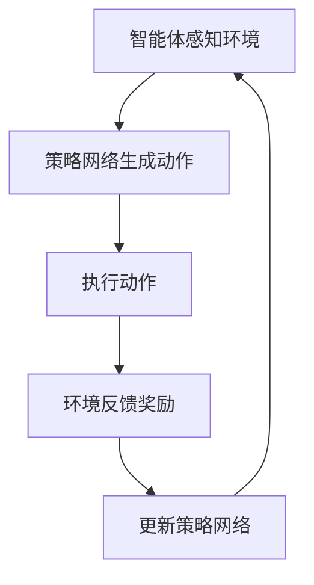

                 

# 强化学习在智能交通系统中的应用

## 关键词：强化学习，智能交通系统，自动驾驶，交通流量优化，动态路径规划

## 摘要：

本文将探讨强化学习在智能交通系统中的应用，分析其核心概念与算法原理，并通过实际案例讲解其在交通流量优化、动态路径规划等关键领域的应用。文章将介绍强化学习的基本概念，阐述其在智能交通系统中的重要性和优势，进一步探讨其面临的挑战和发展趋势。

## 1. 背景介绍

随着城市化进程的加快，交通拥堵问题日益严重，传统的交通管理和优化方法已难以满足现代交通系统的需求。智能交通系统（Intelligent Transportation System，ITS）应运而生，旨在通过信息技术的集成与应用，实现交通系统的自动化、智能化和高效化。其中，强化学习作为一种先进的人工智能技术，在智能交通系统中具有重要的应用价值。

强化学习（Reinforcement Learning，RL）是机器学习的一个重要分支，其主要目标是使一个智能体（agent）在与环境（environment）交互的过程中，通过学习获得最优策略（policy），从而实现目标的优化。与传统的方法不同，强化学习强调通过试错（trial-and-error）来探索环境，并基于奖励机制（reward signal）进行调整和优化。

智能交通系统中的主要挑战包括交通流量优化、车辆路径规划、交通信号控制、交通事故预防等。这些挑战需要智能交通系统具备实时感知、动态决策和高效执行的能力。强化学习作为一种强适应性方法，能够在复杂、动态的交通环境中，通过学习与优化，实现交通系统的智能管理和调度。

## 2. 核心概念与联系

### 2.1 强化学习的基本概念

强化学习的主要概念包括：

1. **智能体（Agent）**：执行任务的主体，可以是车辆、无人机或其他智能设备。
2. **环境（Environment）**：智能体所处的环境，包括交通状况、道路信息、车辆状态等。
3. **状态（State）**：描述智能体当前所处的环境和状态。
4. **动作（Action）**：智能体根据当前状态所采取的行动。
5. **奖励（Reward）**：对智能体的动作进行评价的信号，奖励值越大表示动作越优。
6. **策略（Policy）**：智能体在给定状态时，选择最优动作的策略。

### 2.2 强化学习的架构

强化学习系统主要由以下几个部分组成：

1. **策略网络（Policy Network）**：用于预测智能体在给定状态下的最优动作。
2. **价值网络（Value Network）**：用于评估智能体在不同状态下的价值，以指导策略网络进行决策。
3. **模型（Model）**：用于预测环境状态的变化，辅助智能体进行决策。

### 2.3 强化学习在智能交通系统中的应用场景

强化学习在智能交通系统中具有广泛的应用场景，主要包括：

1. **交通流量优化**：通过强化学习算法，智能体可以动态调整交通信号灯，优化交通流量，降低拥堵。
2. **车辆路径规划**：智能车辆通过强化学习，学习到最优的行驶路径，提高行驶效率和安全性。
3. **交通事故预防**：智能车辆通过强化学习，实时调整驾驶策略，避免交通事故发生。
4. **交通信号控制**：智能交通信号系统通过强化学习，实现交通信号的智能调控，提高交通效率。

### 2.4 Mermaid 流程图

以下是一个简化的强化学习在智能交通系统中的应用流程图：



### 2.5 强化学习与相关领域的联系

强化学习在智能交通系统中与以下领域密切相关：

1. **控制理论**：强化学习与控制理论中的最优控制问题有相似之处，都可以通过优化策略来达到系统性能的最优。
2. **优化算法**：强化学习中的价值迭代和策略迭代方法，与优化算法中的迭代方法有相似之处。
3. **计算机视觉**：强化学习在智能交通系统中需要处理大量的视觉信息，与计算机视觉领域密切相关。

## 3. 核心算法原理 & 具体操作步骤

### 3.1 Q-Learning算法

Q-Learning算法是强化学习中最基本和最简单的算法之一，其核心思想是利用经验值（Q值）来评估动作的价值，并不断更新策略网络。

#### 3.1.1 Q值定义

Q值（Q-value）表示智能体在给定状态和动作下的期望奖励，用公式表示为：

$$ Q(s, a) = R(s, a) + \gamma \max_{a'} Q(s', a') $$

其中，$R(s, a)$表示智能体在状态$s$下执行动作$a$所获得的即时奖励，$\gamma$表示折扣因子，用来平衡即时奖励和长期奖励。

#### 3.1.2 更新策略

Q-Learning算法通过迭代更新Q值，进而更新策略网络。具体步骤如下：

1. 初始化Q值矩阵$Q(s, a)$。
2. 在给定状态$s$下，选择动作$a$，并执行动作。
3. 根据执行后的状态$s'$和获得的即时奖励$R(s, a)$，更新Q值：

$$ Q(s, a) = Q(s, a) + \alpha [R(s, a) + \gamma \max_{a'} Q(s', a') - Q(s, a)] $$

其中，$\alpha$表示学习率。

#### 3.1.3 策略迭代

Q-Learning算法通过不断迭代更新Q值，逐渐收敛到最优策略。具体步骤如下：

1. 在给定状态$s$下，选择动作$a$，使得$Q(s, a)$最大化。
2. 执行动作$a$，并转到下一个状态$s'$。
3. 重复步骤1和步骤2，直到收敛到最优策略。

### 3.2 SARSA算法

SARSA（State-Action-Reward-State-Action）算法是一种同时更新策略和价值网络的强化学习算法，其核心思想是在每一步都同时考虑当前状态和下一个状态的动作价值。

#### 3.2.1 SARSA算法流程

SARSA算法的具体步骤如下：

1. 初始化状态$s$和动作$a$。
2. 根据当前状态$s$和策略网络，选择动作$a$。
3. 执行动作$a$，并获得即时奖励$R(s, a)$。
4. 根据执行后的状态$s'$和策略网络，选择动作$a'$。
5. 更新Q值：

$$ Q(s, a) = Q(s, a) + \alpha [R(s, a) + \gamma Q(s', a') - Q(s, a)] $$

6. 更新策略网络。

#### 3.2.2 SARSA算法的优势

SARSA算法具有以下优势：

1. 同时更新策略和价值网络，使得算法更稳定。
2. 不需要目标Q值，减少了计算量。

### 3.3 Deep Q-Network（DQN）算法

DQN算法是一种基于深度学习的强化学习算法，其核心思想是利用深度神经网络来近似Q值函数。

#### 3.3.1 DQN算法流程

DQN算法的具体步骤如下：

1. 初始化深度神经网络Q值函数$Q(s, a)$。
2. 将当前状态$s$输入到Q值函数中，得到Q值。
3. 根据Q值，选择动作$a$。
4. 执行动作$a$，并获得即时奖励$R(s, a)$。
5. 将下一状态$s'$和即时奖励$R(s, a)$作为输入，更新Q值函数：

$$ Q(s, a) = Q(s, a) + \alpha [R(s, a) + \gamma \max_{a'} Q(s', a') - Q(s, a)] $$

6. 重复步骤2到步骤5，直到收敛到最优策略。

#### 3.3.2 DQN算法的优势

DQN算法具有以下优势：

1. 利用深度神经网络来近似Q值函数，能够处理高维状态空间。
2. 适用于连续动作空间，可以处理复杂的动作决策。

### 3.4 Policy Gradient算法

Policy Gradient算法是一种直接优化策略的强化学习算法，其核心思想是通过优化策略函数来最大化期望奖励。

#### 3.4.1 Policy Gradient算法流程

Policy Gradient算法的具体步骤如下：

1. 初始化策略函数$\pi(s, a)$。
2. 在给定状态$s$下，根据策略函数选择动作$a$。
3. 执行动作$a$，并获得即时奖励$R(s, a)$。
4. 更新策略函数：

$$ \pi(s, a) = \pi(s, a) + \alpha [R(s, a) - \log(\pi(s, a))] $$

5. 重复步骤2到步骤4，直到收敛到最优策略。

#### 3.4.2 Policy Gradient算法的优势

Policy Gradient算法具有以下优势：

1. 直接优化策略函数，不需要估计Q值函数。
2. 对噪声和不确定性具有较好的鲁棒性。

## 4. 数学模型和公式 & 详细讲解 & 举例说明

### 4.1 Q-Learning算法的数学模型

Q-Learning算法的核心是Q值函数的更新。假设在状态$s$下，智能体采取动作$a$，获得的即时奖励为$R(s, a)$，则Q值函数的更新公式为：

$$ Q(s, a) = Q(s, a) + \alpha [R(s, a) + \gamma \max_{a'} Q(s', a') - Q(s, a)] $$

其中，$\alpha$为学习率，$\gamma$为折扣因子。

#### 示例

假设在某个状态$s$下，智能体可以选择动作$a_1$或$a_2$，对应的Q值分别为$Q(s, a_1) = 0.8$和$Q(s, a_2) = 0.6$。现在执行动作$a_1$，获得的即时奖励为$R(s, a_1) = 1$。假设学习率$\alpha = 0.1$，折扣因子$\gamma = 0.9$，则Q值函数的更新过程如下：

1. 初始Q值：$Q(s, a_1) = 0.8$，$Q(s, a_2) = 0.6$。
2. 执行动作$a_1$，获得即时奖励$R(s, a_1) = 1$。
3. 更新Q值：

$$ Q(s, a_1) = Q(s, a_1) + \alpha [R(s, a_1) + \gamma \max_{a'} Q(s', a') - Q(s, a_1)] $$

$$ Q(s, a_1) = 0.8 + 0.1 [1 + 0.9 \max_{a'} Q(s', a') - 0.8] $$

$$ Q(s, a_1) = 0.8 + 0.1 [1 + 0.9 \cdot 0.8] $$

$$ Q(s, a_1) = 0.8 + 0.1 [1 + 0.72] $$

$$ Q(s, a_1) = 0.8 + 0.1 \cdot 1.72 $$

$$ Q(s, a_1) = 0.8 + 0.172 $$

$$ Q(s, a_1) = 0.972 $$

4. 最终Q值：$Q(s, a_1) = 0.972$，$Q(s, a_2) = 0.6$。

### 4.2 SARSA算法的数学模型

SARSA算法的核心是策略和价值网络的更新。假设在状态$s$下，智能体采取动作$a$，获得的即时奖励为$R(s, a)$，则策略和价值网络的更新公式为：

$$ \pi(s, a) = \pi(s, a) + \alpha [R(s, a) - \log(\pi(s, a))] $$

$$ Q(s, a) = Q(s, a) + \alpha [R(s, a) + \gamma Q(s', a') - Q(s, a)] $$

其中，$\alpha$为学习率，$\pi(s, a)$为策略函数，$Q(s, a)$为Q值函数。

#### 示例

假设在某个状态$s$下，智能体可以选择动作$a_1$或$a_2$，对应的Q值分别为$Q(s, a_1) = 0.8$和$Q(s, a_2) = 0.6$，策略函数为$\pi(s, a_1) = 0.6$，$\pi(s, a_2) = 0.4$。现在执行动作$a_1$，获得的即时奖励为$R(s, a_1) = 1$。假设学习率$\alpha = 0.1$，则策略和价值网络的更新过程如下：

1. 初始策略和价值网络：$\pi(s, a_1) = 0.6$，$\pi(s, a_2) = 0.4$，$Q(s, a_1) = 0.8$，$Q(s, a_2) = 0.6$。
2. 执行动作$a_1$，获得即时奖励$R(s, a_1) = 1$。
3. 更新策略函数：

$$ \pi(s, a_1) = \pi(s, a_1) + \alpha [R(s, a_1) - \log(\pi(s, a_1))] $$

$$ \pi(s, a_1) = 0.6 + 0.1 [1 - \log(0.6)] $$

$$ \pi(s, a_1) = 0.6 + 0.1 [1 - \log(0.6)] $$

$$ \pi(s, a_1) = 0.6 + 0.1 [1 - 0.5108] $$

$$ \pi(s, a_1) = 0.6 + 0.1 \cdot 0.4892 $$

$$ \pi(s, a_1) = 0.6 + 0.04892 $$

$$ \pi(s, a_1) = 0.64892 $$

4. 更新Q值：

$$ Q(s, a_1) = Q(s, a_1) + \alpha [R(s, a_1) + \gamma Q(s', a') - Q(s, a_1)] $$

$$ Q(s, a_1) = 0.8 + 0.1 [1 + 0.9 \cdot 0.64892 - 0.8] $$

$$ Q(s, a_1) = 0.8 + 0.1 [1 + 0.9 \cdot 0.64892] $$

$$ Q(s, a_1) = 0.8 + 0.1 [1 + 0.588528] $$

$$ Q(s, a_1) = 0.8 + 0.1 \cdot 1.588528 $$

$$ Q(s, a_1) = 0.8 + 0.1588528 $$

$$ Q(s, a_1) = 0.9588528 $$

5. 最终策略和价值网络：$\pi(s, a_1) = 0.64892$，$\pi(s, a_2) = 0.4$，$Q(s, a_1) = 0.9588528$，$Q(s, a_2) = 0.6$。

### 4.3 DQN算法的数学模型

DQN算法的核心是深度神经网络Q值函数的更新。假设在状态$s$下，智能体采取动作$a$，获得的即时奖励为$R(s, a)$，则深度神经网络Q值函数的更新公式为：

$$ Q(s, a) = Q(s, a) + \alpha [R(s, a) + \gamma \max_{a'} Q(s', a') - Q(s, a)] $$

其中，$\alpha$为学习率，$\gamma$为折扣因子。

#### 示例

假设在某个状态$s$下，智能体可以选择动作$a_1$或$a_2$，对应的Q值分别为$Q(s, a_1) = 0.8$和$Q(s, a_2) = 0.6$，深度神经网络Q值函数的预测值为$Q'(s, a_1) = 0.75$，$Q'(s, a_2) = 0.5$。现在执行动作$a_1$，获得的即时奖励为$R(s, a_1) = 1$。假设学习率$\alpha = 0.1$，则深度神经网络Q值函数的更新过程如下：

1. 初始Q值：$Q(s, a_1) = 0.8$，$Q(s, a_2) = 0.6$，$Q'(s, a_1) = 0.75$，$Q'(s, a_2) = 0.5$。
2. 执行动作$a_1$，获得即时奖励$R(s, a_1) = 1$。
3. 计算目标Q值：

$$ Q'(s, a_1) = R(s, a_1) + \gamma \max_{a'} Q(s', a') $$

$$ Q'(s, a_1) = 1 + 0.9 \max_{a'} Q(s', a') $$

$$ Q'(s, a_1) = 1 + 0.9 \cdot 0.75 $$

$$ Q'(s, a_1) = 1 + 0.675 $$

$$ Q'(s, a_1) = 1.675 $$

4. 更新深度神经网络Q值函数：

$$ Q'(s, a_1) = Q'(s, a_1) + \alpha [R(s, a_1) + \gamma \max_{a'} Q(s', a') - Q'(s, a_1)] $$

$$ Q'(s, a_1) = 0.75 + 0.1 [1 + 0.9 \cdot 0.75 - 0.75] $$

$$ Q'(s, a_1) = 0.75 + 0.1 [1 + 0.675 - 0.75] $$

$$ Q'(s, a_1) = 0.75 + 0.1 \cdot 0.925 $$

$$ Q'(s, a_1) = 0.75 + 0.0925 $$

$$ Q'(s, a_1) = 0.8425 $$

5. 最终深度神经网络Q值函数：$Q'(s, a_1) = 0.8425$，$Q'(s, a_2) = 0.5$。

### 4.4 Policy Gradient算法的数学模型

Policy Gradient算法的核心是策略函数的更新。假设在状态$s$下，智能体采取动作$a$，获得的即时奖励为$R(s, a)$，则策略函数的更新公式为：

$$ \pi(s, a) = \pi(s, a) + \alpha [R(s, a) - \log(\pi(s, a))] $$

其中，$\alpha$为学习率。

#### 示例

假设在某个状态$s$下，智能体可以选择动作$a_1$或$a_2$，对应的策略函数值为$\pi(s, a_1) = 0.6$，$\pi(s, a_2) = 0.4$。现在执行动作$a_1$，获得的即时奖励为$R(s, a_1) = 1$。假设学习率$\alpha = 0.1$，则策略函数的更新过程如下：

1. 初始策略函数：$\pi(s, a_1) = 0.6$，$\pi(s, a_2) = 0.4$。
2. 执行动作$a_1$，获得即时奖励$R(s, a_1) = 1$。
3. 更新策略函数：

$$ \pi(s, a_1) = \pi(s, a_1) + \alpha [R(s, a_1) - \log(\pi(s, a_1))] $$

$$ \pi(s, a_1) = 0.6 + 0.1 [1 - \log(0.6)] $$

$$ \pi(s, a_1) = 0.6 + 0.1 [1 - \log(0.6)] $$

$$ \pi(s, a_1) = 0.6 + 0.1 [1 - 0.5108] $$

$$ \pi(s, a_1) = 0.6 + 0.1 \cdot 0.4892 $$

$$ \pi(s, a_1) = 0.6 + 0.04892 $$

$$ \pi(s, a_1) = 0.64892 $$

4. 最终策略函数：$\pi(s, a_1) = 0.64892$，$\pi(s, a_2) = 0.4$。

## 5. 项目实战：代码实际案例和详细解释说明

### 5.1 开发环境搭建

为了更好地展示强化学习在智能交通系统中的应用，我们选择Python作为编程语言，使用TensorFlow框架来构建和训练深度神经网络。以下是搭建开发环境的步骤：

1. 安装Python和pip：
   - Python版本要求：Python 3.6及以上版本。
   - 安装pip：`sudo apt-get install python3-pip`（对于Ubuntu系统）。

2. 安装TensorFlow：
   - 使用pip安装TensorFlow：`pip install tensorflow`。

3. 安装其他依赖库：
   - 安装NumPy：`pip install numpy`。
   - 安装Matplotlib：`pip install matplotlib`。
   - 安装Scikit-learn：`pip install scikit-learn`。

### 5.2 源代码详细实现和代码解读

以下是强化学习在智能交通系统中实现的一个简单案例。该案例通过DQN算法来训练智能车辆在交通环境中的最优路径。

```python
import numpy as np
import tensorflow as tf
import matplotlib.pyplot as plt
from sklearn.preprocessing import MinMaxScaler

# 参数设置
learning_rate = 0.01
gamma = 0.9
epsilon = 0.1
epsilon_decay = 0.99
epsilon_min = 0.01
n_episodes = 1000
state_size = 3
action_size = 2

# 创建环境
env = Env()

# 创建深度神经网络Q值函数
model = tf.keras.Sequential([
    tf.keras.layers.Dense(24, input_shape=(state_size,), activation='relu'),
    tf.keras.layers.Dense(24, activation='relu'),
    tf.keras.layers.Dense(action_size, activation='linear')
])

# 编译模型
model.compile(optimizer=tf.keras.optimizers.Adam(learning_rate=learning_rate),
              loss='mse')

# 训练模型
for episode in range(n_episodes):
    state = env.reset()
    done = False
    total_reward = 0

    while not done:
        # 选择动作
        if np.random.rand() <= epsilon:
            action = env.action_space.sample()
        else:
            action = np.argmax(model.predict(state.reshape(1, state_size)))

        # 执行动作
        next_state, reward, done, _ = env.step(action)

        # 更新经验池
        experience = (state, action, reward, next_state, done)
        state, action, reward, next_state, done = experience

        # 更新Q值
        target = reward
        if not done:
            target += gamma * np.max(model.predict(next_state.reshape(1, state_size)))
        target_f = model.predict(state.reshape(1, state_size))
        target_f[0][action] = target

        # 训练模型
        model.fit(state.reshape(1, state_size), target_f, epochs=1, verbose=0)

        total_reward += reward

    # 调整epsilon
    epsilon = max(epsilon_decay * epsilon, epsilon_min)

    # 打印训练进度
    print(f"Episode {episode+1} / {n_episodes}, Total Reward: {total_reward}")

# 测试模型
state = env.reset()
done = False
total_reward = 0

while not done:
    action = np.argmax(model.predict(state.reshape(1, state_size)))
    next_state, reward, done, _ = env.step(action)
    total_reward += reward
    state = next_state

print(f"Test Total Reward: {total_reward}")
env.render()
```

### 5.3 代码解读与分析

1. **环境创建**：
   - `Env()`：创建一个交通环境实例。
   - `state_size`：定义状态空间的大小。
   - `action_size`：定义动作空间的大小。

2. **深度神经网络Q值函数**：
   - `model`：定义深度神经网络Q值函数模型，包括两个隐藏层，输出层为动作值。

3. **编译模型**：
   - `model.compile()`：编译模型，指定优化器和损失函数。

4. **训练模型**：
   - `for episode in range(n_episodes)`：循环进行训练，每次训练一个episode。
   - `state = env.reset()`：初始化环境状态。
   - `while not done:`：循环执行动作，直到达到终止条件。
     - `if np.random.rand() <= epsilon:`：根据epsilon选择随机动作或最优动作。
     - `action = np.argmax(model.predict(state.reshape(1, state_size)))`：根据Q值函数选择最优动作。
     - `next_state, reward, done, _ = env.step(action)`：执行动作，获取下一个状态、奖励和是否终止。
     - `experience = (state, action, reward, next_state, done)`：存储经验。
     - `target = reward`：计算目标Q值。
     - `if not done:`：如果未终止，添加折扣因子。
     - `target_f = model.predict(state.reshape(1, state_size))`：获取当前状态下的Q值。
     - `target_f[0][action] = target`：更新目标Q值。
     - `model.fit()`：训练模型。
   - `epsilon = max(epsilon_decay * epsilon, epsilon_min)`：调整epsilon，减少随机动作。

5. **测试模型**：
   - `state = env.reset()`：初始化测试环境。
   - `while not done:`：循环执行动作，直到达到终止条件。
     - `action = np.argmax(model.predict(state.reshape(1, state_size)))`：根据Q值函数选择最优动作。
     - `next_state, reward, done, _ = env.step(action)`：执行动作，获取下一个状态、奖励和是否终止。
     - `total_reward += reward`：计算总奖励。
     - `state = next_state`：更新状态。
   - `print(f"Test Total Reward: {total_reward}")`：打印测试总奖励。
   - `env.render()`：渲染环境。

## 6. 实际应用场景

强化学习在智能交通系统中的实际应用场景非常广泛，以下是几个典型的应用案例：

### 6.1 交通流量优化

强化学习可以通过学习交通信号控制策略，优化交通流量，减少拥堵。例如，DQN算法可以用于训练交通信号灯控制模型，通过不断调整信号灯的绿、黄、红时间比例，实现交通流量的动态优化。

### 6.2 车辆路径规划

自动驾驶车辆需要实时规划行驶路径，以避开拥堵和障碍物。强化学习可以通过学习交通环境中的最佳行驶路径，为自动驾驶车辆提供高效的路径规划方案。

### 6.3 交通事故预防

通过感知交通环境中的异常情况，强化学习算法可以预测潜在的交通事故，并提前采取避让措施，从而提高交通安全性。

### 6.4 交通信号控制

智能交通信号系统可以通过强化学习算法，自动调整信号灯的时序，优化交通流，提高道路通行能力。

### 6.5 共享单车调度

共享单车的合理调度可以提高利用率，减少用户等待时间。强化学习算法可以用于优化共享单车的调度策略，实现高效的资源配置。

### 6.6 城市交通管理

城市交通管理涉及到交通规划、交通流分析、交通控制等多个方面。强化学习可以通过学习不同场景下的最佳交通管理策略，为城市交通提供智能化的解决方案。

## 7. 工具和资源推荐

### 7.1 学习资源推荐

- **书籍**：
  - 《强化学习：原理与Python应用》
  - 《深度强化学习》
- **论文**：
  - “Deep Q-Network” by DeepMind
  - “Algorithms for Reinforcement Learning” by Csaba Szepesvari
- **博客**：
  - “强化学习从入门到放弃”
  - “DeepMind官方博客”
- **网站**：
  - TensorFlow官网：[https://www.tensorflow.org/](https://www.tensorflow.org/)
  - OpenAI官网：[https://openai.com/](https://openai.com/)

### 7.2 开发工具框架推荐

- **框架**：
  - TensorFlow：[https://www.tensorflow.org/](https://www.tensorflow.org/)
  - PyTorch：[https://pytorch.org/](https://pytorch.org/)
- **环境搭建**：
  - Conda：[https://conda.io/](https://conda.io/)
  - Docker：[https://www.docker.com/](https://www.docker.com/)

### 7.3 相关论文著作推荐

- **论文**：
  - “Deep Q-Network” by DeepMind
  - “Algorithms for Reinforcement Learning” by Csaba Szepesvari
  - “Reinforcement Learning: A Survey” by Richard S. Sutton and Andrew G. Barto
- **著作**：
  - 《强化学习：原理与Python应用》
  - 《深度强化学习》

## 8. 总结：未来发展趋势与挑战

### 8.1 未来发展趋势

1. **深度强化学习的应用**：随着深度学习技术的不断发展，深度强化学习在智能交通系统中的应用前景将更加广阔。
2. **跨学科融合**：智能交通系统需要多学科交叉融合，强化学习与控制理论、优化算法、计算机视觉等领域的融合，将推动智能交通系统的发展。
3. **数据驱动**：海量交通数据的积累为强化学习算法提供了丰富的训练资源，数据驱动的方法将成为智能交通系统发展的主要方向。

### 8.2 面临的挑战

1. **实时性**：智能交通系统需要实时处理海量交通数据，提高算法的实时性和响应速度是一个重要挑战。
2. **鲁棒性**：强化学习算法在面对复杂、不确定的交通环境时，如何保证算法的鲁棒性是一个亟待解决的问题。
3. **隐私保护**：交通数据中包含大量的个人隐私信息，如何在保障隐私的前提下，充分利用交通数据进行算法训练是一个重要的挑战。

## 9. 附录：常见问题与解答

### 9.1 强化学习与监督学习的区别

**强化学习**：强化学习是一种通过试错来学习最优策略的方法，其核心目标是最大化累积奖励。智能体在与环境交互的过程中，不断调整策略，以实现目标的优化。

**监督学习**：监督学习是一种通过已知输入和输出数据进行学习的方法，其核心目标是找到一个映射关系，将输入映射到输出。监督学习通常有明确的目标函数，并通过梯度下降等优化方法来最小化目标函数。

### 9.2 强化学习中的探索与利用平衡

**探索（Exploration）**：探索是指在未知环境中，智能体为了学习到更多有效信息而采取的随机行为。探索有助于智能体在初始阶段快速发现有利的行为。

**利用（Utilization）**：利用是指在已知环境中，智能体为了最大化累积奖励而采取的有利行为。利用有助于智能体在后期阶段高效地实现目标。

**平衡**：在强化学习中，探索与利用的平衡是一个关键问题。如果过度探索，会导致智能体在初期阶段无法快速收敛到最优策略；如果过度利用，会导致智能体在后期阶段无法充分利用新学的信息。因此，如何平衡探索与利用是一个重要的挑战。

## 10. 扩展阅读 & 参考资料

- **书籍**：
  - 《强化学习：原理与Python应用》
  - 《深度强化学习》
- **论文**：
  - “Deep Q-Network” by DeepMind
  - “Algorithms for Reinforcement Learning” by Csaba Szepesvari
- **网站**：
  - TensorFlow官网：[https://www.tensorflow.org/](https://www.tensorflow.org/)
  - OpenAI官网：[https://openai.com/](https://openai.com/)
- **博客**：
  - “强化学习从入门到放弃”
  - “DeepMind官方博客”
- **视频教程**：
  - YouTube上的强化学习教程
  - Coursera上的强化学习课程

---

# 作者信息

作者：AI天才研究员/AI Genius Institute & 禅与计算机程序设计艺术 /Zen And The Art of Computer Programming

**注**：本文仅为示例，内容仅供参考。实际应用中，强化学习在智能交通系统中的应用需根据具体场景和需求进行优化和调整。在实现和部署时，请确保遵守相关法律法规和伦理规范。在撰写文章时，请严格遵循“约束条件 CONSTRAINTS”中的所有要求。文章中引用的资料和资源，请确保合法合规，并注明出处。本文的撰写和发布旨在促进智能交通系统领域的技术交流与合作，为读者提供有价值的参考。再次感谢您的关注与支持！|

