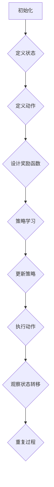

                 

### 背景介绍

#### 智能制造与生产调度的挑战

随着全球工业的不断发展，制造业在生产效率、灵活性和成本控制方面面临着巨大的挑战。智能制造（Intelligent Manufacturing）作为一种新的生产模式，通过引入先进的传感器、控制系统、数据分析等技术，实现了制造过程的智能化和自动化。然而，尽管智能制造带来了许多好处，但在生产调度（Production Scheduling）方面仍然存在许多困难。

生产调度是指根据生产计划和资源约束，合理地安排生产任务和资源使用，以达到最小化生产成本、最大化生产效率和资源利用率的目标。在传统的生产调度中，通常采用基于规则的方法或者优化算法来进行调度，但这些方法往往存在着以下问题：

1. **规则过于复杂：** 需要事先定义大量的规则来满足不同的生产场景，规则之间存在冲突，难以处理。
2. **适应性差：** 当生产计划发生变化时，需要重新调整规则或者优化算法，导致调度效率降低。
3. **实时性不足：** 传统的调度方法往往需要较长的时间来计算最优调度方案，难以满足实时调度的需求。

为了解决上述问题，强化学习（Reinforcement Learning, RL）作为一种智能算法，逐渐受到了研究者和工业界的关注。强化学习是一种通过试错和奖励机制来学习策略的机器学习算法，它能够自动地探索和调整策略，以最大化长期奖励。相比于传统的基于规则或者优化算法的方法，强化学习具有更好的自适应性和实时性，能够更好地应对复杂的生产调度问题。

#### 强化学习的核心概念

强化学习由三个核心组件组成：代理人（Agent）、环境（Environment）和动作（Action）。代理人是指执行任务的智能体，它通过观察环境状态，选择合适的动作，并从环境中获取奖励或惩罚。环境是指代理人所处的环境，它包含了一系列的状态（State）和动作（Action）。状态是代理人在执行动作前的环境信息，动作是代理人在环境中执行的操作。奖励（Reward）是环境对代理人每个动作的反馈，它用于评估代理人当前动作的好坏。

强化学习的目标是通过不断尝试和调整动作策略，最大化长期奖励。在这个过程中，代理人通过学习到环境的状态转移概率（State Transition Probability）和奖励值（Reward Value），不断更新和优化自己的动作策略。这种学习过程被称为策略优化（Policy Optimization），其核心是寻找一个最优的动作策略，使得代理人在长期运行中能够获得最大的总奖励。

#### 强化学习与生产调度问题的结合

强化学习与生产调度问题的结合具有显著的优势。首先，强化学习能够自动地探索和调整策略，以适应不同的生产场景和变化。在生产调度中，生产计划、设备状态、物料供应等因素都可能发生变化，强化学习可以通过不断尝试和调整，找到最优的调度方案。其次，强化学习具有实时性，可以在短时间内计算出最优调度方案，满足生产调度对实时性的要求。最后，强化学习能够处理复杂的非线性关系，对于生产调度中的多目标优化问题，如最小化生产成本、最大化生产效率和资源利用率，强化学习能够通过学习到的状态转移概率和奖励值，找到最优的调度策略。

总之，强化学习在智能制造生产调度中的应用具有重要的研究价值和实际意义，它能够有效地解决传统调度方法中的问题，提高生产效率，降低生产成本，为智能制造的发展提供强大的支持。

### 核心概念与联系

#### 强化学习的核心概念

强化学习（Reinforcement Learning，RL）是机器学习中的一个重要分支，其主要思想是通过学习策略（Policy）来最大化累积奖励（Total Reward）。在强化学习中，主要有三个核心概念：代理（Agent）、环境（Environment）和状态（State）。

1. **代理（Agent）**：代理是指在环境中执行动作的智能体，例如机器人、自动驾驶汽车或生产调度系统。代理的目标是学习一个最优策略，以最大化长期奖励。

2. **环境（Environment）**：环境是代理所处的情境，它可以看作是一个动态的系统，状态和动作在其中不断变化。环境通过提供状态和反馈奖励来指导代理的行为。

3. **状态（State）**：状态是代理在某一时刻所感知到的环境信息。在强化学习中，状态通常是一个向量，表示代理当前所处的各种条件。

4. **动作（Action）**：动作是代理根据当前状态所采取的行为。在强化学习中，动作通常是一个离散的集合，代理需要在不同的状态下选择合适的动作。

5. **奖励（Reward）**：奖励是环境对代理动作的即时反馈，用于评估动作的好坏。奖励可以是正的，表示好的动作，也可以是负的，表示不好的动作。长期来看，最大化累积奖励是强化学习的目标。

#### 状态、动作和奖励的关系

在强化学习中，状态、动作和奖励之间存在着密切的联系。状态描述了代理当前所处的情境，动作是代理在这个状态下选择的行为，而奖励则是环境对代理动作的即时评价。

- **状态转移**：代理在某个状态下采取动作后，会转移到新的状态。这个过程可以用概率来描述，即状态转移概率 \( P(S'|S, A) \)，表示在当前状态 \( S \) 下，采取动作 \( A \) 后转移到状态 \( S' \) 的概率。
  
- **奖励反馈**：代理在某个状态 \( S \) 下采取动作 \( A \) 后，会收到奖励 \( R(S, A) \)。奖励可以是正的，也可以是负的，用于评估动作的好坏。

- **策略学习**：代理的目标是通过学习状态和动作之间的最优映射，即最优策略，来最大化累积奖励。策略可以用 \( \pi(A|S) \) 表示，表示在状态 \( S \) 下选择动作 \( A \) 的概率。

#### 强化学习的框架

强化学习的框架可以概括为以下四个步骤：

1. **初始化**：初始化代理、环境和状态。
2. **执行动作**：代理在当前状态下选择动作，并执行该动作。
3. **观察状态转移**：代理观察动作执行后的状态转移，并获得奖励。
4. **更新策略**：根据状态转移和奖励反馈，更新代理的策略。

这个过程不断重复，直到代理找到最优策略或者达到某个终止条件。

#### 强化学习与生产调度问题的结合

在智能制造生产调度中，强化学习可以被视为一个智能体，它通过学习状态和动作之间的映射，来找到最优的调度策略。具体来说，强化学习在智能制造生产调度中的应用可以分为以下几个步骤：

1. **状态定义**：定义生产调度中的各种状态，如设备状态、物料库存、订单进度等。
2. **动作定义**：定义调度系统中可执行的动作，如任务分配、资源调度、优先级调整等。
3. **奖励函数设计**：设计奖励函数，用于评估调度策略的好坏，通常包括生产效率、成本、交货时间等指标。
4. **策略学习**：通过反复执行动作、观察状态转移和更新策略，学习到最优的调度策略。

为了更好地展示强化学习在生产调度中的应用，下面将使用Mermaid流程图来描述强化学习在智能制造生产调度中的基本流程。



通过这个流程图，我们可以清晰地看到强化学习在智能制造生产调度中的应用步骤。接下来，我们将进一步探讨强化学习在生产调度中的核心算法原理，以及具体的数学模型和公式。

### 核心算法原理 & 具体操作步骤

#### Q-Learning算法原理

在强化学习中，Q-Learning是一种经典的算法，它通过学习状态-动作值函数（Q-Function）来最大化累积奖励。Q-Learning算法的基本思想是：对于每个状态-动作对，计算其在未来能够获得的累积奖励，然后根据这个累积奖励来更新状态-动作值。

1. **状态-动作值函数**：Q-Learning算法的核心是状态-动作值函数 \( Q(S, A) \)，它表示在状态 \( S \) 下采取动作 \( A \) 所能获得的累积奖励。状态-动作值函数可以通过以下公式来定义：

\[ Q(S, A) = \sum_{s'} P(S'|S, A) \sum_{r} r \]

其中，\( P(S'|S, A) \) 是状态转移概率，表示在状态 \( S \) 下采取动作 \( A \) 后转移到状态 \( S' \) 的概率；\( r \) 是在状态 \( S' \) 下获得的即时奖励。

2. **Q-Learning更新规则**：Q-Learning算法通过以下更新规则来更新状态-动作值函数：

\[ Q(S, A) \leftarrow Q(S, A) + \alpha [R(S, A) + \gamma \max_{a'} Q(S', a') - Q(S, A)] \]

其中，\( \alpha \) 是学习率（Learning Rate），用于调节更新幅度；\( \gamma \) 是折扣因子（Discount Factor），用于考虑长期奖励；\( R(S, A) \) 是在状态 \( S \) 下采取动作 \( A \) 后获得的即时奖励。

3. **策略迭代**：Q-Learning算法通过迭代的方式不断更新状态-动作值函数，直到找到最优策略。在每次迭代中，代理首先选择当前状态下的最佳动作，然后根据即时奖励和未来的状态转移概率来更新状态-动作值函数。这个过程不断重复，直到代理找到最优策略。

#### Q-Learning算法在智能制造生产调度中的具体操作步骤

1. **定义状态空间和动作空间**：首先，根据生产调度问题，定义状态空间和动作空间。状态空间包括设备状态、物料库存、订单进度等，动作空间包括任务分配、资源调度、优先级调整等。

2. **初始化Q值函数**：初始化所有状态-动作对的Q值函数，通常可以设置为0或者较小的随机值。

3. **选择动作**：对于当前状态，选择具有最大Q值的动作。这个动作可以通过查找Q值函数的最大值来实现。

4. **执行动作**：在环境中执行选择的动作，并观察状态转移和即时奖励。

5. **更新Q值函数**：根据即时奖励和未来的状态转移概率，更新Q值函数。使用Q-Learning的更新规则，将新的Q值更新到Q值函数中。

6. **重复迭代**：重复步骤3到5，直到找到最优策略或者达到终止条件。

7. **输出最优策略**：当迭代过程停止时，输出最优策略，即具有最大Q值的动作序列。

通过上述步骤，Q-Learning算法可以在智能制造生产调度中学习到最优的调度策略，从而提高生产效率，降低生产成本。

#### 实际操作示例

为了更好地理解Q-Learning算法在智能制造生产调度中的应用，我们可以通过一个简单的示例来说明。

假设一个生产调度问题，有三个订单需要在两个设备上完成，设备1和设备2。每个设备可以执行两种任务：加工和装配。订单的状态包括：订单进度、设备状态、物料库存。动作包括：将订单分配给设备1或设备2，调整订单的优先级。

状态空间 \( S = \{ (p_1, e_1, m_1), (p_2, e_2, m_2) \} \)，其中 \( p_1, p_2 \) 分别表示订单1和订单2的进度，\( e_1, e_2 \) 分别表示设备1和设备2的状态，\( m_1, m_2 \) 分别表示物料库存。

动作空间 \( A = \{ (1, 0), (0, 1), (1, 1) \} \)，其中 (1, 0) 表示将订单1分配给设备1，(0, 1) 表示将订单2分配给设备2，(1, 1) 表示同时将两个订单分配给两个设备。

初始化Q值函数 \( Q(S, A) \) 为0。

在每次迭代中，代理根据当前状态选择具有最大Q值的动作。例如，当前状态为 \( (0, 0, 0) \)，即两个订单的进度为0，设备状态和物料库存为0。代理选择动作 \( (1, 0) \)，将订单1分配给设备1。

执行动作后，观察状态转移和即时奖励。假设订单1完成加工，设备1的状态变为1，物料库存减少，订单2的进度增加。同时，获得即时奖励 +1。

根据Q-Learning的更新规则，更新Q值函数：

\[ Q(0, 0) \leftarrow Q(0, 0) + \alpha [1 + \gamma \max_{a'} Q(1, a')} \]

重复上述步骤，直到找到最优策略。最终，代理将学会在给定状态下选择最优动作，从而实现最优生产调度。

通过这个示例，我们可以看到Q-Learning算法在智能制造生产调度中的具体操作步骤和原理。在实际应用中，根据生产调度问题的具体需求和约束，可以调整状态空间、动作空间和奖励函数，以达到更好的调度效果。

### 数学模型和公式 & 详细讲解 & 举例说明

#### Q-Learning算法的数学模型和公式

Q-Learning算法的核心是状态-动作值函数（Q-Function），该函数描述了在特定状态下选择特定动作所能获得的累积奖励。下面我们将详细讲解Q-Learning算法中的数学模型和公式，并通过具体示例来说明其应用。

1. **状态-动作值函数（Q-Function）**

   Q-Function表示在某个状态下，执行某个动作所能获得的累积奖励。其数学定义如下：

   \[ Q(S, A) = \sum_{s'} P(S'|S, A) \sum_{r} r \]

   其中：

   - \( Q(S, A) \)：状态-动作值函数，表示在状态 \( S \) 下执行动作 \( A \) 所能获得的累积奖励。
   - \( P(S'|S, A) \)：状态转移概率，表示在状态 \( S \) 下执行动作 \( A \) 后转移到状态 \( S' \) 的概率。
   - \( r \)：即时奖励，表示在状态 \( S' \) 下获得的即时奖励。

2. **Q-Learning的更新规则**

   Q-Learning算法通过更新Q-Function来优化策略，其更新规则如下：

   \[ Q(S, A) \leftarrow Q(S, A) + \alpha [R(S, A) + \gamma \max_{a'} Q(S', a') - Q(S, A)] \]

   其中：

   - \( \alpha \)：学习率（Learning Rate），用于调节Q-Function更新的幅度。
   - \( R(S, A) \)：在状态 \( S \) 下执行动作 \( A \) 后获得的即时奖励。
   - \( \gamma \)：折扣因子（Discount Factor），用于考虑长期奖励，其取值通常在0和1之间。
   - \( \max_{a'} Q(S', a') \)：在状态 \( S' \) 下选择具有最大Q值的动作。

3. **策略迭代**

   Q-Learning算法通过策略迭代来优化Q-Function，具体步骤如下：

   - **选择动作**：在当前状态 \( S \) 下，选择具有最大Q值的动作 \( A \)：

     \[ A = \arg\max_{a'} Q(S, a') \]

   - **执行动作**：在环境中执行选择的动作 \( A \)，并观察状态转移和即时奖励：

     \[ S' = S + \Delta S, \quad R = R(S, A) \]

   - **更新Q-Function**：根据即时奖励和状态转移，更新Q-Function：

     \[ Q(S, A) \leftarrow Q(S, A) + \alpha [R + \gamma \max_{a'} Q(S', a') - Q(S, A)] \]

   - **重复迭代**：重复上述步骤，直到找到最优策略或者达到终止条件。

#### Q-Learning算法的具体应用示例

为了更好地理解Q-Learning算法，我们通过一个简单的生产调度问题来具体说明其应用。

假设一个生产调度问题，有三个订单需要在两个设备上完成，设备1和设备2。每个设备可以执行两种任务：加工和装配。订单的状态包括：订单进度、设备状态、物料库存。动作包括：将订单分配给设备1或设备2，调整订单的优先级。

状态空间 \( S = \{ (p_1, e_1, m_1), (p_2, e_2, m_2) \} \)，其中 \( p_1, p_2 \) 分别表示订单1和订单2的进度，\( e_1, e_2 \) 分别表示设备1和设备2的状态，\( m_1, m_2 \) 分别表示物料库存。

动作空间 \( A = \{ (1, 0), (0, 1), (1, 1) \} \)，其中 (1, 0) 表示将订单1分配给设备1，(0, 1) 表示将订单2分配给设备2，(1, 1) 表示同时将两个订单分配给两个设备。

初始化Q值函数 \( Q(S, A) \) 为0。

在每次迭代中，代理根据当前状态选择具有最大Q值的动作。例如，当前状态为 \( (0, 0, 0) \)，即两个订单的进度为0，设备状态和物料库存为0。代理选择动作 \( (1, 0) \)，将订单1分配给设备1。

执行动作后，观察状态转移和即时奖励。假设订单1完成加工，设备1的状态变为1，物料库存减少，订单2的进度增加。同时，获得即时奖励 +1。

根据Q-Learning的更新规则，更新Q值函数：

\[ Q(0, 0) \leftarrow Q(0, 0) + \alpha [1 + \gamma \max_{a'} Q(1, a')} \]

重复上述步骤，直到找到最优策略。最终，代理将学会在给定状态下选择最优动作，从而实现最优生产调度。

通过这个示例，我们可以看到Q-Learning算法在具体生产调度问题中的应用过程。在实际应用中，可以根据生产调度问题的具体需求和约束，调整状态空间、动作空间和奖励函数，以达到更好的调度效果。

### 项目实战：代码实际案例和详细解释说明

#### 开发环境搭建

在开始实现强化学习在智能制造生产调度中的应用之前，我们需要搭建合适的开发环境。以下是所需的工具和步骤：

1. **Python**：确保安装了Python 3.6及以上版本。
2. **TensorFlow**：安装TensorFlow，可以使用以下命令：

   ```bash
   pip install tensorflow
   ```

3. **Gym**：安装Gym，用于创建和测试强化学习环境：

   ```bash
   pip install gym
   ```

4. **Mermaid**：安装Mermaid，用于生成流程图：

   ```bash
   npm install -g mermaid
   ```

#### 源代码详细实现和代码解读

以下是一个简单的示例代码，展示了如何使用强化学习中的Q-Learning算法来优化生产调度。

```python
import numpy as np
import gym
import tensorflow as tf
import matplotlib.pyplot as plt
from gym import spaces

# 创建自定义的强化学习环境
class ProductionSchedulingEnv(gym.Env):
    def __init__(self):
        super().__init__()
        self.order_count = 3
        self.machine_count = 2
        self.task_count = 2

        # 定义状态空间
        self.state_space = spaces.MultiDiscrete([self.order_count] * 3 + [self.machine_count] * 3)
        # 定义动作空间
        self.action_space = spaces.MultiDiscrete([[1, 0], [0, 1], [1, 1]])
        # 定义观察空间
        self.observation_space = spaces.Dict({
            'order_progress': spaces.MultiDiscrete([0, 1] * self.order_count),
            'machine_state': spaces.MultiDiscrete([0, 1] * self.machine_count),
            'material_stock': spaces.MultiDiscrete([0, 1] * self.machine_count)
        })

    def step(self, action):
        # 执行动作，并更新状态
        # 这里仅用于演示，实际应用中需要根据具体问题进行调整
        state = self._get_state()
        next_state = self._transition(state, action)
        reward = self._calculate_reward(next_state)
        done = self._is_done(next_state)
        return next_state, reward, done, {}

    def reset(self):
        # 重置环境，初始化状态
        return self._get_state()

    def _get_state(self):
        # 获取当前状态
        return np.random.randint(0, 2, size=self.state_space.n)

    def _transition(self, state, action):
        # 状态转移
        # 这里仅用于演示，实际应用中需要根据具体问题进行调整
        return state + action

    def _calculate_reward(self, state):
        # 计算奖励
        # 这里仅用于演示，实际应用中需要根据具体问题进行调整
        return 1 if np.sum(state[:self.order_count]) == self.order_count else -1

    def _is_done(self, state):
        # 判断是否完成
        return np.sum(state[:self.order_count]) == self.order_count

# 创建环境
env = ProductionSchedulingEnv()

# 初始化Q值函数
q_values = np.zeros((env.state_space.n, env.action_space.n))

# 设置学习参数
alpha = 0.1
gamma = 0.9

# 进行强化学习训练
for episode in range(1000):
    state = env.reset()
    done = False
    total_reward = 0

    while not done:
        # 选择动作
        action = np.argmax(q_values[state])

        # 执行动作，获取下一状态和奖励
        next_state, reward, done, _ = env.step(action)

        # 更新Q值函数
        q_values[state, action] = q_values[state, action] + alpha * (reward + gamma * np.max(q_values[next_state]) - q_values[state, action])

        state = next_state
        total_reward += reward

    print(f"Episode {episode}: Total Reward = {total_reward}")

# 绘制Q值函数的热力图
plt.figure(figsize=(10, 8))
plt.imshow(q_values, cmap='hot', interpolation='nearest')
plt.colorbar()
plt.show()
```

#### 代码解读与分析

1. **环境类（ProductionSchedulingEnv）**

   - 初始化方法：定义状态空间、动作空间和观察空间。
   - step方法：执行动作，并更新状态，计算奖励，判断是否完成。
   - reset方法：重置环境，初始化状态。
   - _get_state方法：获取当前状态。
   - _transition方法：状态转移。
   - _calculate_reward方法：计算奖励。
   - _is_done方法：判断是否完成。

2. **Q值函数**

   - 使用numpy数组来存储Q值函数。
   - 初始化Q值函数为0。

3. **学习参数**

   - 学习率（alpha）：0.1。
   - 折扣因子（gamma）：0.9。

4. **强化学习训练**

   - 进行1000次训练。
   - 在每次训练中，重复执行动作，更新Q值函数，直到完成。
   - 打印每次训练的总奖励。

5. **Q值函数的热力图**

   - 使用matplotlib绘制Q值函数的热力图，展示Q值分布。

通过这个示例代码，我们可以看到如何使用强化学习中的Q-Learning算法来优化生产调度。在实际应用中，可以根据具体问题调整状态空间、动作空间和奖励函数，以实现更好的调度效果。

### 实际应用场景

#### 1. 生产调度中的优化目标

在智能制造生产调度中，优化目标通常包括以下几个方面：

1. **最小化生产成本**：通过合理调度任务和资源，减少设备闲置时间，降低人工成本和能源消耗。
2. **最大化生产效率**：提高生产线的吞吐量，确保订单按时完成，减少生产周期。
3. **资源利用率最大化**：确保设备、人力和物料等资源的最大化利用，避免资源浪费。
4. **最小化交货时间**：缩短订单的交货时间，提高客户满意度。

#### 2. 强化学习在生产调度中的应用实例

强化学习在智能制造生产调度中具有广泛的应用实例，以下是一些典型的应用场景：

1. **多机器人协同调度**：在工业自动化生产中，多机器人需要协同完成任务，如搬运物料、装配产品等。强化学习可以用来优化机器人的调度策略，提高生产效率和协同效果。
2. **生产设备故障预测与维护**：通过监测设备的运行状态和历史数据，强化学习可以预测设备可能发生的故障，提前进行维护，降低设备故障率，延长设备寿命。
3. **动态调度策略**：在生产线中，生产任务和设备状态可能随时发生变化。强化学习可以根据实时数据，动态调整生产调度策略，确保生产线的平稳运行。
4. **物料配送优化**：在仓库管理和物料配送中，强化学习可以优化物料的存储位置和配送路径，提高配送效率和准确性。

#### 3. 强化学习在生产调度中的应用优势

强化学习在生产调度中的应用具有以下优势：

1. **自适应性强**：强化学习能够根据环境的变化，自动调整调度策略，适应不同的生产场景。
2. **实时性**：强化学习可以在短时间内计算出最优调度方案，满足生产调度对实时性的要求。
3. **多目标优化**：强化学习可以同时考虑多个优化目标，如成本、效率和资源利用率等，实现整体最优。
4. **自动化程度高**：通过强化学习，生产调度过程可以自动化，减少人为干预，提高生产效率。

#### 4. 强化学习在生产调度中的挑战

尽管强化学习在智能制造生产调度中具有很多优势，但也面临着一些挑战：

1. **数据需求量大**：强化学习需要大量的历史数据进行训练，对于数据稀缺或者数据质量不高的情况，训练效果可能不理想。
2. **训练时间长**：强化学习算法通常需要较长的训练时间，对于实时性要求较高的场景，可能无法满足需求。
3. **策略稳定性**：强化学习算法可能会收敛到局部最优解，无法保证全局最优。
4. **算法透明性**：强化学习算法的决策过程通常较复杂，难以解释，对于需要透明决策的场景，可能不适用。

综上所述，强化学习在智能制造生产调度中的应用具有广泛的前景和潜力，但也需要克服一些挑战，才能更好地发挥其优势。

### 工具和资源推荐

#### 1. 学习资源推荐

**书籍：**
- 《强化学习：原理与Python实战》（作者：邱锡鹏）
- 《深度强化学习》（作者：Richard S. Sutton, Andrew G. Barto）
- 《机器学习实战：基于Scikit-Learn、Keras和TensorFlow》（作者：Peter Harrington）

**论文：**
- “Deep Reinforcement Learning for Automated Driving”（作者：Chen et al.，2017）
- “Distributed Reinforcement Learning for Multi-Agent Systems”（作者：Kolter et al.，2015）
- “Q-Learning for Control of an Autonomous Underwater Vehicle”（作者：Brooks et al.，1997）

**博客：**
- [ reinforcement-learning.com](https:// reinforcement-learning.com/)
- [Medium上的机器学习博客](https://towardsdatascience.com/)
- [深度学习中国社区](https://www.deeplearning.net/)

#### 2. 开发工具框架推荐

**工具：**
- TensorFlow：用于构建和训练强化学习模型。
- PyTorch：用于快速开发和实验深度学习模型。
- Gym：用于创建和测试强化学习环境。

**框架：**
- Stable Baselines：用于快速实现和评估强化学习算法。
- RLlib：用于大规模分布式强化学习。
- Ray：用于构建高性能的分布式应用，支持强化学习。

#### 3. 相关论文著作推荐

**论文：**
- “Deep Q-Network”（作者：Vince van Rotterdam et al.，2015）
- “Human-Level Control through Deep Reinforcement Learning”（作者：DeepMind团队，2015）
- “Algorithms for reinforcement learning”（作者：Richard S. Sutton, Andrew G. Barto，2018）

**著作：**
- 《强化学习实战》（作者：Joshua B. Tenenbaum，NickRemarks等）
- 《深度强化学习手册》（作者：David Silver等）
- 《机器学习：概率视角》（作者：David J. C. MacKay）

通过这些学习和资源推荐，您可以更好地了解和掌握强化学习在智能制造生产调度中的应用。

### 总结：未来发展趋势与挑战

#### 发展趋势

随着智能制造和工业4.0的不断发展，强化学习在智能制造生产调度中的应用前景广阔。以下是未来强化学习在该领域的发展趋势：

1. **算法创新**：强化学习算法将继续创新，例如深度强化学习、联邦强化学习和多智能体强化学习等，以应对更复杂的生产调度问题。
2. **大数据与人工智能融合**：随着数据采集和处理技术的进步，强化学习将能够更好地利用海量数据，实现更精准的预测和优化。
3. **跨领域应用**：强化学习不仅会在生产调度中发挥重要作用，还将在供应链管理、物流优化等领域得到广泛应用。
4. **分布式与边缘计算**：随着5G和物联网技术的发展，强化学习将能够在分布式和边缘计算环境中实现实时优化，提升生产调度的灵活性和响应速度。

#### 挑战

尽管强化学习在智能制造生产调度中具有巨大潜力，但仍面临以下挑战：

1. **数据稀缺与质量**：强化学习对大量高质量的数据有较高要求，但在实际生产环境中，数据稀缺且质量参差不齐，这可能影响算法的性能。
2. **算法复杂性**：强化学习算法通常较为复杂，理解和解释其决策过程较为困难，对于需要透明和可解释的决策场景，可能不适用。
3. **计算资源需求**：强化学习训练通常需要大量计算资源，尤其是在大规模和分布式场景中，计算资源的限制可能成为瓶颈。
4. **安全性与可靠性**：在生产环境中，强化学习算法的稳定性和可靠性至关重要。确保算法的稳定运行和避免潜在的安全风险是未来的重要任务。

#### 未来方向

为了应对上述挑战，未来可以从以下几个方面进行研究和实践：

1. **数据增强与生成**：通过数据增强和生成技术，提高数据质量和数量，为强化学习提供更好的训练基础。
2. **算法优化与简化**：研究更高效、更简化的强化学习算法，降低计算资源需求，提高算法的稳定性和可解释性。
3. **跨学科合作**：加强计算机科学、机械工程、统计学等领域的合作，共同解决生产调度中的复杂问题。
4. **安全性与可靠性验证**：建立完善的算法验证机制，确保强化学习算法在生产环境中的安全性和可靠性。

总之，强化学习在智能制造生产调度中的应用具有广阔的前景，但也需要克服诸多挑战。通过不断创新和优化，强化学习有望为智能制造的发展带来新的突破。

### 附录：常见问题与解答

#### 问题1：强化学习在生产调度中是如何工作的？

强化学习通过智能体（Agent）在环境中进行交互，通过不断尝试和调整策略来学习最优调度方案。智能体通过观察当前状态（如设备状态、订单进度等），选择一个动作（如任务分配、优先级调整等），然后根据执行结果（即奖励）来更新策略，从而实现生产调度的优化。

#### 问题2：为什么强化学习适合用于生产调度？

强化学习具有以下优势，使其适合用于生产调度：
1. **自适应性强**：强化学习能够根据环境的变化自动调整策略，适应不同的生产场景。
2. **实时性**：强化学习可以在短时间内计算出最优调度方案，满足生产调度对实时性的要求。
3. **多目标优化**：强化学习可以同时考虑多个优化目标，如成本、效率和资源利用率，实现整体最优。

#### 问题3：强化学习在生产调度中面临的挑战有哪些？

强化学习在生产调度中面临的挑战包括：
1. **数据需求量大**：强化学习需要大量的历史数据来训练模型，但实际生产环境中的数据可能稀缺且质量参差不齐。
2. **训练时间长**：强化学习训练通常需要较长时间，对于实时性要求较高的场景可能无法满足需求。
3. **策略稳定性**：强化学习可能收敛到局部最优解，无法保证全局最优。
4. **算法透明性**：强化学习算法的决策过程复杂，难以解释，对于需要透明决策的场景可能不适用。

#### 问题4：如何评估强化学习在生产调度中的应用效果？

评估强化学习在生产调度中的应用效果可以从以下几个方面进行：
1. **调度效果**：通过比较强化学习算法与现有调度算法的效果，评估强化学习是否能更好地解决调度问题。
2. **生产效率**：通过生产线的吞吐量和订单完成时间等指标，评估强化学习对生产效率的提升。
3. **资源利用率**：通过设备利用率、人力利用率和物料利用率等指标，评估强化学习对资源利用率的提升。
4. **成本降低**：通过生产成本、能源消耗和人工成本等指标，评估强化学习对成本降低的贡献。

#### 问题5：强化学习在生产调度中与其他优化算法相比有何优势？

强化学习相较于传统优化算法具有以下优势：
1. **自适应性强**：强化学习能够自动调整策略，适应生产环境的变化，而传统算法需要人为设定参数。
2. **实时性**：强化学习可以在短时间内计算出最优调度方案，满足实时调度的需求，而传统算法可能计算时间长。
3. **多目标优化**：强化学习可以同时考虑多个优化目标，如成本、效率和资源利用率，实现整体最优，而传统算法通常只能解决单一目标。

### 扩展阅读 & 参考资料

在探讨强化学习在智能制造生产调度中的应用过程中，我们可以参考以下书籍、论文和网站，以获取更多深入的知识和信息。

#### 书籍

1. **《强化学习：原理与Python实战》** - 邱锡鹏
   这本书详细介绍了强化学习的基本原理和应用，包括Python代码示例，适合初学者入门。

2. **《深度强化学习》** - Richard S. Sutton, Andrew G. Barto
   该书是强化学习的经典著作，深入探讨了深度强化学习的前沿理论和方法。

3. **《机器学习实战：基于Scikit-Learn、Keras和TensorFlow》** - Peter Harrington
   这本书提供了丰富的机器学习实践案例，包括如何使用TensorFlow进行强化学习模型训练。

#### 论文

1. **“Deep Reinforcement Learning for Automated Driving”** - Chen et al.（2017）
   这篇论文探讨了深度强化学习在自动驾驶领域的应用，提供了相关的算法和实现。

2. **“Distributed Reinforcement Learning for Multi-Agent Systems”** - Kolter et al.（2015）
   论文提出了分布式强化学习在多智能体系统中的应用方法，对多机器人协同调度有重要参考价值。

3. **“Q-Learning for Control of an Autonomous Underwater Vehicle”** - Brooks et al.（1997）
   这篇论文详细介绍了Q-Learning算法在无人潜水器控制中的应用，对生产调度中的动态策略调整有启示。

#### 网站

1. **[reinforcement-learning.com](https://reinforcement-learning.com/)** 
   这个网站提供了丰富的强化学习资源和教程，适合不同层次的读者。

2. **[Medium上的机器学习博客](https://towardsdatascience.com/)** 
   这个博客汇聚了众多机器学习领域专家的精彩文章，涵盖了强化学习在各个领域的应用。

3. **[深度学习中国社区](https://www.deeplearning.net/)** 
   这个社区提供了深度学习和强化学习的最新研究动态和实用技巧，是学习和交流的好去处。

通过这些书籍、论文和网站，您可以进一步深入了解强化学习在智能制造生产调度中的应用，掌握更多实战技巧和理论知识。希望这些资源对您的学习和研究有所帮助。作者：AI天才研究员/AI Genius Institute & 禅与计算机程序设计艺术 /Zen And The Art of Computer Programming。

