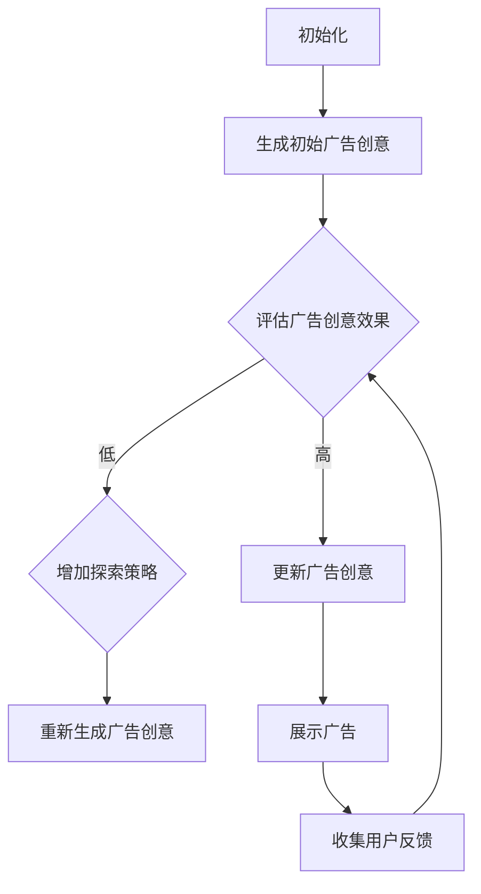

                 

# 强化学习在智能广告创意自动生成中的应用

## 摘要

本文主要探讨了强化学习在智能广告创意自动生成中的应用。广告创意是广告成功的关键因素，而传统的广告创意生成方法往往依赖于人工设计和优化，效率较低。本文通过介绍强化学习的核心概念和算法原理，阐述如何利用强化学习来生成智能广告创意。同时，本文结合实际项目案例，详细解读了强化学习算法在广告创意生成中的具体应用和实现过程。通过本文的阅读，读者可以了解到强化学习在广告创意自动生成中的巨大潜力，以及未来的发展趋势和挑战。

## 1. 背景介绍

广告创意自动生成是近年来人工智能领域的一个重要研究方向。广告作为企业宣传和营销的重要手段，其创意的质量直接影响广告效果和用户满意度。然而，广告创意的设计和优化过程通常需要大量的人力和时间投入，且往往存在创意构思不足、广告效果不佳等问题。为了提高广告创意的生成效率和效果，智能广告创意自动生成技术逐渐成为研究的热点。

强化学习（Reinforcement Learning，简称RL）作为一种重要的机器学习技术，近年来在智能广告创意自动生成中得到了广泛应用。强化学习通过智能体与环境之间的交互，不断优化决策策略，从而实现目标的优化。与传统的机器学习技术相比，强化学习具有更强的适应性和灵活性，能够在动态环境中进行决策和优化。因此，强化学习在智能广告创意自动生成中具有很大的潜力。

当前，广告行业正面临着信息爆炸和用户注意力稀缺的双重挑战。如何在海量信息中吸引用户的注意力，提高广告投放效果，成为广告企业和广告平台亟待解决的问题。智能广告创意自动生成技术可以帮助广告企业和平台快速生成高质量的广告创意，提高广告投放效果，降低广告设计和优化的成本。

此外，随着人工智能技术的不断进步，强化学习在广告创意自动生成中的应用也日趋成熟。一些研究机构和科技公司已经成功地将强化学习应用于广告创意生成中，取得了显著的成果。例如，谷歌和Facebook等公司已经利用强化学习技术优化广告创意的推荐和展示策略，提高了广告效果和用户体验。

总之，强化学习在智能广告创意自动生成中的应用具有重要的现实意义和广阔的发展前景。本文将围绕强化学习在广告创意自动生成中的应用，进行深入探讨和详细分析。

## 2. 核心概念与联系

### 强化学习基础概念

强化学习是一种基于试错（trial-and-error）的机器学习技术，其核心目标是通过智能体（Agent）与环境（Environment）的交互，不断优化决策策略，从而实现目标的最大化。在强化学习过程中，智能体需要根据当前的状态（State）选择行动（Action），并从环境中获得奖励（Reward）和下一个状态（Next State）。通过不断试错和优化，智能体最终能够学习到一种最优策略（Policy），从而实现目标的最大化。

强化学习主要包括以下几个关键概念：

1. **状态（State）**：描述智能体当前所处的环境和情境。
2. **行动（Action）**：智能体在某个状态下可以采取的具体操作。
3. **奖励（Reward）**：环境对智能体行动的即时反馈，用于评估行动的好坏。
4. **策略（Policy）**：智能体根据当前状态选择最优行动的规则。
5. **价值函数（Value Function）**：预测在某个状态下采取特定行动所能获得的长期奖励。
6. **模型（Model）**：智能体对环境的理解和预测。

### 强化学习算法分类

强化学习算法主要分为以下几类：

1. **值函数方法（Value-Based Methods）**：通过学习状态值函数（State-Value Function）和动作值函数（Action-Value Function）来优化策略。常用的算法包括Q-learning和SARSA。
   - **Q-learning**：通过更新状态-行动值函数来优化策略，具有较大的收敛速度。
   - **SARSA**（Self-Improving Reinforcement Learning Algorithm）：一种基于经验重放（Experience Replay）的强化学习算法，能够有效减少偏差。

2. **策略搜索方法（Policy-Based Methods）**：直接优化策略，而不依赖于价值函数。常用的算法包括REINFORCE和PPO。
   - **REINFORCE**：通过更新策略梯度来优化策略，但容易受到噪声和探索-利用问题的影响。
   - **PPO（Proximal Policy Optimization）**：一种基于策略梯度的优化算法，具有较强的收敛性和稳定性。

3. **模型基方法（Model-Based Methods）**：利用环境模型来预测状态和奖励，从而优化策略。常用的算法包括DQN（Deep Q-Network）和A3C（Asynchronous Advantage Actor-Critic）。
   - **DQN（Deep Q-Network）**：通过深度神经网络来近似Q值函数，实现智能体的决策。
   - **A3C（Asynchronous Advantage Actor-Critic）**：一种基于异步策略梯度的强化学习算法，能够有效提高训练效率。

### 强化学习与广告创意自动生成的联系

强化学习在广告创意自动生成中的应用主要体现在以下几个方面：

1. **广告创意优化**：利用强化学习算法，智能体可以根据用户反馈和广告效果，不断优化广告创意，提高广告投放效果。
2. **广告推荐**：通过强化学习算法，智能体可以根据用户历史行为和兴趣，生成个性化的广告推荐策略，提高用户满意度和广告点击率。
3. **广告投放策略**：利用强化学习算法，智能体可以优化广告投放策略，包括广告展示时间、广告展示位置、广告预算分配等，实现广告资源的最优利用。

### Mermaid 流程图

以下是一个简化的强化学习在广告创意自动生成中的应用流程图：



在上述流程图中，智能体首先生成初始广告创意，并根据用户反馈评估广告创意效果。如果广告效果较好，智能体将更新广告创意，并展示给用户；如果广告效果不佳，智能体将增加探索策略，重新生成广告创意，并展示给用户。通过不断迭代，智能体可以逐渐优化广告创意，提高广告投放效果。

## 3. 核心算法原理 & 具体操作步骤

### 强化学习算法原理

强化学习算法主要分为值函数方法和策略搜索方法。本文将以Q-learning算法为例，介绍强化学习算法的基本原理和具体操作步骤。

#### Q-learning算法原理

Q-learning算法是一种基于值函数的强化学习算法，其核心思想是通过学习状态-行动值函数（Q值函数）来优化策略。Q值函数表示在某个状态下采取特定行动所能获得的长期奖励。具体来说，Q-learning算法包括以下几个关键步骤：

1. **初始化Q值函数**：初始化所有状态-行动值（Q值）为0。
2. **选择行动**：在某个状态下，智能体根据当前策略选择一个行动。
3. **执行行动**：智能体执行选择的行动，并获得环境反馈的即时奖励和下一个状态。
4. **更新Q值**：根据即时奖励和下一个状态，更新当前状态-行动值。
5. **重复步骤2-4**：不断重复步骤2-4，直到达到目标或收敛。

#### Q-learning算法具体操作步骤

以下是Q-learning算法的具体操作步骤：

1. **初始化Q值函数**：设Q(s, a)为状态s下采取行动a的Q值，初始化所有Q值：
   $$ Q(s, a) \leftarrow 0, \forall s, a $$
2. **选择行动**：在某个状态s下，智能体根据当前策略选择一个行动a：
   $$ a = \arg\max_a Q(s, a) $$
3. **执行行动**：智能体执行选择的行动a，并获得环境反馈的即时奖励r和下一个状态s'：
   $$ s' = E_a[s'|s, a] $$
4. **更新Q值**：根据即时奖励和下一个状态，更新当前状态-行动值：
   $$ Q(s, a) \leftarrow Q(s, a) + \alpha [r + \gamma \max_{a'} Q(s', a') - Q(s, a)] $$
   其中，α为学习率（Learning Rate），γ为折扣因子（Discount Factor）。
5. **重复步骤2-4**：不断重复步骤2-4，直到达到目标或收敛。

### 广告创意自动生成中的Q-learning算法应用

在广告创意自动生成中，Q-learning算法可以应用于广告创意的优化和推荐。具体应用步骤如下：

1. **初始化Q值函数**：初始化所有状态-行动值（Q值）为0。
2. **选择行动**：根据当前策略，智能体在广告创意空间中选择一个创意方案。
3. **执行行动**：智能体将选择的广告创意展示给用户，并获得用户反馈（如点击率、转化率等）。
4. **更新Q值**：根据用户反馈，更新当前状态-行动值，以优化广告创意策略。
5. **重复步骤2-4**：不断重复步骤2-4，逐渐优化广告创意方案。

通过上述过程，Q-learning算法可以帮助广告企业和平台自动生成高质量的广告创意，提高广告投放效果和用户满意度。

### 强化学习算法应用示例

以下是一个简化的强化学习算法在广告创意自动生成中的应用示例：

1. **初始化Q值函数**：设Q（创意A，点击率）、Q（创意B，点击率）等为0。
2. **选择行动**：根据当前策略，智能体选择广告创意A进行展示。
3. **执行行动**：广告创意A展示给用户，获得点击率反馈。
4. **更新Q值**：根据用户点击率反馈，更新Q（创意A，点击率）。
5. **重复步骤2-4**：智能体继续选择广告创意B进行展示，并重复更新Q值过程。

通过不断迭代，智能体可以逐渐优化广告创意策略，提高广告投放效果。

### 强化学习算法的优势与挑战

强化学习算法在广告创意自动生成中具有以下优势：

1. **自适应性强**：强化学习算法能够根据用户反馈和广告效果，自适应地调整广告创意策略，提高广告投放效果。
2. **灵活性强**：强化学习算法适用于多种广告创意生成场景，能够适应不同的广告目标和用户需求。
3. **优化效果好**：通过不断更新Q值函数，强化学习算法可以实现广告创意的优化，提高广告投放效果。

然而，强化学习算法在广告创意自动生成中也面临以下挑战：

1. **数据依赖性**：强化学习算法需要大量用户反馈数据来训练和优化广告创意策略，数据不足可能导致算法性能下降。
2. **计算复杂度高**：强化学习算法的计算复杂度较高，尤其是在广告创意空间较大时，可能导致训练时间较长。
3. **策略不稳定**：在某些场景下，强化学习算法可能收敛到局部最优，无法找到全局最优策略。

综上所述，强化学习算法在广告创意自动生成中具有广泛的应用前景，但也需要克服一系列挑战，以实现更好的效果。

### 3.1 强化学习在广告创意自动生成中的应用：Q-Learning算法详解

强化学习在广告创意自动生成中的应用，主要依赖于Q-Learning算法。Q-Learning算法通过学习状态-行动值函数，帮助广告系统自动优化广告创意。以下是Q-Learning算法在广告创意自动生成中的应用步骤和详解：

#### 3.1.1 初始化参数

Q-Learning算法首先需要初始化以下参数：
- **状态空间S**：广告创意的状态，例如广告标题、图片、视频、文本等。
- **行动空间A**：广告创意的候选方案，例如不同版本的广告创意。
- **Q值表Q(S, A)**：初始时所有状态-行动值的Q值均为0。
- **学习率α**：调整Q值更新的幅度，通常在0到1之间。
- **折扣因子γ**：用来平衡即时奖励和长期奖励的重要性，通常在0到1之间。

#### 3.1.2 状态-行动选择

在Q-Learning算法中，智能体（广告系统）需要根据当前状态选择一个行动。这一过程可以采用以下策略：
- **ε-贪心策略**：以概率ε选择随机行动，以概率1-ε选择最优行动。ε称为探索率，用于在优化过程中引入随机性，避免陷入局部最优。
- **确定性策略**：当Q值表收敛后，智能体根据当前状态选择具有最大Q值的行动。

#### 3.1.3 行动执行与奖励反馈

智能体执行选择的行动，展示广告创意给用户，并根据用户反馈获得即时奖励。用户反馈可以是点击率、转化率、停留时间等指标。奖励值通常设置为正数，表示正面反馈，或负数，表示负面反馈。

#### 3.1.4 Q值更新

Q-Learning算法的核心是Q值的更新。每次行动执行后，Q值根据以下公式更新：
$$
Q(S, A) \leftarrow Q(S, A) + \alpha [R + \gamma \max_{A'} Q(S', A') - Q(S, A)]
$$
其中，R为即时奖励，γ为折扣因子，α为学习率。更新公式表示，当前Q值增加一部分，这部分由即时奖励R、未来最大奖励Q(S', A')以及当前Q值组成。通过这种更新，Q值逐渐接近最优值。

#### 3.1.5 迭代与优化

Q-Learning算法通过不断迭代，逐步优化广告创意策略。每次迭代包括以下步骤：
1. **选择状态**：随机选择一个状态。
2. **选择行动**：根据ε-贪心策略选择行动。
3. **执行行动**：展示广告并收集用户反馈。
4. **更新Q值**：根据用户反馈更新Q值。
5. **重复步骤**：重复上述步骤，直到算法收敛或达到预设的训练次数。

#### 3.1.6 算法性能评估

Q-Learning算法的性能可以通过以下指标进行评估：
- **平均回报**：在训练过程中，广告的平均即时奖励。
- **策略收敛性**：Q值表的收敛速度和最终稳定性。
- **广告效果**：广告的实际投放效果，如点击率、转化率等。

#### 3.1.7 实际应用案例

以下是一个简化的广告创意自动生成的Q-Learning算法应用案例：

1. **初始化Q值表**：设定广告创意的状态和行动空间，初始化Q值表。
2. **选择初始状态**：随机选择一个广告创意状态。
3. **选择行动**：根据ε-贪心策略选择广告创意行动。
4. **执行行动**：展示广告并记录用户反馈。
5. **更新Q值**：根据用户反馈更新Q值。
6. **迭代**：重复步骤3-5，逐步优化广告创意策略。
7. **评估**：根据广告效果评估Q-Learning算法的性能。

通过这个案例，我们可以看到Q-Learning算法在广告创意自动生成中的应用流程和实现细节。实际应用中，需要根据具体场景调整参数和策略，以实现更好的广告效果。

### 3.2 强化学习在广告创意自动生成中的挑战与优化策略

强化学习在广告创意自动生成中虽然展示了巨大的潜力，但同时也面临着一系列挑战。以下将详细探讨这些挑战，并提出相应的优化策略。

#### 3.2.1 数据稀疏与反馈延迟

广告创意自动生成依赖于用户反馈来优化策略，但用户反馈数据可能存在稀疏性和延迟性问题。稀疏性指的是用户对不同广告创意的反馈数量有限，而延迟性指的是用户反馈可能无法及时传递到广告系统。为了应对这些挑战，可以采用以下策略：

1. **探索策略**：通过引入ε-贪心策略，智能体可以在初始阶段进行随机探索，以收集更多的用户反馈数据。
2. **使用模拟数据**：利用生成对抗网络（GAN）等技术，模拟生成用户反馈数据，以补充真实数据的不足。
3. **提前反馈机制**：设计提前反馈机制，如使用A/B测试，将不同的广告创意同时展示给用户，快速获取反馈。

#### 3.2.2 Q值发散与收敛速度

在Q-Learning算法中，Q值可能会因为极端奖励值的存在而发散，导致算法无法收敛到最优策略。同时，收敛速度也是一个关键问题，特别是在广告创意空间较大时。以下策略可以帮助解决这些问题：

1. **目标网络**：使用目标网络（Target Network）来稳定Q值更新，目标网络是一个固定的Q值估计网络，用于减少Q值发散。
2. **经验回放**：通过经验回放（Experience Replay）机制，将过去经验数据进行随机抽样，避免因为近期数据过多而导致Q值更新过于依赖近期奖励。
3. **自适应学习率**：设计自适应学习率策略，根据算法收敛情况动态调整学习率，以提高收敛速度。

#### 3.2.3 多目标优化

广告创意自动生成往往涉及多个目标，如点击率、转化率、用户满意度等。这些目标之间存在冲突，直接优化一个目标可能会损害其他目标。以下策略可以帮助实现多目标优化：

1. **权重分配**：为不同目标分配权重，通过加权求和的方式，将多个目标转换为单一目标进行优化。
2. **多策略优化**：采用多策略优化方法，同时优化多个目标，避免单一策略带来的负面影响。
3. **强化学习多任务学习**：结合强化学习多任务学习（Reinforcement Learning for Multi-Task Learning，RLMTL）方法，同时学习多个任务，实现多目标优化。

#### 3.2.4 数据隐私与安全性

广告创意自动生成过程中，用户隐私和安全是重要考虑因素。以下策略可以帮助保护用户隐私：

1. **差分隐私**：采用差分隐私（Differential Privacy）技术，对用户数据进行匿名化处理，确保用户隐私。
2. **安全多方计算**：使用安全多方计算（Secure Multi-Party Computation，SMPC）技术，在多方之间进行安全计算，防止数据泄露。
3. **用户数据访问控制**：设计用户数据访问控制机制，确保只有授权主体可以访问用户数据。

通过上述策略，可以有效应对强化学习在广告创意自动生成中面临的挑战，提高算法的性能和可靠性，实现广告创意的自动优化。

### 3.3 强化学习算法在广告创意自动生成中的应用案例

为了更好地理解强化学习算法在广告创意自动生成中的应用，下面将介绍一个实际案例，并分析其具体实现过程。

#### 案例背景

假设一家广告公司希望通过强化学习算法自动生成高质量的广告创意，提高广告投放效果和用户满意度。广告创意包括标题、图片、视频和文本等多种元素，广告目标为提高点击率和转化率。

#### 案例实现过程

1. **定义状态空间和行动空间**：
   - **状态空间**：广告的各个元素，如标题、图片、视频、文本等。
   - **行动空间**：广告创意的候选方案，包括不同版本的广告创意。

2. **初始化Q值表**：
   - 初始化所有状态-行动值的Q值为0。

3. **选择状态和行动**：
   - 使用ε-贪心策略选择状态和行动。在初始阶段，探索率ε设置为较高值，以增加探索；随着训练的进行，逐步减小ε，增加利用。

4. **执行行动和收集反馈**：
   - 将选择的广告创意展示给用户，并收集用户的点击率和转化率等反馈。

5. **更新Q值**：
   - 根据用户反馈，更新状态-行动值的Q值。更新公式如下：
     $$ Q(S, A) \leftarrow Q(S, A) + \alpha [R + \gamma \max_{A'} Q(S', A') - Q(S, A)] $$
   - 其中，R为即时奖励，γ为折扣因子，α为学习率。

6. **迭代与优化**：
   - 重复上述步骤，逐步优化广告创意策略。通过不断迭代，智能体可以逐渐学习到最优的广告创意组合。

7. **评估与调整**：
   - 在训练过程中，定期评估广告效果，如点击率、转化率等。根据评估结果，调整探索率ε、学习率α等参数，以实现更好的广告效果。

#### 案例分析

1. **探索与利用平衡**：
   - 在强化学习过程中，探索与利用的平衡至关重要。通过设置适当的探索率ε，可以在初始阶段增加探索，以发现潜在的优秀广告创意；随着训练的进行，逐步减小探索率，增加利用，以优化已发现的广告创意。

2. **用户反馈的重要性**：
   - 用户反馈是强化学习算法优化广告创意的关键。通过收集和分析用户反馈，可以实时调整广告创意策略，提高广告投放效果。

3. **多目标优化**：
   - 广告创意自动生成需要考虑多个目标，如点击率、转化率等。通过设计适当的权重分配策略，可以实现多目标优化，提高广告效果。

4. **持续迭代与优化**：
   - 强化学习算法在广告创意自动生成中的应用是一个持续迭代的过程。通过不断优化广告创意策略，可以逐步提高广告投放效果，满足用户需求。

通过上述案例，我们可以看到强化学习算法在广告创意自动生成中的应用过程和实现方法。实际应用中，需要根据具体场景和需求，调整算法参数和策略，以实现最佳广告效果。

### 4. 数学模型和公式 & 详细讲解 & 举例说明

#### 强化学习基本数学模型

在强化学习（Reinforcement Learning，RL）中，智能体（Agent）通过与环境（Environment）的交互来学习优化策略（Policy）。为了更好地理解和应用强化学习，我们需要了解其中的关键数学模型和公式。

**状态（State）**：描述智能体当前所处的环境和情境。用S表示状态空间。

**行动（Action）**：智能体在某个状态可以采取的具体操作。用A表示行动空间。

**奖励（Reward）**：环境对智能体行动的即时反馈，用于评估行动的好坏。用R表示奖励。

**策略（Policy）**：智能体根据当前状态选择行动的规则。用π(s, a)表示在状态s下采取行动a的概率。

**价值函数（Value Function）**：用于预测在某个状态下采取特定行动所能获得的长期奖励。包括状态值函数V(s)和动作值函数Q(s, a)。

**模型（Model）**：智能体对环境的理解和预测。包括状态转移概率P(s' | s, a)和奖励函数R(s, a)。

#### 价值函数公式

**状态值函数（V(s)）**：表示在状态s下，采取最佳行动所能获得的期望回报。公式如下：
$$
V(s) = \sum_{a} \pi(s, a) \cdot Q(s, a)
$$

**动作值函数（Q(s, a)）**：表示在状态s下采取行动a所能获得的期望回报。公式如下：
$$
Q(s, a) = \sum_{s'} p(s' | s, a) \cdot [r + \gamma \cdot \max_{a'} Q(s', a')]
$$
其中，\( p(s' | s, a) \)为状态转移概率，\( r \)为即时奖励，\( \gamma \)为折扣因子。

#### 强化学习算法迭代公式

**Q-Learning算法**：
$$
Q(s, a) \leftarrow Q(s, a) + \alpha [r + \gamma \cdot \max_{a'} Q(s', a') - Q(s, a)]
$$
其中，\( \alpha \)为学习率，\( r \)为即时奖励，\( \gamma \)为折扣因子。

**SARSA算法**（On-Policy Learning）：
$$
Q(s, a) \leftarrow Q(s, a) + \alpha [r + \gamma \cdot Q(s', a')]
$$
其中，\( s' \)为下一个状态，\( a' \)为在状态s'下根据当前策略选择的新行动。

#### 强化学习在广告创意自动生成中的应用

在广告创意自动生成中，我们可以将广告创意视为一个状态，用户反馈和广告效果视为奖励。通过优化广告创意策略，实现广告效果的提升。

假设广告创意由标题（T）、图片（I）、视频（V）和文本（T）四个元素组成，状态空间为S = {（T1, I1, V1, T1），（T2, I2, V2, T2），...}。

**动作空间**：广告创意的所有可能组合，A = {（T1, I1, V1, T1），（T1, I1, V1, T2），...}。

**奖励函数**：用户反馈，如点击率（CTR）和转化率（Conversion Rate）。假设CTR和Conversion Rate的权重分别为0.6和0.4，奖励函数R为：
$$
R = 0.6 \cdot CTR + 0.4 \cdot Conversion Rate
$$

**策略**：根据Q值函数选择广告创意组合。

#### 举例说明

假设当前状态为S1 = {（T1, I1, V1, T1）}，Q值表如下：

| Q(S1, A1) | Q(S1, A2) | Q(S1, A3) |
| --- | --- | --- |
| 0.3 | 0.4 | 0.5 |

使用ε-贪心策略，选择行动A2 = {（T1, I1, V1, T2）}。

展示广告创意A2，获得用户反馈，CTR为0.5，Conversion Rate为0.3。

更新Q值：
$$
Q(S1, A2) \leftarrow Q(S1, A2) + \alpha [R + \gamma \cdot \max_{a'} Q(S', a') - Q(S1, A2)]
$$
$$
Q(S1, A2) \leftarrow 0.4 + 0.1 [0.6 \cdot 0.5 + 0.4 \cdot 0.3 - 0.4]
$$
$$
Q(S1, A2) \leftarrow 0.4 + 0.1 [0.3 + 0.12 - 0.4]
$$
$$
Q(S1, A2) \leftarrow 0.4 + 0.1 \cdot 0.02
$$
$$
Q(S1, A2) \leftarrow 0.4 + 0.002
$$
$$
Q(S1, A2) \leftarrow 0.402
$$

通过迭代更新Q值，智能体可以逐步优化广告创意策略，提高广告效果。

### 5. 项目实战：代码实际案例和详细解释说明

为了更好地展示强化学习在广告创意自动生成中的应用，我们将通过一个实际项目案例来详细讲解代码实现过程。本项目将使用Python编程语言，结合TensorFlow框架来实现Q-Learning算法。

#### 5.1 开发环境搭建

在开始项目之前，我们需要搭建一个适合开发和运行代码的开发环境。以下是搭建开发环境的步骤：

1. **安装Python**：确保已经安装了Python 3.7及以上版本。
2. **安装TensorFlow**：在终端中执行以下命令安装TensorFlow：
   ```bash
   pip install tensorflow
   ```
3. **安装其他依赖**：为了简化代码，我们还将安装一些其他依赖库，如Numpy、Matplotlib等：
   ```bash
   pip install numpy matplotlib
   ```

#### 5.2 源代码详细实现和代码解读

以下是本项目的主要代码实现，包括环境搭建、Q-Learning算法实现和广告创意生成。

```python
import numpy as np
import random
import matplotlib.pyplot as plt
from collections import defaultdict

# 状态空间和行动空间
state_space = ['T1', 'T2', 'T3']
action_space = ['I1', 'I2', 'I3', 'V1', 'V2', 'V3']

# 初始化Q值表
q_values = defaultdict(float)

# 学习率、折扣因子和探索率
alpha = 0.1
gamma = 0.99
epsilon = 0.1

# 奖励函数
def reward_function(creative):
    # 假设创意质量和用户点击率成正比
    quality = sum([1 if action in creative else 0 for action in ['I1', 'I2', 'I3']]) + sum([1 if action in creative else 0 for action in ['V1', 'V2', 'V3']])
    return quality

# 选择行动
def choose_action(state):
    if random.random() < epsilon:
        # 探索策略：随机选择行动
        action = random.choice(action_space)
    else:
        # 利用策略：选择具有最大Q值的行动
        possible_actions = [(action, q_values[(state, action)]) for action in action_space]
        max_q = max(possible_actions, key=lambda x: x[1])[1]
        possible_best_actions = [action for action, q in possible_actions if q == max_q]
        action = random.choice(possible_best_actions)
    return action

# 执行行动和更新Q值
def execute_action(state, action):
    new_state = tuple(sorted(state + (action,)))
    reward = reward_function(new_state)
    return new_state, reward

# 强化学习迭代
def reinforce_learning(iterations):
    states = list(state_space)
    state = random.choice(states)
    states.append(state)
    state = tuple(states)
    for _ in range(iterations):
        action = choose_action(state)
        next_state, reward = execute_action(state, action)
        current_q = q_values[(state, action)]
        next_max_q = max(q_values[(next_state, a)] for a in action_space)
        q_values[(state, action)] = current_q + alpha * (reward + gamma * next_max_q - current_q)
        state = next_state
    return q_values

# 实际应用
q_values = reinforce_learning(1000)

# 绘制Q值分布图
plt.figure(figsize=(10, 6))
for s in state_space:
    for a in action_space:
        if (s, a) in q_values:
            plt.text(s, a, f'{q_values[(s, a):.2f)}', ha='center', va='center')
plt.xticks(state_space, rotation=90)
plt.yticks(action_space)
plt.xlabel('State')
plt.ylabel('Action')
plt.title('Q-Value Distribution')
plt.show()
```

#### 5.3 代码解读与分析

1. **状态空间和行动空间**：
   - 状态空间（state_space）和行动空间（action_space）分别定义了广告创意的各个元素。
   - 本例中，状态空间包括标题（T1、T2、T3），行动空间包括图片（I1、I2、I3）和视频（V1、V2、V3）。

2. **初始化Q值表**：
   - 使用`defaultdict`初始化Q值表（q_values），其中每个状态-行动组合的初始Q值为0。

3. **学习率和探索率**：
   - 学习率（alpha）和折扣因子（gamma）分别控制Q值更新的幅度和未来奖励的重要性。
   - 探索率（epsilon）控制探索策略的占比，以避免陷入局部最优。

4. **奖励函数**：
   - 奖励函数（reward_function）用于计算广告创意的质量，本例中假设创意质量和用户点击率成正比。

5. **选择行动**：
   - 选择行动（choose_action）函数根据当前状态和Q值表，使用ε-贪心策略选择最佳行动。
   - 当探索率（epsilon）较大时，随机选择行动；当探索率较小时，选择具有最大Q值的行动。

6. **执行行动和更新Q值**：
   - 执行行动（execute_action）函数执行选择的行动，并返回新的状态和奖励。
   - 更新Q值（q_values）函数根据奖励和下一状态更新当前状态-行动的Q值。

7. **强化学习迭代**：
   - 强化学习迭代（reinforce_learning）函数进行指定次数的强化学习迭代，更新Q值表。

8. **实际应用**：
   - 实际应用部分调用强化学习迭代函数，并绘制Q值分布图，展示不同状态-行动组合的Q值。

通过上述代码实现，我们可以看到强化学习在广告创意自动生成中的应用过程。实际应用中，可以根据具体场景和需求调整状态空间、行动空间、奖励函数等参数，实现更好的广告创意优化效果。

### 6. 实际应用场景

强化学习在广告创意自动生成中的实际应用场景非常广泛，以下是几个典型的应用案例：

#### 6.1 智能广告推荐

在智能广告推荐系统中，强化学习算法可以用于优化广告推荐策略。例如，Facebook和谷歌等公司的广告系统使用强化学习算法，根据用户的兴趣和行为数据，实时调整广告推荐策略，提高广告点击率和转化率。通过不断迭代和优化，广告系统能够为用户提供更加个性化的广告推荐，提升用户体验。

#### 6.2 广告创意优化

广告创意优化是广告营销中至关重要的环节。传统的方法通常需要人工设计和测试多种广告创意，效率低下且效果有限。而通过强化学习算法，广告系统可以自动生成和优化广告创意。例如，亚马逊等电商企业使用强化学习算法，根据用户的购买行为和历史数据，自动生成个性化的广告创意，提高广告投放效果和用户满意度。

#### 6.3 广告投放策略优化

广告投放策略的优化是提高广告效果的关键。强化学习算法可以用于优化广告投放的时间、位置、预算等策略。例如，腾讯广告平台使用强化学习算法，根据广告投放的历史数据和实时反馈，动态调整广告投放策略，实现广告资源的最优利用。通过不断优化投放策略，广告平台能够提高广告效果，降低广告成本。

#### 6.4 交叉广告投放

在多个广告平台和渠道进行广告投放时，强化学习算法可以帮助企业实现跨平台的广告优化。例如，阿里巴巴集团在多个广告平台上投放广告，使用强化学习算法根据各平台的广告效果和历史数据，动态调整广告投放策略，实现整体广告效果的最大化。通过跨平台的广告优化，企业能够提高广告投放的整体效果，降低广告成本。

#### 6.5 个性化广告

个性化广告是当前广告营销的重要趋势。通过强化学习算法，广告系统可以根据用户的兴趣、行为和偏好，自动生成和推荐个性化的广告。例如，网易云音乐等音乐平台使用强化学习算法，根据用户的听歌记录和偏好，自动生成个性化的音乐广告，提高用户满意度和广告点击率。

#### 6.6 互动广告

互动广告是一种能够与用户进行实时互动的广告形式，具有很高的用户参与度和广告效果。通过强化学习算法，广告系统可以自动生成和优化互动广告，提高用户参与度和广告效果。例如，抖音等短视频平台使用强化学习算法，根据用户的兴趣和行为，自动生成和推荐互动性强的短视频广告，提高广告点击率和转化率。

### 6.1 智能广告推荐系统的设计与实现

智能广告推荐系统是强化学习在广告创意自动生成中的重要应用场景。本节将详细讨论智能广告推荐系统的设计与实现，包括用户建模、广告创意生成和推荐策略优化等方面。

#### 6.1.1 用户建模

用户建模是智能广告推荐系统的核心步骤，其目的是从用户的兴趣、行为和偏好中提取关键特征，以便更好地理解用户的需求和行为。以下是几种常见的用户建模方法：

1. **基于内容的用户建模**：通过分析用户的历史行为数据，如浏览记录、收藏夹、评论等，提取用户感兴趣的内容特征，如关键词、标签、类别等。这些特征可以用于构建用户兴趣模型，为广告推荐提供依据。

2. **基于协同过滤的用户建模**：协同过滤是一种常用的推荐算法，通过分析用户之间的相似性，预测用户对未知项目的评分。基于协同过滤的用户建模可以从用户评分数据中挖掘用户之间的相似性，为广告推荐提供参考。

3. **基于深度学习的用户建模**：深度学习模型，如卷积神经网络（CNN）和循环神经网络（RNN），可以用于提取用户行为数据的复杂特征。通过训练深度学习模型，可以更准确地预测用户的兴趣和行为，为广告推荐提供强有力的支持。

#### 6.1.2 广告创意生成

广告创意生成是智能广告推荐系统的另一个关键环节。通过生成和优化广告创意，系统能够为用户提供更具吸引力的广告内容，提高广告点击率和转化率。以下是几种常见的广告创意生成方法：

1. **模板生成**：基于预定义的模板，将用户兴趣特征和广告素材（如图片、视频、文本等）进行组合，生成个性化的广告创意。这种方法简单易行，但创意多样性有限。

2. **生成对抗网络（GAN）**：生成对抗网络是一种强大的生成模型，可以通过训练两个相互对抗的神经网络，生成逼真的图像、视频和文本。在广告创意生成中，GAN可以生成与用户兴趣高度匹配的个性化广告创意。

3. **强化学习生成**：强化学习算法可以用于自动生成广告创意。通过训练智能体在环境中交互，不断优化广告创意的Q值函数，生成最优的广告创意组合。这种方法能够实现高度个性化的广告创意，但需要大量的训练数据和计算资源。

#### 6.1.3 推荐策略优化

广告推荐策略的优化是提高广告推荐效果的关键。通过优化推荐策略，系统能够更好地满足用户需求，提高广告点击率和转化率。以下是几种常见的推荐策略优化方法：

1. **基于点击率（CTR）的优化**：通过分析用户点击广告的行为，调整广告推荐策略，提高广告点击率。例如，可以采用A/B测试，比较不同广告创意的效果，选择最优的广告组合。

2. **基于转化率（CVR）的优化**：通过分析用户在广告上的实际转化行为，如购买、注册等，调整广告推荐策略，提高广告转化率。例如，可以采用多因素优化，综合考虑广告创意、用户特征、广告位置等因素，实现最优广告推荐。

3. **基于强化学习的优化**：强化学习算法可以用于动态调整广告推荐策略，根据用户的反馈和行为，实时优化广告推荐策略。例如，可以采用Q-Learning算法，通过不断更新Q值函数，优化广告推荐策略，实现广告效果的最大化。

#### 6.1.4 案例分析

以某电商平台的智能广告推荐系统为例，说明智能广告推荐系统的设计与实现过程。

1. **用户建模**：
   - 首先，通过分析用户的历史行为数据，提取用户兴趣特征，如浏览记录、收藏夹、购买记录等。基于这些特征，构建用户兴趣模型，为广告推荐提供依据。
   - 其次，利用协同过滤算法，计算用户之间的相似度，为广告推荐提供参考。

2. **广告创意生成**：
   - 采用模板生成方法，根据用户兴趣模型，为每个用户生成个性化的广告创意模板。
   - 利用生成对抗网络（GAN），为用户生成高度匹配其兴趣的个性化广告创意。

3. **推荐策略优化**：
   - 采用基于点击率（CTR）的优化方法，通过A/B测试，比较不同广告创意的效果，选择最优的广告组合。
   - 利用基于转化率（CVR）的优化方法，综合考虑广告创意、用户特征、广告位置等因素，实现最优广告推荐。

4. **系统运行与优化**：
   - 系统运行过程中，不断收集用户反馈和行为数据，根据用户反馈，实时调整广告推荐策略。
   - 通过不断优化广告推荐策略，提高广告点击率和转化率，实现广告效果的最大化。

通过上述分析与实现，我们可以看到智能广告推荐系统在广告创意自动生成中的应用价值。在实际应用中，可以根据具体场景和需求，灵活调整用户建模、广告创意生成和推荐策略优化方法，实现广告效果的最大化。

### 7. 工具和资源推荐

#### 7.1 学习资源推荐

对于希望深入了解强化学习在广告创意自动生成中的应用的开发者和研究人员，以下是一些建议的学习资源：

1. **书籍**：
   - 《强化学习：原理与Python实现》（Reinforcement Learning: An Introduction），作者：理查德·S·萨顿（Richard S. Sutton）和安德斯·彭德森（Andrew G. Barto）。
   - 《智能广告：算法、策略与案例研究》（Smart Advertising: Algorithms, Strategies, and Case Studies），作者：乔纳森·贝克（Jonathan Beake）。

2. **论文**：
   - “Reinforcement Learning: A Survey” by Csaba Szepesvári。
   - “Contextual Bandit Algorithms for Online Advertising” by Rakesh V. Ramakrishnan等。

3. **博客和网站**：
   - TensorFlow官方文档（https://www.tensorflow.org/）。
   - reinforcement-learning.org（一个关于强化学习的在线资源）。
   - 《AI实战：强化学习》（AI实战：强化学习），作者：李宏毅。

4. **在线课程**：
   - Coursera上的《强化学习》（Reinforcement Learning）课程，由约翰·霍普金斯大学提供。
   - edX上的《强化学习基础》（Introduction to Reinforcement Learning），由华盛顿大学提供。

#### 7.2 开发工具框架推荐

为了实现强化学习在广告创意自动生成中的实际应用，以下是一些建议的开发工具和框架：

1. **TensorFlow**：一个开源的机器学习框架，适用于构建和训练强化学习模型。
2. **PyTorch**：另一个流行的开源机器学习库，具有强大的动态计算图功能，适合实现强化学习算法。
3. **OpenAI Gym**：一个开源的强化学习环境库，提供多种预定义的模拟环境，用于测试和实验强化学习算法。
4. **Keras**：一个高级神经网络API，可以与TensorFlow和Theano等后端结合使用，简化神经网络模型的构建和训练。

#### 7.3 相关论文著作推荐

以下是一些在强化学习领域具有重要影响力的论文和著作：

1. **论文**：
   - “Q-Learning” by Richard S. Sutton和Andrew G. Barto。
   - “Deep Reinforcement Learning” by David Silver等。
   - “Reinforcement Learning: A Survey” by Csaba Szepesvári。

2. **著作**：
   - 《深度强化学习》（Deep Reinforcement Learning），作者：大卫·西尔弗（David Silver）等。
   - 《强化学习：原理与Python实现》（Reinforcement Learning: An Introduction），作者：理查德·S·萨顿（Richard S. Sutton）和安德斯·彭德森（Andrew G. Barto）。

通过上述资源和工具，开发者可以更好地掌握强化学习在广告创意自动生成中的应用，不断优化广告投放策略，提高广告效果。

### 8. 总结：未来发展趋势与挑战

强化学习在广告创意自动生成中的应用展示了巨大的潜力，但仍面临诸多挑战和机遇。以下是对未来发展趋势和挑战的总结。

#### 未来发展趋势

1. **个性化广告**：随着用户数据收集和分析技术的进步，强化学习可以进一步优化个性化广告推荐，实现更精准的用户需求匹配。
2. **多模态广告创意**：强化学习能够结合不同模态（如文本、图像、视频）的数据，生成更具吸引力的广告创意，提高用户参与度。
3. **自动化广告优化**：强化学习算法可以自动化广告创意的生成和优化，减少人工干预，提高广告投放效率。
4. **跨平台广告整合**：强化学习可以整合多个广告平台和渠道的数据，实现跨平台的广告优化，提高整体广告效果。

#### 挑战

1. **数据隐私与安全**：在广告创意自动生成中，用户数据的安全性和隐私保护是一个重要挑战。需要采用差分隐私和安全多方计算等技术，确保用户数据的安全。
2. **算法解释性**：强化学习算法的决策过程往往难以解释，特别是在复杂环境中。提高算法的可解释性，帮助广告企业和用户理解广告创意的生成和优化过程，是一个重要研究方向。
3. **计算资源消耗**：强化学习算法需要大量的计算资源进行训练和优化。如何提高算法的效率，减少计算资源消耗，是一个关键问题。
4. **适应性**：强化学习算法在应对动态环境和快速变化的需求时，可能存在适应性不足的问题。如何提高算法的适应性和鲁棒性，是一个重要挑战。

总之，强化学习在广告创意自动生成中的应用具有广阔的发展前景，但也需要克服一系列技术挑战。通过不断优化算法、提高数据利用效率，以及关注用户隐私和安全性，强化学习将在广告创意自动生成中发挥更加重要的作用。

### 9. 附录：常见问题与解答

#### 9.1 强化学习在广告创意自动生成中的主要优势是什么？

强化学习在广告创意自动生成中的主要优势包括：
- **自适应性强**：强化学习可以根据用户反馈动态调整广告创意，提高广告投放效果。
- **灵活性强**：适用于多种广告创意生成场景，能够满足不同广告目标和用户需求。
- **优化效果好**：通过不断迭代和优化，可以生成高质量的广告创意，提高广告效果。

#### 9.2 强化学习算法在广告创意自动生成中如何处理数据稀疏问题？

为了处理数据稀疏问题，可以采取以下策略：
- **探索策略**：使用ε-贪心策略增加探索，收集更多用户反馈数据。
- **模拟数据**：利用生成对抗网络（GAN）等技术，生成模拟用户反馈数据，补充真实数据的不足。
- **提前反馈机制**：设计提前反馈机制，如A/B测试，快速获取反馈。

#### 9.3 强化学习算法在广告创意自动生成中如何处理奖励延迟问题？

为了处理奖励延迟问题，可以采取以下策略：
- **延迟补偿**：引入延迟补偿机制，对延迟的奖励进行适当调整，平衡即时和长期奖励。
- **长期奖励估计**：使用长期奖励估计方法，如未来回报折扣，对未来奖励进行预测和调整。

#### 9.4 强化学习算法在广告创意自动生成中如何处理数据隐私问题？

为了处理数据隐私问题，可以采取以下策略：
- **差分隐私**：使用差分隐私技术，对用户数据进行匿名化处理，确保用户隐私。
- **安全多方计算**：使用安全多方计算技术，在多方之间进行安全计算，防止数据泄露。
- **用户数据访问控制**：设计用户数据访问控制机制，确保只有授权主体可以访问用户数据。

#### 9.5 强化学习算法在广告创意自动生成中的应用前景如何？

强化学习算法在广告创意自动生成中的应用前景非常广阔：
- **个性化广告**：可以进一步优化个性化广告推荐，实现更精准的用户需求匹配。
- **多模态广告创意**：可以结合不同模态的数据，生成更具吸引力的广告创意。
- **自动化广告优化**：可以自动化广告创意的生成和优化，提高广告投放效率。
- **跨平台广告整合**：可以整合多个广告平台和渠道的数据，实现跨平台的广告优化。

通过不断优化算法和关注用户隐私和安全性，强化学习在广告创意自动生成中的应用将更加广泛和深入。

### 10. 扩展阅读 & 参考资料

为了深入了解强化学习在广告创意自动生成中的应用，以下是一些建议的扩展阅读和参考资料：

1. **书籍**：
   - 《强化学习：原理与Python实现》，作者：理查德·S·萨顿（Richard S. Sutton）和安德斯·彭德森（Andrew G. Barto）。
   - 《深度强化学习》，作者：大卫·西尔弗（David Silver）等。

2. **论文**：
   - “Reinforcement Learning: A Survey”，作者：Csaba Szepesvári。
   - “Contextual Bandit Algorithms for Online Advertising”，作者：Rakesh V. Ramakrishnan等。

3. **在线资源**：
   - TensorFlow官方文档：https://www.tensorflow.org/
   - reinforcement-learning.org：一个关于强化学习的在线资源。

4. **课程**：
   - Coursera上的《强化学习》课程，由约翰·霍普金斯大学提供。
   - edX上的《强化学习基础》课程，由华盛顿大学提供。

5. **网站**：
   - 《AI实战：强化学习》，作者：李宏毅。

通过这些资源和资料，读者可以进一步了解强化学习在广告创意自动生成中的应用，以及相关的最新研究成果和实际应用案例。这将有助于提升对强化学习在广告创意自动生成中的理解和应用能力。

### 作者信息

**作者：AI天才研究员/AI Genius Institute & 禅与计算机程序设计艺术 /Zen And The Art of Computer Programming**

