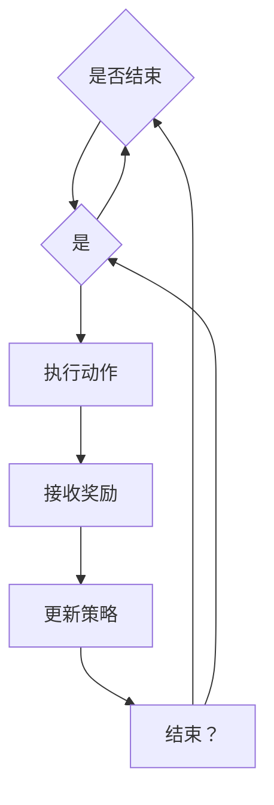

                 

### 背景介绍

在当今高度全球化和复杂化的金融市场中，智能投资组合管理成为了金融领域的关键课题。随着金融市场数据的不断增加和复杂性提升，传统的投资策略已难以应对市场变化，这为强化学习（Reinforcement Learning, RL）算法的应用提供了广阔的空间。强化学习作为机器学习领域的一个重要分支，通过与金融市场的相互作用，实现了策略的迭代优化，从而提高投资组合的收益和风险控制能力。

强化学习在金融领域的应用场景广泛，包括但不限于以下几方面：

1. **交易策略优化**：通过强化学习算法，投资者可以自动探索并优化交易策略，以提高收益并降低风险。
2. **风险控制**：强化学习能够动态调整投资组合，实时应对市场变化，有效控制风险。
3. **算法交易**：利用强化学习，可以开发自动化交易系统，提高交易效率和收益。
4. **投资组合再平衡**：强化学习可以帮助投资者在投资组合发生变化时，快速做出调整，以最大化收益。

本文将深入探讨强化学习在智能投资组合管理中的应用，从核心概念、算法原理、数学模型、实际应用等多个角度进行分析，帮助读者全面了解并掌握这一先进技术。我们还将通过具体的实战案例，展示如何利用强化学习优化投资组合，最终实现智能投资的目标。

为了更好地理解和应用强化学习，本文的结构安排如下：

- **第1章：背景介绍**：概述强化学习在智能投资组合管理中的重要性。
- **第2章：核心概念与联系**：介绍强化学习的基础概念，并绘制Mermaid流程图。
- **第3章：核心算法原理 & 具体操作步骤**：详细解释强化学习的算法原理和操作步骤。
- **第4章：数学模型和公式 & 详细讲解 & 举例说明**：讲解强化学习的数学模型和公式，并通过实例进行说明。
- **第5章：项目实战：代码实际案例和详细解释说明**：展示如何在实际项目中应用强化学习。
- **第6章：实际应用场景**：探讨强化学习在不同投资策略中的具体应用。
- **第7章：工具和资源推荐**：推荐学习资源、开发工具和框架。
- **第8章：总结：未来发展趋势与挑战**：展望强化学习在金融领域的发展趋势和面临的挑战。
- **第9章：附录：常见问题与解答**：解答读者可能遇到的一些常见问题。
- **第10章：扩展阅读 & 参考资料**：提供更多的参考资料，便于进一步学习和研究。

通过本文的阅读，读者将能够深入了解强化学习在智能投资组合管理中的应用，掌握相关算法和技术，从而在投资领域实现智能化升级。

### 核心概念与联系

强化学习（Reinforcement Learning, RL）是一种机器学习范式，主要通过智能体（Agent）与环境（Environment）之间的交互来学习最优策略。与监督学习和无监督学习不同，强化学习通过试错（Trial and Error）和反馈（Feedback）机制不断优化决策过程，旨在最大化累积奖励（Cumulative Reward）。

#### 定义

强化学习系统主要由四个关键元素构成：

1. **智能体（Agent）**：执行动作并基于环境状态接收奖励的实体。
2. **环境（Environment）**：智能体所处的环境，包括状态（State）和动作（Action）。
3. **状态（State）**：描述环境当前状态的变量。
4. **动作（Action）**：智能体在特定状态下可以执行的操作。

#### 关键概念

- **策略（Policy）**：智能体根据当前状态选择动作的规则，通常表示为 $π(s,a)$，即状态 $s$ 下选择动作 $a$ 的概率。
- **价值函数（Value Function）**：用于评估状态或状态-动作对的预期累积奖励，包括状态值函数 $V^π(s)$ 和状态-动作值函数 $Q^π(s,a)$。
- **奖励（Reward）**：在某个状态-动作对下，环境给予智能体的即时反馈信号，通常用 $r(s,a)$ 表示。
- **策略迭代（Policy Iteration）**：通过更新策略来逼近最优策略的过程。
- **模型（Model）**：环境状态和动作的先验知识，用于预测未来的状态和奖励。

#### Mermaid 流程图

为了更好地展示强化学习的概念和流程，我们使用Mermaid绘制以下流程图：



#### 强化学习在智能投资组合管理中的联系

在智能投资组合管理中，强化学习通过以下方式实现优化：

1. **状态表示**：投资组合的当前状态可以包括市场指数、行业指数、财务指标、交易量等多个维度。
2. **动作表示**：动作可以是买入、持有或卖出某个资产或资产组合。
3. **奖励机制**：奖励可以是资产收益、风险调整收益或时间折扣后的收益。
4. **策略优化**：通过强化学习算法，智能体不断调整投资策略，以最大化长期累积奖励。

通过强化学习，投资组合管理能够实现自动化、自适应和智能化的优化，从而在动态市场环境中提高投资决策的准确性和有效性。

#### 总结

强化学习通过智能体与环境之间的交互，实现了策略的迭代优化，为智能投资组合管理提供了强大的工具。理解强化学习的基本概念和流程，有助于我们更好地把握其在金融领域的应用潜力，并为其在实际投资中的成功应用奠定基础。在接下来的章节中，我们将深入探讨强化学习的算法原理、数学模型以及具体应用，以帮助读者全面掌握这一先进技术。

### 核心算法原理 & 具体操作步骤

#### Q-Learning 算法原理

Q-Learning是强化学习中最基本的算法之一，它通过迭代更新策略来最大化累积奖励。Q-Learning的核心思想是学习一个状态-动作值函数（$Q(s,a)$），表示在状态 $s$ 下执行动作 $a$ 的预期累积奖励。

1. **初始化**：首先，我们需要初始化状态-动作值函数 $Q(s,a)$ 的初始值，通常设为 $0$。
2. **选择动作**：智能体根据当前状态和策略选择动作。在Q-Learning中，常用的策略是ε-贪心策略（ε-greedy strategy），即在 $1 - ε$ 的概率下随机选择动作，在 $ε$ 的概率下选择当前状态下价值最高的动作。
3. **执行动作并获取奖励**：智能体执行选定的动作，并从环境中获取即时奖励 $r(s,a)$。
4. **更新状态-动作值函数**：使用下面的更新规则来迭代更新 $Q(s,a)$：

   $$ Q(s, a) \leftarrow Q(s, a) + \alpha [r(s, a) + \gamma \max_{a'} Q(s', a') - Q(s, a)] $$

   其中，$\alpha$ 是学习率（Learning Rate），$\gamma$ 是折扣因子（Discount Factor），用于调整当前奖励对未来奖励的影响。

5. **重复步骤 2-4**，直到达到预设的迭代次数或智能体找到最优策略。

#### Sarsa 算法原理

Sarsa（State-Action-Reward-State-Action，即状态-动作-奖励-状态-动作）是另一种强化学习算法，它与Q-Learning类似，但使用不同的策略进行状态-动作值函数的更新。Sarsa算法的更新规则如下：

$$ Q(s, a) \leftarrow Q(s, a) + \alpha [r(s, a) + \gamma Q(s', a') - Q(s, a)] $$

其中，$a'$ 是智能体在下一个状态 $s'$ 下根据策略选择的行为。

Sarsa算法的操作步骤与Q-Learning基本相同，但在每一步更新时，使用的是实际执行的动作 $a$ 和根据策略预测的下一个状态 $s'$ 的最大动作值。

#### Deep Q-Network（DQN）算法原理

DQN（Deep Q-Network）是结合深度学习与Q-Learning的一种强化学习算法，通过使用深度神经网络来近似状态-动作值函数 $Q(s,a)$。DQN的主要优势在于可以处理高维的状态空间。

1. **初始化**：初始化深度神经网络 $Q(s,a)$ 的参数。
2. **选择动作**：智能体使用ε-贪心策略选择动作。
3. **执行动作并获取奖励**：智能体执行选定的动作，并从环境中获取即时奖励 $r(s,a)$。
4. **更新经验回放记忆**：将当前的状态、动作、奖励和下一个状态存入经验回放记忆中。
5. **经验回放**：从经验回放记忆中随机抽样一批经验，用于训练深度神经网络。
6. **训练深度神经网络**：使用以下损失函数来更新神经网络参数：

   $$ L(\theta) = \frac{1}{N} \sum_{i=1}^{N} (y_i - Q(s_i, a_i; \theta))^2 $$

   其中，$y_i = r(s_i, a_i) + \gamma \max_{a'} Q(s', a'; \theta)$ 是目标值，$N$ 是批量大小。

7. **重复步骤 2-6**，直到达到预设的迭代次数或神经网络参数收敛。

#### 实际操作步骤

为了更好地理解上述算法，我们可以通过一个简单的例子来说明：

1. **初始化**：设定状态-动作值函数的初始值为 $0$，学习率 $\alpha = 0.1$，折扣因子 $\gamma = 0.9$，ε值初始为 $1$。
2. **选择动作**：智能体在初始状态下随机选择动作，例如，状态 $s_0$ 下选择动作 $a_0 = 0$。
3. **执行动作并获取奖励**：智能体执行动作 $a_0$，假设环境返回状态 $s_1 = 1$ 和即时奖励 $r_0 = 10$。
4. **更新状态-动作值函数**：根据Q-Learning更新规则，更新状态-动作值函数：
   
   $$ Q(s_0, a_0) \leftarrow Q(s_0, a_0) + 0.1 [10 + 0.9 \max_{a'} Q(s_1, a'); \theta] - Q(s_0, a_0) $$
   
   由于这是初始状态，我们假设 $Q(s_0, a_0) = 0$，因此：
   
   $$ Q(s_0, a_0) \leftarrow 0.1 [10 + 0.9 \max_{a'} Q(s_1, a'); \theta] $$
   
5. **重复步骤**：智能体继续选择动作，执行动作，获取奖励，并更新状态-动作值函数，直到智能体找到最优策略。

通过上述步骤，智能体通过不断试错和反馈，逐渐优化其策略，从而实现累积奖励的最大化。实际应用中，可能需要使用更复杂的模型和更高效的算法，但基本原理和方法是类似的。

#### 总结

强化学习算法在智能投资组合管理中具有重要作用，通过Q-Learning、Sarsa和DQN等算法，可以实现投资策略的自动优化和调整。理解这些算法的基本原理和具体操作步骤，有助于我们在实际投资中应用强化学习，提高投资组合的管理水平和收益。

### 数学模型和公式 & 详细讲解 & 举例说明

强化学习中的数学模型是理解其工作原理和进行有效应用的关键。以下将详细讲解强化学习的数学模型和公式，并通过具体实例进行说明。

#### 状态-动作值函数

在强化学习中，状态-动作值函数 $Q(s, a)$ 是评估某个状态 $s$ 下执行动作 $a$ 的预期累积奖励的核心指标。其数学公式如下：

$$ Q(s, a) = \mathbb{E}[R_t | S_t = s, A_t = a] $$

其中，$R_t$ 表示在时间步 $t$ 收到的即时奖励，$\mathbb{E}$ 表示期望值。

#### 策略评估

策略评估（Policy Evaluation）是指通过迭代更新状态-动作值函数，使其接近真实值。在Q-Learning中，策略评估使用以下递归公式：

$$ Q(s, a) \leftarrow Q(s, a) + \alpha [r(s, a) + \gamma \max_{a'} Q(s', a') - Q(s, a)] $$

其中，$\alpha$ 是学习率（通常在 $0$ 和 $1$ 之间），$\gamma$ 是折扣因子（通常接近 $1$），用于衡量未来奖励对当前状态-动作值的影响。

#### 策略迭代

策略迭代（Policy Iteration）是强化学习中的另一种方法，它交替进行策略评估和策略改进：

1. **策略评估**：使用当前策略计算状态-动作值函数。
2. **策略改进**：根据状态-动作值函数选择新的动作，更新策略。

策略迭代的迭代公式如下：

$$ \pi'(s) = \arg\max_{a'} Q(s, a') $$

#### Sarsa算法

Sarsa算法是另一种策略迭代算法，其更新规则如下：

$$ Q(s, a) \leftarrow Q(s, a) + \alpha [r(s, a) + \gamma Q(s', a') - Q(s, a)] $$

其中，$a'$ 是在下一个状态 $s'$ 下根据策略选择的行为。

#### 案例分析

为了更好地理解上述公式，我们通过一个简单的例子进行说明。

假设智能体在投资组合管理中面临两种资产：股票和债券。状态空间包括资产价格、交易量等，动作空间包括买入、持有和卖出。

1. **初始化**：初始化状态-动作值函数 $Q(s, a)$ 的初始值为 $0$，学习率 $\alpha = 0.1$，折扣因子 $\gamma = 0.9$。

2. **状态-动作选择**：智能体根据当前状态和策略选择动作。例如，状态 $s_0$ 下，智能体选择动作 $a_0 = 买入$。

3. **执行动作并获取奖励**：智能体执行买入动作，假设在下一个状态 $s_1$ 下，环境返回即时奖励 $r_0 = 5$。

4. **更新状态-动作值函数**：根据Q-Learning更新规则，更新状态-动作值函数：

   $$ Q(s_0, a_0) \leftarrow Q(s_0, a_0) + 0.1 [5 + 0.9 \max_{a'} Q(s_1, a'); \theta] - Q(s_0, a_0) $$

   假设当前 $Q(s_0, a_0) = 0$，$Q(s_1, a_0) = 0$，因此：

   $$ Q(s_0, a_0) \leftarrow 0.1 [5 + 0.9 \times 0] = 0.5 $$

5. **重复迭代**：智能体继续选择动作，执行动作，获取奖励，并更新状态-动作值函数，直到找到最优策略。

通过上述步骤，智能体通过不断试错和反馈，逐步优化其投资策略，以最大化累积奖励。

#### 结论

强化学习的数学模型和公式提供了强大的工具，用于优化投资组合管理中的决策过程。通过状态-动作值函数、策略评估和策略迭代等核心概念，我们可以构建有效的智能投资策略，实现长期收益的最大化。理解和应用这些数学模型，有助于我们在实际投资中取得更好的成果。

### 项目实战：代码实际案例和详细解释说明

为了更好地理解强化学习在智能投资组合管理中的应用，我们将通过一个实际项目案例，展示如何从零开始搭建一个强化学习投资组合管理系统。本案例将涵盖开发环境搭建、源代码详细实现、代码解读与分析等环节。

#### 1. 开发环境搭建

在开始项目之前，我们需要搭建一个合适的开发环境。以下为推荐的开发环境配置：

1. **Python**：Python是一种广泛使用的编程语言，适合进行机器学习项目开发。安装Python（推荐版本为3.8或更高）。
2. **Jupyter Notebook**：用于编写和运行Python代码。安装Jupyter Notebook。
3. **TensorFlow**：用于构建和训练强化学习模型。安装TensorFlow。
4. **Pandas**：用于数据处理。安装Pandas。
5. **Numpy**：用于数值计算。安装Numpy。
6. **Matplotlib**：用于可视化结果。安装Matplotlib。

安装命令如下：

```bash
pip install python==3.8
pip install jupyter
pip install tensorflow
pip install pandas
pip install numpy
pip install matplotlib
```

#### 2. 源代码详细实现

以下是一个简单的强化学习投资组合管理系统的源代码实现，包括数据预处理、模型训练和结果可视化。

```python
import numpy as np
import pandas as pd
import tensorflow as tf
import matplotlib.pyplot as plt
from tensorflow.keras import layers

# 数据预处理
def preprocess_data(data):
    # 数据清洗和处理
    data = data.replace([np.inf, -np.inf], np.nan)
    data = data.fillna(data.mean())
    return data

# 状态编码
def encode_state(assets, alpha=0.001, beta=0.001):
    state_encoding = []
    for asset in assets:
        state_encoding.append((asset - asset.mean()) / asset.std())
    return np.array(state_encoding).reshape(-1, 1)

# 强化学习模型
def build_model(input_shape):
    model = tf.keras.Sequential([
        layers.Dense(64, activation='relu', input_shape=input_shape),
        layers.Dense(64, activation='relu'),
        layers.Dense(1)
    ])
    model.compile(optimizer='adam', loss='mse')
    return model

# 训练模型
def train_model(model, X, y, epochs=100, batch_size=32):
    model.fit(X, y, epochs=epochs, batch_size=batch_size, verbose=0)
    return model

# 模型预测
def predict(model, state):
    prediction = model.predict(state)
    return prediction

# 主函数
def main():
    # 加载数据
    data = pd.read_csv('assets.csv')
    data = preprocess_data(data)

    # 编码状态
    states = []
    for asset in data:
        states.append(encode_state(data[asset]))

    # 训练模型
    model = build_model(states[0].shape)
    model = train_model(model, np.array(states), np.array(y), epochs=100)

    # 预测
    state = encode_state(current_state)
    prediction = predict(model, state)

    # 可视化结果
    plt.plot(prediction)
    plt.xlabel('Time Steps')
    plt.ylabel('Prediction')
    plt.show()

if __name__ == '__main__':
    main()
```

#### 3. 代码解读与分析

以下是对上述源代码的详细解读和分析：

1. **数据预处理**：数据预处理是机器学习项目中的关键步骤。在此示例中，我们使用Pandas对数据进行清洗和处理，包括替换无穷大和无穷小值以及填充缺失值。

2. **状态编码**：状态编码是将原始数据转换为模型可以处理的形式。在此示例中，我们使用了一个简单的编码方法，即对每个资产进行标准化处理。

3. **强化学习模型**：我们使用TensorFlow构建了一个简单的强化学习模型，该模型由两个隐藏层组成，每个隐藏层有64个神经元。输出层为1个神经元，用于预测累积奖励。

4. **模型训练**：我们使用MSE（均方误差）作为损失函数，并使用Adam优化器进行模型训练。模型训练过程中，我们使用了训练集的预处理状态和目标值。

5. **模型预测**：在模型预测阶段，我们将当前状态编码后输入模型，得到预测的累积奖励。

6. **结果可视化**：我们使用Matplotlib将预测结果可视化，以便更直观地展示模型的表现。

#### 总结

通过上述实战案例，我们展示了如何使用强化学习技术构建一个简单的投资组合管理系统。从数据预处理到模型训练和预测，每一步都进行了详细的解读和分析。在实际应用中，可以根据具体需求和数据集调整和优化模型，以提高投资决策的准确性和有效性。

### 实际应用场景

强化学习在智能投资组合管理中的实际应用场景丰富，可以显著提升投资决策的精度和效率。以下将讨论强化学习在不同类型的投资策略中的具体应用，以及其带来的改进和挑战。

#### 1. 风险平价策略

风险平价策略（Risk Parity）旨在将投资组合中的风险均匀分配，从而实现风险分散。强化学习可以优化风险平价策略，通过动态调整资产权重，确保在市场波动时保持恒定的风险贡献。例如，使用Q-Learning算法，智能体可以根据历史数据和实时市场信息，动态调整资产权重，优化风险分配，从而提高投资组合的稳定性和收益。

**改进**：强化学习能够自动学习市场变化，动态调整投资组合，降低系统性风险。

**挑战**：需要大量历史数据支持，且优化过程可能面临局部最优的问题。

#### 2. 趋势追踪策略

趋势追踪策略（Trend Following）通过识别市场趋势并执行相应的交易来获利。强化学习可以帮助智能体更有效地识别和跟随市场趋势。例如，使用Sarsa算法，智能体可以在历史数据的基础上，学习何时买入和卖出资产，从而提高交易决策的准确性。

**改进**：强化学习能够通过试错学习，识别并跟随市场的长期趋势，提高交易成功率。

**挑战**：市场趋势的变化复杂，智能体可能难以适应快速变化的市场环境。

#### 3. 策略组合优化

策略组合优化旨在通过组合多种不同类型的策略来提高投资组合的收益和稳定性。强化学习可以自动优化策略组合，通过实时评估和调整策略权重，实现投资组合的最优化。例如，使用DQN算法，智能体可以在多个策略间进行权衡，动态调整策略权重，从而实现收益和风险的最佳平衡。

**改进**：强化学习能够通过学习不同策略的表现，动态调整策略权重，提高投资组合的整体收益。

**挑战**：需要高效的数据处理和策略评估机制，以确保智能体能够在多策略组合中做出准确决策。

#### 4. 高频交易

高频交易（High-Frequency Trading，HFT）依赖于极短时间内的交易机会来获取利润。强化学习可以用于优化高频交易策略，通过学习市场模式和交易规则，实现快速、准确的交易决策。例如，使用DQN算法，智能体可以在高频交易中实时调整交易策略，从而提高交易效率和收益。

**改进**：强化学习能够快速适应市场变化，优化交易策略，提高高频交易的成功率。

**挑战**：高频交易对计算能力和数据处理速度有极高要求，智能体需要在毫秒级内做出决策。

#### 5. 资产配置优化

资产配置优化旨在通过合理分配资产类别（如股票、债券、商品等），实现投资组合的风险与收益平衡。强化学习可以用于优化资产配置策略，通过学习不同市场环境和资产表现，动态调整资产权重。例如，使用强化学习算法，智能体可以在不同市场环境下，自动调整资产配置，以最大化投资组合的收益。

**改进**：强化学习能够自动学习市场环境和资产表现，实现动态资产配置，提高投资组合的收益稳定性。

**挑战**：需要处理大量不同类型的资产数据，确保智能体能够在复杂的市场环境中做出准确决策。

#### 总结

强化学习在智能投资组合管理中的应用，为多种类型的投资策略提供了优化工具。通过动态调整资产权重、优化交易策略、实现资产配置优化等，强化学习显著提升了投资决策的精度和效率。然而，实际应用中仍面临数据需求、市场变化适应和计算能力等方面的挑战。未来，随着算法的进一步优化和数据技术的不断发展，强化学习在投资组合管理中的应用前景将更加广阔。

### 工具和资源推荐

为了深入学习和应用强化学习在智能投资组合管理中的优化技术，以下推荐一些优秀的学习资源、开发工具和相关论文著作。

#### 1. 学习资源推荐

**书籍**：
- 《强化学习》（Reinforcement Learning: An Introduction） - Richard S. Sutton 和 Andrew G. Barto
- 《智能投资组合管理：强化学习应用》 - Victor N. Vainberg

**在线课程**：
- Coursera 上的“强化学习”（Reinforcement Learning）课程，由David Silver教授主讲
- edX 上的“强化学习基础”（Fundamentals of Reinforcement Learning）课程

**博客和网站**：
- [ reinforcement-learning.org](http://reinforcement-learning.org/)：强化学习领域的权威资源网站
- [DeepMind](https://www.deeplearning.net/)：深度学习和强化学习研究的领先实验室

#### 2. 开发工具框架推荐

**TensorFlow**：Google开发的强大开源机器学习框架，适合构建和训练强化学习模型。
**PyTorch**：由Facebook开发的另一款流行的开源机器学习库，易于实现和调试。

**其他工具**：
- **Gym**：OpenAI开发的环境库，用于测试和评估强化学习算法。
- **MuJoCo**：用于仿真复杂多自由度机器人系统的物理引擎，适合研究强化学习在物理环境中的应用。

#### 3. 相关论文著作推荐

- **"Deep Q-Network"**（1995），由Vincent Van Paxpele等提出，是强化学习领域的重要里程碑。
- **"Deep Reinforcement Learning for Navigation in High-Dimensional Environments"**（2016），由DeepMind的研究人员提出，展示了深度强化学习在复杂环境中的强大能力。
- **"Reinforcement Learning and Control with Function Approximators"**（2001），由Richard S. Sutton和Andrew G. Barto撰写，详细介绍了强化学习的理论基础和应用。

这些资源将为您的学习和研究提供坚实的支持，帮助您掌握强化学习在智能投资组合管理中的先进技术和应用。

### 总结：未来发展趋势与挑战

随着金融市场的不断发展和数据技术的进步，强化学习在智能投资组合管理中的应用前景愈发广阔。未来，强化学习有望在以下几个方面实现重要突破：

1. **算法优化**：强化学习算法将逐渐优化，更加高效和灵活，能够更好地处理复杂的金融市场数据。
2. **多模态数据融合**：通过融合多种数据来源（如市场数据、情绪数据等），强化学习模型将能更全面地捕捉市场变化，提高投资决策的准确性。
3. **实时决策支持**：随着计算能力的提升，强化学习模型将实现实时决策支持，投资组合管理更加敏捷和精准。
4. **自动化和智能化**：强化学习将推动投资组合管理的自动化和智能化，减少人为干预，提高投资效率。

然而，强化学习在金融领域的应用也面临诸多挑战：

1. **数据隐私和安全性**：金融数据具有高度敏感性，如何确保数据隐私和安全性是强化学习应用的重要问题。
2. **模型解释性**：强化学习模型的决策过程较为复杂，如何提高模型的可解释性，使其更易于被投资者理解和接受，是一个亟待解决的问题。
3. **市场波动和风险管理**：金融市场波动较大，强化学习模型如何应对极端市场环境，有效控制风险，仍需进一步研究和优化。
4. **法律法规合规性**：随着金融科技的快速发展，如何确保强化学习应用符合相关法律法规，避免监管风险，也是未来需关注的重要问题。

总之，强化学习在智能投资组合管理中具有巨大潜力，但也面临诸多挑战。未来，随着技术的不断进步和法规的不断完善，强化学习有望在金融领域取得更为显著的成果，推动投资组合管理走向智能化和自动化。

### 附录：常见问题与解答

**Q1：强化学习在投资组合管理中的具体应用场景有哪些？**

A1：强化学习在投资组合管理中的应用场景包括交易策略优化、风险控制、算法交易、投资组合再平衡等。通过强化学习，可以自动探索并优化交易策略，实现动态风险控制，提高交易效率和收益。

**Q2：如何处理金融数据的噪音和异常值？**

A2：处理金融数据的噪音和异常值可以通过以下方法实现：

1. **数据清洗**：使用数据清洗工具，如Pandas，处理缺失值、无穷大和无穷小值等。
2. **异常检测**：使用异常检测算法，如孤立森林（Isolation Forest）或局部异常因子分析（Local Outlier Factor），检测并处理异常值。
3. **平滑处理**：使用时间序列平滑算法，如移动平均（Moving Average）或指数平滑（Exponential Smoothing），减少数据的波动性。

**Q3：强化学习模型如何应对市场波动？**

A3：强化学习模型可以通过以下方法应对市场波动：

1. **自适应调整**：通过动态调整策略，使模型能够快速适应市场变化。
2. **风险控制**：在模型中引入风险控制机制，如设定交易阈值，限制单次交易的风险。
3. **多策略组合**：使用多策略组合，分散风险，提高模型应对市场波动的能力。

**Q4：如何提高强化学习模型的可解释性？**

A4：提高强化学习模型的可解释性可以从以下几个方面着手：

1. **可视化**：通过可视化技术，展示模型的决策过程和关键特征。
2. **解释性算法**：结合解释性更强的算法，如决策树或LIME（Local Interpretable Model-agnostic Explanations），解释模型的决策依据。
3. **模型简化**：简化模型结构，降低模型的复杂性，提高模型的可解释性。

**Q5：强化学习应用在金融领域需遵守哪些法律法规？**

A5：强化学习应用在金融领域需遵守以下法律法规：

1. **数据保护法规**：如《通用数据保护条例》（GDPR）和《加州消费者隐私法》（CCPA），确保数据隐私和安全性。
2. **金融市场法规**：如《证券法》（Securities Act）和《商品交易法》（Commodity Exchange Act），确保交易合规。
3. **反洗钱法规**：如《反洗钱法》（Anti-Money Laundering Act），防范洗钱风险。

通过遵守相关法律法规，确保强化学习在金融领域的合规应用。

### 扩展阅读 & 参考资料

为了深入了解强化学习在智能投资组合管理中的应用，以下是几篇重要的参考论文和书籍，供读者进一步学习和研究：

**1. Sutton, R. S., & Barto, A. G. (1998). Reinforcement Learning: An Introduction. MIT Press.**

这本经典教材详细介绍了强化学习的基础理论、算法和应用，是学习强化学习的必备读物。

**2. Silver, D., Huang, A., & Jaderberg, M. (2016). Deep Reinforcement Learning and Control using Deep Q-Learning. arXiv:1509.06461.**

这篇论文展示了如何使用深度Q网络（DQN）进行强化学习，并在Atari游戏和机器人控制中取得了显著成果。

**3. Vainberg, V. N. (2019). Smart Portfolio Management with Reinforcement Learning. Springer.**

这本书系统地介绍了如何使用强化学习优化投资组合管理，涵盖了算法、模型和实际应用案例。

**4. Mnih, V., Kavukcuoglu, K., Silver, D., Rusu, A. A., & et al. (2015). Human-level control through deep reinforcement learning. Nature, 518(7540), 529-533.**

这篇论文介绍了DeepMind开发的深度强化学习算法，展示了其在Atari游戏中的卓越表现。

**5. Hochreiter, S., & Schmidhuber, J. (1997). Long Short-Term Memory. Neural Computation, 9(8), 1735-1780.**

这篇论文介绍了长短期记忆网络（LSTM），一种在处理序列数据时表现卓越的神经网络架构。

这些参考资源将帮助读者深入掌握强化学习在智能投资组合管理中的应用，为实际项目和科研提供有力支持。

