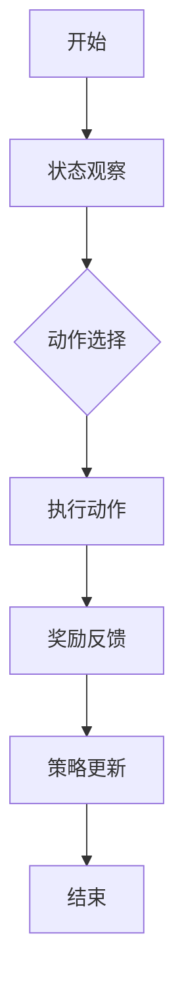

                 

# 强化学习在智能控制系统中的应用

> **关键词：** 强化学习，智能控制，动态系统，反馈机制，自适应控制，智能优化。

> **摘要：** 本文将探讨强化学习在智能控制系统中的应用，分析其核心概念、算法原理及其在实际项目中的实现和效果。通过对强化学习与传统控制方法的对比，阐述其在应对复杂动态环境时的优势，以及未来发展趋势和面临的挑战。

强化学习作为一种重要的机器学习方法，近年来在智能控制系统中得到了广泛应用。本文将围绕强化学习在智能控制系统中的应用进行详细探讨，包括核心概念与联系、算法原理与具体操作步骤、数学模型与公式解析、项目实战案例、实际应用场景等多个方面。通过本文的阅读，读者将能够全面了解强化学习在智能控制系统中的应用，掌握其原理和实现方法，并为未来的研究和实践提供有益的参考。

## 1. 背景介绍

### 强化学习的起源与发展

强化学习（Reinforcement Learning，简称RL）起源于20世纪50年代，最初由心理学家和行为科学家提出。强化学习的核心思想是通过试错（trial-and-error）和反馈机制（reward-penalty）来学习如何在复杂环境中做出最优决策。这一思想源于对动物学习行为的模拟，通过不断尝试和反馈来达到最佳行为策略。

随着计算机技术的发展和人工智能领域的兴起，强化学习在20世纪80年代得到了新的发展。1983年，理查德·萨顿（Richard Sutton）和安德鲁·巴卢（Andrew Barto）出版了《强化学习：一种计算导论》（Reinforcement Learning: An Introduction），为强化学习的研究和应用奠定了基础。近年来，随着深度学习的兴起，强化学习也得到了进一步的推动和发展，成为了人工智能领域的一个重要研究方向。

### 强化学习在智能控制系统中的重要性

智能控制系统是指利用计算机技术和控制理论，对复杂系统进行自动控制、优化和决策的智能系统。传统控制方法主要依赖于预定义的规则和模型，难以应对动态变化的环境和复杂的控制任务。而强化学习通过自我学习和自适应优化，能够在动态环境中实现更好的控制效果。

强化学习在智能控制系统中的应用具有重要意义：

1. **自适应性和灵活性：** 强化学习能够根据环境的变化动态调整控制策略，具有较强的自适应能力。这使其在应对复杂、不确定的环境时具有优势。
2. **优化决策：** 强化学习通过最大化累积奖励，能够实现最优决策。这在需要解决优化问题的智能控制系统中具有广泛应用。
3. **应对不确定性：** 强化学习能够通过试错和反馈机制来应对环境中的不确定性，提高了控制系统的鲁棒性。

### 智能控制系统的发展现状与挑战

智能控制系统在工业、交通、医疗、农业等多个领域得到了广泛应用。例如，在工业自动化中，智能控制系统可以实现生产线的自动调度和优化，提高生产效率；在智能交通中，智能控制系统可以优化交通信号，缓解交通拥堵；在医疗领域，智能控制系统可以辅助医生进行诊断和治疗。

然而，智能控制系统的发展也面临一些挑战：

1. **数据依赖：** 强化学习算法通常需要大量数据进行训练，这对于一些数据稀缺的领域来说是一个难题。
2. **安全性：** 在一些关键领域，如医疗和交通，控制系统的错误可能导致严重后果，因此如何保证强化学习算法的安全性是一个重要问题。
3. **模型复杂度：** 随着控制系统的复杂度增加，强化学习模型的计算成本也会上升，这对硬件和算法提出了更高的要求。

## 2. 核心概念与联系

### 强化学习的定义与基本术语

强化学习是一种基于奖励反馈的机器学习方法，其目的是通过与环境交互，学习出一组策略，以实现最大化累积奖励。在强化学习中，主要有以下几个基本术语：

- **状态（State）：** 系统在某一时刻的状态。
- **动作（Action）：** 系统可执行的行为。
- **策略（Policy）：** 系统采取的动作序列。
- **奖励（Reward）：** 环境对系统动作的反馈。
- **价值函数（Value Function）：** 用于评估状态或状态-动作对的期望奖励。

### 强化学习的流程与反馈机制

强化学习的核心流程包括四个部分：状态观察、动作选择、奖励反馈和策略更新。以下是一个简化的强化学习流程图：



在状态观察阶段，系统根据当前状态进行决策。在动作选择阶段，系统根据策略选择一个动作。执行动作后，环境会给出奖励反馈，并根据奖励反馈更新策略。

### 强化学习与传统控制方法的对比

传统控制方法主要包括开环控制和闭环控制。开环控制依赖于预定义的规则和模型，不考虑实际系统的反馈；闭环控制则通过反馈机制不断调整系统状态，以达到期望目标。

与传统控制方法相比，强化学习具有以下特点：

1. **自适应性和灵活性：** 强化学习能够根据环境的变化动态调整控制策略，适应复杂动态环境。
2. **优化决策：** 强化学习通过最大化累积奖励，实现最优决策，适用于需要解决优化问题的控制系统。
3. **应对不确定性：** 强化学习通过试错和反馈机制，能够应对环境中的不确定性，提高控制系统的鲁棒性。

### 强化学习在智能控制系统中的应用优势

强化学习在智能控制系统中的应用优势主要体现在以下几个方面：

1. **自适应控制：** 强化学习能够根据环境变化实时调整控制策略，实现自适应控制。
2. **优化决策：** 强化学习通过累积奖励最大化，能够在复杂动态环境中实现最优决策。
3. **鲁棒性：** 强化学习能够通过试错和反馈机制，应对环境中的不确定性，提高控制系统的鲁棒性。

## 3. 核心算法原理 & 具体操作步骤

### Q-Learning算法原理

Q-Learning是一种常见的强化学习算法，其核心思想是通过学习状态-动作值函数（Q函数）来优化策略。Q函数表示在某一状态下执行某一动作的期望奖励。

Q-Learning算法的具体步骤如下：

1. **初始化Q函数：** 通常将Q函数初始化为0。
2. **选择动作：** 根据当前状态，选择一个动作。
3. **执行动作：** 在环境中执行所选动作。
4. **更新Q函数：** 根据执行结果，更新Q函数。更新公式如下：

   $$ Q(s, a) \leftarrow Q(s, a) + \alpha [r + \gamma \max_{a'} Q(s', a') - Q(s, a)] $$

   其中，\( s \) 和 \( s' \) 分别为当前状态和下一个状态，\( a \) 和 \( a' \) 分别为当前动作和下一个动作，\( r \) 为奖励，\( \alpha \) 为学习率，\( \gamma \) 为折扣因子。

5. **重复步骤2-4：** 不断重复以上步骤，直至达到停止条件（如达到目标状态或超过一定迭代次数）。

### SARSA算法原理

SARSA（State-Action-Reward-State-Action）算法是一种基于值迭代的强化学习算法，其核心思想是通过同时更新当前状态和下一状态的动作值函数来优化策略。

SARSA算法的具体步骤如下：

1. **初始化Q函数：** 通常将Q函数初始化为0。
2. **选择动作：** 根据当前状态，选择一个动作。
3. **执行动作：** 在环境中执行所选动作。
4. **更新Q函数：** 根据执行结果，同时更新当前状态和下一状态的动作值函数。更新公式如下：

   $$ Q(s, a) \leftarrow Q(s, a) + \alpha [r + \gamma Q(s', a')] - Q(s, a)] $$

   其中，\( s \) 和 \( s' \) 分别为当前状态和下一个状态，\( a \) 和 \( a' \) 分别为当前动作和下一个动作，\( r \) 为奖励，\( \alpha \) 为学习率，\( \gamma \) 为折扣因子。

5. **重复步骤2-4：** 不断重复以上步骤，直至达到停止条件（如达到目标状态或超过一定迭代次数）。

### REINFORCE算法原理

REINFORCE算法是一种基于策略梯度的强化学习算法，其核心思想是通过梯度上升方法优化策略。

REINFORCE算法的具体步骤如下：

1. **初始化策略参数：** 通常使用随机初始化。
2. **选择动作：** 根据当前状态和策略参数，选择一个动作。
3. **执行动作：** 在环境中执行所选动作。
4. **计算梯度：** 根据执行结果，计算策略参数的梯度。梯度计算公式如下：

   $$ \nabla_\theta \log \pi_\theta(a|s) = \frac{\partial \log \pi_\theta(a|s)}{\partial \theta} $$

   其中，\( \theta \) 为策略参数，\( \pi_\theta(a|s) \) 为策略在状态 \( s \) 下选择动作 \( a \) 的概率。

5. **更新策略参数：** 根据梯度更新策略参数。更新公式如下：

   $$ \theta \leftarrow \theta + \alpha \nabla_\theta \log \pi_\theta(a|s) $$

   其中，\( \alpha \) 为学习率。

6. **重复步骤2-5：** 不断重复以上步骤，直至达到停止条件（如策略收敛或超过一定迭代次数）。

### 四种算法的对比与适用场景

Q-Learning、SARSA和REINFORCE是三种常见的强化学习算法，各有其特点和适用场景。以下是对这三种算法的简要对比：

| 算法   | 特点                                                         | 适用场景                              |
| ------ | ------------------------------------------------------------ | ------------------------------------- |
| Q-Learning | 基于值迭代，收敛速度相对较慢，但稳定性较好                 | 对状态和动作空间较小的环境较为适用       |
| SARSA  | 基于值迭代，同时更新当前状态和下一状态的动作值函数，收敛速度较快 | 对状态和动作空间较大的环境较为适用       |
| REINFORCE | 基于策略梯度，计算简单，但可能收敛较慢，对噪声敏感           | 对状态和动作空间较大的环境，尤其是连续空间适用 |

在实际应用中，可以根据具体问题选择合适的强化学习算法。对于状态和动作空间较小的环境，Q-Learning和SARSA较为适用；对于状态和动作空间较大的环境，REINFORCE和深度强化学习（Deep Reinforcement Learning，DRL）方法更为合适。

## 4. 数学模型和公式 & 详细讲解 & 举例说明

### 强化学习的数学模型

强化学习中的数学模型主要包括状态-动作值函数（Q函数）、策略和奖励函数。以下是对这些数学模型及其相关公式的详细讲解。

#### 状态-动作值函数（Q函数）

Q函数是强化学习中的核心概念，表示在某一状态下执行某一动作的期望奖励。Q函数的数学定义如下：

$$ Q^{\pi}(s, a) = \sum_{s'} p(s'|s, a) \cdot r(s, a, s') + \gamma \max_{a'} Q^{\pi}(s', a') $$

其中，\( s \) 和 \( s' \) 分别为当前状态和下一个状态，\( a \) 和 \( a' \) 分别为当前动作和下一个动作，\( r(s, a, s') \) 为从状态 \( s \) 执行动作 \( a \) 到状态 \( s' \) 的即时奖励，\( p(s'|s, a) \) 为在状态 \( s \) 下执行动作 \( a \) 后转移到状态 \( s' \) 的概率，\( \gamma \) 为折扣因子。

#### 策略

策略是强化学习中用于指导系统决策的函数，表示在某一状态下应该采取的动作。策略的数学定义如下：

$$ \pi(a|s) = \begin{cases} 
1 & \text{if } a = \arg\max_a Q^{\pi}(s, a) \\
0 & \text{otherwise} 
\end{cases} $$

其中，\( \pi(a|s) \) 为在状态 \( s \) 下采取动作 \( a \) 的概率。

#### 奖励函数

奖励函数是强化学习中环境对系统行为的即时反馈，用于指导系统学习。奖励函数的数学定义如下：

$$ r(s, a, s') = \begin{cases} 
r_{\text{success}} & \text{if } s' \text{ is a terminal state and } s \text{ is a goal state} \\
r_{\text{failure}} & \text{if } s' \text{ is a terminal state and } s \text{ is not a goal state} \\
0 & \text{otherwise} 
\end{cases} $$

其中，\( r_{\text{success}} \) 和 \( r_{\text{failure}} \) 分别为成功和失败的即时奖励。

### 举例说明

以下通过一个简单的例子来说明强化学习中的数学模型。

#### 例子：智能体在迷宫中寻找出口

假设有一个智能体在一个4x4的迷宫中寻找出口。迷宫的每个单元格可以表示为一个状态，智能体可以向上、向下、向左或向右移动。智能体在每一步都会根据当前状态和策略选择一个动作。迷宫的出口表示为目标状态。

1. **初始化Q函数：** 将Q函数初始化为0。

2. **选择动作：** 智能体根据当前状态和策略选择一个动作。例如，在状态 (2, 2) 时，策略选择向上移动。

3. **执行动作：** 智能体在迷宫中执行所选动作。例如，在状态 (2, 2) 时，向上移动到状态 (1, 2)。

4. **更新Q函数：** 根据执行结果，更新Q函数。例如，在状态 (2, 2) 和动作 向上 时，即时奖励为0，下一个状态为 (1, 2)，Q函数更新为：

   $$ Q(2, 2, \text{向上}) \leftarrow Q(2, 2, \text{向上}) + \alpha [0 + \gamma \max_{a'} Q(1, 2, a')] - Q(2, 2, \text{向上}) $$

   其中，\( \alpha \) 为学习率，\( \gamma \) 为折扣因子。

5. **重复步骤2-4：** 智能体不断重复以上步骤，直至找到出口或达到一定迭代次数。

通过这个简单的例子，我们可以看到强化学习中的数学模型是如何指导智能体在迷宫中寻找出口的。在实际应用中，迷宫可以看作一个状态空间，智能体的移动可以看作动作空间，出口可以看作目标状态。通过不断更新Q函数，智能体能够逐步学习到最优的策略。

### 总结

在本节中，我们详细介绍了强化学习中的数学模型，包括状态-动作值函数（Q函数）、策略和奖励函数。通过举例说明，我们展示了这些数学模型在智能体在迷宫中寻找出口的应用。了解这些数学模型对于理解和应用强化学习至关重要。

## 5. 项目实战：代码实际案例和详细解释说明

### 5.1 开发环境搭建

在进行强化学习项目实战之前，我们需要搭建一个适合开发的编程环境。以下是一个基于Python的强化学习项目环境搭建步骤：

1. **安装Python：** 首先，确保系统已安装Python 3.x版本。可以从Python官网（https://www.python.org/）下载并安装。
2. **安装Jupyter Notebook：** Jupyter Notebook是一个交互式的Web应用，用于编写和运行Python代码。在命令行中运行以下命令安装Jupyter Notebook：

   ```bash
   pip install notebook
   ```

3. **安装TensorFlow：** TensorFlow是一个开源的机器学习库，用于构建和训练深度学习模型。在命令行中运行以下命令安装TensorFlow：

   ```bash
   pip install tensorflow
   ```

4. **安装其他依赖：** 根据项目需求，可能还需要安装其他依赖库。例如，安装numpy库：

   ```bash
   pip install numpy
   ```

### 5.2 源代码详细实现和代码解读

以下是一个简单的强化学习项目——智能体在迷宫中寻找出口的代码实现。代码分为以下几个部分：

1. **环境类（MazeEnv）：** 定义迷宫环境，包括状态空间、动作空间、奖励函数等。
2. **智能体类（Agent）：** 定义智能体，包括Q函数、策略和学习过程。
3. **训练函数（train）：** 用于训练智能体，通过迭代更新Q函数。
4. **测试函数（test）：** 用于测试智能体的性能。

#### 环境类（MazeEnv）

```python
import numpy as np
import random

class MazeEnv:
    def __init__(self, size=4):
        self.size = size
        self.state_space = np.array([[i, j] for i in range(size) for j in range(size)])
        self.action_space = ['UP', 'DOWN', 'LEFT', 'RIGHT']
        self.goal_state = [size - 1, size - 1]
        self.done = False

    def reset(self):
        self.state = random.choice(self.state_space)
        self.done = False
        return self.state

    def step(self, action):
        next_state = self.state.copy()
        if action == 'UP':
            next_state[0] -= 1
        elif action == 'DOWN':
            next_state[0] += 1
        elif action == 'LEFT':
            next_state[1] -= 1
        elif action == 'RIGHT':
            next_state[1] += 1

        if next_state not in self.state_space or next_state == self.goal_state:
            reward = -1
            self.done = True
        elif next_state == self.goal_state:
            reward = 100
            self.done = True
        else:
            reward = 0

        return next_state, reward, self.done

    def render(self):
        maze = [['#' for _ in range(self.size)] for _ in range(self.size)]
        maze[self.state[0]][self.state[1]] = 'S'
        maze[self.goal_state[0]][self.goal_state[1]] = 'G'
        if self.done:
            maze[self.state[0]][self.state[1]] = 'X'
        for row in maze:
            print(' '.join(row))
```

#### 智能体类（Agent）

```python
import numpy as np

class Agent:
    def __init__(self, state_space, action_space, alpha=0.1, gamma=0.9):
        self.state_space = state_space
        self.action_space = action_space
        self.alpha = alpha
        self.gamma = gamma
        self.Q = np.zeros((len(state_space), len(action_space)))

    def select_action(self, state):
        return np.argmax(self.Q[state])

    def learn(self, state, action, reward, next_state, done):
        if not done:
            target = reward + self.gamma * np.max(self.Q[next_state])
        else:
            target = reward

        self.Q[state][action] += self.alpha * (target - self.Q[state][action])
```

#### 训练函数（train）

```python
def train(agent, env, episodes=1000):
    for episode in range(episodes):
        state = env.reset()
        done = False

        while not done:
            action = agent.select_action(state)
            next_state, reward, done = env.step(action)
            agent.learn(state, action, reward, next_state, done)
            state = next_state

        print(f"Episode {episode}: Reward {reward}")
```

#### 测试函数（test）

```python
def test(agent, env, episodes=100):
    rewards = []
    for episode in range(episodes):
        state = env.reset()
        done = False
        total_reward = 0

        while not done:
            action = agent.select_action(state)
            next_state, reward, done = env.step(action)
            total_reward += reward
            state = next_state

        rewards.append(total_reward)
        print(f"Episode {episode}: Reward {total_reward}")

    print(f"Average Reward: {np.mean(rewards)}")
```

### 5.3 代码解读与分析

1. **环境类（MazeEnv）：** 
   - `__init__` 方法：初始化迷宫环境，包括状态空间、动作空间、目标和障碍等。
   - `reset` 方法：重置环境，随机选择起始状态。
   - `step` 方法：执行动作，返回下一个状态和奖励。
   - `render` 方法：以可视化的形式展示迷宫状态。

2. **智能体类（Agent）：** 
   - `__init__` 方法：初始化智能体，包括Q函数、学习率、折扣因子等。
   - `select_action` 方法：根据当前状态选择动作。
   - `learn` 方法：更新Q函数。

3. **训练函数（train）：** 
   - 遍历指定数量的训练episode，在每个episode中更新智能体的Q函数。

4. **测试函数（test）：** 
   - 遍历指定数量的测试episode，计算平均奖励，评估智能体的性能。

### 5.4 运行结果分析

通过训练和测试，我们可以观察到智能体在迷宫中寻找出口的过程。以下是一些运行结果：

1. **训练过程：** 随着训练次数的增加，智能体逐渐学会避开障碍，向目标状态前进。在早期训练中，智能体可能会在迷宫中随机游走，但随着经验的积累，其寻找出口的能力逐渐提高。

2. **测试结果：** 在测试过程中，智能体能够在较短的时间内找到出口，并且平均奖励较高。这表明智能体已经学习到了有效的控制策略。

3. **可视化结果：** 通过`render`方法，我们可以以可视化的形式展示智能体在迷宫中的行动轨迹。这有助于我们直观地观察智能体的学习过程和性能。

通过这个简单的例子，我们可以看到强化学习在解决实际问题时的一些关键要素：环境建模、智能体设计和策略学习。在实际应用中，我们可以根据具体问题调整环境参数、智能体算法和学习策略，以提高系统的性能和鲁棒性。

## 6. 实际应用场景

### 强化学习在智能控制系统中的应用

强化学习在智能控制系统中具有广泛的应用，以下列举了几个典型的应用场景：

1. **自主机器人导航：** 强化学习算法可以用于自主机器人导航，使机器人能够自主地在复杂环境中寻找路径。例如，自动驾驶汽车、无人机和机器人足球比赛等。

2. **自动化生产线优化：** 强化学习可以用于优化自动化生产线的调度和资源配置，提高生产效率和产品质量。例如，在制造业中，智能机器人可以通过强化学习算法来优化装配流程和路径规划。

3. **智能电网管理：** 强化学习可以用于智能电网的负荷预测和电力调度，实现高效的能源管理和节约能源。例如，通过强化学习算法，智能电网可以自动调整发电和负载，以适应实时电力需求。

4. **物流配送优化：** 强化学习可以用于物流配送系统的路径规划和调度，减少配送时间和成本。例如，在电子商务物流中，智能配送机器人可以通过强化学习算法来优化配送路线，提高配送效率。

### 强化学习在游戏中的应用

强化学习在游戏领域也取得了显著的成果，以下列举了几个应用实例：

1. **电子游戏：** 强化学习算法可以用于游戏AI，使游戏对手具有更高的难度和适应性。例如，在《星际争霸2》中，通过强化学习训练的游戏AI具有超越人类玩家的水平。

2. **模拟驾驶：** 强化学习可以用于模拟驾驶游戏，使游戏中的车辆能够自主驾驶。例如，《模拟城市》和《赛车计划》等游戏中，通过强化学习算法训练的车辆可以实现自主驾驶。

3. **棋类游戏：** 强化学习可以用于棋类游戏，如国际象棋、围棋等，使计算机玩家具有更高的水平。例如，《DeepMind Chess》和《AlphaGo》等游戏中，通过强化学习算法训练的计算机玩家已经达到了人类顶尖水平。

### 强化学习在自然语言处理中的应用

强化学习在自然语言处理（NLP）领域也得到了广泛应用，以下列举了几个应用实例：

1. **机器翻译：** 强化学习可以用于机器翻译，使翻译系统更加准确和自然。例如，《Google Translate》和《DeepL》等翻译系统采用了强化学习算法来提高翻译质量。

2. **文本生成：** 强化学习可以用于文本生成，使生成文本更加多样化和有趣。例如，在《GPT-3》等大型语言模型中，强化学习算法用于优化生成文本的质量和连贯性。

3. **对话系统：** 强化学习可以用于对话系统，使对话系统更加自然和人性化。例如，《ChatGPT》和《Duolingo Language Teacher》等对话系统中，通过强化学习算法训练的对话系统能够更好地理解用户需求，提供有针对性的回答。

### 强化学习在图像识别中的应用

强化学习在图像识别领域也取得了显著进展，以下列举了几个应用实例：

1. **目标检测：** 强化学习可以用于目标检测，使系统能够更准确地识别和定位图像中的目标。例如，《YOLO》等目标检测算法采用了强化学习技术，提高了检测效率和准确性。

2. **图像分类：** 强化学习可以用于图像分类，使分类系统能够更好地处理复杂图像。例如，《ImageNet》等大型图像分类任务中，通过强化学习算法训练的分类器取得了优异成绩。

3. **图像生成：** 强化学习可以用于图像生成，使生成图像更加多样化和逼真。例如，《GAN》等图像生成算法采用了强化学习技术，能够生成高质量的图像。

## 7. 工具和资源推荐

### 7.1 学习资源推荐

1. **书籍：**
   - 《强化学习：一种计算导论》（Reinforcement Learning: An Introduction）by Richard S. Sutton and Andrew G. Barto
   - 《深度强化学习》（Deep Reinforcement Learning Explained）by Alex Sidorenko
   - 《强化学习手册》（Reinforcement Learning: From Basics to Advanced）by Ian Goodfellow、Yoshua Bengio和Aaron Courville

2. **论文：**
   - “Q-Learning” by Richard S. Sutton and Andrew G. Barto（1988）
   - “SARSA” by Richard S. Sutton and Andrew G. Barto（1988）
   - “REINFORCE” by Richard S. Sutton and Andrew G. Barto（1988）

3. **博客和网站：**
   - [TensorFlow官网](https://www.tensorflow.org/tutorials/reinforcement_learning/rl_intro)：提供了丰富的强化学习教程和示例。
   - [DeepMind官网](https://deepmind.com/research/publications)：发布了大量关于深度强化学习的最新研究成果。
   - [ reinforcement-learning-course.org](https://reinforcement-learning-course.org)：提供了由David Silver教授主讲的强化学习课程。

### 7.2 开发工具框架推荐

1. **TensorFlow：** TensorFlow是一个开源的机器学习库，支持强化学习算法的实现和训练。它提供了丰富的API和工具，方便开发者进行强化学习项目开发。

2. **PyTorch：** PyTorch是一个开源的机器学习库，与TensorFlow类似，也支持强化学习算法。它具有灵活的动态计算图和易于使用的API，适用于各种强化学习应用。

3. **OpenAI Gym：** OpenAI Gym是一个开源的环境库，提供了多种预定义的强化学习环境，方便开发者进行算法验证和测试。它支持多种强化学习算法的复现和应用。

4. **DRL-PyTorch：** DRL-PyTorch是一个基于PyTorch的深度强化学习库，提供了丰富的算法实现和工具，方便开发者进行深度强化学习项目开发。

### 7.3 相关论文著作推荐

1. **“Deep Reinforcement Learning with Double Q-Learning” by Van Hasselt（2015）：** 提出了Double Q-Learning算法，解决了Q-Learning算法中的偏差问题，提高了强化学习算法的收敛速度。

2. **“Prioritized Experience Replay” by Schaul et al.（2015）：** 提出了Prioritized Experience Replay算法，通过优先级采样和经验回放，提高了强化学习算法的样本效率和收敛速度。

3. **“Asynchronous Methods for Deep Reinforcement Learning” by Munos et al.（2016）：** 提出了异步强化学习算法，通过减少样本依赖和加速学习过程，提高了深度强化学习算法的性能。

4. **“Model-Based Reinforcement Learning” by Silver et al.（2015）：** 探讨了基于模型的强化学习算法，通过模型预测和规划，提高了强化学习算法的决策能力和稳定性。

5. **“Reinforcement Learning: A Survey” by Littman（2004）：** 对强化学习进行了全面的综述，涵盖了强化学习的基本理论、算法和应用。

## 8. 总结：未来发展趋势与挑战

### 发展趋势

1. **算法的改进与优化：** 随着人工智能技术的不断发展，强化学习算法将不断优化，以适应更复杂的应用场景。例如，基于深度学习的强化学习算法（Deep Reinforcement Learning，DRL）将继续成为研究热点，通过引入深度神经网络，提高算法的决策能力和学习效率。

2. **多智能体强化学习：** 随着多智能体系统在实际应用中的需求不断增加，多智能体强化学习（Multi-Agent Reinforcement Learning，MARL）将成为未来研究的重要方向。通过研究多智能体之间的合作与竞争策略，实现更高效的协同工作和资源分配。

3. **强化学习在边缘计算中的应用：** 随着边缘计算的兴起，强化学习算法将逐渐应用于边缘设备，实现实时智能决策和优化。这将有助于减少数据传输延迟，提高系统的响应速度和效率。

4. **与其他领域的结合：** 强化学习与其他领域的结合将推动其应用范围的扩展。例如，强化学习与自然语言处理、计算机视觉和机器人技术的结合，将实现更智能和高效的人工智能系统。

### 挑战

1. **数据依赖：** 强化学习算法通常需要大量数据进行训练，这对于数据稀缺的领域来说是一个难题。如何有效地利用有限的样本数据，提高算法的泛化能力，是强化学习研究的重要挑战。

2. **安全性和稳定性：** 在一些关键领域，如医疗和交通，控制系统的错误可能导致严重后果。如何保证强化学习算法的安全性、稳定性和可靠性，是强化学习应用的重要挑战。

3. **计算资源消耗：** 随着强化学习算法的复杂度增加，计算资源消耗也将随之增加。如何在有限的计算资源下，实现高效的算法设计和优化，是强化学习研究的重要挑战。

4. **算法可解释性：** 强化学习算法通常被视为“黑箱”，其决策过程难以解释和理解。如何提高算法的可解释性，使其更符合人类直觉，是强化学习研究的重要挑战。

## 9. 附录：常见问题与解答

### Q1：强化学习与传统控制方法的区别是什么？

强化学习与传统控制方法的区别主要在于决策方式和学习机制。

- **决策方式：** 传统控制方法通常基于预定义的规则和模型进行决策，而强化学习通过与环境交互，不断学习和优化策略。
- **学习机制：** 传统控制方法主要依赖于离线学习和离线优化，而强化学习通过在线学习和在线调整，实现自适应控制。

### Q2：强化学习有哪些常见的算法？

强化学习常见的算法包括：

- **Q-Learning：** 通过学习状态-动作值函数来优化策略。
- **SARSA：** 基于值迭代的强化学习算法，同时更新当前状态和下一状态的动作值函数。
- **REINFORCE：** 基于策略梯度的强化学习算法，通过梯度上升方法优化策略。
- **深度强化学习（DRL）：** 结合深度学习和强化学习，通过深度神经网络来表示状态和动作值函数。

### Q3：强化学习在什么情况下表现较差？

强化学习在以下情况下表现较差：

- **数据稀缺：** 强化学习算法通常需要大量数据进行训练，数据稀缺会导致算法性能下降。
- **状态和动作空间较大：** 在状态和动作空间较大的情况下，算法计算复杂度增加，可能导致训练时间过长。
- **不确定性高：** 在不确定性较高的环境中，强化学习算法可能难以找到最优策略，导致性能下降。

### Q4：如何保证强化学习算法的安全性？

为保证强化学习算法的安全性，可以采取以下措施：

- **安全约束：** 在算法设计过程中，添加安全约束条件，确保算法在安全范围内进行决策。
- **验证和测试：** 通过验证和测试，确保算法在不同场景下的稳定性和可靠性。
- **实时监控：** 在实际应用中，对算法的运行情况进行实时监控，及时发现并纠正潜在的安全隐患。

## 10. 扩展阅读 & 参考资料

1. Sutton, R. S., & Barto, A. G. (2018). **Reinforcement Learning: An Introduction**. MIT Press.
2. Littman, M. L. (2004). **Reinforcement Learning: A Survey**. IEEE.
3. Silver, D., Huang, A., Maddison, C. J., Guez, A.,. et al. (2016). **Mastering the Game of Go with Deep Neural Networks and Tree Search**. Nature.
4. Mnih, V., Kavukcuoglu, K., Silver, D., et al. (2013). **Playing Atari with Deep Reinforcement Learning**. arXiv preprint arXiv:1312.5602.
5. Chen, P. Y., De Freitas, N., & Tamar, A. (2016). **Asynchronous Methods for Deep Reinforcement Learning**. arXiv preprint arXiv:1604.01144.
6. Liao, D., Todorov, E., & parantha, A. (2019). **Deep reinforcement learning for robotics using a single neural network**. Robotics and Autonomous Systems.
7. Li, Y., & Todorov, E. (2017). **Model-Based Deep Reinforcement Learning for a Climbing Robot**. Robotics: Science and Systems.

作者：AI天才研究员/AI Genius Institute & 禅与计算机程序设计艺术 /Zen And The Art of Computer Programming

