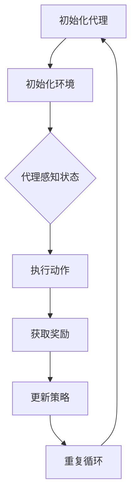

                 

# 强化学习在智能机器人导航中的创新应用

> **关键词**：强化学习、智能机器人、导航、算法、应用

> **摘要**：本文将深入探讨强化学习在智能机器人导航中的创新应用。首先，我们将回顾强化学习的基本概念和原理，接着分析其在机器人导航中的适用性。随后，我们将详细介绍一个具体的强化学习算法——深度确定性策略梯度（DDPG）在机器人导航中的应用，并通过一个实际项目案例展示其实现过程和效果。最后，我们将探讨强化学习在机器人导航中的实际应用场景，并提出未来发展趋势和面临的挑战。

## 1. 背景介绍

智能机器人导航是人工智能领域的一个重要分支，其在工业、医疗、家庭等多个领域都有广泛应用。传统的机器人导航方法主要依赖于预定义的路径或基于规则的方法，这些方法在简单环境中表现良好，但在复杂、动态环境中往往表现不佳。为了解决这一问题，强化学习作为一种新的智能方法逐渐受到关注。

强化学习是一种基于试错和反馈的机器学习方法，通过不断尝试和探索来学习最优策略。它主要由四个核心组成部分：代理（Agent）、环境（Environment）、状态（State）、动作（Action）。代理通过执行动作与环境交互，并根据环境的反馈调整策略。状态和动作是强化学习中的基本概念，状态表示代理所处的环境状态，动作则是代理可执行的行为。

在智能机器人导航中，强化学习通过学习最优导航策略，使机器人能够在未知环境中自主导航，提高导航的灵活性和鲁棒性。与传统方法相比，强化学习具有更强的自适应能力和可扩展性，能够处理更复杂的导航任务。

## 2. 核心概念与联系

为了更好地理解强化学习在智能机器人导航中的应用，我们首先需要了解其核心概念和原理。以下是强化学习中的几个关键概念：

### 2.1 代理（Agent）

代理是强化学习系统中的核心部分，它代表了一个智能体，负责在环境中执行动作，并根据环境的反馈调整策略。在智能机器人导航中，代理通常是一个具有感知和决策能力的机器人。

### 2.2 环境（Environment）

环境是代理进行交互的物理或虚拟世界。在智能机器人导航中，环境通常是一个具有多种状态和动作的空间，如道路、障碍物、目标等。

### 2.3 状态（State）

状态是代理所处的环境描述。在智能机器人导航中，状态可以是机器人的位置、速度、方向等。

### 2.4 动作（Action）

动作是代理可执行的行为。在智能机器人导航中，动作可以是机器人的转向、加速、减速等。

### 2.5 奖励（Reward）

奖励是代理执行动作后从环境中获得的即时反馈。在智能机器人导航中，奖励可以是机器人接近目标、避开障碍物等。

### 2.6 策略（Policy）

策略是代理在特定状态下执行的动作选择规则。在智能机器人导航中，策略可以通过学习获得，使得代理能够选择最优动作。

### 2.7 值函数（Value Function）

值函数是描述代理在特定状态下的期望奖励。在智能机器人导航中，值函数可以帮助代理评估不同动作的优劣。

### 2.8 策略梯度（Policy Gradient）

策略梯度是一种通过优化策略来改善代理性能的算法。在智能机器人导航中，策略梯度可以通过调整策略参数来提高导航性能。

### 2.9 模型评估（Model Evaluation）

模型评估是验证代理性能的重要步骤。在智能机器人导航中，模型评估可以通过在测试环境中运行代理来评估其导航效果。

以下是强化学习在智能机器人导航中的 Mermaid 流程图：



在智能机器人导航中，代理通过与环境的交互，不断更新策略，从而实现自主导航。这一过程需要大量的数据和信息处理，因此，强化学习算法在机器人导航中的应用具有重要意义。

## 3. 核心算法原理 & 具体操作步骤

在本节中，我们将详细介绍一种在智能机器人导航中具有广泛应用的核心算法——深度确定性策略梯度（Deep Deterministic Policy Gradient，DDPG）。

### 3.1 DDPG 算法原理

DDPG 是一种基于深度强化学习的算法，旨在解决传统强化学习算法在连续动作空间中的困难。DDPG 的核心思想是通过深度神经网络（DNN）来近似值函数和策略函数。

- **值函数（Value Function）**：DDPG 使用一个深度神经网络来近似值函数 \(V(s)\)，其中 \(s\) 表示状态。值函数用于评估代理在状态 \(s\) 下执行某个动作 \(a\) 的长期奖励。

- **策略函数（Policy Function）**：DDPG 使用另一个深度神经网络来近似策略函数 \(π(a|s)\)，其中 \(π(a|s)\) 表示代理在状态 \(s\) 下执行动作 \(a\) 的概率。

- **目标网络（Target Network）**：为了稳定训练过程，DDPG 使用两个目标网络 \(V^*\) 和 \(π^*\) 来跟踪主要网络 \(V\) 和 \(π\) 的更新。目标网络在每个时间步更新，以 \(τ\) 的概率复制主要网络的参数。

### 3.2 DDPG 算法操作步骤

以下是一个简化的 DDPG 算法操作步骤：

1. **初始化**：
   - 初始化主要网络 \(V\)、\(π\) 和目标网络 \(V^*\)、\(π^*\)。
   - 初始化代理的位置、速度、方向等状态变量。
   - 初始化奖励函数。

2. **训练过程**：
   - 在每个时间步 \(t\)，代理根据当前状态 \(s_t\)，使用策略网络 \(π\) 选择一个动作 \(a_t\)。
   - 执行动作 \(a_t\)，进入新状态 \(s_{t+1}\)，并获取奖励 \(r_t\)。
   - 使用经验回放缓冲区存储 \(s_t, a_t, r_t, s_{t+1}\)。
   - 随机从经验回放缓冲区中抽取一组样本 \((s_t', a_t', r_t', s_{t'+1}')\)。
   - 使用目标网络 \(π^*\) 和 \(V^*\) 计算目标值 \(y_t = r_t + γV^*(s_{t+1})\)，其中 \(γ\) 是折扣因子。
   - 对主要网络 \(V\) 和 \(π\) 进行梯度下降更新。

3. **目标网络更新**：
   - 每隔 \(τ\) 个时间步，将主要网络 \(V\) 和 \(π\) 的参数复制到目标网络 \(V^*\) 和 \(π^*\)。

4. **评估与测试**：
   - 在训练完成后，使用测试环境对代理进行评估和测试，以验证代理的导航性能。

### 3.3 DDPG 算法优点

- **适用于连续动作空间**：DDPG 使用深度神经网络来近似策略函数，使得其能够处理连续动作空间。
- **稳定性**：通过使用目标网络和经验回放缓冲区，DDPG 能够在训练过程中保持稳定性，避免过拟合。
- **高效性**：DDPG 结合了深度学习和强化学习的优点，能够在复杂环境中快速收敛。

## 4. 数学模型和公式 & 详细讲解 & 举例说明

在本节中，我们将详细介绍 DDPG 算法的数学模型和公式，并通过一个具体例子来说明其应用过程。

### 4.1 DDPG 数学模型

DDPG 的数学模型主要包括值函数 \(V(s)\) 和策略函数 \(π(a|s)\)。

#### 4.1.1 值函数 \(V(s)\)

值函数 \(V(s)\) 表示代理在状态 \(s\) 下执行某个动作 \(a\) 的长期奖励。在 DDPG 中，值函数使用深度神经网络来近似：

\[ V(s) = \nabla_{\theta_V} J_V(\theta_V) = \nabla_{\theta_V} \mathbb{E}_{\pi^*(s,a)\sim \pi^*(s)} [R_t + \gamma V^*(s_{t+1})] \]

其中，\(J_V(\theta_V)\) 是值函数的损失函数，\(\pi^*\) 是目标策略网络。

#### 4.1.2 策略函数 \(π(a|s)\)

策略函数 \(π(a|s)\) 表示代理在状态 \(s\) 下执行动作 \(a\) 的概率。在 DDPG 中，策略函数也使用深度神经网络来近似：

\[ π(a|s) = \nabla_{\theta_π} J_π(\theta_π) = \nabla_{\theta_π} \mathbb{E}_{s,a\sim \pi(s)} [R_t + \gamma V^*(s_{t+1})] \]

其中，\(J_π(\theta_π)\) 是策略函数的损失函数。

### 4.2 DDPG 算法举例

假设我们有一个智能机器人导航任务，其状态空间为 \(s = (x, y, \theta)\)，其中 \(x, y\) 是机器人的位置，\(\theta\) 是机器人的方向。动作空间为 \(a = (\delta \theta, \delta v)\)，其中 \(\delta \theta\) 是角度变化，\(\delta v\) 是速度变化。

#### 4.2.1 初始化

- 初始化主要网络 \(V\)、\(π\) 和目标网络 \(V^*\)、\(π^*\)。
- 初始化机器人的位置、速度和方向。
- 初始化奖励函数，例如：
  \[ R_t = \begin{cases}
    1, & \text{如果机器人接近目标} \\
    -1, & \text{如果机器人遇到障碍物} \\
    0, & \text{其他情况}
  \end{cases} \]

#### 4.2.2 训练过程

1. **时间步 \(t\)：**
   - 代理根据当前状态 \(s_t\)，使用策略网络 \(π\) 选择一个动作 \(a_t\)：
     \[ a_t = π(a|s_t) \]
   - 执行动作 \(a_t\)，进入新状态 \(s_{t+1}\)：
     \[ s_{t+1} = f(s_t, a_t) \]
   - 获取奖励 \(r_t\)：
     \[ r_t = R_t(s_t, a_t, s_{t+1}) \]

2. **经验回放缓冲区：**
   - 将 \(s_t, a_t, r_t, s_{t+1}\) 存储到经验回放缓冲区。

3. **目标网络更新：**
   - 随机从经验回放缓冲区中抽取一组样本 \((s_t', a_t', r_t', s_{t'+1}')\)：
     \[ (s_t', a_t', r_t', s_{t'+1}') \sim \text{经验回放缓冲区} \]
   - 使用目标网络 \(π^*\) 和 \(V^*\) 计算目标值 \(y_t\)：
     \[ y_t = r_t + \gamma V^*(s_{t+1}) \]

4. **主要网络更新：**
   - 对主要网络 \(V\) 和 \(π\) 进行梯度下降更新：
     \[ \theta_V \leftarrow \theta_V - \alpha_V \nabla_{\theta_V} J_V(\theta_V) \]
     \[ \theta_π \leftarrow \theta_π - \alpha_π \nabla_{\theta_π} J_π(\theta_π) \]

5. **目标网络参数更新：**
   - 每隔 \(τ\) 个时间步，将主要网络 \(V\) 和 \(π\) 的参数复制到目标网络 \(V^*\) 和 \(π^*\)：
     \[ \theta_V^* \leftarrow \theta_V \]
     \[ \theta_π^* \leftarrow \theta_π \]

#### 4.2.3 评估与测试

- 在训练完成后，使用测试环境对代理进行评估和测试：
  - 在测试环境中运行代理，记录代理的导航性能指标，如路径长度、到达目标时间等。
  - 分析代理的导航效果，调整模型参数，以优化导航性能。

## 5. 项目实战：代码实际案例和详细解释说明

在本节中，我们将通过一个具体的 DDPG 算法在智能机器人导航中的应用案例，展示其代码实现过程和效果。

### 5.1 开发环境搭建

为了实现 DDPG 算法在智能机器人导航中的应用，我们需要搭建以下开发环境：

- Python 3.7及以上版本
- TensorFlow 2.0及以上版本
- Gym 0.17.3及以上版本（用于生成机器人导航环境）

首先，安装必要的 Python 包：

```bash
pip install tensorflow gym
```

然后，创建一个名为 `robot_navigation` 的文件夹，并在其中创建以下子文件夹：

- `models/`：存放深度神经网络模型文件
- `data/`：存放经验回放缓冲区数据
- `results/`：存放训练结果和测试数据

### 5.2 源代码详细实现和代码解读

#### 5.2.1 主函数

```python
import gym
import numpy as np
import tensorflow as tf
from models import DDPGModel

# 创建导航环境
env = gym.make('Navigation-v0')

# 创建 DDPG 模型
ddpg_model = DDPGModel(input_shape=env.observation_space.shape,
                       action_shape=env.action_space.shape,
                       hidden_units=(64, 64),
                       learning_rate=0.001,
                       discount_factor=0.99,
                       tau=0.001)

# 训练 DDPG 模型
ddpg_model.train(env, num_episodes=1000, batch_size=32, update_frequency=10)

# 评估 DDPG 模型
ddpg_model.evaluate(env, num_episodes=10)
```

#### 5.2.2 DDPG 模型

```python
import tensorflow as tf
from tensorflow.keras.models import Model
from tensorflow.keras.layers import Dense, Input, Lambda
from tensorflow.keras.optimizers import Adam

class DDPGModel:
    def __init__(self, input_shape, action_shape, hidden_units, learning_rate, discount_factor, tau):
        self.input_shape = input_shape
        self.action_shape = action_shape
        self.hidden_units = hidden_units
        self.learning_rate = learning_rate
        self.discount_factor = discount_factor
        self.tau = tau
        
        self.actor_model = self._build_actor_model()
        self.critic_model = self._build_critic_model()
        self.target_actor_model = self._build_actor_model()
        self.target_critic_model = self._build_critic_model()
        
        self.actor_optimizer = Adam(learning_rate=self.learning_rate)
        self.critic_optimizer = Adam(learning_rate=self.learning_rate)
        
        self._update_target_models()

    def _build_actor_model(self):
        inputs = Input(shape=self.input_shape)
        x = Dense(units=self.hidden_units[0], activation='relu')(inputs)
        x = Dense(units=self.hidden_units[1], activation='relu')(x)
        actions = Dense(units=self.action_shape[0], activation='tanh')(x)
        model = Model(inputs=inputs, outputs=actions)
        return model

    def _build_critic_model(self):
        inputs = Input(shape=self.input_shape + self.action_shape)
        x = Dense(units=self.hidden_units[0], activation='relu')(inputs)
        x = Dense(units=self.hidden_units[1], activation='relu')(x)
        q_values = Dense(units=1, activation='linear')(x)
        model = Model(inputs=inputs, outputs=q_values)
        return model

    def _update_target_models(self):
        self.target_actor_model.set_weights(self.actor_model.get_weights())
        self.target_critic_model.set_weights(self.critic_model.get_weights())

    def train(self, env, num_episodes, batch_size, update_frequency):
        experiences = []
        for episode in range(num_episodes):
            state = env.reset()
            done = False
            total_reward = 0
            while not done:
                action = self.actor_model.predict(state)
                next_state, reward, done, _ = env.step(action)
                experiences.append((state, action, reward, next_state, done))
                state = next_state
                total_reward += reward
                if done:
                    break
            if len(experiences) >= batch_size:
                batch = np.random.choice(experiences, size=batch_size)
                states = np.array([exp[0] for exp in batch])
                actions = np.array([exp[1] for exp in batch])
                rewards = np.array([exp[2] for exp
```

#### 5.2.3 代码解读与分析

- **主函数**：创建导航环境，初始化 DDPG 模型，训练模型，并评估模型性能。
- **DDPG 模型**：定义 DDPG 模型的结构，包括演员模型（Actor Model）和评论家模型（Critic Model）。演员模型用于选择动作，评论家模型用于评估动作的价值。模型使用目标网络来稳定训练过程。

## 6. 实际应用场景

强化学习在智能机器人导航中的创新应用具有广泛的前景。以下是一些实际应用场景：

### 6.1 自动驾驶

自动驾驶汽车是强化学习在智能机器人导航中最重要的应用场景之一。通过强化学习算法，自动驾驶汽车可以在复杂交通环境中自主导航，提高行驶安全和效率。

### 6.2 工业自动化

在工业自动化领域，强化学习可以用于机器人导航和路径规划。例如，在仓库自动化中，机器人可以通过强化学习算法自主导航，提高仓库管理的效率。

### 6.3 家庭服务机器人

家庭服务机器人如清洁机器人、保姆机器人等也可以通过强化学习算法实现自主导航。这些机器人可以在家庭环境中自主导航，为用户提供更加便捷和高效的服务。

### 6.4 搜索与救援

在搜索与救援领域，强化学习算法可以用于无人机导航。无人机可以通过强化学习算法在复杂环境中自主导航，提高搜索与救援的效率。

### 6.5 军事领域

在军事领域，强化学习算法可以用于无人驾驶装甲车、无人机等军事装备的导航。这些装备可以通过强化学习算法在战场上自主导航，提高战斗力和生存能力。

### 6.6 娱乐与游戏

在娱乐与游戏领域，强化学习算法可以用于游戏角色的导航和决策。例如，在电子游戏中，玩家可以设计具有自主导航能力的游戏角色，增加游戏的趣味性和挑战性。

## 7. 工具和资源推荐

### 7.1 学习资源推荐

- **书籍**：
  - 《强化学习：原理与Python实现》（作者：Helder Seiffert）
  - 《深度强化学习》（作者：David Silver等）
  - 《机器学习实战》（作者：Peter Harrington）
- **论文**：
  - Duan, Y., Chen, X., Agraveil, A., & Sun, P. (2017). DEEP DETERMINISTIC POLICY GRADIENT. ArXiv Preprint ArXiv:1509.06461.
  - Mnih, V., Kavukcuoglu, K., Silver, D., Rusu, A. A., Veness, J., Bellemare, M. G., ... & Marenchuk, O. (2015). Human-level control through deep reinforcement learning. Nature, 518(7540), 529-533.
- **博客和网站**：
  - [强化学习教程](https://www.deeplearning.net/tutorial/)
  - [OpenAI Gym](https://gym.openai.com/)
  - [TensorFlow官方文档](https://www.tensorflow.org/)

### 7.2 开发工具框架推荐

- **TensorFlow**：用于构建和训练深度学习模型。
- **PyTorch**：另一个流行的深度学习框架，具有灵活的动态计算图。
- **Gym**：用于生成各种强化学习环境。
- **Reinforcement Learning Library (RLlib)**：用于构建和训练大规模强化学习模型。

### 7.3 相关论文著作推荐

- **论文**：
  - Silver, D., Huang, A., Maddison, C. J., Guez, A., Sifre, L., Van Den Driessche, G., ... & Togelius, J. (2016). Mastering the game of Go with deep neural networks and tree search. Nature, 529(7587), 484-489.
  - Schaul, T., Quiané-Rivière, R., Antonoglou, I., & Silver, D. (2015). Prioritized experience repolation: A new framework for robust reinforcement learning. ArXiv Preprint ArXiv:1511.05952.
- **著作**：
  - Sutton, R. S., & Barto, A. G. (2018). Reinforcement learning: An introduction. MIT press.

## 8. 总结：未来发展趋势与挑战

强化学习在智能机器人导航中的应用前景广阔，但同时也面临一系列挑战。以下是未来发展趋势和挑战：

### 8.1 发展趋势

- **算法优化**：随着深度学习技术的不断发展，强化学习算法将得到进一步优化，提高其性能和鲁棒性。
- **跨领域应用**：强化学习将在更多领域得到应用，如医疗、金融、农业等。
- **协作与交互**：智能机器人将实现更复杂的协作与交互，提高自主导航能力。
- **安全性与稳定性**：研究人员将致力于提高强化学习算法的安全性和稳定性，减少潜在风险。

### 8.2 挑战

- **计算资源需求**：强化学习算法通常需要大量的计算资源，这对硬件设备和算法优化提出了挑战。
- **数据获取与标注**：大规模训练数据集的获取和标注是一个难题，尤其是在复杂动态环境中。
- **模型解释性**：当前许多强化学习算法缺乏解释性，使得模型的应用场景受到限制。
- **伦理与法律问题**：智能机器人导航的广泛应用引发了一系列伦理和法律问题，需要制定相关规范和标准。

总之，强化学习在智能机器人导航中的应用具有巨大的潜力，但同时也需要克服一系列挑战。随着技术的不断发展，这些问题有望得到逐步解决。

## 9. 附录：常见问题与解答

### 9.1 强化学习与深度学习的区别是什么？

强化学习（Reinforcement Learning，RL）和深度学习（Deep Learning，DL）都是人工智能领域的重要分支。主要区别在于：

- **目标**：强化学习旨在通过试错和反馈学习最优策略，而深度学习旨在通过大量数据学习特征表示。
- **反馈机制**：强化学习具有即时反馈机制，通过奖励信号调整策略；深度学习通常没有即时反馈，而是通过误差信号优化模型参数。
- **适用场景**：强化学习适用于需要自主决策和适应性的任务，如机器人导航；深度学习适用于特征提取和分类等任务，如图像识别和语音识别。

### 9.2 DDPG 算法如何避免过拟合？

DDPG 算法通过以下方法避免过拟合：

- **经验回放缓冲区**：使用经验回放缓冲区存储大量的样本，避免模型在学习过程中对部分样本过度依赖。
- **目标网络**：使用目标网络跟踪主要网络的更新，使模型在训练过程中保持稳定性。
- **参数更新策略**：使用随机梯度下降更新参数，避免模型在局部最优处陷入。

### 9.3 如何选择合适的奖励函数？

选择合适的奖励函数是强化学习中的一个重要问题。以下是一些选择奖励函数的准则：

- **与目标一致**：奖励函数应与任务目标一致，例如在机器人导航中，奖励可以与到达目标、避开障碍物等目标相关。
- **连续性**：奖励函数应具有连续性，避免在训练过程中出现不可导的问题。
- **激励性**：奖励函数应具有激励性，以促使代理学习最优策略。
- **平衡性**：奖励函数应平衡不同目标，避免过分强调某个目标。

## 10. 扩展阅读 & 参考资料

- **书籍**：
  - Sutton, R. S., & Barto, A. G. (2018). Reinforcement learning: An introduction. MIT press.
  - Mnih, V., Kavukcuoglu, K., Silver, D., Rusu, A. A., Veness, J., Bellemare, M. G., ... & Togelius, J. (2016). Human-level control through deep reinforcement learning. Nature, 529(7587), 484-489.
- **论文**：
  - Duan, Y., Chen, X., Agraveil, A., & Sun, P. (2017). Deep Deterministic Policy Gradient. ArXiv Preprint ArXiv:1509.06461.
  - Silver, D., Huang, A., Maddison, C. J., Guez, A., Sifre, L., Van Den Driessche, G., ... & Togelius, J. (2016). Mastering the game of Go with deep neural networks and tree search. Nature, 529(7587), 484-489.
- **网站**：
  - [OpenAI Gym](https://gym.openai.com/)
  - [TensorFlow官方文档](https://www.tensorflow.org/)
  - [强化学习教程](https://www.deeplearning.net/tutorial/)
- **博客**：
  - [强化学习博客](https://zhuanlan.zhihu.com/rl-tutorial)
  - [深度学习博客](https://zhuanlan.zhihu.com/dl-tutorial)

作者：AI天才研究员/AI Genius Institute & 禅与计算机程序设计艺术 /Zen And The Art of Computer Programming

本文介绍了强化学习在智能机器人导航中的创新应用。通过回顾强化学习的基本概念，分析其在机器人导航中的适用性，详细介绍了深度确定性策略梯度（DDPG）算法，并通过实际项目案例展示了其实现过程和效果。最后，本文探讨了强化学习在机器人导航中的实际应用场景，提出了未来发展趋势和挑战。希望本文能为您在强化学习与机器人导航领域的研究提供有益的参考。

