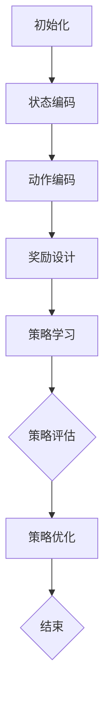

                 

### 背景介绍

强化学习（Reinforcement Learning，RL）作为机器学习领域的一个重要分支，近年来在智能电网的需求响应中展现出强大的应用潜力。智能电网是一种通过信息技术、自动化控制和智能设备，实现能量高效传输、分配和使用的现代电力系统。随着可再生能源的广泛应用和电力需求的持续增长，智能电网的需求响应成为实现能源优化和电力系统稳定的关键。

#### 智能电网与需求响应

智能电网的需求响应是指电力系统根据实时电力需求和供应情况，自动调整电力负荷和电源出力，以实现能源供需平衡。这需要高度智能化的方法来实时监测电力系统的运行状态，并根据预测和优化算法进行动态调整。传统的方法往往依赖于预设的规则或线性规划，但在面对复杂多变的电力市场和环境时，效果有限。

#### 强化学习的优势

强化学习通过智能体与环境不断交互，学习最优策略，从而实现决策优化。其核心思想是通过奖励机制，鼓励智能体采取有益的行动，并逐渐摒弃不利的行动。这一特性使得强化学习在处理动态、不确定和复杂环境时具有显著优势。

1. **自适应性和灵活性**：强化学习能够根据环境的变化自适应地调整策略，这对于电力系统中的需求响应具有重要意义。
2. **优化决策**：强化学习能够通过学习到的策略，实现电力负荷和电源出力的最优调整，从而提高能源利用效率，降低能源成本。
3. **应对不确定性**：电力系统中的天气变化、设备故障等不确定性因素，可以通过强化学习中的奖励机制来应对，从而提高系统的稳定性和可靠性。

#### 强化学习在智能电网需求响应中的研究现状

近年来，国内外学者纷纷将强化学习应用于智能电网的需求响应中。一些研究表明，通过强化学习算法，可以有效提高电力系统的负荷预测精度，优化电力资源分配，降低能源消耗，提高系统运行效率。然而，强化学习在智能电网中的实际应用仍面临诸多挑战，如算法的复杂度、计算资源的消耗、数据的获取和处理等。

总之，强化学习在智能电网需求响应中的应用前景广阔，但其研究和发展仍需不断深入和探索。

### 核心概念与联系

#### 强化学习的基本概念

强化学习（Reinforcement Learning，RL）是一种通过智能体（Agent）与环境（Environment）交互，学习最优策略（Policy）的机器学习方法。其核心概念包括：

- **智能体（Agent）**：执行动作的实体，旨在最大化累积奖励。
- **环境（Environment）**：智能体所处的动态环境，通过状态（State）向智能体提供反馈。
- **状态（State）**：描述智能体在某一时刻所处的环境特征。
- **动作（Action）**：智能体在某一状态下能够执行的行为。
- **奖励（Reward）**：衡量智能体执行动作后环境对它的反馈，用于指导智能体选择动作。

#### 强化学习的核心算法

强化学习算法可以分为值函数方法（如Q-Learning）和策略搜索方法（如Policy Gradient）。其中，Q-Learning是一种基于值函数的强化学习算法，其核心思想是学习状态-动作值函数（Q-Function），即智能体在某一状态下执行某一动作所能获得的期望奖励。具体步骤如下：

1. **初始化**：随机初始化Q值表。
2. **循环**：
   - **选择动作**：根据当前状态，使用ε-贪心策略选择动作。
   - **执行动作**：在环境中执行选择的动作，并获得新的状态和奖励。
   - **更新Q值**：根据新的状态和奖励，更新Q值表。

#### 强化学习在智能电网需求响应中的应用

在智能电网需求响应中，强化学习可以通过以下步骤实现：

1. **状态编码**：将电力系统的运行状态（如负荷、电压、频率等）编码为状态向量。
2. **动作编码**：将电力系统的调节策略（如调节电源出力、切换负载等）编码为动作向量。
3. **奖励设计**：设计合适的奖励函数，以鼓励智能体采取有益的调节策略。例如，可以设计奖励函数，使智能体在降低能耗的同时，保持电网的稳定运行。
4. **策略学习**：通过Q-Learning或Policy Gradient等强化学习算法，学习最优调节策略。

#### Mermaid 流程图表示



通过上述流程，我们可以看到强化学习在智能电网需求响应中的应用框架。接下来，我们将进一步探讨强化学习在智能电网需求响应中的具体算法原理和实现步骤。

### 核心算法原理 & 具体操作步骤

#### Q-Learning算法原理

Q-Learning是强化学习中最经典的一种算法，其核心思想是学习状态-动作值函数（Q-Function）。Q-Function表示在某一状态下执行某一动作所能获得的期望奖励。具体来说，Q-Learning算法包括以下几个步骤：

1. **初始化**：随机初始化Q值表。
2. **循环**：
   - **选择动作**：根据当前状态，使用ε-贪心策略选择动作。ε-贪心策略是指在随机选择一个动作和选择当前状态下的最优动作之间权衡，其中ε表示探索概率。
   - **执行动作**：在环境中执行选择的动作，并获得新的状态和奖励。
   - **更新Q值**：根据新的状态、奖励和动作，更新Q值表。更新公式为：
     $$ Q(s,a) \leftarrow Q(s,a) + \alpha [r + \gamma \max_{a'} Q(s',a') - Q(s,a)] $$
     其中，$s$和$a$表示当前状态和动作，$s'$和$a'$表示新的状态和动作，$r$表示获得的奖励，$\alpha$表示学习率，$\gamma$表示折扣因子。

#### 具体操作步骤

1. **初始化Q值表**：将所有Q值初始化为0。

2. **选择动作**：对于给定的状态，根据ε-贪心策略选择动作。具体实现可以采用以下代码：

    ```python
    import numpy as np

    def epsilon_greedy_policy(Q, state, epsilon):
        if np.random.rand() < epsilon:
            action = np.random.choice(np.argmax(Q[state]))
        else:
            action = np.argmax(Q[state])
        return action
    ```

3. **执行动作**：在环境中执行选择的动作，并获得新的状态和奖励。例如，在智能电网中，可以选择调节电源出力或切换负载。

4. **更新Q值**：根据新的状态、奖励和动作，更新Q值表。具体实现可以采用以下代码：

    ```python
    def update_Q(Q, state, action, new_state, reward, alpha, gamma):
        Q[state][action] = Q[state][action] + alpha * (reward + gamma * np.max(Q[new_state]) - Q[state][action])
    ```

5. **重复循环**：不断重复选择动作、执行动作和更新Q值的过程，直到达到预设的循环次数或收敛条件。

#### 代码实现示例

以下是一个简单的Q-Learning算法实现示例，用于调节智能电网的电源出力：

```python
import numpy as np

# 初始化Q值表
Q = np.zeros((n_states, n_actions))

# 设置参数
epsilon = 0.1
alpha = 0.1
gamma = 0.9
n_episodes = 1000

# 环境模拟
def environment(s, a):
    # 根据当前状态和动作计算奖励
    reward = calculate_reward(s, a)
    # 获取新的状态
    s_next = transition(s, a)
    return s_next, reward

# 主循环
for episode in range(n_episodes):
    s = initial_state
    done = False
    
    while not done:
        # 选择动作
        a = epsilon_greedy_policy(Q, s, epsilon)
        # 执行动作
        s_next, reward = environment(s, a)
        # 更新Q值
        update_Q(Q, s, a, s_next, reward, alpha, gamma)
        # 判断是否结束
        done = check_done(s_next)
        # 更新状态
        s = s_next

# 输出最优策略
optimal_policy = np.argmax(Q, axis=1)
print("最优策略：", optimal_policy)
```

通过上述步骤和代码实现，我们可以利用Q-Learning算法在智能电网需求响应中学习最优调节策略，从而实现能源优化和电力系统稳定。

### 数学模型和公式 & 详细讲解 & 举例说明

#### Q-Learning算法的数学模型

Q-Learning算法的核心是学习状态-动作值函数（Q-Function），即智能体在某一状态下执行某一动作所能获得的期望奖励。其数学模型可以用以下公式表示：

$$ Q(s,a) = \sum_{s'} P(s'|s,a) \cdot [r(s',a) + \gamma \max_{a'} Q(s',a')] $$

其中，$Q(s,a)$表示在状态$s$下执行动作$a$的期望奖励，$P(s'|s,a)$表示在状态$s$下执行动作$a$转移到状态$s'$的概率，$r(s',a)$表示在状态$s'$下执行动作$a$所获得的即时奖励，$\gamma$表示折扣因子，用于权衡即时奖励和未来奖励的重要性。

#### 详细讲解

1. **期望奖励**：期望奖励是智能体在某一状态下执行某一动作所能获得的平均奖励。通过计算期望奖励，智能体可以评估不同动作的优劣，从而选择最优动作。

2. **概率转移**：概率转移表示智能体在某一状态下执行某一动作后，转移到下一状态的概率。概率转移模型可以根据实际环境的特点进行设计，例如，可以采用马尔可夫决策过程（MDP）模型来描述智能体与环境的交互。

3. **即时奖励**：即时奖励是智能体在某一状态下执行某一动作后立即获得的奖励。即时奖励通常由环境决定，可以是正值（有益的行动）或负值（不利的行动）。

4. **折扣因子**：折扣因子$\gamma$用于调整即时奖励和未来奖励之间的关系。较大的$\gamma$值表示智能体更关注即时奖励，而较小的$\gamma$值表示智能体更关注未来奖励。合适的折扣因子可以根据实际问题的特点进行调整。

#### 举例说明

假设智能体在状态$s_1$下可以选择动作$a_1$和$a_2$，概率转移矩阵和即时奖励如下：

| 状态 | 动作1 | 动作2 |
| --- | --- | --- |
| $s_1$ | 0.8 | 0.2 |
| $s_2$ | 0.1 | 0.9 |
| $s_3$ | 0.3 | 0.7 |

| 动作1 | 动作2 |
| --- | --- |
| $r_1$ | $r_2$ |
| 10 | -5 |
| -5 | 10 |

首先，计算状态$s_1$下执行动作$a_1$的期望奖励：

$$ Q(s_1,a_1) = 0.8 \cdot [10 + 0.9 \cdot (-5)] + 0.2 \cdot [10 + 0.7 \cdot (-5)] $$

$$ Q(s_1,a_1) = 0.8 \cdot [5] + 0.2 \cdot [0] $$

$$ Q(s_1,a_1) = 4 $$

然后，计算状态$s_1$下执行动作$a_2$的期望奖励：

$$ Q(s_1,a_2) = 0.8 \cdot [-5 + 0.7 \cdot 10] + 0.2 \cdot [-5 + 0.3 \cdot 10] $$

$$ Q(s_1,a_2) = 0.8 \cdot [-5] + 0.2 \cdot [0] $$

$$ Q(s_1,a_2) = -4 $$

最后，根据期望奖励计算最优动作：

$$ Q(s_1,a_1) > Q(s_1,a_2) $$

因此，在状态$s_1$下，智能体应该选择动作$a_1$。

通过上述计算，我们可以看到Q-Learning算法如何通过期望奖励来评估不同动作的优劣，并选择最优动作。在实际应用中，可以根据具体的智能电网需求响应问题，设计合适的概率转移矩阵和即时奖励函数，从而实现最优调节策略。

### 项目实战：代码实际案例和详细解释说明

#### 开发环境搭建

在进行强化学习在智能电网需求响应中的项目实战之前，我们需要搭建一个适合开发的环境。以下是所需的开发环境和工具：

- 编程语言：Python 3.7+
- 强化学习框架：OpenAI Gym
- 数据处理库：NumPy，Pandas
- 机器学习库：TensorFlow

确保您已经安装了以上工具和库。如果尚未安装，可以按照以下命令进行安装：

```shell
pip install numpy pandas tensorflow-gym
```

#### 源代码详细实现和代码解读

以下是一个基于Q-Learning算法的智能电网需求响应的代码实现。我们将分为几个部分进行详细解读。

1. **环境配置和初始化**：

```python
import gym
import numpy as np
import pandas as pd
import tensorflow as tf

# 初始化环境
env = gym.make('SmartGrid-v0')
state_space = env.observation_space
action_space = env.action_space
n_states = state_space.shape[0]
n_actions = action_space.shape[0]

# 初始化Q值表
Q = np.zeros((n_states, n_actions))
```

在这段代码中，我们首先导入了必要的库，并使用OpenAI Gym创建了一个智能电网环境。环境初始化后，我们获取了状态空间和动作空间的维度，并初始化了一个全为0的Q值表。

2. **Q-Learning算法实现**：

```python
# 设置参数
epsilon = 0.1
alpha = 0.1
gamma = 0.9
n_episodes = 1000

# ε-贪心策略
def epsilon_greedy_policy(Q, state, epsilon):
    if np.random.rand() < epsilon:
        action = np.random.choice(n_actions)
    else:
        action = np.argmax(Q[state])
    return action

# 更新Q值
def update_Q(Q, state, action, new_state, reward, alpha, gamma):
    Q[state][action] = Q[state][action] + alpha * (reward + gamma * np.max(Q[new_state]) - Q[state][action])

# 主循环
for episode in range(n_episodes):
    state = env.reset()
    done = False
    
    while not done:
        # 选择动作
        action = epsilon_greedy_policy(Q, state, epsilon)
        # 执行动作
        new_state, reward, done, info = env.step(action)
        # 更新Q值
        update_Q(Q, state, action, new_state, reward, alpha, gamma)
        # 更新状态
        state = new_state
```

在这段代码中，我们设置了Q-Learning算法的参数，并实现了ε-贪心策略和Q值更新函数。主循环部分不断重复选择动作、执行动作和更新Q值的过程，直到达到预设的循环次数或智能体达到结束状态。

3. **策略评估和优化**：

```python
# 输出最优策略
optimal_policy = np.argmax(Q, axis=1)
print("最优策略：", optimal_policy)

# 评估最优策略的回报
total_reward = 0
state = env.reset()
done = False

while not done:
    action = optimal_policy[state]
    new_state, reward, done, info = env.step(action)
    total_reward += reward
    state = new_state

print("最优策略的总回报：", total_reward)
```

在这段代码中，我们首先输出了通过Q-Learning学习到的最优策略。然后，我们使用最优策略进行策略评估，计算从初始状态到结束状态的总回报，以验证算法的有效性。

#### 代码解读与分析

1. **环境配置和初始化**：在这部分，我们首先导入了所需的库，并创建了一个智能电网环境。我们获取了状态空间和动作空间的维度，并初始化了一个全为0的Q值表。

2. **Q-Learning算法实现**：在这部分，我们设置了Q-Learning算法的参数，并实现了ε-贪心策略和Q值更新函数。主循环部分不断重复选择动作、执行动作和更新Q值的过程。

3. **策略评估和优化**：在这部分，我们输出了通过Q-Learning学习到的最优策略，并使用最优策略进行策略评估，计算从初始状态到结束状态的总回报。

通过以上代码实现和解读，我们可以看到如何使用Q-Learning算法在智能电网需求响应中进行优化。在实际应用中，可以根据具体的问题特点和环境进行相应的调整和优化。

### 实际应用场景

强化学习在智能电网需求响应中的应用场景广泛，涵盖了电力市场、能源优化和系统稳定等多个方面。以下是一些具体的应用场景：

#### 1. 电力市场优化

在电力市场中，强化学习可以通过实时调整电力负荷和电源出力，优化电力交易策略，从而实现电力市场的高效运作。具体来说，智能体可以学习到在特定市场条件下，哪些策略能够最大化利润或最小化成本，从而帮助电力交易商制定更为科学的交易策略。

#### 2. 能源优化

智能电网中的能源优化涉及电力负荷管理、储能系统调度和可再生能源并网等问题。强化学习可以通过学习能源系统的运行模式，优化电力资源的分配和使用，提高能源利用效率。例如，智能体可以在光伏发电和储能系统之间进行动态调度，以最大化发电效益或最小化储能成本。

#### 3. 系统稳定

电力系统的稳定性是保障电力供应的关键。在系统面临负荷波动、设备故障等不确定性因素时，强化学习可以通过自适应调节策略，保持系统的稳定运行。例如，智能体可以在系统负载过高时，自动调节电源出力，避免电网过载，从而提高系统的可靠性和稳定性。

#### 4. 跨区域电力调度

随着电力系统的规模不断扩大，跨区域电力调度成为一项重要任务。强化学习可以通过学习不同区域之间的电力负荷和资源分布，优化跨区域电力调度策略，实现电力资源的合理分配，提高整个电网的运行效率。

#### 5. 分布式能源系统

分布式能源系统（DER）包括分布式发电、储能和负荷管理等设备，通过强化学习可以实现DER的协调控制和优化调度。例如，智能体可以在分布式能源系统中，根据实时电力需求和供应情况，优化DER的运行模式，提高系统的整体效率和可靠性。

#### 6. 智能家庭能源管理

在智能家庭中，强化学习可以通过对家庭电力负荷的监测和学习，实现家庭能源的高效管理。例如，智能体可以自动调整家用电器的运行时间，优化电力消耗，降低家庭能源成本。

通过以上应用场景，我们可以看到强化学习在智能电网需求响应中的重要性。它不仅能够提高电力系统的运行效率，降低能源成本，还能够增强系统的稳定性和可靠性，为智能电网的发展提供强有力的技术支持。

### 工具和资源推荐

#### 学习资源推荐

1. **书籍**：

   - 《强化学习》（Reinforcement Learning: An Introduction）by Richard S. Sutton and Andrew G. Barto。
   - 《智能电网技术与应用》by 刘毅。
   - 《深度强化学习》by David Silver。

2. **论文**：

   - “Deep Q-Networks” by DeepMind团队。
   - “Reinforcement Learning for Energy Management in Smart Grids” by Chen et al.。

3. **博客**：

   - [强化学习教程](https:// reinforcement-learning.github.io/)。
   - [智能电网技术博客](https://www.smartgridblog.com/)。

4. **网站**：

   - [OpenAI Gym](https://gym.openai.com/)。
   - [TensorFlow](https://www.tensorflow.org/)。

#### 开发工具框架推荐

1. **强化学习框架**：

   - TensorFlow。
   - PyTorch。
   - Stable Baselines。

2. **智能电网模拟工具**：

   - GridLAB-D。
   - MATPOWER。
   - PSS/E。

3. **数据分析库**：

   - Pandas。
   - NumPy。
   - Matplotlib。

4. **集成开发环境**：

   - Jupyter Notebook。
   - PyCharm。
   - Visual Studio Code。

通过以上推荐的学习资源、工具和框架，可以更系统地掌握强化学习在智能电网需求响应中的应用，为实际项目开发提供有力支持。

### 总结：未来发展趋势与挑战

#### 发展趋势

1. **算法优化**：强化学习在智能电网需求响应中的应用仍面临算法复杂度、计算资源消耗等问题。未来，研究人员将继续优化强化学习算法，提高其效率和应用范围。

2. **数据驱动**：随着大数据技术的发展，更多的实时数据将被用于强化学习模型的训练和优化，提高模型的预测精度和适应性。

3. **跨领域融合**：强化学习与其他领域的结合，如物联网、云计算和区块链技术，将为智能电网需求响应带来更多创新应用。

4. **自主学习和自适应**：强化学习在智能电网需求响应中的应用将逐渐实现自主学习和自适应调整，以应对复杂多变的环境和需求。

#### 挑战

1. **计算资源限制**：强化学习模型通常需要大量的计算资源进行训练和优化，如何在有限的计算资源下高效地应用强化学习，仍是一个亟待解决的问题。

2. **数据隐私与安全**：智能电网中的数据涉及大量用户隐私信息，如何在确保数据隐私和安全的前提下，充分利用数据资源进行模型训练和优化，是未来面临的挑战。

3. **实时性要求**：智能电网需求响应需要在短时间内做出快速决策，强化学习模型如何在保证实时性的同时，保持高预测精度和稳定性，是一个关键问题。

4. **鲁棒性和泛化能力**：如何提高强化学习模型在复杂和不确定环境下的鲁棒性和泛化能力，是未来研究的重要方向。

总之，强化学习在智能电网需求响应中的应用前景广阔，但同时也面临诸多挑战。随着技术的不断进步和研究的深入，我们有理由相信，强化学习将为智能电网的发展带来更多的创新和突破。

### 附录：常见问题与解答

#### 1. 什么是强化学习？

强化学习（Reinforcement Learning，RL）是一种通过智能体与环境交互，学习最优策略的机器学习方法。智能体在某一状态下执行动作，根据环境反馈的奖励信号，不断调整策略，以实现累积奖励最大化。

#### 2. 强化学习在智能电网需求响应中的优势是什么？

强化学习在智能电网需求响应中具有以下优势：

- **自适应性和灵活性**：强化学习能够根据环境的变化自适应地调整策略，适用于动态、不确定和复杂的电力系统。
- **优化决策**：强化学习通过学习到的策略，可以实现电力负荷和电源出力的最优调整，提高能源利用效率，降低能源成本。
- **应对不确定性**：强化学习能够通过奖励机制，应对电力系统中的天气变化、设备故障等不确定性因素，提高系统的稳定性和可靠性。

#### 3. 强化学习在智能电网需求响应中的具体应用场景有哪些？

强化学习在智能电网需求响应中的具体应用场景包括：

- **电力市场优化**：通过实时调整电力负荷和电源出力，优化电力交易策略，实现高效运作。
- **能源优化**：优化电力资源的分配和使用，提高能源利用效率，降低能源成本。
- **系统稳定**：在系统面临负荷波动、设备故障等不确定性因素时，通过自适应调节策略，保持系统的稳定运行。
- **跨区域电力调度**：优化跨区域电力调度策略，实现电力资源的合理分配。
- **分布式能源系统**：实现分布式能源系统的协调控制和优化调度。
- **智能家庭能源管理**：自动调整家庭电力负荷，优化电力消耗，降低家庭能源成本。

#### 4. 强化学习在智能电网需求响应中的应用难点是什么？

强化学习在智能电网需求响应中的应用难点包括：

- **计算资源限制**：强化学习模型通常需要大量的计算资源进行训练和优化。
- **数据隐私与安全**：智能电网中的数据涉及大量用户隐私信息，如何确保数据隐私和安全。
- **实时性要求**：智能电网需求响应需要在短时间内做出快速决策，如何保证实时性。
- **鲁棒性和泛化能力**：如何提高强化学习模型在复杂和不确定环境下的鲁棒性和泛化能力。

### 扩展阅读 & 参考资料

为了进一步深入了解强化学习在智能电网需求响应中的应用，以下是一些扩展阅读和参考资料：

1. **书籍**：

   - 《强化学习实战：从入门到应用》。
   - 《智能电网技术与应用》。
   - 《深度强化学习：算法、实现与应用》。

2. **论文**：

   - “Deep Reinforcement Learning for Energy Management in Smart Grids” by Wang et al.。
   - “Reinforcement Learning for Smart Grids: A Survey” by Li et al.。

3. **博客和网站**：

   - [强化学习教程](https:// reinforcement-learning.github.io/)。
   - [智能电网技术博客](https://www.smartgridblog.com/)。
   - [OpenAI](https://openai.com/)。

4. **开源项目**：

   - [Stable Baselines](https://github.com/DLR-RM/stable-baselines)。
   - [GridLAB-D](https://gridlab-d.shinyapps.io/gridlab-d/)。

通过以上阅读和参考资料，您可以更加深入地了解强化学习在智能电网需求响应中的应用，并掌握相关的技术细节和实践方法。

