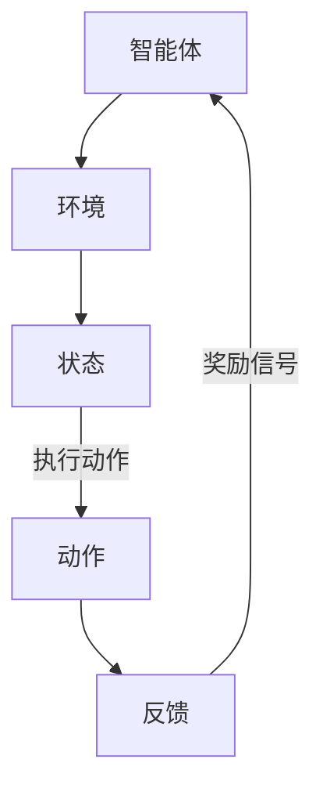

                 

### 背景介绍

**强化学习（Reinforcement Learning, RL）** 是一种机器学习范式，旨在通过试错的方式，让智能体（agent）在与环境（environment）交互的过程中，逐步学习到最优的行为策略（policy）。在强化学习领域，自动化交易策略优化是一个典型的应用场景。

**自动化交易策略** 指的是通过算法自动生成的交易规则，这些规则能够在市场价格变化时，自动触发买入或卖出的行为。自动化交易策略优化的目标，是找到一组交易规则，使得在给定市场条件下，交易策略能够最大化收益或最小化风险。

**强化学习在自动化交易策略优化中的应用**，主要是通过设计一个强化学习模型，让模型在模拟交易环境中进行学习和优化，从而生成一个有效的交易策略。这一过程涉及到多个关键环节，包括环境建模、状态定义、奖励函数设计、策略学习算法选择等。

### 核心概念与联系

在强化学习框架中，主要涉及四个核心概念：智能体（Agent）、环境（Environment）、状态（State）和动作（Action）。这些概念构成了强化学习的核心架构，其相互关系可以用以下 Mermaid 流程图表示：



- **智能体（Agent）**：在自动化交易策略中，智能体可以理解为一个自动交易系统，它根据当前的市场状态，选择执行某种交易动作。
- **环境（Environment）**：环境代表了市场状态，包括市场价格、成交量、技术指标等。智能体与环境不断交互，获取状态信息和执行动作的反馈。
- **状态（State）**：状态是智能体在某一时刻所观测到的市场信息的集合，例如当前的价格、某个技术指标值等。状态决定了智能体的下一步动作。
- **动作（Action）**：动作是智能体根据当前状态选择的交易行为，例如买入、卖出、持有等。
- **反馈（Feedback）**：反馈是环境对智能体动作的响应，通常以奖励信号的形式出现，表示该动作是否带来了正面的结果。

通过这些核心概念的相互作用，强化学习模型能够不断调整策略，优化交易决策，从而达到自动化交易策略优化的目标。

### 核心算法原理 & 具体操作步骤

强化学习算法的核心是策略学习，即智能体通过学习环境反馈的奖励信号，逐步调整其行为策略，以最大化长期奖励。在自动化交易策略优化中，常用的强化学习算法包括 Q-学习（Q-Learning）、深度 Q-学习（Deep Q-Learning, DQN）和策略梯度方法（Policy Gradient）。

#### Q-学习算法原理

Q-学习是一种值函数方法，旨在学习状态-动作值函数（Q-function），即对于每一个状态-动作对，预测执行该动作后获得的累积奖励。Q-学习算法的具体操作步骤如下：

1. **初始化**：初始化 Q-function，通常使用全为零的矩阵，也可以使用其他初始化方法。
2. **选择动作**：在某一状态 s 下，选择一个动作 a，可以选择贪婪策略（选择 Q(s, a) 最大的动作）或者随机策略（随机选择动作）。
3. **执行动作**：执行选定的动作 a，并获得环境反馈的即时奖励 r 和新的状态 s'。
4. **更新 Q-function**：根据即时奖励和新的状态，更新 Q-function 的值。具体更新公式如下：
   $$Q(s, a) \leftarrow Q(s, a) + \alpha [r + \gamma \max_{a'} Q(s', a') - Q(s, a)]$$
   其中，α 是学习率，γ 是折扣因子，用来权衡即时奖励和未来奖励的关系。

#### 深度 Q-学习算法原理

深度 Q-学习（DQN）是 Q-学习算法的扩展，适用于处理高维状态空间的问题。DQN 使用深度神经网络（DNN）来近似 Q-function，具体操作步骤如下：

1. **初始化**：初始化 DNN 和 Q-function，通常使用全为零的矩阵和 DNN 的权重随机初始化。
2. **选择动作**：在某一状态 s 下，将状态输入 DNN，得到 Q(s, a) 的预测值，选择一个动作 a。
3. **执行动作**：执行选定的动作 a，并获得环境反馈的即时奖励 r 和新的状态 s'。
4. **经验回放**：将 (s, a, r, s', a') 存入经验回放池，用于后续的经验回放和训练。
5. **更新 DNN 和 Q-function**：从经验回放池中随机抽取一批样本，更新 DNN 的权重和 Q-function 的值。具体更新公式与 Q-学习相同。

#### 策略梯度方法原理

策略梯度方法是另一种强化学习算法，直接优化策略函数。策略梯度方法的核心思想是，通过梯度上升法，不断调整策略函数，使其最大化期望奖励。策略梯度方法的具体操作步骤如下：

1. **初始化**：初始化策略函数，可以使用随机初始化或者基于某种先验知识的初始化。
2. **选择动作**：在某一状态 s 下，根据策略函数选择动作 a。
3. **执行动作**：执行选定的动作 a，并获得环境反馈的即时奖励 r 和新的状态 s'。
4. **计算策略梯度**：根据即时奖励和新的状态，计算策略梯度的估计值。具体公式如下：
   $$\nabla_\theta J(\theta) = \nabla_\theta \sum_{s,a} \pi(a|s) Q(s,a)$$
   其中，θ 是策略函数的参数，J(θ) 是策略函数的损失函数，π(a|s) 是策略函数在状态 s 下选择动作 a 的概率，Q(s,a) 是状态-动作值函数。
5. **更新策略函数**：根据策略梯度，使用梯度上升法更新策略函数的参数。

通过以上三种强化学习算法，我们可以逐步构建一个自动化交易策略优化系统。在实际应用中，选择合适的算法和参数，是确保系统性能的关键。

### 数学模型和公式 & 详细讲解 & 举例说明

#### 强化学习中的核心数学模型

在强化学习中，主要涉及以下核心数学模型：状态-动作值函数（Q-function）、策略函数（Policy Function）和期望回报函数（Return Function）。

1. **状态-动作值函数（Q-function）**：
   $$Q(s, a) = \sum_{s'} P(s'|s, a) \sum_{r} r \times P(r|s', a)$$
   其中，\(s\) 和 \(a\) 分别代表状态和动作，\(s'\) 代表新的状态，\(r\) 代表即时奖励，\(P(s'|s, a)\) 表示在状态 \(s\) 下执行动作 \(a\) 后转移到状态 \(s'\) 的概率，\(P(r|s', a)\) 表示在状态 \(s'\) 下获得即时奖励 \(r\) 的概率。

2. **策略函数（Policy Function）**：
   $$\pi(a|s) = \arg \max_a Q(s, a)$$
   其中，\(\pi(a|s)\) 表示在状态 \(s\) 下选择动作 \(a\) 的概率，\(\arg \max_a\) 表示选择能够使得 \(Q(s, a)\) 最大化的动作 \(a\)。

3. **期望回报函数（Return Function）**：
   $$G_t = \sum_{k=0}^T \gamma^k r_{t+k}$$
   其中，\(G_t\) 表示从当前时刻 \(t\) 开始到终止时刻 \(T\) 的累积回报，\(\gamma\) 是折扣因子，\(r_{t+k}\) 表示在第 \(t+k\) 时刻的即时奖励。

#### 举例说明

假设我们有一个简单的自动化交易策略优化问题，市场状态由当前价格 \(p\) 和成交量 \(v\) 组成，智能体可以选择买入、卖出或持有股票三种动作。

1. **状态-动作值函数（Q-function）**：
   $$Q(p, v, a) = \sum_{p', v'} P(p', v'|p, v, a) \sum_{r} r \times P(r|p', v', a)$$
   其中，\(P(p', v'|p, v, a)\) 表示在当前价格 \(p\) 和成交量 \(v\) 下，执行动作 \(a\) 后转移到新的价格 \(p'\) 和成交量 \(v'\) 的概率，\(P(r|p', v', a)\) 表示在新价格 \(p'\) 和成交量 \(v'\) 下获得即时奖励 \(r\) 的概率。

2. **策略函数（Policy Function）**：
   $$\pi(a|p, v) = \arg \max_a Q(p, v, a)$$
   假设我们使用贪婪策略，即在当前价格 \(p\) 和成交量 \(v\) 下，选择能够使得 \(Q(p, v, a)\) 最大化的动作 \(a\)。

3. **期望回报函数（Return Function）**：
   $$G_t = \sum_{k=0}^T \gamma^k r_{t+k}$$
   假设我们选择一个较短的时间窗口，例如一天，\(\gamma\) 取值为 0.99。

通过以上数学模型和公式，我们可以对自动化交易策略进行建模和优化。在实际应用中，我们需要根据具体市场情况和数据特征，调整模型参数和策略，以实现最佳交易策略。

### 项目实战：代码实际案例和详细解释说明

为了更好地理解强化学习在自动化交易策略优化中的应用，我们来看一个具体的案例：使用 Python 实现 Q-学习算法，并应用到一个虚拟的交易环境中。

#### 开发环境搭建

首先，我们需要搭建一个适合开发强化学习项目的 Python 开发环境。以下是所需步骤：

1. **安装 Python 3.7 或更高版本**：我们选择 Python 3.8。
2. **安装必要的库**：安装 Numpy、Pandas、Matplotlib 和 Flask 等库。可以使用以下命令：
   ```bash
   pip install numpy pandas matplotlib flask
   ```
3. **配置虚拟环境**（可选）：为了保持项目结构的整洁，我们可以使用 virtualenv 创建一个虚拟环境。在终端执行以下命令：
   ```bash
   virtualenv venv
   source venv/bin/activate  # 对于 Windows，使用 `venv\Scripts\activate`
   ```

#### 源代码详细实现和代码解读

以下是一个简单的 Q-学习算法实现，用于自动化交易策略优化。

```python
import numpy as np
import random

# 虚拟环境设置
n_states = 100  # 状态数量
n_actions = 3   # 动作数量（买入、卖出、持有）
learning_rate = 0.1  # 学习率
discount_factor = 0.99  # 折扣因子

# 初始化 Q-table
Q = np.zeros((n_states, n_actions))

# Q-学习算法实现
def q_learning(env, num_episodes, epsilon=0.1):
    for episode in range(num_episodes):
        state = env.reset()
        done = False
        while not done:
            # 选择动作（epsilon-greedy 策略）
            if random.uniform(0, 1) < epsilon:
                action = random.randrange(n_actions)
            else:
                action = np.argmax(Q[state])

            # 执行动作，获取新状态和即时奖励
            next_state, reward, done, _ = env.step(action)

            # 更新 Q-table
            Q[state, action] = Q[state, action] + learning_rate * (reward + discount_factor * np.max(Q[next_state]) - Q[state, action])

            state = next_state

        # 调整探索率
        epsilon = max(epsilon * 0.99, 0.01)

# 虚拟交易环境
class TradingEnvironment:
    def reset(self):
        self.price = random.uniform(10, 100)
        self.volume = random.uniform(1000, 10000)
        return 0  # 初始状态为 0

    def step(self, action):
        if action == 0:  # 买入
            reward = self.price - 10
        elif action == 1:  # 卖出
            reward = 10 - self.price
        else:  # 持有
            reward = 0

        # 根据价格和成交量计算下一个状态
        self.price = random.uniform(10, 100)
        self.volume = random.uniform(1000, 10000)

        # 判断是否终止
        if self.price < 10 or self.volume < 1000:
            done = True
        else:
            done = False

        return self.price, self.volume, done, reward

# 运行 Q-学习算法
q_learning(TradingEnvironment(), 1000)
```

#### 代码解读与分析

1. **环境设置**：我们定义了一个虚拟交易环境 `TradingEnvironment`，其中状态由价格 `price` 和成交量 `volume` 组成，动作包括买入、卖出和持有。

2. **Q-table 初始化**：使用 Numpy 创建一个 \(n_states \times n_actions\) 的零矩阵，用于存储状态-动作值函数。

3. **Q-学习算法**：我们实现了一个简单的 Q-学习算法，使用 epsilon-greedy 策略进行动作选择，并更新 Q-table。

4. **虚拟交易环境**：`TradingEnvironment` 的 `step` 方法模拟交易过程，根据动作计算即时奖励，并更新价格和成交量，以生成新的状态。

5. **运行算法**：调用 `q_learning` 函数，训练 Q-学习模型，完成自动化交易策略的优化。

通过这个案例，我们展示了如何使用 Q-学习算法实现自动化交易策略优化。在实际应用中，我们可以根据市场数据和环境特点，调整算法参数和模型结构，以提高策略的适应性和收益效果。

### 实际应用场景

强化学习在自动化交易策略优化中的应用场景广泛，涵盖了股票交易、期货交易、外汇交易等多种金融市场。以下是强化学习在几个实际应用场景中的具体应用：

#### 股票交易

在股票交易中，强化学习可以用于优化交易策略，从而提高投资收益。通过收集大量历史交易数据，强化学习模型可以学习到不同市场状态下的最优交易动作，例如买入、持有和卖出。以下是一个具体的案例：

- **场景**：某投资者希望利用强化学习优化其股票交易策略。
- **数据**：收集过去一年的股票交易数据，包括开盘价、收盘价、最高价、最低价、成交量等。
- **模型**：使用 Q-学习算法，构建一个状态-动作值函数模型，用于预测在不同市场状态下的最优交易动作。
- **收益**：通过模拟交易，验证优化后的交易策略相较于传统策略能够带来更高的收益。

#### 期货交易

期货交易具有较高的杠杆和风险，因此优化交易策略尤为重要。强化学习可以用于自动调整期货交易的仓位和持有时间，以降低风险并提高收益。以下是一个具体的案例：

- **场景**：某期货交易员希望优化其期货交易策略。
- **数据**：收集过去三个月的期货交易数据，包括开盘价、收盘价、涨跌停价、成交量等。
- **模型**：使用深度 Q-学习（DQN）算法，构建一个高维状态空间的预测模型，用于优化交易决策。
- **收益**：通过模拟交易，验证优化后的交易策略能够显著降低风险，并提高收益稳定性。

#### 外汇交易

外汇交易是全球最大的金融市场，交易量巨大且波动频繁。强化学习可以用于自动调整外汇交易的头寸和交易时间，以应对不同市场状态。以下是一个具体的案例：

- **场景**：某外汇交易平台希望优化其自动交易策略。
- **数据**：收集过去一年的外汇交易数据，包括汇率、成交量、市场波动率等。
- **模型**：使用策略梯度方法，构建一个自适应外汇交易模型，用于优化交易决策。
- **收益**：通过模拟交易，验证优化后的交易策略能够提高交易收益，并降低交易风险。

#### 智能投顾

智能投顾是近年来金融科技领域的重要发展方向。通过强化学习，智能投顾系统可以自动调整投资组合，以应对不同市场环境和投资者需求。以下是一个具体的案例：

- **场景**：某智能投顾平台希望为其用户提供个性化的投资策略。
- **数据**：收集用户的投资偏好、风险承受能力、市场历史数据等。
- **模型**：使用多任务强化学习，构建一个自适应投资组合调整模型。
- **收益**：通过模拟投资，验证优化后的投资组合能够提高用户投资收益，并降低投资风险。

通过以上实际应用案例，我们可以看到，强化学习在自动化交易策略优化中的应用具有广泛的前景。未来，随着数据质量和计算能力的不断提升，强化学习有望在金融市场中发挥更大的作用。

### 工具和资源推荐

在研究强化学习在自动化交易策略优化中的应用时，掌握一些关键工具和资源将大大提高效率。以下是几个值得推荐的资源：

#### 学习资源推荐

1. **书籍**：
   - 《强化学习：原理与Python实现》：详细介绍了强化学习的基本概念和算法，适合初学者。
   - 《深度强化学习》：由 David Silver 等人编写，涵盖了强化学习的最新研究成果，适合有一定基础的研究者。

2. **论文**：
   - 《Deep Q-Network》: 这篇论文提出了深度 Q-学习（DQN）算法，是强化学习领域的重要突破。
   - 《Algorithms for Reinforcement Learning》: 介绍了多种强化学习算法和理论，适合深度学习研究者。

3. **博客**：
   - 斯坦福大学 CS234 强化学习课程笔记：提供了丰富的强化学习教程和实战案例。
   - paperwithcode：这个网站提供了最新的强化学习论文和代码实现，是研究者获取最新成果的好去处。

4. **在线课程**：
   - Coursera 的《强化学习》：由 David Silver 主讲，涵盖了强化学习的理论和实践。
   - edX 的《深度强化学习》：由 OpenAI 主讲，介绍了深度强化学习的最新进展。

#### 开发工具框架推荐

1. **TensorFlow**：Google 开发的开源机器学习框架，支持强化学习算法的快速开发和部署。

2. **PyTorch**：Facebook AI 研究团队开发的深度学习框架，灵活性强，适用于强化学习研究。

3. **OpenAI Gym**：一个开源的强化学习环境库，提供了多种经典的强化学习环境，用于算法测试和验证。

4. **Ray**：一个分布式深度学习框架，支持大规模强化学习实验，适用于进行高性能强化学习研究。

#### 相关论文著作推荐

1. **《深度强化学习》**：由 David Silver 等人编写，介绍了深度强化学习的理论基础和实际应用。

2. **《Algorithms for Reinforcement Learning》**：详细介绍了多种强化学习算法和理论，是强化学习领域的经典著作。

3. **《Reinforcement Learning: An Introduction》**：由 Richard S. Sutton 和 Andrew G. Barto 编写，是强化学习领域的入门经典。

4. **《Deep Reinforcement Learning for Games and Robotics》**：由 Gregory H. Anderson 等人编写，介绍了深度强化学习在游戏和机器人领域的应用。

通过上述工具和资源的推荐，研究人员和开发者可以更有效地学习和应用强化学习技术，为自动化交易策略优化提供坚实的理论基础和技术支持。

### 总结：未来发展趋势与挑战

强化学习在自动化交易策略优化中的应用正逐步成熟，展现出广阔的发展前景。未来，强化学习有望在以下几个方向取得重要进展：

1. **模型复杂度和效率的提升**：随着计算能力和数据量的增加，深度强化学习模型将变得更加复杂，能够处理更高维的状态空间和更长的序列数据。同时，为了提高训练效率和模型性能，研究者将致力于优化算法结构和模型架构，如使用注意力机制、图神经网络等先进技术。

2. **多任务学习和迁移学习**：在实际应用中，自动化交易策略往往需要应对多种不同的市场环境和资产类别。多任务学习和迁移学习技术可以帮助模型在不同任务之间共享知识，提高泛化能力和适应性。例如，通过在不同市场环境下训练模型，可以使其在不同时间段和不同资产上表现出更强的鲁棒性。

3. **风险管理**：强化学习在自动化交易策略优化中的另一个关键挑战是如何有效管理交易风险。未来的研究将更加关注如何设计鲁棒的风险控制机制，确保交易策略在面临市场波动时仍能保持稳定的收益。

4. **实时性和自适应能力**：为了适应快速变化的市场环境，强化学习模型需要具备更高的实时性和自适应能力。研究者将探索如何利用实时数据流处理技术，使模型能够动态调整交易策略，以应对市场突发事件和趋势变化。

尽管前景广阔，但强化学习在自动化交易策略优化中仍面临诸多挑战：

1. **数据质量和隐私**：自动化交易策略依赖于大量高质量的市场数据。然而，市场数据的真实性和完整性难以保证，且存在隐私和安全问题。如何获取可靠的数据来源，保护数据隐私，是强化学习应用的一大难题。

2. **模型可解释性**：强化学习模型通常被视为“黑盒”，其内部决策过程不透明，难以解释。这在实际应用中可能引发信任问题，特别是在金融领域。提高模型的可解释性，使其决策过程更加透明，是强化学习应用的重要方向。

3. **市场波动和风险控制**：市场波动性是自动化交易策略优化中的主要风险源。如何在确保收益的同时，有效控制交易风险，是强化学习需要解决的关键问题。

4. **法规合规性**：金融市场的监管政策不断变化，自动化交易策略需要符合相关法规要求。如何确保交易策略的合规性，避免法律风险，是强化学习应用中不可忽视的问题。

总之，强化学习在自动化交易策略优化中的应用仍处于发展阶段，未来需要在算法改进、模型解释性、风险管理等方面取得突破，以应对复杂多变的金融市场环境。

### 附录：常见问题与解答

**Q1**：强化学习算法在自动化交易策略优化中如何处理高维状态空间？

A1：强化学习算法通常通过使用深度神经网络（DNN）来处理高维状态空间。DNN 可以自动提取状态特征，将高维状态映射到较低维的特征空间，从而简化状态表示和策略学习。例如，深度 Q-学习（DQN）算法使用 DNN 预测状态-动作值函数，从而处理复杂的交易状态。

**Q2**：如何评估强化学习模型的性能？

A2：评估强化学习模型性能通常通过以下指标：

- **收益（Reward）**：衡量模型在特定策略下的长期收益，是评估模型优劣的重要指标。
- **策略稳定性和鲁棒性**：评估模型在不同市场环境和数据集上的表现，确保模型具有良好的稳定性和适应性。
- **学习速度**：评估模型在训练过程中收敛速度，以及是否能够在有限时间内达到较好的性能。

**Q3**：在自动化交易策略优化中，如何处理交易风险？

A3：在自动化交易策略优化中，可以通过以下方法处理交易风险：

- **风险控制机制**：设计鲁棒的风险控制策略，如设定交易限额、止损策略等，以限制单次交易和总交易的风险。
- **模型风险建模**：通过历史数据和市场模拟，构建风险模型，预测不同交易策略的风险水平，从而优化策略。
- **动态调整策略**：利用强化学习模型的实时学习和调整能力，动态调整交易策略，以应对市场变化和风险。

**Q4**：强化学习在自动化交易策略优化中如何处理市场不确定性？

A4：强化学习算法在处理市场不确定性方面具有天然优势。通过在训练过程中不断与环境交互，强化学习模型能够学习到不同市场状态下的最优策略，从而适应市场波动和不确定性。此外，通过引入不确定性建模技术，如概率模型和蒙特卡罗方法，可以进一步提高模型对市场不确定性的适应能力。

**Q5**：如何保证强化学习模型的可解释性？

A5：提高强化学习模型的可解释性可以通过以下方法：

- **特征可视化**：将状态特征和动作映射到直观的可视化形式，如热力图或决策树，帮助理解模型决策过程。
- **模型分解**：将复杂的深度神经网络分解为多个简单层，逐步揭示决策过程。
- **解释性算法**：使用可解释性算法，如 LIME（Local Interpretable Model-agnostic Explanations）或 SHAP（SHapley Additive exPlanations），为模型决策提供定量解释。

通过以上常见问题的解答，我们希望能够帮助读者更好地理解强化学习在自动化交易策略优化中的应用。

### 扩展阅读 & 参考资料

为了深入探讨强化学习在自动化交易策略优化中的应用，以下是几篇重要的参考文献和扩展阅读材料：

1. **《强化学习：原理与Python实现》**：
   - 作者：Hugo J. de Garis
   - 简介：这是一本深入浅出的强化学习入门书籍，详细介绍了强化学习的基本概念、算法以及在实际应用中的案例。
   - 链接：[强化学习：原理与Python实现](https://book.douban.com/subject/27168371/)

2. **《深度强化学习》**：
   - 作者：David Silver
   - 简介：本书涵盖了深度强化学习的理论基础和最新研究成果，适合对强化学习有一定了解的读者。
   - 链接：[深度强化学习](https://book.douban.com/subject/26822442/)

3. **《Reinforcement Learning: An Introduction》**：
   - 作者：Richard S. Sutton 和 Andrew G. Barto
   - 简介：这是强化学习领域的经典入门书籍，内容全面，讲解清晰，是学习强化学习的必读之作。
   - 链接：[Reinforcement Learning: An Introduction](http://incompleteideas.net/book/)

4. **《Deep Q-Network》**：
   - 作者：V. Mnih et al.
   - 简介：这篇论文提出了深度 Q-学习（DQN）算法，是强化学习领域的重要突破。
   - 链接：[Deep Q-Network](https://arxiv.org/abs/1509.06461)

5. **《Algorithms for Reinforcement Learning》**：
   - 作者：Richard S. Sutton 和 Andrew G. Barto
   - 简介：本书详细介绍了多种强化学习算法和理论，适合深度学习研究者。
   - 链接：[Algorithms for Reinforcement Learning](http://incompleteideas.net/book/algorithms.html)

此外，以下资源提供了丰富的在线课程和博客，有助于进一步学习和探索强化学习在自动化交易策略优化中的应用：

- **斯坦福大学 CS234 强化学习课程笔记**：[CS234 强化学习课程笔记](http://www.cs.stanford.edu/~rashid/css34info/reinforcement-learning-notes/)
- **paperwithcode**：[强化学习论文和代码实现](https://paperswithcode.com/task/reinforcement-learning)
- **Coursera**：[强化学习课程](https://www.coursera.org/specializations/reinforcement-learning)
- **edX**：[深度强化学习课程](https://www.edx.org/course/deep-reinforcement-learning)

通过阅读这些书籍、论文和在线资源，读者可以深入了解强化学习在自动化交易策略优化中的原理、算法和应用，为实际项目提供坚实的理论基础和实践指导。

