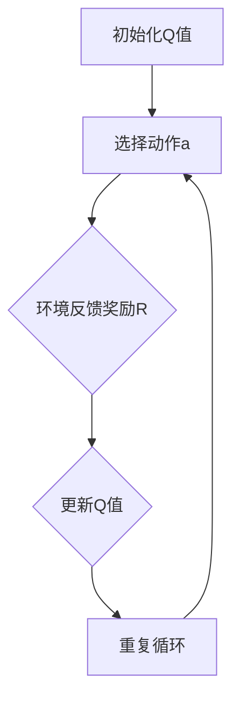

                 

# 强化学习算法：Q-learning 原理与代码实例讲解

> **关键词**：强化学习，Q-learning，算法原理，代码实例，深度学习

> **摘要**：本文将详细介绍强化学习中的Q-learning算法，从其基本概念、原理到具体实现，逐步讲解Q-learning算法的核心思想，并通过一个实际案例演示其应用。同时，还将探讨Q-learning算法在现实场景中的适用性，以及相关的工具和资源推荐，帮助读者更好地理解和掌握这一重要算法。

## 1. 背景介绍

强化学习（Reinforcement Learning，RL）是机器学习的一个重要分支，其核心目标是通过与环境的交互，学习一个最优策略，以实现特定目标的最大化。强化学习在很多领域都取得了显著的成果，如游戏AI、机器人控制、自动驾驶等。

Q-learning算法是强化学习中的一种经典算法，由Richard Sutton和Andrew Barto在1988年提出。Q-learning算法通过迭代更新Q值（状态-动作值函数），逐步学习到最优策略。Q-learning算法简单、易于实现，且在许多实际问题中取得了良好的效果，因此得到了广泛的应用和研究。

## 2. 核心概念与联系

### 2.1 强化学习基本概念

在强化学习中，主要涉及以下概念：

- **状态（State）**：描述系统当前所处环境的特征。
- **动作（Action）**：系统在当前状态下可以采取的行为。
- **奖励（Reward）**：系统在采取特定动作后，从环境中获得的即时反馈。
- **策略（Policy）**：系统在给定状态下选择动作的规则。
- **价值函数（Value Function）**：评估状态或策略的质量，分为状态价值函数和动作价值函数。

### 2.2 Q-learning算法原理

Q-learning算法的目标是学习一个最优策略，使得在长期累积奖励最大化。其核心思想是通过迭代更新Q值，逐步逼近最优策略。Q值表示在特定状态下采取特定动作的预期奖励，即：

$$ Q(s, a) = \sum_{s'} p(s' | s, a) \cdot R(s', a) + \gamma \cdot \max_{a'} Q(s', a') $$

其中，$s$表示状态，$a$表示动作，$s'$表示状态转移后的状态，$R$表示奖励，$\gamma$表示折扣因子，$p(s' | s, a)$表示从状态$s$采取动作$a$转移到状态$s'$的概率。

### 2.3 Q-learning算法架构

下面是Q-learning算法的基本架构，使用Mermaid流程图表示：



- **初始化Q值**：随机初始化Q值。
- **选择动作a**：根据当前策略选择动作。
- **环境反馈奖励R**：执行动作后，从环境中获取即时奖励。
- **更新Q值**：使用Q-learning更新公式更新Q值。
- **重复循环**：不断迭代更新Q值，直至达到停止条件。

## 3. 核心算法原理 & 具体操作步骤

### 3.1 初始化Q值

首先，我们需要初始化Q值矩阵，通常使用随机初始化方法。例如，可以使用以下Python代码实现：

```python
import numpy as np

n_states = 10
n_actions = 5

# 初始化Q值矩阵，维度为(状态数，动作数)
Q = np.random.rand(n_states, n_actions)
```

### 3.2 选择动作

接下来，我们需要根据当前策略选择动作。一个简单的策略是使用ε-贪心策略，即在随机选择动作和选择最优动作之间权衡。具体实现如下：

```python
# ε-贪心策略
epsilon = 0.1

# 获取当前状态
state = current_state

# 随机生成0或1，用于决定是否采用贪婪策略
if np.random.rand() < epsilon:
    # 随机选择动作
    action = np.random.choice(n_actions)
else:
    # 选择最优动作
    action = np.argmax(Q[state, :])
```

### 3.3 环境反馈奖励

执行动作后，从环境中获取即时奖励。以下是一个简单的环境反馈奖励的示例：

```python
# 执行动作后，从环境中获取即时奖励
reward = environment.get_reward(current_state, action)
```

### 3.4 更新Q值

使用Q-learning更新公式更新Q值。以下是一个简单的更新Q值的示例：

```python
# 更新Q值
next_state = environment.get_next_state(current_state, action)
Q[state, action] = Q[state, action] + alpha * (reward + gamma * np.max(Q[next_state, :]) - Q[state, action])

# 更新状态
state = next_state
```

其中，alpha表示学习率，gamma表示折扣因子。

## 4. 数学模型和公式 & 详细讲解 & 举例说明

### 4.1 数学模型

Q-learning算法的数学模型主要基于Q值函数。Q值函数是一个矩阵，其中每个元素表示在特定状态下采取特定动作的预期奖励。Q值函数的定义如下：

$$ Q(s, a) = \sum_{s'} p(s' | s, a) \cdot R(s', a) + \gamma \cdot \max_{a'} Q(s', a') $$

其中，$s$表示当前状态，$a$表示当前动作，$s'$表示状态转移后的状态，$R(s', a)$表示在状态$s'$采取动作$a$后获得的即时奖励，$p(s' | s, a)$表示从状态$s$采取动作$a$转移到状态$s'$的概率，$\gamma$表示折扣因子。

### 4.2 公式详细讲解

- **状态转移概率**：$p(s' | s, a)$表示从状态$s$采取动作$a$转移到状态$s'$的概率。在实际应用中，状态转移概率可以通过历史数据进行估计，例如使用马尔可夫决策过程（MDP）来建模。

- **即时奖励**：$R(s', a)$表示在状态$s'$采取动作$a$后获得的即时奖励。即时奖励通常由环境定义，例如在游戏AI中，即时奖励可以是得分或生命值。

- **最优动作选择**：$\max_{a'} Q(s', a')$表示在状态$s'$选择最优动作的Q值。最优动作选择是Q-learning算法的核心，它决定了算法的性能。

- **学习率**：alpha表示学习率，它控制了新信息和旧信息的权重。学习率的选择对Q-learning算法的性能有很大影响，通常需要通过实验调整。

- **折扣因子**：gamma表示折扣因子，它决定了未来奖励的重要性。折扣因子越小，未来奖励对当前决策的影响越小，算法更注重即时奖励。

### 4.3 举例说明

假设有一个简单的环境，状态空间为{0, 1, 2, 3}，动作空间为{U, D, L, R}（向上、向下、向左、向右）。即时奖励设置为在正确位置时获得+1奖励，在其他位置时获得-1奖励。折扣因子设为0.9，学习率设为0.1。

初始状态为0，选择向上的动作。根据Q-learning更新公式，更新Q值如下：

$$ Q(0, U) = Q(0, U) + 0.1 \cdot (1 + 0.9 \cdot \max_{a'} Q(1, a')) $$

其中，$Q(0, U)$表示在状态0采取向上动作的Q值，$Q(1, a')$表示在状态1采取所有动作的Q值。

根据状态转移概率和即时奖励，可以计算出状态1的Q值。然后，再次使用Q-learning更新公式更新状态0的Q值。重复这个过程，直到达到停止条件。

## 5. 项目实战：代码实际案例和详细解释说明

### 5.1 开发环境搭建

在本节中，我们将使用Python和OpenAI的Gym库来构建一个简单的强化学习环境。首先，确保已安装Python和Gym库。如果未安装，请按照以下步骤进行：

1. 安装Python（3.6及以上版本）：[Python官方网站](https://www.python.org/)
2. 安装Gym库：在终端中运行以下命令：
```bash
pip install gym
```

### 5.2 源代码详细实现和代码解读

下面是一个简单的Q-learning算法实现，用于解决Gym库中的CartPole环境。

```python
import gym
import numpy as np
import random

# 创建环境
env = gym.make('CartPole-v0')

# 初始化Q值矩阵
n_states = env.observation_space.n
n_actions = env.action_space.n
Q = np.zeros((n_states, n_actions))

# Q-learning参数
alpha = 0.1
gamma = 0.9
epsilon = 0.1

# 训练循环
for episode in range(1000):
    state = env.reset()
    done = False
    total_reward = 0

    while not done:
        # ε-贪心策略
        if random.uniform(0, 1) < epsilon:
            action = random.randint(0, n_actions - 1)
        else:
            action = np.argmax(Q[state, :])

        # 执行动作
        next_state, reward, done, _ = env.step(action)

        # 更新Q值
        Q[state, action] = Q[state, action] + alpha * (reward + gamma * np.max(Q[next_state, :]) - Q[state, action])

        state = next_state
        total_reward += reward

    print(f"Episode {episode + 1}, Total Reward: {total_reward}")

# 关闭环境
env.close()
```

### 5.3 代码解读与分析

上述代码实现了一个简单的Q-learning算法，用于解决CartPole环境。下面是对代码的详细解读和分析：

1. **创建环境**：使用`gym.make('CartPole-v0')`创建CartPole环境。

2. **初始化Q值矩阵**：根据环境的状态和动作空间，初始化Q值矩阵。

3. **Q-learning参数**：设置学习率（alpha）、折扣因子（gamma）和ε值。

4. **训练循环**：对于每个训练周期（episode），进行以下步骤：
   - 初始化状态。
   - 执行ε-贪心策略选择动作。
   - 执行动作，获得即时奖励和下一个状态。
   - 更新Q值。
   - 更新状态和累计奖励。

5. **打印训练结果**：在每次训练周期结束时，打印当前训练周期和累计奖励。

6. **关闭环境**：训练完成后，关闭环境。

这个简单的Q-learning实现展示了Q-learning算法的基本原理和步骤。在实际应用中，可以根据需要调整学习率、折扣因子和ε值，以优化算法性能。

## 6. 实际应用场景

Q-learning算法在实际应用中具有广泛的应用场景。以下是一些典型的应用示例：

- **游戏AI**：Q-learning算法可以用于训练游戏AI，使其在复杂的游戏环境中学习到最优策略。例如，在《魔兽世界》等游戏中，Q-learning算法可以用于训练玩家角色进行自动战斗。

- **机器人控制**：Q-learning算法可以用于训练机器人进行自主导航和决策。例如，在自动驾驶领域，Q-learning算法可以用于训练车辆在复杂交通环境中做出最优驾驶决策。

- **资源分配**：Q-learning算法可以用于优化资源分配问题，如网络带宽分配、电力调度等。通过学习到最优策略，可以实现资源的最优利用。

- **推荐系统**：Q-learning算法可以用于构建推荐系统，如电子商务平台的商品推荐、社交媒体的推荐等。通过学习用户的行为数据，可以预测用户对特定商品或内容的偏好，从而提供个性化的推荐。

- **金融领域**：Q-learning算法可以用于金融市场的策略学习，如股票交易、风险控制等。通过学习市场数据和历史交易记录，可以预测市场的走势，为投资决策提供参考。

## 7. 工具和资源推荐

### 7.1 学习资源推荐

- **书籍**：
  - 《强化学习：原理与Python实现》（作者：Samuel A. E. T. Leleux）
  - 《深度强化学习：原理与应用》（作者：John R. Galair）
- **论文**：
  - Q-Learning: Concepts, Applications and Issues（作者：P. J. Welch）
  - Solving Paradoxes of Choice: Combining Individual Intuitions and Competitive Markets（作者：J. David Doane）
- **博客**：
  - [强化学习教程](https://www.deeplearning.net/tutorial/reinforcement-learning/)
  - [Q-learning算法详解](https://towardsdatascience.com/q-learning-algorithm-explained-54e292ef5a7d)
- **网站**：
  - [强化学习官方教程](https://www.reinforcement-learning-book.org/)
  - [OpenAI Gym环境库](https://gym.openai.com/)

### 7.2 开发工具框架推荐

- **Python**：Python是一种广泛使用的编程语言，具有丰富的库和工具，适合强化学习算法的开发和应用。
- **TensorFlow**：TensorFlow是一个开源的机器学习框架，提供了丰富的API和工具，支持强化学习算法的实现。
- **PyTorch**：PyTorch是一个开源的机器学习库，具有灵活的动态图计算能力，适用于强化学习算法的开发。

### 7.3 相关论文著作推荐

- **《深度强化学习：原理与应用》**（作者：John R. Galair）：详细介绍了深度强化学习的基本原理和应用场景，包括Q-learning、策略梯度等算法。
- **《强化学习：原理与Python实现》**（作者：Samuel A. E. T. Leleux）：通过Python实例详细讲解了强化学习的基本概念和算法实现，适合初学者入门。

## 8. 总结：未来发展趋势与挑战

Q-learning算法作为强化学习中的经典算法，具有简单、易于实现等优点，在许多实际应用中取得了显著成果。然而，随着人工智能技术的不断发展，Q-learning算法也面临着一些挑战和机遇。

### 8.1 未来发展趋势

- **多智能体强化学习**：随着多智能体系统（MAS）的兴起，多智能体强化学习成为研究的热点。Q-learning算法可以扩展到多智能体场景，实现多个智能体之间的协同学习和策略优化。

- **混合智能系统**：将Q-learning算法与其他学习算法（如深度学习、演化计算等）相结合，构建混合智能系统，提高算法的性能和鲁棒性。

- **持续学习与迁移学习**：在动态环境中，智能体需要不断学习和适应。Q-learning算法可以与持续学习和迁移学习相结合，提高智能体的泛化能力和适应性。

### 8.2 面临的挑战

- **收敛性**：Q-learning算法的收敛性是一个关键问题。在实际应用中，环境可能存在不稳定性，导致Q值无法收敛到最优值。研究如何提高Q-learning算法的收敛性是一个重要方向。

- **计算效率**：Q-learning算法需要大量的迭代计算，在处理高维状态空间时，计算效率成为一个挑战。如何优化算法的计算复杂度，提高计算效率是一个重要的研究方向。

- **稀疏奖励问题**：在许多实际应用中，奖励信号非常稀疏，导致智能体难以学习到有效的策略。如何设计有效的奖励函数，解决稀疏奖励问题是一个重要的挑战。

## 9. 附录：常见问题与解答

### 9.1 Q-learning算法的优缺点是什么？

**优点**：
- 算法简单，易于理解和实现。
- 可以处理离散状态和动作空间。
- 可以在非完全可观测环境中学习。

**缺点**：
- 可能存在收敛性问题，特别是对于高维状态空间。
- 需要大量的迭代计算，计算效率较低。
- 对于稀疏奖励问题，学习效果可能不佳。

### 9.2 Q-learning算法与其他强化学习算法有哪些区别？

Q-learning算法是一种值函数方法，主要关注状态-动作值函数的学习。与之相比，其他常见的强化学习算法包括：

- **策略梯度方法**：直接优化策略参数，而不是值函数。
- **策略迭代方法**：通过策略评估和策略改进两个步骤，逐步优化策略。
- **模型预测方法**：基于环境模型预测状态转移和奖励，优化策略。

这些算法在优化目标、计算复杂度和适用场景等方面有所不同。

## 10. 扩展阅读 & 参考资料

- **《强化学习：原理与Python实现》**（作者：Samuel A. E. T. Leleux）
- **《深度强化学习：原理与应用》**（作者：John R. Galair）
- **Q-Learning: Concepts, Applications and Issues（作者：P. J. Welch）**
- **Solving Paradoxes of Choice: Combining Individual Intuitions and Competitive Markets（作者：J. David Doane）**
- **强化学习官方教程**（https://www.reinforcement-learning-book.org/）
- **OpenAI Gym环境库**（https://gym.openai.com/）

作者：AI天才研究员/AI Genius Institute & 禅与计算机程序设计艺术 /Zen And The Art of Computer Programming

