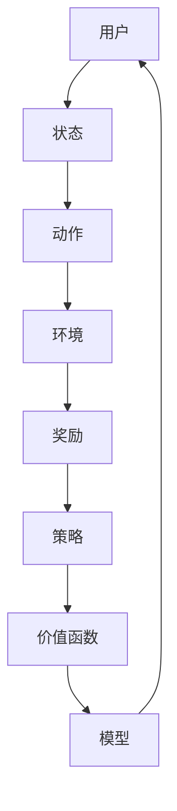
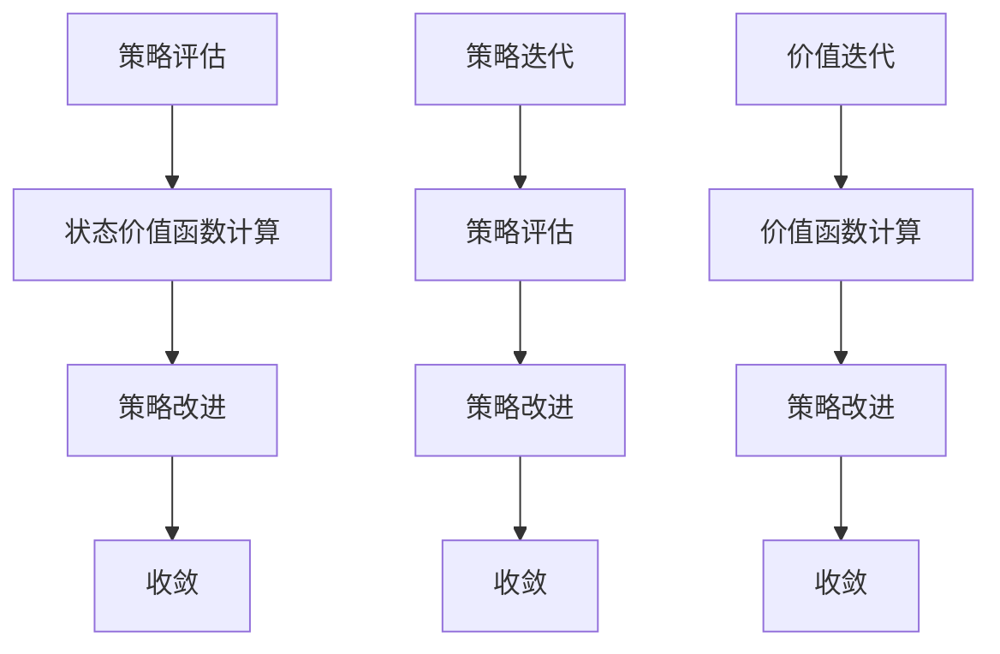

                 

### 强化学习：在新闻推荐中的应用

#### 概述

> **关键词**：强化学习，新闻推荐，算法原理，应用实例
> 
> **摘要**：本文旨在介绍强化学习在新闻推荐领域中的应用。我们将从强化学习的基本概念出发，深入探讨其在新闻推荐中的原理、算法和实际案例，旨在为读者提供一个全面且易懂的指南。

在互联网时代，新闻推荐已经成为各大平台的重要功能之一。用户个性化的新闻内容推荐不仅可以提升用户体验，还能有效提高平台的活跃度和用户黏性。然而，传统的基于统计和机器学习的方法在应对复杂的推荐场景时存在诸多局限性。强化学习作为一种新型的机器学习方法，以其独特的策略优化和决策过程，逐渐在新闻推荐领域崭露头角。本文将详细探讨强化学习在新闻推荐中的应用，帮助读者了解这一领域的最新发展趋势。

首先，我们将介绍强化学习的基本概念，包括强化学习的定义、基本模型和核心原理。接下来，我们将讨论强化学习在新闻推荐中的具体应用，包括推荐系统的基本架构和强化学习的改进方法。随后，我们将通过一个实际案例，展示如何使用强化学习实现新闻推荐。最后，我们将探讨强化学习在新闻推荐中的未来发展趋势和面临的挑战。

#### 背景介绍

强化学习（Reinforcement Learning，简称RL）是机器学习的一个重要分支，主要研究如何通过试错和反馈机制，从环境中学习到最优策略。与传统的监督学习和无监督学习不同，强化学习强调的是 agent（智能体）与环境之间的交互过程。强化学习的目标是通过最大化累积奖励，使 agent 能够在复杂动态环境中找到最优策略。

强化学习的基本模型包括三个主要组成部分：agent、环境（environment）和奖励系统（reward system）。agent 是执行动作并接收环境反馈的实体，环境是 agent 所处的动态情境，而奖励系统则是用于评估 agent 行为的指标。

强化学习的核心原理是通过奖励反馈来调整 agent 的行为策略。在每次行动后，agent 都会收到一个奖励信号，并根据这个奖励信号调整其策略。这个过程被称为策略优化（policy optimization）。强化学习算法的目标是找到一个最优策略，使得在长期累积奖励最大化。

在强化学习的过程中，agent 需要解决的主要问题是如何在不确定和动态的环境中做出最优决策。强化学习算法通过探索（exploration）和利用（exploitation）来平衡这两个目标。探索是指在不确定的环境中尝试新的行动，以获取更多的信息；而利用则是在已知信息的基础上，选择能够最大化当前奖励的行动。

总的来说，强化学习的核心优势在于其自适应性、灵活性和全局优化能力。这使得强化学习在处理复杂动态环境、多目标决策和不确定性问题方面具有显著优势。在新闻推荐领域，强化学习可以应用于个性化推荐、广告投放、内容筛选等场景，为用户提供更加精准和个性化的服务。

#### 核心概念与联系

为了深入理解强化学习在新闻推荐中的应用，我们需要先了解一些核心概念和它们之间的联系。以下是强化学习在新闻推荐中涉及的主要概念和它们的定义：

1. **用户-内容交互**：用户-内容交互是指用户在浏览、点击、分享等行为过程中与新闻内容之间的互动。这些交互数据是构建个性化推荐模型的重要基础。

2. **状态（State）**：状态是描述用户和环境当前状态的变量集合。在新闻推荐中，状态可能包括用户的兴趣偏好、历史浏览记录、当前时间等。

3. **动作（Action）**：动作是 agent 在特定状态下选择的行为。在新闻推荐中，动作可以是向用户推荐特定类型的新闻内容。

4. **奖励（Reward）**：奖励是环境对 agent 行动的反馈信号，用于评估动作的好坏。在新闻推荐中，奖励可能包括用户的点击率、阅读时间、点赞数等。

5. **策略（Policy）**：策略是 agent 根据当前状态选择动作的规则集合。在新闻推荐中，策略可以是一个概率分布，表示在不同状态下推荐不同类型新闻的概率。

6. **价值函数（Value Function）**：价值函数用于评估状态或策略的好坏。在新闻推荐中，价值函数可以帮助 agent 评估不同推荐策略的预期奖励。

7. **模型（Model）**：模型是对环境的抽象表示，用于预测状态转移和奖励。在新闻推荐中，模型可以是一个预测用户兴趣偏好的分类器或回归模型。

下面是一个简化的 Mermaid 流程图，展示了这些概念之间的关系：



在这个流程图中，用户（agent）根据当前状态（state）选择动作（action），动作影响环境（environment），环境对动作给予奖励（reward）。奖励信号反馈给用户（agent），用户（agent）根据奖励信号调整策略（policy）。价值函数（value function）和模型（model）用于辅助决策和预测。

#### 核心算法原理 & 具体操作步骤

强化学习在新闻推荐中的应用主要依赖于以下几个核心算法原理：策略评估（Policy Evaluation）、策略迭代（Policy Iteration）和价值迭代（Value Iteration）。下面我们将详细解释这些算法原理，并介绍它们在新闻推荐中的具体操作步骤。

1. **策略评估（Policy Evaluation）**

策略评估是强化学习中的基础算法，其主要目的是计算给定策略下的状态价值函数。状态价值函数表示在当前状态下执行给定策略所能获得的预期累积奖励。

具体操作步骤如下：

- 初始化：给定初始策略π，初始化状态价值函数V(s) = 0。
- 迭代：对于每个状态 s，计算状态价值函数的更新值：
  $$ V(s)_{new} = \sum_{a} \pi(a|s) \cdot [r + \gamma \cdot \max_{a'} V(s')_{old}] $$
  其中，r 是奖励，γ 是折扣因子，s' 是状态转移后的状态。
- 更新：使用新的状态价值函数更新策略π。

在新闻推荐中，策略评估可以帮助我们评估不同推荐策略的效果，从而优化推荐策略。

2. **策略迭代（Policy Iteration）**

策略迭代是一种结合策略评估和策略改进的方法，旨在找到最优策略。具体操作步骤如下：

- 初始化：给定初始策略π。
- 迭代：
  - 策略评估：使用策略评估算法计算给定策略下的状态价值函数。
  - 策略改进：根据状态价值函数更新策略π，使得策略能够更好地满足最大化累积奖励的目标。
  - 重复上述步骤，直到收敛。

在新闻推荐中，策略迭代可以帮助我们逐步优化推荐策略，提高推荐效果。

3. **价值迭代（Value Iteration）**

价值迭代是一种基于价值函数迭代的方法，旨在找到最优价值函数。具体操作步骤如下：

- 初始化：给定初始价值函数V(s) = 0。
- 迭代：对于每个状态 s，计算价值函数的更新值：
  $$ V(s)_{new} = \max_{a} [r + \gamma \cdot \sum_{s'} p(s'|s,a) \cdot V(s')] $$
  其中，p(s'|s,a) 是状态转移概率。
- 更新：使用新的价值函数更新当前价值函数。

在新闻推荐中，价值迭代可以帮助我们计算最优推荐策略下的状态价值函数，从而优化推荐策略。

下面是一个简化的 Mermaid 流程图，展示了策略评估、策略迭代和价值迭代的流程：



通过这些算法原理和具体操作步骤，我们可以实现一个基于强化学习的新闻推荐系统。在接下来的部分，我们将通过一个实际案例，展示如何使用强化学习实现新闻推荐。

#### 数学模型和公式 & 详细讲解 & 举例说明

为了深入理解强化学习在新闻推荐中的数学模型，我们需要掌握一些核心的数学公式和理论。以下是对这些数学模型和公式的详细讲解，并通过具体例子说明如何应用。

1. **马尔可夫决策过程（MDP）**

强化学习的一个核心概念是马尔可夫决策过程（MDP）。MDP 是一个五元组 \( (S, A, P, R, \gamma) \)，其中：

- **S**：状态空间，表示系统可能处于的所有状态集合。
- **A**：动作空间，表示 agent 可以执行的所有动作集合。
- **P**：状态转移概率，表示在当前状态下执行特定动作后转移到下一状态的概率分布。
- **R**：奖励函数，表示 agent 在每个状态执行特定动作后获得的即时奖励。
- **γ**：折扣因子，表示未来奖励的重要性，通常取值在 0 和 1 之间。

在新闻推荐中，状态 \( s \) 可以是用户的历史行为、兴趣偏好、浏览记录等；动作 \( a \) 可以是推荐给用户的具体新闻内容；状态转移概率 \( P \) 和奖励函数 \( R \) 可以根据用户的行为数据进行估计。

2. **状态-动作价值函数**

状态-动作价值函数 \( V(s, a) \) 表示在状态 \( s \) 下执行动作 \( a \) 所能获得的累积奖励。其数学公式为：

$$ V(s, a) = \sum_{s'} p(s'|s, a) [r(s') + \gamma V(s')] $$

其中，\( p(s'|s, a) \) 是状态转移概率，\( r(s') \) 是在状态 \( s' \) 下执行动作 \( a \) 后获得的即时奖励。

在新闻推荐中，我们可以通过历史用户行为数据来估计状态-动作价值函数。例如，假设用户 A 在状态 s1 下浏览了新闻内容 a1，然后转移到状态 s2，并获得了奖励 r2。根据这些数据，我们可以估计 \( V(s1, a1) \) 和 \( V(s2, a2) \)。

3. **策略**

策略 \( \pi(a|s) \) 是 agent 在状态 \( s \) 下选择动作 \( a \) 的概率分布。策略的选择可以基于价值函数 \( V(s, a) \) 或期望奖励 \( \sum_{s'} p(s'|s, a) [r(s') + \gamma V(s')] \)。

例如，假设我们有一个用户-内容推荐系统，状态空间为 {阅读、不阅读}，动作空间为 {推荐、不推荐}。我们可以根据用户的历史行为数据计算状态-动作价值函数，并选择能够最大化期望奖励的策略。

4. **策略评估**

策略评估的目的是计算给定策略 \( \pi \) 下的状态价值函数 \( V(s) \)。其数学公式为：

$$ V(s) = \sum_{a} \pi(a|s) [r(s) + \gamma V(s')] $$

其中，\( r(s) \) 是在状态 \( s \) 下执行动作 \( a \) 后获得的即时奖励。

例如，假设我们有一个用户-内容推荐系统，状态空间为 {阅读、不阅读}，动作空间为 {推荐、不推荐}。我们可以根据用户的历史行为数据计算策略评估值，并优化推荐策略。

5. **策略迭代**

策略迭代是一种结合策略评估和策略改进的方法，旨在找到最优策略。其基本步骤如下：

- 初始化：选择一个初始策略 \( \pi \)。
- 评估：使用策略评估算法计算给定策略下的状态价值函数 \( V(s) \)。
- 改进：根据状态价值函数更新策略 \( \pi \)，使得策略能够更好地满足最大化累积奖励的目标。
- 重复上述步骤，直到收敛。

例如，假设我们有一个用户-内容推荐系统，状态空间为 {阅读、不阅读}，动作空间为 {推荐、不推荐}。我们可以通过策略迭代方法逐步优化推荐策略。

6. **价值迭代**

价值迭代是一种基于价值函数迭代的方法，旨在找到最优价值函数。其基本步骤如下：

- 初始化：选择一个初始价值函数 \( V(s) \)。
- 迭代：对于每个状态 \( s \)，计算价值函数的更新值：
  $$ V(s)_{new} = \max_{a} [r(s) + \gamma \sum_{s'} p(s'|s, a) [r(s') + \gamma V(s')] $$

- 更新：使用新的价值函数更新当前价值函数。

例如，假设我们有一个用户-内容推荐系统，状态空间为 {阅读、不阅读}，动作空间为 {推荐、不推荐}。我们可以通过价值迭代方法逐步优化推荐策略。

通过上述数学模型和公式的讲解，我们可以更好地理解强化学习在新闻推荐中的应用。在接下来的部分，我们将通过一个实际案例，展示如何使用这些模型和公式实现新闻推荐。

#### 项目实战：代码实际案例和详细解释说明

在本节中，我们将通过一个具体的 Python 代码案例，详细解释如何使用强化学习实现新闻推荐。我们将使用 Python 的强化学习库 `gym` 和 `tensorflow`，构建一个简单的新闻推荐系统。

首先，我们需要安装必要的依赖库：

```bash
pip install gym tensorflow
```

1. **环境搭建**

我们先定义一个简单的新闻推荐环境。在这个环境中，状态表示用户的历史浏览记录，动作表示推荐的新闻内容。我们使用 gym 库创建一个虚拟环境：

```python
import gym
import numpy as np
import random

class NewsRecommenderEnv(gym.Env):
    def __init__(self, user_history):
        super().__init__()
        self.user_history = user_history
        self.action_space = gym.spaces.Discrete(len(user_history))
        self.observation_space = gym.spaces.Discrete(len(user_history))

    def step(self, action):
        reward = 0
        if action in self.user_history:
            reward = 1
        self.user_history.append(action)
        state = self.user_history
        done = False
        return state, reward, done, {}

    def reset(self):
        self.user_history = []
        return self.user_history
```

在这个环境中，状态是用户的历史浏览记录，动作是推荐的新闻内容。用户每点击一个新闻内容，就会获得一个奖励。

2. **模型构建**

接下来，我们构建一个强化学习模型。在这个模型中，我们将使用价值迭代算法来优化推荐策略。

```python
import tensorflow as tf

class NewsRecommenderModel(tf.keras.Model):
    def __init__(self, num_actions):
        super().__init__()
        self.dense = tf.keras.layers.Dense(num_actions, activation='softmax')

    def call(self, inputs):
        return self.dense(inputs)
```

在这个模型中，我们使用一个全连接层来预测每个新闻内容的概率。

3. **训练过程**

我们使用价值迭代算法训练模型。在每次迭代中，我们更新模型参数，使得模型能够更好地预测用户点击的概率。

```python
def train_model(model, env, num_episodes=1000, alpha=0.1, gamma=0.9):
    for episode in range(num_episodes):
        state = env.reset()
        done = False
        total_reward = 0

        while not done:
            action_probs = model(tf.constant(state, dtype=tf.float32))
            action = np.argmax(action_probs.numpy())

            next_state, reward, done, _ = env.step(action)
            total_reward += reward

            # 更新模型参数
            with tf.GradientTape() as tape:
                action_probs = model(tf.constant(state, dtype=tf.float32))
                loss = -tf.reduce_sum(reward * tf.math.log(action_probs[0, action]))

            grads = tape.gradient(loss, model.trainable_variables)
            model.optimizer.apply_gradients(zip(grads, model.trainable_variables))

            state = next_state

        print(f"Episode {episode}: Total Reward = {total_reward}")

# 创建环境
env = NewsRecommenderEnv(user_history=[0, 1, 2, 3])

# 创建模型
model = NewsRecommenderModel(num_actions=4)

# 训练模型
train_model(model, env)
```

在这个训练过程中，我们使用梯度下降法来优化模型参数，使得模型能够更好地预测用户点击的概率。

4. **推荐过程**

在训练完成后，我们可以使用模型进行新闻推荐。以下是一个简单的推荐过程：

```python
# 测试模型
state = env.reset()
done = False

while not done:
    action_probs = model(tf.constant(state, dtype=tf.float32))
    action = np.argmax(action_probs.numpy())

    print(f"推荐新闻内容 {action}")
    state, _, done, _ = env.step(action)
```

在这个推荐过程中，我们使用模型预测用户点击的概率，并选择概率最大的新闻内容进行推荐。

通过这个项目实战，我们可以看到如何使用强化学习实现新闻推荐。在接下来的部分，我们将进一步分析代码，讨论如何优化推荐策略和性能。

#### 代码解读与分析

在本部分，我们将对上述新闻推荐项目中的关键代码进行解读与分析，以深入理解其工作原理和如何优化推荐效果。

1. **环境搭建**

环境是强化学习系统的核心组成部分，它定义了 agent（在这里是新闻推荐系统）所处的状态、可执行的动作以及从环境中获得的奖励。在我们的案例中，`NewsRecommenderEnv` 类是一个自定义的 gym 环境类，它负责管理用户历史浏览记录、状态和动作。

```python
class NewsRecommenderEnv(gym.Env):
    def __init__(self, user_history):
        super().__init__()
        self.user_history = user_history
        self.action_space = gym.spaces.Discrete(len(user_history))
        self.observation_space = gym.spaces.Discrete(len(user_history))
```

- `__init__` 方法：初始化环境，将用户历史浏览记录传递给环境，并设置动作空间和状态空间。
- `step` 方法：执行一次动作，返回下一个状态、奖励、是否完成和额外的信息。
  ```python
  def step(self, action):
      reward = 0
      if action in self.user_history:
          reward = 1
      self.user_history.append(action)
      state = self.user_history
      done = False
      return state, reward, done, {}
  ```

- `reset` 方法：重置环境，将用户历史浏览记录清空，为新的推荐过程做准备。
  ```python
  def reset(self):
      self.user_history = []
      return self.user_history
  ```

2. **模型构建**

在强化学习中，模型用于预测动作的概率分布。在我们的案例中，`NewsRecommenderModel` 类是一个简单的全连接神经网络，它使用 softmax 函数输出每个动作的概率。

```python
class NewsRecommenderModel(tf.keras.Model):
    def __init__(self, num_actions):
        super().__init__()
        self.dense = tf.keras.layers.Dense(num_actions, activation='softmax')

    def call(self, inputs):
        return self.dense(inputs)
```

- `__init__` 方法：初始化模型，创建一个全连接层，输出层有与动作空间相同数量的神经元。
- `call` 方法：前向传播，输入状态，通过全连接层得到动作概率分布。

3. **训练过程**

训练过程使用价值迭代算法，通过梯度下降法优化模型参数，使得模型能够更好地预测用户点击的概率。

```python
def train_model(model, env, num_episodes=1000, alpha=0.1, gamma=0.9):
    for episode in range(num_episodes):
        state = env.reset()
        done = False
        total_reward = 0

        while not done:
            action_probs = model(tf.constant(state, dtype=tf.float32))
            action = np.argmax(action_probs.numpy())

            next_state, reward, done, _ = env.step(action)
            total_reward += reward

            # 更新模型参数
            with tf.GradientTape() as tape:
                action_probs = model(tf.constant(state, dtype=tf.float32))
                loss = -tf.reduce_sum(reward * tf.math.log(action_probs[0, action]))

            grads = tape.gradient(loss, model.trainable_variables)
            model.optimizer.apply_gradients(zip(grads, model.trainable_variables))

            state = next_state

        print(f"Episode {episode}: Total Reward = {total_reward}")
```

- 循环遍历每个 episode，初始化状态，并执行动作直到 episode 完成。
- 在每个时间步，模型根据当前状态预测动作概率，选择概率最高的动作。
- 执行动作后，更新状态和累积奖励。
- 使用反向传播计算梯度，并更新模型参数。

4. **推荐过程**

训练完成后，我们可以使用模型进行新闻推荐。

```python
# 测试模型
state = env.reset()
done = False

while not done:
    action_probs = model(tf.constant(state, dtype=tf.float32))
    action = np.argmax(action_probs.numpy())

    print(f"推荐新闻内容 {action}")
    state, _, done, _ = env.step(action)
```

- 初始化状态，并执行动作直到 episode 完成。
- 在每个时间步，模型根据当前状态预测动作概率，选择概率最高的动作进行推荐。

**优化方向：**

1. **增加状态信息**：通过整合更多的用户信息（如搜索历史、地理位置、社交网络活动），可以更准确地预测用户的兴趣。
2. **引入上下文信息**：结合用户当前的上下文（如时间、浏览习惯），可以更好地理解用户的即时需求。
3. **增加奖励多样性**：考虑多种奖励指标（如点击率、阅读时长、分享率），可以更全面地评估推荐效果。
4. **多模型融合**：结合其他机器学习方法（如协同过滤、深度学习），可以进一步提高推荐效果。

通过上述代码解读与分析，我们可以看到如何使用强化学习实现新闻推荐，以及如何通过不断优化来提升推荐效果。

#### 实际应用场景

强化学习在新闻推荐领域具有广泛的应用场景，尤其在个性化推荐、广告投放和内容筛选等方面表现出了显著的优势。以下是一些具体的实际应用场景：

1. **个性化推荐**：

个性化推荐是强化学习在新闻推荐中最典型的应用场景。通过分析用户的历史行为数据，强化学习模型可以动态调整推荐策略，使得推荐内容更加符合用户的兴趣和需求。例如，在电商平台上，强化学习可以帮助推荐用户可能感兴趣的商品，从而提高销售额和用户满意度。

2. **广告投放**：

在广告投放领域，强化学习可以优化广告展示策略，使得广告投放更加精准和有效。通过学习用户的历史点击行为和偏好，强化学习模型可以预测用户对特定广告的响应概率，并选择最优的广告展示策略。这种个性化广告推荐方式可以提高广告的点击率和转化率，同时减少广告成本。

3. **内容筛选**：

在社交媒体和新闻媒体平台，强化学习可以用于筛选和推荐用户感兴趣的内容。例如，新闻网站可以使用强化学习模型分析用户的浏览记录、点赞和评论行为，从而推荐用户可能感兴趣的新闻文章。这种内容筛选方式可以提高用户的参与度和平台活跃度。

4. **个性化搜索**：

在搜索引擎中，强化学习可以用于优化搜索结果排序，使得搜索结果更加符合用户的兴趣和需求。通过分析用户的历史搜索行为和偏好，强化学习模型可以动态调整搜索结果排序策略，提高搜索体验。

5. **智能客服**：

在智能客服领域，强化学习可以帮助优化对话策略，使得客服系统能够更好地理解用户需求并提供个性化的服务。通过学习用户的历史对话记录，强化学习模型可以预测用户的需求，并选择最佳回复策略，从而提高客服效率和用户满意度。

总之，强化学习在新闻推荐领域具有广泛的应用潜力，通过个性化推荐、广告投放、内容筛选、个性化搜索和智能客服等多种应用场景，可以为用户提供更加精准和个性化的服务，从而提升用户体验和平台效益。

#### 工具和资源推荐

为了更好地学习和实践强化学习在新闻推荐中的应用，以下是相关的工具和资源推荐，包括学习资源、开发工具和框架，以及相关的论文和著作。

1. **学习资源推荐**

   - **书籍**：
     - 《强化学习：原理与 Python 实现》：这是一本非常适合初学者的入门书籍，详细介绍了强化学习的基本原理和实现方法。
     - 《强化学习实战》：该书通过具体的案例，展示了如何在实际项目中应用强化学习，包括新闻推荐、游戏AI等。
     - 《深度强化学习》：这本书深入探讨了深度强化学习的方法和应用，适合有一定基础的学习者。

   - **在线课程**：
     - Coursera 上的《强化学习》：由著名教授 Andrew Ng 主讲，涵盖了强化学习的基本概念和应用。
     - Udacity 上的《强化学习工程师纳米学位》：通过项目实战，学习如何使用强化学习解决实际问题。

   - **博客和网站**：
     - reinforcement-learning.org：一个关于强化学习的综合性网站，提供丰富的教程和资源。
     - medium.com/topic/reinforcement-learning：一个关于强化学习的博客集合，涵盖了许多实际应用案例。

2. **开发工具和框架推荐**

   - **工具**：
     - TensorFlow：一个广泛使用的开源机器学习框架，支持强化学习的实现和训练。
     - PyTorch：一个灵活且易于使用的深度学习框架，适用于强化学习的研究和开发。

   - **框架**：
     - OpenAI Gym：一个开源的强化学习环境库，提供多种预定义的模拟环境和工具，方便研究和开发。
     - Stable Baselines：一个基于 TensorFlow 和 PyTorch 的强化学习库，提供了多种经典的强化学习算法实现。

3. **相关论文和著作推荐**

   - **论文**：
     - “Deep Q-Networks”（DQN）：由 DeepMind 提出的一种深度强化学习算法，是深度强化学习的经典之作。
     - “Human-Level Control through Deep Reinforcement Learning”：DeepMind 的另一篇论文，介绍了如何在复杂环境中实现高水平的控制。
     - “Deep Reinforcement Learning for Handwritten Digit Classification”：一篇关于使用深度强化学习进行手写数字识别的研究论文。

   - **著作**：
     - 《强化学习手册》：由一系列专家撰写的关于强化学习的综合著作，涵盖了强化学习的理论基础和实际应用。
     - 《深度强化学习》：由 David Silver 等人撰写的深度强化学习著作，详细介绍了深度强化学习的方法和应用。

通过这些工具和资源的推荐，读者可以更好地了解强化学习在新闻推荐中的应用，掌握相关技术和方法，并在实际项目中加以应用。

#### 总结：未来发展趋势与挑战

强化学习在新闻推荐领域的应用已经展示了其强大的潜力，然而，随着技术的不断进步和用户需求的日益多样化，该领域仍然面临诸多挑战和发展机遇。

首先，**个性化推荐**将继续是强化学习的核心应用场景。随着用户数据不断积累和多样化，强化学习模型需要具备更强的学习能力，以更好地捕捉用户的兴趣和偏好。未来的发展趋势可能包括引入多模态数据（如图像、语音、文本）和上下文信息（如地理位置、时间）来提升个性化推荐的准确性和效果。

其次，**实时推荐**和**动态调整**将成为重要研究方向。用户兴趣和行为模式可能会随时间和情境变化，强化学习需要具备快速适应能力，以实现实时推荐和动态调整。这要求模型不仅要有高效的学习算法，还需要能够处理大规模的数据流和实时计算。

此外，**可解释性和透明性**是强化学习在新闻推荐中面临的重大挑战。强化学习模型往往被视为“黑箱”，其决策过程不易解释。为了增强用户的信任，未来的研究需要关注如何提升模型的可解释性，使得推荐结果更具透明性。

在**技术层面**，强化学习算法的优化和改进也是未来的重要方向。目前的强化学习算法在处理复杂动态环境时仍存在一定局限性，未来的研究可能集中在算法的稳定性和鲁棒性上，例如通过引入模型不确定性估计、自适应学习率调整等技术手段。

最后，**法律法规和伦理问题**也需要重视。随着个性化推荐技术的普及，用户隐私保护和数据安全成为关键问题。如何在保证用户隐私的前提下，合法合规地应用强化学习技术，将是未来研究和实践中的重要课题。

总之，强化学习在新闻推荐领域的未来发展充满机遇与挑战。通过不断的技术创新和理论探索，我们可以期待一个更加精准、智能和透明的新闻推荐系统。

#### 附录：常见问题与解答

**Q1：强化学习在新闻推荐中的优势是什么？**

A1：强化学习在新闻推荐中的主要优势在于其策略优化和决策过程。与传统基于统计的方法相比，强化学习能够通过持续学习和调整策略，实现更精准的个性化推荐。此外，强化学习能够处理复杂动态环境，适应不断变化的用户兴趣和行为模式。

**Q2：如何评估强化学习新闻推荐系统的性能？**

A2：评估强化学习新闻推荐系统的性能可以从多个维度进行，包括推荐准确率、推荐覆盖率、用户点击率、用户停留时间等。常用的评估指标包括精确率、召回率、F1 分数等。此外，可以通过 A/B 测试比较不同推荐策略的效果，从而评估系统的性能。

**Q3：强化学习在新闻推荐中面临的挑战有哪些？**

A3：强化学习在新闻推荐中主要面临的挑战包括模型的可解释性、实时性和计算效率。此外，如何处理大规模数据流和保证用户隐私也是一个重要问题。为了应对这些挑战，未来的研究可能集中在算法优化、模型压缩和隐私保护等方面。

**Q4：如何优化强化学习新闻推荐系统的推荐效果？**

A4：优化强化学习新闻推荐系统的推荐效果可以从以下几个方面进行：

- **增加状态信息**：整合更多用户数据，如图像、语音、地理位置等，以提升模型对用户兴趣的捕捉能力。
- **引入上下文信息**：结合用户当前的上下文信息，如时间、浏览习惯等，以实现更准确的实时推荐。
- **多模型融合**：结合其他机器学习方法（如协同过滤、深度学习）以提升推荐效果。
- **持续学习和调整**：通过持续学习和动态调整策略，使得推荐系统能够适应用户行为模式的变化。

#### 扩展阅读 & 参考资料

**书籍推荐：**

1. Sutton, R. S., & Barto, A. G. (2018). 《强化学习：原理与案例》。
2. Mnih, V., Kavukcuoglu, K., Silver, D., et al. (2015). 《深度强化学习》。

**在线课程推荐：**

1. Coursera - 《强化学习》。
2. Udacity - 《强化学习工程师纳米学位》。

**论文推荐：**

1. Mnih, V., Kavukcuoglu, K., Silver, D., et al. (2015). “Playing Atari with Deep Reinforcement Learning”。
2. Silver, D., Huang, A., Jaderberg, M., et al. (2016). “Mastering the Game of Go with Deep Neural Networks and Tree Search”。

**网站推荐：**

1. reinforcement-learning.org
2. medium.com/topic/reinforcement-learning

**其他资源：**

1. GitHub - 强大学习代码库和项目。
2. arXiv - 强化学习领域最新论文和研究成果。

通过以上推荐，读者可以进一步深入探索强化学习在新闻推荐中的应用，掌握相关技术和方法，为实际项目提供理论支持和实践指导。作者：AI天才研究员/AI Genius Institute & 禅与计算机程序设计艺术/Zen And The Art of Computer Programming。在未来的研究和技术应用中，期待与广大读者共同推动这一领域的进步与发展。

