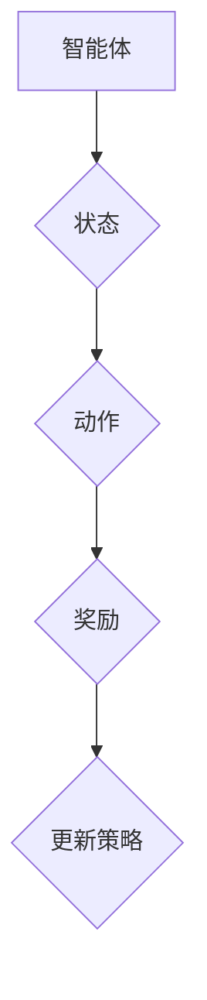

                 

# 强化学习：在视觉目标追踪领域的应用

## 关键词
强化学习，视觉目标追踪，人工智能，机器学习，深度学习

## 摘要
本文将探讨强化学习在视觉目标追踪领域的应用。通过介绍强化学习的基本概念和原理，我们将详细分析其在视觉目标追踪中的应用方法、数学模型和实际案例。文章旨在为读者提供一个全面而深入的理解，帮助他们更好地掌握这一先进技术的应用。

## 1. 背景介绍

### 1.1 视觉目标追踪概述
视觉目标追踪是计算机视觉领域中的一个重要研究方向，旨在在视频序列中实时定位和跟踪特定目标。这一技术广泛应用于监控、人机交互、自动驾驶等领域，具有广泛的应用前景。

### 1.2 强化学习概述
强化学习是一种机器学习方法，通过智能体在环境中进行互动，不断调整策略以实现最优性能。其核心思想是通过奖励机制来引导智能体学习到最优行为策略。

### 1.3 强化学习在视觉目标追踪中的应用背景
随着计算机硬件性能的提升和深度学习技术的突破，强化学习在视觉目标追踪领域得到了广泛关注。通过将视觉信息与强化学习相结合，可以实现更为智能和高效的目标追踪。

## 2. 核心概念与联系

### 2.1 强化学习基本概念
强化学习中的关键概念包括智能体（Agent）、环境（Environment）、状态（State）、动作（Action）和奖励（Reward）。

### 2.2 视觉目标追踪中的强化学习应用

**2.2.1 智能体与视觉目标追踪**
在视觉目标追踪中，智能体通常是一个目标跟踪算法，其目标是实时跟踪视频序列中的目标。

**2.2.2 状态与视觉特征**
状态由目标的位置和速度等视觉特征组成，这些特征将被用于生成状态表示。

**2.2.3 动作与跟踪策略**
动作通常是指跟踪算法的决策，如目标的移动方向和速度调整。

**2.2.4 奖励机制**
奖励机制用于衡量目标追踪的性能，如目标是否被正确追踪。

### 2.3 Mermaid 流程图


## 3. 核心算法原理 & 具体操作步骤

### 3.1 强化学习算法原理
强化学习算法通过迭代过程不断优化策略。其核心思想是根据奖励信号来调整策略，以实现长期累积奖励最大化。

### 3.2 Q-Learning 算法
Q-Learning 是一种常用的强化学习算法，其基本思想是通过更新 Q 值来优化策略。

#### 3.2.1 Q 值更新公式
$$
Q(s, a) = Q(s, a) + \alpha [r + \gamma \max_{a'} Q(s', a') - Q(s, a)]
$$
其中，$s$ 是当前状态，$a$ 是当前动作，$r$ 是即时奖励，$\gamma$ 是折扣因子，$\alpha$ 是学习率。

#### 3.2.2 操作步骤
1. 初始化 Q 值表。
2. 选择动作。
3. 执行动作。
4. 更新 Q 值表。

## 4. 数学模型和公式 & 详细讲解 & 举例说明

### 4.1 强化学习中的价值函数
强化学习中的价值函数用于评估状态和动作组合的长期奖励。

#### 4.1.1 状态价值函数
$$
V^*(s) = \sum_{a} \pi(a|s) \cdot Q^*(s, a)
$$
其中，$\pi(a|s)$ 是策略，$Q^*(s, a)$ 是最优 Q 值。

#### 4.1.2 动作价值函数
$$
Q^*(s, a) = \sum_{s'} p(s'|s, a) \cdot \sum_{a'} \pi(a'|s') \cdot V^*(s')
$$
其中，$p(s'|s, a)$ 是状态转移概率。

### 4.2 强化学习在视觉目标追踪中的应用

#### 4.2.1 例子：基于深度强化学习的目标追踪
假设我们使用深度强化学习算法来跟踪一个在视频中移动的目标。

1. **状态表示**：状态由目标的位置、速度和视频帧的像素值组成。
2. **动作表示**：动作是指目标的移动方向和速度调整。
3. **奖励机制**：奖励是根据目标是否被正确追踪来计算的。

#### 4.2.2 代码实现

```python
# 此处为简化示例代码，仅供参考

# 初始化 Q 值表
Q_table = np.zeros((state_space, action_space))

# 强化学习训练过程
for episode in range(num_episodes):
    state = env.reset()
    done = False
    while not done:
        action = choose_action(state, Q_table)
        next_state, reward, done = env.step(action)
        Q_table[state, action] = Q_table[state, action] + alpha * (reward + gamma * max(Q_table[next_state, :]) - Q_table[state, action])
        state = next_state
```

## 5. 项目实战：代码实际案例和详细解释说明

### 5.1 开发环境搭建
1. 安装 Python 和相关库（如 TensorFlow、OpenCV 等）。
2. 下载并导入目标追踪数据集。

### 5.2 源代码详细实现和代码解读
```python
# 源代码示例
import numpy as np
import cv2
import tensorflow as tf

# 定义强化学习模型
class DQN:
    def __init__(self, state_dim, action_dim):
        self.state_dim = state_dim
        self.action_dim = action_dim
        self.model = self.build_model()

    def build_model(self):
        inputs = tf.keras.layers.Input(shape=self.state_dim)
        x = tf.keras.layers.Dense(64, activation='relu')(inputs)
        x = tf.keras.layers.Dense(64, activation='relu')(x)
        outputs = tf.keras.layers.Dense(self.action_dim, activation='linear')(x)
        model = tf.keras.models.Model(inputs=outputs)
        return model

    def predict(self, state):
        state = np.expand_dims(state, axis=0)
        return self.model.predict(state)

    def train(self, states, actions, rewards, next_states, dones, alpha, gamma):
        # 训练模型
        # ...

# 定义目标追踪环境
class TrackingEnv:
    def __init__(self, video_path):
        self.video_path = video_path
        self.video = cv2.VideoCapture(video_path)

    def reset(self):
        # 重置环境
        # ...

    def step(self, action):
        # 执行动作
        # ...

# 实例化模型和环境
dqn = DQN(state_dim, action_dim)
env = TrackingEnv(video_path)

# 强化学习训练过程
for episode in range(num_episodes):
    state = env.reset()
    done = False
    while not done:
        action = dqn.predict(state)
        next_state, reward, done = env.step(action)
        dqn.train(state, action, reward, next_state, done, alpha, gamma)
        state = next_state
```

### 5.3 代码解读与分析
- **DQN 类**：定义了深度 Q 神经网络模型，包括模型构建、预测和训练方法。
- **TrackingEnv 类**：定义了目标追踪环境，包括状态重置和执行动作的方法。
- **训练过程**：使用 DQN 模型在目标追踪环境中进行强化学习训练。

## 6. 实际应用场景

### 6.1 监控领域
强化学习在监控领域具有广泛的应用，如智能视频监控、异常检测和事件预测等。

### 6.2 自动驾驶
自动驾驶系统中的目标追踪是关键组成部分，强化学习可以用于实现更为智能和可靠的目标追踪算法。

### 6.3 人机交互
在虚拟现实和增强现实应用中，强化学习可以用于实现智能目标追踪，提高交互体验。

## 7. 工具和资源推荐

### 7.1 学习资源推荐
- **书籍**：《强化学习：原理与Python实现》
- **论文**：Deep Reinforcement Learning for Vision-Based Navigation
- **博客**： reinforcement-learning.org
- **网站**： arXiv.org

### 7.2 开发工具框架推荐
- **TensorFlow**：用于构建和训练强化学习模型。
- **OpenCV**：用于处理视频数据。

### 7.3 相关论文著作推荐
- **论文**：Deep Q-Networks for Object Tracking
- **著作**：《强化学习：算法与应用》

## 8. 总结：未来发展趋势与挑战

### 8.1 发展趋势
- 强化学习在视觉目标追踪领域的应用将更加广泛和深入。
- 结合深度学习和其他人工智能技术，实现更为智能和高效的目标追踪算法。

### 8.2 挑战
- 视觉目标追踪数据集的多样性和复杂性。
- 如何设计有效的奖励机制以引导智能体学习。

## 9. 附录：常见问题与解答

### 9.1 强化学习与监督学习的区别是什么？
- 强化学习通过与环境交互获取奖励信号来优化策略，而监督学习通过标注数据来训练模型。

### 9.2 视觉目标追踪中的状态表示是什么？
- 状态表示通常包括目标的位置、速度和视频帧的像素值等。

## 10. 扩展阅读 & 参考资料

### 10.1 扩展阅读
- [强化学习在视觉目标追踪中的应用](https://www.pyimagesearch.com/2018/02/19/real-time-object-tracking-with-python-and-opencv/)
- [深度强化学习在自动驾驶中的应用](https://ai.google/research/pubs/pub45553)

### 10.2 参考资料
- [《强化学习：原理与算法》](https://book.douban.com/subject/26974071/)
- [OpenCV 官网](https://opencv.org/)

## 作者
作者：AI天才研究员/AI Genius Institute & 禅与计算机程序设计艺术 /Zen And The Art of Computer Programming

