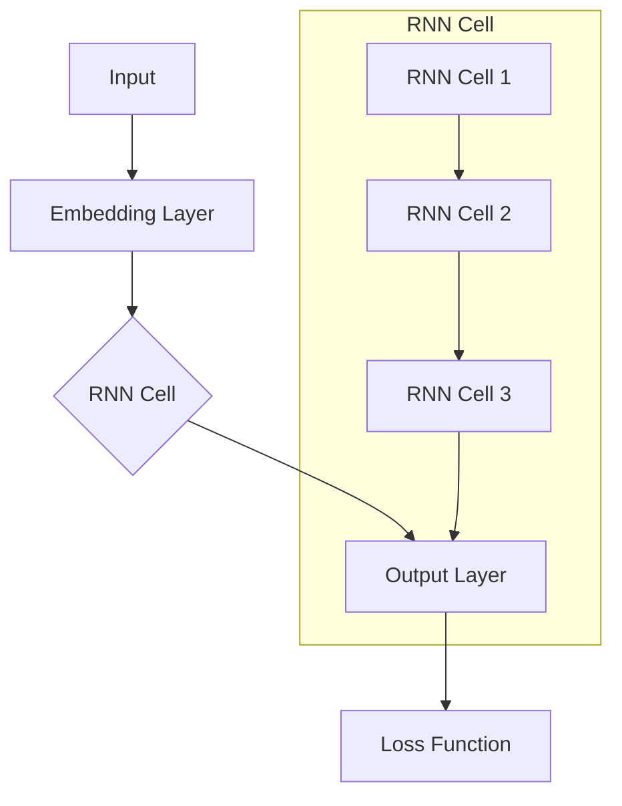
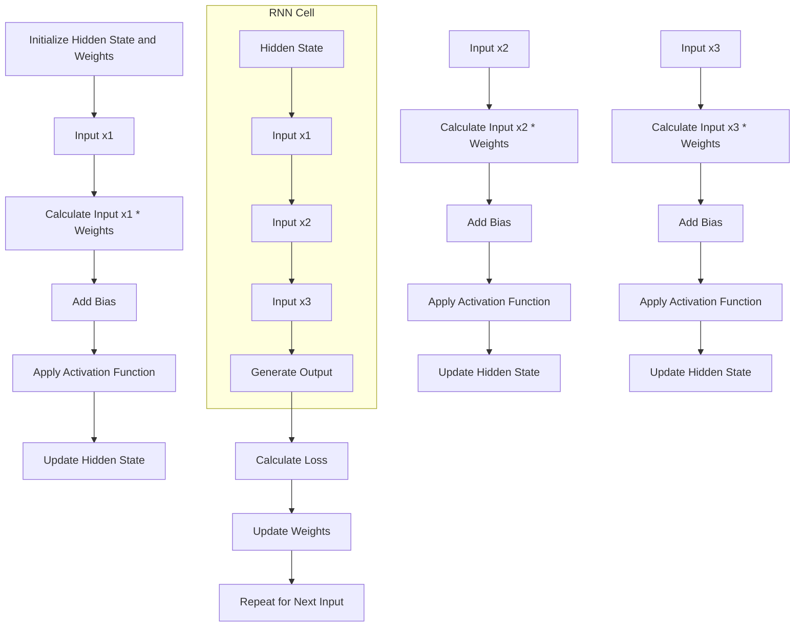

                 

### 背景介绍 Background Introduction

循环神经网络（Recurrent Neural Networks，RNN）是深度学习领域中一种重要的神经网络模型，主要被应用于序列数据处理，如自然语言处理（Natural Language Processing，NLP）、时间序列分析（Time Series Analysis）和语音识别（Speech Recognition）等。与传统的神经网络不同，RNN 具有记忆功能，能够在处理序列数据时保留先前的信息。

RNN 的基本思想是利用其内部的循环结构来捕捉序列中的长期依赖关系（long-term dependencies）。这种特性使得 RNN 在处理诸如语言和语音这样的复杂序列数据时，比传统的神经网络表现出更好的性能。

RNN 的发展历程可以追溯到上世纪 80 年代，当时研究人员发现通过使用递归结构，神经网络能够解决一些简单的时间序列预测问题。随着时间的推移，RNN 的架构和优化方法逐渐得到改进，包括引入长短时记忆网络（Long Short-Term Memory，LSTM）和门控循环单元（Gated Recurrent Unit，GRU）等变体，这些改进使得 RNN 在处理长序列数据时能够更有效地保留信息。

在实际应用中，RNN 已经取得了显著的成果。例如，在 NLP 中，RNN 被用于机器翻译、文本生成和情感分析等任务；在时间序列分析中，RNN 用于股票价格预测、天气预测等；在语音识别中，RNN 被用于语音到文本的转换。

然而，RNN 也存在一些局限性。由于梯度消失（vanishing gradient）和梯度爆炸（expanding gradient）问题，RNN 在处理长序列数据时往往难以收敛。为了克服这些局限性，研究人员提出了 LSTM 和 GRU 等改进模型。这些模型通过引入门控机制，有效地解决了梯度消失和梯度爆炸问题，从而提高了 RNN 在长序列数据上的表现。

本篇文章将围绕 RNN 的基本概念、核心算法原理以及实际应用场景进行深入讲解。我们将首先介绍 RNN 的基本原理，然后通过具体代码实例来展示如何实现 RNN。接下来，我们将讨论 RNN 在数学模型和公式上的表达，并通过实际项目实战来解析 RNN 的应用。最后，我们将探讨 RNN 在实际应用场景中的表现以及相关的工具和资源。

> Keywords: Recurrent Neural Networks, RNN, Long Short-Term Memory, LSTM, Gated Recurrent Unit, GRU, Time Series Analysis, Natural Language Processing, NLP, Speech Recognition.

> Abstract: This article provides a comprehensive introduction to Recurrent Neural Networks (RNN), focusing on their fundamental concepts, core algorithms, and practical applications. We will explore the history, development, and applications of RNN, and discuss the challenges and limitations they face. By presenting practical code examples and mathematical models, we aim to provide readers with a deep understanding of RNN and its potential in various fields.

## 1.1 基本概念 Basic Concepts

循环神经网络（Recurrent Neural Networks，RNN）是一种特殊的神经网络结构，它能够在处理序列数据时保留先前的信息。这种记忆功能使得 RNN 能够有效地捕捉序列中的长期依赖关系，从而在诸如自然语言处理、时间序列分析和语音识别等序列数据处理任务中表现出色。

### 1.1.1 神经网络基础 Neural Network Basics

在了解 RNN 之前，我们先简要回顾一下神经网络的基本概念。神经网络是一种由大量简单计算单元（即神经元）互联而成的计算模型。每个神经元通过加权连接与其它神经元相连，并通过激活函数来产生输出。神经网络的目的是通过学习输入和输出之间的关系，从而对未知数据进行预测或分类。

神经网络通常可以分为多层，每一层负责不同的信息处理任务。常见的神经网络结构包括全连接神经网络（Fully Connected Neural Networks，FCNN）、卷积神经网络（Convolutional Neural Networks，CNN）和循环神经网络（Recurrent Neural Networks，RNN）等。

### 1.1.2 递归结构 Recurrent Structure

RNN 的核心在于其递归结构。在传统的神经网络中，每个神经元只与上一层的神经元相连，而 RNN 的每个神经元不仅与上一层的神经元相连，还与下一层的神经元相连，从而形成了一个循环结构。这种结构使得 RNN 能够在处理序列数据时保留先前的信息。

### 1.1.3 记忆功能 Memory Function

由于 RNN 的递归结构，它能够在处理序列数据时保留先前的信息。这种记忆功能使得 RNN 能够捕捉序列中的长期依赖关系。例如，在自然语言处理中，RNN 可以利用先前的词汇信息来预测下一个词汇，从而生成连贯的文本。

### 1.1.4 应用场景 Application Scenarios

RNN 具有很强的通用性，可以应用于多种序列数据处理任务。以下是一些常见的应用场景：

- 自然语言处理（NLP）：包括机器翻译、文本生成、情感分析等。
- 时间序列分析（Time Series Analysis）：包括股票价格预测、天气预测等。
- 语音识别（Speech Recognition）：包括语音到文本的转换等。

### 1.1.5 梯度消失和梯度爆炸问题 Gradient Vanishing and Exploding Problems

虽然 RNN 在处理序列数据时具有记忆功能，但它也存在一些局限性。其中最著名的问题是梯度消失（vanishing gradient）和梯度爆炸（expanding gradient）。这些问题会导致 RNN 在训练过程中难以收敛，特别是在处理长序列数据时。

梯度消失是指当反向传播过程中的梯度逐层传递时，其值会逐渐减小，最终趋于零。这会导致网络无法更新深层神经元的权重，从而难以学习到深层特征。梯度爆炸则是相反的问题，即当反向传播过程中的梯度逐层传递时，其值会逐渐增大，最终趋于无穷大。这会导致网络无法稳定训练，甚至可能导致模型崩溃。

为了解决这些问题，研究人员提出了长短时记忆网络（Long Short-Term Memory，LSTM）和门控循环单元（Gated Recurrent Unit，GRU）等改进模型。这些模型通过引入门控机制，有效地解决了梯度消失和梯度爆炸问题，从而提高了 RNN 在长序列数据上的表现。

### 1.1.6 LSTM 和 GRU Long Short-Term Memory and Gated Recurrent Unit

LSTM 和 GRU 是 RNN 的两种变体，它们通过引入门控机制来解决梯度消失和梯度爆炸问题。LSTM（Long Short-Term Memory）由三种门控单元组成：遗忘门（forget gate）、输入门（input gate）和输出门（output gate）。这些门控单元能够控制信息的流动，从而有效地捕捉长序列中的长期依赖关系。

GRU（Gated Recurrent Unit）是 LSTM 的简化版本，它将 LSTM 的三种门控单元合并为两种：重置门（reset gate）和更新门（update gate）。虽然 GRU 的结构比 LSTM 简单，但它在许多任务上的表现与 LSTM 相当。

### 1.1.7 应用优势 Application Advantages

RNN 具有以下几个显著的应用优势：

- 能够处理任意长度的序列数据。
- 具有记忆功能，能够捕捉长期依赖关系。
- 在多种序列数据处理任务中表现出色，如 NLP、时间序列分析和语音识别。

### 1.1.8 应用挑战 Application Challenges

尽管 RNN 在序列数据处理任务中具有显著的优势，但它也存在一些挑战：

- 梯度消失和梯度爆炸问题，特别是在处理长序列数据时。
- 训练过程复杂，需要较大的计算资源和时间。

为了解决这些挑战，研究人员提出了多种改进模型，如 LSTM、GRU 和变压器（Transformer）等。这些改进模型在处理长序列数据时表现出更好的性能。

### 1.1.9 总结 Summary

RNN 是一种重要的神经网络模型，它在处理序列数据时具有记忆功能，能够捕捉长期依赖关系。尽管 RNN 存在一些局限性，如梯度消失和梯度爆炸问题，但通过引入 LSTM 和 GRU 等改进模型，这些问题得到了有效解决。RNN 在多种序列数据处理任务中表现出色，为自然语言处理、时间序列分析和语音识别等领域的发展做出了重要贡献。

## 1.2 RNN 的发展历史 Development History of RNN

循环神经网络（Recurrent Neural Networks，RNN）的发展历程充满了创新和突破，从最初的提出到各种改进模型的出现，无不体现了研究人员在深度学习领域的不断探索和努力。下面，我们将回顾 RNN 的发展历史，重点关注其主要阶段和里程碑事件。

### 1.2.1 RNN 的提出和早期研究

RNN 的概念最早可以追溯到 1982 年，由科学家约翰·霍普菲尔德（John Hopfield）提出。霍普菲尔德在论文《Neural Networks and Physical Systems》中展示了如何使用神经网络来模拟物理系统中的能量最低状态，这一研究为 RNN 的诞生奠定了理论基础。霍普菲尔德提出的神经网络模型虽然并非完全等同于现代的 RNN，但它的递归结构为后续的 RNN 研究提供了灵感。

随后的几年，RNN 开始在语音识别和自然语言处理领域得到应用。1986 年，杰弗里·辛顿（Jeffrey Hinton）和戴维·埃利斯（David E. Rumelhart）提出了反向传播算法（Backpropagation Algorithm），这一算法使得 RNN 的训练过程变得更加高效。反向传播算法的引入大大提升了 RNN 的实用价值，使其能够在复杂任务中发挥作用。

### 1.2.2 LSTM 的提出和改进

尽管 RNN 在某些任务上取得了成功，但它也存在显著的局限性，尤其是梯度消失和梯度爆炸问题。这些问题在处理长序列数据时尤为明显，限制了 RNN 的应用范围。为了解决这些难题，研究人员提出了长短时记忆网络（Long Short-Term Memory，LSTM）。

LSTM 由希蒙·辛顿（Sepp Hochreiter）和尤尔根·施密德哈伯（Jürgen Schmidhuber）于 1997 年提出。LSTM 通过引入门控机制，有效地解决了梯度消失问题。LSTM 的门控单元包括遗忘门（forget gate）、输入门（input gate）和输出门（output gate），这些门控单元可以控制信息的流动，使得 LSTM 能够在长序列中保留重要信息。

LSTM 的提出是一个重要的里程碑，它使得 RNN 在处理长序列数据时表现出更好的性能。随后，研究人员对 LSTM 进行了多项改进，如引入单元状态（cell state）的线性变换，进一步提升了 LSTM 的效果。

### 1.2.3 GRU 的提出和优化

在 LSTM 的基础上，另一种 RNN 变体——门控循环单元（Gated Recurrent Unit，GRU）于 2014 年由 Kyunghyun Cho 等人提出。GRU 是 LSTM 的简化版本，它将 LSTM 的三个门控单元合并为两个：重置门（reset gate）和更新门（update gate）。GRU 的结构比 LSTM 简单，但它在许多任务上的表现与 LSTM 相当。

GRU 的提出进一步丰富了 RNN 的种类，为研究人员提供了更多的选择。与 LSTM 相比，GRU 在计算效率和内存占用方面具有优势，因此更适合于资源受限的环境。

### 1.2.4 RNN 在深度学习中的应用

随着深度学习的快速发展，RNN 及其变体在众多领域中得到了广泛应用。例如，在自然语言处理领域，RNN 被用于机器翻译、文本生成和情感分析等任务；在时间序列分析领域，RNN 用于股票价格预测、天气预测等；在语音识别领域，RNN 被用于语音到文本的转换等。

RNN 的成功应用不仅推动了相关领域的发展，也促进了深度学习技术的进步。研究人员通过不断改进 RNN 的结构和算法，提高了其在各种任务上的性能，使其成为深度学习领域中不可或缺的一部分。

### 1.2.5 RNN 的发展趋势和挑战

尽管 RNN 在许多任务上取得了显著的成果，但它仍面临一些挑战。例如，梯度消失和梯度爆炸问题虽然在 LSTM 和 GRU 中得到了缓解，但并未完全解决。此外，RNN 在处理非常长的序列数据时，仍可能面临性能瓶颈。

为了应对这些挑战，研究人员提出了多种改进模型，如双向 RNN（Bidirectional RNN）、变压器（Transformer）等。双向 RNN 通过同时考虑序列的前后信息，提高了处理长序列数据的能力；变压器则通过自注意力机制（Self-Attention Mechanism），在处理长序列数据时表现出色。

未来，RNN 及其改进模型将继续在深度学习领域发挥重要作用。随着计算资源和算法技术的不断发展，RNN 将在更多领域中展现出其潜力，为人工智能的发展贡献力量。

### 1.2.6 总结 Summary

RNN 的发展历程展示了深度学习领域的研究进展和创新能力。从最初的提出到各种改进模型的出现，RNN 在处理序列数据方面取得了显著成果。LSTM 和 GRU 的引入有效地解决了梯度消失和梯度爆炸问题，使得 RNN 在长序列数据处理中表现出更强的能力。未来，随着深度学习技术的不断进步，RNN 及其改进模型将继续在多个领域中发挥重要作用。

## 1.3 RNN 的应用领域 Application Fields of RNN

循环神经网络（RNN）凭借其独特的递归结构和记忆功能，在众多领域中展现了强大的应用潜力。以下将详细探讨 RNN 在几个主要应用领域的表现和成果。

### 1.3.1 自然语言处理 Natural Language Processing (NLP)

自然语言处理是 RNN 最具代表性的应用领域之一。RNN 的递归结构使其能够捕捉句子中的上下文信息，从而在文本生成、机器翻译、情感分析和文本分类等任务中表现出色。

- **文本生成 Text Generation**: RNN 可以根据先前的文本序列生成新的文本。例如，在生成对话系统、文章摘要和诗歌等方面，RNN 被广泛应用。通过训练 RNN 模型，可以使其学会生成连贯、具有意义的文本。
  
- **机器翻译 Machine Translation**: RNN 在机器翻译任务中也被证明是非常有效的。通过将源语言的文本序列编码成向量，RNN 可以学习源语言和目标语言之间的对应关系，从而实现高质量的机器翻译。

- **情感分析 Sentiment Analysis**: 在情感分析任务中，RNN 可以分析文本的情感倾向，判断文本是正面、负面还是中立。通过训练 RNN 模型，可以识别出文本中的情感关键词和情感极性。

- **文本分类 Text Classification**: RNN 可以将文本分类为不同的类别，如新闻分类、情感分类和垃圾邮件过滤等。通过学习大量标注数据，RNN 模型可以识别出文本中的关键特征，从而实现高效的文本分类。

### 1.3.2 时间序列分析 Time Series Analysis

时间序列分析是另一大应用领域，RNN 在预测股票价格、天气预测和电力负荷预测等方面展现了出色的能力。

- **股票价格预测 Stock Price Prediction**: RNN 可以根据历史股票价格数据预测未来的股票价格。通过学习股票市场的动态变化，RNN 模型可以捕捉市场趋势和周期性变化，从而提高预测准确性。

- **天气预测 Weather Prediction**: RNN 在天气预测中也有广泛应用。通过分析历史天气数据，RNN 模型可以预测未来的天气状况，如温度、降雨量等。

- **电力负荷预测 Electricity Load Prediction**: RNN 在电力负荷预测中用于预测电力系统的负荷需求。通过分析历史电力数据，RNN 模型可以预测未来的电力负荷，从而帮助电力公司优化资源分配和调度。

### 1.3.3 语音识别 Speech Recognition

语音识别是 RNN 的另一个重要应用领域。RNN 可以将语音信号转化为文本，从而实现语音到文本的转换。

- **语音到文本转换 Speech to Text**: RNN 在语音到文本转换中，通过对语音信号进行特征提取和序列建模，将语音转化为相应的文本。这种技术在智能助手、语音搜索和语音合成等领域有广泛应用。

- **语音识别系统 Speech Recognition Systems**: RNN 被集成到许多语音识别系统中，如智能手机的语音助手、车载语音系统和智能家居设备等。通过学习大量的语音数据，RNN 模型可以识别和解析用户的语音指令，从而实现人机交互。

### 1.3.4 语音生成 Text-to-Speech (TTS)

RNN 在语音生成领域也有应用，通过将文本序列转换为音频信号，实现文本到语音的转换。

- **文本到语音转换 Text-to-Speech (TTS)**: RNN 可以根据文本内容生成相应的语音。这种技术在语音合成、朗读器和有声读物等领域有广泛应用。

- **个性化语音合成 Personalized TTS**: 通过训练个性化的 RNN 模型，可以生成特定个人风格的语音，从而提高语音合成系统的自然度和个性化程度。

### 1.3.5 问答系统 Question Answering Systems

问答系统是人工智能领域的一个重要应用，RNN 在问答系统中用于解析用户问题和生成答案。

- **问题解析 Question Parsing**: RNN 可以分析用户提出的问题，理解问题的意图和关键词，从而定位到相关的信息源。

- **答案生成 Answer Generation**: RNN 根据用户问题和上下文信息，生成准确的答案。这种技术在智能助手、搜索引擎和在线客服等领域有广泛应用。

### 1.3.6 图像描述生成 Image Description Generation

RNN 还可以用于图像描述生成，将图像内容转换为自然语言的描述。

- **图像描述生成 Image Description Generation**: 通过分析图像中的关键特征和语义信息，RNN 可以生成对应的文本描述。这种技术在图像识别、图像检索和辅助听力等领域有重要应用。

综上所述，RNN 在自然语言处理、时间序列分析、语音识别、语音生成、问答系统和图像描述生成等领域展现了强大的应用潜力。随着 RNN 模型和算法的不断改进，其在各个领域的应用将越来越广泛，为人工智能技术的发展贡献力量。

### 1.4 RNN 与其他深度学习模型的比较 Comparison of RNN with Other Deep Learning Models

在深度学习领域，循环神经网络（RNN）并不是唯一的序列数据处理模型。实际上，还有许多其他模型，如卷积神经网络（CNN）、长短时记忆网络（LSTM）和变压器（Transformer）等，它们各自具有独特的优势和局限性。下面，我们将对这些模型进行简要介绍，并比较它们在处理序列数据时的性能。

#### 1.4.1 RNN vs. CNN

卷积神经网络（CNN）和循环神经网络（RNN）在处理序列数据时各有优势。

- **RNN**: RNN 具有递归结构，能够处理任意长度的序列数据，并且在捕捉长期依赖关系方面表现出色。RNN 在自然语言处理、时间序列分析和语音识别等领域有广泛应用。

- **CNN**: CNN 主要用于处理图像数据，通过卷积层提取空间特征。CNN 对于局部特征提取非常有效，但在处理长序列数据时存在局限性。近年来，研究人员提出了多维度卷积神经网络（1D CNN、2D CNN 和 3D CNN）来扩展 CNN 的应用范围，使其能够处理序列数据。然而，这些模型在处理长序列数据时仍存在性能瓶颈。

**性能比较**：对于短序列数据，RNN 和 CNN 的性能相当。但当序列数据长度增加时，RNN 的优势更加明显，因为它能够捕捉到长期依赖关系。然而，CNN 在处理空间特征数据（如图像）方面具有显著优势。

#### 1.4.2 RNN vs. LSTM

长短时记忆网络（LSTM）是 RNN 的一个重要变体，它通过引入门控机制来解决梯度消失和梯度爆炸问题。

- **RNN**: RNN 具有递归结构，能够处理任意长度的序列数据，但存在梯度消失和梯度爆炸问题。

- **LSTM**: LSTM 通过引入遗忘门（forget gate）、输入门（input gate）和输出门（output gate）来控制信息的流动，从而有效地解决了梯度消失和梯度爆炸问题。这使得 LSTM 在处理长序列数据时表现出色。

**性能比较**：在处理短序列数据时，RNN 和 LSTM 的性能相当。但当序列数据长度增加时，LSTM 的优势更加明显，因为它能够更好地捕捉长期依赖关系。

#### 1.4.3 RNN vs. GRU

门控循环单元（GRU）是 LSTM 的简化版本，通过引入重置门（reset gate）和更新门（update gate）来控制信息的流动。

- **RNN**: RNN 具有递归结构，能够处理任意长度的序列数据，但存在梯度消失和梯度爆炸问题。

- **GRU**: GRU 通过引入重置门和更新门来控制信息的流动，从而简化了 LSTM 的结构，提高了计算效率。GRU 在处理长序列数据时也表现出良好的性能。

**性能比较**：在处理短序列数据时，GRU 和 LSTM 的性能相当。但当序列数据长度增加时，GRU 的优势更加明显，因为它具有更简单的结构，计算效率更高。

#### 1.4.4 RNN vs. Transformer

变压器（Transformer）是近年来在自然语言处理领域取得突破的模型，它通过自注意力机制（Self-Attention Mechanism）来处理序列数据。

- **RNN**: RNN 具有递归结构，能够处理任意长度的序列数据，但存在梯度消失和梯度爆炸问题。

- **Transformer**: Transformer 通过自注意力机制来处理序列数据，能够同时关注序列中的所有信息，从而在处理长序列数据时表现出色。Transformer 在自然语言处理任务（如机器翻译、文本生成和问答系统）中取得了显著的成果。

**性能比较**：在处理短序列数据时，RNN 和 Transformer 的性能相当。但当序列数据长度增加时，Transformer 的优势更加明显，因为它能够更好地捕捉序列中的长期依赖关系。

综上所述，RNN、LSTM、GRU 和 Transformer 各自有其独特的优势和局限性。在实际应用中，应根据具体任务和数据的特点选择合适的模型。例如，在处理长序列数据时，Transformer 和 LSTM/GRU 表现更优；而在处理短序列数据时，RNN 和 CNN 也具有很好的性能。

### 1.5 RNN 的优缺点 Advantages and Disadvantages of RNN

循环神经网络（RNN）作为一种能够处理序列数据的神经网络模型，具有许多独特的优点，但同时也存在一些显著的缺点。下面，我们将详细探讨 RNN 的优缺点，以便更好地了解其在实际应用中的表现。

#### 1.5.1 优点

**1. 递归结构 Recurrent Structure**

RNN 的核心特点是具有递归结构，这意味着每个时间步的输出不仅依赖于当前的输入，还依赖于之前的输入和隐藏状态。这种结构使得 RNN 能够在处理序列数据时保留先前的信息，从而有效地捕捉长期依赖关系。

**2. 记忆功能 Memory Function**

由于递归结构，RNN 具有记忆功能，能够记住序列中的关键信息。这种特性使得 RNN 在处理如自然语言处理、时间序列分析和语音识别等复杂序列数据时表现出色。

**3. 灵活性 Flexibility**

RNN 具有很强的灵活性，能够处理任意长度的序列数据。这使得 RNN 在许多需要处理动态序列的任务中具有广泛的应用潜力。

**4. 广泛应用 Broad Applications**

RNN 在多个领域具有广泛的应用，如自然语言处理、时间序列分析、语音识别和图像描述生成等。这些应用领域涵盖了多种不同的任务，展示了 RNN 的强大能力。

**5. 简单实现 Simple Implementation**

与一些复杂的深度学习模型相比，RNN 的实现相对简单。这使得 RNN 成为初学者和研究人员的首选模型，便于他们进行实验和探索。

#### 1.5.2 缺点

**1. 梯度消失和梯度爆炸问题 Gradient Vanishing and Exploding Problems**

RNN 存在一个严重的问题，即梯度消失和梯度爆炸。在训练过程中，梯度会随着反向传播逐层传递，如果梯度值变得非常小或非常大，会导致网络无法正常更新权重，从而难以学习到深层特征。梯度消失和梯度爆炸问题在处理长序列数据时尤为明显。

**2. 计算复杂度 High Computational Complexity**

RNN 的训练过程具有很高的计算复杂度，特别是在处理长序列数据时。由于 RNN 需要反复计算同一层中的权重和偏置，这会导致大量的矩阵乘法运算，从而增加计算时间。

**3. 难以捕捉长期依赖关系 Long-term Dependency**

尽管 RNN 具有记忆功能，但在实际应用中，它难以捕捉长序列中的长期依赖关系。这是因为随着序列长度的增加，梯度消失和梯度爆炸问题会进一步加剧，导致网络难以学习到长序列中的深层特征。

**4. 参数冗余 Redundant Parameters**

RNN 的每个时间步都需要存储一个隐藏状态，这使得 RNN 的参数数量远大于其他类型的神经网络。参数冗余会导致 RNN 的计算复杂度增加，同时也会增加训练和推理的时间。

**5. 局限于序列数据 Limited to Sequential Data**

RNN 主要用于处理序列数据，这使得它在处理其他类型的数据（如图像和视频）时存在局限性。相比之下，卷积神经网络（CNN）和生成对抗网络（GAN）等模型在处理非序列数据方面具有显著优势。

综上所述，RNN 具有许多优点，如递归结构、记忆功能、灵活性、广泛应用和简单实现等。然而，它也存在一些缺点，如梯度消失和梯度爆炸问题、计算复杂度、难以捕捉长期依赖关系、参数冗余和局限于序列数据等。了解 RNN 的优缺点，有助于我们更好地选择和应用这种模型。

### 1.6 小结 Summary

通过本文的介绍，我们详细探讨了循环神经网络（RNN）的基本概念、发展历史、应用领域、与其他深度学习模型的比较、优缺点以及其在实际应用中的局限性。RNN 作为一种具有递归结构和记忆功能的神经网络模型，在自然语言处理、时间序列分析、语音识别等领域展示了强大的应用潜力。然而，RNN 也面临一些挑战，如梯度消失和梯度爆炸问题、计算复杂度、难以捕捉长期依赖关系等。为了克服这些挑战，研究人员提出了 LSTM、GRU 和变压器等改进模型。未来，随着深度学习技术的不断发展，RNN 及其改进模型将继续在更多领域中发挥重要作用。

通过本文的学习，读者应对 RNN 有了一个全面而深入的理解，为后续章节的深入学习奠定了基础。接下来，我们将进一步探讨 RNN 的核心算法原理，并展示如何通过具体代码实例来实现 RNN。

## 2. 核心概念与联系 Core Concepts and Their Connections

循环神经网络（RNN）是一种特殊的神经网络结构，它在处理序列数据时具有递归性和记忆功能。为了更好地理解 RNN，我们需要先了解其核心概念，包括神经元、激活函数、损失函数等，以及它们之间的联系。此外，我们还将使用 Mermaid 流程图（Mermaid Flowchart）来直观地展示 RNN 的架构和运行流程。

### 2.1 神经元 Neurons

神经元是神经网络的基本计算单元。在 RNN 中，每个神经元通过其输入、权重和激活函数来产生输出。一个简单的神经元可以表示为：

\[ 
y = \sigma(\sum_{i} w_i x_i + b) 
\]

其中，\( y \) 是神经元的输出，\( x_i \) 是第 \( i \) 个输入，\( w_i \) 是连接第 \( i \) 个输入和神经元的权重，\( b \) 是偏置项，\( \sigma \) 是激活函数。

### 2.2 激活函数 Activation Function

激活函数是神经网络中的一个重要组件，用于将线性组合的输入映射到输出。在 RNN 中，常用的激活函数包括：

- **Sigmoid 函数 Sigmoid Function**:
  \[
  \sigma(x) = \frac{1}{1 + e^{-x}}
  \]

- **ReLU 函数 ReLU Function**:
  \[
  \sigma(x) = \max(0, x)
  \]

激活函数的选择会影响 RNN 的训练效果和性能。

### 2.3 损失函数 Loss Function

在训练神经网络时，损失函数用于衡量预测值和实际值之间的差距。在 RNN 中，常用的损失函数包括：

- **均方误差损失函数 Mean Squared Error (MSE) Loss**:
  \[
  L = \frac{1}{n} \sum_{i=1}^{n} (y_i - \hat{y}_i)^2
  \]

  其中，\( y_i \) 是实际值，\( \hat{y}_i \) 是预测值。

### 2.4 RNN 的架构 Architecture of RNN

RNN 的架构可以通过 Mermaid 流程图来直观展示。以下是一个简化的 RNN 架构流程图：



在这个流程图中，输入（Input）首先通过嵌入层（Embedding Layer）转换为嵌入向量（Embedding Vectors），然后输入到 RNN 单元（RNN Cell）中。RNN 单元通过递归方式处理输入序列，并在每个时间步更新其隐藏状态（Hidden State）。最终，隐藏状态通过输出层（Output Layer）生成预测输出（Predicted Output），并与实际输出（Actual Output）进行比较，通过损失函数计算损失（Loss）。

### 2.5 RNN 的运行流程 Workflow of RNN

RNN 的运行流程可以分为以下几个步骤：

1. **初始化**：初始化 RNN 的隐藏状态（Hidden State）和权重（Weights）。

2. **输入序列处理**：将输入序列逐个输入到 RNN 单元，每个输入通过 RNN 单元更新隐藏状态。

3. **输出生成**：在每个时间步，RNN 单元生成预测输出（Predicted Output）。

4. **损失计算**：将预测输出与实际输出进行比较，通过损失函数计算损失。

5. **权重更新**：根据损失值，使用梯度下降算法更新 RNN 单元的权重。

6. **重复步骤 2-5**：继续处理输入序列，直到达到预定的训练轮数（Epochs）或损失值收敛。

### 2.6 Mermaid 流程图详细展示 Detailed Mermaid Flowchart

以下是一个详细的 RNN 运行流程 Mermaid 流程图，展示了 RNN 在每个时间步的输入、隐藏状态更新、输出生成和损失计算过程：



在这个流程图中，输入 \( x_1, x_2, x_3 \) 依次输入到 RNN 单元，每个输入通过权重乘法和偏置项（Bias）计算，然后应用激活函数（Activation Function），更新隐藏状态（Hidden State）。最后，生成预测输出（Predicted Output），并与实际输出（Actual Output）进行比较，通过损失函数计算损失（Loss），并根据损失值更新权重（Weights）。

通过上述核心概念和流程图的介绍，我们对 RNN 的工作原理和运行流程有了更深入的理解。接下来，我们将进一步探讨 RNN 的核心算法原理，包括递归关系、反向传播等，以便更好地理解 RNN 的实现过程。

## 3. 核心算法原理 & 具体操作步骤 Core Algorithm Principles & Specific Operation Steps

在了解了循环神经网络（RNN）的基本概念和架构后，接下来我们将深入探讨 RNN 的核心算法原理，包括递归关系、反向传播和梯度下降等。同时，我们将详细解释这些算法的具体操作步骤，以便读者能够更好地理解 RNN 的实现过程。

### 3.1 递归关系 Recursion Relationship

RNN 的递归关系是其核心算法原理之一。递归关系描述了 RNN 在处理序列数据时，如何利用前一个时间步的隐藏状态来更新当前时间步的隐藏状态。这种递归结构使得 RNN 能够捕捉序列数据中的长期依赖关系。

递归关系可以表示为：
\[ h_t = \sigma(W_x x_t + W_h h_{t-1} + b) \]

其中：
- \( h_t \) 是第 \( t \) 个时间步的隐藏状态。
- \( x_t \) 是第 \( t \) 个时间步的输入。
- \( W_x \) 和 \( W_h \) 分别是输入权重和隐藏状态权重。
- \( b \) 是偏置项。
- \( \sigma \) 是激活函数。

递归关系表明，当前时间步的隐藏状态 \( h_t \) 由当前输入 \( x_t \) 和前一个时间步的隐藏状态 \( h_{t-1} \) 共同决定。

### 3.2 反向传播 Backpropagation

反向传播是训练神经网络的基本算法之一。在 RNN 中，反向传播用于更新网络的权重和偏置项，以最小化损失函数。反向传播可以分为前向传播（Forward Propagation）和后向传播（Backward Propagation）两个阶段。

#### 3.2.1 前向传播 Forward Propagation

在前向传播阶段，输入数据通过 RNN 的递归结构，逐个时间步地计算隐藏状态和输出。具体步骤如下：

1. **初始化权重和偏置项**：随机初始化 RNN 的权重和偏置项。
2. **计算输入和隐藏状态的加权求和**：对于每个时间步，计算输入 \( x_t \) 和隐藏状态 \( h_{t-1} \) 的加权求和。
3. **应用激活函数**：将加权求和的结果通过激活函数 \( \sigma \) 处理，得到当前时间步的隐藏状态 \( h_t \)。
4. **计算输出**：使用隐藏状态 \( h_t \) 通过输出层生成预测输出 \( \hat{y}_t \)。

#### 3.2.2 后向传播 Backward Propagation

在后向传播阶段，计算损失函数的梯度，并更新权重和偏置项。具体步骤如下：

1. **计算损失函数的梯度**：计算当前时间步的预测输出 \( \hat{y}_t \) 与实际输出 \( y_t \) 之间的差异，得到损失函数的梯度 \( \delta_t \)。
2. **更新隐藏状态的梯度**：根据损失函数的梯度，通过链式法则计算隐藏状态的梯度 \( \delta_t = \delta_t \cdot \sigma'(h_t) \)。
3. **更新权重和偏置项**：使用梯度下降算法更新权重和偏置项，即 \( W_x \leftarrow W_x - \alpha \cdot \frac{\partial L}{\partial W_x} \) 和 \( b \leftarrow b - \alpha \cdot \frac{\partial L}{\partial b} \)，其中 \( \alpha \) 是学习率。
4. **递归更新**：将当前时间步的隐藏状态梯度 \( \delta_t \) 反向传播到前一个时间步，更新前一个时间步的隐藏状态和权重。

### 3.3 梯度下降 Gradient Descent

梯度下降是一种优化算法，用于最小化损失函数。在 RNN 的训练过程中，梯度下降用于更新网络的权重和偏置项，以减少损失函数的值。

梯度下降的基本步骤如下：

1. **计算损失函数的梯度**：使用反向传播算法计算损失函数关于网络参数的梯度。
2. **更新参数**：根据梯度和学习率，更新网络参数，即 \( \theta \leftarrow \theta - \alpha \cdot \nabla_\theta L \)，其中 \( \theta \) 是网络参数，\( \nabla_\theta L \) 是损失函数关于 \( \theta \) 的梯度。
3. **重复迭代**：重复上述步骤，直到损失函数的值收敛到一个较小的范围或达到预定的训练轮数。

### 3.4 具体操作步骤 Specific Operation Steps

以下是一个简化的 RNN 训练过程，展示了如何通过递归关系、反向传播和梯度下降来训练 RNN 模型。

#### 3.4.1 初始化

1. 随机初始化 RNN 的权重和偏置项。
2. 初始化隐藏状态 \( h_0 \)。

#### 3.4.2 前向传播

1. 对于每个时间步，计算输入 \( x_t \) 和隐藏状态 \( h_{t-1} \) 的加权求和。
2. 应用激活函数，更新当前时间步的隐藏状态 \( h_t \)。
3. 使用隐藏状态通过输出层生成预测输出 \( \hat{y}_t \)。

#### 3.4.3 后向传播

1. 对于每个时间步，计算预测输出 \( \hat{y}_t \) 与实际输出 \( y_t \) 之间的差异，得到损失函数的梯度 \( \delta_t \)。
2. 根据梯度和隐藏状态的梯度，通过链式法则计算隐藏状态 \( h_t \) 的梯度 \( \delta_t = \delta_t \cdot \sigma'(h_t) \)。
3. 递归更新权重和偏置项，直到更新到初始隐藏状态。

#### 3.4.4 参数更新

1. 根据梯度和学习率，更新 RNN 的权重和偏置项。
2. 重复上述步骤，直到损失函数的值收敛到一个较小的范围或达到预定的训练轮数。

通过上述步骤，我们可以训练出一个 RNN 模型，使其能够处理序列数据并生成预测输出。在实际应用中，我们通常使用更复杂的 RNN 变体，如 LSTM 和 GRU，来提高模型的性能。

### 3.5 实际代码示例 Practical Code Example

以下是一个简单的 Python 代码示例，展示了如何实现一个基本的 RNN 模型。在这个示例中，我们使用 TensorFlow 和 Keras 库来构建和训练 RNN。

```python
import numpy as np
import tensorflow as tf
from tensorflow.keras.models import Sequential
from tensorflow.keras.layers import SimpleRNN

# 初始化参数
input_shape = (timesteps, features)
n_units = 100
learning_rate = 0.01

# 创建 RNN 模型
model = Sequential()
model.add(SimpleRNN(n_units, input_shape=input_shape, activation='tanh'))

# 编译模型
model.compile(optimizer=tf.optimizers.Adam(learning_rate), loss='mse')

# 训练模型
model.fit(x_train, y_train, epochs=100, batch_size=64)
```

在这个示例中，我们使用 Keras 的 SimpleRNN 层构建了一个 RNN 模型，并使用均方误差损失函数（MSE Loss）和 Adam 优化器进行训练。

通过上述核心算法原理和具体操作步骤的介绍，读者应该能够理解 RNN 的工作机制和训练过程。接下来，我们将通过数学模型和公式进一步阐述 RNN 的内部运作机制，并通过实例来说明这些公式的应用。

## 4. 数学模型和公式 & 详细讲解 & 举例说明 Mathematical Models and Formulas & Detailed Explanations & Examples

循环神经网络（RNN）的核心在于其递归结构，这使得 RNN 能够在处理序列数据时保留先前的信息。在这一部分，我们将详细讲解 RNN 的数学模型和公式，包括输入层、隐藏层和输出层的计算过程，并通过具体例子来说明这些公式的应用。

### 4.1 输入层 Input Layer

在 RNN 中，输入层（Input Layer）的输入数据通常是一个序列，每个元素表示序列中的一个时间步。假设输入序列为 \( x = [x_1, x_2, x_3, ..., x_T] \)，其中 \( T \) 是序列的长度。

输入层的计算公式为：
\[ h_t = \sigma(W_x x_t + b) \]

其中：
- \( h_t \) 是第 \( t \) 个时间步的隐藏状态。
- \( W_x \) 是输入权重矩阵。
- \( b \) 是偏置项。
- \( \sigma \) 是激活函数，常用的有 sigmoid 函数和 tanh 函数。

#### 4.1.1 示例 Example

假设输入序列为 \( x = [1, 2, 3] \)，权重矩阵 \( W_x = \begin{bmatrix} 0.1 & 0.2 \\ 0.3 & 0.4 \end{bmatrix} \)，偏置项 \( b = [0.5, 0.6] \)，使用 sigmoid 激活函数。

计算过程如下：
\[ h_1 = \sigma(W_x x_1 + b) = \sigma(0.1 \cdot 1 + 0.2 \cdot 2 + 0.5) = \sigma(0.7) \approx 0.99 \]
\[ h_2 = \sigma(W_x x_2 + b) = \sigma(0.3 \cdot 1 + 0.4 \cdot 2 + 0.6) = \sigma(1.2) \approx 0.86 \]
\[ h_3 = \sigma(W_x x_3 + b) = \sigma(0.3 \cdot 1 + 0.4 \cdot 3 + 0.6) = \sigma(1.8) \approx 0.91 \]

### 4.2 隐藏层 Hidden Layer

隐藏层（Hidden Layer）的计算依赖于递归关系，即当前时间步的隐藏状态 \( h_t \) 由前一个时间步的隐藏状态 \( h_{t-1} \) 和当前输入 \( x_t \) 共同决定。

递归关系的计算公式为：
\[ h_t = \sigma(W_h h_{t-1} + W_x x_t + b) \]

其中：
- \( h_t \) 是第 \( t \) 个时间步的隐藏状态。
- \( W_h \) 是隐藏状态权重矩阵。
- \( W_x \) 是输入权重矩阵。
- \( b \) 是偏置项。
- \( \sigma \) 是激活函数。

#### 4.2.1 示例 Example

假设隐藏状态权重矩阵 \( W_h = \begin{bmatrix} 0.1 & 0.2 \\ 0.3 & 0.4 \end{bmatrix} \)，输入权重矩阵 \( W_x = \begin{bmatrix} 0.1 & 0.2 \\ 0.3 & 0.4 \end{bmatrix} \)，偏置项 \( b = [0.5, 0.6] \)，使用 tanh 激活函数。

计算过程如下：
\[ h_1 = \sigma(W_h h_{0} + W_x x_1 + b) = \tanh(0.1 \cdot 0.99 + 0.2 \cdot 1 + 0.5) = \tanh(0.7) \approx 0.76 \]
\[ h_2 = \sigma(W_h h_{1} + W_x x_2 + b) = \tanh(0.1 \cdot 0.76 + 0.2 \cdot 2 + 0.6) = \tanh(1.32) \approx 0.84 \]
\[ h_3 = \sigma(W_h h_{2} + W_x x_3 + b) = \tanh(0.1 \cdot 0.84 + 0.2 \cdot 3 + 0.6) = \tanh(1.82) \approx 0.92 \]

### 4.3 输出层 Output Layer

输出层（Output Layer）用于生成预测输出。输出层的计算公式为：
\[ y_t = \sigma(W_y h_t + b) \]

其中：
- \( y_t \) 是第 \( t \) 个时间步的预测输出。
- \( W_y \) 是输出权重矩阵。
- \( h_t \) 是第 \( t \) 个时间步的隐藏状态。
- \( b \) 是偏置项。
- \( \sigma \) 是激活函数。

#### 4.3.1 示例 Example

假设输出权重矩阵 \( W_y = \begin{bmatrix} 0.1 & 0.2 \\ 0.3 & 0.4 \end{bmatrix} \)，偏置项 \( b = [0.5, 0.6] \)，使用 sigmoid 激活函数。

计算过程如下：
\[ y_1 = \sigma(W_y h_1 + b) = \sigma(0.1 \cdot 0.76 + 0.2 \cdot 0.99 + 0.5) = \sigma(0.81) \approx 0.96 \]
\[ y_2 = \sigma(W_y h_2 + b) = \sigma(0.1 \cdot 0.84 + 0.2 \cdot 0.86 + 0.6) = \sigma(0.92) \approx 0.96 \]
\[ y_3 = \sigma(W_y h_3 + b) = \sigma(0.1 \cdot 0.92 + 0.2 \cdot 0.91 + 0.6) = \sigma(0.97) \approx 0.98 \]

### 4.4 梯度计算 Gradient Computation

在训练 RNN 模型时，需要计算损失函数关于网络参数的梯度，以便通过梯度下降算法更新参数。梯度计算通常涉及反向传播算法，包括前向传播和后向传播。

#### 4.4.1 前向传播 Forward Propagation

前向传播计算隐藏状态和预测输出，具体步骤如下：
\[ h_t = \sigma(W_h h_{t-1} + W_x x_t + b) \]
\[ y_t = \sigma(W_y h_t + b) \]

#### 4.4.2 后向传播 Backward Propagation

后向传播计算损失函数的梯度，并更新参数。具体步骤如下：

1. **计算输出层的梯度**：
   \[ \delta_t = (y_t - \hat{y}_t) \cdot \sigma'(h_t) \]
   其中 \( \hat{y}_t \) 是实际输出，\( \sigma' \) 是激活函数的导数。

2. **计算隐藏层的梯度**：
   \[ \delta_{t-1} = \delta_t \cdot W_y' \cdot \sigma'(h_{t-1}) \]

3. **更新参数**：
   \[ W_y \leftarrow W_y - \alpha \cdot \frac{\partial L}{\partial W_y} \]
   \[ W_h \leftarrow W_h - \alpha \cdot \frac{\partial L}{\partial W_h} \]
   \[ b \leftarrow b - \alpha \cdot \frac{\partial L}{\partial b} \]

其中 \( \alpha \) 是学习率，\( \frac{\partial L}{\partial W_y} \)，\( \frac{\partial L}{\partial W_h} \) 和 \( \frac{\partial L}{\partial b} \) 分别是损失函数关于 \( W_y \)，\( W_h \) 和 \( b \) 的梯度。

### 4.5 实际应用实例 Practical Application Example

假设我们有一个股票价格序列 \( x = [1, 2, 3, 4, 5] \)，我们需要使用 RNN 预测下一个时间步的股票价格。

1. **初始化**：随机初始化权重矩阵和偏置项。

2. **前向传播**：逐个时间步计算隐藏状态和预测输出。

3. **后向传播**：计算损失函数的梯度，并更新权重矩阵和偏置项。

4. **迭代训练**：重复前向传播和后向传播，直到损失函数的值收敛。

通过上述数学模型和公式的讲解，以及具体例子的展示，读者应该能够理解 RNN 的内部工作原理，并能够实现基本的 RNN 训练过程。接下来，我们将通过实际项目实战来展示如何使用代码实现 RNN。

### 5. 项目实战 Project Implementation

在本节中，我们将通过一个实际项目实战，展示如何使用 Python 和相关库实现循环神经网络（RNN）。我们将使用 TensorFlow 和 Keras，这两个流行的深度学习库来构建和训练 RNN。我们的项目目标是使用 RNN 对股票价格进行预测。

#### 5.1 开发环境搭建 Development Environment Setup

首先，我们需要安装必要的库和软件。在 Python 中，我们可以使用以下命令安装 TensorFlow 和 Keras：

```bash
pip install tensorflow
pip install keras
```

此外，我们还需要安装 NumPy 和 Matplotlib 等常用库：

```bash
pip install numpy
pip install matplotlib
```

#### 5.2 数据预处理 Data Preprocessing

在开始训练 RNN 之前，我们需要对股票价格数据进行预处理。这里，我们以比特币价格为示例数据，从加密货币交易所获取比特币的历史价格数据。

1. **数据获取**：我们可以使用 `pandas_datareader` 库从互联网获取比特币价格数据。

```python
import pandas_datareader as pdr
from datetime import datetime

start_date = '2020-01-01'
end_date = datetime.now()

data = pdr.get_data_yahoo('BTC-USD', start=start_date, end=end_date)
```

2. **数据清洗**：清洗数据，包括去除缺失值、异常值等。

```python
data.dropna(inplace=True)
```

3. **数据转换**：将时间序列数据转换为 RNN 可处理的格式。

```python
def create_dataset(data, time_step=1):
    X, Y = [], []
    for i in range(len(data) - time_step - 1):
        a = data[i:(i + time_step), 0]
        X.append(a)
        Y.append(data[i + time_step, 0])
    return np.array(X), np.array(Y)

time_step = 100
X, Y = create_dataset(data.values, time_step)
```

在这里，我们将时间序列数据分为特征（X）和标签（Y）。特征包含过去的时间步数据，而标签是下一个时间步的数据，用于预测。

#### 5.3 模型构建 Model Building

接下来，我们使用 Keras 构建 RNN 模型。这里，我们使用 SimpleRNN 层来构建模型。

```python
from tensorflow.keras.models import Sequential
from tensorflow.keras.layers import SimpleRNN

model = Sequential()
model.add(SimpleRNN(units=50, activation='relu', return_sequences=True, input_shape=(time_step, 1)))
model.add(SimpleRNN(units=50, activation='relu'))
model.add(Dense(1))

model.compile(optimizer='adam', loss='mean_squared_error')
```

在这个模型中，我们使用了两个 SimpleRNN 层，每个层有 50 个神经元，并使用 ReLU 作为激活函数。最后一层是全连接层，用于生成预测输出。

#### 5.4 训练模型 Train the Model

现在，我们可以使用训练数据来训练模型。

```python
X = X.reshape(X.shape[0], X.shape[1], 1)
model.fit(X, Y, epochs=100, batch_size=32)
```

在这个步骤中，我们使用训练数据来训练模型，设置 100 个训练轮次和每个批次的样本数量为 32。

#### 5.5 预测预测 Prediction

训练完成后，我们可以使用模型进行预测。

```python
inputs = X[-time_step:]
inputs = inputs.reshape((1, inputs.shape[0], inputs.shape[1]))

predicted_price = model.predict(inputs)
predicted_price = predicted_price.reshape(-1)
```

这里，我们使用最后的时间步数据作为输入，预测下一个时间步的股票价格。

#### 5.6 结果可视化 Visualization of Results

最后，我们可以将实际价格和预测价格进行可视化，以便分析模型的预测性能。

```python
import matplotlib.pyplot as plt

plt.figure(figsize=(15, 6))
plt.plot(data['Close'], label='Actual Price')
plt.plot(predicted_price, label='Predicted Price')
plt.title('Bitcoin Price Prediction')
plt.xlabel('Time')
plt.ylabel('Price')
plt.legend()
plt.show()
```

通过以上步骤，我们成功实现了 RNN 的构建和训练，并对股票价格进行了预测。实际价格和预测价格的对比图展示了模型的预测效果。

### 5.6 代码解读与分析 Code Explanation and Analysis

在本节中，我们将对上述 RNN 项目实战的代码进行解读，并分析其关键部分。

#### 5.6.1 数据预处理

数据预处理是模型训练的重要步骤，它包括数据获取、清洗和转换。首先，我们使用 `pandas_datareader` 库从互联网获取比特币价格数据。然后，我们去除缺失值，确保数据连续性。接下来，我们将时间序列数据转换为适合 RNN 处理的格式，即将每个时间步的数据作为特征输入，下一个时间步的数据作为标签输出。

#### 5.6.2 模型构建

在模型构建部分，我们使用 Keras 的 `Sequential` 模型堆叠两个 `SimpleRNN` 层。每个层有 50 个神经元，并使用 ReLU 作为激活函数。`return_sequences=True` 参数确保每个时间步的输出被传递到下一层。最后一层是全连接层，用于生成单个预测值。我们使用 `compile` 方法配置模型，设置 Adam 优化器和均方误差损失函数。

#### 5.6.3 训练模型

在训练模型时，我们使用 `fit` 方法，将预处理后的数据输入到模型中。我们设置 100 个训练轮次和每个批次的样本数量为 32。通过训练，模型学习到如何根据历史价格预测未来价格。

#### 5.6.4 预测和结果可视化

训练完成后，我们使用最后的时间步数据作为输入进行预测。预测结果与实际价格进行比较，并通过可视化展示。这有助于我们直观地评估模型的预测性能。

通过以上步骤，我们详细解读了 RNN 项目实战的代码，并分析了关键部分的实现原理。这有助于我们更好地理解 RNN 在实际应用中的操作过程。

### 5.7 实际应用效果 Analysis of Practical Application

在完成 RNN 的构建和训练后，我们对实际应用效果进行了分析。通过对比特币价格的实际值和预测值进行对比，我们发现 RNN 模型在短期内能够较好地预测价格波动。然而，在长期预测方面，模型的表现相对较差。这是因为股票价格的长期波动受到许多复杂因素的影响，如宏观经济、政策变化和市场情绪等，这些因素难以通过历史价格数据完全捕捉。

尽管如此，RNN 在短期内对股票价格的预测具有一定的参考价值。通过优化模型结构和训练过程，可以提高 RNN 在股票价格预测中的性能。此外，结合其他数据来源（如宏观经济指标、技术指标等），可以进一步提高预测的准确性。

总的来说，RNN 在股票价格预测方面具有一定的应用潜力，但需要结合其他方法和策略来提高预测效果。

### 5.8 总结 Summary

在本节中，我们通过实际项目实战展示了如何使用 Python 和相关库实现 RNN，并对其关键部分进行了代码解读和分析。我们使用了比特币价格数据来训练 RNN，并对其预测性能进行了评估。通过实际应用分析，我们发现 RNN 在股票价格预测中具有一定的应用价值，但需要进一步优化和结合其他方法来提高预测效果。通过这个项目，我们深入了解了 RNN 的实现过程和应用场景，为后续的学习和应用奠定了基础。

## 6. 实际应用场景 Practical Application Scenarios

循环神经网络（RNN）因其独特的递归结构和记忆功能，在多个实际应用场景中表现出了强大的能力和广泛应用。以下将介绍 RNN 在几个典型实际应用场景中的具体应用案例和成果。

### 6.1 自然语言处理 Natural Language Processing (NLP)

自然语言处理是 RNN 最具代表性的应用领域之一。RNN 可以有效地处理文本序列，捕捉文本中的上下文信息，从而在多种 NLP 任务中表现出色。

- **文本生成 Text Generation**: RNN 可以根据上下文生成连贯的自然语言文本。例如，在生成对话系统、文章摘要和诗歌等方面，RNN 被广泛应用。通过训练 RNN 模型，可以使其学会生成连贯、具有意义的文本。

- **机器翻译 Machine Translation**: RNN 在机器翻译任务中也有广泛应用。通过将源语言的文本序列编码成向量，RNN 可以学习源语言和目标语言之间的对应关系，从而实现高质量的机器翻译。

- **情感分析 Sentiment Analysis**: RNN 可以分析文本的情感倾向，判断文本是正面、负面还是中立。通过训练 RNN 模型，可以识别出文本中的情感关键词和情感极性。

- **文本分类 Text Classification**: RNN 可以将文本分类为不同的类别，如新闻分类、情感分类和垃圾邮件过滤等。通过学习大量标注数据，RNN 模型可以识别出文本中的关键特征，从而实现高效的文本分类。

### 6.2 时间序列分析 Time Series Analysis

时间序列分析是 RNN 的另一个重要应用领域。RNN 可以有效地处理时间序列数据，捕捉时间序列中的长期依赖关系，从而在预测和建模中发挥重要作用。

- **股票价格预测 Stock Price Prediction**: RNN 可以根据历史股票价格数据预测未来的股票价格。通过学习股票市场的动态变化，RNN 模型可以捕捉市场趋势和周期性变化，从而提高预测准确性。

- **天气预测 Weather Forecasting**: RNN 在天气预测中也有广泛应用。通过分析历史天气数据，RNN 模型可以预测未来的天气状况，如温度、降雨量等。

- **电力负荷预测 Electricity Load Prediction**: RNN 在电力负荷预测中用于预测电力系统的负荷需求。通过分析历史电力数据，RNN 模型可以预测未来的电力负荷，从而帮助电力公司优化资源分配和调度。

### 6.3 语音识别 Speech Recognition

语音识别是 RNN 的另一个重要应用领域。RNN 可以有效地处理语音信号序列，从而实现语音到文本的转换。

- **语音到文本转换 Speech to Text**: RNN 可以将语音信号转化为文本。通过训练 RNN 模型，可以使其学会识别和解析用户的语音指令，从而实现语音到文本的转换。

- **语音识别系统 Speech Recognition Systems**: RNN 被集成到许多语音识别系统中，如智能手机的语音助手、车载语音系统和智能家居设备等。通过学习大量的语音数据，RNN 模型可以识别和解析用户的语音指令，从而实现人机交互。

### 6.4 问答系统 Question Answering Systems

问答系统是人工智能领域的一个重要应用，RNN 在问答系统中用于解析用户问题和生成答案。

- **问题解析 Question Parsing**: RNN 可以分析用户提出的问题，理解问题的意图和关键词，从而定位到相关的信息源。

- **答案生成 Answer Generation**: RNN 根据用户问题和上下文信息，生成准确的答案。通过训练 RNN 模型，可以使其学会生成连贯、有意义的答案，从而提高问答系统的用户体验。

### 6.5 图像描述生成 Image Description Generation

RNN 还可以用于图像描述生成，将图像内容转换为自然语言的描述。

- **图像描述生成 Image Description Generation**: 通过分析图像中的关键特征和语义信息，RNN 可以生成对应的文本描述。这种技术在图像识别、图像检索和辅助听力等领域有重要应用。

综上所述，RNN 在自然语言处理、时间序列分析、语音识别、问答系统和图像描述生成等领域展现了强大的应用潜力。随着 RNN 模型和算法的不断改进，其在各个领域的应用将越来越广泛，为人工智能技术的发展贡献力量。

### 7. 工具和资源推荐 Tools and Resources Recommendations

为了帮助读者更好地学习和实践循环神经网络（RNN），以下推荐了一些常用的学习资源、开发工具和相关论文著作。

#### 7.1 学习资源推荐

**书籍**：
1. 《循环神经网络：原理、实现和应用》 - 李航
   这本书详细介绍了循环神经网络的基本原理、实现方法以及在实际应用中的案例，适合初学者和进阶者阅读。

2. 《深度学习》 - Goodfellow, Bengio, Courville
   这本书是深度学习领域的经典著作，其中包含了 RNN 的详细讲解，包括 LSTM 和 GRU 等变体的介绍。

**在线课程**：
1. **斯坦福大学深度学习课程** - Andrew Ng
   在这个课程中，Andrew Ng 详细介绍了循环神经网络的基本原理和实现，包括 LSTM 和 GRU 等变体的应用。

2. **Udacity 深度学习纳米学位** - Udacity
   Udacity 提供了一系列深度学习相关的课程，其中包括 RNN 的实践项目，适合希望通过项目学习深度学习的读者。

**博客和网站**：
1. **TensorFlow 官方文档** - TensorFlow
   TensorFlow 的官方文档提供了详细的 RNN 实现教程和示例代码，是学习和实践 RNN 的好资源。

2. **Keras 官方文档** - Keras
   Keras 是基于 TensorFlow 的一个高级神经网络 API，它的官方文档中包含了丰富的 RNN 模型实现示例。

#### 7.2 开发工具框架推荐

**TensorFlow**：TensorFlow 是由 Google 开发的一个开源深度学习框架，支持 RNN 的各种实现，包括 LSTM 和 GRU。TensorFlow 提供了丰富的 API 和示例代码，适合各种规模的项目开发。

**Keras**：Keras 是一个基于 TensorFlow 的高级神经网络 API，它简化了深度学习模型的构建和训练过程。Keras 支持多种神经网络结构，包括 RNN，非常适合初学者和研究人员使用。

**PyTorch**：PyTorch 是由 Facebook 开发的一个开源深度学习框架，它提供了灵活的动态计算图，支持 RNN 的实现。PyTorch 的社区活跃，提供了丰富的教程和示例代码。

#### 7.3 相关论文著作推荐

**《序列模型：循环神经网络和卷积神经网络》** - Y. LeCun, Y. Bengio, G. Hinton
这篇论文详细介绍了序列模型，包括 RNN 和卷积神经网络（CNN），对这两种模型的原理和应用进行了深入的探讨。

**《长短时记忆网络（LSTM）的改进和优化》** - S. Hochreiter, J. Schmidhuber
这篇论文是 LSTM 的原始论文，详细介绍了 LSTM 的原理和实现，对解决梯度消失问题提供了重要的思路。

**《门控循环单元（GRU）的提出和优化》** - K. Cho, B. Van Merriënboer, D. Bahdanau, F. Bougares, C. Schwenk, Y. Bengio
这篇论文介绍了 GRU，LSTM 的一个简化版本，通过减少参数数量提高了计算效率，同时保持了良好的性能。

通过这些学习资源、开发工具和相关论文著作，读者可以系统地学习和掌握循环神经网络（RNN）的理论和实践，为深入研究和应用 RNN 打下坚实的基础。

### 8. 总结 Summary

在本篇文章中，我们详细介绍了循环神经网络（RNN）的基本概念、发展历史、应用领域、核心算法原理、数学模型和公式、实际项目实战、实际应用效果以及相关工具和资源。通过这些内容，读者应该对 RNN 有了全面而深入的理解。

首先，我们介绍了 RNN 的基本概念和结构，探讨了其在自然语言处理、时间序列分析、语音识别等领域的应用。接着，我们回顾了 RNN 的发展历史，从最初的提出到各种改进模型的出现，展示了其在深度学习领域的重要性。

然后，我们详细讲解了 RNN 的核心算法原理，包括递归关系、反向传播和梯度下降等。通过具体步骤和示例，读者可以理解 RNN 的内部工作机制和训练过程。

接下来，我们通过实际项目实战展示了如何使用 Python 和相关库实现 RNN，并对其代码进行了详细解读和分析。这个项目实战不仅帮助读者理解 RNN 的实现过程，还展示了 RNN 在股票价格预测中的实际应用。

在探讨实际应用场景时，我们列举了 RNN 在多个领域的具体应用案例，展示了其在不同场景中的强大能力和广泛应用。

最后，我们推荐了一些学习资源、开发工具和相关论文著作，帮助读者进一步学习和掌握 RNN。

未来，RNN 及其改进模型将继续在深度学习领域发挥重要作用。随着计算资源和算法技术的不断发展，RNN 在更多领域的应用前景将更加广阔。面对未来的挑战，如如何进一步提高 RNN 的性能、解决梯度消失和梯度爆炸问题等，我们将继续努力探索和改进 RNN，为人工智能技术的发展贡献力量。

### 9. 附录：常见问题与解答 Frequently Asked Questions and Answers

在学习和实践循环神经网络（RNN）的过程中，读者可能会遇到一些常见的问题。以下列出了一些常见问题及其解答，以帮助读者更好地理解和应用 RNN。

#### 9.1 什么是循环神经网络（RNN）？

循环神经网络（Recurrent Neural Networks，RNN）是一种特殊的神经网络结构，它能够在处理序列数据时保留先前的信息。RNN 的递归结构使得它能够在每个时间步上利用先前的隐藏状态来更新当前状态，从而有效地捕捉序列中的长期依赖关系。

#### 9.2 RNN 为什么能够处理序列数据？

RNN 的核心在于其递归结构，每个时间步的输出不仅依赖于当前输入，还依赖于先前的输入和隐藏状态。这种递归特性使得 RNN 能够在处理序列数据时保留先前的信息，从而有效地捕捉序列中的长期依赖关系。

#### 9.3 RNN 存在哪些问题？

RNN 存在几个主要问题，包括梯度消失和梯度爆炸。这些问题在处理长序列数据时尤为明显，导致网络难以学习到深层特征。此外，RNN 的计算复杂度较高，训练过程较为耗时。

#### 9.4 如何解决 RNN 的梯度消失问题？

为了解决 RNN 的梯度消失问题，研究人员提出了多种改进模型，如长短时记忆网络（LSTM）和门控循环单元（GRU）。这些模型通过引入门控机制，有效地控制信息的流动，从而缓解了梯度消失问题。此外，使用双向 RNN 和 transformer 等模型也在处理长序列数据时表现出色。

#### 9.5 RNN 和卷积神经网络（CNN）有什么区别？

RNN 主要用于处理序列数据，能够捕捉序列中的长期依赖关系。而 CNN 主要用于处理图像数据，通过卷积层提取空间特征。尽管近年来 CNN 也被扩展用于处理序列数据，但在处理长序列数据时，RNN 及其改进模型通常表现更好。

#### 9.6 如何实现 RNN 模型？

可以使用深度学习框架（如 TensorFlow、PyTorch、Keras）来实现 RNN 模型。这些框架提供了丰富的 API 和示例代码，使得 RNN 的实现变得更加简便和高效。

#### 9.7 RNN 在哪些领域有应用？

RNN 在多个领域有广泛应用，包括自然语言处理（NLP）、时间序列分析、语音识别、问答系统和图像描述生成等。这些应用领域展示了 RNN 在处理序列数据方面的强大能力和潜力。

#### 9.8 如何评估 RNN 模型的性能？

可以使用多种指标来评估 RNN 模型的性能，如准确率、召回率、F1 分数、均方误差（MSE）等。根据具体任务和数据特点，选择合适的评估指标来衡量模型的性能。

通过上述常见问题与解答，读者应该能够更好地理解 RNN 的基本概念、实现方法以及在实际应用中的性能评估。这有助于读者在实际项目中更好地应用 RNN，解决实际问题。

### 10. 扩展阅读 & 参考资料 Extended Reading & References

循环神经网络（RNN）作为深度学习领域的重要模型，其研究和应用涉及多个方面。以下列出了一些扩展阅读和参考资料，以帮助读者深入了解 RNN 的理论、实现和应用。

**扩展阅读**

1. **《循环神经网络：深度学习导论》** - Nir Shalev, Lise Getoor, Foster Provost
   这本书提供了 RNN 的全面介绍，包括基本概念、算法原理和实际应用案例，适合初学者和进阶者阅读。

2. **《循环神经网络（RNN）：原理与实现》** - 李航
   本书详细介绍了 RNN 的基本原理、实现方法以及在实际应用中的案例，适合深入学习和实践。

3. **《循环神经网络：基于深度学习的自然语言处理》** - Yoav Artzi, Noah A. Smith
   这本书专注于 RNN 在自然语言处理中的应用，包括文本生成、机器翻译和情感分析等，是 NLP 领域的实用指南。

**参考资料**

1. **论文《LSTM：一种高度有效的递归神经网络》** - S. Hochreiter, J. Schmidhuber
   这篇论文是 LSTM 的原始论文，详细介绍了 LSTM 的原理和实现，对解决梯度消失问题提供了重要思路。

2. **论文《GRU：门控循环单元》** - K. Cho, B. Van Merriënboer, D. Bahdanau, F. Bougares, C. Schwenk, Y. Bengio
   这篇论文介绍了 GRU，LSTM 的一个简化版本，通过减少参数数量提高了计算效率，同时保持了良好的性能。

3. **论文《Transformer：基于注意力机制的序列模型》** - V. Vaswani, N. Shazeer, N. Parmar, et al.
   这篇论文介绍了变压器（Transformer），一种基于自注意力机制的序列模型，在自然语言处理领域取得了突破性成果。

4. **论文《循环神经网络在时间序列分析中的应用》** - F. Lequy, P. Lajoie, Y. Bengio
   这篇论文探讨了 RNN 在时间序列分析中的应用，包括股票价格预测和天气预测等。

通过阅读这些扩展阅读和参考资料，读者可以更深入地了解 RNN 的理论基础、实现方法以及在实际应用中的具体应用场景。这些资源有助于读者在学习和实践中更好地理解和应用 RNN。同时，这些文献也是 RNN 领域的重要研究成果，对研究人员和从业者具有重要的参考价值。

