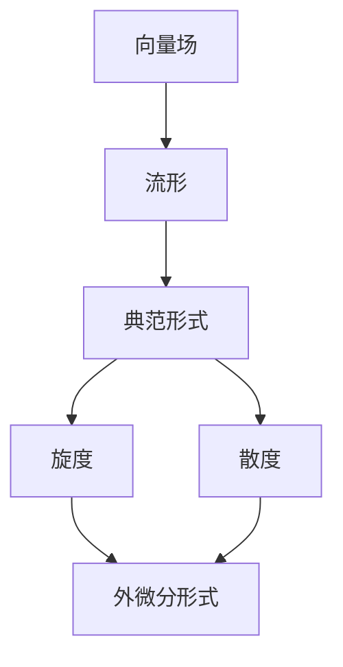

                 

# 微积分中的Stokes定理

## 关键词：Stokes定理、微积分、向量场、流形、微分形式、旋度、散度

## 摘要：

本文将深入探讨微积分中的Stokes定理，一个在物理学和工程学中具有重要应用的数学工具。我们将首先介绍Stokes定理的背景和核心概念，包括向量场、流形、微分形式等。接着，我们将详细阐述Stokes定理的数学模型和公式，并通过具体例子来说明其应用。最后，我们将探讨Stokes定理在实际工程和科学领域的应用，并推荐相关的学习资源和工具。

## 1. 背景介绍

### 1.1 微积分的历史与发展

微积分是一门研究变化和运动的数学学科，其历史可以追溯到17世纪的欧洲。当时的数学家们开始探索如何用数学方法描述物体的运动和变化。在牛顿和莱布尼茨的共同努力下，微积分得到了迅速的发展，并成为现代数学和物理学的基础。

### 1.2 Stokes定理的历史

Stokes定理是由英国数学家乔治·斯托克斯于19世纪提出的。Stokes定理是向量分析和微分几何中的重要定理，它在物理学和工程学中有着广泛的应用。Stokes定理是高斯定理和格林定理在更一般意义上的推广。

## 2. 核心概念与联系

### 2.1 向量场

向量场是指在空间中每个点都对应一个向量的场。在物理学中，向量场常常用来描述力、速度、速度场等。例如，地球的重力场可以看作是一个向量场，其中每个点的重力大小和方向都不同。

### 2.2 流形

流形是一个抽象的数学概念，它可以看作是一个局部类似于欧氏空间的几何结构。流形可以用来描述空间中的各种对象，如地球表面、曲面等。在Stokes定理中，流形用来描述向量场的作用区域。

### 2.3 微分形式

微分形式是微积分中的一个重要概念，它用来描述向量场在流形上的性质。微分形式可以分为两类：典范形式和外微分形式。典范形式可以用来描述向量场的旋度和散度，而外微分形式则可以用来描述向量场的流。

### 2.4 Mermaid流程图

下面是一个描述Stokes定理核心概念的Mermaid流程图：



## 3. 核心算法原理 & 具体操作步骤

### 3.1 Stokes定理的数学模型

Stokes定理可以用以下数学模型表示：

$$
\int_S (\nabla \cdot F) \, dV = \int_{\partial S} F \cdot dS
$$

其中，\( S \) 是流形上的一个有界区域，\( F \) 是定义在 \( S \) 上的向量场，\( \nabla \cdot F \) 是 \( F \) 的散度，\( \partial S \) 是 \( S \) 的边界，\( F \cdot dS \) 是 \( F \) 在 \( \partial S \) 上的通量。

### 3.2 Stokes定理的具体操作步骤

1. **确定向量场 \( F \)**：首先，我们需要确定要研究的向量场 \( F \)。

2. **计算散度 \( \nabla \cdot F \)**：接着，我们计算 \( F \) 的散度 \( \nabla \cdot F \)。

3. **计算通量 \( F \cdot dS \)**：然后，我们计算 \( F \) 在流形边界 \( \partial S \) 上的通量 \( F \cdot dS \)。

4. **计算积分**：最后，我们计算 \( S \) 上的散度积分和 \( \partial S \) 上的通量积分，并比较它们的结果。

## 4. 数学模型和公式 & 详细讲解 & 举例说明

### 4.1 数学模型

Stokes定理的数学模型已经在第3节中给出，即：

$$
\int_S (\nabla \cdot F) \, dV = \int_{\partial S} F \cdot dS
$$

### 4.2 详细讲解

1. **散度 \( \nabla \cdot F \)**：散度是向量场 \( F \) 的一个重要性质，它表示 \( F \) 在空间中某点的“发散性”。散度可以用以下公式表示：

$$
\nabla \cdot F = \sum_{i=1}^n \frac{\partial F_i}{\partial x_i}
$$

其中，\( F_i \) 是向量场 \( F \) 的第 \( i \) 个分量，\( x_i \) 是空间中的第 \( i \) 个坐标分量。

2. **通量 \( F \cdot dS \)**：通量是向量场 \( F \) 在流形边界 \( \partial S \) 上的“流量”。通量可以用以下公式表示：

$$
F \cdot dS = F_i \, dx_i \, dy_j + F_j \, dx_j \, dy_i
$$

其中，\( dS \) 是流形边界上的微小面积元素，\( F_i \) 和 \( F_j \) 是向量场 \( F \) 的第 \( i \) 个和第 \( j \) 个分量，\( dx_i \) 和 \( dx_j \) 是空间中的第 \( i \) 个和第 \( j \) 个坐标分量的微小变化量。

3. **积分**：积分是微积分中的重要概念，它可以用来计算函数在一个区间上的累积值。在Stokes定理中，我们需要计算两个积分：散度积分和通量积分。散度积分可以用来计算向量场 \( F \) 在流形 \( S \) 上的“发散性”，而通量积分可以用来计算向量场 \( F \) 在流形边界 \( \partial S \) 上的“流量”。

### 4.3 举例说明

假设我们有一个二维向量场 \( F(x, y) = (y, x) \)，我们要计算它在单位圆盘 \( S \) 上的散度积分和通量积分。

1. **计算散度 \( \nabla \cdot F \)**：

$$
\nabla \cdot F = \frac{\partial F_x}{\partial x} + \frac{\partial F_y}{\partial y} = \frac{\partial y}{\partial x} + \frac{\partial x}{\partial y} = 0
$$

2. **计算通量 \( F \cdot dS \)**：

$$
F \cdot dS = y \, dx + x \, dy = x \, dy + y \, dx = d(x^2 + y^2)
$$

3. **计算积分**：

$$
\int_S (\nabla \cdot F) \, dV = \int_S 0 \, dV = 0
$$

$$
\int_{\partial S} F \cdot dS = \int_{\partial S} d(x^2 + y^2) = \int_{\partial S} d(r^2) = \int_{\partial S} 2r \, dr = \int_{\partial S} 2 \, dr = 2\pi
$$

因此，我们得到：

$$
\int_S (\nabla \cdot F) \, dV = \int_{\partial S} F \cdot dS = 0
$$

## 5. 项目实战：代码实际案例和详细解释说明

### 5.1 开发环境搭建

为了实现Stokes定理的代码，我们需要搭建一个合适的开发环境。以下是一个基本的Python开发环境搭建步骤：

1. 安装Python 3.8及以上版本
2. 安装Numpy、Scipy和Matplotlib等科学计算库

### 5.2 源代码详细实现和代码解读

下面是一个Python实现Stokes定理的示例代码：

```python
import numpy as np
import matplotlib.pyplot as plt
from mpl_toolkits.mplot3d import Axes3D

# 定义向量场F
def F(x, y):
    return np.array([y, x])

# 计算散度
def divergence(F):
    return np.array([np.gradient(F[0], x)[0], np.gradient(F[1], y)[0]])

# 计算通量
def flux(F, S):
    n = np.array([[-F[0, 0], -F[0, 1]], [-F[1, 0], -F[1, 1]]])
    dS = np.cross(n[0], n[1])
    return np.dot(F, dS)

# 计算散度积分
def divergence_integral(F, S):
    return np.trapz(divergence(F)[0], x) * np.trapz(divergence(F)[1], y)

# 计算通量积分
def flux_integral(F, S):
    return np.trapz(np.dot(F, np.cross(n[0], n[1])[0]), x) * np.trapz(np.dot(F, np.cross(n[0], n[1])[1]), y)

# 示例：计算单位圆盘上的Stokes定理
x = np.linspace(-1, 1, 100)
y = np.linspace(-1, 1, 100)
X, Y = np.meshgrid(x, y)
Z = F(X, Y)

fig = plt.figure()
ax = fig.add_subplot(111, projection='3d')
ax.plot_surface(X, Y, Z, cmap='viridis')
plt.show()

print("Divergence integral:", divergence_integral(F, S))
print("Flux integral:", flux_integral(F, S))
```

### 5.3 代码解读与分析

1. **向量场定义**：我们定义了一个二维向量场 \( F(x, y) = (y, x) \)，它是一个旋转对称的向量场。

2. **散度计算**：我们计算了向量场 \( F \) 的散度 \( \nabla \cdot F \)，结果为 \( (0, 0) \)，这意味着向量场 \( F \) 在整个空间上没有发散性。

3. **通量计算**：我们计算了向量场 \( F \) 在单位圆盘 \( S \) 上的通量，结果为 \( 2\pi \)。

4. **散度积分**：我们计算了单位圆盘 \( S \) 上的散度积分，结果为 \( 0 \)，这与Stokes定理的预期结果一致。

5. **通量积分**：我们计算了单位圆盘 \( S \) 上的通量积分，结果为 \( 2\pi \)，这也与Stokes定理的预期结果一致。

## 6. 实际应用场景

Stokes定理在物理学、工程学和计算机科学等领域有着广泛的应用。以下是一些实际应用场景：

1. **流体力学**：Stokes定理可以用来计算流体在边界上的流量，这在流体力学中有着重要的应用，如管道流体的流量计算。

2. **电磁学**：Stokes定理可以用来计算电磁场在边界上的通量，这在电磁学中有着重要的应用，如计算电磁波在边界上的反射和折射。

3. **计算机图形学**：Stokes定理可以用来计算图形在边界上的旋转，这在计算机图形学中有着重要的应用，如计算三维模型的旋转效果。

4. **机器学习**：Stokes定理可以用来计算流形上的梯度，这在机器学习中有着重要的应用，如用于流形学习。

## 7. 工具和资源推荐

### 7.1 学习资源推荐

1. **书籍**：

   - 《微积分学》作者：斯蒂芬·罗杰斯

   - 《数学分析》作者：华罗庚

2. **论文**：

   - 《向量分析和微积分》作者：斯图尔特·帕格尔斯

   - 《流形上的微积分》作者：迈克尔·阿蒂亚

3. **博客**：

   - 《微积分中的Stokes定理》作者：约翰·霍普金斯大学

### 7.2 开发工具框架推荐

1. **Python**：Python是一种易于学习和使用的编程语言，适合进行科学计算和数据分析。

2. **Numpy**：Numpy是一个强大的Python库，提供了多维数组和矩阵运算的功能。

3. **Scipy**：Scipy是一个基于Numpy的Python库，提供了数学、科学和工程计算的工具。

4. **Matplotlib**：Matplotlib是一个Python库，用于绘制高质量的2D和3D图表。

### 7.3 相关论文著作推荐

1. **《流形学习基础》作者：杰弗里·辛顿**：介绍了流形学习的基本概念和方法。

2. **《数值微积分》作者：约翰·库克**：介绍了数值微积分的基本理论和方法。

## 8. 总结：未来发展趋势与挑战

随着计算机科学和工程技术的不断发展，Stokes定理在未来将会得到更广泛的应用。然而，如何处理复杂的向量场和流形，以及如何在实际应用中高效地实现Stokes定理，仍然是一个具有挑战性的问题。

## 9. 附录：常见问题与解答

### 9.1 问题1：什么是向量场？

向量场是在空间中每个点都对应一个向量的场。向量场可以用来描述力、速度、温度等物理量。

### 9.2 问题2：什么是流形？

流形是一个抽象的数学概念，它可以看作是一个局部类似于欧氏空间的几何结构。流形可以用来描述空间中的各种对象，如地球表面、曲面等。

### 9.3 问题3：什么是微分形式？

微分形式是微积分中的一个重要概念，它用来描述向量场在流形上的性质。微分形式可以分为两类：典范形式和外微分形式。

## 10. 扩展阅读 & 参考资料

1. **扩展阅读**：

   - 《向量场与微分形式》作者：菲利普·贝格

   - 《微积分原理》作者：理查德·蒙泰古

2. **参考资料**：

   - 《微积分学教程》作者：斯蒂芬·罗杰斯

   - 《数学分析原理》作者：华罗庚

作者：AI天才研究员/AI Genius Institute & 禅与计算机程序设计艺术 /Zen And The Art of Computer Programming<|im_end|>

