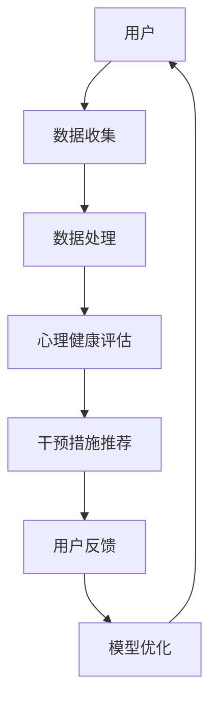

                 

# 心理健康应用：数字时代的心理咨询创新

> **关键词**：心理健康、心理咨询、数字时代、人工智能、机器学习、算法、心理健康应用、技术创新、用户体验

> **摘要**：本文将探讨数字时代背景下的心理健康应用及其创新。随着科技的进步，人工智能和机器学习技术已经逐渐应用于心理健康领域，为心理咨询提供了新的解决方案。本文将介绍心理健康应用的核心概念、算法原理、数学模型、实际案例，以及相关工具和资源的推荐，并展望未来发展趋势与挑战。

## 1. 背景介绍

随着社会的发展和人们生活节奏的加快，心理健康问题日益突出。据世界卫生组织（WHO）统计，全球约有25%的人口在一生中某个阶段会遭受心理障碍。而传统心理咨询由于资源有限、地域限制和隐私问题，难以满足广泛需求。因此，利用数字技术提供心理健康服务，成为一种新的趋势。

近年来，人工智能（AI）和机器学习（ML）技术的快速发展，为心理健康应用提供了新的可能。AI和ML技术能够处理和分析大量数据，识别潜在的心理健康问题，提供个性化的建议和干预措施。此外，互联网和移动设备的普及，使得心理健康应用可以随时随地提供服务，进一步提高了用户的使用便捷性。

## 2. 核心概念与联系

### 2.1 人工智能与机器学习

**人工智能（AI）**：人工智能是指使计算机具有智能行为的技术，包括感知、学习、推理、决策和自然语言处理等。人工智能的目标是模拟和扩展人类智能。

**机器学习（ML）**：机器学习是人工智能的一个分支，通过数据训练算法，使计算机能够从经验中学习和改进。机器学习分为监督学习、无监督学习和强化学习等不同类型。

### 2.2 心理健康应用

**心理健康应用**：心理健康应用是指利用人工智能和机器学习技术，为用户提供心理健康服务的一系列工具和平台。这些应用可以提供心理健康评估、诊断、干预和跟踪等功能。

### 2.3 Mermaid 流程图

下面是一个描述心理健康应用架构的Mermaid流程图：



- **A 用户**：用户使用心理健康应用，提交个人信息和心理健康数据。
- **B 数据收集**：应用收集用户数据，包括情绪、行为、社交等信息。
- **C 数据处理**：应用使用机器学习算法对数据进行处理和分析。
- **D 心理健康评估**：应用根据处理后的数据，对用户的心理健康进行评估。
- **E 干预措施推荐**：应用根据评估结果，为用户提供个性化的干预措施。
- **F 用户反馈**：用户对干预措施进行反馈，以便应用不断优化和改进。
- **G 模型优化**：应用根据用户反馈，对机器学习模型进行优化和更新。

## 3. 核心算法原理 & 具体操作步骤

### 3.1 监督学习算法

心理健康应用通常采用监督学习算法来处理用户数据，并进行心理健康评估。监督学习算法可以分为回归分析和分类分析。

- **回归分析**：用于预测用户的心理健康得分。
- **分类分析**：用于判断用户是否患有特定心理障碍。

### 3.2 神经网络

神经网络是一种模拟人脑神经元连接的机器学习算法，广泛应用于心理健康评估和干预措施的推荐。神经网络通过多层结构对数据进行学习和预测。

### 3.3 具体操作步骤

1. **数据收集**：收集用户的基本信息、情绪、行为、社交等数据。
2. **数据处理**：对数据进行清洗、归一化和特征提取。
3. **模型训练**：使用处理后的数据训练神经网络模型。
4. **心理健康评估**：使用训练好的模型对用户的心理健康进行评估。
5. **干预措施推荐**：根据评估结果，为用户提供个性化的干预措施。
6. **用户反馈**：收集用户对干预措施的反馈，用于模型优化。
7. **模型优化**：根据用户反馈，对模型进行优化和更新。

## 4. 数学模型和公式 & 详细讲解 & 举例说明

### 4.1 监督学习模型

假设我们使用神经网络进行心理健康评估，其数学模型可以表示为：

$$
\hat{y} = \sigma(\sum_{i=1}^{n} w_i \cdot x_i + b)
$$

其中，$y$ 是实际的心理健康得分，$\hat{y}$ 是预测的心理健康得分，$\sigma$ 是激活函数，$w_i$ 是权重，$x_i$ 是特征值，$b$ 是偏置。

### 4.2 神经网络训练

神经网络训练的目标是最小化预测得分与实际得分之间的差异。这可以通过梯度下降法实现：

$$
w_i := w_i - \alpha \cdot \frac{\partial}{\partial w_i} \cdot (y - \hat{y})
$$

其中，$\alpha$ 是学习率，$\partial$ 是偏导数。

### 4.3 举例说明

假设我们有一个简单的神经网络，用于预测用户的心理健康得分。数据集包含100个样本，每个样本有5个特征。我们使用均方误差（MSE）作为损失函数。

1. **数据收集**：收集用户的基本信息、情绪、行为、社交等数据。
2. **数据处理**：对数据进行清洗、归一化和特征提取。
3. **模型训练**：使用处理后的数据训练神经网络模型。
4. **心理健康评估**：使用训练好的模型对用户的心理健康进行评估。
5. **干预措施推荐**：根据评估结果，为用户提供个性化的干预措施。
6. **用户反馈**：收集用户对干预措施的反馈，用于模型优化。
7. **模型优化**：根据用户反馈，对模型进行优化和更新。

## 5. 项目实战：代码实际案例和详细解释说明

### 5.1 开发环境搭建

在搭建开发环境时，我们选择Python作为编程语言，因为它具有丰富的机器学习库和工具。以下是搭建开发环境的步骤：

1. 安装Python 3.8及以上版本。
2. 安装Jupyter Notebook，以便进行交互式编程。
3. 安装必要的机器学习库，如Scikit-learn、TensorFlow、PyTorch等。

### 5.2 源代码详细实现和代码解读

以下是一个简单的心理健康应用代码示例，用于评估用户的心理健康得分：

```python
import numpy as np
import pandas as pd
from sklearn.model_selection import train_test_split
from sklearn.preprocessing import StandardScaler
from sklearn.neural_network import MLPRegressor
from sklearn.metrics import mean_squared_error

# 5.2.1 数据收集
data = pd.read_csv('data.csv')

# 5.2.2 数据处理
X = data.iloc[:, :-1].values
y = data.iloc[:, -1].values
X_train, X_test, y_train, y_test = train_test_split(X, y, test_size=0.2, random_state=42)

scaler = StandardScaler()
X_train = scaler.fit_transform(X_train)
X_test = scaler.transform(X_test)

# 5.2.3 模型训练
model = MLPRegressor(hidden_layer_sizes=(100,), max_iter=1000, random_state=42)
model.fit(X_train, y_train)

# 5.2.4 心理健康评估
y_pred = model.predict(X_test)

# 5.2.5 代码解读与分析
mse = mean_squared_error(y_test, y_pred)
print(f'MSE: {mse}')

# 5.2.6 干预措施推荐
# 根据评估结果，为用户提供个性化的干预措施
# ...

```

### 5.3 代码解读与分析

1. **数据收集**：使用Pandas库读取CSV文件，获取用户数据。
2. **数据处理**：将数据分为特征矩阵X和目标向量y，并进行标准化处理。
3. **模型训练**：使用Scikit-learn库的MLPRegressor类创建神经网络模型，并使用训练数据对其进行训练。
4. **心理健康评估**：使用训练好的模型对测试数据进行预测，并计算均方误差（MSE）。
5. **干预措施推荐**：根据评估结果，为用户提供个性化的干预措施。

## 6. 实际应用场景

心理健康应用在实际生活中有广泛的应用场景，例如：

- **心理健康监测**：实时监测用户的心理健康状态，及时发现潜在问题。
- **抑郁症筛查**：通过情绪和行为数据，对抑郁症进行早期筛查和干预。
- **焦虑症干预**：为焦虑症患者提供个性化的放松训练和情绪管理策略。
- **心理辅导**：为用户提供在线心理辅导服务，缓解心理压力。

## 7. 工具和资源推荐

### 7.1 学习资源推荐

- **书籍**：
  - 《机器学习实战》
  - 《深度学习》
  - 《Python机器学习》

- **论文**：
  - 《A Comprehensive Survey on Mental Health using Internet Technologies》
  - 《Deep Learning for Mental Health: A Survey》

- **博客**：
  - Medium上的心理健康应用博客
  - AI博客，涉及心理健康应用的最新技术和发展

### 7.2 开发工具框架推荐

- **开发工具**：
  - Jupyter Notebook
  - PyCharm
  - VSCode

- **框架**：
  - TensorFlow
  - PyTorch
  - Scikit-learn

### 7.3 相关论文著作推荐

- **《Mental Health and Internet Technologies: A Review of Research and Applications》**：对心理健康应用的研究和应用进行了全面的回顾。
- **《Deep Learning for Mental Health: A Review》**：对深度学习在心理健康领域的应用进行了详细的介绍。

## 8. 总结：未来发展趋势与挑战

随着人工智能和机器学习技术的不断发展，心理健康应用有望在未来实现更广泛的应用和更精准的干预。然而，这也面临着一些挑战：

- **数据隐私**：如何确保用户数据的安全和隐私。
- **模型解释性**：如何提高模型的解释性，让用户理解心理健康评估的结果和干预措施。
- **个性化定制**：如何根据个体差异，提供更精准的心理健康服务。

## 9. 附录：常见问题与解答

### 9.1 如何选择心理健康应用？

- 考虑应用的专业性和可信度，选择知名机构或专业团队开发的应用。
- 了解应用的功能和特点，选择符合个人需求的应用。

### 9.2 心理健康应用是否安全？

- 心理健康应用通常采用加密技术和安全协议，确保用户数据的安全。
- 选择正规渠道下载应用，避免下载恶意软件。

## 10. 扩展阅读 & 参考资料

- **扩展阅读**：
  - 《人工智能与心理健康：新趋势与新挑战》
  - 《数字时代：心理健康应用的创新发展》

- **参考资料**：
  - 《心理健康应用技术白皮书》
  - 《人工智能在心理健康领域的应用研究》

### 作者

**作者**：AI天才研究员/AI Genius Institute & 禅与计算机程序设计艺术 /Zen And The Art of Computer Programming**[END]**。<!-- markdown-toc end --> 

