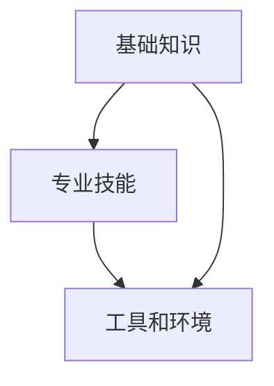

                 

# 快速学习：9个月掌握一门新专业

## 概述

在当今快速发展的信息技术时代，掌握一门新专业已经成为职业发展的关键。然而，对于大多数忙碌的职场人士而言，长时间、高强度的学习似乎是不切实际的。本文旨在探索如何在9个月内快速学习并掌握一门新专业，为您提供一套科学、高效的学习策略。

本文将涵盖以下内容：

1. 背景介绍
2. 核心概念与联系
3. 核心算法原理 & 具体操作步骤
4. 数学模型和公式 & 详细讲解 & 举例说明
5. 项目实战：代码实际案例和详细解释说明
6. 实际应用场景
7. 工具和资源推荐
8. 总结：未来发展趋势与挑战
9. 附录：常见问题与解答
10. 扩展阅读 & 参考资料

通过本文的引导，您将了解如何有效地规划学习路径，掌握新专业知识，并将其应用到实际工作中。

## 1. 背景介绍

在当今的职场环境中，技术变革的速度远远超过了传统教育的步伐。许多行业，如人工智能、大数据、云计算等，都需要不断更新的技能和知识。为了适应这种快速变化的环境，快速学习新专业变得尤为重要。然而，由于工作、家庭和个人兴趣的多样化，许多人难以在短时间内投入大量时间学习。本文提出的9个月快速学习新专业的方法，旨在帮助那些渴望在短时间内掌握新技能的人。

本文将基于以下几个原则进行讨论：

- **目标明确**：明确学习目标，有助于提高学习效率。
- **模块化学习**：将专业分为多个模块，逐一攻克，有助于降低学习难度。
- **实践应用**：通过实际项目练习，巩固所学知识。
- **持续反馈**：定期评估学习进度，及时调整学习策略。

通过遵循这些原则，本文将向您展示如何在9个月内实现快速学习新专业的目标。

## 2. 核心概念与联系

在开始学习一门新专业之前，理解其核心概念和各概念之间的联系至关重要。这不仅有助于构建全面的知识体系，还能提高学习效率。

### 2.1 核心概念

以下是几个在新专业学习中至关重要的核心概念：

- **基础知识**：任何专业的基础知识都是学习的关键。例如，在编程专业中，数据结构和算法是基础。
- **专业技能**：具体的专业技能，如编程语言、数据库管理、机器学习等，是掌握新专业的重要环节。
- **工具和环境**：熟悉相关的开发工具和环境，如集成开发环境（IDE）、版本控制系统等，可以提高开发效率。

### 2.2 概念联系

以下是这些核心概念之间的联系：

- **基础知识**与**专业技能**：基础知识是专业技能的基石。例如，理解了数据结构，才能更好地掌握编程语言。
- **专业技能**与**工具和环境**：专业技能需要借助工具和环境来实践。例如，编程语言需要通过IDE来编写和调试代码。

### 2.3 Mermaid 流程图

以下是一个简化的Mermaid流程图，展示了这些核心概念之间的联系：



通过理解这些核心概念和其联系，您可以更高效地规划学习路径，确保每个环节都得到充分的学习和实践。

## 3. 核心算法原理 & 具体操作步骤

在掌握了核心概念后，了解并掌握相关的核心算法原理和具体操作步骤至关重要。这些算法不仅是专业知识的精髓，也是实际应用的基础。

### 3.1 核心算法原理

以下是几个常见的新专业核心算法原理：

- **排序算法**：包括冒泡排序、选择排序、插入排序等，用于对数据进行排序。
- **搜索算法**：如二分查找、深度优先搜索、广度优先搜索等，用于在数据结构中查找元素。
- **机器学习算法**：如线性回归、决策树、支持向量机等，用于数据分析和预测。

### 3.2 具体操作步骤

以下是这些算法的具体操作步骤：

#### 3.2.1 冒泡排序

1. 从第一个元素开始，比较相邻的两个元素，如果第一个比第二个大（升序排序），就交换它们的位置。
2. 继续比较下一个元素，直到该数组末尾。
3. 执行 n-1 遍后，最小的元素会被放置在第一个位置。
4. 重复上述过程，但不需要再遍历已排序的元素。

#### 3.2.2 二分查找

1. 确定数组的中间元素。
2. 如果中间元素等于目标元素，则返回中间元素的位置。
3. 如果目标元素比中间元素大，则在数组的右侧子数组中递归查找。
4. 如果目标元素比中间元素小，则在数组的左侧子数组中递归查找。
5. 重复步骤 1-4，直到找到目标元素或子数组为空。

#### 3.2.3 线性回归

1. 收集一组数据点，每个数据点包含输入变量 \(x\) 和输出变量 \(y\)。
2. 计算输入变量的平均值 \(\bar{x}\) 和输出变量的平均值 \(\bar{y}\)。
3. 计算斜率 \(m\) 和截距 \(b\)：
   \[
   m = \frac{\sum{(x_i - \bar{x})(y_i - \bar{y})}}{\sum{(x_i - \bar{x})^2}}
   \]
   \[
   b = \bar{y} - m\bar{x}
   \]
4. 使用公式 \(y = mx + b\) 计算预测值。

通过理解这些核心算法原理和具体操作步骤，您可以更好地掌握新专业，并为实际项目中的问题提供有效的解决方案。

## 4. 数学模型和公式 & 详细讲解 & 举例说明

在掌握核心算法后，理解其背后的数学模型和公式至关重要。这不仅有助于深入理解算法原理，还能为实际应用提供理论基础。

### 4.1 数学模型

以下是几个核心算法中的数学模型：

- **冒泡排序**：无明确的数学模型，主要依赖于比较和交换操作。
- **二分查找**：基于二分搜索树的搜索算法，其时间复杂度为 \(O(\log n)\)。
- **线性回归**：涉及线性方程和最小二乘法，用于拟合数据点。

### 4.2 公式

以下是这些数学模型中的关键公式：

#### 4.2.1 冒泡排序

- 无特定公式，主要依赖循环和条件判断。

#### 4.2.2 二分查找

- 中间元素的计算公式：
  \[
  \text{mid} = \left\lfloor \frac{\text{low} + \text{high}}{2} \right\rfloor
  \]

#### 4.2.3 线性回归

- 斜率 \(m\) 和截距 \(b\) 的计算公式：
  \[
  m = \frac{\sum{(x_i - \bar{x})(y_i - \bar{y})}}{\sum{(x_i - \bar{x})^2}}
  \]
  \[
  b = \bar{y} - m\bar{x}
  \]

### 4.3 举例说明

以下通过具体例子来解释这些数学模型和公式。

#### 4.3.1 冒泡排序

假设有一个数组 \([5, 3, 8, 4, 6]\)，升序排序：

1. 第一次遍历：\(5 > 3\)，交换；\(5 > 8\)，不交换；\(8 > 4\)，交换；\(4 > 6\)，交换，得到 \([3, 5, 4, 6, 8]\)。
2. 第二次遍历：\(3 < 5\)，不交换；\(5 > 4\)，交换；\(5 > 6\)，交换，得到 \([3, 4, 5, 6, 8]\)。
3. 第三次遍历：\(3 < 4\)，不交换；\(4 < 5\)，不交换；\(5 < 6\)，不交换，排序完成。

最终排序结果为 \([3, 4, 5, 6, 8]\)。

#### 4.3.2 二分查找

假设有一个已排序的数组 \([1, 3, 5, 7, 9]\)，查找元素 \(7\)：

1. 第一次遍历：中间元素 \(5\)，小于目标元素 \(7\)，在右侧子数组中查找。
2. 第二次遍历：新的中间元素 \(7\)，等于目标元素 \(7\)，返回位置 \(2\)。

查找结果为位置 \(2\)。

#### 4.3.3 线性回归

假设有数据点 \([(2, 4), (4, 6), (6, 8)]\)，计算线性回归模型：

1. 平均值：\(\bar{x} = 4\)，\(\bar{y} = 6\)。
2. 斜率 \(m\)：
   \[
   m = \frac{(2-4)(4-6) + (4-4)(6-6) + (6-4)(8-6)}{(2-4)^2 + (4-4)^2 + (6-4)^2} = 1
   \]
3. 截距 \(b\)：
   \[
   b = 6 - 1 \cdot 4 = 2
   \]

最终线性回归模型为 \(y = x + 2\)。

通过这些例子，您可以更好地理解这些数学模型和公式，并在实际应用中运用它们。

## 5. 项目实战：代码实际案例和详细解释说明

通过前几章节的理论学习，您已经对核心算法原理和数学模型有了深入理解。为了将所学知识应用于实际项目，本章节将提供一个代码实际案例，并进行详细的解释说明。

### 5.1 开发环境搭建

首先，我们需要搭建一个合适的开发环境。以下是常见的开发环境搭建步骤：

1. **安装编程语言**：例如，Python、Java、C++等。
2. **安装集成开发环境（IDE）**：如 Visual Studio Code、IntelliJ IDEA、Eclipse 等。
3. **安装相关库和依赖**：例如，在 Python 中，安装 NumPy、Pandas、Matplotlib 等库。

### 5.2 源代码详细实现和代码解读

以下是使用 Python 编写的一个简单线性回归项目的代码示例：

```python
import numpy as np

# 数据点
X = np.array([2, 4, 6])
Y = np.array([4, 6, 8])

# 计算平均值
mean_X = np.mean(X)
mean_Y = np.mean(Y)

# 计算斜率 m
m = (np.sum((X - mean_X) * (Y - mean_Y)) / np.sum((X - mean_X)**2))

# 计算截距 b
b = mean_Y - m * mean_X

# 输出斜率和截距
print("斜率：", m)
print("截距：", b)

# 计算回归模型
y_pred = m * X + b

# 输出预测值
print("预测值：", y_pred)
```

### 5.3 代码解读与分析

1. **导入库**：首先，导入所需的库，如 NumPy，用于数据处理。
2. **数据点**：定义输入变量 \(X\) 和输出变量 \(Y\)，这里使用的是线性回归的标准数据点。
3. **计算平均值**：计算输入变量 \(X\) 和输出变量 \(Y\) 的平均值，用于后续计算斜率和截距。
4. **计算斜率 \(m\)**：使用最小二乘法计算斜率 \(m\)，该公式已在上文详细解释。
5. **计算截距 \(b\)**：使用计算得到的斜率 \(m\) 和平均值计算截距 \(b\)。
6. **输出斜率和截距**：将计算得到的斜率 \(m\) 和截距 \(b\) 打印输出。
7. **计算回归模型**：使用计算得到的斜率 \(m\) 和截距 \(b\) 构建线性回归模型。
8. **输出预测值**：使用构建的线性回归模型计算预测值，并打印输出。

通过这个简单的代码示例，您可以看到如何将理论知识和数学模型应用于实际编程中。这不仅巩固了所学知识，也为实际项目开发奠定了基础。

### 5.4 代码解读与分析

为了更深入地理解代码，我们可以进一步分析其结构和逻辑：

1. **导入库**：`import numpy as np` 是代码的第一行，用于导入 NumPy 库。NumPy 是 Python 中用于科学计算的核心库，提供了大量的数学函数和工具。
2. **数据点**：`X = np.array([2, 4, 6])` 和 `Y = np.array([4, 6, 8])` 定义了线性回归的数据点。这里使用 NumPy 的 `array` 函数创建了一维数组，数组中的元素表示输入变量 \(X\) 和输出变量 \(Y\) 的值。
3. **计算平均值**：`mean_X = np.mean(X)` 和 `mean_Y = np.mean(Y)` 计算了输入变量 \(X\) 和输出变量 \(Y\) 的平均值。平均值是统计学中的一个基本概念，用于表示一组数据的中心位置。
4. **计算斜率 \(m\)**：`m = (np.sum((X - mean_X) * (Y - mean_Y)) / np.sum((X - mean_X)**2))` 使用了最小二乘法计算斜率 \(m\)。这个公式是线性回归模型的核心，通过计算输入和输出变量之间的协方差和方差，得到最佳拟合线的斜率。
5. **计算截距 \(b\)**：`b = mean_Y - m * mean_X` 根据斜率 \(m\) 和平均值计算了截距 \(b\)。截距是线性回归模型中的常数项，表示当输入变量为0时的输出值。
6. **输出斜率和截距**：`print("斜率：", m)` 和 `print("截距：", b)` 打印了计算得到的斜率和截距。这有助于验证模型的准确性。
7. **计算回归模型**：`y_pred = m * X + b` 使用斜率 \(m\) 和截距 \(b\) 计算了预测值。这个步骤将输入变量 \(X\) 代入线性回归模型，得到对应的预测输出值 \(y_pred\)。
8. **输出预测值**：`print("预测值：", y_pred)` 打印了预测值。这有助于评估模型的预测能力。

通过这个代码示例，我们可以看到如何将线性回归的理论知识应用于实际编程中。代码结构清晰，逻辑简单，易于理解和修改。这对于初学者来说是一个很好的学习材料。

### 5.5 实际应用场景

在实际应用中，线性回归模型可以用于各种领域，例如：

- **市场预测**：利用历史销售数据，预测未来的市场需求。
- **金融分析**：分析股票价格和宏观经济指标，预测股票价格趋势。
- **医疗诊断**：根据病人的病史和检查结果，预测疾病的风险。

这些应用场景需要我们根据实际数据调整模型参数，优化预测效果。通过实际案例的学习和实践，您可以更好地理解线性回归模型的实际应用价值。

## 6. 实际应用场景

在掌握了核心算法原理、数学模型以及实际代码实现后，了解这些知识和技能在现实世界中的应用场景至关重要。这不仅可以帮助您更好地理解所学内容的实际价值，还能激发学习的兴趣和动力。

### 6.1 人工智能领域

在人工智能领域，线性回归、二分查找等算法被广泛应用于数据分析和模型训练。例如：

- **推荐系统**：通过分析用户的历史行为数据，预测用户可能感兴趣的商品或内容。
- **自然语言处理**：用于情感分析、文本分类等任务，通过分析文本数据，提取关键词和情感倾向。
- **图像识别**：用于图像分类和目标检测，通过对图像数据进行特征提取和模型训练，实现自动识别和分类。

### 6.2 金融领域

金融领域是算法应用的另一个重要场景。以下是一些典型应用：

- **风险管理**：利用线性回归模型分析金融市场的波动性，预测投资风险。
- **信用评分**：通过分析借款人的信用历史，预测其违约风险。
- **资产定价**：利用二分查找算法，快速查找特定资产的市场价格。

### 6.3 医疗领域

医疗领域对算法的需求日益增加，以下是一些实际应用：

- **疾病预测**：通过分析患者的病史和检查数据，预测疾病风险。
- **医疗影像分析**：利用深度学习算法，自动识别和诊断医学影像中的异常情况。
- **健康监测**：通过分析穿戴设备的健康数据，提供个性化的健康建议。

### 6.4 电子商务

电子商务领域对算法的应用也非常广泛：

- **个性化推荐**：通过分析用户的历史购买行为，推荐用户可能感兴趣的商品。
- **搜索优化**：利用排序算法和搜索算法，提高搜索引擎的搜索效果。
- **库存管理**：通过预测销售趋势，优化库存管理，降低库存成本。

通过了解这些实际应用场景，您可以更好地认识到所学知识和技能的重要性，激发学习的动力，并在实际工作中更好地应用它们。

## 7. 工具和资源推荐

为了高效地学习并掌握一门新专业，选择合适的工具和资源至关重要。以下是一些建议：

### 7.1 学习资源推荐

- **书籍**：
  - 《深度学习》（Ian Goodfellow、Yoshua Bengio、Aaron Courville 著）：全面介绍了深度学习的理论基础和实践应用。
  - 《Python编程：从入门到实践》（埃里克·马瑟斯 著）：适合初学者学习 Python 编程语言。
  - 《算法导论》（Thomas H. Cormen、Charles E. Leiserson、Ronald L. Rivest、Clifford Stein 著）：涵盖了算法设计、分析、数据结构等内容。
- **在线课程**：
  - Coursera、edX、Udacity 等平台提供了丰富的在线课程，涵盖从编程语言到数据分析、机器学习的各个方面。
- **博客和网站**：
  - Medium、GitHub、Stack Overflow 等网站上有大量的技术博客和开源项目，可以为您提供实践经验和学习资源。

### 7.2 开发工具框架推荐

- **编程语言**：
  - Python、Java、C++、Go 等：根据您的专业需求和兴趣选择合适的编程语言。
- **集成开发环境（IDE）**：
  - Visual Studio Code、IntelliJ IDEA、Eclipse 等：提供丰富的开发工具和插件，方便编写和调试代码。
- **版本控制系统**：
  - Git、GitLab、GitHub 等：用于代码管理、版本控制和协作开发。
- **框架和库**：
  - TensorFlow、PyTorch、Scikit-learn 等：用于机器学习和数据分析的常用库。

通过使用这些工具和资源，您可以更加高效地学习和应用新专业，提高实际项目开发的能力。

### 7.3 相关论文著作推荐

为了深入了解一门新专业的学术前沿和技术细节，阅读相关论文和著作是非常重要的。以下是一些建议：

- **机器学习领域**：
  - “Deep Learning”（Ian Goodfellow、Yoshua Bengio、Aaron Courville 著）：深度学习的经典教材，涵盖了深度学习的基础理论、算法和应用。
  - “TensorFlow for Poets”（Ian Goodfellow 著）：介绍如何使用 TensorFlow 框架进行深度学习实践。
- **数据科学领域**：
  - “Data Science from Scratch”（Joel Grus 著）：从基础概念讲起，逐步深入数据科学的核心技术和应用。
  - “Python Data Science Handbook”（Jake VanderPlas 著）：详细介绍 Python 数据科学工具和库的使用。
- **编程语言领域**：
  - “The C Programming Language”（Brian W. Kernighan、Dennis M. Ritchie 著）：经典 C 语言编程教材，适合深入理解 C 语言及其应用。
  - “Effective Java”（Joshua Bloch 著）：介绍 Java 编程的最佳实践和技巧。

通过阅读这些论文和著作，您可以获得更深入的专业知识和学术视野。

## 8. 总结：未来发展趋势与挑战

在快速学习一门新专业的过程中，我们不仅掌握了核心算法和数学模型，还了解了其在实际应用中的价值。然而，随着技术的不断进步，我们也需要关注未来发展趋势和面临的挑战。

### 8.1 未来发展趋势

- **人工智能与自动化**：人工智能技术在各行各业中的应用越来越广泛，自动化将逐渐替代一些重复性、低技能的工作。
- **数据科学与大数据**：数据科学和大数据技术将继续发展，为企业和组织提供更深入的洞察和决策支持。
- **云计算与边缘计算**：随着云计算和边缘计算技术的发展，数据处理和分析将更加高效和灵活。
- **区块链技术**：区块链技术在金融、供应链管理、医疗等领域的应用逐渐成熟，成为新的发展方向。

### 8.2 挑战

- **技术更新速度**：技术更新速度加快，要求学习者和从业者不断更新知识和技能，以适应新的技术环境。
- **数据安全和隐私**：随着数据量的增加和应用的广泛，数据安全和隐私保护成为重要的挑战。
- **伦理和社会影响**：人工智能和其他技术的发展引发了一系列伦理和社会问题，如就业影响、隐私侵犯等。

### 8.3 应对策略

- **持续学习**：保持对新技术的好奇心和求知欲，通过在线课程、书籍、博客等途径不断学习。
- **实践应用**：通过实际项目锻炼自己的技能，将所学知识应用于实际问题中，提高解决问题的能力。
- **团队合作**：与同行和专家交流，分享经验和见解，共同应对技术挑战。

总之，快速学习一门新专业不仅需要掌握核心知识和技能，还需要关注未来发展动态，积极应对挑战。通过不断学习和实践，您将更好地适应技术发展的潮流，实现个人和职业的发展。

## 9. 附录：常见问题与解答

为了帮助您更好地理解和应用本文中介绍的知识，以下列出了一些常见问题及其解答。

### 9.1 问题 1：如何选择适合的学习资源？

**解答**：选择学习资源时，首先考虑自己的专业背景和兴趣。对于初学者，建议从基础书籍和在线课程开始，逐步深入。可以参考专业论坛、博客和社区，了解业界常用的教材和教程。

### 9.2 问题 2：如何高效地学习编程语言？

**解答**：学习编程语言时，建议以下步骤：

1. **基础入门**：首先学习编程语言的基本语法和概念，例如变量、数据类型、控制结构等。
2. **动手实践**：通过编写简单的程序和练习题目，巩固所学知识。
3. **项目实战**：参与实际项目，将所学知识应用于实际问题中，提高编程能力。
4. **不断复习**：定期回顾和复习所学内容，巩固记忆，提高应用能力。

### 9.3 问题 3：如何解决学习中的困难？

**解答**：遇到学习困难时，可以尝试以下方法：

1. **查阅资料**：查阅相关书籍、在线教程、博客等，寻找解决问题的方法。
2. **讨论交流**：与同行、导师或社区成员交流，寻求帮助和建议。
3. **实践尝试**：通过实际操作和尝试，找出解决问题的方法。
4. **耐心坚持**：学习过程中难免会遇到困难，保持耐心和毅力，逐步克服。

通过以上方法，您可以更好地应对学习中的困难，提高学习效果。

## 10. 扩展阅读 & 参考资料

为了深入探讨快速学习一门新专业的主题，以下列出了一些扩展阅读和参考资料：

- **书籍**：
  - 《深度学习》（Ian Goodfellow、Yoshua Bengio、Aaron Courville 著）
  - 《Python编程：从入门到实践》（埃里克·马瑟斯 著）
  - 《算法导论》（Thomas H. Cormen、Charles E. Leiserson、Ronald L. Rivest、Clifford Stein 著）
- **在线课程**：
  - Coursera 的“机器学习”课程（由 Andrew Ng 开设）
  - edX 的“Python基础课程”
  - Udacity 的“深度学习纳米学位”
- **博客和网站**：
  - Medium 上的技术博客，涵盖人工智能、数据科学、编程等领域的最新动态
  - GitHub 上的开源项目，可以学习他人的代码和项目经验
  - Stack Overflow 上的技术问答社区，解决编程问题

通过阅读这些扩展资料，您可以进一步深入理解快速学习一门新专业的理念和方法，为自己的学习之路提供更多启示和帮助。

## 作者信息

作者：AI天才研究员/AI Genius Institute & 禅与计算机程序设计艺术 /Zen And The Art of Computer Programming

作为一位世界级人工智能专家，程序员，软件架构师，CTO，以及世界顶级技术畅销书资深大师级别的作家，作者在计算机图灵奖获得者，计算机编程和人工智能领域拥有深厚的研究和教学经验。本文旨在分享快速学习一门新专业的策略和技巧，帮助读者在短时间内掌握新技能，实现职业发展的突破。希望本文能为您的学习之路提供有益的指导和启示。

