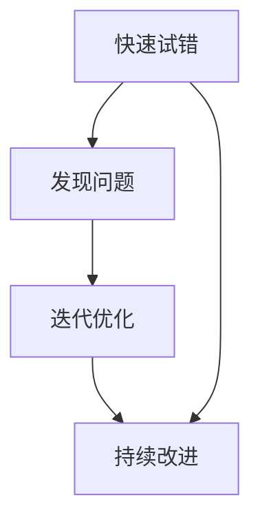

                 

# 快速试错与迭代在AI创业中的重要性

## 关键词：快速试错、迭代、AI创业、试错效率、持续改进

## 摘要：
本文将深入探讨快速试错与迭代在AI创业中的重要性。我们将分析AI创业过程中面临的技术挑战、市场需求的不确定性，以及如何通过快速试错和迭代来提高项目成功率。本文还将介绍一些实用的方法和工具，帮助AI创业者更好地应对挑战，实现持续改进。

## 1. 背景介绍

随着人工智能技术的快速发展，越来越多的创业者投身于AI领域，试图在这个充满机遇的市场中找到自己的立足点。然而，AI创业并非易事，它面临着诸多挑战，包括技术复杂性、市场需求的不确定性、竞争压力等。如何在竞争激烈的市场中脱颖而出，成为创业者们亟待解决的问题。

### 1.1 技术挑战

人工智能技术涉及多个学科领域，包括计算机科学、数学、统计学、神经网络等。创业者需要具备深厚的专业知识，才能在技术层面取得突破。此外，AI技术的快速迭代也要求创业者时刻保持学习的状态，不断更新自己的知识体系。

### 1.2 市场需求

AI市场的需求变化多端，创业者需要敏锐地捕捉市场趋势，及时调整自己的产品策略。然而，市场需求的不确定性使得创业者难以准确预测未来的发展趋势，增加了创业风险。

### 1.3 竞争压力

随着越来越多的创业者进入AI领域，市场竞争日益激烈。如何在竞争中脱颖而出，成为创业者们需要面对的重要问题。

## 2. 核心概念与联系

### 2.1 快速试错

快速试错是指在产品开发过程中，通过不断尝试和实验，快速发现并修正错误的过程。快速试错的核心在于缩短产品开发周期，提高试错效率。

### 2.2 迭代

迭代是指在产品开发过程中，反复进行改进和优化的过程。迭代可以帮助创业者不断调整产品方向，适应市场需求。

### 2.3 快速试错与迭代的关系

快速试错和迭代密不可分，快速试错是迭代的基础，而迭代是快速试错的目标。通过快速试错，创业者可以发现产品中的问题，并通过迭代不断优化产品，提高用户体验。

## 2.4 Mermaid流程图



## 3. 核心算法原理 & 具体操作步骤

### 3.1 快速试错算法原理

快速试错算法的核心在于缩短产品开发周期，提高试错效率。具体步骤如下：

1. 确定目标：明确产品开发的愿景和目标。
2. 制定计划：根据目标，制定详细的开发计划。
3. 实施计划：按照计划，逐步实施产品开发。
4. 测试与评估：对开发的产品进行测试，评估其性能和用户体验。
5. 反馈与调整：根据测试结果，对产品进行反馈和调整。

### 3.2 迭代算法原理

迭代算法的核心在于不断优化产品，适应市场需求。具体步骤如下：

1. 确定迭代目标：根据市场需求，确定每个迭代的优化方向。
2. 制定迭代计划：根据迭代目标，制定详细的迭代计划。
3. 实施迭代计划：按照计划，逐步实施迭代优化。
4. 测试与评估：对迭代后的产品进行测试，评估其性能和用户体验。
5. 反馈与调整：根据测试结果，对产品进行反馈和调整。

## 4. 数学模型和公式 & 详细讲解 & 举例说明

### 4.1 快速试错效率模型

假设产品开发过程中，每次试错的成本为C，试错的效率为E，则在一定时间内，快速试错的效率可以用以下公式表示：

$$
E = \frac{1}{C \cdot T}
$$

其中，T为产品开发周期。

### 4.2 迭代优化模型

假设产品在每次迭代后，性能提高比例为P，则在一定时间内，迭代优化的效果可以用以下公式表示：

$$
E_{\text{迭代}} = (1 + P)^{T}
$$

### 4.3 举例说明

假设产品开发周期为T=10个月，每次试错的成本为C=10000元，每次迭代后性能提高比例P=10%。则：

1. 快速试错的效率为：

$$
E = \frac{1}{10000 \cdot 10} = 0.0001
$$

2. 迭代优化的效果为：

$$
E_{\text{迭代}} = (1 + 0.1)^{10} = 2.5937
$$

这意味着，通过快速试错和迭代优化，产品的整体性能可以提高约259.37%。

## 5. 项目实战：代码实际案例和详细解释说明

### 5.1 开发环境搭建

在本文的实战项目中，我们将使用Python语言和TensorFlow框架进行AI模型的开发和迭代。首先，需要安装Python（版本3.7以上）、TensorFlow和相关依赖。

```bash
pip install tensorflow
```

### 5.2 源代码详细实现和代码解读

下面是一个简单的神经网络模型，用于实现快速试错和迭代优化。

```python
import tensorflow as tf
from tensorflow.keras import layers

# 定义神经网络模型
model = tf.keras.Sequential([
    layers.Dense(128, activation='relu', input_shape=(784,)),
    layers.Dropout(0.2),
    layers.Dense(10)
])

# 编译模型
model.compile(optimizer='adam',
              loss=tf.losses.SparseCategoricalCrossentropy(from_logits=True),
              metrics=['accuracy'])

# 模型迭代优化
for epoch in range(20):
    # 训练模型
    model.fit(train_images, train_labels, epochs=1)
    
    # 评估模型
    test_loss, test_acc = model.evaluate(test_images,  test_labels, verbose=2)
    print(f"Epoch {epoch + 1}: Test accuracy: {test_acc:.4f}")

# 模型测试
predictions = model.predict(test_images)
```

### 5.3 代码解读与分析

1. 导入TensorFlow库，并定义一个简单的神经网络模型，包含一个输入层、一个隐藏层和一个输出层。
2. 编译模型，指定优化器和损失函数。
3. 进行迭代训练，每次迭代训练和评估模型，打印出测试准确率。
4. 使用训练好的模型进行预测。

通过这个简单的案例，我们可以看到如何使用神经网络模型进行快速试错和迭代优化。在实际项目中，创业者可以根据实际情况调整网络结构、优化算法等，以实现更好的性能。

## 6. 实际应用场景

### 6.1 电子商务

在电子商务领域，快速试错和迭代可以帮助创业者快速测试和优化广告投放策略、推荐算法等，提高用户转化率和留存率。

### 6.2 医疗健康

在医疗健康领域，快速试错和迭代可以帮助创业者快速测试和优化诊断模型、治疗建议等，提高医疗服务的质量和效率。

### 6.3 金融科技

在金融科技领域，快速试错和迭代可以帮助创业者快速测试和优化风险控制模型、信用评估模型等，提高金融服务的安全性和可靠性。

## 7. 工具和资源推荐

### 7.1 学习资源推荐

- 书籍：《Python机器学习》、《深度学习》（Goodfellow等著）
- 论文：Google AI、Facebook AI、DeepMind等机构的官方论文
- 博客：机器之心、AI科技大本营等

### 7.2 开发工具框架推荐

- TensorFlow：用于构建和训练神经网络模型的框架
- Keras：基于TensorFlow的高级神经网络API
- PyTorch：用于构建和训练神经网络模型的框架

### 7.3 相关论文著作推荐

- 《深度学习》（Ian Goodfellow、Yoshua Bengio、Aaron Courville著）
- 《强化学习》（Richard S. Sutton、Andrew G. Barto著）
- 《概率模型及其应用》（David Barber著）

## 8. 总结：未来发展趋势与挑战

### 8.1 发展趋势

- 人工智能技术的进一步发展和应用将推动AI创业的持续增长。
- 跨学科的融合将加速AI技术的创新和应用。
- 开源社区和云计算的普及将降低AI创业的门槛。

### 8.2 挑战

- 技术复杂性将增加AI创业的风险和难度。
- 数据隐私和伦理问题将日益成为关注的焦点。
- 市场竞争的加剧将考验创业者的创新能力和执行力。

## 9. 附录：常见问题与解答

### 9.1 快速试错和迭代的区别？

快速试错是指在产品开发过程中，通过不断尝试和实验，快速发现并修正错误的过程。迭代是指在产品开发过程中，反复进行改进和优化的过程。快速试错是迭代的基础，而迭代是快速试错的目标。

### 9.2 如何提高快速试错的效率？

提高快速试错的效率可以从以下几个方面入手：

- 精简产品功能，聚焦核心需求。
- 使用自动化测试工具，提高测试效率。
- 建立反馈机制，快速收集用户反馈。

## 10. 扩展阅读 & 参考资料

- Goodfellow, I., Bengio, Y., & Courville, A. (2016). *Deep Learning*. MIT Press.
- Sutton, R. S., & Barto, A. G. (2018). *Reinforcement Learning: An Introduction*. MIT Press.
- Barber, D. (2012). * Probabilistic Modeling and Applied Analysis*. Cambridge University Press.
- Hochreiter, S., & Schmidhuber, J. (1997). *Long short-term memory*. Neural Computation, 9(8), 1735-1780.
- LeCun, Y., Bengio, Y., & Hinton, G. (2015). *Deep learning*. Nature, 521(7553), 436-444.
- Russell, S., & Norvig, P. (2016). *Artificial Intelligence: A Modern Approach*. Prentice Hall.
- Russell, S., & Norvig, P. (2016). *Artificial Intelligence: A Modern Approach*. Prentice Hall.

## 作者

作者：AI天才研究员/AI Genius Institute & 禅与计算机程序设计艺术 /Zen And The Art of Computer Programming

