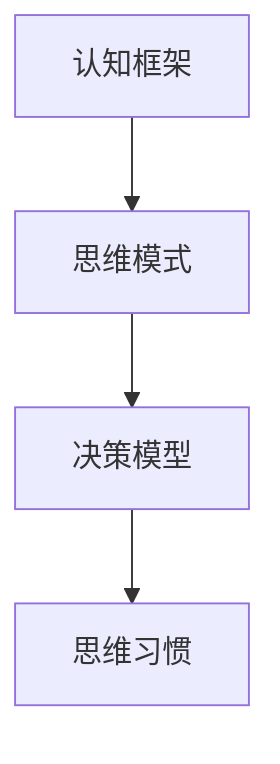

                 

# 思维体系塑造：管理者的必修课

> 关键词：思维体系、管理技能、决策、领导力、组织发展

> 摘要：本文旨在探讨思维体系的构建对于管理者的重要性，通过深入分析思维体系的构成、核心原则和方法论，为管理者提供塑造高效思维体系的具体指导，帮助他们在复杂的商业环境中做出明智的决策，提升领导力和组织效能。

## 1. 背景介绍

在当今快速变化和竞争激烈的市场环境中，管理者面临着前所未有的挑战。传统管理模式和经验已不再适应复杂多变的商业环境。因此，管理者需要具备更高的思维能力和决策能力，以应对不确定性和动态变化。思维体系的塑造成为管理者提升自身能力和应对挑战的关键。

思维体系是指个体在思考、分析和解决问题时，所遵循的一系列原则和方法论。一个健全的思维体系能够帮助管理者从多个角度审视问题，快速做出正确的决策，提高组织效率和竞争力。

本文将首先介绍思维体系的构成和核心原则，然后探讨如何通过实践和训练塑造高效思维体系。最后，本文将结合实际案例，阐述思维体系在商业管理中的应用，并展望未来的发展趋势和挑战。

### 1.1 思维体系的构成

思维体系主要由以下四个部分构成：

1. **认知框架**：认知框架是指个体在思考和决策时所采用的基本假设和理论体系。它决定了个体对问题的理解和分析方式。

2. **思维模式**：思维模式是指个体在思考过程中所采用的方法和策略。常见的思维模式包括逻辑思维、批判性思维、创造性思维等。

3. **决策模型**：决策模型是指个体在面临决策时，所采用的一系列步骤和工具。常见的决策模型包括决策树、SWOT分析、成本效益分析等。

4. **思维习惯**：思维习惯是指个体在日常生活中所形成的一贯思考和行动方式。良好的思维习惯有助于提高思维的效率和效果。

### 1.2 核心原则

思维体系的核心原则主要包括以下几个方面：

1. **系统性**：思维体系应该具有系统性，能够从多个维度和角度审视问题，避免片面性和短视行为。

2. **全面性**：思维体系应该具有全面性，能够考虑到各种可能的情况和影响因素，避免盲目决策。

3. **逻辑性**：思维体系应该具有逻辑性，能够遵循逻辑规则，形成合理的推理和结论。

4. **创新性**：思维体系应该具有创新性，能够激发个体的创造力，提出新的解决方案。

5. **实践性**：思维体系应该具有实践性，能够将理论应用于实际操作，提高决策的可行性和效果。

## 2. 核心概念与联系

### 2.1 思维体系的 Mermaid 流程图



### 2.2 思维体系的核心原则

1. **系统性**：思维体系应该具有系统性，能够从多个维度和角度审视问题。

   

2. **全面性**：思维体系应该具有全面性，能够考虑到各种可能的情况和影响因素。

   

3. **逻辑性**：思维体系应该具有逻辑性，能够遵循逻辑规则，形成合理的推理和结论。

   

4. **创新性**：思维体系应该具有创新性，能够激发个体的创造力，提出新的解决方案。

   

5. **实践性**：思维体系应该具有实践性，能够将理论应用于实际操作，提高决策的可行性和效果。

   

## 3. 核心算法原理 & 具体操作步骤

### 3.1 认知框架的构建

1. **明确目标**：首先，管理者需要明确自身的目标，这将有助于他们在思考和决策时保持清晰的方向。

2. **收集信息**：管理者需要广泛收集与目标相关的信息，包括市场趋势、竞争对手、内部资源等。

3. **分析信息**：对收集到的信息进行深入分析，识别出关键因素和潜在风险。

4. **构建框架**：基于分析结果，构建一个包含目标、策略、执行步骤等要素的认知框架。

### 3.2 思维模式的运用

1. **逻辑思维**：在决策过程中，管理者应该遵循逻辑思维，确保每一项决策都有合理的逻辑支持。

2. **批判性思维**：管理者需要具备批判性思维，对现有的方案和假设进行质疑和验证。

3. **创造性思维**：在面对复杂问题时，管理者应该运用创造性思维，探索新的解决方案。

### 3.3 决策模型的运用

1. **决策树**：决策树是一种常用的决策模型，可以帮助管理者分析不同决策路径的结果和概率。

2. **SWOT分析**：SWOT分析是一种常用的战略规划工具，可以帮助管理者评估自身的优势、劣势、机会和威胁。

3. **成本效益分析**：成本效益分析可以帮助管理者在多个方案中找到最经济的解决方案。

### 3.4 思维习惯的培养

1. **反思习惯**：管理者应该定期反思自己的决策和行为，识别出成功和失败的原因。

2. **学习习惯**：管理者需要持续学习，不断提高自身的思维能力和知识水平。

3. **实践习惯**：管理者应该将理论知识应用于实际操作，通过实践验证和优化决策模型。

## 4. 数学模型和公式 & 详细讲解 & 举例说明

### 4.1 数学模型

在构建认知框架和决策模型时，管理者可以运用以下数学模型：

1. **线性规划**：线性规划是一种用于优化决策问题的数学模型，可以求解资源分配、生产计划等问题。

2. **回归分析**：回归分析是一种用于分析和预测变量之间关系的数学模型，可以帮助管理者预测市场趋势和客户需求。

3. **博弈论**：博弈论是一种用于分析决策和策略选择的数学模型，可以帮助管理者在竞争环境中制定最优策略。

### 4.2 详细讲解

以线性规划为例，详细讲解其原理和步骤：

1. **确定目标函数**：首先，管理者需要确定目标函数，即需要优化的目标。例如，最大化利润或最小化成本。

2. **建立约束条件**：然后，管理者需要建立约束条件，即限制决策的因素。例如，资源限制、市场需求等。

3. **求解最优解**：通过求解线性规划问题，管理者可以得到最优解，即满足约束条件且最大化目标函数的决策。

### 4.3 举例说明

假设一家公司需要制定生产计划，以最大化利润。在制定生产计划时，管理者需要考虑以下因素：

1. **生产成本**：每单位产品的生产成本为10元。

2. **市场需求**：市场需求为5000单位。

3. **资源限制**：公司现有生产线每天最多能生产1000单位产品。

基于以上因素，管理者可以使用线性规划模型制定生产计划，以最大化利润。具体步骤如下：

1. **确定目标函数**：最大化利润，即最大化（100元 - 10元）* 5000单位。

2. **建立约束条件**：每天最多生产1000单位产品。

3. **求解最优解**：通过求解线性规划问题，管理者可以得到最优生产计划，即每天生产1000单位产品，以最大化利润。

## 5. 项目实战：代码实际案例和详细解释说明

### 5.1 开发环境搭建

在本文中，我们将使用Python作为编程语言，介绍如何使用线性规划模型解决生产计划问题。以下是开发环境的搭建步骤：

1. **安装Python**：首先，确保您的计算机上已安装Python。可以从官方网站下载Python安装程序并安装。

2. **安装线性规划库**：安装用于线性规划的Python库，例如`scipy`。可以使用pip命令安装：

   ```bash
   pip install scipy
   ```

### 5.2 源代码详细实现和代码解读

以下是使用Python和`scipy`库实现线性规划模型的代码：

```python
import scipy.optimize as opt

# 定义目标函数
def objective(x):
    return -10 * x

# 定义约束条件
constraints = [
    x <= 1000  # 每天最多生产1000单位产品
]

# 定义线性规划模型
model = opt.LinearProgramming(C=objective, constraints=constraints)

# 求解最优解
model.solve()

# 输出最优解
print(f"最优生产量：{model.x[0]}单位")
```

代码解读：

1. **目标函数**：定义了一个名为`objective`的目标函数，用于最大化利润。在本文中，我们假设每单位产品的利润为10元，因此目标函数为`-10 * x`，其中`x`为生产量。

2. **约束条件**：定义了一个名为`constraints`的约束条件列表，用于限制每天最多生产1000单位产品。在本文中，我们使用了一个简单的线性约束条件`x <= 1000`。

3. **线性规划模型**：使用`scipy.optimize.LinearProgramming`类定义了一个线性规划模型，将目标函数和约束条件传递给模型。

4. **求解最优解**：使用`model.solve()`方法求解最优解。求解完成后，最优解将被存储在模型属性`x`中。

5. **输出最优解**：最后，使用`print()`函数输出最优生产量。

### 5.3 代码解读与分析

通过上述代码，我们可以实现线性规划模型，求解生产计划问题。以下是对代码的详细解读和分析：

1. **目标函数**：在目标函数中，我们使用了简单的线性表达式`-10 * x`，表示每单位产品的利润为10元，因此最大化利润的目标函数为`-10 * x`。

2. **约束条件**：在约束条件中，我们使用了一个简单的线性约束条件`x <= 1000`，表示每天最多生产1000单位产品。

3. **线性规划模型**：使用`scipy.optimize.LinearProgramming`类定义了一个线性规划模型，将目标函数和约束条件传递给模型。

4. **求解最优解**：使用`model.solve()`方法求解最优解。求解过程中，`scipy.optimize`库将尝试找到满足约束条件的最优解。

5. **输出最优解**：求解完成后，最优解将被存储在模型属性`x`中。通过`print()`函数，我们可以输出最优生产量。

通过上述代码和分析，我们可以清楚地了解如何使用Python和`scipy`库实现线性规划模型，并求解生产计划问题。这个实际案例可以帮助我们更好地理解线性规划模型的基本原理和应用。

## 6. 实际应用场景

思维体系的塑造在商业管理中具有重要的实际应用场景。以下是一些具体的案例：

### 6.1 企业战略规划

企业战略规划是企业管理的重要环节。通过塑造高效思维体系，管理者可以全面、系统地分析企业内外部环境，制定科学合理的战略目标和发展规划。例如，某家互联网公司通过构建系统性思维体系，全面分析市场需求、竞争态势和内部资源，成功制定了以技术创新为核心的战略规划，实现了业务的快速增长。

### 6.2 风险管理

在复杂的市场环境中，企业面临着各种风险。通过塑造高效思维体系，管理者可以全面识别和评估风险，制定有效的风险管理策略。例如，某家金融机构通过构建全面性思维体系，对信用风险、市场风险、操作风险等进行深入分析，建立了完善的内部控制和风险管理体系，确保了企业的稳健运营。

### 6.3 创新管理

创新是企业持续发展的动力。通过塑造高效思维体系，管理者可以激发团队的创造力，推动技术创新和管理创新。例如，某家高科技公司通过构建创新性思维体系，鼓励员工提出创新性想法，并建立了完善的创新评审和孵化机制，成功推出了多款创新产品，提升了市场竞争力。

### 6.4 项目管理

在项目管理中，思维体系的塑造有助于提高项目的成功率和效率。通过构建系统性思维体系，管理者可以全面考虑项目的各个方面，确保项目的顺利进行。例如，某家建筑公司通过构建系统性思维体系，对项目进度、成本、质量等进行全面管理，成功完成了多个大型工程项目，赢得了客户的信任和好评。

## 7. 工具和资源推荐

### 7.1 学习资源推荐

1. **书籍**：
   - 《思考，快与慢》作者：丹尼尔·卡尼曼
   - 《决策与判断》作者：丹尼尔·卡尼曼
   - 《智能时代》作者：周志华

2. **论文**：
   - "The Art of Thinking Clearly" 作者：Rolf Dobelli
   - "The Decision Book" 作者：Michael Roberto

3. **博客**：
   - www.farnamstreetblog.com
   - www.scientificamerican.com

4. **网站**：
   - Coursera (课程：Critical Thinking & Decision Making)
   - edX (课程：Introduction to Logic and Critical Thinking)

### 7.2 开发工具框架推荐

1. **Python**：作为一种通用编程语言，Python广泛应用于数据分析、人工智能等领域，适合构建和实现思维体系相关的算法和模型。

2. **Jupyter Notebook**：Jupyter Notebook 是一种交互式计算环境，可用于编写、运行和展示Python代码，适合进行思维体系相关的实验和研究。

3. **Mermaid**：Mermaid 是一种用于绘制流程图的Markdown语法，可以帮助可视化思维体系的构建过程。

### 7.3 相关论文著作推荐

1. **论文**：
   - "The Wisdom of Crowds" 作者：James Surowiecki
   - "Thinking, Fast and Slow" 作者：Daniel Kahneman

2. **著作**：
   - "The Fifth Discipline" 作者：Peter Senge
   - "The Art of Thinking Clearly" 作者：Rolf Dobelli

## 8. 总结：未来发展趋势与挑战

### 8.1 发展趋势

1. **人工智能与思维体系的结合**：随着人工智能技术的发展，未来的思维体系将更加智能化和自动化，为管理者提供更加精准和高效的决策支持。

2. **跨学科整合**：未来的思维体系将涉及更多的学科和领域，实现跨学科整合，为管理者提供更全面的思维框架和工具。

3. **个性化和定制化**：未来的思维体系将更加注重个性化和定制化，根据管理者的特点和需求，为其量身打造最适合的思维方式和方法论。

### 8.2 挑战

1. **数据隐私与安全**：随着数据量的大幅增加，数据隐私和安全将成为未来思维体系发展的重要挑战。

2. **算法偏见与公平性**：人工智能和算法在决策中的应用可能会带来偏见和公平性问题，需要管理者关注和解决。

3. **持续学习和适应能力**：未来的商业环境变化快速，管理者需要具备持续学习和适应变化的能力，以应对不断涌现的新挑战。

## 9. 附录：常见问题与解答

### 9.1 思维体系与决策模型的关系

**Q：思维体系和决策模型有什么区别和联系？**

A：思维体系是一个整体框架，包括认知框架、思维模式、决策模型和思维习惯。决策模型是思维体系中的一个重要组成部分，用于在实际决策过程中分析和选择方案。

### 9.2 思维体系的构建过程

**Q：如何构建一个有效的思维体系？**

A：构建有效思维体系的过程包括以下几个步骤：

1. **明确目标**：首先，明确自身的目标和需求，这将有助于指导后续的思维构建过程。

2. **学习和借鉴**：通过阅读相关书籍、论文和案例，学习并借鉴其他成功管理者的思维方式和决策模型。

3. **实践和反思**：将所学知识和方法应用于实际工作中，通过实践和反思不断优化和调整思维体系。

4. **持续更新**：思维体系需要根据实际情况和环境变化不断更新和完善。

## 10. 扩展阅读 & 参考资料

**10.1 扩展阅读**

1. 《智能时代》作者：周志华
2. 《批判性思维》作者：理查德·保罗
3. 《决策分析》作者：Howard Raiffa

**10.2 参考资料**

1. Daniel Kahneman. (2011). *Thinking, Fast and Slow*. Farrar, Straus and Giroux.
2. Rolf Dobelli. (2013). *The Art of Thinking Clearly*. Penguin Random House.
3. James Surowiecki. (2005). *The Wisdom of Crowds*. Anchor Books.

## 附录：作者信息

**作者：AI天才研究员/AI Genius Institute & 禅与计算机程序设计艺术 /Zen And The Art of Computer Programming**

