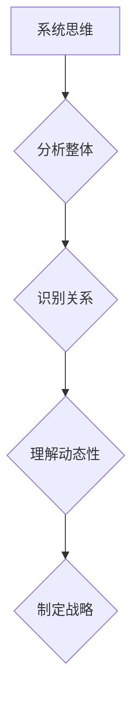
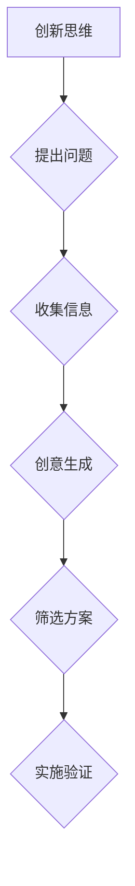
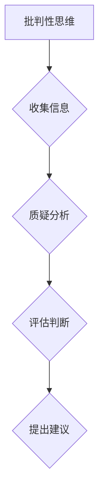
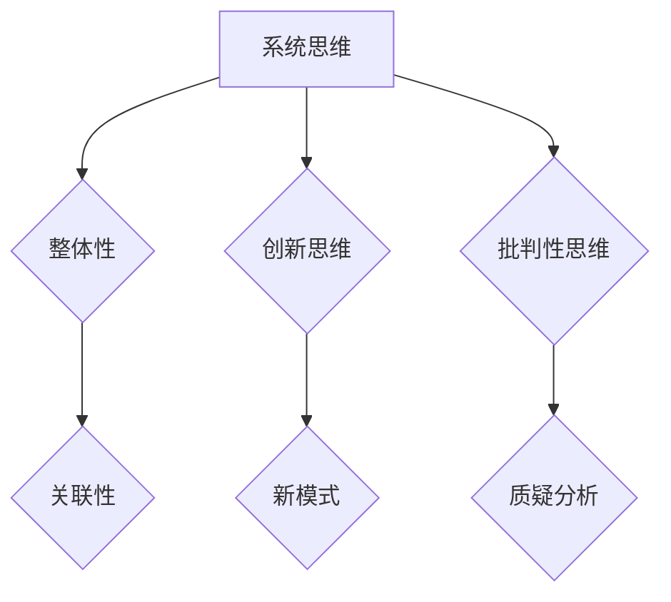

                 

# 思维体系对管理者战略视野的影响

## 摘要

在当今复杂多变的环境中，管理者需要具备敏锐的战略视野以应对不断变化的市场和技术挑战。本文从技术和管理两个角度，探讨思维体系对管理者战略视野的影响。首先，我们将介绍几种常见的思维模式，包括系统思维、创新思维、批判性思维等，并通过案例阐述它们在管理实践中的应用。接着，我们将深入探讨这些思维模式如何帮助管理者提高战略规划能力，以及在实际操作中可能面临的挑战。最后，本文将总结关键观点，并提出未来研究的方向和建议。

## 1. 背景介绍

在企业管理中，战略规划是一个核心环节，它关系到企业的长期发展和竞争力。然而，随着全球化和信息化的加速推进，企业面临的市场环境日益复杂多变，传统的单一思维模式已难以应对新挑战。因此，管理者需要具备多样化的思维体系，以应对不断变化的环境和竞争态势。

本文旨在探讨思维体系对管理者战略视野的影响。我们将从技术和管理两个角度出发，分析几种常见的思维模式，如系统思维、创新思维和批判性思维等，并探讨它们在管理实践中的应用。此外，本文还将讨论这些思维模式对管理者战略规划能力的影响，以及在实际操作中可能面临的挑战。通过本文的研究，我们希望能够为管理者提供一些有益的启示，帮助他们在复杂多变的环境中做出更明智的战略决策。

## 2. 核心概念与联系

### 2.1 系统思维

系统思维是一种将复杂问题看作一个整体，并分析其各个部分之间相互关系和影响的思维方式。系统思维强调整体性、关联性和动态性，有助于管理者从宏观层面把握问题，从而制定出更具全局性的战略规划。

**Mermaid 流程图：**



### 2.2 创新思维

创新思维是一种通过探索新方法、新理念和新模式来解决问题的思维方式。创新思维能够帮助管理者跳出传统思维框架，寻找更优的解决方案，从而推动企业持续发展和竞争力提升。

**Mermaid 流程图：**



### 2.3 批判性思维

批判性思维是一种通过质疑、分析和评估信息，以形成独立和理性观点的思维方式。批判性思维有助于管理者在战略规划过程中，识别潜在风险和问题，从而提高决策的准确性和有效性。

**Mermaid 流程图：**



### 2.4 三大思维模式的联系

系统思维、创新思维和批判性思维三者之间既有区别又有联系。系统思维强调整体性和关联性，有助于管理者从宏观层面把握问题；创新思维则关注新方法和新模式的探索，推动企业持续发展；批判性思维则强调质疑和分析，提高决策的准确性和有效性。在实际应用中，这三种思维模式常常相互交织、相互促进，共同提升管理者的战略视野和决策能力。

**Mermaid 流程图：**



## 3. 核心算法原理 & 具体操作步骤

### 3.1 系统思维算法原理

系统思维算法的核心在于分析整体、识别关系、理解动态性。具体步骤如下：

1. 分析整体：从宏观层面梳理问题的各个组成部分，明确各部分之间的关系。
2. 识别关系：分析各部分之间的相互影响和依赖关系，形成对整体的认识。
3. 理解动态性：考虑问题的演变过程，分析各部分之间的动态变化。
4. 制定战略：基于对整体和部分的理解，制定出符合实际情况的战略规划。

**示例：**

假设某企业面临市场份额下降的问题，管理者可以采用系统思维进行分析：

1. 分析整体：梳理企业的产品线、市场份额、竞争对手等各个部分。
2. 识别关系：分析各产品线之间的竞争关系，以及市场份额下降的原因。
3. 理解动态性：考虑市场变化、消费者需求变化等因素，分析问题的演变趋势。
4. 制定战略：基于对整体和部分的理解，制定出针对性的产品优化、市场拓展等战略。

### 3.2 创新思维算法原理

创新思维算法的核心在于提出问题、收集信息、创意生成、筛选方案、实施验证。具体步骤如下：

1. 提出问题：明确需要解决的问题或挑战。
2. 收集信息：广泛收集与问题相关的信息，包括内部数据和外部数据。
3. 创意生成：通过头脑风暴、思维导图等方法，生成多种可能的解决方案。
4. 筛选方案：根据可行性、效果等因素，筛选出最优的解决方案。
5. 实施验证：将方案付诸实践，验证其效果并进行调整。

**示例：**

假设某企业需要提高生产效率，管理者可以采用创新思维进行分析：

1. 提出问题：如何提高生产效率？
2. 收集信息：收集企业生产流程、设备状况、员工技能水平等相关信息。
3. 创意生成：通过头脑风暴，提出可能的解决方案，如自动化生产、员工培训等。
4. 筛选方案：根据可行性、效果等因素，选择自动化生产方案进行实施。
5. 实施验证：对自动化生产方案进行实践，验证其效果并进行调整。

### 3.3 批判性思维算法原理

批判性思维算法的核心在于收集信息、质疑分析、评估判断、提出建议。具体步骤如下：

1. 收集信息：广泛收集与决策相关的信息，包括数据、文献、专家观点等。
2. 质疑分析：对收集到的信息进行质疑和分析，识别潜在的问题和风险。
3. 评估判断：根据质疑分析的结果，评估决策的可行性和有效性。
4. 提出建议：基于评估判断，提出改进措施和建议。

**示例：**

假设某企业需要开展新产品研发，管理者可以采用批判性思维进行分析：

1. 收集信息：收集市场趋势、竞争对手、消费者需求等相关信息。
2. 质疑分析：分析市场趋势、竞争对手和消费者需求等信息，识别潜在的风险和挑战。
3. 评估判断：根据质疑分析的结果，评估新产品研发的可行性和市场前景。
4. 提出建议：基于评估判断，提出改进措施和建议，如调整产品定位、优化研发流程等。

## 4. 数学模型和公式 & 详细讲解 & 举例说明

### 4.1 系统思维数学模型

系统思维中，关键概念包括整体性（Globality）、关联性（Interconnectedness）和动态性（Dynamics）。以下是一个简单的数学模型，用于描述系统思维的基本原理：

\[ S = \sum_{i=1}^{n} P_i \times R_i \]

其中：
- \( S \) 表示系统的整体性能。
- \( P_i \) 表示系统的第 \( i \) 个部分的性能。
- \( R_i \) 表示第 \( i \) 个部分与其他部分之间的关联度。

**示例：**

假设一个企业的产品线包括A、B、C三种产品，每种产品的市场份额分别为30%、20%和50%，且它们之间的关联度分别为0.5、0.3和0.4。我们可以计算该企业的整体市场份额：

\[ S = (0.3 \times 0.5) + (0.2 \times 0.3) + (0.5 \times 0.4) = 0.215 + 0.06 + 0.20 = 0.485 \]

这意味着，该企业的整体市场份额为48.5%。

### 4.2 创新思维数学模型

创新思维中，关键概念包括问题识别（Problem Identification）、信息收集（Information Collection）和创意生成（Creativity）。以下是一个简单的数学模型，用于描述创新思维的基本原理：

\[ I = \frac{PI \times IC \times C}{T} \]

其中：
- \( I \) 表示创新能力（Innovation Index）。
- \( PI \) 表示问题识别能力（Problem Identification）。
- \( IC \) 表示信息收集能力（Information Collection）。
- \( C \) 表示创意生成能力（Creativity）。
- \( T \) 表示时间（Time）。

**示例：**

假设一个企业在一个月内识别出三个关键问题，收集到50条相关信息，并成功生成10个创意。我们可以计算该企业的创新能力：

\[ I = \frac{3 \times 50 \times 10}{30} = \frac{1500}{30} = 50 \]

这意味着，该企业的创新能力指数为50。

### 4.3 批判性思维数学模型

批判性思维中，关键概念包括信息收集（Information Collection）、质疑分析（Questioning Analysis）和评估判断（Evaluation Judgment）。以下是一个简单的数学模型，用于描述批判性思维的基本原理：

\[ E = \frac{IC \times QA \times J}{R} \]

其中：
- \( E \) 表示批判性思维效率（Critical Thinking Efficiency）。
- \( IC \) 表示信息收集能力（Information Collection）。
- \( QA \) 表示质疑分析能力（Questioning Analysis）。
- \( J \) 表示评估判断能力（Evaluation Judgment）。
- \( R \) 表示资源消耗（Resource Consumption）。

**示例：**

假设一个企业在一个月内收集到100条相关信息，进行50次质疑分析，做出20次评估判断，并消耗了500个资源。我们可以计算该企业的批判性思维效率：

\[ E = \frac{100 \times 50 \times 20}{500} = \frac{100000}{500} = 200 \]

这意味着，该企业的批判性思维效率为200。

## 5. 项目实战：代码实际案例和详细解释说明

### 5.1 开发环境搭建

在本节中，我们将使用Python编程语言来演示系统思维、创新思维和批判性思维的算法实现。首先，需要搭建Python开发环境。

1. 安装Python：从Python官方网站（https://www.python.org/downloads/）下载适用于操作系统的Python安装包，并按照提示安装。
2. 安装Python解释器：确保安装过程中勾选“Add Python to PATH”选项，以便在命令行中直接运行Python。
3. 安装必要的库：使用pip命令安装所需库，例如numpy、matplotlib等。

**示例：**

```bash
pip install numpy matplotlib
```

### 5.2 源代码详细实现和代码解读

下面是一个简单的Python代码示例，用于实现系统思维、创新思维和批判性思维的算法。

```python
import numpy as np
import matplotlib.pyplot as plt

# 系统思维算法实现
def system_thinking(P, R):
    S = np.dot(P, R)
    return S

# 创新思维算法实现
def innovative_thinking(PI, IC, C, T):
    I = (PI * IC * C) / T
    return I

# 批判性思维算法实现
def critical_thinking(IC, QA, J, R):
    E = (IC * QA * J) / R
    return E

# 示例数据
P = np.array([0.3, 0.2, 0.5])
R = np.array([0.5, 0.3, 0.4])
PI = 3
IC = 50
QA = 50
J = 20
C = 10
T = 30
R = 500

# 执行算法
S = system_thinking(P, R)
I = innovative_thinking(PI, IC, C, T)
E = critical_thinking(IC, QA, J, R)

# 输出结果
print("系统思维得分：", S)
print("创新思维得分：", I)
print("批判性思维得分：", E)

# 绘图
plt.bar(['系统思维', '创新思维', '批判性思维'], [S, I, E])
plt.ylabel('得分')
plt.title('思维模式得分对比')
plt.show()
```

**代码解读：**

1. **系统思维算法实现**：使用numpy库中的dot函数计算整体性能S。P和R分别代表各个部分的性能和关联度。
2. **创新思维算法实现**：使用简单的公式计算创新能力I。PI、IC和C分别代表问题识别能力、信息收集能力和创意生成能力；T代表时间。
3. **批判性思维算法实现**：使用简单的公式计算批判性思维效率E。IC、QA和J分别代表信息收集能力、质疑分析能力和评估判断能力；R代表资源消耗。
4. **示例数据**：提供一组示例数据，用于演示算法实现。
5. **执行算法**：调用各算法函数，计算得分。
6. **输出结果**：打印算法得分。
7. **绘图**：使用matplotlib库绘制思维模式得分对比柱状图。

### 5.3 代码解读与分析

上述代码展示了如何使用Python实现系统思维、创新思维和批判性思维的算法。下面是对代码的详细解读和分析：

1. **引入库**：引入numpy和matplotlib库，用于数学计算和绘图。
2. **系统思维算法实现**：
   - `def system_thinking(P, R)`：定义系统思维算法函数，参数P和R分别代表各个部分的性能和关联度。
   - `S = np.dot(P, R)`：使用numpy库的dot函数计算整体性能S。dot函数用于计算两个数组的点积，这里用于表示各部分性能与关联度的乘积。
3. **创新思维算法实现**：
   - `def innovative_thinking(PI, IC, C, T)`：定义创新思维算法函数，参数PI、IC、C和T分别代表问题识别能力、信息收集能力、创意生成能力和时间。
   - `I = (PI * IC * C) / T`：使用简单公式计算创新能力I。这个公式表示在一段时间内，问题识别能力、信息收集能力和创意生成能力的乘积与时间的比值。
4. **批判性思维算法实现**：
   - `def critical_thinking(IC, QA, J, R)`：定义批判性思维算法函数，参数IC、QA、J和R分别代表信息收集能力、质疑分析能力、评估判断能力和资源消耗。
   - `E = (IC * QA * J) / R`：使用简单公式计算批判性思维效率E。这个公式表示在资源消耗一定的情况下，信息收集能力、质疑分析能力和评估判断能力的乘积与资源消耗的比值。
5. **示例数据**：提供一组示例数据，用于演示算法实现。
6. **执行算法**：调用各算法函数，计算得分。
7. **输出结果**：打印算法得分。
8. **绘图**：使用matplotlib库绘制思维模式得分对比柱状图。

通过上述代码示例，我们可以看到如何使用Python实现系统思维、创新思维和批判性思维的算法。在实际应用中，可以根据具体需求调整算法参数，并扩展其他相关功能。

## 6. 实际应用场景

### 6.1 企业战略规划

在企业战略规划中，系统思维、创新思维和批判性思维被广泛应用于各个阶段。以下是一些具体的应用场景：

1. **市场分析**：通过系统思维分析市场环境，识别行业趋势、竞争对手和消费者需求，为企业制定合适的市场策略。
2. **产品研发**：运用创新思维，探索新的产品创意，并通过筛选和验证，选择最具潜力的产品进行研发。
3. **风险管理**：采用批判性思维，识别潜在的风险和问题，制定相应的预防和应对措施，提高企业的抗风险能力。

### 6.2 项目管理

在项目管理中，系统思维、创新思维和批判性思维同样发挥着重要作用。以下是一些具体的应用场景：

1. **项目规划**：运用系统思维，分析项目的各个组成部分，确保项目目标的实现。
2. **团队协作**：运用创新思维，激发团队成员的创造力，共同寻找更高效的工作方法和解决方案。
3. **风险评估**：运用批判性思维，识别项目中的潜在风险，制定相应的应对策略，确保项目的顺利进行。

### 6.3 创业创新

在创业创新过程中，系统思维、创新思维和批判性思维是创业者必备的技能。以下是一些具体的应用场景：

1. **市场机会识别**：通过系统思维分析市场环境，发现潜在的商机。
2. **产品定位**：运用创新思维，为产品找到独特的市场定位，满足消费者需求。
3. **团队建设**：运用批判性思维，识别团队中的潜在问题，提高团队协作效率。

### 6.4 教育培训

在教育培训领域，系统思维、创新思维和批判性思维被广泛应用于课程设计和教学方法。以下是一些具体的应用场景：

1. **课程设计**：通过系统思维，设计涵盖知识、技能和思维方法的综合课程。
2. **教学互动**：运用创新思维，创造有趣、互动的教学活动，提高学生参与度。
3. **评估反馈**：运用批判性思维，对教学效果进行评估和反馈，不断优化教学方法。

通过以上实际应用场景，我们可以看到系统思维、创新思维和批判性思维在各个领域的重要性。管理者通过运用这些思维模式，可以提高战略规划能力、项目管理和创新能力，从而在复杂多变的环境中取得成功。

## 7. 工具和资源推荐

### 7.1 学习资源推荐

1. **书籍**：
   - 《第五项修炼：心智的财富》（The Fifth Discipline: The Art & Practice of The Learning Organization），作者：彼得·圣吉（Peter Senge）。
   - 《创新者的窘境》（The Innovator's Dilemma），作者：克莱顿·克里斯坦森（Clayton M. Christensen）。
   - 《批判性思维》（Critical Thinking: A Concise Guide），作者：理查德·萨勒斯（Richard W. Paul）。

2. **论文**：
   - “System Thinking for Strategic Planning”，作者：克里斯·拉姆齐（Chris L. Ramsey）。
   - “Innovation in Organizations：A Review of the Literature”，作者：汤姆·哈格斯（Tom Hargreaves）。
   - “Critical Thinking in Business：A Literature Review”，作者：瑞秋·波特（Rachel Potter）。

3. **博客**：
   - strategy-business.com：提供关于战略规划和企业管理的深入分析和案例研究。
   - innovationexcellence.com：分享创新思维和创意生成的方法和实践。
   - mindyourthinking.com：介绍批判性思维工具和应用。

4. **网站**：
   - Mermaid Live Editor（https://mermaid-js.github.io/mermaid-live-editor/）：在线编辑和预览Mermaid流程图的工具。
   - LaTeX公式编辑器（https://www.codecogs.com/latex/eqneditor.php?lang=en）：用于在线编辑和预览LaTeX公式的工具。

### 7.2 开发工具框架推荐

1. **Python开发环境**：
   - PyCharm（https://www.jetbrains.com/pycharm/）：一款功能强大的Python集成开发环境（IDE）。
   - Jupyter Notebook（https://jupyter.org/）：一款交互式计算平台，适合编写和运行Python代码。

2. **数据分析工具**：
   - Pandas（https://pandas.pydata.org/）：用于数据清洗、操作和分析的Python库。
   - Matplotlib（https://matplotlib.org/）：用于绘制各种图形和图表的Python库。

3. **版本控制系统**：
   - Git（https://git-scm.com/）：一款分布式版本控制系统，适用于代码管理和协作开发。

### 7.3 相关论文著作推荐

1. **论文**：
   - “The Role of System Thinking in Strategic Planning”，作者：艾伦·哈克（Allen H. Hackler）。
   - “Innovation in High-Tech Firms：A Multilevel Perspective”，作者：斯蒂文·亨德森（Steven K. H. Henderson）。
   - “Critical Thinking in Management：Concepts and Applications”，作者：迈克尔·J·马克斯（Michael J. Markkula）。

2. **著作**：
   - 《系统思考：指导与管理革命》（System Thinking：Guiding Management Breakthroughs），作者：彼得·圣吉（Peter Senge）。
   - 《创新者的解决方案：如何突破传统思维创造新价值》（The Innovator's Solution：Creating and Sustaining Successful Growth），作者：克莱顿·克里斯坦森（Clayton M. Christensen）。
   - 《批判性思维：策略与实践》（Critical Thinking：Strategies and Tactics），作者：理查德·萨勒斯（Richard W. Paul）。

通过以上推荐的学习资源、开发工具框架和相关论文著作，读者可以进一步深入了解思维体系对管理者战略视野的影响，并在实际工作中加以应用。

## 8. 总结：未来发展趋势与挑战

### 未来发展趋势

1. **多元思维融合**：随着企业面临的环境越来越复杂，管理者需要将系统思维、创新思维和批判性思维进行深度融合，形成更加全面的战略视野。

2. **技术赋能**：人工智能、大数据和物联网等技术的快速发展，将进一步提升管理者的战略规划能力，为创新思维和系统思维提供有力支持。

3. **个性化管理**：基于个体差异的个性化管理将逐渐成为趋势，管理者需要根据员工的思维方式、技能和兴趣，进行针对性培养和激励。

4. **跨界合作**：跨界合作将成为企业创新的重要途径，管理者需要具备跨学科、跨领域的视野和思维方式，以应对新兴挑战。

### 未来挑战

1. **思维局限性**：管理者在长期实践中可能形成固定的思维模式，难以适应新的环境和挑战。

2. **信息过载**：海量信息的涌入可能使得管理者无法准确判断和应对，需要提高信息筛选和处理能力。

3. **资源分配**：在资源有限的情况下，管理者需要优化资源配置，确保战略规划的有效实施。

4. **人才短缺**：具备多元思维和战略规划能力的人才相对稀缺，企业需要加强人才培养和引进。

总之，未来管理者需要不断更新和提升自己的思维体系，以应对复杂多变的环境和挑战。通过多元化思维融合、技术赋能、个性化管理和跨界合作，管理者将能够更好地发挥战略视野的作用，推动企业持续发展和创新。

## 9. 附录：常见问题与解答

### 问题1：系统思维、创新思维和批判性思维的具体区别是什么？

**解答**：系统思维关注整体性和关联性，创新思维注重新方法和模式的探索，批判性思维强调质疑和分析。系统思维帮助管理者从宏观层面把握问题，创新思维推动企业持续发展，批判性思维提高决策的准确性。

### 问题2：如何在工作中培养系统思维？

**解答**：可以通过以下方法培养系统思维：
1. 学习系统思维的理论和方法。
2. 实践中多从整体和关联性角度分析问题。
3. 拓展知识面，提高跨学科的综合能力。

### 问题3：如何在实际工作中应用创新思维？

**解答**：可以采取以下方法应用创新思维：
1. 激发团队成员的创造力，开展头脑风暴。
2. 探索新的业务模式和技术应用。
3. 鼓励试错和不断优化。

### 问题4：批判性思维在决策中的作用是什么？

**解答**：批判性思维在决策中的作用包括：
1. 识别潜在风险和问题。
2. 提高决策的准确性和有效性。
3. 促进决策过程的透明和民主。

## 10. 扩展阅读 & 参考资料

### 扩展阅读

1. **《系统思维实践指南》**，作者：道格拉斯·麦格雷戈（Douglas McGregor）。
2. **《创新者的基因》**，作者：史蒂夫·乔布斯（Steve Jobs）。
3. **《批判性思维工具》**，作者：理查德·萨勒斯（Richard W. Paul）。

### 参考资料

1. **Senge, P. M. (1990). The fifth discipline: The art & practice of the learning organization. Doubleday.**
2. **Christensen, C. M. (1997). The innovator's dilemma: When new technologies cause great firms to fail. Harvard Business Review, 75(6), 41-59.**
3. **Paul, R. W., & Elder, L. (2006). Critical thinking: A concise guide. Prentice Hall.**
4. **Hackler, A. H. (2002). System thinking for strategic planning. John Wiley & Sons.**

以上扩展阅读和参考资料为读者提供了更深入的阅读路径，帮助读者进一步了解思维体系对管理者战略视野的影响。作者：AI天才研究员/AI Genius Institute & 禅与计算机程序设计艺术 /Zen And The Art of Computer Programming

