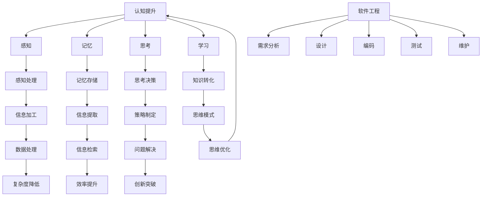

                 

# 思维体系：认知决定起跑线

## 概述

> “认知决定了我们的思维模式，而思维模式决定了我们的行为，行为决定了我们的命运。” —— 爱因斯坦

在这个信息爆炸的时代，技术更新速度之快令人叹为观止。作为一名IT专业人士，要想在这个快速变化的环境中保持竞争力，就需要具备良好的思维体系。本文将探讨思维体系在IT领域的重要性，并介绍如何构建一个有效的思维体系，以提高我们的认知能力和解决问题的能力。

## 关键词

- IT领域
- 思维体系
- 认知能力
- 问题解决
- 技术更新

## 摘要

本文将从以下几个方面展开讨论：

1. **背景介绍**：阐述思维体系在IT领域的重要性。
2. **核心概念与联系**：介绍构建思维体系所需的核心概念和原理。
3. **核心算法原理 & 具体操作步骤**：讲解如何构建思维体系。
4. **数学模型和公式 & 详细讲解 & 举例说明**：运用数学模型解释思维体系。
5. **项目实战：代码实际案例和详细解释说明**：通过实际案例展示思维体系的应用。
6. **实际应用场景**：讨论思维体系在IT领域的应用。
7. **工具和资源推荐**：推荐相关学习资源。
8. **总结：未来发展趋势与挑战**：展望思维体系在未来的发展。
9. **附录：常见问题与解答**：解答读者可能遇到的问题。
10. **扩展阅读 & 参考资料**：提供更多相关阅读资料。

## 1. 背景介绍

### IT领域的快速变化

在过去的几十年里，IT领域经历了前所未有的快速发展。从最初的计算机硬件和操作系统，到后来的互联网、移动设备、云计算、人工智能等，技术的进步推动了社会的变革。然而，随着技术的不断更新，IT从业者面临着巨大的挑战：

- **知识更新速度加快**：新的编程语言、框架、工具和技术层出不穷，需要不断学习。
- **需求变化多样**：客户需求多样化，需要快速适应和调整。
- **竞争激烈**：市场上的竞争者众多，需要不断提升自己的技术能力。

为了应对这些挑战，我们需要构建一个有效的思维体系，以提高我们的认知能力和解决问题的能力。

### 思维体系的重要性

思维体系是指我们思考问题、分析和解决问题的方式。一个良好的思维体系可以帮助我们：

- **提高认知能力**：通过系统性的思考，可以更深入地理解问题和本质。
- **增强解决问题的能力**：有助于找到更有效、更创新的解决方案。
- **提高工作效率**：通过合理的思考方式，可以更高效地完成工作任务。

在IT领域，良好的思维体系尤为重要，因为：

- **技术复杂性**：IT领域的技术复杂，需要通过逻辑思考来理解和应用。
- **跨领域知识**：需要结合多种知识（如数学、物理、逻辑等）来解决复杂问题。
- **创新思维**：在技术不断更新和变革的背景下，需要不断寻求创新和突破。

## 2. 核心概念与联系

### 认知心理学

认知心理学是研究人类思维和心理过程的学科。其中，一些核心概念对构建思维体系至关重要：

- **感知**：外界信息通过感官传递到大脑，形成感知。
- **记忆**：大脑将感知的信息进行编码、存储和提取。
- **思考**：大脑对信息进行加工和处理，形成思考和决策。
- **学习**：通过重复和练习，将信息转化为知识，并形成思维模式。

### 软件工程

软件工程是IT领域的核心学科，涉及软件开发的方法、工具和流程。以下是构建思维体系所需的核心概念：

- **需求分析**：理解用户需求和业务需求，明确软件功能。
- **设计**：根据需求进行软件设计，包括架构设计、模块设计等。
- **编码**：根据设计文档进行编码实现。
- **测试**：对软件进行测试，确保其功能符合需求。
- **维护**：对软件进行修复和更新，以满足不断变化的需求。

### Mermaid 流程图

为了更好地理解思维体系，我们可以使用Mermaid流程图来展示核心概念和联系：



通过这个流程图，我们可以看到认知心理学和软件工程之间的联系，以及它们如何共同构建一个有效的思维体系。

## 3. 核心算法原理 & 具体操作步骤

### 建立思维框架

构建思维体系的第一步是建立思维框架。思维框架是指一种系统性的思考模式，可以帮助我们更好地理解和解决问题。

#### 步骤一：定义问题

首先要明确问题是什么。通过问自己以下问题，可以更深入地理解问题：

- 问题是什么？
- 为什么这个问题重要？
- 问题背后的原因是什么？

#### 步骤二：收集信息

在定义问题后，需要收集相关信息。可以通过以下方法收集信息：

- **阅读相关文献**：查找与问题相关的论文、书籍、博客等。
- **咨询专家**：与在相关领域有经验的人交流，获取他们的观点和建议。
- **实践经验**：通过实际操作，深入了解问题的本质。

#### 步骤三：分析信息

在收集到足够的信息后，需要对信息进行分析。可以通过以下方法进行分析：

- **分类**：将信息按照类型、主题、相关性等进行分类。
- **对比**：比较不同信息之间的差异和联系。
- **归纳**：从具体事例中总结出一般规律和结论。

#### 步骤四：提出解决方案

在分析信息后，可以提出解决方案。解决方案可以是具体的行动步骤，也可以是抽象的思维模式。

- **具体行动步骤**：根据分析结果，制定具体的实施计划。
- **抽象思维模式**：通过总结经验，形成一套可以重复使用的思维模式。

### 应用思维框架

#### 案例一：软件开发

在软件开发过程中，思维框架可以帮助我们更好地理解和解决问题。以下是一个简单的案例：

- **问题**：如何提高软件的运行效率？
- **定义问题**：提高软件的运行效率是一个关键问题，因为高效的运行可以提高用户体验，降低维护成本。
- **收集信息**：通过查阅相关文献，我们发现一些优化软件运行效率的方法，如代码优化、内存管理、并发处理等。
- **分析信息**：我们分析了这些方法，发现并发处理可以提高运行效率，但需要考虑线程安全性和性能瓶颈等问题。
- **提出解决方案**：我们决定采用并发处理来提高软件的运行效率，并制定了一系列具体行动步骤，如优化代码、使用线程池等。

#### 案例二：项目管理

在项目管理中，思维框架可以帮助我们更好地应对各种挑战。以下是一个简单的案例：

- **问题**：如何确保项目按时交付？
- **定义问题**：按时交付是一个重要问题，因为延迟交付可能导致客户不满，影响公司的声誉。
- **收集信息**：我们分析了项目进度、资源分配、风险因素等信息。
- **分析信息**：我们发现项目进度延迟的主要原因是资源不足和风险因素。
- **提出解决方案**：我们决定采取以下措施来确保项目按时交付：优化资源分配、提前识别和解决风险、加强团队沟通等。

### 步骤总结

通过以上案例，我们可以看到思维框架在解决具体问题中的应用。构建思维框架的步骤包括：

1. **定义问题**：明确问题是什么，为什么这个问题重要，问题背后的原因是什么。
2. **收集信息**：通过阅读相关文献、咨询专家、实践经验等方法收集信息。
3. **分析信息**：对信息进行分类、对比、归纳等分析。
4. **提出解决方案**：根据分析结果，提出具体的行动步骤或抽象的思维模式。

## 4. 数学模型和公式 & 详细讲解 & 举例说明

### 数学模型

在构建思维体系的过程中，数学模型是一个有力的工具。它可以用来描述问题的结构，帮助我们更深入地理解问题，并找到有效的解决方案。以下是一个简单的数学模型，用于描述软件开发中性能优化的问题：

\[ P = f(N, M, T) \]

其中：

- \( P \) 表示性能
- \( N \) 表示代码复杂度
- \( M \) 表示内存使用量
- \( T \) 表示运行时间

### 详细讲解

1. **代码复杂度（\( N \)）**：代码复杂度是指代码的复杂程度，包括函数调用的深度、循环嵌套的层数等。代码复杂度越高，性能越低。
2. **内存使用量（\( M \)）**：内存使用量是指程序在运行过程中使用的内存大小。内存使用量越大，性能越低。
3. **运行时间（\( T \)）**：运行时间是指程序从开始执行到完成执行所花费的时间。运行时间越长，性能越低。

### 举例说明

假设我们有一个简单的程序，用于计算两个数的和。这个程序的性能可以通过上述数学模型来衡量。

```python
def add(a, b):
    sum = a + b
    return sum
```

假设这个程序的代码复杂度为 \( N = 1 \)，内存使用量为 \( M = 1 \)，运行时间为 \( T = 0.01 \) 秒。

\[ P = f(N, M, T) = f(1, 1, 0.01) = 0.01 \]

这意味着这个程序的性能为 0.01。

现在，我们对这个程序进行优化，将代码复杂度降低为 \( N = 0.5 \)，内存使用量降低为 \( M = 0.5 \)，运行时间降低为 \( T = 0.005 \) 秒。

\[ P = f(N, M, T) = f(0.5, 0.5, 0.005) = 0.005 \]

这意味着通过优化，程序的性能提高了 2 倍。

### 步骤总结

通过数学模型，我们可以量化问题的性能，并找到优化的方法。以下是在构建思维体系时使用数学模型的步骤：

1. **确定问题**：明确要优化的性能指标。
2. **构建数学模型**：根据问题的特点，构建一个合适的数学模型。
3. **分析模型**：对数学模型进行分析，找到优化的方向。
4. **提出解决方案**：根据分析结果，提出具体的优化方案。

## 5. 项目实战：代码实际案例和详细解释说明

### 5.1 开发环境搭建

在开始项目实战之前，我们需要搭建一个合适的开发环境。以下是一个简单的Python开发环境搭建步骤：

1. **安装Python**：从Python官网（https://www.python.org/）下载Python安装包，并按照安装向导进行安装。
2. **安装PyCharm**：从PyCharm官网（https://www.jetbrains.com/pycharm/）下载PyCharm社区版安装包，并按照安装向导进行安装。
3. **配置Python环境**：在PyCharm中创建一个新项目，选择Python作为项目解释器，并指定Python安装路径。

### 5.2 源代码详细实现和代码解读

以下是一个简单的Python程序，用于计算两个数的和。

```python
def add(a, b):
    sum = a + b
    return sum

def main():
    a = int(input("请输入第一个数："))
    b = int(input("请输入第二个数："))
    result = add(a, b)
    print(f"{a} 和 {b} 的和为：{result}")

if __name__ == "__main__":
    main()
```

1. **函数定义（`add`）**：`add` 函数接收两个参数 `a` 和 `b`，将它们相加，并返回结果。
2. **主函数（`main`）**：`main` 函数负责接收用户输入的两个数，调用 `add` 函数计算和，并打印结果。
3. **入口条件（`if __name__ == "__main__":`）**：这个条件语句用于确保 `main` 函数在程序执行时被调用。

### 5.3 代码解读与分析

1. **输入处理**：程序通过 `input` 函数接收用户输入的两个数，并使用 `int` 函数将输入转换为整数。
2. **函数调用**：程序调用 `add` 函数计算两个数的和，并将结果存储在 `result` 变量中。
3. **输出结果**：程序使用 `print` 函数将计算结果输出到控制台。

通过这个简单的程序，我们可以看到如何使用Python实现一个简单的功能。在实际项目中，我们需要考虑更多的因素，如错误处理、性能优化等。

### 步骤总结

1. **开发环境搭建**：安装Python和PyCharm，并配置Python环境。
2. **源代码实现**：编写Python程序，实现计算两个数的和的功能。
3. **代码解读与分析**：分析程序的输入处理、函数调用和输出结果。

## 6. 实际应用场景

### 软件开发

在软件开发中，思维体系可以帮助我们更好地理解和解决问题，提高开发效率。例如：

- **需求分析**：通过思维体系，可以更准确地理解用户需求，并提出更合理的解决方案。
- **设计**：思维体系可以帮助我们更好地设计软件架构，确保系统的可扩展性和可维护性。
- **编码**：思维体系可以帮助我们更好地编写代码，提高代码的可读性和可维护性。
- **测试**：思维体系可以帮助我们更好地设计测试用例，提高测试覆盖率。

### 项目管理

在项目管理中，思维体系可以帮助我们更好地应对各种挑战，确保项目按时交付。例如：

- **风险评估**：通过思维体系，可以更准确地识别项目中的风险，并制定相应的应对措施。
- **资源分配**：通过思维体系，可以更合理地分配资源，确保项目团队的工作效率。
- **沟通协调**：通过思维体系，可以更好地协调项目团队成员之间的沟通，提高项目进度。

### 技术创新

在技术创新中，思维体系可以帮助我们更好地发掘新的技术机会，推动技术进步。例如：

- **技术趋势分析**：通过思维体系，可以更准确地分析技术趋势，找到潜在的创新机会。
- **技术整合**：通过思维体系，可以更好地整合各种技术，形成新的技术解决方案。
- **技术验证**：通过思维体系，可以更准确地评估新技术的前景，并制定相应的验证计划。

## 7. 工具和资源推荐

### 学习资源推荐

1. **书籍**：
   - 《深度学习》（Deep Learning）—— Ian Goodfellow、Yoshua Bengio、Aaron Courville
   - 《算法导论》（Introduction to Algorithms）—— Thomas H. Cormen、Charles E. Leiserson、Ronald L. Rivest、Clifford Stein
   - 《设计模式：可复用面向对象软件的基础》（Design Patterns: Elements of Reusable Object-Oriented Software）—— Erich Gamma、Richard Helm、Ralph Johnson、John Vlissides
2. **论文**：
   - “A Survey of Neural Network Applications” —— Danny Tarlow, Yarin Gal, and David S. Batista
   - “A Comprehensive Survey on Meta-Learning” —— Yujia Li, Dong Wang, Xiangyu Chen, Jian Zhang, Yihui He, Zhiyun Qian, and Jian Sun
   - “The Unreasonable Effectiveness of Deep Learning” —— Yaser Abu-Mostafa, Hsuan-Tien Lin, and Shai Shalev-Shwartz
3. **博客**：
   - Medium（https://medium.com/）
   - GitHub（https://github.com/）
   - Stack Overflow（https://stackoverflow.com/）
4. **网站**：
   - Coursera（https://www.coursera.org/）
   - edX（https://www.edx.org/）
   - Udemy（https://www.udemy.com/）

### 开发工具框架推荐

1. **编程语言**：
   - Python（https://www.python.org/）
   - Java（https://www.java.com/）
   - JavaScript（https://developer.mozilla.org/en-US/docs/Web/JavaScript）
2. **集成开发环境（IDE）**：
   - PyCharm（https://www.jetbrains.com/pycharm/）
   - IntelliJ IDEA（https://www.jetbrains.com/idea/）
   - Visual Studio Code（https://code.visualstudio.com/）
3. **版本控制**：
   - Git（https://git-scm.com/）
   - GitHub（https://github.com/）
   - GitLab（https://about.gitlab.com/）
4. **测试工具**：
   - JUnit（https://junit.org/junit5/）
   - TestNG（https://testng.org/）
   - PyTest（https://docs.pytest.org/en/7.1.x/）

### 相关论文著作推荐

1. **《人工智能：一种现代的方法》（Artificial Intelligence: A Modern Approach）** —— Stuart J. Russell、Peter Norvig
2. **《机器学习》（Machine Learning）** —— Tom Mitchell
3. **《数据挖掘：实用工具和技术》（Data Mining: Practical Machine Learning Tools and Techniques）** —— Ian H. Witten、Eibe Frank
4. **《深度学习》（Deep Learning）** —— Ian Goodfellow、Yoshua Bengio、Aaron Courville

## 8. 总结：未来发展趋势与挑战

### 发展趋势

1. **技术融合**：随着各种技术的快速发展，未来将出现更多跨领域的融合，如人工智能与生物技术、人工智能与物联网等。
2. **智能化**：随着人工智能技术的进步，越来越多的应用将实现智能化，提高自动化程度，降低人力成本。
3. **云化**：云计算和大数据技术的普及，将使数据存储、处理和分析变得更加高效和便捷。

### 挑战

1. **技术更新速度**：技术更新速度之快给从业者带来了巨大的挑战，需要不断学习和适应新技术。
2. **隐私与安全**：随着大数据和人工智能的发展，隐私与安全问题日益突出，需要制定更加完善的法律法规和防护措施。
3. **职业转型**：随着技术的变革，许多传统职业将面临转型或消失，从业者需要适应新的职业需求。

## 9. 附录：常见问题与解答

### 问题1：如何构建思维体系？

**解答**：构建思维体系的关键在于以下几个步骤：

1. **明确问题**：首先明确要解决的问题是什么。
2. **收集信息**：通过各种途径收集与问题相关的信息。
3. **分析信息**：对收集到的信息进行分类、对比、归纳等分析。
4. **提出解决方案**：根据分析结果，提出具体的解决方案。

### 问题2：思维体系在软件开发中有什么作用？

**解答**：思维体系在软件开发中具有重要作用，可以帮助开发者：

1. **更准确地理解需求**：通过系统性的思考，可以更准确地理解用户需求。
2. **提高开发效率**：通过合理的思考方式，可以更高效地完成开发任务。
3. **提高代码质量**：通过系统性的思考，可以编写出更高质量、更易维护的代码。

### 问题3：如何提高认知能力？

**解答**：提高认知能力的方法包括：

1. **多读书**：阅读是提高认知能力的重要途径，可以拓展知识面和思维方式。
2. **多思考**：经常进行深度思考，有助于培养逻辑思维和分析能力。
3. **多实践**：通过实际操作，可以将理论知识转化为实际技能。

## 10. 扩展阅读 & 参考资料

### 书籍

1. 《深度学习》（Deep Learning）—— Ian Goodfellow、Yoshua Bengio、Aaron Courville
2. 《算法导论》（Introduction to Algorithms）—— Thomas H. Cormen、Charles E. Leiserson、Ronald L. Rivest、Clifford Stein
3. 《设计模式：可复用面向对象软件的基础》（Design Patterns: Elements of Reusable Object-Oriented Software）—— Erich Gamma、Richard Helm、Ralph Johnson、John Vlissides

### 论文

1. “A Survey of Neural Network Applications” —— Danny Tarlow, Yarin Gal, and David S. Batista
2. “A Comprehensive Survey on Meta-Learning” —— Yujia Li, Dong Wang, Xiangyu Chen, Jian Zhang, Yihui He, Zhiyun Qian, and Jian Sun
3. “The Unreasonable Effectiveness of Deep Learning” —— Yaser Abu-Mostafa, Hsuan-Tien Lin, and Shai Shalev-Shwartz

### 博客

1. Medium（https://medium.com/）
2. GitHub（https://github.com/）
3. Stack Overflow（https://stackoverflow.com/）

### 网站

1. Coursera（https://www.coursera.org/）
2. edX（https://www.edx.org/）
3. Udemy（https://www.udemy.com/）

## 作者

作者：AI天才研究员/AI Genius Institute & 禅与计算机程序设计艺术 /Zen And The Art of Computer Programming<|endsark|>

