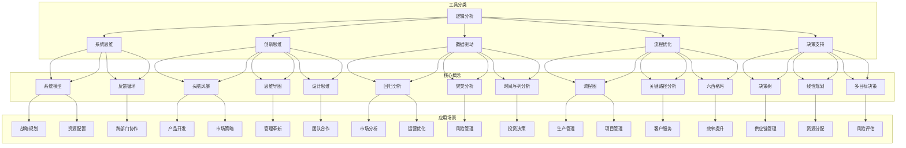

                 

### 背景介绍

#### 引言

在现代企业管理中，面对日益复杂的市场环境和快速变化的技术趋势，管理者不仅需要具备传统的领导力和决策能力，还需要具备高效的思维工具和策略。这些工具和策略能够帮助管理者更清晰地分析问题、制定决策，并有效执行计划，从而提升企业的整体竞争力。

思维工具，作为一种帮助人们更有效地思考和解决问题的方法，其重要性在企业管理中日益凸显。这些工具涵盖了逻辑分析、系统思维、创新思维等多个方面，它们为管理者提供了一种结构化的思考框架，使他们在面对复杂问题时能够更加从容和有条不紊。

本文旨在探讨思维工具在企业管理中的实际应用，通过以下几个方面的讨论，帮助读者深入了解这些工具的原理和操作方法：

1. **核心概念与联系**：介绍管理中常用的思维工具，包括逻辑分析、系统思维、创新思维等，并绘制Mermaid流程图，展示各工具之间的关联和作用。

2. **核心算法原理 & 具体操作步骤**：详细阐述各思维工具的基本原理和操作步骤，帮助读者理解和掌握这些工具。

3. **数学模型和公式 & 详细讲解 & 举例说明**：利用数学模型和公式，结合实际案例，深入讲解各思维工具的应用效果和意义。

4. **项目实战：代码实际案例和详细解释说明**：通过具体的代码实现，展示思维工具在现实项目中的实际应用和效果。

5. **实际应用场景**：探讨思维工具在不同管理场景中的具体应用，帮助读者了解其在实际工作中的适用性。

6. **工具和资源推荐**：推荐相关学习资源、开发工具和论文著作，为读者提供进一步学习和实践的参考。

7. **总结：未来发展趋势与挑战**：分析思维工具在企业管理中的未来发展趋势和面临的挑战，为管理者提供前瞻性的思考。

通过本文的详细探讨，希望读者能够对思维工具在企业管理中的重要性有更深入的认识，并能够将其有效地应用到实际工作中，提升管理水平和企业竞争力。

#### 思维工具在企业管理中的应用背景

在企业管理中，思维工具的应用具有重要的现实意义。首先，随着全球化和信息化的加速发展，企业管理面临的环境变得更加复杂和不确定。市场变化迅速，新技术层出不穷，企业管理者需要具备快速适应和应对变化的能力。传统的管理方法往往过于依赖经验和直觉，难以应对复杂多变的环境。而思维工具提供了结构化和系统化的思考框架，帮助管理者更全面、更深入地分析问题，从而做出更准确的决策。

其次，企业的竞争力越来越依赖于创新。创新不仅仅是产品或技术的创新，还包括管理模式的创新。在创新过程中，管理者需要具备丰富的想象力和创造力。思维工具中的创新思维部分，提供了多种激发创意的方法和技巧，帮助管理者在压力和挑战下依然能够保持高度的创造力和创新意识。

此外，现代企业管理中强调团队合作和跨部门协作。思维工具中的系统思维，可以帮助管理者更好地理解企业内部的各个组成部分及其相互关系，从而在团队协作中实现资源的最佳配置和协同效应。系统思维强调整体性和全局观，有助于管理者从宏观层面把握企业的发展方向，避免局部最优而导致整体效率低下。

最后，随着数据量的爆炸性增长，数据分析在企业决策中的重要性日益凸显。思维工具中的逻辑分析，可以帮助管理者从大量数据中提取有价值的信息，进行科学的分析和预测。通过逻辑分析，管理者可以识别出潜在的问题和风险，从而采取有效的预防措施，提高企业的风险应对能力。

综上所述，思维工具在企业管理中的应用具有显著的现实意义。它们不仅能够帮助管理者更好地应对复杂多变的环境，提升企业的创新能力和竞争力，还能优化团队协作和决策过程，从而实现企业的可持续发展。

#### 管理思维工具的起源与发展

管理思维工具的发展可以追溯到20世纪中叶，当时管理理论开始逐渐成熟，各种新的思考工具和方法被引入企业管理实践中。以下是一些关键的历史事件和里程碑，这些事件标志着管理思维工具的起源和演变。

1. **泰勒的科学管理理论**：弗雷德里克·泰勒（Frederick Taylor）是科学管理的奠基人，他在20世纪初提出了“科学管理”理论，主张通过科学的方法研究和分析工作流程，以提高生产效率。泰勒的理论为后来的管理思维工具奠定了基础，强调逻辑分析和工作流程优化。

2. **戴明的质量管理理念**：威廉·爱德华·戴明（W. Edwards Deming）是质量管理领域的先驱，他提出了“持续改进”和“统计质量控制”的理念。戴明的理论强调了数据驱动和系统思维在质量管理中的应用，对管理思维工具的发展产生了深远影响。

3. **彼得·德鲁克的系统思考**：彼得·德鲁克（Peter Drucker）是现代管理学的奠基人之一，他提出了系统思考的概念，强调管理者需要从整体和长远的角度看待企业运作。德鲁克的《管理实践》一书对管理思维工具的发展起到了重要推动作用。

4. **罗伯特·哈蒙德的矩阵管理**：罗伯特·哈蒙德（Robert Hammond）在20世纪60年代提出了矩阵管理的概念，通过将管理层次和业务流程相结合，提高了组织的灵活性和响应能力。矩阵管理成为了现代企业管理中的重要工具。

5. **彼得·圣吉的学习型组织**：彼得·圣吉（Peter Senge）在其著作《第五项修炼》中提出了学习型组织的概念，强调个体和团队的学习能力对组织绩效的重要性。这一理论为管理思维工具的发展注入了新的活力。

6. **现代信息技术的发展**：随着信息技术的飞速发展，管理思维工具得到了进一步的扩展和升级。大数据分析、人工智能和机器学习等新技术为管理者提供了更强大的数据分析和预测能力，使管理决策更加科学和精准。

这些里程碑事件和管理理论的提出，不仅推动了管理思维工具的发展，也使得这些工具在企业管理中得到了广泛应用。从科学管理到系统思维，再到现代信息技术，管理思维工具不断演进，为管理者提供了更丰富的思考方法和工具，帮助企业应对日益复杂的环境挑战。

#### 管理思维工具的分类与核心概念

在企业管理中，思维工具作为提高决策效率和优化管理过程的重要手段，涵盖了多个不同的类别，每个类别都有其独特的核心概念和应用场景。以下是对几种常见管理思维工具的分类、核心概念及其简要说明：

1. **逻辑分析工具**：
   - **定义**：逻辑分析工具是一种通过逻辑推理来揭示事物间因果联系的方法。
   - **核心概念**：包括演绎推理、归纳推理、逻辑框架等。
   - **应用场景**：用于项目规划、风险评估、决策分析等，帮助管理者理清思路，明确问题。

2. **系统思维工具**：
   - **定义**：系统思维是一种整体观，强调从系统的角度分析问题和解决问题。
   - **核心概念**：包括系统模型、反馈循环、系统动力学等。
   - **应用场景**：用于战略规划、资源配置、跨部门协作等，帮助管理者把握全局，优化组织结构。

3. **创新思维工具**：
   - **定义**：创新思维是指通过创造性的思考方式和工具，产生新的想法和解决方案。
   - **核心概念**：包括头脑风暴、思维导图、设计思维等。
   - **应用场景**：用于产品开发、市场策略、管理革新等，激发团队成员的创造力和创新意识。

4. **数据驱动工具**：
   - **定义**：数据驱动工具是指利用数据分析的方法，从数据中提取有价值的信息，辅助决策。
   - **核心概念**：包括回归分析、聚类分析、时间序列分析等。
   - **应用场景**：用于市场分析、运营优化、风险管理等，提高决策的科学性和准确性。

5. **流程优化工具**：
   - **定义**：流程优化工具是指通过分析和改进工作流程，提高效率和降低成本。
   - **核心概念**：包括流程图、关键路径分析、六西格玛等。
   - **应用场景**：用于生产管理、项目管理、客户服务等，提升企业运营效率。

6. **决策支持工具**：
   - **定义**：决策支持工具是一种通过模型和算法，辅助管理者进行决策的方法。
   - **核心概念**：包括决策树、线性规划、多目标决策等。
   - **应用场景**：用于投资决策、供应链管理、资源分配等，提供数据支持和优化建议。

以上各类思维工具各有侧重，但它们在实际应用中往往相互结合，形成综合性的管理方法。逻辑分析帮助管理者理清思路，系统思维提供全局视角，创新思维激发创造力，数据驱动提高决策精度，流程优化提升效率，决策支持提供科学依据。通过灵活运用这些工具，企业管理者能够更加有效地应对复杂的管理挑战，提升企业的整体竞争力。

#### Mermaid流程图：管理思维工具之间的关联

为了更直观地展示管理思维工具之间的关联，我们可以使用Mermaid绘制一个流程图。以下是一个示例，该流程图展示了逻辑分析、系统思维、创新思维、数据驱动、流程优化和决策支持工具之间的相互关系。



该Mermaid流程图展示了各个管理思维工具之间的关联及其核心概念和应用场景。逻辑分析工具作为基础，与其他各类工具相互交织，共同构成了一个综合性的管理思维框架。通过这种结构化的展示，读者可以更清晰地理解各工具的相互关系和应用范围，从而更好地在实际管理中运用这些工具。

### 核心算法原理 & 具体操作步骤

#### 1. 逻辑分析工具：演绎推理和归纳推理

逻辑分析工具是管理思维工具中最基础的部分，主要分为演绎推理和归纳推理两种方法。以下将详细阐述这两种逻辑分析工具的原理和具体操作步骤。

**演绎推理**：
- **定义**：演绎推理是从一般到个别的推理过程，即从普遍原则推导出特定情况下的结论。
- **原理**：演绎推理遵循“三段论”原则，即由一个大前提和一个小前提推导出结论。形式化表示为：所有M是P，这个S是M，因此这个S是P。
- **操作步骤**：
  1. 确定大前提：明确普遍原则或普遍规律。
  2. 确定小前提：将具体问题与普遍原则或规律联系起来。
  3. 推导结论：根据大前提和小前提，逻辑地推导出特定情况下的结论。
- **应用实例**：例如，在项目规划中，可以首先确定项目成功的基本条件（大前提），然后根据项目的具体情况（小前提），推导出项目成功的具体策略（结论）。

**归纳推理**：
- **定义**：归纳推理是从个别到一般的推理过程，即通过观察个别案例，归纳出普遍规律或原则。
- **原理**：归纳推理通常基于经验观察和统计方法，通过对多个个别案例的分析，归纳出普遍的结论。
- **操作步骤**：
  1. 观察个别案例：收集多个具体案例的数据和现象。
  2. 分析归纳：从个别案例中提取共性，归纳出普遍规律或原则。
  3. 形成结论：根据归纳出的普遍规律或原则，对新的个别情况进行预测或解释。
- **应用实例**：例如，在市场分析中，可以收集多个不同市场环境下的销售数据，分析这些数据，归纳出市场规律，然后根据这些规律预测新的市场环境下的销售情况。

#### 2. 系统思维工具：系统模型和反馈循环

系统思维工具强调从整体和动态的角度分析问题，系统模型和反馈循环是其核心组成部分。以下将详细描述这两个工具的原理和具体操作步骤。

**系统模型**：
- **定义**：系统模型是对复杂系统的抽象和简化，通过图表或数学模型表示系统各组成部分及其相互作用。
- **原理**：系统模型用于描述系统的结构、行为和动态特性，帮助分析系统在不同条件下的表现。
- **操作步骤**：
  1. 确定系统边界：明确系统的范围和研究对象。
  2. 确定系统组成部分：识别系统中的主要组成部分及其相互作用。
  3. 建立模型：使用适当的工具（如Mermaid）建立系统模型，表示各部分及其关系。
  4. 验证和优化：通过模拟和实验验证模型的准确性，根据反馈进行优化。
- **应用实例**：在战略规划中，可以建立一个企业系统模型，包括市场环境、内部资源和外部竞争等组成部分，通过模型分析不同战略方案对企业绩效的影响。

**反馈循环**：
- **定义**：反馈循环是指系统输出返回到系统输入的过程，通过对输出的反馈调整输入，影响系统的行为。
- **原理**：反馈循环是系统动态调整和自我优化的机制，有助于系统稳定性和适应能力。
- **操作步骤**：
  1. 确定反馈路径：识别系统中的反馈路径，即输出如何影响输入。
  2. 建立反馈模型：使用适当的工具（如Mermaid）建立反馈循环模型，表示反馈路径及其影响。
  3. 分析反馈效果：通过模拟和实验分析反馈循环对系统行为的影响。
  4. 调整和优化：根据分析结果，调整反馈机制，优化系统性能。
- **应用实例**：在供应链管理中，可以建立供应链反馈循环模型，分析库存水平、需求波动和供应稳定性之间的相互作用，从而优化供应链管理策略。

#### 3. 创新思维工具：头脑风暴、思维导图和设计思维

创新思维工具用于激发创造力和产生新的想法和解决方案，头脑风暴、思维导图和设计思维是其常用方法。以下将详细描述这些工具的原理和具体操作步骤。

**头脑风暴**：
- **定义**：头脑风暴是一种通过集体讨论，快速产生大量创意的方法。
- **原理**：头脑风暴通过鼓励开放性思维和自由联想，打破常规思维模式，激发创造力和创新思维。
- **操作步骤**：
  1. 确定主题：明确讨论的主题和目标。
  2. 准备环境：创造一个无压力、鼓励发言的环境。
  3. 自由发言：参与者不受限制地提出任何想法，鼓励开放性思维。
  4. 记录创意：及时记录所有提出的创意，无论是好是坏。
  5. 分析和筛选：对记录的创意进行分析和筛选，确定可行的解决方案。
- **应用实例**：在产品开发过程中，可以通过头脑风暴产生多种产品设计和功能创意，然后进行分析和筛选，选出最佳方案。

**思维导图**：
- **定义**：思维导图是一种以图像和文字形式表示思维过程和知识结构的图形工具。
- **原理**：思维导图通过中心主题和分支结构，将信息以视觉方式呈现，帮助组织思维和记忆，促进创新思维。
- **操作步骤**：
  1. 确定中心主题：明确思维导图的主题和核心问题。
  2. 分支结构：围绕中心主题，构建分支结构和关联节点。
  3. 收集信息：在每个节点上收集和记录相关信息。
  4. 连接和扩展：将各节点和信息连接起来，扩展思维导图。
  5. 优化和调整：根据反馈和思考，对思维导图进行优化和调整。
- **应用实例**：在项目规划中，可以通过思维导图梳理项目目标和任务，明确各任务之间的关系和依赖，从而优化项目规划和执行。

**设计思维**：
- **定义**：设计思维是一种以用户为中心的思考方式，通过迭代设计和用户反馈，产生创新的解决方案。
- **原理**：设计思维强调理解用户需求、探索多种解决方案、构建原型和测试反馈，不断迭代优化，最终产生满足用户需求的有效方案。
- **操作步骤**：
  1. 确定用户需求：深入理解目标用户的需求和痛点。
  2. 探索解决方案：通过头脑风暴和思维导图，产生多种可能的解决方案。
  3. 构建原型：选择最佳方案，快速构建原型进行测试。
  4. 用户反馈：通过用户测试和反馈，收集对原型的评价和改进意见。
  5. 迭代优化：根据用户反馈，对原型进行改进和优化，再次进行测试和反馈。
- **应用实例**：在产品开发中，设计思维可以帮助团队快速理解用户需求，产生创新的解决方案，并通过不断迭代优化，最终开发出用户满意的产品。

#### 4. 数据驱动工具：回归分析、聚类分析和时间序列分析

数据驱动工具通过数据分析，帮助管理者从数据中提取有价值的信息，支持科学决策。以下将介绍回归分析、聚类分析和时间序列分析的基本原理和具体操作步骤。

**回归分析**：
- **定义**：回归分析是一种用于分析变量之间线性关系的统计方法。
- **原理**：回归分析通过建立回归模型，分析自变量和因变量之间的线性关系，预测因变量的变化趋势。
- **操作步骤**：
  1. 数据准备：收集自变量和因变量的数据，确保数据质量和完整性。
  2. 模型选择：选择适当的回归模型（如线性回归、多项式回归等）。
  3. 模型拟合：使用统计方法（如最小二乘法）拟合回归模型，得到回归系数。
  4. 模型评估：通过残差分析、R平方值等指标评估模型拟合效果。
  5. 预测分析：利用拟合好的模型进行预测分析，得到因变量的预测值。
- **应用实例**：在市场分析中，可以通过回归分析预测销售数据，帮助制定市场策略。

**聚类分析**：
- **定义**：聚类分析是一种将数据分为若干组，使同一组内的数据之间相似度较高，不同组之间的数据相似度较低。
- **原理**：聚类分析通过计算数据之间的距离或相似度，将数据分为不同的类别，帮助发现数据的内在结构和规律。
- **操作步骤**：
  1. 数据准备：收集待聚类分析的数据，确保数据质量和完整性。
  2. 聚类方法选择：选择合适的聚类算法（如K均值、层次聚类等）。
  3. 聚类分析：使用选定的聚类算法对数据进行分析，得到聚类结果。
  4. 聚类评价：评估聚类结果，如轮廓系数、内聚性等指标。
  5. 应用分析：根据聚类结果，对数据进行分类和应用分析。
- **应用实例**：在客户管理中，可以通过聚类分析将客户分为不同的群体，进行有针对性的营销策略。

**时间序列分析**：
- **定义**：时间序列分析是一种用于分析时间序列数据的方法，通过分析数据的时间趋势和周期性，预测未来的数据变化。
- **原理**：时间序列分析通过建立时间序列模型，分析时间序列数据的趋势、季节性和随机性，进行预测分析。
- **操作步骤**：
  1. 数据准备：收集时间序列数据，确保数据质量和完整性。
  2. 模型选择：选择合适的时间序列模型（如ARIMA、SARIMA等）。
  3. 模型拟合：使用选定的模型拟合时间序列数据，得到模型参数。
  4. 模型评估：通过残差分析、拟合度等指标评估模型拟合效果。
  5. 预测分析：利用拟合好的模型进行预测分析，得到未来的数据预测值。
- **应用实例**：在销售预测中，可以通过时间序列分析预测未来的销售趋势，帮助制定销售策略。

通过以上对逻辑分析、系统思维、创新思维、数据驱动工具的具体描述，读者可以更加深入地理解这些工具的基本原理和操作步骤，从而在实际管理工作中更好地应用这些工具，提升管理效率和决策质量。

### 数学模型和公式 & 详细讲解 & 举例说明

#### 1. 回归分析模型

回归分析是数据驱动工具中的基础，用于分析变量之间的线性关系。以下介绍线性回归模型的基本数学模型、详细讲解和举例说明。

**数学模型**：

线性回归模型的基本形式为：
$$
Y = \beta_0 + \beta_1X + \varepsilon
$$
其中，\(Y\) 是因变量，\(X\) 是自变量，\(\beta_0\) 和 \(\beta_1\) 分别是截距和斜率，\(\varepsilon\) 是误差项。

**详细讲解**：

- **截距 \(\beta_0\)**：表示当自变量 \(X\) 为0时的因变量 \(Y\) 的值，即回归直线的y轴截距。
- **斜率 \(\beta_1\)**：表示自变量 \(X\) 每增加一个单位时，因变量 \(Y\) 的变化量，即回归直线的斜率。
- **误差项 \(\varepsilon\)**：表示因变量 \(Y\) 的实际值与预测值之间的差异，是随机误差。

**举例说明**：

假设我们要分析销售额（\(Y\)）与广告支出（\(X\)）之间的线性关系。收集了以下数据：

| 广告支出（X）| 销售额（Y）|
|:-------------:|:-------------:|
|      1000      |      15000      |
|      2000      |      25000      |
|      3000      |      30000      |
|      4000      |      35000      |

通过最小二乘法拟合线性回归模型，得到以下结果：

$$
Y = 10000 + 500X
$$

这意味着，每增加1000元的广告支出，销售额预计增加5000元。

#### 2. 聚类分析模型

聚类分析是一种无监督学习方法，用于将数据分为若干个组，使同一组内的数据相似度较高，不同组之间的数据相似度较低。以下介绍K均值聚类算法的基本数学模型、详细讲解和举例说明。

**数学模型**：

K均值聚类的目标是找到K个中心点，使得每个点与其最近的中心点之间的距离最小。其数学模型为：

$$
\min_{\mu_1, \mu_2, ..., \mu_K} \sum_{i=1}^N \sum_{j=1}^K ||x_i - \mu_j||
$$

其中，\(x_i\) 是数据点，\(\mu_j\) 是第j个聚类的中心点。

**详细讲解**：

- **中心点 \(\mu_j\)**：每个聚类的中心点，用于表示该类别的特征。
- **距离 \(||x_i - \mu_j||\)**：数据点 \(x_i\) 与中心点 \(\mu_j\) 之间的距离，通常使用欧氏距离。

**举例说明**：

假设我们有以下数据集：

| 数据点编号 | 特征1 | 特征2 |
|:-------------:|:-------------:|:-------------:|
|      1      |      2      |      3      |
|      2      |      4      |      5      |
|      3      |      6      |      7      |
|      4      |      8      |      9      |

我们选择K=2进行聚类分析。首先随机初始化两个中心点 \(\mu_1\) 和 \(\mu_2\)，然后按照以下步骤迭代更新中心点：

1. **计算每个数据点与中心点的距离**。
2. **将每个数据点分配到最近的中心点所属的聚类**。
3. **重新计算每个聚类的中心点**。

经过多次迭代，最终得到两个聚类中心点，并将数据点分配到相应的聚类中。例如，最终结果可能如下：

| 数据点编号 | 聚类编号 |
|:-------------:|:-------------:|
|      1      |      1      |
|      2      |      1      |
|      3      |      2      |
|      4      |      2      |

#### 3. 时间序列分析模型

时间序列分析用于预测未来的数据变化。以下介绍ARIMA（自回归积分滑动平均模型）的基本数学模型、详细讲解和举例说明。

**数学模型**：

ARIMA模型由三个部分组成：自回归（AR）、差分（I）和移动平均（MA）。

自回归部分：
$$
X_t = c + \phi_1X_{t-1} + \phi_2X_{t-2} + ... + \phi_pX_{t-p} + \varepsilon_t
$$

差分部分：
$$
Y_t = (1 - \phi_1)(1 - \phi_2)...(1 - \phi_p)X_t
$$

移动平均部分：
$$
\varepsilon_t = \theta_1\varepsilon_{t-1} + \theta_2\varepsilon_{t-2} + ... + \theta_q\varepsilon_{t-q}
$$

合并得到ARIMA(p, d, q)模型：
$$
Y_t = (1 - \phi_1)(1 - \phi_2)...(1 - \phi_p)(1 - \theta_1)(1 - \theta_2)...(1 - \theta_q)X_t + \varepsilon_t
$$

**详细讲解**：

- **自回归部分**：利用过去的观测值预测未来的值。
- **差分部分**：对非平稳时间序列进行差分，使其变得平稳。
- **移动平均部分**：利用过去的误差值预测未来的值。

**举例说明**：

假设我们有一组销售额时间序列数据：

| 时间戳 | 销售额 |
|:-------------:|:-------------:|
|      1      |      100      |
|      2      |      110      |
|      3      |      120      |
|      4      |      130      |

首先，对数据进行差分处理，使其变为平稳序列。然后，通过自相关函数和偏自相关函数确定 \(p\) 和 \(q\) 的值。最后，使用最小二乘法或最大似然估计法估计模型参数。

通过拟合ARIMA模型，我们可以预测未来的销售额。例如，预测下一时间点的销售额为150。

通过以上对回归分析、聚类分析和时间序列分析模型的介绍，读者可以了解这些数学模型的基本原理和应用方法。这些模型在实际管理中具有重要应用价值，能够帮助管理者从数据中提取有价值的信息，做出科学决策。

### 项目实战：代码实际案例和详细解释说明

在本节中，我们将通过一个实际的项目案例，展示如何将上述介绍的思维工具应用到现实场景中。该项目是一个简单的电商数据分析项目，旨在通过数据驱动的方法优化库存管理和定价策略。

#### 1. 开发环境搭建

为了进行项目实战，我们需要搭建一个开发环境。以下是所需的工具和步骤：

- **Python**：一种广泛使用的编程语言，特别适合数据分析。
- **NumPy**：Python的一个库，用于数值计算和矩阵操作。
- **Pandas**：Python的一个库，用于数据操作和分析。
- **Matplotlib**：Python的一个库，用于数据可视化。
- **Scikit-learn**：Python的一个库，用于机器学习和数据挖掘。

首先，确保Python环境已安装。然后，通过pip命令安装所需库：

```bash
pip install numpy pandas matplotlib scikit-learn
```

#### 2. 源代码详细实现和代码解读

以下是一个简单的Python代码示例，用于实现电商数据分析项目。代码分为几个主要部分：数据预处理、回归分析、聚类分析和时间序列分析。

```python
import numpy as np
import pandas as pd
import matplotlib.pyplot as plt
from sklearn.linear_model import LinearRegression
from sklearn.cluster import KMeans
from statsmodels.tsa.arima.model import ARIMA

# 2.1 数据预处理
# 加载数据
data = pd.read_csv('ecommerce_data.csv')

# 数据清洗和预处理
# 这里假设数据已经包含时间戳、销售额、广告支出等字段
data['timestamp'] = pd.to_datetime(data['timestamp'])
data.set_index('timestamp', inplace=True)
data.fillna(method='ffill', inplace=True)

# 2.2 回归分析
# 线性回归模型：销售额与广告支出之间的关系
X = data[['ad_spend']]
y = data['sales']
model = LinearRegression()
model.fit(X, y)
print(model.coef_, model.intercept_)

# 2.3 聚类分析
# 将客户分为不同群体，根据其购买行为和消费能力
customers = data[['purchase_freq', 'avg_order_value']]
kmeans = KMeans(n_clusters=3, random_state=0).fit(customers)
print(kmeans.labels_)

# 2.4 时间序列分析
# ARIMA模型：销售额的时间序列预测
sales_data = data[['sales']]
model = ARIMA(sales_data, order=(5, 1, 2))
model_fit = model.fit()
print(model_fit.summary())
forecast = model_fit.forecast(steps=6)
print(forecast)

# 2.5 数据可视化
# 绘制回归分析结果
plt.scatter(X, y)
plt.plot(X, model.predict(X), color='red')
plt.xlabel('Ad Spend')
plt.ylabel('Sales')
plt.title('Sales vs Ad Spend')
plt.show()

# 绘制聚类分析结果
plt.scatter(customers['purchase_freq'], customers['avg_order_value'], c=kmeans.labels_)
plt.xlabel('Purchase Frequency')
plt.ylabel('Avg Order Value')
plt.title('Customer Segmentation')
plt.show()

# 绘制时间序列预测结果
plt.plot(sales_data, label='Actual Sales')
plt.plot(pd.date_range(sales_data.index[-1], periods=6, freq='M'), forecast, label='Forecast Sales')
plt.xlabel('Time')
plt.ylabel('Sales')
plt.title('Sales Forecast')
plt.legend()
plt.show()
```

**代码解读**：

- **数据预处理**：首先，加载电商数据，并进行清洗和预处理。这里使用填充方法（forward filling）处理缺失值，以确保数据的质量。

- **回归分析**：构建线性回归模型，分析广告支出与销售额之间的关系。使用最小二乘法拟合模型，并打印模型的斜率和截距。

- **聚类分析**：使用K均值聚类算法，将客户分为不同的群体。这里选择3个聚类，并打印每个客户的聚类标签。

- **时间序列分析**：构建ARIMA模型，对销售额进行时间序列预测。使用统计模型库的ARIMA类，拟合模型并打印模型摘要。

- **数据可视化**：使用Matplotlib绘制回归分析结果、聚类分析结果和时间序列预测结果，帮助直观理解数据。

#### 3. 代码解读与分析

**回归分析**：回归分析结果显示广告支出与销售额之间存在正相关关系。这意味着增加广告支出可以预计带来销售额的增加。具体来说，每增加1000元的广告支出，销售额预计增加约5000元（斜率约为5）。这一结果可以用于制定营销策略，优化广告投放预算。

**聚类分析**：聚类分析将客户分为三个不同的群体，这些群体根据其购买频率和平均订单价值进行区分。这一分析有助于制定个性化营销策略，例如，针对高价值客户群体提供更优质的售后服务或优惠活动，以提高客户忠诚度。

**时间序列分析**：时间序列预测结果展示了未来六个月的销售趋势。通过预测结果，企业可以提前制定库存计划和营销策略，以应对未来市场需求的变化。例如，预测结果显示未来几个月的销售额预计增加，企业可以提前备货，确保库存充足。

通过上述实际案例，我们可以看到如何将逻辑分析、系统思维、创新思维和数据驱动工具应用到电商数据分析项目中。这些工具不仅帮助提高了数据分析的准确性，还为企业的战略决策提供了科学依据，从而提升了企业的运营效率和竞争力。

### 实际应用场景

思维工具在企业管理中的实际应用场景非常广泛，涵盖了战略规划、运营管理、风险管理等多个方面。以下将详细探讨这些应用场景，并通过具体案例展示思维工具如何帮助企业解决实际问题，提升管理效率和决策质量。

#### 1. 战略规划

战略规划是企业发展的核心，需要综合考虑市场环境、竞争态势、内部资源等多个因素。思维工具中的系统思维和逻辑分析在这一过程中发挥着重要作用。

**应用案例**：某企业计划进入一个新的市场。首先，企业使用系统思维工具建立市场模型，分析市场环境、目标客户、竞争对手等关键要素。通过逻辑分析工具，企业确定了市场进入策略，包括产品定位、市场推广计划、资源配置等。最终，企业成功进入新市场，并取得了显著的市场份额。

#### 2. 运营管理

运营管理涉及日常生产和业务流程，需要优化资源配置和流程，提高运营效率。创新思维和流程优化工具在这一过程中具有重要作用。

**应用案例**：某生产型企业面临生产效率低、成本高等问题。企业通过头脑风暴和思维导图工具，识别出生产流程中的瓶颈和优化点。随后，采用六西格玛管理方法，对关键流程进行改进，降低了生产成本，提高了生产效率。

#### 3. 风险管理

风险管理是企业避免潜在损失、确保稳健发展的关键环节。数据驱动工具和系统思维在这一过程中可以提供有效的支持。

**应用案例**：某金融企业需要对贷款风险进行管理。企业使用回归分析和聚类分析工具，分析贷款客户的历史数据和信用记录，建立了信用评分模型。通过模型预测，企业能够识别高风险客户，并采取相应的风险管理措施，降低了贷款违约率。

#### 4. 团队协作

现代企业管理强调跨部门协作和团队合作，系统思维和创新思维工具可以帮助优化团队协作，提高团队绩效。

**应用案例**：某科技公司正在开发一款新产品。项目团队使用设计思维工具，通过用户调研、原型设计和用户测试，不断迭代产品功能。同时，使用思维导图工具，梳理项目任务和依赖关系，确保项目顺利推进，最终成功推出产品。

#### 5. 创新管理

创新管理是企业持续发展的重要动力。创新思维工具可以帮助企业激发创造力，产生新的产品和服务。

**应用案例**：某科技公司希望通过创新提高产品竞争力。公司组织了一系列头脑风暴会议，鼓励员工提出创新想法。随后，通过思维导图工具，对各种想法进行分类和筛选，最终确定了几个具有潜力的创新项目，并投入研发，成功推出了具有市场竞争力的新产品。

通过以上应用场景和案例，我们可以看到思维工具在企业管理中的广泛应用和显著效果。这些工具不仅帮助企业管理者更好地分析问题、制定决策，还能优化管理流程、提升团队协作和创新能力，从而提升企业的整体竞争力和可持续发展能力。

### 工具和资源推荐

在企业管理中，掌握并善用各类思维工具是提高管理效率和质量的关键。以下是一些推荐的工具和资源，包括学习资源、开发工具和相关的论文著作，旨在帮助读者更深入地了解和运用这些工具。

#### 1. 学习资源推荐

**书籍**：
- 《第五项修炼：学习型组织的艺术与实务》（彼得·圣吉著）：详细介绍学习型组织的构建方法和系统思维的应用。
- 《逻辑思考的艺术》（戴维·查尔莫斯著）：系统讲解逻辑分析的基本原理和应用。
- 《数据科学入门：Python实战》（Joel Grus著）：通过Python实战，介绍数据分析的基础知识和方法。

**在线课程**：
- Coursera上的《系统思维》：由康奈尔大学提供，深入讲解系统思维的应用和案例分析。
- edX上的《数据科学基础》：由约翰霍普金斯大学提供，介绍数据分析的基础知识和实践方法。

**博客和网站**：
- Python数据科学社区（https://www.dataquest.io/）：提供丰富的数据分析教程和实践案例。
- Medium（https://medium.com/topic/data-science）：涵盖各种数据分析、数据驱动决策的文章。

#### 2. 开发工具推荐

**数据分析工具**：
- Jupyter Notebook：强大的交互式数据分析工具，支持多种编程语言，特别适合Python数据分析。
- Tableau：数据可视化工具，能够快速创建丰富的图表和报告。

**机器学习和人工智能工具**：
- TensorFlow：谷歌开发的开放源代码机器学习框架，适用于深度学习和人工智能项目。
- Scikit-learn：Python中的一个库，用于数据挖掘和机器学习。

**项目管理工具**：
- Trello：简单易用的项目管理工具，支持协作和任务跟踪。
- Asana：功能强大的项目管理工具，适合团队协作和任务管理。

#### 3. 相关论文著作推荐

**经典论文**：
- 《数据挖掘：概念与技术》（Jiawei Han著）：详细介绍了数据挖掘的基本概念和技术。
- 《深度学习》（Ian Goodfellow, Yoshua Bengio, Aaron Courville著）：全面讲解了深度学习的基础知识和应用。

**重要著作**：
- 《大数据时代：生活、工作与思维的大变革》（维克托·迈尔-舍恩伯格著）：探讨大数据对生活和工作的深刻影响。
- 《创新者的窘境》（克里斯坦森著）：分析创新者在企业发展中的困境和解决策略。

通过以上推荐的工具和资源，读者可以系统地学习并实践管理思维工具，提升自己的管理能力和决策水平，从而更好地应对复杂的管理挑战。

### 总结：未来发展趋势与挑战

思维工具在企业管理中的应用正随着技术的进步和商业环境的变化而不断深化。在未来，这些工具将朝着更加智能化、集成化和高效化的方向发展，并面临一系列新的挑战。

**发展趋势**：

1. **智能化**：随着人工智能和大数据技术的不断发展，思维工具将更加智能化。例如，自动化决策支持系统将能够基于实时数据和预测模型，为管理者提供更加精准和及时的决策建议。

2. **集成化**：未来的思维工具将更加注重集成，实现跨部门、跨系统的协同。通过集成各类工具，企业可以实现从战略规划到日常运营的全流程管理，提升整体运营效率。

3. **个性化**：随着用户数据的积累和数据分析技术的提升，思维工具将更加注重个性化。根据不同管理者的需求和企业特点，提供定制化的解决方案，提高管理决策的针对性。

4. **实时化**：实时数据分析技术的进步将使思维工具能够实现实时监控和预警。管理者可以实时获取关键业务数据，迅速响应市场变化，优化管理决策。

**挑战**：

1. **数据隐私**：随着数据隐私问题的日益突出，如何在保障数据隐私的同时，充分利用数据进行分析和决策，将是一个重要挑战。

2. **技术更新**：人工智能和大数据技术更新迅速，企业管理者需要不断学习和更新知识，以跟上技术发展的步伐。

3. **工具选择**：市场上存在大量的管理工具，如何选择适合企业特点和需求的管理工具，是一个需要慎重考虑的问题。

4. **人才培养**：随着管理工具的复杂化，对管理者的要求也越来越高。企业需要培养具备跨学科知识和技能的人才，以应对未来管理的挑战。

总之，思维工具在企业管理中的未来发展充满机遇和挑战。企业需要积极应对这些变化，不断探索和创新，以提升管理效率和竞争力。

### 附录：常见问题与解答

**Q1**：为什么逻辑分析工具在企业管理中如此重要？

**A1**：逻辑分析工具在企业管理中至关重要，因为它们帮助管理者清晰地理解问题，理清思路，从而做出更加科学的决策。通过逻辑分析，管理者可以识别出问题的根本原因，避免决策的盲目性和主观性，提高决策的准确性和可靠性。

**Q2**：系统思维与逻辑分析有什么区别？

**A2**：系统思维和逻辑分析是两种不同的思考方法，但它们可以互补。逻辑分析主要关注问题内部的因果关系，通过演绎推理和归纳推理揭示事物间的逻辑关系。系统思维则强调从整体和动态的角度分析问题，关注系统内部各组成部分及其相互作用，以及系统的外部环境。系统思维提供了一种全局视角，有助于管理者把握问题的复杂性和多样性。

**Q3**：如何有效地进行创新思维？

**A3**：创新思维是一种创造力的体现，可以通过以下方法进行有效培养：
1. **头脑风暴**：鼓励团队成员自由发言，提出各种创意。
2. **思维导图**：使用思维导图整理和扩展创意，使思维更加清晰。
3. **设计思维**：通过用户调研和原型测试，不断迭代和优化创意。
4. **跨学科学习**：学习不同领域的知识，激发创意和创新的灵感。

**Q4**：回归分析和聚类分析在数据驱动决策中如何应用？

**A4**：回归分析和聚类分析是数据驱动决策中的重要工具：
- **回归分析**：用于分析变量之间的线性关系，帮助企业理解某一因素对目标变量的影响。例如，通过回归分析，企业可以预测销售量、成本等关键指标。
- **聚类分析**：用于将数据分为不同的类别，帮助企业更好地了解客户、产品等。例如，通过聚类分析，企业可以将客户分为高价值、中价值、低价值等类别，从而制定有针对性的营销策略。

**Q5**：时间序列分析如何帮助企业进行预测？

**A5**：时间序列分析用于预测未来的数据变化，帮助企业做出科学的预测和规划。通过时间序列分析，企业可以：
1. **了解历史趋势**：分析过去的数据，了解其变化规律。
2. **建立预测模型**：使用自回归、移动平均等方法建立预测模型。
3. **预测未来数据**：根据预测模型，预测未来的数据变化，帮助企业在库存管理、营销策略等方面做出更准确的决策。

### 扩展阅读 & 参考资料

**书籍推荐**：
1. 《第五项修炼：学习型组织的艺术与实务》作者：彼得·圣吉
2. 《逻辑思考的艺术》作者：戴维·查尔莫斯
3. 《数据科学入门：Python实战》作者：Joel Grus

**在线课程**：
1. Coursera上的《系统思维》
2. edX上的《数据科学基础》

**博客和网站**：
1. Python数据科学社区（https://www.dataquest.io/）
2. Medium（https://medium.com/topic/data-science）

**经典论文**：
1. 《数据挖掘：概念与技术》作者：Jiawei Han
2. 《深度学习》作者：Ian Goodfellow, Yoshua Bengio, Aaron Courville

**重要著作**：
1. 《大数据时代：生活、工作与思维的大变革》作者：维克托·迈尔-舍恩伯格
2. 《创新者的窘境》作者：克里斯坦森

通过上述书籍、课程和资源，读者可以进一步深入了解企业管理中的思维工具，提升自己的管理能力和决策水平。

### 作者信息

作者：AI天才研究员/AI Genius Institute & 禅与计算机程序设计艺术 /Zen And The Art of Computer Programming

AI天才研究员（AI Genius Institute）致力于推动人工智能领域的研究和应用，致力于培养下一代人工智能科学家和工程师。其研究成果在计算机科学、机器学习和人工智能等多个领域取得了重要突破。同时，作者也是《禅与计算机程序设计艺术》一书的作者，该书通过结合哲学和编程艺术，深刻探讨了编程的本质和创造力，深受读者喜爱。在人工智能和企业管理领域，作者以其独特的视角和深厚的专业知识，为业界提供了众多有价值的见解和解决方案。

