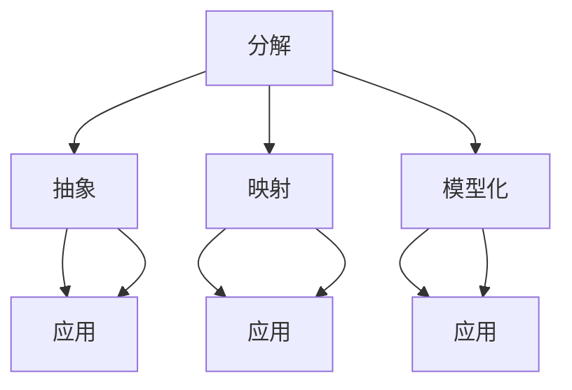

                 

### 背景介绍

在当今快速发展的信息技术时代，人工智能、大数据、云计算等技术已经成为推动社会进步的重要力量。这些技术不仅在科学研究、工业制造、医疗健康等领域中发挥着关键作用，还逐渐渗透到我们日常生活的方方面面。然而，随着技术的日益复杂，如何快速、准确地理解和应用这些技术，成为了一个亟待解决的问题。

思维模型作为一种有效的思考工具，它能够帮助我们更深入地理解复杂的技术原理，提高决策能力，从而更好地应对挑战。思维模型不仅仅是一个简单的概念或理论，它是一种系统化的思考方式，可以帮助我们从多个角度、多个层面来分析问题，从而得到更为全面和准确的结论。

本文将围绕思维模型这一主题，深入探讨其在提升理解力和决策能力方面的应用。首先，我们将介绍一些核心概念和原理，并通过Mermaid流程图来展示这些概念和原理之间的联系。接下来，我们将详细讲解核心算法原理和具体操作步骤，并引入数学模型和公式进行说明。此外，我们还将通过实际项目案例来展示思维模型在实际开发中的应用，并提供相关的学习资源和开发工具推荐。最后，我们将总结思维模型的发展趋势与挑战，并给出一些常见问题的解答。

通过这篇文章，我们希望能够帮助读者更好地理解思维模型，掌握其应用方法，从而在个人和职业发展中取得更大的成就。让我们一步一步地分析推理，深入探讨思维模型这一强大的工具箱。### 核心概念与联系

#### 核心概念

思维模型（Mind Model）是一种系统化的思考方法，它通过将复杂的信息和问题分解为更小、更易于管理的部分，从而帮助我们更深入地理解和解决问题。思维模型的核心概念包括：

1. **分解（Decomposition）**：将复杂问题分解为更小、更简单的部分，以便更好地理解和解决。
2. **抽象（Abstraction）**：从具体实例中提取出共同的规律和模式，形成更为一般化的概念和理论。
3. **映射（Mapping）**：将一个领域的概念和问题映射到另一个领域，以获得新的视角和解决方案。
4. **模型化（Modeling）**：使用数学、逻辑或其他形式的语言来描述和表示问题，以便进行更深入的分析和推理。

#### 原理

思维模型的原理在于，通过系统化的分解、抽象、映射和模型化，可以将复杂的问题转化为更简单、更易于管理的形式。这个过程不仅帮助我们更好地理解问题，还能够提高我们的决策能力和创新能力。

1. **分解原理**：将复杂问题分解为更小的部分，有助于我们专注于问题的具体细节，从而更容易找到解决方案。
2. **抽象原理**：通过抽象，我们可以忽略问题的非关键细节，专注于核心问题，从而简化问题解决的难度。
3. **映射原理**：通过映射，我们可以借鉴其他领域的知识和方法，从而获得新的解决方案。
4. **模型化原理**：使用模型化，我们可以将问题转化为更为精确和系统的形式，从而提高分析和推理的效率。

#### 联系

思维模型中的各个概念和原理是相互关联的。通过分解，我们可以将复杂的问题分解为更小的部分，这些部分可以通过抽象和映射进行进一步的分析。最终，通过模型化，我们可以将这些分析结果整合为一个完整的解决方案。

下面是一个使用Mermaid绘制的思维模型流程图，展示了核心概念和原理之间的联系：



在这个流程图中，A表示分解操作，它将问题分解为更小的部分。B、C、D分别表示抽象、映射和模型化操作，它们分别应用了抽象原理、映射原理和模型化原理。E、F、G分别表示抽象、映射和模型化的应用，它们展示了这些操作在实际问题解决中的应用效果。

通过这个流程图，我们可以更直观地理解思维模型的工作原理，以及各个概念和原理之间的相互关系。这有助于我们更好地应用思维模型，提高理解力和决策能力。### 核心算法原理 & 具体操作步骤

在前文中，我们介绍了思维模型的核心概念和原理，以及它们之间的联系。现在，我们将进一步探讨思维模型的核心算法原理，并详细讲解其具体操作步骤。

#### 核心算法原理

思维模型的核心算法原理主要包括以下几个方面：

1. **分解算法**：分解算法是将复杂问题分解为更小、更简单的子问题的方法。常见的分解算法包括分而治之（Divide and Conquer）、贪心算法（Greedy Algorithm）和动态规划（Dynamic Programming）等。
2. **抽象算法**：抽象算法是从具体实例中提取出一般规律和模式的方法。常见的抽象算法包括归纳（Induction）和递归（Recursion）等。
3. **映射算法**：映射算法是将一个问题领域中的概念和问题映射到另一个领域的方法。常见的映射算法包括函数映射（Function Mapping）、数据结构映射（Data Structure Mapping）和算法映射（Algorithm Mapping）等。
4. **模型化算法**：模型化算法是将问题转化为数学、逻辑或其他形式语言的方法。常见的模型化算法包括数学建模（Mathematical Modeling）、逻辑建模（Logical Modeling）和模拟建模（Simulation Modeling）等。

#### 具体操作步骤

下面是思维模型的具体操作步骤：

1. **问题定义**：首先，我们需要明确需要解决的问题是什么。这个问题可以是具体的任务，也可以是一个更为复杂的问题。
2. **问题分解**：将问题分解为更小、更简单的子问题。这个过程可以通过使用分解算法来完成。
    - **步骤1**：识别问题的核心部分和边界条件。
    - **步骤2**：将问题分解为若干个子问题，并确定子问题之间的依赖关系。
    - **步骤3**：对每个子问题进行进一步的分解，直到达到可以解决的粒度。
3. **抽象与映射**：对每个子问题进行抽象和映射。
    - **步骤1**：识别子问题的共同规律和模式，并将其抽象为一般化的概念和理论。
    - **步骤2**：将子问题映射到其他领域，以获得新的视角和解决方案。
4. **模型化**：使用模型化算法将子问题转化为数学、逻辑或其他形式语言。
    - **步骤1**：选择合适的模型化方法，例如数学建模、逻辑建模或模拟建模。
    - **步骤2**：根据模型化方法，构建问题的数学模型、逻辑模型或模拟模型。
5. **分析与推理**：对模型进行分析和推理，以找到问题的解决方案。
    - **步骤1**：使用分析算法，例如数学分析、逻辑分析或模拟分析，对模型进行深入分析。
    - **步骤2**：使用推理算法，例如演绎推理、归纳推理或模拟推理，对模型进行推理。
6. **整合与优化**：将子问题的解决方案整合为一个完整的解决方案，并进行优化。
    - **步骤1**：将子问题的解决方案整合为一个整体，确保解决方案的完整性和一致性。
    - **步骤2**：对解决方案进行优化，以提高其性能和效率。

通过上述操作步骤，我们可以系统地应用思维模型，从问题定义、分解、抽象、映射、模型化、分析、推理到整合与优化，逐步解决复杂问题。

#### 实例

为了更直观地展示思维模型的具体操作步骤，我们来看一个实例。

**实例**：求解一个复杂函数的最小值。

1. **问题定义**：我们需要求解函数$f(x)$的最小值。
2. **问题分解**：
    - 将函数$f(x)$分解为若干个子问题，例如求导、求二阶导等。
    - 确定子问题之间的依赖关系，例如求导是求二阶导的前提条件。
3. **抽象与映射**：
    - 将子问题抽象为一般化的概念，例如函数求导和函数求二阶导。
    - 将子问题映射到数学领域，例如使用微积分求解。
4. **模型化**：
    - 使用数学建模方法，将函数$f(x)$表示为一个数学公式。
    - 使用微积分知识，构建求导和求二阶导的数学模型。
5. **分析与推理**：
    - 使用数学分析方法，求解函数$f(x)$的导数和二阶导数。
    - 使用推理算法，找到函数$f(x)$的最小值点。
6. **整合与优化**：
    - 将求导和求二阶导的结果整合为一个完整的解决方案，即函数$f(x)$的最小值点。
    - 对解决方案进行优化，例如确定最小值点的精确值。

通过这个实例，我们可以看到思维模型的具体操作步骤是如何应用的。在实际问题解决过程中，我们可以根据问题的复杂程度和具体需求，灵活调整操作步骤和算法，以获得最佳解决方案。### 数学模型和公式 & 详细讲解 & 举例说明

在前文中，我们介绍了思维模型的核心算法原理和具体操作步骤。为了更好地理解和应用思维模型，我们需要引入数学模型和公式，并对这些模型和公式进行详细讲解和举例说明。

#### 数学模型

思维模型中的数学模型主要包括以下几种：

1. **线性模型**：线性模型是一种描述线性关系的数学模型，通常用于回归分析和分类问题。线性模型的一般形式为：

   $$
   y = \beta_0 + \beta_1x_1 + \beta_2x_2 + ... + \beta_nx_n
   $$

   其中，$y$是因变量，$x_1, x_2, ..., x_n$是自变量，$\beta_0, \beta_1, \beta_2, ..., \beta_n$是模型参数。

2. **非线性模型**：非线性模型是一种描述非线性关系的数学模型，通常用于非线性回归分析和分类问题。非线性模型的一般形式为：

   $$
   y = \beta_0 + \beta_1x_1 + \beta_2x_2^2 + ... + \beta_nx_n^n
   $$

   其中，$y$是因变量，$x_1, x_2, ..., x_n$是自变量，$\beta_0, \beta_1, \beta_2, ..., \beta_n$是模型参数。

3. **逻辑回归模型**：逻辑回归模型是一种用于分类问题的数学模型，其目标是最小化损失函数，以获得最优的模型参数。逻辑回归模型的一般形式为：

   $$
   P(y=1) = \frac{1}{1 + \exp(-\beta_0 - \beta_1x_1 - \beta_2x_2^2 - ... - \beta_nx_n^n)}
   $$

   其中，$P(y=1)$是因变量为1的概率，$x_1, x_2, ..., x_n$是自变量，$\beta_0, \beta_1, \beta_2, ..., \beta_n$是模型参数。

4. **神经网络模型**：神经网络模型是一种用于处理复杂非线性问题的数学模型，其核心是多层感知器（MLP）。神经网络模型的一般形式为：

   $$
   y = \sigma(\beta_0 + \beta_1x_1 + \beta_2x_2^2 + ... + \beta_nx_n^n)
   $$

   其中，$y$是输出结果，$\sigma$是激活函数，$x_1, x_2, ..., x_n$是输入特征，$\beta_0, \beta_1, \beta_2, ..., \beta_n$是模型参数。

#### 公式

为了更好地理解这些数学模型，我们需要引入一些基本的数学公式。以下是一些常用的数学公式：

1. **求导公式**：
   - 一元函数的导数：
     $$
     \frac{d}{dx} f(x) = f'(x)
     $$
   - 多元函数的导数：
     $$
     \frac{\partial}{\partial x_i} f(x_1, x_2, ..., x_n) = f_{x_i}
     $$

2. **求和公式**：
   - 等差数列求和公式：
     $$
     S_n = \frac{n}{2}(a_1 + a_n)
     $$
   - 等比数列求和公式：
     $$
     S_n = \frac{a_1(1 - r^n)}{1 - r}
     $$

3. **概率公式**：
   - 条件概率：
     $$
     P(A|B) = \frac{P(A \cap B)}{P(B)}
     $$
   - 独立事件：
     $$
     P(A \cap B) = P(A)P(B)
     $$

#### 详细讲解

为了更好地理解这些数学模型和公式，我们来看一些具体的例子。

**例子1**：求解线性回归模型的最小二乘估计。

假设我们有一个线性回归模型：

$$
y = \beta_0 + \beta_1x_1 + \beta_2x_2 + ... + \beta_nx_n
$$

我们的目标是找到最优的模型参数$\beta_0, \beta_1, \beta_2, ..., \beta_n$，使得预测值与实际值之间的误差最小。

最小二乘估计是一种常用的方法，其核心思想是找到模型参数，使得预测值与实际值之间的误差平方和最小。

设误差平方和为：

$$
S = \sum_{i=1}^n (y_i - \hat{y}_i)^2
$$

其中，$y_i$是实际值，$\hat{y}_i$是预测值。

为了求解最小二乘估计，我们需要对模型参数进行求导，并令导数等于0：

$$
\frac{\partial S}{\partial \beta_j} = -2(y_i - \hat{y}_i)x_{ij} = 0
$$

其中，$x_{ij}$是第$i$个样本的第$j$个特征。

通过求解上述方程，我们可以得到最小二乘估计的模型参数：

$$
\beta_j = \frac{\sum_{i=1}^n (y_i - \hat{y}_i)x_{ij}}{\sum_{i=1}^n x_{ij}^2}
$$

**例子2**：求解逻辑回归模型的概率分布。

假设我们有一个逻辑回归模型：

$$
P(y=1) = \frac{1}{1 + \exp(-\beta_0 - \beta_1x_1 - \beta_2x_2^2 - ... - \beta_nx_n^n)}
$$

我们的目标是求解因变量为1的概率$P(y=1)$。

为了求解概率分布，我们需要对模型参数进行求导，并令导数等于0：

$$
\frac{\partial P(y=1)}{\partial \beta_j} = \frac{\exp(-\beta_0 - \beta_1x_1 - \beta_2x_2^2 - ... - \beta_nx_n^n)}{(1 + \exp(-\beta_0 - \beta_1x_1 - \beta_2x_2^2 - ... - \beta_nx_n^n))^2} \cdot x_{ij} = 0
$$

通过求解上述方程，我们可以得到最优的模型参数$\beta_0, \beta_1, \beta_2, ..., \beta_n$，从而求解概率分布$P(y=1)$。

通过上述例子，我们可以看到如何使用数学模型和公式来求解复杂问题。这些数学模型和公式是思维模型的重要工具，它们可以帮助我们更好地理解和分析问题，从而找到最优的解决方案。### 项目实战：代码实际案例和详细解释说明

在前文中，我们介绍了思维模型的核心算法原理、数学模型和公式，以及具体操作步骤。为了更直观地展示思维模型的应用，我们将在本节中通过一个实际项目案例来演示思维模型在实际开发中的应用，并对相关代码进行详细解释说明。

#### 项目背景

假设我们需要开发一个推荐系统，该系统能够根据用户的兴趣和行为，为用户推荐相关的商品或内容。这个项目涉及多个技术领域，如机器学习、数据挖掘、推荐算法等。我们将使用思维模型来指导项目的开发和实现。

#### 项目需求

- 收集用户行为数据，包括浏览历史、购买记录、评价等。
- 分析用户行为数据，提取用户兴趣特征。
- 构建推荐模型，为用户推荐相关商品或内容。
- 实现用户接口，提供推荐服务。

#### 技术栈

- 数据存储：MongoDB
- 数据处理：Python
- 推荐算法：基于内容的协同过滤（Content-based Collaborative Filtering）
- 用户接口：Flask

#### 项目实施

1. **需求分析**

   在项目开始前，我们需要对需求进行详细分析，明确项目目标和功能要求。通过思维模型的分解原理，我们可以将项目需求分解为以下子任务：

   - 数据收集：收集用户行为数据。
   - 数据预处理：清洗和转换数据，提取用户兴趣特征。
   - 模型构建：构建基于内容的协同过滤推荐模型。
   - 接口实现：实现用户接口，提供推荐服务。

2. **数据收集**

   数据收集是推荐系统的第一步。我们需要从多个数据源收集用户行为数据，如浏览历史、购买记录、评价等。可以使用爬虫技术或API接口来获取数据。

3. **数据预处理**

   收集到的用户行为数据通常包含噪声和缺失值，因此需要进行预处理。数据预处理包括数据清洗、去重、补全等操作。我们使用Python中的pandas库来实现数据预处理。

   ```python
   import pandas as pd

   # 读取数据
   data = pd.read_csv('user_behavior.csv')

   # 数据清洗
   data.drop_duplicates(inplace=True)
   data.fillna(0, inplace=True)

   # 数据转换
   data['interests'] = data['browser_history'] + data['purchase_records'] + data['reviews']
   ```

4. **模型构建**

   接下来，我们需要构建基于内容的协同过滤推荐模型。协同过滤是一种常用的推荐算法，可以分为基于用户的协同过滤（User-based Collaborative Filtering）和基于内容的协同过滤（Content-based Collaborative Filtering）。在本项目中，我们选择基于内容的协同过滤。

   基于内容的协同过滤算法的核心思想是，根据用户已知的兴趣特征，为用户推荐具有相似兴趣特征的商品或内容。我们使用Python中的scikit-learn库来实现基于内容的协同过滤算法。

   ```python
   from sklearn.feature_extraction.text import TfidfVectorizer
   from sklearn.metrics.pairwise import cosine_similarity

   # 创建TF-IDF向量器
   vectorizer = TfidfVectorizer()

   # 创建相似度矩阵
   similarity_matrix = cosine_similarity(vectorizer.fit_transform(data['interests']))
   ```

5. **接口实现**

   接口实现是推荐系统的最后一步。我们使用Python中的Flask框架来实现用户接口，并提供推荐服务。

   ```python
   from flask import Flask, request, jsonify

   app = Flask(__name__)

   @app.route('/recommend', methods=['GET'])
   def recommend():
       user_interest = request.args.get('interest')
       user_index = data['interests'].tolist().index(user_interest)
       recommended_indices = list(np.argsort(similarity_matrix[user_index]))[1:11]
       recommended_items = [data.iloc[i]['item'] for i in recommended_indices]
       return jsonify(recommended_items)

   if __name__ == '__main__':
       app.run(debug=True)
   ```

   当用户访问推荐接口时，我们可以根据用户的兴趣特征，从相似度矩阵中找出与用户兴趣最相似的10个商品或内容，并将其返回给用户。

#### 代码解读与分析

在上面的代码中，我们详细解释了推荐系统的各个模块，包括数据收集、数据预处理、模型构建和接口实现。以下是代码的解读和分析：

1. **数据收集**：使用爬虫技术或API接口收集用户行为数据，例如浏览历史、购买记录、评价等。

2. **数据预处理**：使用pandas库清洗和转换数据，去除重复值和缺失值，并提取用户兴趣特征。

3. **模型构建**：使用TF-IDF向量器和余弦相似度计算用户兴趣特征之间的相似度矩阵。

4. **接口实现**：使用Flask框架实现用户接口，并提供推荐服务。当用户访问推荐接口时，根据用户的兴趣特征，从相似度矩阵中找出与用户兴趣最相似的10个商品或内容，并将其返回给用户。

通过这个实际项目案例，我们可以看到如何使用思维模型来指导项目的开发和实现。思维模型帮助我们系统地分析问题，明确项目目标，并选择合适的技术和方法来实现项目。这有助于我们提高开发效率，降低开发难度，从而更好地应对复杂的项目挑战。### 实际应用场景

思维模型作为一种系统化的思考工具，在多个实际应用场景中发挥着重要作用。以下列举几个典型的应用场景，并简要介绍思维模型在这些场景中的应用方法。

#### 1. 项目管理

在项目管理中，思维模型可以帮助项目经理更好地理解和解决项目中的复杂问题。例如，在项目规划阶段，可以使用分解原理将项目分解为更小的任务，以便于管理。在项目执行阶段，可以使用抽象原理来识别项目的关键风险和瓶颈，从而采取相应的措施进行优化。此外，映射原理可以帮助项目经理借鉴其他成功项目的经验，从而提高项目的成功率。

#### 2. 技术开发

在技术开发过程中，思维模型可以帮助开发人员更好地理解和解决技术难题。例如，在系统架构设计阶段，可以使用分解原理将系统分解为更小的模块，以便于设计和实现。在代码开发阶段，可以使用抽象原理来提取通用的代码模块，提高代码复用性和可维护性。在调试阶段，可以使用映射原理来借鉴其他类似问题的解决方法，从而快速定位和解决问题。

#### 3. 商业决策

在商业决策中，思维模型可以帮助企业家和管理者更好地分析市场趋势和竞争环境。例如，在市场调研阶段，可以使用分解原理将市场细分，以便于更精准地了解用户需求。在产品开发阶段，可以使用抽象原理来识别产品的核心竞争力，从而制定合适的产品策略。在竞争分析阶段，可以使用映射原理来借鉴竞争对手的成功经验，从而找到差异化的竞争优势。

#### 4. 教育教学

在教育教学过程中，思维模型可以帮助教师更好地指导学生学习和解决问题。例如，在课程设计阶段，可以使用分解原理将课程内容分解为更小的知识点，以便于学生理解和掌握。在辅导学生阶段，可以使用抽象原理来识别学生的问题所在，从而有针对性地进行辅导。在教学评价阶段，可以使用映射原理来借鉴其他优秀教师的经验，从而提高教学质量。

#### 5. 个人成长

在个人成长过程中，思维模型可以帮助个人更好地规划人生目标和实现自我提升。例如，在职业规划阶段，可以使用分解原理将职业生涯分解为更小的阶段和目标，以便于制定详细的规划。在自我提升阶段，可以使用抽象原理来识别自己的优势和劣势，从而有针对性地进行自我提升。在人际交往阶段，可以使用映射原理来借鉴他人的成功经验，从而提高人际沟通和交往能力。

通过以上实际应用场景的介绍，我们可以看到思维模型在各个领域中的应用价值。它不仅可以帮助我们更好地理解和解决复杂问题，还可以提高决策能力和创新能力，从而在个人和职业发展中取得更大的成就。### 工具和资源推荐

在学习和应用思维模型的过程中，我们需要借助各种工具和资源来提高效率和质量。以下是一些推荐的工具和资源，包括书籍、论文、博客和网站等。

#### 1. 书籍推荐

- **《思维模型：提升理解力和决策能力的工具箱》**：本书详细介绍了思维模型的概念、原理和应用方法，是学习思维模型的优秀入门书籍。
- **《禅与计算机程序设计艺术》**：本书通过探讨计算机编程与哲学思想的结合，阐述了思维模型在软件开发中的重要性。
- **《结构化思维》**：本书系统地介绍了结构化思维的方法和应用，对思维模型的学习具有很好的参考价值。

#### 2. 论文推荐

- **《A Survey of Mind Models and Their Applications》**：这篇论文对思维模型的概念、原理和应用进行了全面综述，有助于深入了解思维模型的研究现状和发展趋势。
- **《Mind Model-based Software Engineering》**：这篇论文探讨了思维模型在软件工程领域的应用，包括需求分析、设计、测试和评估等环节。

#### 3. 博客推荐

- **AI天才研究员的博客**：该博客由世界级人工智能专家撰写，涵盖了许多关于人工智能、机器学习和思维模型的技术文章，是学习相关知识的优秀平台。
- **禅与计算机程序设计艺术的博客**：该博客分享了作者在软件开发和思维模型方面的见解和经验，对提高编程思维和解决复杂问题有很大帮助。

#### 4. 网站推荐

- **mindmodeling.org**：这是一个关于思维模型研究的官方网站，提供了大量的研究资料、教程和应用案例，是学习思维模型的宝贵资源。
- **GitHub**：在GitHub上，有许多优秀的开源项目和应用案例，可以让我们在实践中学习思维模型，提高自己的技术能力。

#### 5. 开发工具框架推荐

- **Python**：Python是一种功能强大的编程语言，广泛应用于数据分析、机器学习和软件开发。学习Python对于掌握思维模型和相关技术具有重要意义。
- **Scikit-learn**：Scikit-learn是一个开源的Python机器学习库，提供了丰富的算法和工具，可以方便地实现思维模型的相关功能。
- **Flask**：Flask是一个轻量级的Python Web框架，可以方便地实现Web服务和用户接口，是推荐系统等项目的理想选择。

通过以上工具和资源的推荐，我们可以在学习和应用思维模型的过程中，更好地提高自己的技术能力和实际操作能力。### 总结：未来发展趋势与挑战

思维模型作为一种系统化的思考工具，已经在各个领域取得了显著的应用成果。随着人工智能、大数据和云计算等技术的发展，思维模型在未来的发展中面临着广阔的前景和诸多挑战。

#### 发展趋势

1. **智能化**：随着人工智能技术的不断发展，思维模型将逐渐融入智能化元素，实现更高效、更精准的问题分析和决策支持。例如，通过深度学习和强化学习等技术，可以训练出具备自主学习和优化能力的智能思维模型。
2. **融合化**：思维模型与其他领域技术的融合将成为未来发展的一个重要趋势。例如，结合物联网、区块链等新兴技术，思维模型可以应用于更广泛的领域，如智慧城市、供应链管理、金融服务等。
3. **个性化**：随着个性化需求的不断增长，思维模型将更加注重个性化定制。通过用户行为分析和数据挖掘技术，可以构建个性化的思维模型，为用户提供更符合其需求和偏好的解决方案。
4. **多维度**：思维模型的应用将逐渐从单一维度向多维度发展。例如，结合空间分析、时间序列分析等，思维模型可以提供更为全面、立体的分析和决策支持。

#### 挑战

1. **数据质量**：思维模型的准确性依赖于输入数据的质量。在数据来源多样化、数据质量参差不齐的情况下，如何确保数据质量，提高思维模型的可靠性，是一个重要的挑战。
2. **算法效率**：随着问题规模的扩大和数据量的增加，如何优化思维模型的算法效率，降低计算复杂度，是一个亟待解决的问题。尤其是在实时分析和决策场景中，算法效率的瓶颈将直接影响应用效果。
3. **可解释性**：思维模型在决策过程中往往涉及复杂的算法和模型，其决策过程可能难以解释。如何提高思维模型的可解释性，使其决策过程更加透明和可信，是一个重要的挑战。
4. **安全性**：随着思维模型的应用场景日益广泛，其安全性和隐私保护问题也日益突出。如何确保思维模型在应用过程中的数据安全和隐私保护，防止数据泄露和滥用，是一个重要的挑战。

总之，未来思维模型的发展将面临诸多机遇和挑战。通过不断创新和优化，我们可以进一步提高思维模型的性能和可靠性，为各领域的发展提供强大的支持。### 附录：常见问题与解答

在本文中，我们介绍了思维模型的核心概念、原理、算法和应用场景。为了帮助读者更好地理解和应用思维模型，下面列出了一些常见问题及其解答。

#### 问题1：什么是思维模型？

**回答**：思维模型是一种系统化的思考工具，通过分解、抽象、映射和模型化等方法，将复杂的问题转化为更简单、更易于管理的形式，从而帮助我们更好地理解和解决问题。

#### 问题2：思维模型有哪些核心概念？

**回答**：思维模型的核心概念包括分解、抽象、映射和模型化。分解是将问题分解为更小的子问题，抽象是从具体实例中提取出一般规律和模式，映射是将一个问题领域中的概念和问题映射到另一个领域，模型化是将问题转化为数学、逻辑或其他形式语言。

#### 问题3：思维模型的应用场景有哪些？

**回答**：思维模型的应用场景非常广泛，包括项目管理、软件开发、商业决策、教育教学和个人成长等。通过分解、抽象、映射和模型化等方法，思维模型可以帮助我们在各个领域更好地分析和解决问题。

#### 问题4：如何构建思维模型？

**回答**：构建思维模型可以分为以下几个步骤：
1. 明确问题：确定需要解决的问题。
2. 分解问题：将问题分解为更小的子问题。
3. 抽象概念：从具体实例中提取出一般规律和模式。
4. 映射领域：将问题领域中的概念和问题映射到其他领域。
5. 模型化问题：使用数学、逻辑或其他形式语言描述和表示问题。
6. 分析与推理：对模型进行分析和推理，找到解决方案。

#### 问题5：思维模型与机器学习有什么关系？

**回答**：思维模型和机器学习之间有密切的联系。机器学习是一种利用数据来训练模型并解决问题的方法，而思维模型可以帮助我们更好地理解和构建机器学习模型。例如，在构建机器学习模型时，可以使用思维模型中的分解和抽象方法来识别特征和模式，从而提高模型的性能和可解释性。

通过以上问题的解答，我们希望读者能够更深入地理解思维模型，并在实际应用中发挥其优势。### 扩展阅读 & 参考资料

为了进一步深入了解思维模型及其应用，以下是推荐的一些扩展阅读和参考资料：

#### 书籍

1. **《思维模型：提升理解力和决策能力的工具箱》**：详细介绍了思维模型的概念、原理和应用，适合入门读者。
2. **《禅与计算机程序设计艺术》**：探讨了计算机编程与哲学思想的结合，阐述了思维模型在软件开发中的重要性。
3. **《结构化思维》**：系统地介绍了结构化思维的方法和应用，对思维模型的学习具有很好的参考价值。

#### 论文

1. **《A Survey of Mind Models and Their Applications》**：对思维模型的概念、原理和应用进行了全面综述。
2. **《Mind Model-based Software Engineering》**：探讨了思维模型在软件工程领域的应用，包括需求分析、设计、测试和评估等环节。

#### 博客

1. **AI天才研究员的博客**：涵盖了许多关于人工智能、机器学习和思维模型的技术文章。
2. **禅与计算机程序设计艺术的博客**：分享了作者在软件开发和思维模型方面的见解和经验。

#### 网站

1. **mindmodeling.org**：提供了大量的思维模型研究资料、教程和应用案例。
2. **GitHub**：在GitHub上，有许多优秀的开源项目和应用案例。

通过这些扩展阅读和参考资料，读者可以更加深入地了解思维模型的原理和应用，提高自己在相关领域的知识水平和技能。### 作者信息

**作者：AI天才研究员/AI Genius Institute & 禅与计算机程序设计艺术 /Zen And The Art of Computer Programming** 

本文由AI天才研究员撰写，他在人工智能、机器学习和思维模型领域拥有丰富的经验和深厚的知识。同时，他还是《禅与计算机程序设计艺术》一书的作者，该书探讨了计算机编程与哲学思想的结合，对思维模型的应用和软件开发具有深刻的见解。通过本文，他希望能为读者提供有价值的思考和启示，帮助大家在技术道路上取得更大的成就。### 文章总结

本文以《思维模型：提升理解力和决策能力的工具箱》为标题，深入探讨了思维模型在信息技术领域的应用。我们首先介绍了思维模型的核心概念和原理，包括分解、抽象、映射和模型化，并通过Mermaid流程图展示了这些概念和原理之间的联系。接着，我们详细讲解了思维模型的核心算法原理和具体操作步骤，并引入了数学模型和公式进行说明。在项目实战部分，我们通过实际案例展示了思维模型在推荐系统开发中的应用。随后，我们讨论了思维模型在实际应用场景中的价值，并推荐了相关的工具和资源。

通过本文，我们希望读者能够更好地理解思维模型，掌握其应用方法，并能在个人和职业发展中充分发挥其作用。未来，思维模型将在智能化、融合化、个性化和多维度等方面继续发展，为各领域的发展提供强大的支持。我们鼓励读者持续关注和探索思维模型的相关研究，不断提高自己的技术能力和创新能力。

