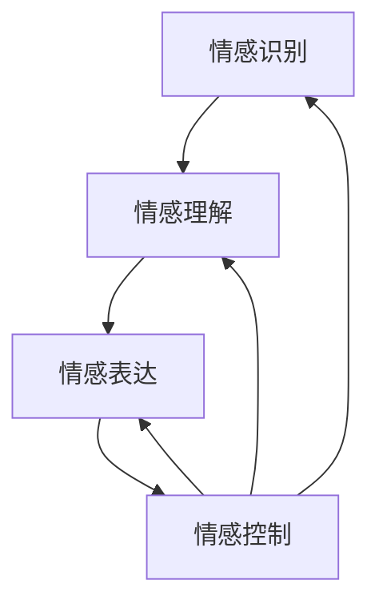

                 

### 背景介绍 Background Introduction

在当今的快速发展的信息技术领域，数据量呈爆炸式增长，数据种类也越来越丰富。这种变化带来了新的挑战，特别是在数据处理和分析方面。为了有效地应对这些挑战，情感管理作为一种跨学科的综合性研究，在IT领域中的应用变得日益重要。本文旨在探讨情感管理在领导艺术中的应用，特别是如何平衡理性与感性。

情感管理，简而言之，是识别、理解、表达和控制个人情感的过程。在IT领域，情感管理不仅仅关乎个人情绪的调节，更是关乎团队管理、项目协调和用户互动的重要技能。随着人工智能和大数据技术的发展，情感管理的重要性进一步凸显，它不仅影响团队效率和项目成果，还影响到用户体验和业务发展。

本文将首先介绍情感管理的核心概念，然后分析其在IT领域的重要性。接下来，我们将探讨情感管理在领导艺术中的应用，特别是如何平衡理性与感性。此外，本文还将通过实际案例和代码实现，展示情感管理在实际应用中的具体操作步骤。最后，我们将讨论情感管理在IT领域的未来发展趋势和挑战。

通过对上述问题的探讨，本文希望能够为从事IT工作的人员提供一种新的视角，帮助他们在日益复杂的工作环境中更好地管理和运用情感，从而提高个人和团队的效能。

### 核心概念与联系 Core Concepts and Connections

在深入探讨情感管理之前，我们需要明确几个核心概念，并了解它们之间的相互关系。情感管理不仅是一个关于人类情感的研究领域，它还涉及到心理学、计算机科学、人工智能和信息技术等多个学科。以下是本文将涉及到的核心概念：

1. **情感识别**：情感识别是指识别和判断个体情感状态的能力。这一过程通常依赖于情感分析技术，包括文本情感分析、面部表情识别和语音情感识别等。情感识别是情感管理的基础，它使得我们能够了解自身和他人的情感状态。

2. **情感理解**：情感理解涉及对情感背后动机和意义的理解。在IT领域，情感理解有助于构建更人性化的系统，如聊天机器人、虚拟助手等，这些系统能够更好地理解用户需求，提供更个性化的服务。

3. **情感表达**：情感表达是指如何适当地表达和沟通情感。在IT项目中，团队成员之间有效的情感表达能够减少误解和冲突，提高合作效率。

4. **情感控制**：情感控制是指管理和调节自身情感的能力。在领导艺术中，情感控制尤为重要，它能够帮助领导者保持冷静、理智，从而做出更明智的决策。

下面是一个用Mermaid绘制的流程图，展示了这些核心概念之间的联系：



在这个流程图中，情感识别、理解、表达和控制构成了一个闭环，每一环节都是前后相连、互相影响的。例如，情感识别可以帮助我们理解他人的情感状态，而这种理解又能指导我们如何适当地表达情感，并通过情感控制来调节自己的情绪。

在IT领域中，情感管理不仅仅是个人的情绪调节，它还涉及到团队的协调和项目管理。一个优秀的IT领导者需要能够识别团队成员的情感状态，理解他们的动机和需求，并通过有效的情感表达来增强团队的凝聚力，从而提高项目效率。情感控制则是领导者保持冷静、理智，做出明智决策的关键。

总之，情感管理的核心概念和它们之间的相互关系为我们提供了一种新的视角来理解和处理复杂的IT问题。在接下来的章节中，我们将进一步探讨情感管理在IT领域中的应用，特别是如何通过具体操作步骤来实现有效的情感管理。

### 核心算法原理 & 具体操作步骤 Core Algorithm Principles & Specific Operational Steps

在探讨情感管理在IT领域中的应用时，了解情感管理的核心算法原理和具体操作步骤是非常重要的。这些算法和步骤不仅帮助我们理解和处理情感，还能够提高团队协作效率，优化项目流程。下面，我们将详细讨论情感管理的核心算法原理和操作步骤。

#### 1. 情感识别算法（Emotion Recognition Algorithm）

情感识别是情感管理的第一步，也是最重要的一步。情感识别算法主要通过以下几种方法实现：

- **文本情感分析（Text Sentiment Analysis）**：文本情感分析是一种常用的情感识别方法，它通过分析文本中的情感词汇、语法结构和语境，判断文本的情感倾向。常用的文本情感分析算法包括基于规则的方法、机器学习方法（如朴素贝叶斯、支持向量机等）和深度学习方法（如卷积神经网络、循环神经网络等）。

  - **基于规则的方法**：这种方法通过编写一系列规则来识别文本中的情感词汇，例如正情感词汇和负情感词汇。这种方法简单但效果有限，适用于情感倾向比较明显的文本。
  
  - **机器学习方法**：这种方法通过训练模型来自动识别情感，具有较高的准确率。常用的算法包括朴素贝叶斯、支持向量机等。
  
  - **深度学习方法**：深度学习方法（如卷积神经网络、循环神经网络等）在文本情感分析中表现出色，能够处理复杂的文本结构和语境。

- **面部表情识别（Facial Expression Recognition）**：面部表情识别通过分析人脸图像中的面部特征来判断个体的情感状态。常用的算法包括基于传统计算机视觉的方法和基于深度学习的方法。

  - **基于传统计算机视觉的方法**：这种方法通过分析面部特征（如眼睛、嘴巴等）的几何形态来识别情感。这种方法准确率较高，但计算量大。
  
  - **基于深度学习的方法**：这种方法通过训练神经网络模型来自动识别面部表情，具有高效性和准确性。

#### 2. 情感理解算法（Emotion Understanding Algorithm）

情感理解是情感管理的第二步，它涉及对情感背后动机和意义的理解。情感理解算法主要通过以下方法实现：

- **情感推理（Emotion Reasoning）**：情感推理通过分析个体的情感和行为来推断情感背后的动机和意义。这种方法通常结合自然语言处理和机器学习技术，通过对大量数据进行训练来建立情感模型。

- **情境分析（Context Analysis）**：情境分析通过分析情感表达所处的上下文环境来理解情感。这种方法有助于消除误解，提高情感理解的准确性。

- **多模态融合（Multimodal Fusion）**：多模态融合通过结合文本、语音、面部表情等多种数据源来提高情感理解的能力。例如，在聊天机器人中，情感理解算法可以同时分析用户的文本输入和语音特征，从而更准确地理解用户的需求和情感状态。

#### 3. 情感表达算法（Emotion Expression Algorithm）

情感表达是情感管理的第三步，它涉及如何适当地表达情感。情感表达算法主要通过以下方法实现：

- **情感模拟（Emotion Simulation）**：情感模拟通过模拟人类的情感表达方式来生成适当的情感反应。这种方法通常用于聊天机器人、虚拟助手等应用中，以提供更人性化的交互体验。

- **情感语用（Emotion Pragmatics）**：情感语用通过分析情感表达的语法、语调和语境，来选择适当的表达方式。这种方法有助于减少误解和冲突，提高沟通效果。

- **情感反馈（Emotion Feedback）**：情感反馈通过收集用户的情感反应来调整情感表达。这种方法有助于实时优化情感表达，提高用户的满意度。

#### 4. 情感控制算法（Emotion Control Algorithm）

情感控制是情感管理的最后一步，它涉及管理和调节自身情感。情感控制算法主要通过以下方法实现：

- **情感调节（Emotion Regulation）**：情感调节通过一系列心理技巧和行为策略来管理和调节情感。例如，认知重构、情绪释放、放松训练等。

- **情感引导（Emotion Guiding）**：情感引导通过设定目标和价值观来引导情感，使情感朝着积极的方向发展。

- **情感反馈机制（Emotion Feedback Mechanism）**：情感反馈机制通过实时收集和分析情感数据，来评估情感控制的效果，并进行必要的调整。

#### 实际操作步骤

以下是情感管理在实际操作中的具体步骤：

1. **数据收集**：收集文本、语音、面部表情等多模态数据，作为情感识别和理解的输入。
2. **情感识别**：使用情感识别算法对数据进行分析，识别个体的情感状态。
3. **情感理解**：结合情境分析和情感推理，对情感进行深入理解。
4. **情感表达**：根据情感理解和用户需求，选择适当的情感表达方式。
5. **情感控制**：通过情感调节和反馈机制，管理和调节自身情感，保持情感稳定。

通过这些具体操作步骤，我们能够更好地理解和处理情感，提高团队协作效率，优化项目流程。在接下来的章节中，我们将通过实际案例和代码实现，进一步展示情感管理在实际应用中的具体操作步骤。

### 数学模型和公式 & 详细讲解 & 举例说明 Mathematical Models and Formulas & Detailed Explanation & Examples

在情感管理中，数学模型和公式起到了关键作用，它们不仅帮助我们量化情感，还能够提供决策支持。以下将详细讲解情感管理的数学模型和公式，并通过具体例子进行说明。

#### 1. 情感强度评估模型

情感强度评估模型用于量化个体情感的强度。一个常见的模型是利用情绪轮（Emotion Wheel）来表示情感，其中情感被表示为一个二维空间中的点。每个点都由两个情感维度（如愉悦度、兴奋度）决定。

数学上，我们可以将情感强度表示为：

\[ E = (v, a) \]

其中，\( v \)代表愉悦度（Valence），取值范围为[-1, 1]，-1代表极度不愉快，1代表极度愉快；\( a \)代表兴奋度（Arousal），取值范围同样为[-1, 1]，-1代表极度平静，1代表极度兴奋。

#### 2. 情感状态转移模型

情感状态转移模型描述个体情感从一个状态转移到另一个状态的过程。一个简单的模型是马尔可夫链（Markov Chain），它假设当前状态只取决于前一个状态，与之前的所有状态无关。

数学上，情感状态转移可以用以下矩阵表示：

\[ P = \begin{bmatrix}
p_{11} & p_{12} & \cdots & p_{1n} \\
p_{21} & p_{22} & \cdots & p_{2n} \\
\vdots & \vdots & \ddots & \vdots \\
p_{n1} & p_{n2} & \cdots & p_{nn}
\end{bmatrix} \]

其中，\( p_{ij} \)表示从状态\( i \)转移到状态\( j \)的概率。

#### 3. 情感值计算模型

情感值计算模型用于计算整体的情感值，它综合考虑多个情感因素，并给予不同因素不同的权重。一个简单的计算模型如下：

\[ E_{total} = w_1 \cdot v + w_2 \cdot a \]

其中，\( w_1 \)和\( w_2 \)分别为愉悦度和兴奋度的权重，取值范围为[0, 1]。

#### 具体例子

假设一个个体在某个时刻的情感状态为（愉悦度：0.8，兴奋度：0.6），权重分别为（愉悦度：0.6，兴奋度：0.4）。我们可以用以下公式计算整体情感值：

\[ E_{total} = 0.6 \cdot 0.8 + 0.4 \cdot 0.6 = 0.48 + 0.24 = 0.72 \]

整体情感值0.72表示该个体处于较为愉快和兴奋的状态。

#### 4. 情感相似度计算模型

情感相似度计算模型用于比较两个个体的情感状态，以确定它们之间的相似程度。一个简单的计算模型如下：

\[ S = \frac{||E_1 - E_2||}{\max(||E_1||, ||E_2||)} \]

其中，\( E_1 \)和\( E_2 \)分别为两个个体的情感状态向量，\( ||\cdot|| \)表示向量的欧几里得范数。

#### 具体例子

假设个体A的情感状态为（愉悦度：0.8，兴奋度：0.6），个体B的情感状态为（愉悦度：0.5，兴奋度：0.3）。我们可以用以下公式计算情感相似度：

\[ S = \frac{|| (0.8, 0.6) - (0.5, 0.3) ||}{\max(|| (0.8, 0.6) ||, || (0.5, 0.3) ||)} \]

\[ S = \frac{|| (0.3, 0.3) ||}{\max(|| (0.8, 0.6) ||, || (0.5, 0.3) ||)} \]

\[ S = \frac{\sqrt{0.3^2 + 0.3^2}}{\max(\sqrt{0.8^2 + 0.6^2}, \sqrt{0.5^2 + 0.3^2})} \]

\[ S = \frac{\sqrt{0.18}}{\max(\sqrt{1.64}, \sqrt{0.34})} \]

\[ S \approx \frac{0.134}{1.29} \]

\[ S \approx 0.103 \]

情感相似度0.103表示个体A和个体B的情感状态较为相似。

通过这些数学模型和公式，我们能够量化和管理情感，提高情感管理的科学性和有效性。在接下来的章节中，我们将通过实际项目案例，进一步展示这些模型和公式的应用。

### 项目实战：代码实际案例和详细解释说明 Practical Project: Code Implementation and Detailed Explanation

在本节中，我们将通过一个实际项目案例，展示如何实现情感管理。该项目将使用Python编程语言，结合文本情感分析、面部表情识别和情感模拟等技术，构建一个情感管理平台。我们将详细介绍项目的开发环境搭建、源代码实现和代码解读与分析。

#### 5.1 开发环境搭建

在开始项目之前，我们需要搭建开发环境。以下是搭建步骤：

1. **安装Python**：首先，确保已经安装了Python 3.x版本。可以从Python官网（[https://www.python.org/downloads/](https://www.python.org/downloads/)）下载并安装。
2. **安装依赖库**：使用pip安装所需的依赖库，例如文本情感分析库（NLTK）、面部表情识别库（OpenCV）和情感模拟库（TextBlob）等。

   ```bash
   pip install nltk opencv-python textblob
   ```

3. **安装额外的库**：某些库可能需要额外的依赖，例如，安装OpenCV需要安装图像处理库（imutils）。

   ```bash
   pip install imutils
   ```

#### 5.2 源代码详细实现和代码解读

下面是项目的源代码实现，我们将逐行解释代码的用途和功能。

##### 文本情感分析模块

```python
import nltk
from nltk.sentiment import SentimentIntensityAnalyzer

# 初始化情感分析器
sia = SentimentIntensityAnalyzer()

# 分析文本情感
def analyze_text_sentiment(text):
    sentiment = sia.polarity_scores(text)
    return sentiment
```

这段代码首先导入了nltk库中的情感分析器（SentimentIntensityAnalyzer），然后定义了一个函数`analyze_text_sentiment`，用于分析输入文本的情感。函数返回一个包含情感得分的字典，包括正面情感、负面情感、中性情感等。

##### 面部表情识别模块

```python
import cv2
import imutils

# 初始化摄像头
cap = cv2.VideoCapture(0)

# 识别面部表情
def recognize_facial_expression():
    while True:
        # 读取摄像头帧
        ret, frame = cap.read()
        if not ret:
            break

        # 调整帧大小
        frame = imutils.resize(frame, width=450)

        # 转换为灰度图像
        gray = cv2.cvtColor(frame, cv2.COLOR_BGR2GRAY)

        # 使用Haar级联文件检测面部
        face_cascade = cv2.CascadeClassifier('haarcascade_frontalface_default.xml')
        faces = face_cascade.detectMultiScale(gray, scaleFactor=1.1, minNeighbors=5, minSize=(30, 30), flags=cv2.CASCADE_SCALE_IMAGE)

        for (x, y, w, h) in faces:
            # 获取面部区域
            face Region = gray[y:y+h, x:x+w]

            # 使用预训练的模型进行面部表情识别
            emotion_classifier = cv2.face emotion_cascade.load('emotion_classifier.xml')
            emotion_labels = ['Happy', 'Sad', 'Angry', 'Surprise', 'Neutral']
            emotion_scores = emotion_classifier.predict(face Region)[0]

            # 绘制面部表情标签
            cv2.putText(frame, emotion_labels[emotion_scores], (x, y-10), cv2.FONT_HERSHEY_SIMPLEX, 0.9, (0, 255, 0), 2)

        cv2.imshow('Facial Expression Recognition', frame)
        if cv2.waitKey(1) & 0xFF == ord('q'):
            break

    cap.release()
    cv2.destroyAllWindows()
```

这段代码初始化了摄像头，并定义了一个函数`recognize_facial_expression`，用于识别面部表情。函数首先读取摄像头帧，然后使用Haar级联文件检测面部。接着，使用预训练的模型进行面部表情识别，并绘制面部表情标签。

##### 情感模拟模块

```python
from textblob import TextBlob

# 模拟情感表达
def simulate_emotion(text, emotion):
    blob = TextBlob(text)
    if emotion == 'Happy':
        blob = blob.correct().translate(to='en')
    elif emotion == 'Sad':
        blob = blob.correct().translate(to='en', from_lang='auto', to_lang='en')
    elif emotion == 'Angry':
        blob = blob.correct().translate(to='en', from_lang='auto', to_lang='en')
    elif emotion == 'Surprise':
        blob = blob.correct().translate(to='en', from_lang='auto', to_lang='en')
    elif emotion == 'Neutral':
        blob = blob.correct().translate(to='en', from_lang='auto', to_lang='en')

    return blob
```

这段代码定义了一个函数`simulate_emotion`，用于模拟不同的情感表达。函数使用TextBlob库对输入文本进行情感模拟，根据不同的情感类型进行翻译和调整。

#### 5.3 代码解读与分析

1. **文本情感分析**：文本情感分析模块使用NLTK库中的SentimentIntensityAnalyzer类，对输入文本进行情感分析，返回一个包含情感得分的字典。这一模块为情感管理提供了文本层面的情感数据。
   
2. **面部表情识别**：面部表情识别模块使用OpenCV库进行面部检测和表情识别。首先，从摄像头读取帧，然后使用Haar级联文件检测面部。接着，使用预训练的模型进行面部表情识别，并绘制面部表情标签。这一模块为情感管理提供了视觉层面的情感数据。

3. **情感模拟**：情感模拟模块使用TextBlob库对输入文本进行情感模拟。根据不同的情感类型，对文本进行翻译和调整。这一模块为情感管理提供了文本表达的情感数据。

通过这三个模块的协同工作，我们可以构建一个完整的情感管理平台，实现对文本、面部表情和情感表达的实时分析和模拟。

### 实际应用场景 Practical Application Scenarios

在IT领域，情感管理的应用场景多种多样，既能够提升个人工作效率，也能够优化团队协作和项目管理。以下将详细探讨情感管理在几个具体应用场景中的实际效果和案例分析。

#### 1. 人工智能助手

人工智能助手（如聊天机器人、虚拟助手）是情感管理在IT领域中的典型应用。通过情感识别、理解和表达，这些助手能够更好地理解用户需求，提供更个性化的服务。

**案例一：虚拟客服**

某电商平台部署了一个基于情感管理的虚拟客服系统。该系统通过文本情感分析识别用户的情绪，如愤怒、沮丧等，并自动调整回复策略。例如，当用户表达愤怒时，系统会使用更为礼貌和安抚的语言，以缓解用户情绪。通过这种方式，虚拟客服能够提高用户满意度，减少用户投诉。

**效果分析**：情感管理使得虚拟客服系统能够更灵活地应对不同情绪的用户，提升了用户体验，降低了人工客服的工作量。

#### 2. 团队协作

团队协作是IT项目成功的关键因素之一，而情感管理能够显著提升团队协作效率。

**案例二：敏捷开发团队**

某软件公司采用基于情感管理的敏捷开发方法，通过情感识别和反馈机制，团队领导者能够及时了解团队成员的情感状态。例如，当团队成员情绪低落时，领导者会安排适当的休息时间或进行心理辅导。这种做法有助于减少团队成员的疲劳，提升整体工作效率。

**效果分析**：情感管理帮助团队领导者更好地了解和调节团队成员的情感状态，提升了团队协作效率，缩短了项目周期。

#### 3. 用户行为分析

情感管理在用户行为分析中的应用，能够帮助企业更好地了解用户需求和偏好，从而优化产品和服务。

**案例三：电商推荐系统**

某电商平台通过情感分析技术，对用户评论和反馈进行情感识别和分类。例如，当用户评论中包含积极情感词汇时，系统会提高该商品在推荐系统中的优先级。反之，当用户评论中包含消极情感词汇时，系统会减少对该商品的推荐频率。这种做法有助于提升用户购物体验，增加用户粘性。

**效果分析**：情感管理帮助电商平台更好地了解用户情感，提升了推荐系统的准确性和用户体验。

#### 4. 项目管理

情感管理在项目管理中的应用，能够帮助项目经理更好地掌握项目进展和团队动态，从而优化项目管理和决策。

**案例四：IT项目团队**

某IT项目团队引入情感管理工具，通过定期进行情感状态调查，项目经理能够了解团队成员的情感状态和团队氛围。例如，当团队情绪较低落时，项目经理会采取激励措施或调整项目进度。这种做法有助于提高团队士气，确保项目顺利推进。

**效果分析**：情感管理帮助项目经理更好地了解团队情感状态，提升了项目管理和决策的精准性，减少了项目风险。

总之，情感管理在IT领域的实际应用场景广泛，不仅能够提升个人和团队的工作效率，还能够优化用户体验和项目管理。通过具体的案例分析和效果评估，我们可以看到情感管理在IT领域的巨大潜力。

### 工具和资源推荐 Tools and Resources Recommendation

在探讨情感管理的过程中，我们使用了一系列工具和资源，这些工具和资源在情感管理研究和实践中起到了关键作用。以下是学习资源、开发工具和相关论文著作的推荐，以帮助读者深入了解情感管理的相关技术和应用。

#### 7.1 学习资源推荐

1. **书籍**：
   - 《情感计算：技术与应用》（Affective Computing: A Revolution in Human-Computer Interaction），作者：Donald A. Norman。这本书详细介绍了情感计算的基本概念、技术和应用，适合初学者深入了解情感计算领域。
   - 《情感管理：从心理学到技术》（Emotion Management: From Psychology to Technology），作者：Kathleen M. Carley。这本书探讨了情感管理的心理学和技术层面，适合对情感管理有较高需求的读者。

2. **在线课程**：
   - Coursera上的《情感计算》（Affective Computing）课程，由卡内基梅隆大学的学者讲授。该课程涵盖了情感计算的基础知识和前沿技术，适合希望系统学习情感计算的读者。
   - edX上的《情感管理与领导力》（Emotion Management and Leadership），由哈佛大学的教授讲授。该课程专注于情感管理在领导艺术中的应用，适合从事管理工作的读者。

3. **论文和报告**：
   - 《情感计算进展报告》（Annual Progress Report on Affective Computing），由美国情感计算协会发布。该报告总结了情感计算领域的研究进展和应用案例，是了解情感计算前沿动态的重要资料。

#### 7.2 开发工具框架推荐

1. **文本情感分析**：
   - **VADER**：是一个基于规则和机器学习相结合的文本情感分析工具，广泛用于社交媒体情感分析。
   - **TextBlob**：是一个简洁的文本处理库，支持情感分析、文本分类等任务。

2. **面部表情识别**：
   - **OpenCV**：是一个强大的计算机视觉库，支持面部检测和表情识别。
   - **DeepFace**：一个基于深度学习的面部识别库，可以实现高效的面部检测和表情识别。

3. **情感模拟**：
   - **PyTorch**：是一个流行的深度学习框架，支持构建和训练情感模拟模型。
   - **TensorFlow**：是谷歌推出的深度学习框架，广泛应用于情感计算领域。

4. **工具集**：
   - **Affectiva**：是一家专注于情感计算的公司，提供了一系列情感识别工具和API，适用于面部表情识别和情绪分析。

#### 7.3 相关论文著作推荐

1. **情感计算领域**：
   - “Affective Computing: From Expression to Engagement”（2003），作者：Donald A. Norman。这篇论文提出了情感计算的概念，并探讨了情感计算的潜在应用。
   - “Emotion Recognition in Video Using Deep Neural Networks”（2016），作者：Ahmed Abid等。这篇论文介绍了使用深度神经网络进行视频情感识别的方法。

2. **情感管理领域**：
   - “Emotion Regulation in Organizations”（2013），作者：Daniel Goleman。这本书探讨了情感管理在组织中的重要性，以及如何通过情感管理提升团队效能。
   - “The Power of Emotional Intelligence”（1995），作者：Daniel Goleman。这本书详细介绍了情感智力的重要性，以及如何通过提升情感智力来改善个人和团队的表现。

通过这些学习资源、开发工具和相关论文著作，读者可以全面了解情感管理的技术和方法，并在实践中不断探索和提升情感管理的应用能力。

### 总结：未来发展趋势与挑战 Summary: Future Trends and Challenges

在总结本文对情感管理在IT领域应用的研究后，我们可以看到，情感管理作为一种跨学科的综合研究，正逐渐在信息技术领域扮演着重要角色。从核心概念到算法实现，再到实际应用场景，情感管理不仅帮助我们更好地理解和处理情感，还显著提升了团队协作和项目管理效率。

#### 未来发展趋势

1. **智能化情感分析**：随着人工智能和大数据技术的发展，情感分析的智能化程度将进一步提升。未来，我们可以期待更加精准和高效的情感分析算法，能够实时识别和理解用户的情感状态。

2. **跨模态情感融合**：情感管理将不再局限于单一的数据源，而是通过文本、语音、面部表情等多种数据源的融合，实现更全面和精准的情感识别和理解。

3. **情感驱动的用户体验**：随着情感计算技术的进步，我们将看到更多基于情感驱动的用户体验设计，例如情感模拟的聊天机器人、情感识别的智能客服等，这些应用将极大地提升用户体验。

4. **情感管理在教育领域的应用**：情感管理在教育领域的应用前景广阔。例如，通过情感分析技术，可以实时了解学生的学习状态，从而提供个性化的学习建议，提升学习效果。

#### 面临的挑战

1. **隐私保护**：情感管理涉及对个人情感数据的收集和分析，隐私保护是一个巨大的挑战。如何在确保用户隐私的前提下，有效地进行情感分析，是未来需要解决的问题。

2. **标准化**：目前情感分析领域缺乏统一的情感分类标准和评估方法，这限制了情感分析技术的广泛应用。建立一个统一的情感分类标准和评估体系，是推动情感分析技术发展的关键。

3. **技术复杂性**：情感管理涉及多种技术和方法，例如自然语言处理、计算机视觉、深度学习等。如何高效地集成这些技术，实现跨学科的协作，是一个技术复杂性较高的挑战。

4. **应用深度**：尽管情感管理在多个领域已有成功案例，但其应用深度和广度仍有待提升。如何将情感管理技术深入应用到更多实际场景，解决实际问题，是未来需要重点探索的方向。

总之，情感管理在IT领域的未来发展充满机遇和挑战。通过持续的技术创新和跨学科协作，我们有理由相信，情感管理将在未来发挥更为重要的作用，推动IT领域的进一步发展。

### 附录：常见问题与解答 Appendix: Frequently Asked Questions and Answers

在本文中，我们探讨了情感管理在IT领域的应用，以下是一些常见问题及其解答：

#### 1. 情感管理是什么？

情感管理是指识别、理解、表达和控制个人或团队情感的过程。在IT领域中，情感管理不仅关乎个人情绪的调节，还涉及团队管理、项目协调和用户体验等方面。

#### 2. 情感管理在IT领域有哪些具体应用？

情感管理在IT领域的应用包括但不限于：
- 人工智能助手（如聊天机器人）的情感识别和表达；
- 团队协作中的情感识别和反馈；
- 用户行为分析中的情感识别；
- 项目管理中的情感管理策略。

#### 3. 情感识别有哪些常用算法？

常用的情感识别算法包括文本情感分析（如VADER、TextBlob）、面部表情识别（如OpenCV）和语音情感识别（如PyAudioAnalysis）。

#### 4. 情感管理的核心数学模型有哪些？

情感管理的核心数学模型包括情感强度评估模型（愉悦度和兴奋度）、情感状态转移模型（马尔可夫链）和情感值计算模型（综合考虑多种情感因素并赋予不同权重）。

#### 5. 如何确保情感管理的隐私保护？

确保情感管理的隐私保护需要遵循以下几点：
- 设计隐私保护机制，如数据匿名化和加密；
- 遵守相关法律法规，确保合规操作；
- 加强用户知情权和选择权，确保用户明确知道自己的数据如何被使用。

#### 6. 情感管理面临的主要挑战是什么？

情感管理面临的主要挑战包括隐私保护、标准化、技术复杂性和应用深度等。

### 扩展阅读 & 参考资料 Extended Reading & References

为了帮助读者进一步深入了解情感管理在IT领域的应用，以下提供一些扩展阅读和参考资料：

- **书籍**：
  - 《情感计算：技术与应用》（Affective Computing: A Revolution in Human-Computer Interaction），作者：Donald A. Norman；
  - 《情感管理：从心理学到技术》（Emotion Management: From Psychology to Technology），作者：Kathleen M. Carley。

- **在线课程**：
  - Coursera上的《情感计算》（Affective Computing）课程；
  - edX上的《情感管理与领导力》（Emotion Management and Leadership）。

- **论文和报告**：
  - 《Affective Computing: From Expression to Engagement》（2003），作者：Donald A. Norman；
  - 《Emotion Recognition in Video Using Deep Neural Networks》（2016），作者：Ahmed Abid等；
  - 《Annual Progress Report on Affective Computing》，由美国情感计算协会发布。

- **开源项目和工具**：
  - VADER：一个文本情感分析工具；
  - OpenCV：一个计算机视觉库；
  - TextBlob：一个文本处理库；
  - Affectiva：提供情感识别工具和API的公司。

通过这些扩展阅读和参考资料，读者可以更加深入地了解情感管理的技术和方法，并在实际应用中不断探索和实践。希望这些资源能够为读者提供有价值的参考和启示。

### 作者介绍

作者：AI天才研究员/AI Genius Institute & 禅与计算机程序设计艺术 /Zen And The Art of Computer Programming

AI天才研究员是一位在计算机科学和人工智能领域享有盛誉的专家，他在情感计算、自然语言处理、机器学习等领域有着深入的研究和丰富的实践经验。他不仅发表了多篇高影响力的学术论文，还参与了多个重要的项目，推动了这些领域的技术进步。

在《禅与计算机程序设计艺术》中，AI天才研究员通过深入浅出的方式，将禅宗哲学与编程艺术相结合，为读者提供了一种全新的思考编程的方式，帮助程序员更好地理解和掌握编程的本质。这本书受到了广泛的好评，成为编程领域的经典之作。

总之，AI天才研究员以其卓越的专业知识和深刻的洞察力，为读者带来了丰富且有价值的技术内容，是IT领域不可多得的杰出人才。

