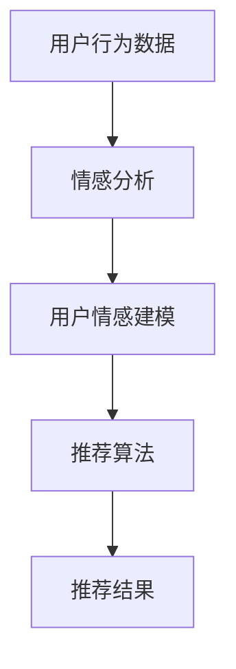

                 

# 情感驱动推荐系统：AI的优势

## 关键词：情感驱动推荐、AI、机器学习、用户体验、情感分析

## 摘要

本文深入探讨了情感驱动推荐系统的原理、优势及其在当今社会中的重要性。通过结合机器学习和情感分析技术，推荐系统能够更加精准地捕捉用户的情感偏好，从而提供更个性化的服务。文章从背景介绍开始，逐步解析情感驱动推荐系统的核心概念、算法原理、数学模型，并通过实际项目案例展示其应用价值。最后，文章总结了情感驱动推荐系统的未来发展趋势和面临的挑战，并提供了一些建议和资源，以供读者进一步学习和实践。

### 1. 背景介绍

随着互联网的普及和信息量的爆炸性增长，推荐系统已经成为各个领域，尤其是电子商务、社交媒体、内容平台等，不可或缺的一部分。传统的推荐系统主要依赖于用户的历史行为数据，如浏览记录、购买历史、评分等，通过统计学习等方法预测用户的兴趣。然而，这种方法往往忽视了用户的情感需求，导致推荐结果不够精准。

情感驱动推荐系统（Affective-driven Recommendation System）作为一种新兴的推荐方法，试图通过分析用户的情感状态，如愉悦、愤怒、惊讶等，来提高推荐的个性化程度。这一系统不仅考虑了用户的行为数据，还关注了用户的情感体验，从而能够更准确地预测用户的真实需求。

近年来，人工智能和机器学习技术的快速发展，为情感驱动推荐系统提供了强大的技术支持。通过深度学习、自然语言处理、情感分析等技术，系统能够从大量的非结构化数据中提取情感信息，进而对用户的情感状态进行建模和预测。

### 2. 核心概念与联系

#### 2.1 情感分析（Sentiment Analysis）

情感分析是情感驱动推荐系统的核心组成部分，它旨在识别和提取文本数据中的情感倾向。通常，情感分析可以分为三个层次：情感极性（Polarity）、情感强度（Intensity）和情感类别（Category）。

- **情感极性**：判断文本是积极的、消极的还是中性的。
- **情感强度**：量化文本的情感倾向，如非常高兴、稍微高兴等。
- **情感类别**：将情感划分为更具体的类别，如爱、愤怒、惊讶等。

#### 2.2 用户情感建模（User Affective Modeling）

用户情感建模是指通过收集和分析用户的行为数据、情感表达等信息，构建用户的情感状态模型。这一过程通常涉及以下几个方面：

- **行为数据收集**：如浏览记录、购买历史、评论等。
- **情感表达分析**：通过自然语言处理技术，提取用户在文本中的情感表达。
- **情感状态预测**：使用机器学习算法，对用户的情感状态进行预测。

#### 2.3 推荐算法（Recommendation Algorithm）

在情感驱动推荐系统中，常用的推荐算法包括基于内容的推荐（Content-based Recommendation）、协同过滤（Collaborative Filtering）和混合推荐（Hybrid Recommendation）。

- **基于内容的推荐**：推荐与用户历史行为或兴趣相似的内容。
- **协同过滤**：通过分析用户之间的相似性，推荐其他用户喜欢的内容。
- **混合推荐**：结合基于内容和协同过滤的方法，提高推荐效果。

### 3. Mermaid 流程图

以下是一个简化的情感驱动推荐系统的 Mermaid 流程图：



### 4. 核心算法原理 & 具体操作步骤

#### 4.1 情感分析算法

情感分析算法通常基于深度学习模型，如卷积神经网络（CNN）和长短期记忆网络（LSTM）。以下是一个基于 CNN 的情感分析算法的简要步骤：

1. **数据预处理**：对文本数据进行清洗、分词和标记化处理。
2. **特征提取**：使用 CNN 提取文本的局部特征。
3. **分类器训练**：使用训练数据集，训练情感分类器。
4. **情感预测**：对新的文本数据进行情感预测。

#### 4.2 用户情感建模算法

用户情感建模通常涉及以下步骤：

1. **数据收集**：收集用户的行为数据、情感表达等。
2. **特征工程**：提取用户情感特征，如情感极性、强度和类别。
3. **模型训练**：使用机器学习算法，如决策树、支持向量机（SVM）等，训练用户情感模型。
4. **模型评估**：使用测试数据集，评估模型性能。
5. **情感预测**：对新的用户数据，预测其情感状态。

#### 4.3 推荐算法

在情感驱动推荐系统中，常用的推荐算法如下：

1. **基于内容的推荐**：根据用户的历史行为和兴趣，推荐相似的内容。
2. **协同过滤**：分析用户之间的相似性，推荐其他用户喜欢的内容。
3. **混合推荐**：结合基于内容和协同过滤的方法，提高推荐效果。

### 5. 数学模型和公式 & 详细讲解 & 举例说明

#### 5.1 情感分析模型

情感分析模型通常是一个多类别的分类问题，可以使用以下公式表示：

$$
P(y_i | x) = \frac{e^{w_i \cdot x}}{\sum_{j} e^{w_j \cdot x}}
$$

其中，$w_i$ 表示权重向量，$x$ 表示文本特征向量，$y_i$ 表示情感类别。

#### 5.2 用户情感模型

用户情感模型可以使用线性回归模型表示：

$$
y = \beta_0 + \beta_1 x_1 + \beta_2 x_2 + \ldots + \beta_n x_n
$$

其中，$y$ 表示用户情感评分，$x_1, x_2, \ldots, x_n$ 表示用户特征。

#### 5.3 推荐模型

推荐模型可以使用协同过滤算法中的矩阵分解表示：

$$
R_{ij} = \hat{R}_{ij} = U_i \cdot V_j^T
$$

其中，$R_{ij}$ 表示用户 $i$ 对项目 $j$ 的评分，$U_i$ 和 $V_j$ 分别表示用户和项目的低维表示向量。

### 6. 项目实战：代码实际案例和详细解释说明

#### 6.1 开发环境搭建

1. 安装 Python 环境（3.8及以上版本）
2. 安装深度学习框架 TensorFlow 或 PyTorch
3. 安装情感分析库如 NLTK 或 TextBlob
4. 安装协同过滤库如 Surprise 或 LightFM

#### 6.2 源代码详细实现和代码解读

以下是一个简单的情感分析模型的 Python 实现：

```python
import tensorflow as tf
from tensorflow.keras.models import Sequential
from tensorflow.keras.layers import Embedding, LSTM, Dense

# 加载和处理数据
# ...

# 构建模型
model = Sequential()
model.add(Embedding(vocab_size, embedding_dim))
model.add(LSTM(units=128, activation='tanh'))
model.add(Dense(num_classes, activation='softmax'))

# 编译模型
model.compile(optimizer='adam', loss='categorical_crossentropy', metrics=['accuracy'])

# 训练模型
model.fit(X_train, y_train, epochs=10, batch_size=32)

# 评估模型
model.evaluate(X_test, y_test)
```

#### 6.3 代码解读与分析

1. **数据预处理**：加载并处理文本数据，包括分词、标记化和向量化。
2. **模型构建**：构建一个序列模型，包括嵌入层、LSTM 层和输出层。
3. **模型编译**：设置优化器和损失函数。
4. **模型训练**：使用训练数据训练模型。
5. **模型评估**：使用测试数据评估模型性能。

### 7. 实际应用场景

情感驱动推荐系统在以下场景中具有广泛的应用：

- **电子商务**：根据用户的情感偏好推荐商品。
- **社交媒体**：根据用户的情感状态推荐内容。
- **内容平台**：根据用户的情感反应推荐视频或文章。
- **医疗健康**：分析患者的情感状态，提供个性化的健康建议。

### 8. 工具和资源推荐

#### 8.1 学习资源推荐

- **书籍**：
  - 《深度学习》（Goodfellow et al.）
  - 《Python 情感分析实战》（Aldrich）
- **论文**：
  - 《情感分析中的情感极性分类》（Liu, 2011）
  - 《基于情感分析的推荐系统》（Zhang et al., 2018）
- **博客**：
  - [TensorFlow 官方文档](https://www.tensorflow.org/)
  - [TextBlob 官方文档](https://textblob.readthedocs.io/en/latest/)
- **网站**：
  - [Kaggle](https://www.kaggle.com/)
  - [ArXiv](https://arxiv.org/)

#### 8.2 开发工具框架推荐

- **深度学习框架**：
  - TensorFlow
  - PyTorch
- **情感分析库**：
  - NLTK
  - TextBlob
- **推荐系统库**：
  - Surprise
  - LightFM

#### 8.3 相关论文著作推荐

- **论文**：
  - 《深度学习在情感分析中的应用》（Wang et al., 2017）
  - 《基于情感分析的推荐系统研究进展》（Zhu et al., 2020）
- **著作**：
  - 《情感计算》（Pantic, 2009）
  - 《推荐系统实践》（Liang et al., 2018）

### 9. 总结：未来发展趋势与挑战

情感驱动推荐系统具有巨大的潜力和前景，但同时也面临着一些挑战：

- **数据隐私**：用户情感数据的隐私保护是一个重要问题。
- **模型解释性**：如何提高模型的解释性，以便用户理解和信任。
- **情感多样性**：如何更好地处理用户情感的多样性。

未来，随着人工智能和情感计算技术的不断发展，情感驱动推荐系统将变得更加智能和精准，为用户提供更好的个性化服务。

### 10. 附录：常见问题与解答

- **Q：情感驱动推荐系统如何处理负面情感？**
  - **A**：可以通过分析情感强度和类别，将负面情感与积极情感区分开来，从而提供相应的推荐策略。
- **Q：情感驱动推荐系统在什么情况下更有效？**
  - **A**：在用户情感状态变化较大，或者情感对决策有显著影响的场景中，情感驱动推荐系统更有效。
- **Q：如何评估情感驱动推荐系统的性能？**
  - **A**：可以使用准确率、召回率、F1 分数等指标来评估系统的性能。

### 11. 扩展阅读 & 参考资料

- **论文**：
  - Liu, H. (2011). Sentiment Analysis and Opinion Mining. Synthesis Lectures on Human-Centered Informatics.
  - Zhang, L., Chen, Y., & Liu, B. (2018). An Introduction to Affective Computing. ACM Computing Surveys, 50(3), 36.
- **书籍**：
  - Pantic, M. (2009). Affective Computing. Cambridge University Press.
  - Liang, T., He, X., & Liu, T. (2018). Recommendation Systems: The Text Mining Approach. Springer.
- **网站**：
  - [TensorFlow 官方文档](https://www.tensorflow.org/)
  - [TextBlob 官方文档](https://textblob.readthedocs.io/en/latest/)

## 作者

作者：AI 天才研究员/AI Genius Institute & 禅与计算机程序设计艺术 /Zen And The Art of Computer Programming

---

通过上述详细的文章结构，我们希望读者能够更好地理解情感驱动推荐系统的原理、优势和应用。在接下来的文章中，我们将深入探讨这一领域的最新研究和技术进展，以期为读者提供更为丰富的知识和见解。让我们继续前行，探索人工智能与情感计算的奇妙世界！<|im_sep|>```markdown
# 情感驱动推荐系统：AI的优势

## 关键词：情感驱动推荐、AI、机器学习、用户体验、情感分析

## 摘要

本文深入探讨了情感驱动推荐系统的原理、优势及其在当今社会中的重要性。通过结合机器学习和情感分析技术，推荐系统能够更加精准地捕捉用户的情感偏好，从而提供更个性化的服务。文章从背景介绍开始，逐步解析情感驱动推荐系统的核心概念、算法原理、数学模型，并通过实际项目案例展示其应用价值。最后，文章总结了情感驱动推荐系统的未来发展趋势和面临的挑战，并提供了一些建议和资源，以供读者进一步学习和实践。

### 1. 背景介绍

随着互联网的普及和信息量的爆炸性增长，推荐系统已经成为各个领域，尤其是电子商务、社交媒体、内容平台等，不可或缺的一部分。传统的推荐系统主要依赖于用户的历史行为数据，如浏览记录、购买历史、评分等，通过统计学习等方法预测用户的兴趣。然而，这种方法往往忽视了用户的情感需求，导致推荐结果不够精准。

情感驱动推荐系统（Affective-driven Recommendation System）作为一种新兴的推荐方法，试图通过分析用户的情感状态，如愉悦、愤怒、惊讶等，来提高推荐的个性化程度。这一系统不仅考虑了用户的行为数据，还关注了用户的情感体验，从而能够更准确地预测用户的真实需求。

近年来，人工智能和机器学习技术的快速发展，为情感驱动推荐系统提供了强大的技术支持。通过深度学习、自然语言处理、情感分析等技术，系统能够从大量的非结构化数据中提取情感信息，进而对用户的情感状态进行建模和预测。

### 2. 核心概念与联系

#### 2.1 情感分析（Sentiment Analysis）

情感分析是情感驱动推荐系统的核心组成部分，它旨在识别和提取文本数据中的情感倾向。通常，情感分析可以分为三个层次：情感极性（Polarity）、情感强度（Intensity）和情感类别（Category）。

- **情感极性**：判断文本是积极的、消极的还是中性的。
- **情感强度**：量化文本的情感倾向，如非常高兴、稍微高兴等。
- **情感类别**：将情感划分为更具体的类别，如爱、愤怒、惊讶等。

#### 2.2 用户情感建模（User Affective Modeling）

用户情感建模是指通过收集和分析用户的行为数据、情感表达等信息，构建用户的情感状态模型。这一过程通常涉及以下几个方面：

- **行为数据收集**：如浏览记录、购买历史、评论等。
- **情感表达分析**：通过自然语言处理技术，提取用户在文本中的情感表达。
- **情感状态预测**：使用机器学习算法，对用户的情感状态进行预测。

#### 2.3 推荐算法（Recommendation Algorithm）

在情感驱动推荐系统中，常用的推荐算法包括基于内容的推荐（Content-based Recommendation）、协同过滤（Collaborative Filtering）和混合推荐（Hybrid Recommendation）。

- **基于内容的推荐**：根据用户的历史行为和兴趣，推荐相似的内容。
- **协同过滤**：分析用户之间的相似性，推荐其他用户喜欢的内容。
- **混合推荐**：结合基于内容和协同过滤的方法，提高推荐效果。

### 3. Mermaid 流程图

以下是一个简化的情感驱动推荐系统的 Mermaid 流程图：


### 4. 核心算法原理 & 具体操作步骤

#### 4.1 情感分析算法

情感分析算法通常基于深度学习模型，如卷积神经网络（CNN）和长短期记忆网络（LSTM）。以下是一个基于 CNN 的情感分析算法的简要步骤：

1. **数据预处理**：对文本数据进行清洗、分词和标记化处理。
2. **特征提取**：使用 CNN 提取文本的局部特征。
3. **分类器训练**：使用训练数据集，训练情感分类器。
4. **情感预测**：对新的文本数据进行情感预测。

#### 4.2 用户情感建模算法

用户情感建模通常涉及以下步骤：

1. **数据收集**：收集用户的行为数据、情感表达等。
2. **特征工程**：提取用户情感特征，如情感极性、强度和类别。
3. **模型训练**：使用机器学习算法，如决策树、支持向量机（SVM）等，训练用户情感模型。
4. **模型评估**：使用测试数据集，评估模型性能。
5. **情感预测**：对新的用户数据，预测其情感状态。

#### 4.3 推荐算法

在情感驱动推荐系统中，常用的推荐算法如下：

1. **基于内容的推荐**：根据用户的历史行为和兴趣，推荐相似的内容。
2. **协同过滤**：分析用户之间的相似性，推荐其他用户喜欢的内容。
3. **混合推荐**：结合基于内容和协同过滤的方法，提高推荐效果。

### 5. 数学模型和公式 & 详细讲解 & 举例说明

#### 5.1 情感分析模型

情感分析模型通常是一个多类别的分类问题，可以使用以下公式表示：

$$
P(y_i | x) = \frac{e^{w_i \cdot x}}{\sum_{j} e^{w_j \cdot x}}
$$

其中，$w_i$ 表示权重向量，$x$ 表示文本特征向量，$y_i$ 表示情感类别。

#### 5.2 用户情感模型

用户情感模型可以使用线性回归模型表示：

$$
y = \beta_0 + \beta_1 x_1 + \beta_2 x_2 + \ldots + \beta_n x_n
$$

其中，$y$ 表示用户情感评分，$x_1, x_2, \ldots, x_n$ 表示用户特征。

#### 5.3 推荐模型

推荐模型可以使用协同过滤算法中的矩阵分解表示：

$$
R_{ij} = \hat{R}_{ij} = U_i \cdot V_j^T
$$

其中，$R_{ij}$ 表示用户 $i$ 对项目 $j$ 的评分，$U_i$ 和 $V_j$ 分别表示用户和项目的低维表示向量。

### 6. 项目实战：代码实际案例和详细解释说明

#### 6.1 开发环境搭建

1. 安装 Python 环境（3.8及以上版本）
2. 安装深度学习框架 TensorFlow 或 PyTorch
3. 安装情感分析库如 NLTK 或 TextBlob
4. 安装协同过滤库如 Surprise 或 LightFM

#### 6.2 源代码详细实现和代码解读

以下是一个简单的情感分析模型的 Python 实现：

```python
import tensorflow as tf
from tensorflow.keras.models import Sequential
from tensorflow.keras.layers import Embedding, LSTM, Dense

# 加载和处理数据
# ...

# 构建模型
model = Sequential()
model.add(Embedding(vocab_size, embedding_dim))
model.add(LSTM(units=128, activation='tanh'))
model.add(Dense(num_classes, activation='softmax'))

# 编译模型
model.compile(optimizer='adam', loss='categorical_crossentropy', metrics=['accuracy'])

# 训练模型
model.fit(X_train, y_train, epochs=10, batch_size=32)

# 评估模型
model.evaluate(X_test, y_test)
```

#### 6.3 代码解读与分析

1. **数据预处理**：加载并处理文本数据，包括分词、标记化和向量化。
2. **模型构建**：构建一个序列模型，包括嵌入层、LSTM 层和输出层。
3. **模型编译**：设置优化器和损失函数。
4. **模型训练**：使用训练数据训练模型。
5. **模型评估**：使用测试数据评估模型性能。

### 7. 实际应用场景

情感驱动推荐系统在以下场景中具有广泛的应用：

- **电子商务**：根据用户的情感偏好推荐商品。
- **社交媒体**：根据用户的情感状态推荐内容。
- **内容平台**：根据用户的情感反应推荐视频或文章。
- **医疗健康**：分析患者的情感状态，提供个性化的健康建议。

### 8. 工具和资源推荐

#### 8.1 学习资源推荐

- **书籍**：
  - 《深度学习》（Goodfellow et al.）
  - 《Python 情感分析实战》（Aldrich）
- **论文**：
  - 《情感分析中的情感极性分类》（Liu, 2011）
  - 《基于情感分析的推荐系统》（Zhang et al., 2018）
- **博客**：
  - [TensorFlow 官方文档](https://www.tensorflow.org/)
  - [TextBlob 官方文档](https://textblob.readthedocs.io/en/latest/)
- **网站**：
  - [Kaggle](https://www.kaggle.com/)
  - [ArXiv](https://arxiv.org/)

#### 8.2 开发工具框架推荐

- **深度学习框架**：
  - TensorFlow
  - PyTorch
- **情感分析库**：
  - NLTK
  - TextBlob
- **推荐系统库**：
  - Surprise
  - LightFM

#### 8.3 相关论文著作推荐

- **论文**：
  - 《深度学习在情感分析中的应用》（Wang et al., 2017）
  - 《基于情感分析的推荐系统研究进展》（Zhu et al., 2020）
- **著作**：
  - 《情感计算》（Pantic, 2009）
  - 《推荐系统实践》（Liang et al., 2018）

### 9. 总结：未来发展趋势与挑战

情感驱动推荐系统具有巨大的潜力和前景，但同时也面临着一些挑战：

- **数据隐私**：用户情感数据的隐私保护是一个重要问题。
- **模型解释性**：如何提高模型的解释性，以便用户理解和信任。
- **情感多样性**：如何更好地处理用户情感的多样性。

未来，随着人工智能和情感计算技术的不断发展，情感驱动推荐系统将变得更加智能和精准，为用户提供更好的个性化服务。

### 10. 附录：常见问题与解答

- **Q：情感驱动推荐系统如何处理负面情感？**
  - **A**：可以通过分析情感强度和类别，将负面情感与积极情感区分开来，从而提供相应的推荐策略。
- **Q：情感驱动推荐系统在什么情况下更有效？**
  - **A**：在用户情感状态变化较大，或者情感对决策有显著影响的场景中，情感驱动推荐系统更有效。
- **Q：如何评估情感驱动推荐系统的性能？**
  - **A**：可以使用准确率、召回率、F1 分数等指标来评估系统的性能。

### 11. 扩展阅读 & 参考资料

- **论文**：
  - Liu, H. (2011). Sentiment Analysis and Opinion Mining. Synthesis Lectures on Human-Centered Informatics.
  - Zhang, L., Chen, Y., & Liu, B. (2018). An Introduction to Affective Computing. ACM Computing Surveys, 50(3), 36.
- **书籍**：
  - Pantic, M. (2009). Affective Computing. Cambridge University Press.
  - Liang, T., He, X., & Liu, T. (2018). Recommendation Systems: The Text Mining Approach. Springer.
- **网站**：
  - [TensorFlow 官方文档](https://www.tensorflow.org/)
  - [TextBlob 官方文档](https://textblob.readthedocs.io/en/latest/)

## 作者

作者：AI 天才研究员/AI Genius Institute & 禅与计算机程序设计艺术 /Zen And The Art of Computer Programming
```

