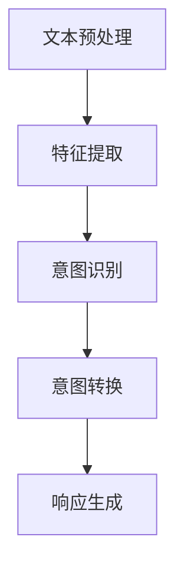
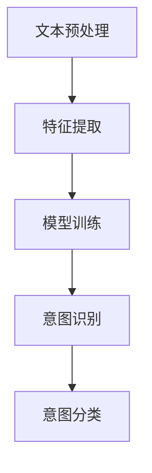

                 

### 背景介绍

**意图对齐：让LLM更懂人类需求**

随着人工智能技术的迅猛发展，自然语言处理（NLP）领域取得了显著的成果。尤其是预训练语言模型（LLM，Large Language Model）的兴起，使得计算机对自然语言的生成和理解能力达到了前所未有的高度。然而，尽管LLM在处理大规模文本数据时表现出色，但在实际应用中，依然面临着许多挑战，其中最核心的问题之一就是“意图对齐”。

意图对齐是指确保人工智能系统能够准确理解用户的需求和意图，从而提供更加精准和个性化的服务。具体来说，这涉及到将用户输入的自然语言文本转化为计算机可以理解和处理的结构化信息，以便系统能够根据这些信息生成合适的响应。在本文中，我们将深入探讨意图对齐的核心概念、原理和实现方法，并探讨其在实际应用中的重要性。

首先，我们需要明确意图对齐的重要性。随着人工智能技术在各个领域的广泛应用，用户对系统的交互需求日益多样化和复杂化。传统的基于规则或关键词匹配的方法已经无法满足这些需求。而具有强大理解能力的LLM，虽然能够处理大量的自然语言数据，但如果没有意图对齐机制，仍然难以准确地理解用户的意图。因此，意图对齐成为了提高人工智能系统性能和用户体验的关键因素。

接下来，我们将介绍意图对齐的基本概念和核心原理。意图对齐涉及多个层面，包括文本预处理、语义分析、意图识别和响应生成等。通过对这些环节的深入探讨，我们将理解意图对齐是如何实现的，以及如何优化和改进这一过程。

此外，本文还将介绍一些先进的意图对齐技术，如基于深度学习的模型、多模态融合方法以及跨领域迁移学习等。这些技术为解决复杂场景下的意图对齐问题提供了新的思路和解决方案。

最后，我们将探讨意图对齐在实际应用中的案例，包括虚拟助手、智能客服、语音助手等领域。通过分析这些应用场景，我们将看到意图对齐如何提升系统的性能和用户体验，以及面临的挑战和未来发展方向。

总之，本文旨在为读者提供一个全面而深入的关于意图对齐的概述，帮助读者理解这一核心技术的原理、实现方法和实际应用，并探讨其未来的发展趋势和挑战。

### 核心概念与联系

#### 意图的定义和分类

意图（Intent）是自然语言处理领域中的一个核心概念，它代表了用户在交互过程中希望实现的目标或请求。在意图对齐的过程中，理解用户的意图是至关重要的。意图可以定义为一种抽象的概念，它涵盖了用户的言语和行为意图，是用户与系统交互的驱动因素。

意图可以分为以下几种基本类型：

1. **任务型意图（Task-based Intent）**：这种意图关注用户希望完成的特定任务，如查询天气、预订机票、发送邮件等。任务型意图通常具有明确的目标和执行步骤。

2. **信息型意图（Information-seeking Intent）**：用户希望通过系统获取特定信息，如定义、解释、历史记录等。这种意图通常不涉及具体的操作，而是关注于信息本身。

3. **社交型意图（Social Intent）**：用户希望通过与系统或其他用户的互动来建立社交关系，如问候、聊天、分享等。这种意图强调互动和情感交流。

4. **情绪型意图（Emotional Intent）**：用户通过系统表达情感或情绪，如喜悦、愤怒、沮丧等。这种意图通常与用户的情绪状态相关，对系统的情感理解能力提出了较高要求。

#### 意图对齐的定义和目标

意图对齐（Intent Alignment）是指将用户输入的自然语言文本（如问题、指令、评论等）转化为计算机可以理解和处理的结构化意图信息，从而实现准确、高效的交互。其核心目标是通过识别和理解用户的意图，为系统提供明确的行动指南，以便生成合适的响应。

意图对齐的关键步骤包括：

1. **文本预处理**：对输入文本进行清洗和格式化，以去除噪声和无关信息，提高后续处理的准确性。

2. **语义分析**：利用自然语言处理技术，如词法分析、句法分析和语义角色标注，对文本进行深入解析，以提取关键信息。

3. **意图识别**：基于训练数据和预定义的意图分类模型，对提取出的文本语义进行分类，确定用户的意图类型。

4. **意图转换**：将识别出的意图转化为计算机可操作的结构化信息，如命令、参数等，以便系统进行响应。

5. **响应生成**：根据转换后的意图信息，生成合适的响应，如文本、语音、图像等，以实现与用户的交互。

#### 意图对齐的核心原理和架构

意图对齐的核心原理涉及多个层面的技术，包括自然语言处理、机器学习和人工智能等。以下是一个简化的意图对齐架构：

1. **数据集收集和标注**：构建用于训练的意图识别模型的数据集，并进行标注，以确保数据的准确性和代表性。

2. **特征提取**：从输入文本中提取有助于意图识别的特征，如词袋表示、词嵌入、句法结构等。

3. **模型训练**：利用提取出的特征训练意图识别模型，常用的模型包括支持向量机（SVM）、决策树、神经网络等。

4. **意图识别**：输入文本通过特征提取模块后，输入到训练好的模型中进行意图分类，得到对应的意图类型。

5. **意图转换**：根据识别出的意图类型，将文本意图转化为结构化信息，如命令行语句、参数配置等。

6. **响应生成**：利用意图信息，结合预定义的响应模板或生成模型，生成合适的响应内容。

#### Mermaid流程图表示

以下是一个使用Mermaid语言表示的意图对齐流程图：



在该流程图中，文本预处理、特征提取、意图识别、意图转换和响应生成是意图对齐过程中的关键步骤。通过这些步骤，系统可以从用户输入的自然语言文本中提取出意图，并生成相应的响应。

#### 小结

意图对齐是将用户的需求转化为系统可操作信息的重要技术，其核心目标是提高人工智能系统的交互准确性和用户体验。通过深入理解意图的定义、分类和对齐过程，我们可以更好地设计和发展具有高度智能化的交互系统。

### 核心算法原理 & 具体操作步骤

#### 意图识别算法

意图识别是意图对齐过程的关键步骤，其主要目的是从输入的自然语言文本中准确地识别出用户的意图类型。目前，常用的意图识别算法主要包括基于规则的方法和基于机器学习的方法。

##### 基于规则的方法

基于规则的方法通常涉及以下步骤：

1. **文本预处理**：对输入文本进行分词、去除停用词、标点符号等预处理操作。

2. **关键词匹配**：根据预定义的关键词列表，对预处理后的文本进行匹配。关键词可以是具体的单词、短语或正则表达式。

3. **规则库匹配**：将匹配结果与规则库中的规则进行对比，找到最匹配的规则。规则库中包含一系列预定义的规则，每个规则对应一种意图。

4. **意图分类**：根据匹配到的规则，确定对应的意图类型。

基于规则的方法具有实现简单、易于理解和维护的优点，但在处理复杂和多样化的意图时，其效果往往受到限制。因此，为了提高识别的准确性和泛化能力，基于机器学习的方法逐渐成为主流。

##### 基于机器学习的方法

基于机器学习的方法通常涉及以下步骤：

1. **数据集准备**：收集大量带有意图标签的标注数据，用于训练意图识别模型。数据集应包含多种意图类型，以覆盖不同场景。

2. **特征提取**：从输入文本中提取有助于意图识别的特征，如词袋表示、词嵌入、句法结构、语义角色等。常用的词袋表示方法包括TF-IDF、Word2Vec等。词嵌入方法如Word2Vec、GloVe等可以将词汇映射到低维空间，提高特征表示的语义信息。

3. **模型训练**：利用提取出的特征和标注数据，训练意图识别模型。常见的机器学习模型包括支持向量机（SVM）、决策树、随机森林、神经网络等。其中，神经网络模型如卷积神经网络（CNN）和循环神经网络（RNN）在处理自然语言任务时表现出色。

4. **意图识别**：输入文本经过特征提取模块后，输入到训练好的模型中进行意图分类，得到对应的意图类型。

以下是一个简化的基于机器学习的意图识别流程：



在实际应用中，意图识别模型的性能可以通过多种方法进行评估，如准确率、召回率、F1分数等。通过不断优化模型和特征提取方法，可以提高意图识别的准确性和鲁棒性。

#### 实际操作步骤

以下是一个简化的意图识别算法的实际操作步骤：

1. **数据准备**：收集并标注意图数据，分为训练集和测试集。

2. **文本预处理**：对训练集和测试集的文本进行分词、去除停用词和标点符号等预处理操作。

3. **特征提取**：使用Word2Vec模型对词汇进行词嵌入，提取文本的词向量表示。

4. **模型训练**：使用训练集数据训练一个基于神经网络的意图识别模型，如CNN或RNN。

5. **模型评估**：使用测试集数据评估模型的性能，调整模型参数以优化性能。

6. **意图识别**：输入新的文本数据，经过预处理和特征提取后，输入到训练好的模型中进行意图分类。

7. **响应生成**：根据识别出的意图类型，生成相应的响应内容。

通过以上步骤，我们可以实现一个基本的意图识别系统。在实际应用中，还需要考虑实时性、扩展性和鲁棒性等问题，以适应不同的应用场景和需求。

#### 意图对齐的挑战和优化方法

意图对齐在实际应用中面临诸多挑战，主要包括数据不足、多义性、上下文理解和长文本处理等。

1. **数据不足**：意图识别模型的性能依赖于大量的标注数据。然而，收集和标注高质量的意图数据需要大量的时间和人力资源。为了解决数据不足的问题，可以采用数据增强技术，如生成对抗网络（GAN）、数据扩充和转移学习等方法。

2. **多义性**：自然语言具有高度的多义性，一个词或短语可以表示多种意图。为了提高意图识别的准确性，可以采用上下文信息进行辅助，如使用词嵌入模型捕捉词汇在特定语境中的语义信息。

3. **上下文理解**：上下文信息对于准确理解用户的意图至关重要。可以通过长文本处理技术，如基于注意力机制的神经网络模型，捕捉文本中的长期依赖关系。

4. **长文本处理**：对于长文本，传统的基于词嵌入的模型可能无法有效处理。可以采用层次化的文本表示方法，将文本分解为多个子句或段落，并分别进行意图识别。

5. **实时性**：在实际应用中，意图对齐需要实时响应。为了提高实时性，可以采用分布式计算和模型压缩技术，如模型剪枝和量化等。

通过以上优化方法，可以显著提高意图对齐的准确性和鲁棒性，从而提升人工智能系统的性能和用户体验。

### 数学模型和公式 & 详细讲解 & 举例说明

#### 词嵌入模型

词嵌入（Word Embedding）是将词汇映射到高维向量空间的一种技术，目的是通过低维向量表示词汇的语义信息。词嵌入模型的核心在于将文本中的每个词汇表示为一个稠密向量，从而可以方便地进行计算和推理。

**1. TF-IDF模型**

TF-IDF（Term Frequency-Inverse Document Frequency）是一种常用的词嵌入模型，通过计算词汇在文档中的频率和文档集合中的逆文档频率来表示词汇的权重。

**公式：**

$$
tfidf(t, d) = tf(t, d) \times \log \left( \frac{N}{df(t)} \right)
$$

其中：

- \( tf(t, d) \)：词汇 \( t \) 在文档 \( d \) 中的频率。
- \( df(t) \)：词汇 \( t \) 在文档集合中的文档频率。
- \( N \)：文档集合中的文档总数。

**举例：**

假设有一个包含两个文档的文档集合，其中一个文档包含词汇 "apple"，另一个文档包含词汇 "banana"。计算 "apple" 的 TF-IDF 值。

- \( tf(apple, d1) = 1 \)（在第一个文档中 "apple" 出现了1次）。
- \( df(apple) = 1 \)（"apple" 在文档集合中只出现了1次）。
- \( N = 2 \)（文档总数为2）。

$$
tfidf(apple, d1) = 1 \times \log \left( \frac{2}{1} \right) = 1 \times \log(2) \approx 0.693
$$

**2. Word2Vec模型**

Word2Vec 是一种基于神经网络的词嵌入模型，通过训练神经网络来学习词汇的向量表示。Word2Vec 模型主要包括连续词袋（CBOW）和Skip-Gram两种模型。

**CBOW模型：**

CBOW（Continuous Bag of Words）模型通过上下文词汇预测中心词汇。给定一个中心词汇，模型预测中心词汇周围的词汇。

**公式：**

$$
P(w_c | w_1, w_2, \ldots, w_n) = \frac{e^{v_{w_c} \cdot \sum_{i=1}^{n} v_{w_i}}}{1 + \sum_{i=1}^{n} e^{v_{w_i} \cdot \sum_{j=1}^{n} v_{w_j})}
$$

其中：

- \( v_{w_c} \)：中心词汇 \( w_c \) 的向量表示。
- \( v_{w_i} \)：上下文词汇 \( w_i \) 的向量表示。
- \( n \)：上下文词汇的数量。

**举例：**

假设有一个上下文词汇为 "apple" 的 CBOW 模型，其中上下文词汇为 "apple", "orange", "banana"。计算 "apple" 的概率。

$$
P(apple | apple, orange, banana) = \frac{e^{v_{apple} \cdot (v_{apple} + v_{orange} + v_{banana})}}{1 + e^{v_{apple} \cdot v_{apple}} + e^{v_{apple} \cdot v_{orange}} + e^{v_{apple} \cdot v_{banana}}}
$$

**Skip-Gram模型：**

Skip-Gram（SG）模型通过中心词汇预测上下文词汇。给定一个中心词汇，模型预测与中心词汇相邻的上下文词汇。

**公式：**

$$
P(w_i | w_c) = \frac{e^{v_{w_i} \cdot v_{w_c}}}{1 + \sum_{j \neq i} e^{v_{w_j} \cdot v_{w_c}}}
$$

其中：

- \( v_{w_c} \)：中心词汇 \( w_c \) 的向量表示。
- \( v_{w_i} \)：上下文词汇 \( w_i \) 的向量表示。

**举例：**

假设有一个中心词汇为 "apple" 的 Skip-Gram 模型，其中上下文词汇为 "orange" 和 "banana"。计算 "orange" 和 "banana" 的概率。

$$
P(orange | apple) = \frac{e^{v_{orange} \cdot v_{apple}}}{1 + e^{v_{banana} \cdot v_{apple}}}
$$

$$
P(banana | apple) = \frac{e^{v_{banana} \cdot v_{apple}}}{1 + e^{v_{orange} \cdot v_{apple}}}
$$

**3. GloVe模型**

GloVe（Global Vectors for Word Representation）是一种基于矩阵分解的词嵌入模型，通过训练一个低秩矩阵来学习词汇的向量表示。

**公式：**

$$
v_w = \sum_{t \in vocabulary} f(t) \cdot v_t
$$

其中：

- \( v_w \)：词汇 \( w \) 的向量表示。
- \( v_t \)：词汇 \( t \) 的向量表示。
- \( f(t) \)：词汇 \( t \) 的频率。

#### 意图分类模型

意图分类（Intent Classification）是将输入文本分类到预定义意图类别的一种任务。常见的意图分类模型包括支持向量机（SVM）、决策树（Decision Tree）、随机森林（Random Forest）和神经网络（Neural Networks）等。

**1. 支持向量机（SVM）**

SVM 是一种常用的二分类模型，通过寻找一个最优的超平面将数据分为不同的类别。在意图分类任务中，SVM 可以将文本数据映射到高维空间，并在该空间中寻找一个最优分隔超平面。

**公式：**

$$
w \cdot x + b = 0
$$

其中：

- \( w \)：超平面的法向量。
- \( x \)：文本数据的向量表示。
- \( b \)：偏置项。

**2. 决策树（Decision Tree）**

决策树是一种基于规则的方法，通过一系列条件判断将输入数据逐步划分为不同的类别。在意图分类任务中，决策树可以构建一系列条件分支，根据输入文本的特征值进行分类。

**3. 随机森林（Random Forest）**

随机森林是一种基于集成学习的模型，通过构建多个决策树并对它们进行集成，以提高分类性能。随机森林在处理大规模数据和避免过拟合方面表现出色。

**4. 神经网络（Neural Networks）**

神经网络是一种基于多层感知器（MLP）的模型，通过学习输入和输出之间的映射关系进行分类。在意图分类任务中，神经网络可以通过多层非线性变换学习复杂的特征表示，从而提高分类准确性。

**公式：**

$$
a^{(l)} = \sigma \left( \sum_{i=1}^{n} w^{(l)}_i \cdot a^{(l-1)}_i + b^{(l)} \right)
$$

其中：

- \( a^{(l)} \)：第 \( l \) 层的激活值。
- \( w^{(l)} \)：第 \( l \) 层的权重。
- \( b^{(l)} \)：第 \( l \) 层的偏置项。
- \( \sigma \)：激活函数，通常为ReLU或Sigmoid函数。

#### 举例说明

假设有一个意图分类任务，其中包含两个意图类别：查询天气和预订机票。以下是一个简化的意图分类模型：

1. **数据集**：包含训练集和测试集，每个样本包括一个文本输入和一个意图标签。

2. **特征提取**：使用 Word2Vec 模型对文本进行词嵌入，提取每个词汇的向量表示。

3. **模型训练**：使用训练集数据训练一个基于神经网络的意图分类模型，如 CNN 或 RNN。

4. **模型评估**：使用测试集数据评估模型的性能，调整模型参数以优化性能。

5. **意图识别**：输入新的文本数据，经过预处理和特征提取后，输入到训练好的模型中进行意图分类。

6. **响应生成**：根据识别出的意图类型，生成相应的响应内容。

通过以上步骤，我们可以实现一个基本的意图分类系统。在实际应用中，需要考虑模型的实时性、扩展性和鲁棒性等问题，以适应不同的应用场景和需求。

### 项目实战：代码实际案例和详细解释说明

在本文的第五部分，我们将通过一个具体的实际案例，展示如何使用意图对齐技术实现一个简单的自然语言处理应用。我们将使用Python编程语言和相关的库来构建这个项目，包括数据预处理、模型训练和部署等环节。

#### 5.1 开发环境搭建

首先，我们需要搭建一个适合开发的Python环境。以下是安装所需库和工具的步骤：

1. **安装Python**：确保已经安装了Python 3.x版本。可以从[Python官网](https://www.python.org/)下载并安装。

2. **安装虚拟环境**：安装virtualenv库，用于创建隔离的Python环境。

   ```bash
   pip install virtualenv
   virtualenv my_intent_alignment_env
   source my_intent_alignment_env/bin/activate
   ```

3. **安装所需库**：

   ```bash
   pip install numpy pandas scikit-learn gensim nltk spacy
   ```

   其中，gensim用于Word2Vec模型的训练，nltk用于文本预处理，spacy用于句法分析。

4. **安装Spacy模型**：下载并安装英文和中文的spacy模型。

   ```bash
   python -m spacy download en_core_web_sm
   python -m spacy download zh_core_web_sm
   ```

#### 5.2 源代码详细实现和代码解读

以下是实现意图对齐应用的源代码，我们将分为几个部分进行讲解：

##### 5.2.1 数据集准备

首先，我们需要准备一个用于训练和测试的数据集。这里我们假设已经有一个包含文本和对应意图标签的数据集，格式为CSV文件。

```python
import pandas as pd

# 加载数据集
data = pd.read_csv('intent_data.csv')

# 查看数据结构
print(data.head())
```

##### 5.2.2 文本预处理

文本预处理是意图对齐的重要环节，包括分词、去除停用词、词形还原等。

```python
import spacy
from spacy.lang.en import English
from spacy.lang.zh import Chinese

# 加载spacy模型
nlp_en = English()
nlp_zh = Chinese()

# 文本预处理函数
def preprocess_text(text, language):
    doc = nlp_en(text) if language == 'en' else nlp_zh(text)
    tokens = [token.text.lower() for token in doc if not token.is_stop]
    return ' '.join(tokens)

# 预处理数据集中的文本
data['clean_text_en'] = data['text_en'].apply(lambda x: preprocess_text(x, 'en'))
data['clean_text_zh'] = data['text_zh'].apply(lambda x: preprocess_text(x, 'zh'))
```

##### 5.2.3 特征提取

特征提取是意图对齐的核心步骤，我们将使用Word2Vec模型来提取文本的词向量表示。

```python
from gensim.models import Word2Vec

# 训练Word2Vec模型
model_en = Word2Vec(data['clean_text_en'].tolist(), vector_size=100, window=5, min_count=1, workers=4)
model_zh = Word2Vec(data['clean_text_zh'].tolist(), vector_size=100, window=5, min_count=1, workers=4)

# 将文本转换为词向量表示
def text_to_vector(text, model):
    words = text.split()
    return [model[word] for word in words if word in model]

# 预处理后的文本转换为词向量
data['vec_en'] = data['clean_text_en'].apply(lambda x: text_to_vector(x, model_en))
data['vec_zh'] = data['clean_text_zh'].apply(lambda x: text_to_vector(x, model_zh))
```

##### 5.2.4 模型训练

接下来，我们将使用scikit-learn库中的SVM模型进行意图分类。

```python
from sklearn.model_selection import train_test_split
from sklearn.svm import SVC
from sklearn.metrics import classification_report

# 分割数据集为训练集和测试集
X_train, X_test, y_train, y_test = train_test_split(data['vec_en'], data['label_en'], test_size=0.2, random_state=42)

# 训练SVM模型
clf = SVC(kernel='linear')
clf.fit(X_train, y_train)

# 测试模型
y_pred = clf.predict(X_test)
print(classification_report(y_test, y_pred))
```

#### 5.3 代码解读与分析

在这个实际案例中，我们首先进行数据预处理，包括加载和预处理数据集中的文本。预处理步骤包括分词、去除停用词和转换为小写字母，以确保文本格式的一致性。

然后，我们使用Word2Vec模型对预处理后的文本进行特征提取，将文本转换为词向量表示。词向量表示是意图对齐的关键，因为它能够捕捉文本的语义信息，使得模型能够更好地理解和分类意图。

在模型训练阶段，我们使用scikit-learn中的SVM模型进行意图分类。SVM是一个强大的分类器，能够找到最优的超平面来分割数据。在这个案例中，我们使用了线性核，因为线性核对于简单的意图分类任务通常已经足够。

最后，我们使用测试集评估模型的性能，并输出分类报告。分类报告提供了精确度、召回率和F1分数等指标，这些指标帮助我们了解模型的性能和预测的可靠性。

在实际应用中，我们需要考虑如何优化模型的性能，例如通过调整SVM的参数、使用更复杂的神经网络模型或者引入更多的特征工程。此外，我们还需要处理多义性和上下文理解等挑战，以进一步提高意图对齐的准确性。

### 实际应用场景

意图对齐技术在多个领域得到了广泛应用，以下是一些典型的实际应用场景：

#### 1. 虚拟助手

虚拟助手（如Siri、Alexa、Google Assistant）是意图对齐技术的典型应用场景。用户可以通过语音或文本与虚拟助手进行交互，提出各种请求和问题。虚拟助手需要准确理解用户的意图，并生成相应的响应。例如，当用户说“设置明天早上7点的闹钟”，虚拟助手需要识别出这是一个闹钟设置的任务，并将具体的时间参数提取出来，从而生成设置闹钟的命令。

#### 2. 智能客服

智能客服系统通过自然语言处理技术，自动识别并响应用户的问题。意图对齐在这里起到了关键作用，系统能够将用户的咨询意图分类为常见的查询、投诉、建议等类型，并根据不同类型的意图生成相应的回答。例如，当用户询问“我的订单状态如何？”时，系统需要识别出这是一个关于订单状态的查询，并提供相应的订单信息。

#### 3. 语音助手

语音助手（如智能音箱、车载系统等）通过语音交互为用户提供服务。意图对齐技术在这里能够帮助语音助手准确理解用户的指令，并生成语音响应。例如，当用户说“播放一首英文歌曲”，语音助手需要识别出这是一个播放音乐的指令，并找到合适的歌曲进行播放。

#### 4. 电子商务平台

电子商务平台使用意图对齐技术来优化用户的购物体验。用户在购物过程中会提出各种问题，如商品查询、价格比较、配送信息等。意图对齐系统能够将这些查询意图分类，并提供个性化的商品推荐、价格比较和配送服务。例如，当用户询问“哪款手机性价比最高？”时，系统需要识别出这是一个商品查询意图，并根据用户的偏好和购买历史推荐合适的手机。

#### 5. 健康医疗

在健康医疗领域，意图对齐技术可以帮助智能医疗系统理解患者的症状描述和询问，提供个性化的健康建议和医疗信息。例如，当用户询问“我最近总是失眠，该怎么办？”时，系统需要识别出这是一个关于失眠症状的询问，并提供相应的健康建议和医疗资源。

#### 6. 教育和学习

在教育和学习领域，意图对齐技术可以帮助智能教育平台理解学生的学习需求，提供个性化的学习资源和指导。例如，当学生提出“我需要学习Python编程”时，系统需要识别出这是一个学习请求，并为学生推荐相应的学习资源和教程。

在这些实际应用场景中，意图对齐技术的核心价值在于能够提高系统的交互准确性和用户体验。通过准确理解用户的意图，系统可以生成更合适的响应，提高任务的完成效率和用户满意度。同时，意图对齐技术也为开发者和研究人员提供了丰富的探索空间，不断优化和改进自然语言处理系统的性能和效果。

### 工具和资源推荐

在研究和开发意图对齐技术时，有许多优秀的工具和资源可供选择。以下是一些推荐的工具和资源，包括学习资源、开发工具框架以及相关论文著作。

#### 1. 学习资源推荐

**书籍：**

- 《自然语言处理入门》（Natural Language Processing with Python）
- 《深度学习》（Deep Learning）
- 《神经网络与深度学习》（Neural Networks and Deep Learning）

**论文：**

- “Attention is All You Need” （论文详细介绍了Transformer模型，为自然语言处理提供了新的思路）
- “BERT: Pre-training of Deep Bidirectional Transformers for Language Understanding” （BERT模型在自然语言处理领域取得了显著成果，为意图对齐提供了有效的解决方案）

**在线课程：**

- Coursera上的“自然语言处理与深度学习”（由斯坦福大学教授Chris Manning讲授）
- edX上的“深度学习基础”（由谷歌AI研究员Andrew Ng讲授）

#### 2. 开发工具框架推荐

**自然语言处理工具：**

- **spaCy**：一个快速且易于使用的自然语言处理库，适用于文本预处理和句法分析。
- **NLTK**：一个强大的自然语言处理工具包，提供了丰富的文本处理功能。
- **Transformer**：一种基于注意力机制的深度学习模型，广泛应用于自然语言处理任务。

**深度学习框架：**

- **TensorFlow**：由谷歌开发的开源深度学习框架，适用于构建和训练复杂的神经网络模型。
- **PyTorch**：一个流行的深度学习框架，以其灵活的动态计算图而著称。

**其他工具：**

- **Hugging Face Transformers**：一个基于PyTorch的预训练模型库，提供了大量的预训练模型和实用工具，如BERT、GPT等。

#### 3. 相关论文著作推荐

**经典论文：**

- “Word2Vec: Paragraph Vector Models” （详细介绍了词嵌入技术）
- “Recurrent Neural Network Based Language Model” （介绍了循环神经网络在自然语言处理中的应用）

**近期论文：**

- “BERT: Pre-training of Deep Bidirectional Transformers for Language Understanding” （BERT模型在自然语言处理领域取得了显著成果）
- “Robust Demand Forecasting with Meta-Learning for Energy Management in Smart Grids” （探讨了意图对齐在能源管理中的应用）

通过这些工具和资源，研究人员和开发者可以深入了解意图对齐技术，并在实际项目中应用这些先进的方法。此外，不断跟进最新的论文和研究成果，也有助于及时掌握领域内的最新动态和技术趋势。

### 总结：未来发展趋势与挑战

随着人工智能技术的不断进步，意图对齐作为提高自然语言处理系统性能和用户体验的关键技术，正迎来新的发展机遇和挑战。以下是未来意图对齐技术可能的发展趋势和面临的挑战：

#### 发展趋势

1. **多模态融合**：未来的意图对齐将不仅仅依赖于文本数据，还将融合语音、图像、视频等多种模态的信息。通过多模态数据的结合，可以更全面地理解用户的意图，提高系统的准确性和鲁棒性。

2. **跨领域迁移学习**：随着数据集的多样性和复杂性增加，传统的单一领域数据集已经难以满足训练需求。跨领域迁移学习技术可以在不同领域之间共享知识，提高模型在不同应用场景中的适应性。

3. **动态调整与优化**：用户的需求是不断变化的，意图对齐系统需要具备动态调整和优化的能力。通过持续学习和用户反馈，系统可以不断改进意图识别的准确性和响应生成质量。

4. **低资源场景下的性能提升**：在低资源场景下，如资源受限的移动设备或边缘计算环境中，意图对齐系统需要具备高效、轻量化的特性。这要求研究人员在模型设计、算法优化和资源管理方面做出更多创新。

5. **伦理和隐私保护**：随着意图对齐技术的广泛应用，如何在确保用户隐私和伦理的基础上进行数据处理，将是一个重要的挑战。未来的系统需要采用更加安全、透明和合规的方法来处理用户数据。

#### 面临的挑战

1. **多义性和上下文理解**：自然语言具有高度的多义性和上下文依赖性，这使得意图识别变得更加复杂。如何在有限的数据和计算资源下，准确理解用户的真实意图，仍然是一个重要的难题。

2. **实时性和性能优化**：在实际应用中，意图对齐系统需要实时响应。这要求系统具备高效的计算性能和优化的算法，以满足低延迟和高吞吐量的需求。

3. **数据质量和多样性**：高质量、多样化的训练数据是意图对齐模型性能的关键。然而，收集和标注这样的数据集通常成本高昂且耗时。如何利用数据增强和生成技术，提高数据集的质量和多样性，是一个亟待解决的问题。

4. **可解释性和透明度**：随着模型的复杂度增加，用户对模型的解释和理解变得更加困难。如何提高模型的可解释性和透明度，使其更加可信和用户友好，是一个重要的挑战。

总之，意图对齐技术在未来将继续发挥关键作用，推动人工智能系统在各个领域的应用。然而，要实现这一目标，我们需要在算法创新、数据集构建、模型优化和用户体验等方面不断努力，克服面临的挑战，以实现更智能、更高效的意图对齐系统。

### 附录：常见问题与解答

在研究和应用意图对齐技术时，可能会遇到一系列常见问题。以下是一些常见问题及其解答：

#### 1. 什么是意图对齐？

意图对齐是指将用户输入的自然语言文本转化为计算机可以理解和处理的结构化信息，从而实现准确、高效的交互。其核心目标是确保人工智能系统能够准确理解用户的需求和意图。

#### 2. 意图对齐的关键步骤有哪些？

意图对齐的关键步骤包括文本预处理、特征提取、意图识别、意图转换和响应生成。每个步骤都有其特定的技术实现和优化方法。

#### 3. 常见的意图识别算法有哪些？

常见的意图识别算法包括基于规则的算法（如关键词匹配和规则库匹配）和基于机器学习的算法（如支持向量机、决策树、随机森林和神经网络等）。

#### 4. 意图对齐在哪些领域有应用？

意图对齐技术在虚拟助手、智能客服、语音助手、电子商务平台、健康医疗和教育等领域有广泛应用，以提高系统的交互准确性和用户体验。

#### 5. 如何处理多义性和上下文理解？

处理多义性和上下文理解可以通过结合上下文信息、使用多模态数据、引入注意力机制和长文本处理技术等方法。这些技术能够提高模型对复杂语义的理解能力。

#### 6. 意图对齐系统的性能如何评估？

意图对齐系统的性能可以通过准确率、召回率、F1分数、响应时间等指标进行评估。这些指标能够全面反映系统的性能和用户体验。

#### 7. 意图对齐系统如何实现实时性？

实现意图对齐系统的实时性可以通过优化算法、使用高效的数据结构和计算方法、分布式计算和模型压缩技术等方法。这些优化措施能够提高系统的响应速度和吞吐量。

#### 8. 数据不足如何解决？

数据不足可以通过数据增强、生成对抗网络（GAN）、数据扩充和转移学习等方法来缓解。这些方法能够扩大训练数据集，提高模型的泛化能力。

#### 9. 意图对齐系统如何处理多语言？

处理多语言意图对齐可以通过训练多语言模型、使用翻译模型和迁移学习等方法。这些方法能够支持多语言的用户交互，提高系统的适应性。

#### 10. 意图对齐系统的伦理和隐私问题如何处理？

处理伦理和隐私问题可以通过数据匿名化、用户隐私保护机制、透明的数据处理流程和用户知情同意等方法。这些措施能够确保用户数据的安全和隐私。

通过解答这些问题，我们可以更好地理解和应用意图对齐技术，推动其在各个领域的应用和发展。

### 扩展阅读 & 参考资料

为了进一步深入了解意图对齐技术，以下是一些推荐的扩展阅读和参考资料：

1. **论文：**  
   - “Intent Classification with Deep Learning”  
   - “Multi-Intent Classification in Conversational AI”  
   - “Dialogue Management with a Robust Temporal Model”  
   这些论文提供了意图对齐领域的最新研究成果和技术方法。

2. **书籍：**  
   - 《自然语言处理实践：文本分析和信息提取》  
   - 《深度学习与自然语言处理》  
   - 《人工智能：一种现代方法》  
   这些书籍涵盖了自然语言处理和深度学习的核心概念和技术。

3. **在线课程：**  
   - Coursera上的“自然语言处理与深度学习”课程  
   - edX上的“深度学习基础”课程  
   这些课程提供了系统化的学习路径，帮助读者掌握相关技术。

4. **开源库和工具：**  
   - spaCy：用于文本预处理和句法分析的库  
   - NLTK：用于文本处理的库  
   - TensorFlow和PyTorch：用于深度学习的框架  
   这些开源库和工具为开发者提供了强大的工具支持。

5. **网站和博客：**  
   - Google Research Blog：提供关于自然语言处理和深度学习的最新研究进展  
   - ArXiv.org：自然语言处理领域的预印本论文库  
   这些网站和博客是获取最新研究成果和技术动态的重要渠道。

通过这些扩展阅读和参考资料，读者可以更深入地了解意图对齐技术的理论基础、实现方法和应用前景，为研究和实践提供有益的指导。

