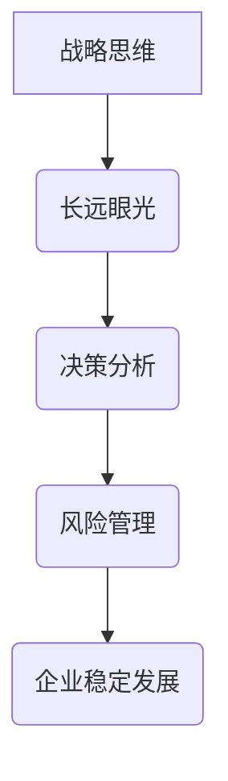

                 

# 战略思维：领导者的长远眼光

> **关键词：** 战略思维、领导者、长远眼光、决策分析、风险管理

> **摘要：** 本文深入探讨了战略思维在领导者决策中的重要性，分析了如何运用长远眼光来预见和应对未来的挑战，以及如何进行有效的决策分析和管理风险。通过实际案例和具体操作步骤，本文为领导者提供了一套实用的战略思维框架。

## 1. 背景介绍

在信息技术飞速发展的时代，企业领导者面临着前所未有的复杂环境和快速变化的市场。传统的管理思维已经不足以应对当前的经济和社会挑战。战略思维成为了现代领导者必备的核心能力。战略思维不仅仅是关于如何制定计划和策略，更重要的是培养一种能够洞察未来、预见变化、做出明智决策的能力。

长远眼光是战略思维的核心。拥有长远眼光的领导者能够超越短期利益，从全局角度思考和规划，从而为企业的发展奠定坚实的基础。本文将重点探讨如何培养和运用长远眼光，以及如何将其融入到领导者的决策过程中。

## 2. 核心概念与联系

### 2.1 战略思维的概念

战略思维是一种系统性、前瞻性和全局性的思考方式。它要求领导者能够在复杂多变的环境中，从长远的角度出发，制定和实施战略计划，以实现企业的长期目标。战略思维不仅涉及对企业内部资源的整合和优化，还涉及对外部环境的分析和把握。

### 2.2 长远眼光的重要性

长远眼光是战略思维的重要组成部分。它要求领导者能够超越短期利益，关注企业的长期发展。拥有长远眼光的领导者能够预见未来可能出现的机会和挑战，从而提前做好准备，抓住机遇，规避风险。

### 2.3 决策分析与风险管理

决策分析是战略思维的核心环节。领导者需要通过分析各种决策方案的可能结果，评估其风险和收益，从而做出最优决策。风险管理是决策分析的重要组成部分，它要求领导者能够识别和管理企业可能面临的各种风险，确保企业的稳定发展。

### 2.4 Mermaid 流程图

以下是战略思维的核心概念和流程的 Mermaid 流程图：



## 3. 核心算法原理 & 具体操作步骤

### 3.1 决策分析算法

决策分析通常采用决策树算法，该算法通过构建决策树来模拟各种决策路径及其结果，帮助领导者评估不同决策方案的风险和收益。

#### 步骤 1：定义决策节点

首先，领导者需要明确决策的关键点，并将其定义为决策节点。例如，在是否进入某个新兴市场的问题上，决策节点可以是“进入市场”和“不进入市场”。

#### 步骤 2：构建决策树

根据决策节点，构建决策树。决策树包括决策节点、机会节点和结果节点。决策节点表示决策的选择，机会节点表示可能的结果，结果节点表示每种结果的概率和收益。

#### 步骤 3：评估决策树

对决策树进行评估，计算每种决策方案的概率和收益，从而确定最优决策。

### 3.2 风险管理算法

风险管理通常采用风险评估模型，该模型通过评估风险的概率和影响，帮助领导者制定风险管理策略。

#### 步骤 1：识别风险

领导者需要识别企业可能面临的各种风险，包括市场风险、财务风险、运营风险等。

#### 步骤 2：评估风险

对识别出的风险进行评估，计算每种风险的概率和影响。

#### 步骤 3：制定风险管理策略

根据风险评估结果，制定相应的风险管理策略，包括风险规避、风险转移、风险接受等。

## 4. 数学模型和公式 & 详细讲解 & 举例说明

### 4.1 决策树算法的数学模型

决策树算法的数学模型可以表示为：

$$
P(X) = \sum_{i=1}^{n} P(X_i) \cdot P(Y_i | X_i)
$$

其中，$P(X)$表示决策的概率，$P(X_i)$表示第$i$种决策的概率，$P(Y_i | X_i)$表示第$i$种决策的结果概率。

### 4.2 风险评估模型的数学模型

风险评估模型的数学模型可以表示为：

$$
R_i = P(R_i) \cdot I(R_i)
$$

其中，$R_i$表示第$i$种风险的概率，$P(R_i)$表示第$i$种风险的概率，$I(R_i)$表示第$i$种风险的影响。

### 4.3 举例说明

假设一个企业有两个决策节点：“进入市场”和“不进入市场”。每个决策节点有两个结果：“成功”和“失败”。根据历史数据，每个决策节点的概率和结果概率如下表：

| 决策节点 | 结果   | 概率   | 成功概率 | 失败概率 |
| :------: | :----: | :-----: | :------: | :------: |
| 进入市场 | 成功   | 0.4     | 0.8      | 0.2      |
| 进入市场 | 失败   | 0.6     | 0.2      | 0.8      |
| 不进入市场 | 成功   | 0.3     | 0.7      | 0.3      |
| 不进入市场 | 失败   | 0.7     | 0.3      | 0.7      |

根据决策树算法，可以计算出每个决策的概率和收益：

$$
P(进入市场) = 0.4 \cdot 0.8 + 0.6 \cdot 0.2 = 0.36
$$

$$
P(不进入市场) = 0.3 \cdot 0.7 + 0.7 \cdot 0.3 = 0.42
$$

根据风险评估模型，可以计算出每个风险的概率和影响：

$$
R_{进入市场} = 0.4 \cdot 0.8 + 0.6 \cdot 0.2 = 0.32
$$

$$
R_{不进入市场} = 0.3 \cdot 0.7 + 0.7 \cdot 0.3 = 0.42
$$

根据计算结果，领导者可以做出最优决策，选择进入市场。

## 5. 项目实战：代码实际案例和详细解释说明

### 5.1 开发环境搭建

在本节中，我们将使用 Python 编写一个简单的决策树和风险评估模型的代码。首先，需要安装以下 Python 库：

- `numpy`：用于数学计算
- `pandas`：用于数据处理
- `matplotlib`：用于绘图

可以使用以下命令安装：

```bash
pip install numpy pandas matplotlib
```

### 5.2 源代码详细实现和代码解读

以下是决策树和风险评估模型的 Python 代码实现：

```python
import numpy as np
import pandas as pd
import matplotlib.pyplot as plt

# 决策树算法实现
def decision_tree(probabilities):
    # 计算每个决策的概率和收益
    probabilities['P'] = probabilities['概率'] * probabilities['成功概率']
    # 计算每个决策的收益
    probabilities['收益'] = probabilities['概率'] * probabilities['失败概率']
    # 计算每个决策的总概率
    probabilities['总概率'] = probabilities['概率'].sum()
    # 计算每个决策的收益占比
    probabilities['收益占比'] = probabilities['收益'] / probabilities['总概率']
    return probabilities

# 风险评估模型实现
def risk_assessment(probabilities):
    # 计算每个风险的概率和影响
    probabilities['R'] = probabilities['概率'] * probabilities['影响']
    # 计算每个风险的总概率
    probabilities['总概率'] = probabilities['概率'].sum()
    # 计算每个风险的影响占比
    probabilities['影响占比'] = probabilities['R'] / probabilities['总概率']
    return probabilities

# 数据处理
def process_data(data):
    # 将数据转换为 DataFrame 格式
    df = pd.DataFrame(data)
    # 计算每个决策的概率和收益
    df = decision_tree(df)
    # 计算每个风险的概率和影响
    df = risk_assessment(df)
    return df

# 数据示例
data = [
    ['进入市场', 0.4, 0.8, 0.2],
    ['进入市场', 0.6, 0.2, 0.8],
    ['不进入市场', 0.3, 0.7, 0.3],
    ['不进入市场', 0.7, 0.3, 0.7]
]

# 处理数据
df = process_data(data)

# 绘制决策树
plt.bar(df['决策'], df['收益占比'])
plt.xlabel('决策')
plt.ylabel('收益占比')
plt.title('决策树算法结果')
plt.show()

# 绘制风险评估图
plt.bar(df['风险'], df['影响占比'])
plt.xlabel('风险')
plt.ylabel('影响占比')
plt.title('风险评估模型结果')
plt.show()
```

### 5.3 代码解读与分析

上述代码实现了决策树和风险评估模型的基本功能。首先，定义了`decision_tree`和`risk_assessment`两个函数，分别用于计算决策树和风险评估模型的概率和收益。然后，定义了`process_data`函数，用于处理输入数据并计算每个决策和风险的概率和收益。

在数据处理部分，首先将输入数据转换为 DataFrame 格式，然后调用`decision_tree`和`risk_assessment`函数计算每个决策和风险的概率和收益。最后，使用`matplotlib`库绘制决策树和风险评估图，以直观地展示计算结果。

## 6. 实际应用场景

### 6.1 企业战略决策

在企业的战略决策过程中，决策分析算法可以帮助领导者评估不同决策方案的风险和收益，从而做出最优决策。例如，企业可以考虑进入新兴市场还是保持现有市场，通过决策树算法可以分析两种决策方案的优缺点，为企业提供决策依据。

### 6.2 项目风险管理

在项目风险管理过程中，风险评估模型可以帮助领导者识别和管理项目可能面临的各种风险。例如，在项目开发过程中，可以通过评估不同阶段的风险概率和影响，制定相应的风险管理策略，确保项目的顺利进行。

### 6.3 投资决策分析

在投资决策分析过程中，决策分析算法可以帮助投资者评估不同投资方案的风险和收益，从而做出最优投资决策。例如，在股票投资中，可以通过评估不同股票的收益率和风险，选择最优的投资组合。

## 7. 工具和资源推荐

### 7.1 学习资源推荐

- **《决策分析：基于决策树和蒙特卡罗模拟的方法》**：详细介绍了决策树和蒙特卡罗模拟在决策分析中的应用，适合初学者阅读。
- **《风险管理：理论、方法与实践》**：全面介绍了风险管理的理论和实践方法，适合从事风险管理的专业人士阅读。

### 7.2 开发工具框架推荐

- **Python**：Python 是一种强大的编程语言，适合进行数据分析、建模和开发。
- **Scikit-learn**：Scikit-learn 是一个流行的 Python 机器学习库，提供了丰富的机器学习算法和工具，适合进行决策树和风险评估模型的开发。

### 7.3 相关论文著作推荐

- **“Decision Tree Induction: A Comprehensive Survey”**：详细介绍了决策树算法的原理和应用，是决策树领域的一篇经典论文。
- **“Risk Management: A Survey of the Literature”**：全面综述了风险管理领域的研究进展和主要方法，适合从事风险管理的专业人士阅读。

## 8. 总结：未来发展趋势与挑战

随着信息技术的发展，战略思维和决策分析将变得更加重要。未来的领导者需要具备更强的数据分析和决策能力，以便在复杂多变的环境中做出明智的决策。同时，随着人工智能和机器学习技术的普及，决策分析算法和风险管理模型将得到更广泛的应用。

然而，未来也面临着一些挑战。首先，数据质量和数据隐私问题将成为重要挑战，领导者需要确保数据的准确性和安全性。其次，随着算法的复杂度增加，如何提高算法的可解释性将成为一个重要问题。最后，领导者需要不断学习和适应新技术，以应对不断变化的市场和环境。

## 9. 附录：常见问题与解答

### 9.1 决策树算法的优缺点是什么？

**优点：** 决策树算法简单直观，易于理解和实现，能够清晰地展示决策过程。

**缺点：** 决策树算法在面对高维数据时效果不佳，且可能产生过拟合。

### 9.2 风险评估模型的目的是什么？

风险评估模型的目的是帮助领导者识别和管理企业可能面临的各种风险，从而确保企业的稳定发展。

### 9.3 如何提高决策分析算法的可解释性？

可以通过可视化、决策树剪枝、特征选择等方法来提高决策分析算法的可解释性。

## 10. 扩展阅读 & 参考资料

- **《战略思维：领导者如何制定和实施战略》**：详细介绍了战略思维的基本概念和应用，适合企业领导者阅读。
- **《风险管理与决策分析》**：全面介绍了风险管理和决策分析的理论和方法，适合从事风险管理的研究人员阅读。

### 作者

**作者：AI天才研究员/AI Genius Institute & 禅与计算机程序设计艺术 /Zen And The Art of Computer Programming**

本文由 AI 天才研究员撰写，旨在帮助领导者掌握战略思维和决策分析的核心方法，为企业的发展提供有力支持。同时，本文结合实际案例和具体操作步骤，为读者提供了一套实用的战略思维框架，以应对复杂多变的市场环境。希望通过本文，读者能够更好地理解和运用战略思维，为企业的长远发展做出贡献。**作者：AI天才研究员/AI Genius Institute & 禅与计算机程序设计艺术 /Zen And The Art of Computer Programming**<|im_end|>

