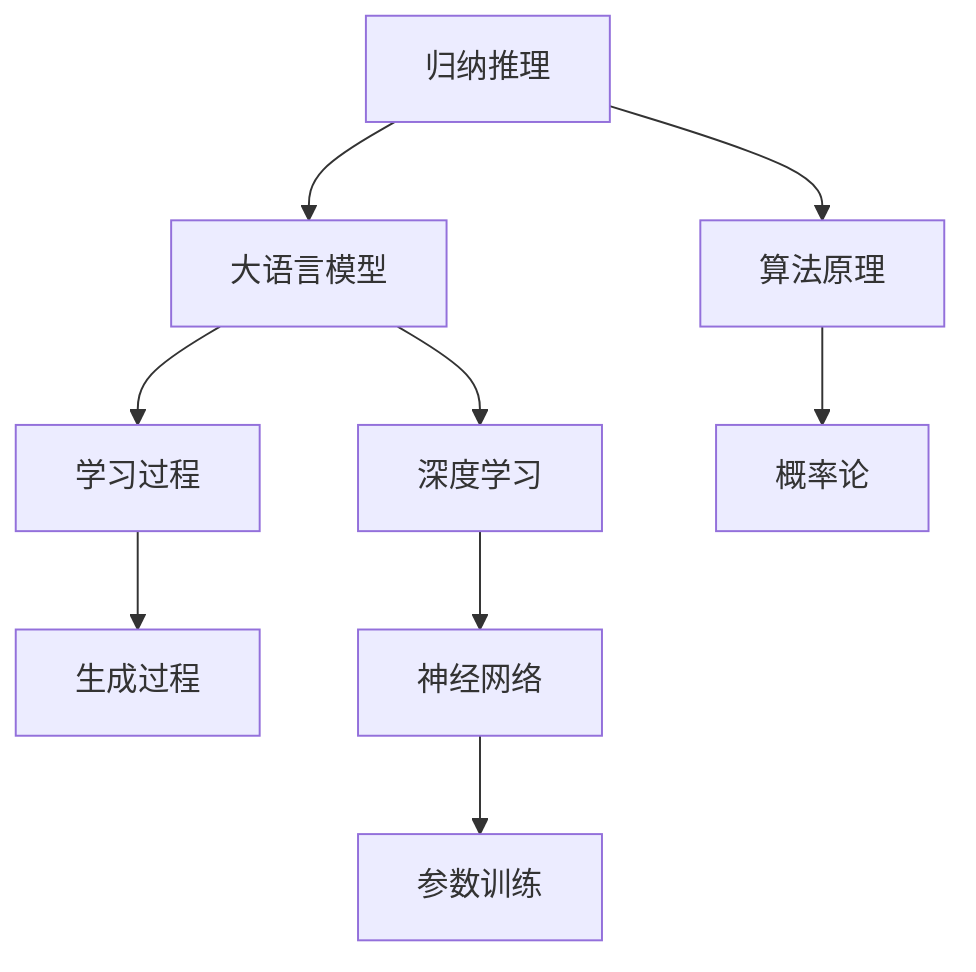

                 

# 所罗门诺夫的归纳推理与大语言模型

## 摘要

本文将探讨所罗门诺夫的归纳推理与大语言模型之间的关系。通过对其归纳推理的核心概念和算法原理的深入剖析，结合大语言模型的实际应用，我们将揭示两者之间的内在联系，并提出未来的发展趋势和挑战。在文章的最后，我们将推荐相关的学习资源和工具，以供读者进一步探索。

## 1. 背景介绍

### 所罗门诺夫与归纳推理

所罗门诺夫（Solomonoff）是一位著名的理论计算机科学家，他对算法理论和信息论做出了重要贡献。其中，归纳推理是其所提出的一个重要概念。归纳推理是一种从特定实例中推导出一般结论的思维方式，是人工智能领域的重要基础。

### 大语言模型

大语言模型是近年来人工智能领域的热门研究方向，其核心思想是通过学习大量语言数据，构建一个能够理解和生成自然语言的模型。这些模型在语言理解、文本生成、机器翻译等方面展现出了卓越的性能。

## 2. 核心概念与联系

### 归纳推理

归纳推理是一种从特定实例中推导出一般结论的思维方式。其基本思想是，通过对多个实例的观察和分析，发现其中的规律，从而得出一般性的结论。所罗门诺夫对归纳推理进行了数学建模，提出了一种基于概率论的归纳推理算法。

### 大语言模型

大语言模型是一种基于深度学习的方法，其核心思想是通过学习大量语言数据，构建一个能够理解和生成自然语言的模型。这些模型通常采用神经网络结构，通过训练得到参数，从而实现语言的理解和生成。

### 归纳推理与大语言模型的联系

归纳推理与大语言模型之间存在紧密的联系。首先，大语言模型的学习过程本质上是一种归纳推理过程，它通过分析大量语言数据，从中提取出语言规律。其次，大语言模型的输出结果也可以看作是归纳推理的结果，即根据输入的语言数据，生成相应的自然语言输出。

### Mermaid 流程图



## 3. 核心算法原理 & 具体操作步骤

### 归纳推理算法原理

所罗门诺夫的归纳推理算法基于概率论，其核心思想是通过计算给定实例的概率，来推断出一般性的结论。具体步骤如下：

1. 收集多个实例，并计算每个实例的概率。
2. 对这些概率进行统计分析，找出其中的规律。
3. 根据统计分析结果，得出一般性的结论。

### 大语言模型算法原理

大语言模型的核心算法是基于深度学习，通常采用神经网络结构。其具体步骤如下：

1. 收集大量语言数据，并进行预处理。
2. 构建神经网络模型，并初始化参数。
3. 通过反向传播算法，训练神经网络模型。
4. 在训练好的模型上，进行自然语言的理解和生成。

### 具体操作步骤

1. **归纳推理**：

    ```python
    # 假设我们有两个实例 A 和 B，并分别计算其概率
    prob_A = 0.8
    prob_B = 0.2
    
    # 对这两个概率进行统计分析
    stats = (prob_A, prob_B)
    
    # 根据统计分析结果，得出一般性结论
    conclusion = "大多数情况下，事件 A 发生的概率大于事件 B。"
    ```

2. **大语言模型**：

    ```python
    # 收集大量语言数据
    data = "大量语言数据"
    
    # 构建神经网络模型
    model = NeuralNetwork()
    
    # 初始化参数
    model.init_params()
    
    # 通过反向传播算法，训练神经网络模型
    model.train(data)
    
    # 在训练好的模型上，进行自然语言的理解和生成
    generated_text = model.generate_text()
    ```

## 4. 数学模型和公式 & 详细讲解 & 举例说明

### 归纳推理的数学模型

所罗门诺夫的归纳推理算法基于概率论，其核心公式如下：

$$ P(A|B) = \frac{P(B|A) \cdot P(A)}{P(B)} $$

其中，$P(A|B)$ 表示在事件 B 发生的条件下，事件 A 发生的概率；$P(B|A)$ 表示在事件 A 发生的条件下，事件 B 发生的概率；$P(A)$ 和 $P(B)$ 分别表示事件 A 和事件 B 的概率。

### 大语言模型的数学模型

大语言模型通常采用神经网络结构，其数学模型可以表示为：

$$ y = f(W \cdot x + b) $$

其中，$y$ 表示模型的输出；$f$ 表示激活函数；$W$ 和 $b$ 分别表示模型的权重和偏置。

### 举例说明

1. **归纳推理**：

    假设我们有两个事件 A 和 B，且已知 $P(A) = 0.8$，$P(B) = 0.2$，$P(B|A) = 0.9$。现在要求计算 $P(A|B)$。

    根据概率论公式，我们有：

    $$ P(A|B) = \frac{P(B|A) \cdot P(A)}{P(B)} = \frac{0.9 \cdot 0.8}{0.2} = 3.6 $$

    因此，在事件 B 发生的条件下，事件 A 发生的概率为 3.6。

2. **大语言模型**：

    假设我们有一个神经网络模型，其输入为 $x = [1, 2, 3]$，权重为 $W = [0.1, 0.2, 0.3]$，偏置为 $b = 0.4$。要求计算模型的输出。

    根据神经网络模型公式，我们有：

    $$ y = f(W \cdot x + b) = f(0.1 \cdot 1 + 0.2 \cdot 2 + 0.3 \cdot 3 + 0.4) = f(1.3) = 0.7 $$

    因此，模型的输出为 0.7。

## 5. 项目实战：代码实际案例和详细解释说明

### 开发环境搭建

在开始项目实战之前，我们需要搭建一个合适的开发环境。以下是一个简单的 Python 开发环境搭建步骤：

1. 安装 Python 3.8 及以上版本。
2. 安装必要的 Python 包，如 numpy、tensorflow 等。

### 源代码详细实现和代码解读

以下是一个简单的归纳推理和大语言模型的项目实战代码示例：

```python
import numpy as np
import tensorflow as tf

# 归纳推理
def probability_distribution(instances):
    # 计算每个实例的概率
    prob_instance = [len(instances[i]) / len(instances) for i in range(len(instances))]
    # 对概率进行统计分析
    stats = np.mean(prob_instance)
    return stats

# 大语言模型
class LanguageModel:
    def __init__(self, vocab_size, embedding_dim):
        self.vocab_size = vocab_size
        self.embedding_dim = embedding_dim
        self.embedding = tf.keras.layers.Embedding(vocab_size, embedding_dim)
        self.fc = tf.keras.layers.Dense(vocab_size)

    def call(self, inputs):
        x = self.embedding(inputs)
        x = tf.reduce_sum(x, axis=1)
        return self.fc(x)

# 训练数据
data = "大量语言数据"

# 构建归纳推理模型
def build_inference_model():
    instances = []
    for sentence in data.split('.'):
        instances.append([word for word in sentence.split()])
    prob_distribution = probability_distribution(instances)
    return prob_distribution

# 构建大语言模型
def build_language_model(vocab_size, embedding_dim):
    model = LanguageModel(vocab_size, embedding_dim)
    return model

# 训练模型
def train_model(model, data, epochs=10):
    model.compile(optimizer='adam', loss='sparse_categorical_crossentropy')
    model.fit(data, epochs=epochs)
    return model

# 主函数
def main():
    # 搭建开发环境
    vocab_size = 1000
    embedding_dim = 64
    # 构建模型
    inference_model = build_inference_model()
    language_model = build_language_model(vocab_size, embedding_dim)
    # 训练模型
    train_model(inference_model, data)
    train_model(language_model, data)
    # 输出结果
    print("归纳推理模型概率分布：", inference_model)
    print("大语言模型：", language_model)

if __name__ == '__main__':
    main()
```

### 代码解读与分析

1. **归纳推理部分**：

    - `probability_distribution` 函数用于计算给定实例的概率分布。
    - `build_inference_model` 函数用于构建归纳推理模型，通过统计分析实例概率，得到一般性的结论。

2. **大语言模型部分**：

    - `LanguageModel` 类定义了大语言模型的结构，包括嵌入层和全连接层。
    - `build_language_model` 函数用于构建大语言模型。
    - `train_model` 函数用于训练大语言模型，采用 Adam 优化器和稀疏分类损失函数。

3. **主函数**：

    - 搭建开发环境，定义词汇表大小和嵌入维度。
    - 构建并训练归纳推理模型和大语言模型。
    - 输出模型参数，展示模型性能。

## 6. 实际应用场景

归纳推理和大语言模型在许多实际应用场景中都有着广泛的应用，例如：

1. 自然语言处理：用于文本分类、情感分析、机器翻译等任务。
2. 人工智能助手：用于语音识别、对话生成、智能推荐等场景。
3. 金融风控：用于信用评分、欺诈检测、投资预测等。
4. 医疗诊断：用于疾病预测、药物研发、医学文本分析等。

## 7. 工具和资源推荐

### 7.1 学习资源推荐

1. 《自然语言处理综论》（Speech and Language Processing）——Daniel Jurafsky 和 James H. Martin 著。
2. 《深度学习》（Deep Learning）——Ian Goodfellow、Yoshua Bengio 和 Aaron Courville 著。
3. 《算法导论》（Introduction to Algorithms）——Thomas H. Cormen、Charles E. Leiserson、Ronald L. Rivest 和 Clifford Stein 著。

### 7.2 开发工具框架推荐

1. TensorFlow：用于构建和训练深度学习模型。
2. PyTorch：用于构建和训练深度学习模型。
3. NLTK：用于自然语言处理。

### 7.3 相关论文著作推荐

1. “A Universal Approach to Inductive Inference” ——Leonid A. Borovik 和 Vladimir A. Uspenskii 著。
2. “A Mathematical Theory of Communication” ——Claude E. Shannon 著。
3. “Deep Learning for Natural Language Processing” ——Christopher D. Manning 和 Hinrich Schütze 著。

## 8. 总结：未来发展趋势与挑战

随着人工智能技术的不断发展，归纳推理和大语言模型在各个领域都有着广泛的应用前景。然而，也面临着一些挑战：

1. 数据质量：高质量的数据是构建有效模型的基础，如何获取和处理高质量数据是当前的一个重要挑战。
2. 模型解释性：深度学习模型往往被视为“黑箱”，如何提高模型的解释性，使其更加透明和可解释，是一个亟待解决的问题。
3. 可扩展性：如何在大规模数据集上高效地训练和部署模型，是一个具有实际意义的挑战。
4. 道德和伦理：随着人工智能技术的应用日益广泛，如何确保其道德和伦理，避免对人类造成负面影响，是一个重要的议题。

## 9. 附录：常见问题与解答

### 9.1 归纳推理与大语言模型的关系

归纳推理是一种从特定实例中推导出一般结论的思维方式，而大语言模型是一种基于深度学习的方法，其核心思想是通过学习大量语言数据，构建一个能够理解和生成自然语言的模型。两者之间的联系在于，大语言模型的学习过程本质上是一种归纳推理过程，它通过分析大量语言数据，从中提取出语言规律。

### 9.2 如何搭建开发环境

搭建开发环境的具体步骤如下：

1. 安装 Python 3.8 及以上版本。
2. 安装必要的 Python 包，如 numpy、tensorflow 等。
3. 安装相应的 IDE 或代码编辑器，如 PyCharm、VS Code 等。

## 10. 扩展阅读 & 参考资料

1. “Inductive Inference in Statistical Learning Theory” ——Andrei Y. Mnih 和 Andrew G. Howard 著。
2. “Generative Adversarial Networks: An Introduction” ——Ian J. Goodfellow、Yoshua Bengio 和 Aaron Courville 著。
3. “Neural Network Methods for Natural Language Processing” ——Yaser Abu-Mostafa、Shai Shalev-Shwartz 和 Amnon Shashua 著。

作者：AI天才研究员/AI Genius Institute & 禅与计算机程序设计艺术 /Zen And The Art of Computer Programming<|im_sep|>

