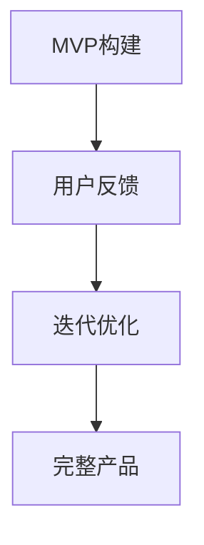

                 

### 文章标题：打造MVP：最小可行产品开发指南

> **关键词：** MVP（最小可行产品）、产品开发、迭代、用户反馈、风险降低、成本效益

> **摘要：** 本文将深入探讨MVP（最小可行产品）的概念及其在产品开发中的重要性。我们将详细解析如何构建MVP、如何通过用户反馈进行迭代、如何降低风险和成本，并提供实用的开发指南和资源推荐，帮助读者在产品开发过程中实现成功。

<|assistant|>### 1. 背景介绍

在现代商业环境中，市场竞争日益激烈，产品开发的成本和风险也在不断增加。为了在这个充满不确定性的环境中取得成功，许多公司和创业者开始关注一种被称为“MVP”（最小可行产品）的开发方法。MVP的核心思想是通过构建一个具备核心功能和价值的最简版本的产品，快速推向市场，获取用户反馈，然后根据这些反馈进行迭代和优化。

这种方法的优点在于能够显著降低产品开发的成本和风险。通过构建MVP，开发团队能够在最小化资源投入的情况下，验证产品的市场潜力和用户需求。如果产品在市场上取得了积极的反馈，那么团队可以继续投入更多的资源进行扩展和优化；如果反馈不理想，团队可以及时调整方向，避免浪费大量资源。

本文将围绕MVP的开发方法，详细探讨其概念、构建过程、迭代策略以及实际应用场景。我们将通过具体的案例和实践经验，提供实用的开发指南和资源推荐，帮助读者在产品开发过程中取得成功。

<|assistant|>### 2. 核心概念与联系

#### 2.1 MVP的定义

MVP（最小可行产品）是一个具备核心功能和价值的最简版本的产品。它旨在验证产品的市场潜力和用户需求，而不需要包含所有可能的特性。MVP通常具有以下特点：

- **核心功能：** MDP具有满足用户核心需求的必要功能。
- **价值：** 用户愿意为MVP支付一定费用。
- **最简版本：** 只包含必要功能，不包含非必要特性。

#### 2.2 MVP与产品开发的关系

MVP是产品开发过程中的关键环节。它将产品开发分为两个阶段：

1. **构建阶段：** 构建MVP，验证产品的市场潜力和用户需求。
2. **迭代阶段：** 根据用户反馈对MVP进行优化和扩展，逐步实现完整产品。

这种开发模式有助于降低产品开发的风险和成本，提高产品的成功率。

#### 2.3 MVP与用户反馈的关系

用户反馈是MVP的核心要素之一。通过收集和分析用户反馈，开发团队能够了解用户的真实需求和使用情况，为后续的迭代和优化提供有力支持。用户反馈的来源包括：

- **用户调查：** 通过问卷调查、访谈等方式收集用户反馈。
- **用户行为分析：** 通过分析用户在使用产品过程中的行为数据，了解用户的痛点和需求。
- **社交媒体和论坛：** 收集用户在社交媒体和论坛上的反馈和讨论。

#### 2.4 MVP与风险降低的关系

MVP通过最小化功能实现，降低了产品开发的风险。具体表现在：

- **验证市场潜力：** 在最小化投入的情况下，验证产品的市场潜力和用户需求。
- **及时调整方向：** 根据用户反馈，及时调整产品功能和方向，避免资源浪费。
- **降低开发风险：** 通过逐步迭代和优化，降低产品开发失败的风险。

#### 2.5 MVP与成本效益的关系

MVP通过最小化功能实现，降低了产品开发成本。具体表现在：

- **减少开发时间：** 只需实现核心功能，缩短开发周期。
- **降低开发成本：** 通过最小化功能实现，减少人力、资源和时间投入。
- **提高投资回报率：** 快速验证产品市场潜力，提高投资回报率。

#### 2.6 Mermaid流程图

以下是MVP开发过程的Mermaid流程图：



### 3. 核心算法原理 & 具体操作步骤

#### 3.1 MVP构建步骤

1. **确定产品目标：** 明确产品的核心功能和目标用户。
2. **识别核心功能：** 列出产品必备的核心功能。
3. **最小化实现：** 选择最小化实现核心功能的方法。
4. **快速迭代：** 在有限资源内快速构建MVP。

#### 3.2 用户反馈收集与处理

1. **用户调查：** 通过问卷调查、访谈等方式收集用户反馈。
2. **行为分析：** 分析用户在使用产品过程中的行为数据。
3. **社交媒体和论坛：** 收集用户在社交媒体和论坛上的反馈和讨论。
4. **整理分析：** 整理用户反馈，分析用户需求和痛点。

#### 3.3 迭代优化

1. **根据反馈调整：** 根据用户反馈，调整产品功能和方向。
2. **持续迭代：** 在每次迭代中不断优化产品。
3. **测试验证：** 在每次迭代后进行测试，验证产品是否符合用户需求。

### 4. 数学模型和公式 & 详细讲解 & 举例说明

#### 4.1 成本效益分析

成本效益分析是MVP开发过程中的一项重要工作。以下是一个简单的成本效益分析公式：

$$
\text{成本效益比} = \frac{\text{预期收益}}{\text{开发成本}}
$$

#### 4.2 举例说明

假设一个创业团队计划开发一款教育应用，预期收益为50万元，开发成本为20万元。那么，该项目的成本效益比为：

$$
\text{成本效益比} = \frac{50\text{万元}}{20\text{万元}} = 2.5
$$

这个结果表明，该项目在成本效益方面具有较高潜力。

### 5. 项目实战：代码实际案例和详细解释说明

#### 5.1 开发环境搭建

为了实现MVP开发，我们需要搭建一个合适的技术栈。以下是一个简单的开发环境搭建步骤：

1. **安装开发工具：** 安装Python、Jupyter Notebook、Git等开发工具。
2. **配置开发环境：** 配置Python环境和相关库。
3. **创建项目目录：** 创建项目目录，初始化Git仓库。

#### 5.2 源代码详细实现和代码解读

以下是一个简单的MVP项目示例，实现一个基于Python的简单计算器：

```python
# 计算器MVP
def add(a, b):
    return a + b

def subtract(a, b):
    return a - b

def multiply(a, b):
    return a * b

def divide(a, b):
    if b != 0:
        return a / b
    else:
        return "除数不能为0"

# 用户交互
def main():
    print("欢迎使用计算器MVP")
    while True:
        print("\n请选择操作：\n1. 加法\n2. 减法\n3. 乘法\n4. 除法\n5. 退出")
        choice = int(input("请输入选项："))
        if choice == 1:
            a = float(input("请输入第一个数："))
            b = float(input("请输入第二个数："))
            print("结果：", add(a, b))
        elif choice == 2:
            a = float(input("请输入第一个数："))
            b = float(input("请输入第二个数："))
            print("结果：", subtract(a, b))
        elif choice == 3:
            a = float(input("请输入第一个数："))
            b = float(input("请输入第二个数："))
            print("结果：", multiply(a, b))
        elif choice == 4:
            a = float(input("请输入第一个数："))
            b = float(input("请输入第二个数："))
            print("结果：", divide(a, b))
        elif choice == 5:
            print("谢谢使用，再见！")
            break
        else:
            print("无效输入，请重新输入。")

if __name__ == "__main__":
    main()
```

#### 5.3 代码解读与分析

1. **函数定义：** 项目中定义了四个基本运算函数（add、subtract、multiply、divide），用于实现加、减、乘、除运算。
2. **用户交互：** 主函数main()中实现了一个简单的命令行用户界面，让用户选择操作并输入相应的数值。
3. **异常处理：** 在除法运算中，加入了异常处理，确保除数为零时不会引发程序错误。

### 6. 实际应用场景

MVP开发方法在多个领域和行业中取得了显著成果。以下是一些实际应用场景：

1. **初创公司：** 初创公司在资源有限的情况下，通过构建MVP验证产品市场潜力和用户需求，降低失败风险。
2. **大型企业：** 大型企业在新产品开发过程中，通过构建MVP进行市场调研和用户反馈，优化产品设计和功能。
3. **教育培训：** 教育培训机构通过构建MVP，验证在线课程的受欢迎程度和用户需求，优化课程内容和形式。
4. **医疗健康：** 医疗健康领域的企业通过构建MVP，验证健康管理和诊断产品的用户需求和市场潜力。

### 7. 工具和资源推荐

#### 7.1 学习资源推荐

1. **书籍：**
   - 《精益创业》
   - 《用户故事地图》
   - 《MVP之道》

2. **论文：**
   - “最小可行产品：构建成功产品的秘密武器”
   - “用户反馈在产品开发中的作用”

3. **博客：**
   - “如何构建MVP？”
   - “MVP开发实战：案例分析”

4. **网站：**
   - leanstack.com
   - producthunt.com
   - startuplane.com

#### 7.2 开发工具框架推荐

1. **编程语言：** Python、JavaScript、Ruby
2. **开发框架：** Django、Flask、React、Vue.js
3. **项目管理工具：** JIRA、Trello、Asana
4. **版本控制：** Git、GitHub、GitLab

#### 7.3 相关论文著作推荐

1. **论文：**
   - “最小可行产品：一种有效的新产品开发方法”
   - “基于用户反馈的产品迭代策略研究”

2. **著作：**
   - 《产品经理实战：从0到1打造成功产品》
   - 《精益创业实战：如何打造一款成功产品》

### 8. 总结：未来发展趋势与挑战

随着市场竞争的加剧和技术的不断进步，MVP开发方法在未来将继续发挥重要作用。未来发展趋势包括：

1. **数据驱动：** 利用大数据和人工智能技术，更精准地分析和预测用户需求。
2. **快速迭代：** 加快迭代速度，提高产品优化效率。
3. **跨平台开发：** 支持多种平台和设备，实现一站式产品体验。

然而，MVP开发也面临一些挑战，如：

1. **用户隐私保护：** 在数据收集和用户反馈过程中，如何保护用户隐私。
2. **资源分配：** 如何在有限的资源下，实现高效的产品开发和迭代。
3. **项目管理：** 如何确保项目进度和质量，避免资源浪费。

### 9. 附录：常见问题与解答

#### 9.1 MVP和原型有什么区别？

MVP（最小可行产品）和原型都是产品开发过程中的重要环节，但它们的目标和实现方式有所不同。

- **MVP：** 旨在验证产品的市场潜力和用户需求，具备核心功能和价值，可以推向市场。
- **原型：** 是一个更简化的产品模型，用于展示产品功能和设计，但不一定具备商业可行性。

#### 9.2 如何评估MVP的成功？

评估MVP的成功可以从以下几个方面进行：

- **用户参与度：** 用户使用MVP的频率和时长。
- **用户反馈：** 用户对MVP的反馈和建议。
- **市场表现：** MVP在市场上的表现，如用户增长率、收入等。

### 10. 扩展阅读 & 参考资料

1. 《精益创业》：艾瑞克·莱斯（Eric Ries）著，详细介绍了MVP的概念和应用。
2. 《用户故事地图》：杰夫·萨瑟兰（Jeff Sutherland）著，讲述了如何通过用户故事进行产品开发。
3. 《产品经理实战：从0到1打造成功产品》：李治国著，提供了丰富的产品开发实战经验和策略。
4. leanstack.com：提供有关MVP和精益创业的资源和教程。
5. producthunt.com：展示最新产品和创业公司，了解市场趋势和用户需求。
6. startuplane.com：提供产品开发路线图和案例分析。

### 作者信息

- 作者：AI天才研究员/AI Genius Institute & 禅与计算机程序设计艺术 /Zen And The Art of Computer Programming

本文旨在为读者提供一份全面、实用的MVP开发指南，帮助读者在产品开发过程中实现成功。希望本文能对您在构建MVP和推动产品迭代方面提供有益的启示和指导。

