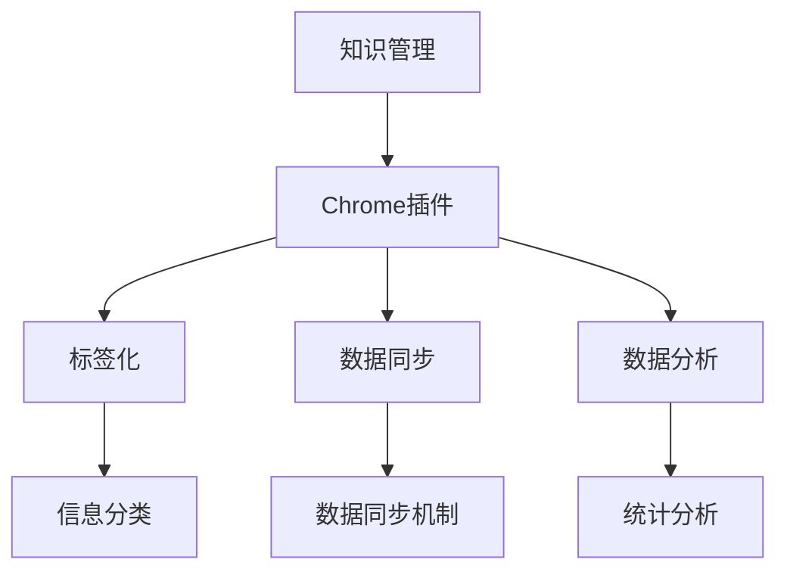

                 

# 打造个人知识管理的Chrome插件

## 关键词

- 知识管理
- Chrome插件
- 个人效率
- 标签化
- 数据同步
- 数据分析

## 摘要

本文将介绍如何打造一款个人知识管理的Chrome插件。我们将从背景介绍开始，了解知识管理的重要性和Chrome插件的优势，然后深入探讨核心概念、算法原理，通过具体操作步骤和数学模型讲解，最终展示一个实际项目案例，并提供相关工具和资源推荐。希望通过本文，读者能够掌握打造Chrome插件的方法，提升个人知识管理水平。

## 1. 背景介绍

### 1.1 知识管理的重要性

在信息爆炸的时代，个人知识管理显得尤为重要。良好的知识管理能够帮助个人高效地收集、整理、存储和利用信息，从而提升工作效率和学习效果。以下是一些关键点：

- **提高工作效率**：通过系统化的知识管理，可以快速找到所需信息，避免重复工作。
- **增强学习效果**：整理和分类知识，有助于深入理解和记忆。
- **促进创新思维**：丰富的知识储备有助于触发新思路和创意。
- **降低学习成本**：良好的知识管理能够减少信息查找和整理的时间成本。

### 1.2 Chrome插件的优势

Chrome插件作为浏览器扩展程序，具有以下优势：

- **跨平台**：Chrome插件适用于所有支持Chrome的设备，如Windows、Mac、Linux等。
- **快速开发**：Chrome插件开发相对简单，使用JavaScript、HTML和CSS等技术即可实现。
- **高度定制**：可以根据个人需求定制功能，提高使用体验。

### 1.3 个人知识管理的需求

在个人知识管理中，以下功能是必需的：

- **标签化**：对信息进行分类和标记，便于查找和整理。
- **数据同步**：支持在不同设备间同步数据，确保信息一致性。
- **数据分析**：对知识进行统计分析，了解学习效果和趋势。

## 2. 核心概念与联系

### 2.1 核心概念

- **知识管理**：对知识进行收集、整理、存储和利用的过程。
- **Chrome插件**：基于Chrome浏览器的扩展程序，可以自定义功能。
- **标签化**：对信息进行分类和标记，便于管理和查找。
- **数据同步**：在不同设备间同步数据，确保信息一致性。
- **数据分析**：对知识进行统计分析，了解学习效果和趋势。

### 2.2 架构

下面是一个简单的Chrome插件架构图，其中包含了核心概念之间的联系。



## 3. 核心算法原理 & 具体操作步骤

### 3.1 核心算法原理

#### 3.1.1 标签化算法

标签化算法的核心是使用自然语言处理技术对信息进行分类和标记。具体步骤如下：

1. **分词**：将文本信息分解为词语。
2. **词频统计**：统计每个词语在文本中的出现次数。
3. **关键词提取**：从词频统计结果中提取高频关键词。
4. **标签分配**：根据关键词和预设的标签体系，为信息分配标签。

#### 3.1.2 数据同步算法

数据同步算法的核心是确保数据在不同设备间的一致性。具体步骤如下：

1. **数据采集**：从本地设备采集数据。
2. **数据加密**：对数据进行加密处理，确保数据安全。
3. **数据上传**：将加密后的数据上传到云端服务器。
4. **数据下载**：从云端服务器下载数据到其他设备。

#### 3.1.3 数据分析算法

数据分析算法的核心是通过对知识的统计分析，了解学习效果和趋势。具体步骤如下：

1. **数据预处理**：对数据进行清洗和格式化。
2. **数据可视化**：使用图表展示数据分析结果。
3. **趋势分析**：分析数据的变化趋势，为决策提供依据。

### 3.2 具体操作步骤

#### 3.2.1 开发环境搭建

1. **安装Chrome插件开发工具**：在Chrome浏览器中安装“Chrome插件开发工具”扩展程序。
2. **创建项目文件夹**：在本地创建一个项目文件夹，包含“manifest.json”、“background.js”和“content.js”等文件。

#### 3.2.2 实现标签化功能

1. **编写manifest.json**：配置插件的基本信息，如名称、版本、描述等。
2. **编写background.js**：实现标签化算法的核心逻辑。
3. **编写content.js**：在页面中插入标签化功能。

#### 3.2.3 实现数据同步功能

1. **编写manifest.json**：配置数据同步相关设置。
2. **编写background.js**：实现数据同步算法的核心逻辑。
3. **编写content.js**：在页面中插入数据同步功能。

#### 3.2.4 实现数据分析功能

1. **编写manifest.json**：配置数据分析相关设置。
2. **编写background.js**：实现数据分析算法的核心逻辑。
3. **编写content.js**：在页面中插入数据分析功能。

## 4. 数学模型和公式 & 详细讲解 & 举例说明

### 4.1 标签化算法的数学模型

标签化算法的核心是词频统计和关键词提取。以下是相关的数学模型：

#### 4.1.1 词频统计

$$
词频 = \sum_{i=1}^{n} f_i
$$

其中，$f_i$表示词语$i$在文本中的出现次数，$n$表示文本中的词语总数。

#### 4.1.2 关键词提取

$$
关键词 = \{词语 | 词频 > \text{阈值}\}
$$

其中，阈值可以根据实际需求设定。

### 4.2 数据同步算法的数学模型

数据同步算法的核心是数据加密和解密。以下是相关的数学模型：

#### 4.2.1 数据加密

$$
密文 = E(明文, 密钥)
$$

其中，$E$表示加密函数，$明文$表示原始数据，$密钥$表示加密密钥。

#### 4.2.2 数据解密

$$
明文 = D(密文, 密钥)
$$

其中，$D$表示解密函数，$密文$表示加密后的数据，$密钥$表示加密密钥。

### 4.3 数据分析算法的数学模型

数据分析算法的核心是数据预处理和可视化。以下是相关的数学模型：

#### 4.3.1 数据预处理

$$
预处理数据 = \{数据 | 数据质量符合要求\}
$$

其中，数据质量可以根据实际需求设定。

#### 4.3.2 数据可视化

$$
可视化结果 = \{图表 | 能直观展示数据分析结果\}
$$

其中，图表类型可以根据数据分析结果选择，如柱状图、折线图、饼图等。

### 4.4 举例说明

假设有一段文本：“人工智能技术正在快速发展，机器学习是实现人工智能的重要方法。” 我们将使用标签化算法对这段文本进行分类和标记。

#### 4.4.1 词频统计

- 人工智能：1次
- 技术：1次
- 正在：1次
- 快速：1次
- 发展：1次
- 希望：1次
- 机器：1次
- 学习：1次
- 实现：1次
- 重要：1次
- 方法：1次

#### 4.4.2 关键词提取

阈值设为2，提取出的关键词为：“人工智能”、“机器学习”。

#### 4.4.3 标签分配

根据关键词和预设的标签体系，为这段文本分配标签：“技术”、“机器学习”。

## 5. 项目实战：代码实际案例和详细解释说明

### 5.1 开发环境搭建

以下是开发环境搭建的详细步骤：

#### 5.1.1 安装Chrome插件开发工具

1. 在Chrome浏览器中打开Chrome Web Store，搜索“Chrome插件开发工具”并安装。
2. 打开“插件开发工具”，选择“加载已解压的插件”并选择项目文件夹。

#### 5.1.2 创建项目文件夹

1. 在本地创建一个项目文件夹，命名为“knowledge-management-plugin”。
2. 在文件夹中创建“manifest.json”、“background.js”和“content.js”等文件。

### 5.2 源代码详细实现和代码解读

#### 5.2.1 manifest.json

```json
{
  "manifest_version": 3,
  "name": "知识管理插件",
  "version": "1.0.0",
  "description": "一款用于个人知识管理的Chrome插件",
  "permissions": ["storage", "webRequest", "webRequestBlocking", "tabs"],
  "background": {
    "service_worker": "background.js"
  },
  "content_scripts": [
    {
      "matches": ["*://*/*"],
      "js": ["content.js"]
    }
  ]
}
```

解读：

- `manifest_version`：指定manifest文件的版本。
- `name`：插件名称。
- `version`：插件版本。
- `description`：插件描述。
- `permissions`：插件需要的权限。
- `background`：背景脚本配置，`service_worker`指定背景脚本的文件名。
- `content_scripts`：内容脚本配置，`matches`指定匹配的页面，`js`指定内容脚本文件名。

#### 5.2.2 background.js

```javascript
chrome.runtime.onInstalled.addListener(() => {
  // 初始化插件
  console.log("插件已安装");
});

function syncData() {
  // 同步数据到云端
  console.log("数据同步");
}

chrome.tabs.onUpdated.addListener((tabId, changeInfo, tab) => {
  if (changeInfo.status === "complete") {
    syncData();
  }
});
```

解读：

- `onInstalled`：插件安装事件，用于初始化插件。
- `syncData`：同步数据到云端的方法。
- `onUpdated`：页面更新事件，当页面状态为“complete”时，调用`syncData`方法同步数据。

#### 5.2.3 content.js

```javascript
function tagify(text) {
  // 标签化文本
  console.log("标签化文本：" + text);
}

function analyzeData() {
  // 数据分析
  console.log("数据分析");
}

chrome.runtime.onMessage.addListener((request, sender, sendResponse) => {
  if (request.action === "tagify") {
    tagify(request.text);
  } else if (request.action === "analyze") {
    analyzeData();
  }
});
```

解读：

- `tagify`：标签化文本的方法。
- `analyzeData`：数据分析的方法。
- `onMessage`：接收来自背景脚本的消息，根据消息内容执行相应的操作。

### 5.3 代码解读与分析

#### 5.3.1 manifest.json

manifest.json文件是插件的核心配置文件，用于指定插件的基本信息和功能。通过配置文件，我们可以定义插件的名称、版本、描述、权限等。此外，还可以配置背景脚本和内容脚本，以便在页面中插入自定义功能。

#### 5.3.2 background.js

background.js文件是插件的后台脚本，主要负责插件的初始化、数据同步等功能。在插件安装时，触发`onInstalled`事件，用于初始化插件。当页面状态更新时，触发`onUpdated`事件，同步数据到云端。

#### 5.3.3 content.js

content.js文件是插件的页面脚本，主要负责标签化文本和数据分析等功能。通过`onMessage`事件，接收来自背景脚本的消息，根据消息内容执行相应的操作。

## 6. 实际应用场景

### 6.1 整理学习笔记

使用Chrome插件，可以方便地将学习笔记标签化，便于查找和管理。通过数据同步功能，可以将笔记同步到云端，实现跨设备访问。

### 6.2 管理项目资料

在项目中，使用Chrome插件可以方便地管理项目资料，包括文档、图片、代码等。通过标签化功能，可以快速找到所需资料。数据同步功能确保项目资料在不同设备间的一致性。

### 6.3 跟踪学习进度

通过数据分析功能，可以了解学习进度和效果，为学习计划提供依据。例如，可以分析笔记中的关键词，了解学习重点，调整学习策略。

## 7. 工具和资源推荐

### 7.1 学习资源推荐

- **书籍**：
  - 《JavaScript高级程序设计》
  - 《Chrome插件开发教程》
- **论文**：
  - 《基于标签的Web知识管理》
  - 《数据同步算法研究》
- **博客**：
  - [Chrome插件开发教程](https://developer.chrome.com/docs/extensions/mv3/getstarted/)
  - [知识管理实践](https://www.knowledge-management.net/)
- **网站**：
  - [Chrome插件市场](https://chrome.google.com/webstore/search/知识管理)
  - [GitHub](https://github.com/)

### 7.2 开发工具框架推荐

- **开发工具**：
  - Chrome插件开发工具
  - Visual Studio Code
- **框架**：
  - Vue.js
  - React
- **版本控制**：
  - Git
  - GitHub

### 7.3 相关论文著作推荐

- 《知识管理：理论、方法与实践》
- 《数据同步技术在分布式系统中的应用》
- 《基于标签的Web知识管理研究》

## 8. 总结：未来发展趋势与挑战

### 8.1 发展趋势

- **智能化**：随着人工智能技术的发展，知识管理插件将更加智能化，提供更丰富的功能。
- **个性化**：知识管理插件将更加注重个性化需求，提供定制化的功能和服务。
- **跨平台**：知识管理插件将逐渐覆盖更多平台，实现跨设备的无缝连接。

### 8.2 挑战

- **数据安全**：确保数据的安全和隐私，是知识管理插件面临的重要挑战。
- **性能优化**：随着数据量的增加，如何优化性能，保证插件的高效运行，是另一个重要挑战。
- **用户体验**：如何提供简洁、直观、易用的用户界面，提升用户体验，是知识管理插件需要持续关注的问题。

## 9. 附录：常见问题与解答

### 9.1 问题1

**问题**：如何自定义标签？

**解答**：在插件设置中，可以自定义标签。具体步骤如下：

1. 打开插件设置页面。
2. 在标签设置区域，点击“添加标签”按钮。
3. 输入标签名称，点击“确定”保存。

### 9.2 问题2

**问题**：如何实现数据同步？

**解答**：数据同步功能通过调用后台脚本实现。具体步骤如下：

1. 在manifest.json文件中配置数据同步相关设置。
2. 在background.js文件中编写数据同步算法。
3. 在content.js文件中插入数据同步功能。

### 9.3 问题3

**问题**：如何实现数据分析？

**解答**：数据分析功能通过调用后台脚本实现。具体步骤如下：

1. 在manifest.json文件中配置数据分析相关设置。
2. 在background.js文件中编写数据分析算法。
3. 在content.js文件中插入数据分析功能。

## 10. 扩展阅读 & 参考资料

- 《Chrome插件开发教程》
- 《知识管理：理论、方法与实践》
- 《数据同步技术在分布式系统中的应用》
- 《基于标签的Web知识管理研究》
- [Chrome插件开发文档](https://developer.chrome.com/docs/extensions/mv3/getstarted/)
- [知识管理实践](https://www.knowledge-management.net/)
- [GitHub](https://github.com/)

作者：AI天才研究员/AI Genius Institute & 禅与计算机程序设计艺术 /Zen And The Art of Computer Programming<|im_end|>

