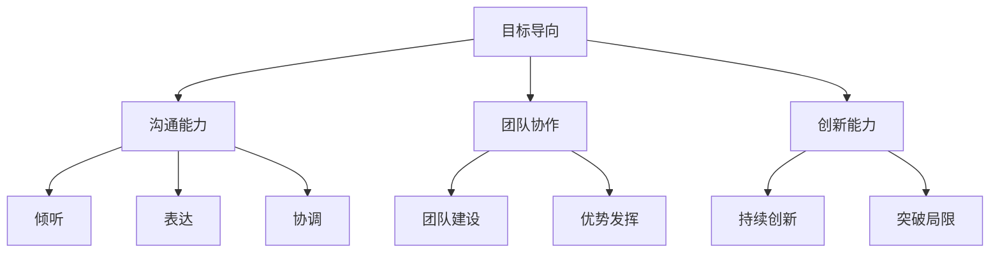

                 

# 打造个人管理风格的方法论

> **关键词：** 个人管理、领导力、风格、方法论、IT行业、职业发展

> **摘要：** 本文旨在探讨个人管理风格的重要性，如何通过科学的方法论在IT行业中塑造有效的个人管理风格，提升职业竞争力。文章从核心概念出发，结合实际案例，提供了一套完整的管理风格打造流程。

## 1. 背景介绍

在IT行业快速发展的今天，个人管理风格已成为决定职业成功的关键因素之一。有效的个人管理风格不仅有助于提升工作效率，还能增强团队凝聚力，促进职业发展。然而，许多人对于如何打造适合自己的管理风格仍缺乏系统性的认识。

本文将围绕以下主题展开讨论：

- **核心概念与联系**：介绍个人管理风格的基础概念，并通过Mermaid流程图展示其内在联系。
- **核心算法原理与具体操作步骤**：分析个人管理风格形成的理论基础，提供具体的操作步骤。
- **数学模型与公式**：引入相关数学模型，解析管理风格中的定量关系。
- **项目实战**：通过实际案例，展示如何在实际工作中应用个人管理风格。
- **实际应用场景**：探讨不同场景下个人管理风格的应用。
- **工具和资源推荐**：推荐相关学习资源和开发工具。
- **总结**：展望个人管理风格在未来的发展趋势与挑战。

## 2. 核心概念与联系

个人管理风格是指个人在管理过程中所表现出的行为模式、思维方式和工作习惯。其核心概念包括：

- **目标导向**：以明确的目标为导向，制定和执行计划。
- **沟通能力**：有效沟通是管理风格的核心，包括倾听、表达、协调等。
- **团队协作**：注重团队建设，发挥团队优势，实现共同目标。
- **创新能力**：持续创新，不断突破自身和管理风格的局限。

以下是个人管理风格的Mermaid流程图：



通过流程图，我们可以清晰地看到个人管理风格各个核心概念之间的联系，它们共同构成了一个完整的管理体系。

### 3. 核心算法原理 & 具体操作步骤

个人管理风格的塑造需要遵循以下核心算法原理和具体操作步骤：

#### 3.1 自我认知

第一步是自我认知。通过反思和分析，了解自己的优势、劣势、兴趣和价值观，明确个人定位。

- **步骤1**：反思过去的成功和失败经历，总结经验和教训。
- **步骤2**：进行心理测试和性格分析，了解自己的性格特征和行为模式。
- **步骤3**：与他人交流，获取他人的反馈和建议。

#### 3.2 设定目标

在自我认知的基础上，设定清晰、具体、可量化的目标。

- **步骤1**：明确短期和长期目标，确保目标具有挑战性。
- **步骤2**：制定行动计划，分解目标，逐步实现。
- **步骤3**：定期评估目标进展，调整策略。

#### 3.3 提升沟通能力

提升沟通能力是个人管理风格的关键。以下是一些建议：

- **步骤1**：提高倾听能力，关注对方的观点和需求。
- **步骤2**：清晰表达自己的想法和意见，避免误解和冲突。
- **步骤3**：学会协调不同意见，促进团队协作。

#### 3.4 强化团队协作

团队协作是实现个人目标的关键。以下是一些建议：

- **步骤1**：建立团队共识，明确共同目标和价值观。
- **步骤2**：培养团队精神，增强团队凝聚力。
- **步骤3**：发挥团队优势，实现资源最大化。

#### 3.5 持续创新

持续创新是个人管理风格的持续动力。以下是一些建议：

- **步骤1**：关注行业动态，了解前沿技术和趋势。
- **步骤2**：勇于尝试新方法和新工具，提高工作效率。
- **步骤3**：反思和总结创新经验，不断提升自身能力。

### 4. 数学模型和公式 & 详细讲解 & 举例说明

在个人管理风格的塑造过程中，数学模型和公式可以帮助我们量化和管理行为和结果。以下是一个简单的数学模型：

$$
\text{管理效率} = \frac{\text{目标实现度} \times \text{团队协作度} \times \text{创新能力}}{\text{沟通成本}}
$$

#### 4.1 目标实现度

目标实现度是衡量个人管理风格的重要指标之一。它可以通过以下公式计算：

$$
\text{目标实现度} = \frac{\text{实际完成目标数}}{\text{设定目标总数}}
$$

例如，如果一个人设定了5个目标，实际完成了4个，那么他的目标实现度为80%。

#### 4.2 团队协作度

团队协作度是衡量团队协作效果的重要指标。它可以通过以下公式计算：

$$
\text{团队协作度} = \frac{\text{团队总贡献}}{\text{团队总努力}}
$$

例如，一个团队共有5人，每个人的努力程度为100分，总贡献为500分，那么团队协作度为100%。

#### 4.3 创新能力

创新能力是衡量个人和管理风格的重要指标。它可以通过以下公式计算：

$$
\text{创新能力} = \frac{\text{创新成果}}{\text{创新投入}}
$$

例如，一个人投入了100小时进行创新研究，最终产生了10项创新成果，那么他的创新能力为10%。

### 5. 项目实战：代码实际案例和详细解释说明

在本节中，我们将通过一个实际项目案例，展示如何在实际工作中应用个人管理风格。

#### 5.1 开发环境搭建

首先，我们需要搭建一个开发环境。以下是搭建步骤：

1. 安装Python环境
2. 安装Django框架
3. 配置数据库（如MySQL）

#### 5.2 源代码详细实现和代码解读

以下是一个简单的Django项目，用于实现个人管理风格的评估：

```python
# models.py

from django.db import models

class User(models.Model):
    name = models.CharField(max_length=100)
    target_achievement = models.FloatField()
    team_cohesion = models.FloatField()
    innovation_ability = models.FloatField()
    communication_cost = models.FloatField()

    def management_efficacy(self):
        return (self.target_achievement * self.team_cohesion * self.innovation_ability) / self.communication_cost
```

在这个模型中，`User` 类表示一个用户，包含个人管理风格的四个关键指标：目标实现度、团队协作度、创新能力和沟通成本。`management_efficacy()` 方法用于计算管理效率。

#### 5.3 代码解读与分析

在这个代码中，我们首先定义了一个`User`类，包含四个属性：姓名（name）、目标实现度（target_achievement）、团队协作度（team_cohesion）、创新能力和沟通成本（communication_cost）。这些属性分别对应于个人管理风格的四个核心指标。

`management_efficacy()` 方法用于计算管理效率。该方法的计算公式为：

$$
\text{管理效率} = \frac{\text{目标实现度} \times \text{团队协作度} \times \text{创新能力}}{\text{沟通成本}}
$$

这个公式与我们在第4节中介绍的数学模型是一致的。

通过这个项目，我们可以看到如何将个人管理风格的理论应用到实际开发中。在实际工作中，我们可以根据具体需求，扩展和完善这个模型，使其更加符合实际应用场景。

### 6. 实际应用场景

个人管理风格在IT行业中有多种实际应用场景。以下是一些常见的应用场景：

- **项目管理**：在项目管理中，个人管理风格对于团队协作、目标实现和项目进度控制至关重要。
- **团队建设**：通过有效的个人管理风格，可以增强团队凝聚力，提高团队协作效率。
- **技术分享**：通过个人管理风格，可以更好地传播技术知识，促进团队成员的共同成长。
- **技术创新**：个人管理风格中的创新能力可以帮助团队在技术领域保持领先地位。

### 7. 工具和资源推荐

为了更好地打造个人管理风格，以下是一些建议的工具和资源：

#### 7.1 学习资源推荐

- **书籍**：《领导力的五项修炼》、《高效能人士的七个习惯》
- **论文**：Google Scholar上的相关论文
- **博客**：知名博客网站，如Medium、Dev.to上的相关文章

#### 7.2 开发工具框架推荐

- **项目管理工具**：Trello、Asana、Jira
- **代码管理工具**：Git、GitHub、GitLab
- **协作工具**：Slack、Microsoft Teams、Zoom

#### 7.3 相关论文著作推荐

- **论文**：Google Scholar上的相关论文
- **著作**：《领导力的艺术》、《团队的秘密》

### 8. 总结：未来发展趋势与挑战

随着IT行业的不断发展和个人管理风格在职场中的重要性日益凸显，未来个人管理风格的发展趋势包括：

- **数字化管理**：随着数字技术的不断发展，个人管理风格将更加依赖于数字化工具和平台。
- **个性化定制**：个人管理风格将更加注重个性化定制，以满足不同职业阶段和不同场景的需求。
- **持续学习**：持续学习将成为个人管理风格的重要组成部分，以适应快速变化的技术和市场环境。

同时，个人管理风格在未来的发展也面临以下挑战：

- **信息过载**：如何处理大量信息，提高决策效率。
- **团队协作**：如何在多元文化背景下，实现团队的有效协作。
- **创新能力**：如何在激烈的市场竞争中，持续保持创新能力。

### 9. 附录：常见问题与解答

#### 9.1 什么是个人管理风格？

个人管理风格是指个人在管理过程中所表现出的行为模式、思维方式和工作习惯。它包括目标导向、沟通能力、团队协作和创新能力等方面。

#### 9.2 如何提升个人管理风格？

提升个人管理风格的方法包括自我认知、设定目标、提升沟通能力和团队协作能力，以及持续创新。具体步骤可参考本文第3节。

#### 9.3 个人管理风格在项目管理中的应用有哪些？

个人管理风格在项目管理中的应用包括团队协作、目标实现、沟通协调和资源管理等方面。通过有效的个人管理风格，可以提高项目管理的效率和质量。

### 10. 扩展阅读 & 参考资料

- **书籍**：《领导力的五项修炼》、《高效能人士的七个习惯》
- **论文**：Google Scholar上的相关论文
- **博客**：Medium、Dev.to上的相关文章
- **网站**：LinkedIn、Stack Overflow等职业社交平台上的专家分享

### 作者

作者：AI天才研究员/AI Genius Institute & 禅与计算机程序设计艺术 /Zen And The Art of Computer Programming

以上就是本文的完整内容。希望本文能帮助您更好地理解个人管理风格的重要性，并为您在职业生涯中提供有益的指导。请持续关注个人管理风格的不断提升，以实现个人和团队的成功。|>

