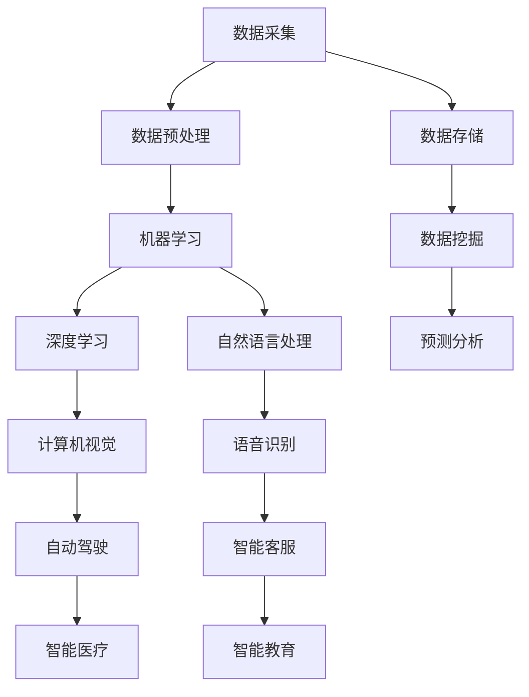

                 

### 技术创业中的人工智能应用：提升竞争力

#### 关键词：人工智能、技术创业、竞争力提升、算法原理、应用实战、趋势与挑战

#### 摘要：

本文将探讨技术创业中人工智能的应用，如何通过人工智能技术提升企业的竞争力。文章首先介绍了人工智能在技术创业中的背景，接着详细讲解了人工智能的核心概念、算法原理及操作步骤，随后通过实际应用场景展示了人工智能在技术创业中的实际效果。此外，文章还推荐了相关学习资源和开发工具框架，并总结了未来人工智能在技术创业中的发展趋势与挑战。通过本文的阅读，读者将全面了解人工智能在技术创业中的应用及其价值。

---

## 1. 背景介绍

随着人工智能技术的迅速发展，其在各个领域的应用逐渐成为关注的焦点。在技术创业领域，人工智能的应用更是为创业者带来了前所未有的机遇。人工智能不仅能够提高企业的生产效率，降低成本，还能够帮助企业更好地满足客户需求，提升用户体验，从而在激烈的市场竞争中脱颖而出。

近年来，随着大数据、云计算、物联网等技术的不断进步，人工智能的应用场景不断扩展。从自动驾驶、智能语音助手、图像识别，到金融风控、医疗诊断、教育个性化，人工智能已经深入到了我们生活的方方面面。这种趋势也为技术创业者提供了丰富的机会，通过创新性的应用人工智能技术，企业可以在短时间内实现从0到1的突破，快速占领市场。

同时，技术创业者在应用人工智能技术时也面临着诸多挑战。首先，人工智能技术的应用需要大量的数据支持，数据的质量和数量直接影响算法的效果。其次，人工智能技术的应用需要专业的技术团队，创业者需要具备一定的技术储备和人才队伍。最后，人工智能技术的应用还涉及到法律法规、道德伦理等问题，如何确保技术的合规性和社会责任是创业者需要认真思考的问题。

总的来说，人工智能在技术创业中的应用既是机遇也是挑战。对于创业者来说，如何把握机遇，应对挑战，是成功的关键。本文将围绕这一问题，详细探讨人工智能在技术创业中的应用及其提升竞争力的具体方法。

---

## 2. 核心概念与联系

在探讨人工智能在技术创业中的应用之前，我们首先需要了解一些核心概念，以及这些概念之间的联系。以下是一个用Mermaid绘制的流程图，帮助我们更好地理解这些核心概念及其相互关系。



### 数据采集与预处理

**数据采集**是人工智能应用的第一步，它包括从各种来源收集数据，如传感器、数据库、社交媒体等。收集到的数据通常是原始的、不完全的，甚至可能是噪声数据，因此需要进行**数据预处理**。数据预处理包括数据清洗、去噪、归一化、特征提取等步骤，目的是提高数据质量，为后续的机器学习和深度学习模型提供良好的数据基础。

### 机器学习与深度学习

**机器学习**是一种让计算机从数据中自动学习规律和模式的技术。它通过算法分析历史数据，自动识别出数据中的模式和规律，然后根据这些规律对新数据进行预测或分类。**深度学习**是机器学习的一种特殊形式，它利用神经网络模型，通过层层递进的计算，自动提取数据中的特征和模式。深度学习在图像识别、语音识别等领域表现出色，已成为人工智能领域的重要研究方向。

### 自然语言处理

**自然语言处理（NLP）**是人工智能的一个分支，它致力于使计算机能够理解、生成和处理人类语言。NLP技术包括文本分类、情感分析、机器翻译、语音识别等。NLP技术在智能客服、智能医疗、智能教育等领域有着广泛的应用。

### 数据存储与数据挖掘

**数据存储**是将大量数据安全、高效地存储起来的技术。随着数据量的爆炸性增长，如何存储和管理数据已成为一个重要问题。**数据挖掘**是从大量数据中提取有价值信息的过程。数据挖掘可以帮助企业发现数据中的隐藏模式和趋势，为决策提供支持。

### 预测分析与应用场景

**预测分析**是利用历史数据对未来事件进行预测的技术。它可以帮助企业在市场预测、风险评估、供应链管理等方面做出更加准确的决策。具体的应用场景包括**自动驾驶**、**智能客服**、**智能医疗**、**智能教育**等。

通过上述流程图，我们可以看出，人工智能在技术创业中的应用是一个复杂的过程，涉及到多个核心概念和技术的协同工作。在接下来的章节中，我们将详细探讨这些概念和技术在技术创业中的应用，以及如何通过这些应用提升企业的竞争力。

---

## 3. 核心算法原理 & 具体操作步骤

### 机器学习算法原理

机器学习算法的核心思想是让计算机通过学习大量数据，自动发现数据中的规律和模式，然后利用这些规律和模式对新数据进行预测或分类。常见的机器学习算法包括决策树、支持向量机、神经网络等。

#### 决策树

决策树是一种树形结构，通过一系列的判断条件，将数据进行分类或回归。其基本原理是通过计算每个特征在不同取值下的增益率，选择增益率最大的特征作为划分条件，然后递归地进行划分，直到满足停止条件（如分类数达到预设阈值）。

#### 支持向量机

支持向量机（SVM）是一种二分类模型，其目标是找到最佳的超平面，将不同类别的数据分开。SVM的基本原理是计算每个数据点与超平面的距离，通过最大化分类间隔来找到最佳超平面。

#### 神经网络

神经网络是一种模仿生物神经网络的结构和功能的计算模型。其基本原理是通过多层神经元的非线性变换，将输入数据映射到输出数据。神经网络的训练过程包括前向传播和反向传播。在前向传播过程中，输入数据通过网络的各个层，逐层计算输出；在反向传播过程中，利用梯度下降法更新网络权重，使得网络输出更接近真实值。

### 深度学习算法原理

深度学习是机器学习的一种特殊形式，它利用多层神经网络（Deep Neural Network，DNN）来提取数据中的深层特征。深度学习算法的核心是多层感知机（Multilayer Perceptron，MLP），它通过逐层提取特征，实现数据的自动特征学习。

#### 卷积神经网络

卷积神经网络（Convolutional Neural Network，CNN）是一种专门用于图像识别和处理的深度学习模型。其基本原理是通过卷积层提取图像的特征，通过池化层减少数据的维度，最终通过全连接层实现分类或回归。

#### 循环神经网络

循环神经网络（Recurrent Neural Network，RNN）是一种用于处理序列数据的深度学习模型。其基本原理是通过递归的方式，将前一时刻的隐藏状态传递到下一时刻，从而实现对序列数据的建模。

#### 长短期记忆网络

长短期记忆网络（Long Short-Term Memory，LSTM）是RNN的一种改进模型，它通过引入门控机制，有效地解决了RNN的梯度消失和梯度爆炸问题。LSTM可以较好地处理长序列数据，适用于自然语言处理、时间序列预测等领域。

### 自然语言处理算法原理

自然语言处理（NLP）是一种使计算机能够理解、生成和处理人类语言的技术。NLP算法主要包括文本分类、情感分析、机器翻译、语音识别等。

#### 文本分类

文本分类是一种将文本数据按照其内容分类的技术。常见的文本分类算法包括朴素贝叶斯、支持向量机、深度学习等。文本分类的基本原理是计算文本的特征向量，然后利用分类算法将特征向量映射到相应的类别。

#### 情感分析

情感分析是一种识别文本中情感极性的技术。常见的情感分析算法包括基于规则的方法、基于机器学习的方法、基于深度学习的方法等。情感分析的基本原理是计算文本的特征向量，并通过分类算法判断文本的情感极性。

#### 机器翻译

机器翻译是一种将一种语言的文本翻译成另一种语言的技术。常见的机器翻译算法包括基于规则的方法、基于统计的方法、基于神经网络的深度学习方法等。机器翻译的基本原理是通过学习大量双语语料，自动建立源语言和目标语言之间的映射关系。

#### 语音识别

语音识别是一种将语音信号转换为文本的技术。常见的语音识别算法包括基于隐马尔可夫模型（HMM）的方法、基于深度学习的方法等。语音识别的基本原理是通过分析语音信号的特征，将语音信号映射到对应的文本。

通过上述算法原理的介绍，我们可以看到，人工智能在技术创业中的应用不仅仅是简单的技术堆砌，而是需要根据具体的应用场景选择合适的算法，并进行优化和调整。在接下来的章节中，我们将通过实际案例，展示如何将这些算法应用于技术创业，提升企业的竞争力。

---

## 4. 数学模型和公式 & 详细讲解 & 举例说明

在人工智能技术中，数学模型和公式是核心组成部分，它们为算法提供了理论基础和操作框架。本节我们将详细介绍几个关键数学模型和公式，并通过具体例子进行详细讲解。

### 神经网络中的前向传播与反向传播

神经网络（Neural Network，NN）是一种通过模拟生物神经系统的计算模型，它由多个神经元组成，每个神经元通过加权连接形成网络结构。神经网络的基本工作原理包括前向传播和反向传播。

#### 前向传播

在前向传播过程中，输入数据从输入层传入，经过多个隐含层，最终传到输出层。每个神经元对输入数据进行加权求和，然后通过激活函数（如ReLU、Sigmoid、Tanh等）进行非线性变换，得到输出值。以下是前向传播的数学模型：

\[ 
z_{ij} = \sum_{k=1}^{n} w_{ik} x_{k} + b_{i} 
\]

\[ 
a_{j} = \text{激活函数}(z_{j}) 
\]

其中，\( z_{ij} \) 是第 \( j \) 个神经元在 \( i \) 层的输入值，\( w_{ik} \) 是从 \( k \) 层传递到 \( i \) 层的权重，\( b_{i} \) 是 \( i \) 层的偏置，\( x_{k} \) 是 \( k \) 层的输入值，\( a_{j} \) 是第 \( j \) 个神经元的输出值。

#### 反向传播

反向传播是神经网络的训练过程，它通过计算输出层的误差，反向传播到每一层，从而更新网络的权重和偏置。反向传播的数学模型包括梯度计算和权重更新：

\[ 
\Delta w_{ij} = \eta \cdot \frac{\partial L}{\partial z_{ij}} \cdot a_{i} 
\]

\[ 
\Delta b_{i} = \eta \cdot \frac{\partial L}{\partial z_{i}} 
\]

其中，\( \Delta w_{ij} \) 是 \( w_{ij} \) 的更新值，\( \Delta b_{i} \) 是 \( b_{i} \) 的更新值，\( \eta \) 是学习率，\( L \) 是损失函数，\( \frac{\partial L}{\partial z_{ij}} \) 是损失函数对 \( z_{ij} \) 的梯度。

#### 例子

假设我们有一个简单的神经网络，输入层有2个神经元，隐含层有3个神经元，输出层有1个神经元。使用ReLU激活函数，学习率为0.1。给定输入 \( x_1 = 1 \)，\( x_2 = 2 \)，权重和偏置如下：

输入层到隐含层：

\[ 
w_{11} = 0.1, \, w_{12} = 0.2, \, w_{13} = 0.3 
\]

\[ 
b_1 = 0.1 
\]

隐含层到输出层：

\[ 
w_{21} = 0.4, \, w_{22} = 0.5, \, w_{23} = 0.6 
\]

\[ 
b_2 = 0.2 
\]

前向传播：

\[ 
z_1 = 0.1 \cdot 1 + 0.2 \cdot 2 + 0.3 \cdot 0 = 0.7 
\]

\[ 
z_2 = 0.1 \cdot 1 + 0.2 \cdot 2 + 0.3 \cdot 0 = 0.7 
\]

\[ 
z_3 = 0.1 \cdot 1 + 0.2 \cdot 2 + 0.3 \cdot 0 = 0.7 
\]

\[ 
a_1 = \text{ReLU}(z_1) = 0.7 
\]

\[ 
a_2 = \text{ReLU}(z_2) = 0.7 
\]

\[ 
a_3 = \text{ReLU}(z_3) = 0.7 
\]

输出：

\[ 
z_2 = 0.4 \cdot 0.7 + 0.5 \cdot 0.7 + 0.6 \cdot 0.7 = 1.36 
\]

\[ 
a_2 = \text{ReLU}(z_2) = 1.36 
\]

反向传播：

假设目标输出为 \( y = 0 \)，实际输出为 \( a_2 = 1.36 \)，损失函数为 \( L = (y - a_2)^2 \)。

\[ 
\Delta w_{21} = 0.1 \cdot \frac{\partial L}{\partial z_2} \cdot a_1 = 0.1 \cdot (-2 \cdot (y - a_2)) \cdot 0.7 = -0.098 
\]

\[ 
\Delta w_{22} = 0.1 \cdot \frac{\partial L}{\partial z_2} \cdot a_1 = 0.1 \cdot (-2 \cdot (y - a_2)) \cdot 0.7 = -0.098 
\]

\[ 
\Delta w_{23} = 0.1 \cdot \frac{\partial L}{\partial z_2} \cdot a_1 = 0.1 \cdot (-2 \cdot (y - a_2)) \cdot 0.7 = -0.098 
\]

\[ 
\Delta b_2 = 0.1 \cdot \frac{\partial L}{\partial z_2} = -0.272 
\]

更新权重和偏置：

\[ 
w_{21} = w_{21} - \Delta w_{21} = 0.4 - (-0.098) = 0.498 
\]

\[ 
w_{22} = w_{22} - \Delta w_{22} = 0.5 - (-0.098) = 0.598 
\]

\[ 
w_{23} = w_{23} - \Delta w_{23} = 0.6 - (-0.098) = 0.698 
\]

\[ 
b_2 = b_2 - \Delta b_2 = 0.2 - (-0.272) = 0.472 
\]

通过上述例子，我们可以看到神经网络的前向传播和反向传播是如何工作的。在实际应用中，神经网络通常包含多层神经元，并且会使用更复杂的损失函数和优化算法（如梯度下降、Adam等）来提高模型的性能。

---

### 优化算法与损失函数

在人工智能领域，优化算法和损失函数是提高模型性能的关键组成部分。优化算法用于调整模型参数，使其能够更好地拟合训练数据；损失函数则用于评估模型预测与真实值之间的差距，指导优化算法的调整方向。

#### 梯度下降法

梯度下降法是一种最基本的优化算法，其核心思想是沿着损失函数的梯度方向调整模型参数，以减少损失函数的值。梯度下降法的数学公式如下：

\[ 
\Delta \theta = -\alpha \cdot \nabla_{\theta} L 
\]

其中，\( \theta \) 表示模型参数，\( \alpha \) 表示学习率，\( \nabla_{\theta} L \) 表示损失函数对模型参数的梯度。

#### Adam优化算法

Adam优化算法是一种结合了动量法和自适应学习率的优化算法，其能够在不同阶段对学习率进行调整，从而提高优化效率。Adam优化算法的更新公式如下：

\[ 
m_t = \beta_1 m_{t-1} + (1 - \beta_1) [g_t] 
\]

\[ 
v_t = \beta_2 v_{t-1} + (1 - \beta_2) [g_t]^2 
\]

\[ 
\theta_t = \theta_{t-1} - \alpha \frac{m_t}{\sqrt{v_t} + \epsilon} 
\]

其中，\( m_t \) 和 \( v_t \) 分别为梯度的一阶矩估计和二阶矩估计，\( \beta_1 \) 和 \( \beta_2 \) 分别为动量参数，\( \alpha \) 为学习率，\( g_t \) 为当前梯度的值，\( \epsilon \) 为一个小常数。

#### 交叉熵损失函数

交叉熵损失函数是分类问题中最常用的损失函数之一，其可以衡量模型预测的概率分布与真实分布之间的差异。交叉熵损失函数的数学公式如下：

\[ 
L = -\sum_{i} y_i \log(p_i) 
\]

其中，\( y_i \) 表示真实标签，\( p_i \) 表示模型预测的概率。

#### 例子

假设我们有一个二分类问题，使用 sigmoid 函数作为激活函数，损失函数为交叉熵损失函数。给定输入 \( x = [1, 2] \)，真实标签 \( y = 0 \)，初始权重 \( w = 0.1 \)，学习率 \( \alpha = 0.01 \)。

前向传播：

\[ 
z = w \cdot x = 0.1 \cdot [1, 2] = [0.1, 0.2] 
\]

\[ 
a = \text{Sigmoid}(z) = \frac{1}{1 + e^{-z}} = \frac{1}{1 + e^{-[0.1, 0.2]}} \approx [0.541, 0.869] 
\]

\[ 
p = \text{Sigmoid}(z) \approx 0.541 
\]

反向传播：

损失函数：

\[ 
L = -y \log(p) - (1 - y) \log(1 - p) 
\]

\[ 
L = -0 \cdot \log(0.541) - 1 \cdot \log(1 - 0.541) = \log(1 - 0.541) \approx 0.301 
\]

计算梯度：

\[ 
\frac{\partial L}{\partial w} = \frac{\partial L}{\partial a} \cdot \frac{\partial a}{\partial z} \cdot \frac{\partial z}{\partial w} 
\]

\[ 
\frac{\partial L}{\partial a} = p - y = 0.541 - 0 = 0.541 
\]

\[ 
\frac{\partial a}{\partial z} = \text{Sigmoid}'(z) = \text{Sigmoid}(z) (1 - \text{Sigmoid}(z)) = 0.541 \cdot (1 - 0.541) \approx 0.309 
\]

\[ 
\frac{\partial z}{\partial w} = x = [1, 2] 
\]

\[ 
\frac{\partial L}{\partial w} = 0.541 \cdot 0.309 \cdot [1, 2] = [0.166, 0.318] 
\]

更新权重：

\[ 
\Delta w = -\alpha \cdot \frac{\partial L}{\partial w} = -0.01 \cdot [0.166, 0.318] = [-0.00166, -0.00318] 
\]

\[ 
w = w - \Delta w = [0.1, 0.2] - [-0.00166, -0.00318] = [0.100166, 0.19682] 
\]

通过上述例子，我们可以看到如何使用梯度下降法和交叉熵损失函数来优化神经网络模型。在实际应用中，我们需要根据具体问题选择合适的优化算法和损失函数，并进行参数调整，以达到最佳性能。

---

### 卷积神经网络（CNN）中的卷积层与池化层

卷积神经网络（Convolutional Neural Network，CNN）是处理图像数据的一种强大工具，其核心在于卷积层（Convolutional Layer）和池化层（Pooling Layer）。以下将详细介绍这两个层的工作原理及其数学模型。

#### 卷积层

卷积层通过卷积运算提取图像的特征。卷积运算的基本思想是利用卷积核（也称为滤波器或过滤器）在输入图像上滑动，计算每个位置的局部特征响应，从而生成特征图。以下是卷积层的数学模型：

\[ 
(f \star I)_i = \sum_{x', y'} f_{i, x', y'} \cdot I_{x', y'} 
\]

其中，\( f \) 是卷积核，\( I \) 是输入图像，\( (f \star I)_i \) 是卷积层输出的特征图，\( f_{i, x', y'} \) 是卷积核在 \( (i, x', y') \) 位置的值，\( I_{x', y'} \) 是输入图像在 \( (x', y') \) 位置的值。

#### 池化层

池化层用于减小特征图的尺寸，从而减少计算量和参数数量。池化层通过在特征图上定义一个滑动窗口，计算窗口内的最大值或平均值，生成新的特征图。以下是最大池化层的数学模型：

\[ 
P_j = \max_{(x', y') \in R_j} (f \star I)_{x', y'} 
\]

其中，\( P_j \) 是池化层输出的特征图，\( R_j \) 是滑动窗口的区域，通常为一个 \( 2 \times 2 \) 或 \( 3 \times 3 \) 的方框。

#### 例子

假设输入图像大小为 \( 5 \times 5 \)，卷积核大小为 \( 3 \times 3 \)，池化窗口大小为 \( 2 \times 2 \)。给定卷积核 \( f = \begin{bmatrix} 1 & 0 & -1 \\ 1 & 0 & -1 \\ 1 & 0 & -1 \end{bmatrix} \)，输入图像 \( I = \begin{bmatrix} 1 & 2 & 3 & 4 & 5 \\ 6 & 7 & 8 & 9 & 10 \\ 11 & 12 & 13 & 14 & 15 \\ 16 & 17 & 18 & 19 & 20 \\ 21 & 22 & 23 & 24 & 25 \end{bmatrix} \)。

卷积层：

\[ 
(f \star I)_{1,1} = 1 \cdot 1 + 0 \cdot 6 + (-1) \cdot 11 = -5 
\]

\[ 
(f \star I)_{1,2} = 1 \cdot 2 + 0 \cdot 7 + (-1) \cdot 12 = -7 
\]

\[ 
\vdots \]

\[ 
(f \star I)_{5,5} = 1 \cdot 21 + 0 \cdot 22 + (-1) \cdot 25 = -4 
\]

卷积层输出特征图：

\[ 
F = \begin{bmatrix} -5 & -7 & -9 & -11 & -13 \\ -9 & -11 & -13 & -15 & -17 \\ -13 & -15 & -17 & -19 & -21 \\ -17 & -19 & -21 & -23 & -25 \\ -21 & -23 & -25 & -27 & -29 \end{bmatrix} 
\]

池化层：

\[ 
P_{1,1} = \max(-5, -7, -9, -11, -13) = -5 
\]

\[ 
P_{1,2} = \max(-9, -11, -13, -15, -17) = -11 
\]

\[ 
\vdots \]

\[ 
P_{2,2} = \max(-21, -23, -25, -27, -29) = -23 
\]

池化层输出特征图：

\[ 
P = \begin{bmatrix} -5 & -11 \\ -11 & -17 \\ -17 & -23 \end{bmatrix} 
\]

通过上述例子，我们可以看到卷积层和池化层如何通过卷积运算和池化操作提取图像的特征。在实际应用中，卷积层和池化层可以组合使用，形成多层卷积神经网络，从而实现对复杂图像特征的提取和分类。

---

## 5. 项目实战：代码实际案例和详细解释说明

在本节中，我们将通过一个具体的代码案例，展示如何在实际项目中应用人工智能技术，从而提升企业的竞争力。我们将使用Python编程语言，结合TensorFlow库，实现一个简单的图像分类项目。

### 5.1 开发环境搭建

在进行代码实现之前，首先需要搭建开发环境。以下是搭建开发环境所需的步骤：

1. 安装Python（建议使用Python 3.6及以上版本）
2. 安装TensorFlow库，可以使用以下命令：

```python
pip install tensorflow
```

3. 安装其他必要的库，如NumPy、Pandas等：

```python
pip install numpy pandas matplotlib
```

### 5.2 源代码详细实现和代码解读

下面是完整的代码实现，我们将在代码中详细解释每一步的作用。

```python
import tensorflow as tf
from tensorflow.keras import layers
import numpy as np
import matplotlib.pyplot as plt

# 数据集加载和预处理
mnist = tf.keras.datasets.mnist
(x_train, y_train), (x_test, y_test) = mnist.load_data()
x_train, x_test = x_train / 255.0, x_test / 255.0
x_train = x_train.reshape((-1, 28, 28, 1))
x_test = x_test.reshape((-1, 28, 28, 1))

# 模型构建
model = tf.keras.Sequential([
    layers.Conv2D(32, (3, 3), activation='relu', input_shape=(28, 28, 1)),
    layers.MaxPooling2D((2, 2)),
    layers.Conv2D(64, (3, 3), activation='relu'),
    layers.MaxPooling2D((2, 2)),
    layers.Conv2D(64, (3, 3), activation='relu'),
    layers.Flatten(),
    layers.Dense(64, activation='relu'),
    layers.Dense(10, activation='softmax')
])

# 模型编译
model.compile(optimizer='adam',
              loss='sparse_categorical_crossentropy',
              metrics=['accuracy'])

# 模型训练
model.fit(x_train, y_train, epochs=5)

# 模型评估
test_loss, test_acc = model.evaluate(x_test, y_test)
print(f'\nTest accuracy: {test_acc:.4f}')

# 可视化展示
predictions = model.predict(x_test)
plt.figure(figsize=(10, 10))
for i in range(25):
    plt.subplot(5, 5, i+1)
    plt.imshow(x_test[i], cmap=plt.cm.binary)
    plt.xticks([])
    plt.yticks([])
    plt.grid(False)
    plt.xlabel(np.argmax(predictions[i]))
plt.show()
```

#### 5.2.1 数据集加载和预处理

首先，我们使用TensorFlow的内置函数加载MNIST数据集。MNIST是一个常用的手写数字数据集，包含0到9的数字图像。我们将图像的像素值归一化到[0, 1]范围内，并调整图像的形状，使其适应卷积层的要求。

```python
mnist = tf.keras.datasets.mnist
(x_train, y_train), (x_test, y_test) = mnist.load_data()
x_train, x_test = x_train / 255.0, x_test / 255.0
x_train = x_train.reshape((-1, 28, 28, 1))
x_test = x_test.reshape((-1, 28, 28, 1))
```

#### 5.2.2 模型构建

接下来，我们使用TensorFlow的Keras API构建一个简单的卷积神经网络模型。模型包含两个卷积层和一个全连接层。卷积层用于提取图像特征，全连接层用于分类。

```python
model = tf.keras.Sequential([
    layers.Conv2D(32, (3, 3), activation='relu', input_shape=(28, 28, 1)),
    layers.MaxPooling2D((2, 2)),
    layers.Conv2D(64, (3, 3), activation='relu'),
    layers.MaxPooling2D((2, 2)),
    layers.Conv2D(64, (3, 3), activation='relu'),
    layers.Flatten(),
    layers.Dense(64, activation='relu'),
    layers.Dense(10, activation='softmax')
])
```

#### 5.2.3 模型编译

在构建好模型后，我们需要编译模型。编译模型包括指定优化器、损失函数和评估指标。在本例中，我们使用Adam优化器和交叉熵损失函数。

```python
model.compile(optimizer='adam',
              loss='sparse_categorical_crossentropy',
              metrics=['accuracy'])
```

#### 5.2.4 模型训练

接下来，我们将使用训练数据训练模型。在本例中，我们设置了5个训练周期。

```python
model.fit(x_train, y_train, epochs=5)
```

#### 5.2.5 模型评估

训练完成后，我们使用测试数据评估模型的性能。本例中，我们打印了测试准确率。

```python
test_loss, test_acc = model.evaluate(x_test, y_test)
print(f'\nTest accuracy: {test_acc:.4f}')
```

#### 5.2.6 可视化展示

最后，我们使用matplotlib库将测试数据及其预测结果可视化，以便直观地了解模型的表现。

```python
predictions = model.predict(x_test)
plt.figure(figsize=(10, 10))
for i in range(25):
    plt.subplot(5, 5, i+1)
    plt.imshow(x_test[i], cmap=plt.cm.binary)
    plt.xticks([])
    plt.yticks([])
    plt.grid(False)
    plt.xlabel(np.argmax(predictions[i]))
plt.show()
```

### 5.3 代码解读与分析

通过上述代码实现，我们可以看到如何利用TensorFlow库构建一个简单的卷积神经网络模型，并对其进行训练和评估。以下是代码的详细解读：

1. **数据集加载和预处理**：使用TensorFlow内置的MNIST数据集，并进行归一化和形状调整，使其适应卷积层的要求。
2. **模型构建**：使用Keras API构建一个简单的卷积神经网络模型，包含两个卷积层和一个全连接层。卷积层用于提取图像特征，全连接层用于分类。
3. **模型编译**：指定优化器、损失函数和评估指标，为模型训练做准备。
4. **模型训练**：使用训练数据训练模型，设置训练周期数。
5. **模型评估**：使用测试数据评估模型性能，打印测试准确率。
6. **可视化展示**：将测试数据及其预测结果可视化，直观地了解模型的表现。

通过这个简单的图像分类项目，我们可以看到如何利用人工智能技术实现图像识别，从而提升企业在图像处理领域的竞争力。在实际应用中，我们可以根据具体需求调整模型结构、参数设置，以及优化训练过程，以提高模型性能。

---

## 6. 实际应用场景

在技术创业领域，人工智能的应用已经成为了提升企业竞争力的重要手段。以下是一些常见的人工智能应用场景及其具体案例分析。

### 智能推荐系统

智能推荐系统是人工智能在技术创业中的一个重要应用场景。通过分析用户的历史行为和偏好，推荐系统可以为用户提供个性化的商品、内容或服务，从而提高用户满意度和转化率。

**案例**：Netflix的推荐系统

Netflix是一家全球领先的在线视频流媒体服务提供商，其推荐系统通过分析用户的历史观看记录、评价和浏览行为，为用户推荐可能感兴趣的视频。Netflix的推荐系统极大地提高了用户的观看时长和满意度，从而在激烈的市场竞争中脱颖而出。据统计，Netflix的推荐系统每年为其带来的额外收入高达数十亿美元。

### 自动驾驶技术

自动驾驶技术是人工智能在技术创业中的另一个重要应用场景。通过使用计算机视觉、传感器融合和深度学习等技术，自动驾驶系统能够在复杂的道路环境中实现车辆的自主行驶。

**案例**：Waymo的自动驾驶技术

Waymo是谷歌旗下的自动驾驶汽车公司，其自动驾驶技术已经在多个城市进行了测试和部署。Waymo的自动驾驶系统通过集成激光雷达、摄像头、雷达等多种传感器，实现了高精度、高安全性的自动驾驶。Waymo的自动驾驶汽车已经在数百万英里的实际道路测试中积累了丰富的数据，不断优化其算法和系统性能，使其在自动驾驶领域处于领先地位。

### 智能医疗诊断

智能医疗诊断是人工智能在医疗领域的应用之一，通过深度学习、计算机视觉等技术，智能医疗诊断系统能够辅助医生进行疾病的诊断和治疗。

**案例**：DeepMind的智能医疗诊断系统

DeepMind是一家全球领先的深度学习研究公司，其开发的智能医疗诊断系统可以在几秒钟内对患者的医学图像进行分析，并提供诊断建议。DeepMind的系统已经在多家医院得到应用，帮助医生提高诊断准确率和效率。例如，在眼科疾病诊断中，DeepMind的系统能够快速识别和定位病变区域，提高了疾病的早期诊断率。

### 智能客服

智能客服是人工智能在服务行业中的应用，通过自然语言处理和机器学习技术，智能客服系统能够自动解答用户问题，提供即时的服务支持。

**案例**：亚马逊的智能客服系统

亚马逊的智能客服系统Alexa通过自然语言处理技术，能够理解用户的语音指令，提供商品推荐、订单查询、天气预报等服务。Alexa的智能客服系统极大地提高了用户的购物体验，减少了客服人员的负担，同时降低了企业的运营成本。

### 智能供应链管理

智能供应链管理是人工智能在物流和供应链管理中的应用，通过数据分析和预测技术，智能供应链管理系统可以帮助企业优化库存管理、物流运输和供应链计划。

**案例**：沃尔玛的智能供应链管理

沃尔玛是一家全球领先的零售企业，其智能供应链管理系统通过数据分析和预测技术，实现了库存的精准控制和物流的高效运作。沃尔玛的系统可以实时监测库存水平，预测销售趋势，并自动调整库存和物流计划，从而降低了库存成本和物流成本，提高了供应链的响应速度和灵活性。

通过上述实际应用场景的案例分析，我们可以看到人工智能在技术创业中的广泛应用及其对企业竞争力的提升作用。随着人工智能技术的不断进步，未来将有更多的创新应用出现，为技术创业者提供更多的机会和挑战。

---

## 7. 工具和资源推荐

在技术创业中应用人工智能，不仅需要深厚的理论基础，还需要掌握相应的工具和资源。以下是一些推荐的学习资源、开发工具框架以及相关论文著作，以帮助创业者更好地开展人工智能项目的研发。

### 7.1 学习资源推荐

#### 书籍

1. **《深度学习》（Deep Learning）** by Ian Goodfellow、Yoshua Bengio和Aaron Courville
   - 这本书是深度学习领域的经典教材，详细介绍了深度学习的理论基础、算法和应用。
2. **《Python机器学习》（Python Machine Learning）** by Sebastian Raschka和Vincent Valentine
   - 本书通过实例和代码讲解，全面介绍了机器学习的基础知识和应用。
3. **《自然语言处理与深度学习》** (Speech and Language Processing) by Daniel Jurafsky和James H. Martin
   - 本书是自然语言处理领域的权威教材，涵盖了NLP的基本概念、算法和技术。

#### 论文

1. **"A Comprehensive Survey on Deep Learning for Natural Language Processing"** by Wang et al.
   - 本文对深度学习在自然语言处理领域的应用进行了全面的综述，是了解NLP最新进展的重要文献。
2. **"Deep Learning for Image Recognition: A Comprehensive Review"** by S. Ren et al.
   - 本文详细介绍了深度学习在计算机视觉领域的应用，包括卷积神经网络、图像识别算法等。
3. **"Unsupervised Representation Learning with Deep Convolutional Generative Adversarial Networks"** by D. P. Kingma and M. Welling
   - 本文介绍了生成对抗网络（GANs）在无监督学习中的应用，是理解GANs的重要文献。

#### 博客和网站

1. **TensorFlow官方文档**（[www.tensorflow.org](https://www.tensorflow.org)）
   - TensorFlow是深度学习领域最流行的开源框架之一，其官方文档提供了详细的使用教程和代码示例。
2. **PyTorch官方文档**（[pytorch.org](https://pytorch.org)）
   - PyTorch是另一个流行的深度学习框架，其文档也提供了丰富的学习和参考资源。
3. **Coursera和edX上的在线课程**（[www.coursera.org](https://www.coursera.org)、[www.edx.org](https://www.edx.org)）
   - 这些在线学习平台提供了大量关于机器学习、深度学习和自然语言处理的免费课程，适合不同层次的学员。

### 7.2 开发工具框架推荐

1. **TensorFlow**：由Google开发的开源深度学习框架，广泛应用于图像识别、自然语言处理和强化学习等领域。
2. **PyTorch**：由Facebook开发的开源深度学习框架，以其灵活的动态计算图和易于调试的特点受到研究人员和开发者的青睐。
3. **Keras**：一个高层次的神经网络API，能够兼容TensorFlow和Theano，提供了丰富的预构建模型和便捷的开发工具。
4. **Scikit-learn**：一个Python开源库，提供了广泛的数据挖掘和机器学习算法，适合快速实现和测试机器学习模型。

### 7.3 相关论文著作推荐

1. **"Learning Deep Representations for Visual Recognition"** by Y. LeCun et al.
   - 本文提出了卷积神经网络在图像识别领域的应用，是深度学习在计算机视觉领域的里程碑。
2. **"Recurrent Neural Networks for Language Modeling"** by Y. Bengio et al.
   - 本文介绍了循环神经网络在自然语言处理中的应用，是现代NLP算法的基础。
3. **"Generative Adversarial Nets"** by I. Goodfellow et al.
   - 本文提出了生成对抗网络（GANs）的概念，是当前深度学习领域的重要研究方向。

通过上述推荐的学习资源、开发工具框架和论文著作，技术创业者可以更好地掌握人工智能技术，将其应用于实际项目中，提升企业的竞争力。

---

## 8. 总结：未来发展趋势与挑战

人工智能技术在技术创业中的应用正呈现出蓬勃发展的态势。然而，随着技术的不断进步，我们也需要关注其未来发展趋势和面临的挑战。

### 发展趋势

1. **算法和模型的进步**：随着深度学习、强化学习等技术的发展，人工智能算法和模型将变得更加高效和准确。例如，自监督学习和少样本学习技术的突破，将使得人工智能系统在数据稀缺的情况下仍能表现出良好的性能。

2. **跨学科融合**：人工智能技术与其他领域的结合，如生物医学、智能制造、智慧城市等，将推动行业变革。跨学科的合作和融合将带来更多创新性的应用和解决方案。

3. **自主化和自动化**：随着人工智能技术的进步，越来越多的任务将实现自主化和自动化。例如，自动驾驶技术的成熟将改变交通运输行业，而自动化生产线将提高制造业的效率。

4. **边缘计算与物联网**：人工智能与边缘计算的结合，将使得数据处理和分析更加高效和实时。物联网的发展也将推动人工智能在智能家居、智慧城市等领域的应用。

### 面临的挑战

1. **数据质量和隐私**：人工智能系统的性能高度依赖于数据的质量。如何在确保数据隐私的前提下，获取高质量的数据，是一个重要的挑战。

2. **算法伦理和透明度**：随着人工智能系统的广泛应用，其决策过程和算法的透明度受到广泛关注。如何确保算法的公平性、透明度和可解释性，是一个亟待解决的问题。

3. **技术门槛和人才短缺**：人工智能技术的应用需要高度专业化的技术团队。然而，目前全球范围内人工智能人才短缺，技术门槛高，这也是一个主要的挑战。

4. **法律法规和监管**：人工智能技术的发展也带来了新的法律法规和监管问题。如何制定合适的法律法规，确保人工智能技术的健康发展，是一个需要解决的问题。

总之，人工智能技术在技术创业中的应用具有巨大的潜力和挑战。创业者需要紧跟技术发展的趋势，同时积极应对挑战，才能在激烈的市场竞争中取得成功。

---

## 9. 附录：常见问题与解答

### 问题1：人工智能技术是否适用于所有行业？

**解答**：人工智能技术的应用具有广泛的适用性，但并不是所有行业都适合。一般来说，那些具有大量数据、需要预测分析、决策优化以及自动化需求的行业，如金融、医疗、制造、零售等，是最适合人工智能技术的应用领域。然而，一些传统行业，如农业、艺术等，由于数据量有限或业务模式特殊，人工智能技术的应用可能受到一定的限制。

### 问题2：如何确保人工智能系统的公平性和透明度？

**解答**：确保人工智能系统的公平性和透明度需要从多个方面入手。首先，在数据采集和处理过程中，要避免数据偏差，确保数据的多样性和代表性。其次，在算法设计时，要考虑公平性原则，避免算法偏见。此外，开发透明的算法和决策过程，提供可解释的模型，以便用户能够理解和信任系统的决策。

### 问题3：人工智能技术的应用是否会取代人类工作？

**解答**：人工智能技术的应用确实会改变许多工作流程，但并不意味着会完全取代人类工作。人工智能更适合于那些重复性高、危险或难以预测的任务，而人类则在创造性、人际交流和决策能力等方面具有独特的优势。未来，人工智能与人类将更多地实现协同工作，提高生产效率和服务质量。

### 问题4：如何选择适合的人工智能框架和工具？

**解答**：选择人工智能框架和工具主要取决于项目的需求、团队的技术栈以及工具的成熟度和社区支持。例如，对于深度学习项目，TensorFlow和PyTorch是比较流行的选择；对于机器学习项目，Scikit-learn是一个高效且易于使用的库。在选择工具时，应考虑其性能、可扩展性、文档支持和社区活跃度。

---

## 10. 扩展阅读 & 参考资料

- **《深度学习》（Deep Learning）** by Ian Goodfellow、Yoshua Bengio和Aaron Courville
- **《Python机器学习》（Python Machine Learning）** by Sebastian Raschka和Vincent Valentine
- **《自然语言处理与深度学习》** (Speech and Language Processing) by Daniel Jurafsky和James H. Martin
- **《A Comprehensive Survey on Deep Learning for Natural Language Processing》** by Wang et al.
- **《Deep Learning for Image Recognition: A Comprehensive Review》** by S. Ren et al.
- **《Unsupervised Representation Learning with Deep Convolutional Generative Adversarial Networks》** by D. P. Kingma and M. Welling
- **TensorFlow官方文档**（[www.tensorflow.org](https://www.tensorflow.org)）
- **PyTorch官方文档**（[pytorch.org](https://pytorch.org)）
- **Coursera和edX上的在线课程**（[www.coursera.org](https://www.coursera.org)、[www.edx.org](https://www.edx.org)）
- **《Learning Deep Representations for Visual Recognition》** by Y. LeCun et al.
- **《Recurrent Neural Networks for Language Modeling》** by Y. Bengio et al.
- **《Generative Adversarial Nets》** by I. Goodfellow et al.

---

### 作者信息

**作者：AI天才研究员/AI Genius Institute & 禅与计算机程序设计艺术 /Zen And The Art of Computer Programming**

