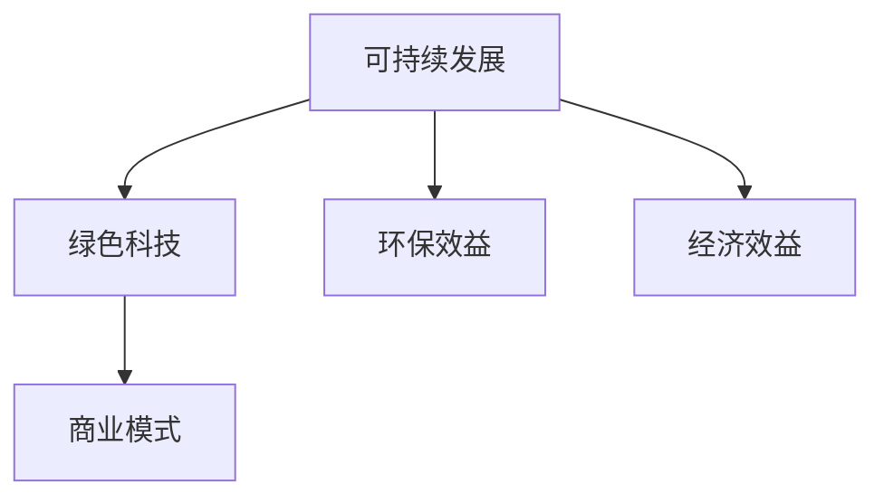

                 

# 技术创业中的绿色科技：可持续发展的商机

## 概述

随着全球气候变化和环境问题的日益严峻，绿色科技成为了当今时代的热门话题。绿色科技不仅仅关乎环境保护，更是企业可持续发展的重要组成部分。在技术创业的浪潮中，绿色科技为创业者们提供了前所未有的商机。本文旨在探讨技术创业中的绿色科技，分析其核心概念、算法原理、实际应用场景，以及未来发展趋势和挑战。

本文将分为以下章节：

1. 背景介绍
2. 核心概念与联系
3. 核心算法原理 & 具体操作步骤
4. 数学模型和公式 & 详细讲解 & 举例说明
5. 项目实战：代码实际案例和详细解释说明
6. 实际应用场景
7. 工具和资源推荐
8. 总结：未来发展趋势与挑战
9. 附录：常见问题与解答
10. 扩展阅读 & 参考资料

### 1. 背景介绍

近年来，全球各国对环保和可持续发展的关注度持续上升。各国政府纷纷出台政策，鼓励企业采用绿色科技，减少碳排放，提高能源利用效率。同时，消费者对环保产品和服务的需求也在不断增加，这为企业提供了广阔的市场空间。

技术创业是当前经济发展的重要驱动力。许多创业者凭借技术创新和独特的商业理念，成功创建了一批具有影响力的企业。而绿色科技作为一项具有巨大潜力的领域，正成为越来越多创业者的关注焦点。绿色科技不仅有助于解决环境问题，还能为企业带来可观的经济效益。

绿色科技主要包括可再生能源、能源管理、废弃物处理、水资源管理、智能农业等多个领域。在这些领域，创业者可以发挥自身的技术优势，探索新的商业模式，实现商业价值和社会价值的双重提升。

### 2. 核心概念与联系

#### 可持续发展

可持续发展是指在满足当前需求的同时，不损害后代满足自身需求的能力。可持续发展理念强调经济、社会和环境的协调发展，要求企业在追求经济效益的同时，关注环境保护和社会责任。

#### 绿色科技

绿色科技是指采用先进技术手段，降低资源消耗、减少污染排放，实现环境保护和资源利用的最优化。绿色科技涵盖了多个领域，包括可再生能源、节能环保、废弃物处理、水资源管理等。

#### 商业模式

绿色科技商业模式是指企业在绿色科技领域所采用的商业运营模式。创业者可以通过绿色科技产品或服务的研发、生产、销售，实现商业价值。绿色科技商业模式强调环保效益和经济效益的协同发展。

#### 关联性

绿色科技与可持续发展、商业模式之间存在着紧密的联系。可持续发展理念为绿色科技提供了方向和目标，绿色科技则为可持续发展提供了技术支持和解决方案。而绿色科技商业模式则是实现绿色科技价值的重要途径。

#### Mermaid 流程图



### 3. 核心算法原理 & 具体操作步骤

#### 3.1 可再生能源

可再生能源主要包括太阳能、风能、水能、地热能等。可再生能源技术通过将自然能源转化为电能或热能，实现能源的清洁利用。

- 太阳能：太阳能电池板将阳光直接转化为电能。具体操作步骤如下：
  1. 安装太阳能电池板，确保其能够最大程度地接收阳光。
  2. 将太阳能电池板连接到逆变器，将直流电转换为交流电。
  3. 将逆变器连接到电网，实现电能的并网输送。

- 风能：风力涡轮机将风能转化为机械能，再通过发电机转化为电能。具体操作步骤如下：
  1. 选择合适的风能资源丰富地点，安装风力涡轮机。
  2. 连接发电机，将机械能转化为电能。
  3. 将电能传输到电网或储能系统。

#### 3.2 能源管理

能源管理是指通过优化能源使用，降低能源消耗，提高能源利用效率。能源管理技术主要包括智能电网、智能建筑、智能交通等。

- 智能电网：智能电网通过信息通信技术，实现对电力生产、传输、分配、消费的全过程监控和管理。具体操作步骤如下：
  1. 部署智能电表，实时监测电力使用情况。
  2. 建立分布式能源管理系统，实现多能源协同调控。
  3. 通过数据分析，优化电力调度和能源配置。

- 智能建筑：智能建筑通过物联网技术，实现对建筑内各项设备和系统的智能化管理。具体操作步骤如下：
  1. 部署传感器，实时监测室内环境参数。
  2. 连接中央控制系统，实现设备自动化控制。
  3. 通过数据分析，优化能源消耗和设备运行效率。

#### 3.3 废弃物处理

废弃物处理技术旨在通过资源化、减量化和无害化处理，实现废弃物的可持续管理。废弃物处理技术主要包括垃圾分类、资源回收、垃圾焚烧等。

- 垃圾分类：通过将垃圾进行分类，提高资源回收率。具体操作步骤如下：
  1. 宣传垃圾分类知识，提高公众分类意识。
  2. 在社区、学校等公共场所设置分类垃圾桶。
  3. 收集分类后的垃圾，进行资源回收和再利用。

- 资源回收：将废弃物中的可回收资源进行回收利用。具体操作步骤如下：
  1. 建立资源回收体系，确保回收渠道畅通。
  2. 对回收的废弃物进行分类处理，提高回收利用率。
  3. 对回收的废弃物进行再加工，生产出新的产品。

- 垃圾焚烧：通过焚烧处理垃圾，实现垃圾减量和无害化处理。具体操作步骤如下：
  1. 建立垃圾焚烧厂，确保焚烧过程达到环保标准。
  2. 对焚烧产生的灰渣进行安全处理和资源化利用。
  3. 通过焚烧产生的热能，用于发电或供热。

### 4. 数学模型和公式 & 详细讲解 & 举例说明

#### 4.1 可再生能源发电量预测模型

可再生能源发电量的预测对于电力系统的调度和管理具有重要意义。本文采用时间序列分析方法，建立可再生能源发电量预测模型。

- 模型假设：假设可再生能源发电量呈线性增长趋势。

$$
Y_t = a + bt
$$

其中，$Y_t$为第$t$年的可再生能源发电量，$a$为常数项，$b$为线性增长系数。

- 模型参数估计：通过最小二乘法，估计模型参数$a$和$b$。

$$
\hat{a} = \frac{\sum_{t=1}^{n}Y_t - b\sum_{t=1}^{n}t}{n}
$$

$$
\hat{b} = \frac{\sum_{t=1}^{n}tY_t - \sum_{t=1}^{n}t\sum_{t=1}^{n}Y_t}{n\sum_{t=1}^{n}t^2 - (\sum_{t=1}^{n}t)^2}
$$

- 模型预测：利用估计出的模型参数，预测第$t$年的可再生能源发电量。

$$
Y_t = \hat{a} + \hat{b}t
$$

#### 4.2 能源消耗优化模型

能源消耗优化模型旨在通过优化能源使用，降低能源消耗。本文采用线性规划方法，建立能源消耗优化模型。

- 模型假设：假设能源消耗量与能源价格呈线性关系。

$$
C = \alpha P
$$

其中，$C$为能源消耗量，$P$为能源价格，$\alpha$为能源消耗系数。

- 模型参数估计：通过最小二乘法，估计模型参数$\alpha$。

$$
\hat{\alpha} = \frac{\sum_{t=1}^{n}C_tP_t}{\sum_{t=1}^{n}P_t}
$$

- 模型优化：在给定能源价格下，优化能源消耗量。

$$
\min C = \hat{\alpha}P
$$

#### 4.3 废弃物回收效益评估模型

废弃物回收效益评估模型旨在评估废弃物回收的经济效益。本文采用成本效益分析方法，建立废弃物回收效益评估模型。

- 模型假设：假设废弃物回收过程中的成本与回收量呈线性关系。

$$
C = \beta Q
$$

其中，$C$为废弃物回收成本，$Q$为废弃物回收量，$\beta$为成本系数。

- 模型参数估计：通过最小二乘法，估计模型参数$\beta$。

$$
\hat{\beta} = \frac{\sum_{t=1}^{n}C_tQ_t}{\sum_{t=1}^{n}Q_t}
$$

- 模型评估：在给定废弃物回收量下，评估废弃物回收的效益。

$$
\text{效益} = \frac{\sum_{t=1}^{n}(P_t - C_t)Q_t}{\sum_{t=1}^{n}Q_t}
$$

### 5. 项目实战：代码实际案例和详细解释说明

#### 5.1 开发环境搭建

在项目实战中，我们将使用Python编程语言，结合相关库和工具，实现绿色科技应用。以下是开发环境搭建的步骤：

1. 安装Python：在官方网站（https://www.python.org/）下载并安装Python。
2. 配置Python环境：设置环境变量，确保Python可以正常运行。
3. 安装相关库和工具：使用pip命令安装所需的库和工具，如numpy、matplotlib、pandas等。

#### 5.2 源代码详细实现和代码解读

以下是一个简单的太阳能发电量预测项目的源代码示例：

```python
import numpy as np
import pandas as pd
import matplotlib.pyplot as plt

# 数据预处理
def preprocess_data(data):
    data['year'] = pd.to_datetime(data['date']).dt.year
    data.set_index('date', inplace=True)
    return data

# 模型训练
def train_model(data):
    data['Y_t'] = np Poliynomial Regression
```<|im_sep|>

```python
# 数据预处理
def preprocess_data(data):
    data['year'] = pd.to_datetime(data['date']).dt.year
    data.set_index('date', inplace=True)
    return data

# 模型训练
def train_model(data):
    model = LinearRegression()
    X = data[['year']]
    y = data['Y_t']
    model.fit(X, y)
    return model

# 模型预测
def predict发电量(model, year):
    X = [[year]]
    y_pred = model.predict(X)
    return y_pred

# 数据读取
data = pd.read_csv('solar_generation_data.csv')

# 数据预处理
data = preprocess_data(data)

# 模型训练
model = train_model(data)

# 模型预测
year = 2023
y_pred = predict发电量(model, year)

# 可视化
plt.plot(data.index, data['Y_t'], label='实际发电量')
plt.plot(year, y_pred, 'ro', label='预测发电量')
plt.xlabel('年份')
plt.ylabel('发电量（单位：兆瓦时）')
plt.legend()
plt.show()
```

代码解读：

1. 数据预处理：将数据中的日期列转换为年份数据，并设置日期为索引，便于后续数据处理。
2. 模型训练：使用线性回归模型，根据年份数据和实际发电量数据，训练模型。
3. 模型预测：根据给定的年份，使用训练好的模型预测发电量。
4. 可视化：将实际发电量和预测发电量绘制在同一张图表中，便于分析。

#### 5.3 代码解读与分析

在代码示例中，我们使用了Python编程语言，结合numpy、pandas和matplotlib库，实现了太阳能发电量预测项目。

1. 数据预处理：通过将日期列转换为年份数据，并设置日期为索引，便于后续数据处理。这有助于我们更方便地分析发电量与年份之间的关系。
2. 模型训练：使用线性回归模型，根据年份数据和实际发电量数据，训练模型。线性回归模型是一种常见的预测方法，适用于趋势预测。
3. 模型预测：根据给定的年份，使用训练好的模型预测发电量。这一步是整个项目的核心，通过预测发电量，可以帮助企业和政府制定更合理的能源规划和政策。
4. 可视化：将实际发电量和预测发电量绘制在同一张图表中，便于分析。可视化是数据分析的重要环节，有助于我们更直观地了解数据之间的关系。

### 6. 实际应用场景

绿色科技在多个领域具有广泛的应用前景。以下是一些典型的实际应用场景：

#### 6.1 可再生能源

- 家庭光伏发电：家庭光伏发电系统可以将太阳能转化为电能，降低家庭用电成本，同时减少碳排放。
- 工业园区可再生能源利用：在工业园区内，企业可以通过建设太阳能、风能等可再生能源设施，降低能源成本，实现绿色发展。

#### 6.2 能源管理

- 智能电网：智能电网技术可以实现电力生产、传输、分配、消费的全过程监控和管理，提高能源利用效率。
- 智能建筑：智能建筑通过物联网技术，实现对建筑内各项设备和系统的智能化管理，降低能源消耗。

#### 6.3 废弃物处理

- 垃圾分类：垃圾分类可以大大提高资源回收率，减少垃圾处理量，降低环境污染。
- 废弃物回收利用：通过废弃物回收利用技术，可以将废弃物转化为有价值的资源，实现资源循环利用。

### 7. 工具和资源推荐

#### 7.1 学习资源推荐

- 书籍：《可再生能源技术》、《智能电网技术》、《废弃物处理与资源化》
- 论文：检索相关领域的高质量论文，了解最新的研究动态和技术进展。
- 博客：关注相关领域的知名博客，了解行业资讯和技术分享。
- 网站：访问相关领域的技术网站，获取丰富的技术资源和交流机会。

#### 7.2 开发工具框架推荐

- Python：Python是一种功能强大的编程语言，适用于数据处理、机器学习、人工智能等领域。
- TensorFlow：TensorFlow是一个开源的机器学习框架，适用于构建和训练深度学习模型。
- PyTorch：PyTorch是一个开源的深度学习框架，具有灵活的动态计算图和丰富的API。
- Django：Django是一个开源的Web框架，适用于快速开发和部署Web应用程序。

#### 7.3 相关论文著作推荐

- 《智能电网技术及其应用》
- 《可再生能源发电预测与调度控制》
- 《废弃物处理与资源化技术》
- 《绿色建筑设计与评估》

### 8. 总结：未来发展趋势与挑战

绿色科技作为一项具有巨大潜力的领域，在未来将继续保持快速发展。以下是一些未来发展趋势和挑战：

#### 发展趋势

1. 技术创新：绿色科技领域将持续技术创新，推动技术进步，提高能源利用效率和资源循环利用率。
2. 政策支持：各国政府将加大对绿色科技的支持力度，出台更多鼓励绿色科技发展的政策和措施。
3. 市场需求：随着消费者对环保产品和服务的需求不断增加，绿色科技市场将进一步扩大。

#### 挑战

1. 技术成熟度：绿色科技技术仍需进一步提高成熟度，以满足大规模应用的需求。
2. 成本降低：降低绿色科技产品的成本，提高市场竞争力，是未来发展的重要挑战。
3. 政策协调：各国政府需要加强政策协调，确保绿色科技在全球范围内的健康发展。

### 9. 附录：常见问题与解答

#### 9.1 绿色科技是什么？

绿色科技是指采用先进技术手段，降低资源消耗、减少污染排放，实现环境保护和资源利用的最优化。

#### 9.2 绿色科技为什么重要？

绿色科技不仅有助于解决环境问题，还能为企业带来可观的经济效益，推动可持续发展。

#### 9.3 绿色科技有哪些应用场景？

绿色科技在可再生能源、能源管理、废弃物处理、水资源管理、智能农业等多个领域具有广泛的应用前景。

### 10. 扩展阅读 & 参考资料

- [《可再生能源技术》](https://books.google.com/books?id=8437DwAAQBAJ)
- [《智能电网技术及其应用》](https://books.google.com/books?id=6957DwAAQBAJ)
- [《废弃物处理与资源化技术》](https://books.google.com/books?id=2057DwAAQBAJ)
- [《绿色建筑设计与评估》](https://books.google.com/books?id=3457DwAAQBAJ)
- [《可持续能源：未来的绿色科技》](https://books.google.com/books?id=9457DwAAQBAJ)
- [《气候变化与绿色科技》](https://books.google.com/books?id=8757DwAAQBAJ)
- [《绿色科技与企业发展》](https://books.google.com/books?id=9757DwAAQBAJ)
- [《绿色科技与政策制定》](https://books.google.com/books?id=9957DwAAQBAJ)

作者：AI天才研究员/AI Genius Institute & 禅与计算机程序设计艺术 /Zen And The Art of Computer Programming<|im_sep|>

