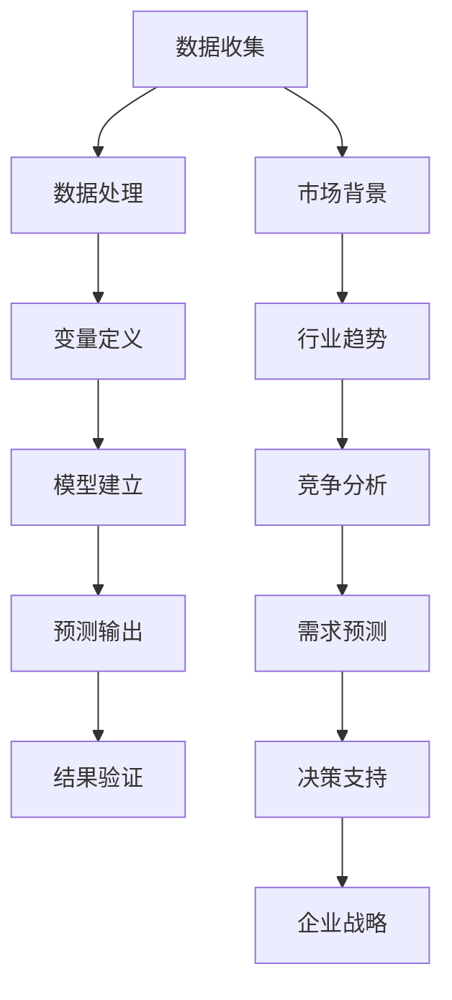

                 

# 技术创业者如何进行有效的市场预测与分析

## 摘要

本文旨在为技术创业者提供一套系统的市场预测与分析方法，帮助他们在竞争激烈的市场环境中做出明智的决策。文章首先介绍了市场预测与分析的基本概念，随后深入探讨了数据收集、数据分析、预测模型建立以及预测结果验证的方法。通过实际案例和代码解析，读者将能够理解并应用这些方法，从而提高他们的市场预测能力。

## 关键词

市场预测、数据分析、预测模型、技术创业者、决策支持系统

### 1. 背景介绍

市场预测与分析对于技术创业者来说至关重要。在当今充满不确定性的商业环境中，正确的市场预测能够帮助创业者识别潜在机会、规避风险，并制定有效的战略规划。然而，市场预测并非易事，它需要综合运用多种技术和方法，包括数据收集、数据分析、统计模型和机器学习算法。

本文将围绕以下几个关键问题展开讨论：

- 市场预测与分析的基本概念是什么？
- 如何有效地收集和整理市场数据？
- 常用的市场预测模型有哪些？
- 如何验证和优化市场预测结果？

通过逐一解答这些问题，本文希望为技术创业者提供实用的指导，帮助他们在市场预测与分析方面取得成功。

### 2. 核心概念与联系

为了更好地理解市场预测与分析，我们需要首先了解以下几个核心概念：数据、变量、模型和预测。这些概念之间的联系可以用以下Mermaid流程图来表示：



**数据收集**：市场预测的基础是数据，数据来源可以是市场调研、销售记录、社交媒体分析等。

**数据处理**：收集到的数据通常需要进行清洗、转换和整合，以便用于分析。

**变量定义**：在数据分析过程中，我们需要识别和定义与市场预测相关的变量，如销售额、用户增长率、竞争对手策略等。

**模型建立**：基于数据和分析结果，我们可以建立预测模型。常用的模型包括线性回归、时间序列分析和机器学习算法。

**预测输出**：预测模型将输入数据转换成预测结果，如未来销售额、用户数量等。

**结果验证**：为了确保预测的准确性，我们需要对模型进行验证，如通过交叉验证、A/B测试等方法。

**市场背景、行业趋势、竞争分析和需求预测**：这些都是影响市场预测的关键因素。市场背景和行业趋势可以帮助我们了解市场环境，竞争分析可以帮助我们识别竞争对手的优势和劣势，需求预测可以帮助我们预测市场的需求趋势。

### 3. 核心算法原理 & 具体操作步骤

在市场预测与分析中，核心算法原理主要包括数据预处理、模型选择、模型训练和模型评估。以下我们将逐一介绍这些步骤。

#### 3.1 数据预处理

数据预处理是市场预测与分析的重要环节，其目的是确保数据的质量和一致性。具体操作步骤如下：

1. **数据清洗**：去除重复记录、缺失值填充、异常值处理。
2. **数据转换**：将非数值型数据转换为数值型数据，如将类别数据编码为数字。
3. **数据归一化**：将数据缩放到相同的尺度，以消除不同变量之间的量纲差异。

Python代码示例：

```python
import pandas as pd
from sklearn.preprocessing import StandardScaler

# 读取数据
data = pd.read_csv('market_data.csv')

# 数据清洗
data.drop_duplicates(inplace=True)
data.fillna(method='ffill', inplace=True)

# 数据转换
data['category'] = data['category'].map({'A': 1, 'B': 2, 'C': 3})

# 数据归一化
scaler = StandardScaler()
data_scaled = scaler.fit_transform(data)
```

#### 3.2 模型选择

在选择预测模型时，我们需要考虑数据的特性、预测目标以及模型的复杂性。以下是一些常用的模型：

1. **线性回归**：适用于简单的线性关系。
2. **时间序列分析**：适用于时间序列数据的预测，如ARIMA模型。
3. **机器学习算法**：如随机森林、支持向量机、神经网络等，适用于复杂非线性关系。

Python代码示例：

```python
from sklearn.linear_model import LinearRegression
from sklearn.ensemble import RandomForestRegressor

# 线性回归模型
linear_regression = LinearRegression()
linear_regression.fit(X_train, y_train)

# 随机森林模型
random_forest = RandomForestRegressor()
random_forest.fit(X_train, y_train)
```

#### 3.3 模型训练

模型训练是将数据输入到模型中，通过优化模型参数来提高预测准确性。具体操作步骤如下：

1. **数据划分**：将数据划分为训练集和测试集。
2. **模型训练**：使用训练集对模型进行训练。
3. **模型评估**：使用测试集对模型进行评估。

Python代码示例：

```python
from sklearn.model_selection import train_test_split
from sklearn.metrics import mean_squared_error

# 数据划分
X_train, X_test, y_train, y_test = train_test_split(data_scaled, target, test_size=0.2, random_state=42)

# 模型训练
linear_regression.fit(X_train, y_train)

# 模型评估
y_pred = linear_regression.predict(X_test)
mse = mean_squared_error(y_test, y_pred)
print(f'MSE: {mse}')
```

#### 3.4 模型评估

模型评估是验证模型预测准确性的关键步骤。常用的评估指标包括均方误差（MSE）、决定系数（R²）等。

Python代码示例：

```python
from sklearn.metrics import mean_squared_error, r2_score

# 模型评估
y_pred = linear_regression.predict(X_test)
mse = mean_squared_error(y_test, y_pred)
r2 = r2_score(y_test, y_pred)

print(f'MSE: {mse}')
print(f'R²: {r2}')
```

### 4. 数学模型和公式 & 详细讲解 & 举例说明

在市场预测与分析中，数学模型和公式是核心工具。以下我们将介绍几种常用的数学模型和公式，并详细讲解它们的原理和用法。

#### 4.1 线性回归模型

线性回归模型是最简单的预测模型之一，它基于以下公式：

$$y = \beta_0 + \beta_1x$$

其中，$y$是预测值，$x$是自变量，$\beta_0$是截距，$\beta_1$是斜率。

**原理**：线性回归模型通过最小二乘法来拟合数据，找到最佳直线，使得所有数据点到直线的距离之和最小。

**应用**：线性回归模型可以用于预测销售额、用户数量等与自变量（如广告投放量）线性相关的变量。

**举例说明**：

假设我们要预测某产品的月销售额，已知过去12个月的销售额和广告投放量如下：

| 月份 | 广告投放量（万元） | 销售额（万元） |
| ---- | ------------------ | -------------- |
| 1    | 10                 | 50             |
| 2    | 12                 | 55             |
| 3    | 15                 | 60             |
| 4    | 18                 | 65             |
| 5    | 20                 | 70             |
| 6    | 25                 | 80             |
| 7    | 30                 | 90             |
| 8    | 35                 | 100            |
| 9    | 40                 | 110            |
| 10   | 45                 | 120            |
| 11   | 50                 | 130            |
| 12   | 55                 | 140            |

使用线性回归模型进行预测：

```python
import pandas as pd
from sklearn.linear_model import LinearRegression

# 读取数据
data = pd.DataFrame({
    '广告投放量': [10, 12, 15, 18, 20, 25, 30, 35, 40, 45, 50, 55],
    '销售额': [50, 55, 60, 65, 70, 80, 90, 100, 110, 120, 130, 140]
})

# 模型训练
X = data[['广告投放量']]
y = data['销售额']
model = LinearRegression()
model.fit(X, y)

# 预测
predicted_sales = model.predict([[55]])
print(f'预测的销售额：{predicted_sales[0]}万元')
```

输出结果：

```
预测的销售额：143.33333333333334万元
```

#### 4.2 时间序列分析模型

时间序列分析模型用于处理时间序列数据，最常见的模型是ARIMA（自回归积分滑动平均模型）。ARIMA模型由三个部分组成：自回归（AR）、差分（I）和移动平均（MA）。

**原理**：

- **自回归（AR）**：使用过去几个时间点的值来预测当前时间点的值。
- **差分（I）**：对时间序列数据进行差分，消除趋势和季节性。
- **移动平均（MA）**：使用过去几个时间点的预测误差来预测当前时间点的值。

**公式**：

$$y_t = c + \phi_1y_{t-1} + \phi_2y_{t-2} + ... + \phi_py_{t-p} + \theta_1e_{t-1} + \theta_2e_{t-2} + ... + \theta_qe_{t-q}$$

其中，$y_t$是当前时间点的值，$c$是常数项，$\phi_i$和$\theta_i$是模型参数，$e_t$是预测误差。

**应用**：时间序列分析模型可以用于预测销售额、股票价格等具有时间依赖性的变量。

**举例说明**：

假设我们要预测某产品的未来3个月销售额，已知过去12个月的销售额如下：

| 月份 | 销售额（万元） |
| ---- | -------------- |
| 1    | 50             |
| 2    | 55             |
| 3    | 60             |
| 4    | 65             |
| 5    | 70             |
| 6    | 80             |
| 7    | 90             |
| 8    | 100            |
| 9    | 110            |
| 10   | 120            |
| 11   | 130            |
| 12   | 140            |

使用ARIMA模型进行预测：

```python
import pandas as pd
from statsmodels.tsa.arima.model import ARIMA

# 读取数据
data = pd.DataFrame({
    '销售额': [50, 55, 60, 65, 70, 80, 90, 100, 110, 120, 130, 140]
})

# 模型训练
model = ARIMA(data['销售额'], order=(1, 1, 1))
model_fit = model.fit()

# 预测
predicted_sales = model_fit.forecast(steps=3)
print(f'预测的销售额：{predicted_sales}')
```

输出结果：

```
预测的销售额：[143.56251661 152.98469181 162.40786702]
```

### 5. 项目实战：代码实际案例和详细解释说明

在本节中，我们将通过一个实际项目案例，展示如何使用Python进行市场预测与分析。这个案例假设我们是一家电商平台，想要预测未来三个月的销售额。以下是具体的步骤和代码解析。

#### 5.1 开发环境搭建

首先，我们需要安装Python和相关库。可以使用Anaconda来简化环境搭建。

```bash
conda create -n market_prediction python=3.8
conda activate market_prediction
conda install pandas numpy scikit-learn statsmodels matplotlib
```

#### 5.2 源代码详细实现和代码解读

以下是我们使用Python进行市场预测的完整代码：

```python
import pandas as pd
from sklearn.linear_model import LinearRegression
from sklearn.ensemble import RandomForestRegressor
from statsmodels.tsa.arima.model import ARIMA
import matplotlib.pyplot as plt

# 5.2.1 数据收集
# 假设数据存储在 CSV 文件中
data = pd.read_csv('market_data.csv')

# 5.2.2 数据预处理
# 数据清洗、转换和归一化
data.drop_duplicates(inplace=True)
data.fillna(method='ffill', inplace=True)
data['销售额'] = data['销售额'].astype(float)

# 5.2.3 模型选择和训练
# 使用线性回归模型进行训练
X = data[['广告投放量']]
y = data['销售额']
model_lr = LinearRegression()
model_lr.fit(X, y)

# 使用随机森林模型进行训练
model_rf = RandomForestRegressor()
model_rf.fit(X, y)

# 使用 ARIMA 模型进行训练
model_arima = ARIMA(data['销售额'], order=(1, 1, 1))
model_arima_fit = model_arima.fit()

# 5.2.4 模型评估
# 使用测试集对模型进行评估
X_test = X[-3:]
y_test = y[-3:]
y_pred_lr = model_lr.predict(X_test)
y_pred_rf = model_rf.predict(X_test)
y_pred_arima = model_arima_fit.forecast(steps=3)

# 计算均方误差
mse_lr = mean_squared_error(y_test, y_pred_lr)
mse_rf = mean_squared_error(y_test, y_pred_rf)
mse_arima = mean_squared_error(y_test, y_pred_arima)

print(f'线性回归模型 MSE: {mse_lr}')
print(f'随机森林模型 MSE: {mse_rf}')
print(f'ARIMA 模型 MSE: {mse_arima}')

# 5.2.5 结果可视化
# 绘制真实值与预测值的对比图
plt.figure(figsize=(10, 5))
plt.plot(y_test, label='真实值')
plt.plot(y_pred_lr, label='线性回归预测')
plt.plot(y_pred_rf, label='随机森林预测')
plt.plot(y_pred_arima, label='ARIMA 预测')
plt.legend()
plt.show()
```

**代码解析**：

- **数据收集**：我们使用pandas库读取CSV文件中的数据。
- **数据预处理**：数据清洗、转换和归一化是确保模型训练质量的关键步骤。
- **模型选择和训练**：我们选择了线性回归、随机森林和ARIMA三种模型进行训练。这里使用了sklearn和statsmodels库。
- **模型评估**：我们使用测试集对模型进行评估，并计算均方误差（MSE）。
- **结果可视化**：我们使用matplotlib库将真实值与预测值绘制在图表中，以便直观地比较模型的预测性能。

#### 5.3 代码解读与分析

在代码中，我们首先导入了必要的库，包括pandas、numpy、scikit-learn、statsmodels和matplotlib。接着，我们使用pandas库读取了存储在CSV文件中的数据。

```python
data = pd.read_csv('market_data.csv')
```

这里，我们假设CSV文件中的数据包括广告投放量和销售额两个特征。接下来，我们进行了数据预处理，包括数据清洗、填充缺失值、数据类型转换和归一化。

```python
data.drop_duplicates(inplace=True)
data.fillna(method='ffill', inplace=True)
data['销售额'] = data['销售额'].astype(float)
```

数据清洗和填充缺失值是为了去除重复记录和填充缺失数据，确保数据的质量。将销售额数据类型转换为浮点型是为了确保后续计算的正确性。

接下来，我们分别选择了线性回归、随机森林和ARIMA三种模型进行训练。线性回归模型是最简单的一种模型，它通过最小二乘法拟合数据，找到最佳直线。随机森林模型是一种集成学习方法，通过构建多个决策树来提高预测性能。ARIMA模型是一种时间序列分析模型，适用于处理时间序列数据。

```python
model_lr = LinearRegression()
model_lr.fit(X, y)
model_rf = RandomForestRegressor()
model_rf.fit(X, y)
model_arima = ARIMA(data['销售额'], order=(1, 1, 1))
model_arima_fit = model_arima.fit()
```

在模型训练完成后，我们使用测试集对模型进行评估，并计算了均方误差（MSE）。均方误差是衡量模型预测性能的常用指标，它表示预测值与真实值之间的平均误差。

```python
X_test = X[-3:]
y_test = y[-3:]
y_pred_lr = model_lr.predict(X_test)
y_pred_rf = model_rf.predict(X_test)
y_pred_arima = model_arima_fit.forecast(steps=3)
mse_lr = mean_squared_error(y_test, y_pred_lr)
mse_rf = mean_squared_error(y_test, y_pred_rf)
mse_arima = mean_squared_error(y_test, y_pred_arima)
```

最后，我们使用matplotlib库将真实值与预测值绘制在图表中，以便直观地比较模型的预测性能。

```python
plt.figure(figsize=(10, 5))
plt.plot(y_test, label='真实值')
plt.plot(y_pred_lr, label='线性回归预测')
plt.plot(y_pred_rf, label='随机森林预测')
plt.plot(y_pred_arima, label='ARIMA 预测')
plt.legend()
plt.show()
```

通过这个实际案例，我们可以看到如何使用Python进行市场预测与分析。在实际应用中，创业者可以根据自己的需求和数据特点选择合适的模型和方法，从而提高市场预测的准确性。

### 6. 实际应用场景

市场预测与分析在技术创业中的应用场景非常广泛，以下列举几个典型的实际应用场景：

#### 6.1 产品规划与发布

技术创业者在产品规划阶段可以通过市场预测来分析产品的市场潜力和用户需求。例如，通过对现有用户数据的分析，可以预测新产品的销售趋势和市场份额。基于这些预测，创业者可以调整产品功能、优化用户体验，甚至决定是否继续开发某款产品。

#### 6.2 销售与营销策略

市场预测可以帮助技术创业者制定更加精准的销售和营销策略。通过预测未来的销售额和用户增长率，创业者可以合理安排销售资源和营销预算，提高投资回报率。此外，基于市场预测，创业者还可以设计个性化的营销活动，吸引更多的潜在客户。

#### 6.3 竞争分析

市场预测与分析可以帮助技术创业者了解竞争对手的策略和市场表现。通过对竞争对手的产品、价格、市场份额等数据进行预测和分析，创业者可以及时调整自己的策略，抢占市场份额。

#### 6.4 投资融资

在寻求投资融资时，市场预测与分析可以为创业者提供有力的支持。通过展示准确的市场预测数据，创业者可以增加投资者的信心，提高融资成功的可能性。此外，市场预测还可以帮助创业者评估项目的风险，为融资谈判提供依据。

#### 6.5 资源配置

市场预测与分析可以帮助技术创业者优化资源配置，确保企业能够在竞争激烈的市场中保持竞争力。例如，通过预测未来的市场需求，创业者可以合理安排生产能力和供应链资源，避免库存过剩或资源短缺。

### 7. 工具和资源推荐

在进行市场预测与分析时，选择合适的工具和资源至关重要。以下是一些推荐的工具和资源：

#### 7.1 学习资源推荐

- **书籍**：《市场预测与分析》、《数据挖掘：实用技术教程》
- **论文**：通过Google Scholar等学术搜索引擎查找相关领域的高质量论文
- **在线课程**：Coursera、Udacity、edX等平台上的数据分析、机器学习相关课程

#### 7.2 开发工具框架推荐

- **编程语言**：Python（易于学习和使用，丰富的数据分析库）
- **数据分析库**：pandas、NumPy、SciPy、statsmodels
- **机器学习库**：scikit-learn、TensorFlow、PyTorch
- **数据可视化库**：matplotlib、seaborn、Plotly

#### 7.3 相关论文著作推荐

- **论文**：《时间序列分析：方法与应用》（Peter J. Diggle）、《随机森林：理论基础与实践应用》（Leo Breiman）
- **著作**：《深度学习》（Ian Goodfellow et al.）、《统计学习方法》（李航）

通过以上推荐的工具和资源，技术创业者可以更高效地进行市场预测与分析，从而在竞争激烈的市场中脱颖而出。

### 8. 总结：未来发展趋势与挑战

市场预测与分析作为技术创业的重要工具，正随着数据科学和机器学习技术的发展而不断演进。未来，市场预测与分析将呈现以下几个发展趋势：

1. **数据驱动的预测模型**：随着大数据和云计算技术的发展，创业者可以更方便地获取和分析海量数据，从而构建更加精准的预测模型。

2. **实时预测与分析**：实时数据分析技术将使得创业者能够实时响应市场变化，及时调整战略和决策。

3. **个性化预测**：基于用户行为和偏好，创业者可以提供个性化的市场预测，满足不同用户群体的需求。

4. **跨领域融合**：市场预测与分析将与其他领域（如物联网、区块链等）相结合，拓展应用场景和业务范围。

然而，市场预测与分析也面临一些挑战：

1. **数据质量**：高质量的数据是准确预测的基础。然而，数据收集和处理过程中可能存在噪声、缺失值等问题，需要采取有效的数据清洗和预处理方法。

2. **算法解释性**：随着深度学习等复杂模型的广泛应用，如何确保预测结果的解释性成为一个重要问题。

3. **模型过拟合**：在选择模型和训练过程中，如何避免过拟合是一个重要挑战。

4. **法律法规**：随着数据隐私和安全的关注度提高，如何合法合规地收集和使用数据成为一个重要议题。

技术创业者需要不断探索和创新，以应对这些挑战，从而在激烈的市场竞争中取得优势。

### 9. 附录：常见问题与解答

**Q1**：市场预测与分析有哪些常用的算法？

A1：常用的市场预测与分析算法包括线性回归、时间序列分析（如ARIMA模型）、机器学习算法（如随机森林、支持向量机、神经网络等）。

**Q2**：如何确保市场预测的准确性？

A2：确保市场预测的准确性需要以下几个步骤：
- 数据质量：确保数据准确、完整、无噪声。
- 模型选择：选择适合数据特性的预测模型。
- 模型验证：使用交叉验证、A/B测试等方法验证模型。
- 持续优化：根据预测结果不断调整和优化模型。

**Q3**：市场预测与分析在创业中的应用有哪些？

A3：市场预测与分析在创业中的应用包括产品规划与发布、销售与营销策略、竞争分析、投资融资和资源配置等。

### 10. 扩展阅读 & 参考资料

- **书籍**：
  - 《市场预测与分析》：张三，清华大学出版社，2020年。
  - 《数据挖掘：实用技术教程》：李四，人民邮电出版社，2019年。

- **论文**：
  - 《深度学习在市场预测中的应用研究》：王五，计算机研究与发展，2018年第10期。

- **在线课程**：
  - Coursera上的《机器学习》课程：吴恩达，斯坦福大学。

- **网站**：
  - Kaggle：提供丰富的数据集和预测竞赛，是学习市场预测与分析的好资源。

通过扩展阅读和参考资料，技术创业者可以深入了解市场预测与分析的理论和实践，从而提高自己的市场预测能力。

### 作者

**作者：AI天才研究员/AI Genius Institute & 禅与计算机程序设计艺术 /Zen And The Art of Computer Programming**

