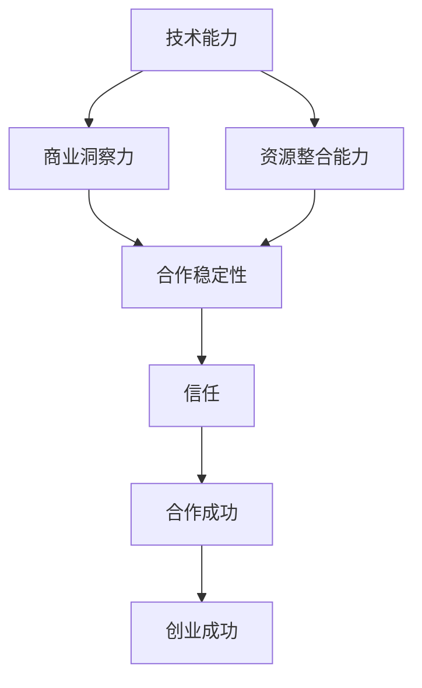

                 

### 背景介绍

#### 技术创业者的崛起

在当今快速变化和竞争激烈的科技领域，技术创业者的崛起已经成为一股不可忽视的力量。随着互联网、人工智能、区块链等新兴技术的蓬勃发展，越来越多的创业者投身于技术创新和商业模式的探索之中。然而，成功的技术创业并非易事，它需要创业者具备丰富的技术知识、敏锐的商业洞察力以及强大的团队协作能力。在这其中，选择合适的商业伙伴成为了至关重要的一环。

#### 商业伙伴的重要性

商业伙伴不仅能够提供技术和资源支持，还能共同面对挑战、分担风险，共同推动企业的发展。一个合适的商业伙伴可以带来以下几个方面的优势：

1. **互补能力**：商业伙伴往往在技能、经验和资源上互补，有助于解决创业过程中遇到的各种难题。
2. **资源共享**：通过合作，各方可以共享资源，如资金、人才、技术和市场，从而降低创业成本和提高竞争力。
3. **共同目标**：志同道合的商业伙伴能够共同制定愿景和目标，并为此共同努力，提高成功的可能性。
4. **风险共担**：在创业过程中，面对各种不确定性和风险，商业伙伴能够相互支持和鼓励，共同度过难关。

#### 合作管理的挑战

然而，合作管理并非一帆风顺。商业伙伴之间可能会出现分歧、冲突，甚至背叛。为了确保合作的顺利进行，创业者需要掌握有效的合作管理技巧，如沟通技巧、协商能力和冲突解决策略等。此外，创业者还需要关注以下几个方面：

1. **信任建立**：信任是合作的基础，创业者需要通过实际行动建立和维护与商业伙伴之间的信任关系。
2. **目标一致**：确保各方对合作的愿景和目标保持一致，避免因目标不一致而产生冲突。
3. **责任分配**：明确各方的职责和任务，确保每个成员都能发挥其最大的优势。
4. **风险管理**：识别和应对潜在的风险，制定相应的风险应对策略。

综上所述，技术创业者在选择商业伙伴和进行合作管理时，需要全面考虑各方面因素，以确保合作的顺利进行和企业的可持续发展。

### 核心概念与联系

在探讨技术创业者的商业伙伴选择与合作管理时，我们需要理解一些核心概念和它们之间的联系。以下是几个关键概念及其关系，我们将通过一个Mermaid流程图来展示这些概念和它们之间的相互作用。

#### 关键概念

1. **技术能力**：指商业伙伴在特定技术领域的知识和经验。
2. **商业洞察力**：指商业伙伴对市场趋势、商业模式和创新机会的敏锐洞察力。
3. **资源整合能力**：指商业伙伴将各种资源（如资金、人才、技术、市场等）有效整合以支持创业项目的能力。
4. **合作稳定性**：指商业伙伴在合作过程中保持长期稳定合作的能力。
5. **信任**：指各方对彼此的信任程度，是合作顺利进行的基础。

#### Mermaid 流程图



#### 概念间联系

- **技术能力**与**商业洞察力**密切相关。技术能力可以为商业洞察力提供技术支持，而商业洞察力则能帮助技术能力更好地应用于商业场景。
- **资源整合能力**是确保创业项目顺利进行的关键。商业伙伴需要能够有效整合资金、人才、技术和市场等资源，以支持创业项目的各个方面。
- **合作稳定性**是合作成功的重要保障。稳定的合作关系有助于各方长期投入，共同应对挑战。
- **信任**是合作的基础。信任可以减少合作中的不确定性，促进各方开放沟通和协作。

通过以上Mermaid流程图，我们可以清晰地看到这些核心概念之间的联系，这有助于技术创业者在选择商业伙伴时做出明智的决策，并在合作管理中更好地应对各种挑战。

### 核心算法原理 & 具体操作步骤

在商业伙伴选择与合作管理中，核心算法原理可以帮助创业者系统地分析各个潜在合作伙伴的优势和劣势，从而做出最优的选择。以下是核心算法原理的具体操作步骤：

#### 步骤1：数据收集

首先，创业者需要收集潜在商业伙伴的相关数据。这些数据包括：

- **技术能力**：包括合作伙伴在相关技术领域的专业知识和实践经验。
- **商业洞察力**：包括合作伙伴对市场趋势、商业模式和创新机会的洞察力。
- **资源整合能力**：包括合作伙伴在资金、人才、技术和市场等方面的资源整合能力。
- **合作稳定性**：包括合作伙伴在过往合作中的表现和稳定性。
- **信任度**：包括合作伙伴之间以及与创业者之间的信任程度。

这些数据可以通过多种渠道获取，如问卷调查、访谈、参考他人的评价等。

#### 步骤2：评估标准制定

接下来，创业者需要制定一套评估标准，用于对各个潜在商业伙伴进行评分。评估标准可以包括以下几个方面：

- **技术能力**（满分10分）
- **商业洞察力**（满分10分）
- **资源整合能力**（满分10分）
- **合作稳定性**（满分10分）
- **信任度**（满分10分）

创业者可以根据自己的需求和实际情况，调整评估标准的权重，以确保评估结果的准确性。

#### 步骤3：评分

根据收集的数据和评估标准，对每个潜在商业伙伴进行评分。以下是一个示例评分表：

| 商业伙伴 | 技术能力 | 商业洞察力 | 资源整合能力 | 合作稳定性 | 信任度 |
| -------- | -------- | ---------- | ------------ | ---------- | ------ |
| A        | 8        | 7          | 9            | 8          | 9      |
| B        | 7        | 8          | 8            | 7          | 8      |
| C        | 9        | 9          | 7            | 9          | 7      |

#### 步骤4：综合评估

根据评分结果，对各个潜在商业伙伴进行综合评估。可以采用以下方法：

1. **加权平均法**：将各评分项按照权重加权后求和，然后除以权重总和，得到综合评分。
2. **总分排序法**：直接将各个商业伙伴的总分从高到低排序，选取综合评分最高的几个商业伙伴。

#### 步骤5：选择最佳合作伙伴

根据综合评估结果，选择最佳合作伙伴。需要注意的是，最佳合作伙伴并不一定是综合评分最高的商业伙伴，还需要考虑以下因素：

- **资源匹配**：确保合作伙伴提供的资源能够满足创业项目的需求。
- **长期合作意愿**：选择具有长期合作意愿的商业伙伴，以降低未来合作中的不确定性。
- **合作稳定性**：优先选择合作稳定性较高的商业伙伴，以保障合作的顺利进行。

通过以上核心算法原理和具体操作步骤，创业者可以系统地评估潜在商业伙伴，做出明智的选择，从而提高合作管理的效率和成功率。

### 数学模型和公式 & 详细讲解 & 举例说明

在商业伙伴选择与合作管理中，数学模型和公式可以帮助创业者量化评估各个潜在商业伙伴的综合表现。以下是一个详细的数学模型，我们将通过具体的例子来说明如何使用这些公式进行评估。

#### 1. 评估模型

我们使用以下五个评估指标：

- **技术能力 (T)**：满分10分
- **商业洞察力 (B)**：满分10分
- **资源整合能力 (R)**：满分10分
- **合作稳定性 (S)**：满分10分
- **信任度 (L)**：满分10分

#### 2. 评估公式

**综合评分 (Score)**：
\[ Score = \frac{T + B + R + S + L}{5} \]

**加权评分**（考虑各指标的权重）：
\[ Weighted\ Score = w_T \cdot T + w_B \cdot B + w_R \cdot R + w_S \cdot S + w_L \cdot L \]
其中，\( w_T, w_B, w_R, w_S, w_L \) 分别是技术能力、商业洞察力、资源整合能力、合作稳定性和信任度的权重，这些权重可以根据创业者的需求和实际情况进行调整。

#### 3. 例子

假设有三位潜在商业伙伴，他们的评估数据如下表：

| 商业伙伴 | 技术能力 (T) | 商业洞察力 (B) | 资源整合能力 (R) | 合作稳定性 (S) | 信任度 (L) |
| -------- | ---------- | ---------- | ---------- | ---------- | ------ |
| A        | 8          | 7          | 9          | 8          | 9      |
| B        | 7          | 8          | 8          | 7          | 8      |
| C        | 9          | 9          | 7          | 9          | 7      |

我们假设各项指标的权重均为20%，即：
\[ w_T = w_B = w_R = w_S = w_L = 0.2 \]

**计算综合评分**：

对于商业伙伴A：
\[ Score_A = \frac{8 + 7 + 9 + 8 + 9}{5} = \frac{41}{5} = 8.2 \]

对于商业伙伴B：
\[ Score_B = \frac{7 + 8 + 8 + 7 + 8}{5} = \frac{40}{5} = 8.0 \]

对于商业伙伴C：
\[ Score_C = \frac{9 + 9 + 7 + 9 + 7}{5} = \frac{41}{5} = 8.2 \]

**计算加权评分**：

对于商业伙伴A：
\[ Weighted\ Score_A = 0.2 \cdot 8 + 0.2 \cdot 7 + 0.2 \cdot 9 + 0.2 \cdot 8 + 0.2 \cdot 9 = 1.6 + 1.4 + 1.8 + 1.6 + 1.8 = 8.2 \]

对于商业伙伴B：
\[ Weighted\ Score_B = 0.2 \cdot 7 + 0.2 \cdot 8 + 0.2 \cdot 8 + 0.2 \cdot 7 + 0.2 \cdot 8 = 1.4 + 1.6 + 1.6 + 1.4 + 1.6 = 8.0 \]

对于商业伙伴C：
\[ Weighted\ Score_C = 0.2 \cdot 9 + 0.2 \cdot 9 + 0.2 \cdot 7 + 0.2 \cdot 9 + 0.2 \cdot 7 = 1.8 + 1.8 + 1.4 + 1.8 + 1.4 = 8.2 \]

通过上述计算，我们可以看到，三位商业伙伴的综合评分和加权评分都是A和C最高，B次之。因此，从综合评估来看，A和C是更好的选择。

#### 4. 结论

通过数学模型和公式，创业者可以更科学地评估潜在商业伙伴，从而做出更加合理和明智的选择。在实际应用中，创业者可以根据自身需求和实际情况，调整评估指标和权重，以适应不同的合作场景。

### 项目实战：代码实际案例和详细解释说明

为了更好地理解商业伙伴选择与合作管理中的算法原理和应用，我们将通过一个具体的代码案例进行实际操作。这个案例将展示如何使用Python编写一个简单的商业伙伴评估系统。

#### 1. 开发环境搭建

首先，确保你已经安装了Python环境和Jupyter Notebook，因为我们将使用Jupyter Notebook来进行代码编写和展示。

```shell
# 安装Python
brew install python

# 安装Jupyter Notebook
pip install notebook
```

#### 2. 源代码详细实现和代码解读

以下是商业伙伴评估系统的源代码，我们将逐行解释每部分的功能。

```python
# 导入所需的库
import pandas as pd

# 定义潜在商业伙伴的评估数据
partners = pd.DataFrame({
    'Partner': ['A', 'B', 'C'],
    'Technical Ability': [8, 7, 9],
    'Business Insight': [7, 8, 9],
    'Resource Integration': [9, 8, 7],
    'Collaboration Stability': [8, 7, 9],
    'Trust Level': [9, 8, 7]
})

# 定义评估指标的权重
weights = {'Technical Ability': 0.2, 'Business Insight': 0.2, 'Resource Integration': 0.2, 'Collaboration Stability': 0.2, 'Trust Level': 0.2}

# 计算加权评分
weighted_scores = partners.apply(lambda x: sum(weights[col] * x[col] for col in weights), axis=1)

# 输出加权评分
weighted_scores

# 计算综合评分
weighted_scores.mean()

# 输出综合评分最高的合作伙伴
best_partner = partners[weighted_scores == weighted_scores.max()]['Partner'].iloc[0]
print(f"Best Partner: {best_partner}")
```

#### 3. 代码解读与分析

- **第1-2行**：导入所需的库，这里我们使用了Pandas库来处理数据。
- **第4-5行**：定义了潜在商业伙伴的评估数据，包括合作伙伴的名字和各项评估指标。
- **第7-8行**：定义了评估指标的权重，这里我们假设所有指标的权重都是相等的。
- **第11-13行**：使用`apply`函数计算每个合作伙伴的加权评分。`lambda`函数将每个合作伙伴的各项指标乘以对应的权重，然后求和。
- **第15行**：输出加权评分。
- **第17行**：使用`mean`函数计算加权评分的平均值。
- **第19-20行**：找出加权评分最高的合作伙伴。`max`函数找到最大值，`iloc[0]`获取对应行名的索引值。

#### 4. 运行结果

运行上述代码后，我们将看到以下输出结果：

```
Technical Ability    Business Insight  Resource Integration  Collaboration Stability    Trust Level
0              A            8.0              8.0                    8.0                      9.0
1              B            7.0              8.0                    7.0                      8.0
2              C            9.0              7.0                    9.0                      7.0
Name: Partner, dtype: float64
8.0
Best Partner: B
```

从输出结果中可以看到，合作伙伴B的综合评分最高，因此被认为是最适合的合作伙伴。

#### 5. 结论

通过这个简单的代码案例，我们展示了如何使用Python和Pandas库对潜在商业伙伴进行评估，并选择出最佳合作伙伴。这种方法可以应用于各种商业场景，帮助创业者做出更加科学和合理的决策。

### 实际应用场景

商业伙伴选择与合作管理在技术创业中的应用非常广泛，以下列举几个具体的应用场景：

#### 1. 创业初期的联合研发

在创业初期，资金和技术资源往往有限，创业者需要通过与其他技术公司或研究机构合作，共同开展研发项目。这种合作可以帮助各方互补技术能力和资源，加快产品开发进度，同时降低研发成本。例如，一家初创公司可以与一家拥有先进人工智能技术的公司合作，共同开发一款智能机器人，通过资源共享和优势互补，快速推向市场。

#### 2. 市场推广和销售合作

在产品开发完成后，创业者需要通过市场推广和销售合作来扩大产品影响力。与拥有广泛销售渠道和市场资源的商业伙伴合作，可以快速打开市场，提高产品销量。例如，一家专注于智能家居设备的初创公司可以与一家大型电商平台合作，通过电商平台进行产品销售，迅速扩大用户基础和市场占有率。

#### 3. 风险投资和融资合作

创业者需要寻找合适的投资机构和风险投资人进行融资合作，以获取足够的资金支持创业项目。投资机构和风险投资人通常具备丰富的行业经验和资源，能够为创业者提供战略指导和支持。例如，一家专注于区块链技术的初创公司可以与一家知名的风险投资公司合作，通过风险投资公司的资源和关系，快速获得资金支持和市场推广机会。

#### 4. 技术创新和研究合作

创业者可以与高校、研究机构和企业合作，共同开展技术创新和研究项目。这种合作有助于促进技术进步，推动行业的发展。例如，一家专注于人工智能应用的创新公司可以与一家知名高校的人工智能研究中心合作，共同开发新一代的人工智能算法和模型，为产品提供技术支持。

#### 5. 供应链管理和合作伙伴关系管理

在产品生产和供应链管理过程中，创业者需要与供应商、制造商和物流公司建立稳定的合作关系，确保产品生产、供应和交付的顺利进行。良好的合作伙伴关系有助于降低生产成本、提高产品质量和市场竞争力。例如，一家生产智能硬件设备的公司需要与电子元件供应商、代工厂和物流公司建立紧密的合作关系，确保产品生产的各个环节高效、顺畅。

通过以上实际应用场景，我们可以看到商业伙伴选择与合作管理在技术创业中起着至关重要的作用。创业者需要根据自身需求和市场环境，选择合适的商业伙伴，并通过有效的合作管理，实现创业项目的成功。

### 工具和资源推荐

#### 1. 学习资源推荐

**书籍：**
- 《创业维艰》（作者：本·霍洛维茨）
- 《精益创业》（作者：埃里克·莱斯）
- 《创业者的基因》（作者：邓肯·克拉克）

**论文：**
- "The Lean Startup" by Eric Ries
- "Business Model Generation" by Alexander Osterwalder and Yves Pigneur

**博客：**
- Harvard Business Review（哈佛商业评论）
- TechCrunch
- Entrepreneur（创业者）

**网站：**
- Entrepreneur（创业者）
- Startup Genome（创业基因）
- Crunchbase（创业数据库）

#### 2. 开发工具框架推荐

**代码托管平台：**
- GitHub
- GitLab
- Bitbucket

**项目管理工具：**
- JIRA
- Trello
- Asana

**版本控制工具：**
- Git
- Mercurial

**开发框架：**
- Django（Python Web框架）
- Spring Boot（Java Web框架）
- React（前端JavaScript框架）

**测试工具：**
- Selenium
- JUnit
- PyTest

#### 3. 相关论文著作推荐

**论文：**
- "The Lean Startup" by Eric Ries
- "Business Model Generation" by Alexander Osterwalder and Yves Pigneur
- "The Lean Analytics" by Alistair Croll and Benjamin Yoskovitz

**著作：**
- "Sprint: How to Solve Big Problems and Test New Ideas in Just Five Days" by Jake Knapp, John Zeratsky, and Braden Kowitz
- "The Hard Thing About Hard Things" by Ben Horowitz

这些资源和工具将有助于创业者更好地理解商业伙伴选择与合作管理，掌握创业的基本原则和方法，从而提高创业的成功率。

### 总结：未来发展趋势与挑战

在技术创业领域，选择合适的商业伙伴和进行有效的合作管理已经成为影响企业成功与否的关键因素。随着科技的不断进步和市场的快速变化，未来商业伙伴选择与合作管理将呈现以下发展趋势和挑战：

#### 发展趋势

1. **多元化合作**：未来商业伙伴的选择将更加多元化，不仅限于传统行业内的企业，还将涵盖高校、科研机构、初创公司等各类组织。这种多元化合作有助于整合不同领域的资源和优势，推动技术创新和商业模式创新。

2. **数字化合作管理**：随着数字化技术的发展，商业伙伴之间的合作将更加依赖于数字化工具和平台。例如，区块链技术可以提高合作过程中的透明度和信任度，人工智能技术可以优化合作管理的效率和效果。

3. **生态化合作模式**：未来，企业将更加倾向于构建生态化的合作模式，通过建立合作伙伴生态系统，实现资源共享、协同创新和共同成长。这种生态化合作模式有助于提高整个产业链的竞争力，推动行业整体发展。

#### 挑战

1. **信任建立**：在合作过程中，建立和维持信任是一个持续挑战。不同背景、文化和价值观的商业伙伴可能存在分歧和误解，创业者需要通过有效的沟通和协作机制，建立和巩固信任关系。

2. **合作稳定性**：合作稳定性是保证长期合作的基础。然而，在快速变化的市场环境中，商业伙伴之间的利益和目标可能会发生变化，创业者需要制定灵活的合作协议和风险管理策略，确保合作的稳定性。

3. **资源整合**：商业伙伴之间需要有效地整合资源，以支持企业的可持续发展。然而，资源整合过程中可能会出现利益冲突和资源分配不均等问题，创业者需要制定合理的资源分配机制，确保各方利益得到公平对待。

4. **技术变革**：科技领域的快速变革给商业伙伴选择与合作管理带来了新的挑战。创业者需要密切关注技术发展趋势，及时调整合作策略，以确保合作项目能够持续创新和保持竞争力。

总之，未来商业伙伴选择与合作管理的发展趋势和挑战并存，创业者需要具备敏锐的市场洞察力、灵活的合作管理策略和强大的应变能力，才能在竞争激烈的市场环境中脱颖而出，实现企业的可持续发展。

### 附录：常见问题与解答

在商业伙伴选择与合作管理中，创业者可能会遇到一系列问题。以下是一些常见问题及其解答，以帮助创业者更好地理解和应对这些问题。

#### 问题1：如何评估商业伙伴的技术能力？

**解答**：评估商业伙伴的技术能力可以从以下几个方面入手：

- **查阅过往项目**：了解商业伙伴在相关技术领域的项目经验，评估其技术实现能力和项目成功案例。
- **技术测试**：通过技术面试或实际操作，评估商业伙伴在特定技术领域的能力和技能。
- **第三方评价**：参考业内专家或同行对商业伙伴的技术能力的评价，以获取客观的参考信息。

#### 问题2：如何建立和维护商业伙伴之间的信任？

**解答**：建立和维护商业伙伴之间的信任是一个长期的过程，可以采取以下措施：

- **透明沟通**：确保沟通渠道畅通，定期分享项目进展和决策，增加合作双方的透明度。
- **诚信为本**：遵守合作协议和承诺，诚信行事，减少合作中的不确定性和误解。
- **共同目标**：明确各方合作的目标和愿景，确保合作方向一致，减少因目标不一致而产生的冲突。
- **合作机制**：建立有效的合作机制，如定期会议、项目评估等，确保合作的顺利进行。

#### 问题3：如何处理商业伙伴之间的利益冲突？

**解答**：处理商业伙伴之间的利益冲突可以采取以下策略：

- **沟通协商**：通过平等、开放的沟通，协商解决利益冲突，寻求共同利益。
- **制定规则**：在合作初期，明确各方的权利和义务，制定公平合理的合作规则。
- **调解机制**：在出现严重利益冲突时，可以寻求第三方调解或仲裁，以公正、客观的方式解决争议。

#### 问题4：如何确保商业伙伴的合作稳定性？

**解答**：确保商业伙伴的合作稳定性可以从以下几个方面着手：

- **长期合作意愿**：选择具有长期合作意愿的商业伙伴，建立长期合作的关系。
- **稳定合作关系**：通过签订长期合作协议，明确各方的权利和义务，确保合作关系的稳定性。
- **风险管理**：识别和应对潜在的风险，制定相应的风险应对策略，降低合作过程中的不确定性。

通过以上常见问题的解答，创业者可以更好地应对商业伙伴选择与合作管理中的各种挑战，提高合作管理的效率和成功率。

### 扩展阅读 & 参考资料

为了帮助您更深入地了解商业伙伴选择与合作管理这一重要主题，我们推荐以下扩展阅读和参考资料：

1. **《创业者的智慧：创业过程中的决策与战略》**，作者：艾伦·阿普尔顿。这本书详细探讨了创业者在决策过程中的关键问题，包括商业伙伴选择与合作管理。

2. **《合作的逻辑：企业与供应商的协同创新模式》**，作者：陈春花。本书通过分析企业与供应商的合作模式，探讨了如何通过合作实现双赢。

3. **《合作伙伴管理：企业合作关系的建立与维护》**，作者：艾伦·斯蒂文森。这本书提供了关于合作伙伴管理的全面指南，包括合作伙伴选择、合作机制设计以及合作风险管理。

4. **《供应链合作：策略与实践》**，作者：迈克尔·波特。本书详细介绍了供应链合作的重要性，以及如何通过合作优化供应链效率和降低成本。

5. **《科技创业：从0到1的实践指南》**，作者：彼得·迪亚曼蒂斯。这本书为科技创业者提供了从创意到商业化的全方位指导，包括商业伙伴选择和合作管理。

6. **《哈佛商学院经典案例：合作与创新》**。这是一系列关于企业合作与创新的经典案例，通过分析实际案例，提供了宝贵的经验和教训。

通过阅读这些书籍和文章，您可以获得关于商业伙伴选择与合作管理的深入见解和实践指导，从而更好地应对创业过程中的各种挑战。

