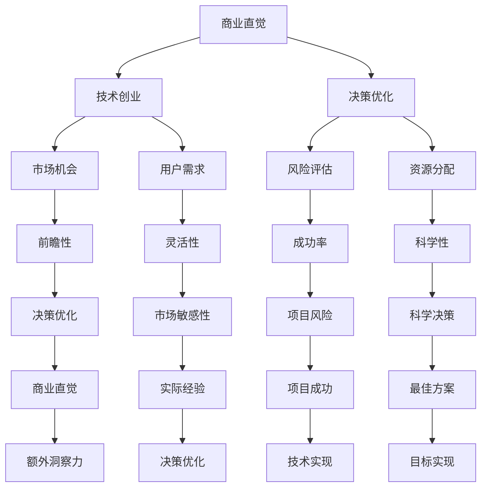

                 

### 背景介绍

随着全球数字化的迅猛发展，技术创业成为了当今社会中一种极为流行的商业现象。在这其中，技术创业者不仅要具备强大的技术能力，更需要具备敏锐的商业直觉。商业直觉是技术创业者成功的重要因素之一，它决定了项目能否在激烈的市场竞争中脱颖而出，从而获得成功。

然而，商业直觉并非天生就具备，而是可以通过学习和实践逐步培养的。本文将围绕技术创业者的商业直觉培养与决策优化展开讨论。我们将首先介绍商业直觉的定义，探讨其在技术创业中的重要性，并从多个角度提供培养商业直觉的方法和策略。同时，我们将介绍决策优化的基本概念，分析影响决策优化的因素，并探讨如何通过优化决策来提高技术创业项目的成功率。

本文旨在为技术创业者提供一套系统的商业直觉培养和决策优化策略，帮助他们更好地应对市场变化，抓住商业机遇，实现创业项目的成功。通过阅读本文，读者将了解到商业直觉的重要作用，掌握培养商业直觉的方法，学会优化决策的技巧，从而为技术创业道路上的成功奠定坚实基础。

### 核心概念与联系

在探讨商业直觉培养与决策优化的过程中，有必要先明确一些核心概念，以便为后续内容的展开打下基础。以下将介绍几个关键概念，并阐述它们在技术创业中的联系。

#### 商业直觉

商业直觉是指个人在商业环境中，通过对市场、用户、竞争对手等方面信息的快速感知、分析、判断和决策的能力。它是一种非结构化的、经验性的认知过程，不同于基于数据和逻辑分析的理性决策。商业直觉不仅涉及对市场趋势的敏锐把握，还包括对用户需求的深刻洞察，以及对竞争对手策略的快速反应。

#### 技术创业

技术创业是指创业者利用先进的技术创新来创建新的产品、服务和业务模式，以解决现实中的问题或满足市场需求。技术创业通常涉及高风险、高回报的特点，创业者需要在技术、市场、资金等多个方面进行综合考虑和平衡。

#### 决策优化

决策优化是指通过系统的分析和评估，选择最佳方案以实现既定目标的过程。在技术创业中，决策优化尤为重要，因为创业项目往往面临着不确定性、复杂性和时间压力。决策优化不仅需要考虑技术实现的可行性，还需要考虑市场接受度、资金预算、资源分配等多个方面。

#### 关联性

商业直觉与技术创业和决策优化之间的关联性体现在以下几个方面：

1. **商业直觉对决策优化的影响**：技术创业者具备较强的商业直觉，能够更快地识别市场机会，理解用户需求，从而在决策过程中更具前瞻性和灵活性。

2. **技术创业对商业直觉的培养**：通过参与技术创业，创业者可以不断积累实际操作经验，提高对市场环境的敏感性，从而培养和强化商业直觉。

3. **决策优化对技术创业的成功**：在技术创业过程中，通过科学的决策优化，可以有效降低项目风险，提高成功率。而商业直觉的运用则可以在决策过程中提供额外的洞察力，帮助创业者做出更明智的选择。

为了更直观地理解这些核心概念之间的联系，我们可以使用Mermaid流程图来展示它们之间的关系。以下是一个简化的Mermaid流程图示例：



通过这个流程图，我们可以清晰地看到商业直觉、技术创业和决策优化之间的互动关系。商业直觉不仅影响着技术创业的决策过程，也通过不断的实际操作经验来培养和优化。而决策优化则通过系统的分析和评估，确保技术创业项目能够更好地应对市场变化和风险，从而实现项目的成功。

### 核心算法原理 & 具体操作步骤

在商业直觉的培养与决策优化过程中，我们可以借鉴一些核心算法原理，以提升技术创业者的决策能力。以下将介绍几种常用的算法原理及其在决策中的应用。

#### 贝叶斯推理

贝叶斯推理是一种基于概率论的决策方法，适用于处理不确定性和不完全信息的情况。在技术创业中，贝叶斯推理可以帮助创业者对市场趋势、用户需求、竞争对手策略等进行概率性预测。

**原理：** 贝叶斯推理通过条件概率公式来更新先验概率，从而得到后验概率。公式为：

\[ P(A|B) = \frac{P(B|A) \cdot P(A)}{P(B)} \]

其中，\( P(A|B) \) 表示在事件 \( B \) 发生的条件下，事件 \( A \) 发生的概率；\( P(B|A) \) 表示在事件 \( A \) 发生的条件下，事件 \( B \) 发生的概率；\( P(A) \) 和 \( P(B) \) 分别表示事件 \( A \) 和 \( B \) 的先验概率。

**操作步骤：**

1. **收集数据**：收集关于市场、用户和竞争对手的先验信息，如市场占有率、用户满意度、竞争对手策略等。

2. **定义事件**：明确需要预测的事件，例如，判断市场对某一新产品的接受程度。

3. **计算条件概率**：根据先验信息和事件定义，计算条件概率。

4. **更新后验概率**：使用贝叶斯公式，结合条件概率和先验概率，更新后验概率。

5. **决策**：根据后验概率进行决策，例如，是否继续研发新产品。

#### 决策树

决策树是一种用于分类和回归的算法，通过一系列的判断节点和结果节点，形成一个树状结构，用于指导决策过程。

**原理：** 决策树通过一系列的测试条件，将数据集划分为多个子集，每个子集对应一个结果节点。决策树的每个节点表示一个测试条件，每个结果节点表示一个可能的决策。

**操作步骤：**

1. **确定目标变量**：明确需要决策的目标变量，如是否投资某项目。

2. **收集特征数据**：收集与目标变量相关的特征数据，如市场潜力、资金投入、竞争状况等。

3. **构建决策树**：根据特征数据，构建决策树，通过递归划分数据集，直到达到某个终止条件（如特征重要性下降或数据纯度提高）。

4. **评估决策树**：使用交叉验证或测试集评估决策树的表现，调整树的结构以优化决策。

5. **应用决策树**：使用构建好的决策树进行实际决策，如是否投资某项目。

#### 支持向量机（SVM）

支持向量机是一种用于分类和回归的机器学习算法，通过找到一个最优的超平面，将不同类别的数据点尽可能分开。

**原理：** 支持向量机通过最大化分类边界（即间隔）来寻找最优超平面。公式为：

\[ w \cdot x - b = 0 \]

其中，\( w \) 表示超平面的法向量，\( x \) 表示数据点，\( b \) 表示偏置。

**操作步骤：**

1. **收集数据**：收集与决策相关的数据集，如市场趋势、用户反馈等。

2. **特征提取**：从数据中提取特征，如通过主成分分析（PCA）降维。

3. **构建模型**：使用支持向量机算法构建分类或回归模型。

4. **训练模型**：使用训练集数据训练模型，调整参数以优化模型表现。

5. **评估模型**：使用测试集数据评估模型表现，调整模型参数。

6. **应用模型**：使用训练好的模型进行实际决策，如是否进入新市场。

#### 马尔可夫决策过程（MDP）

马尔可夫决策过程是一种用于处理不确定性和动态决策的算法，通过状态转移概率和回报函数来指导决策。

**原理：** 马尔可夫决策过程假设当前状态仅与前一状态相关，与之前的历史状态无关。公式为：

\[ P(s_t | s_{t-1}, a_{t-1}) = \text{constant} \]

**操作步骤：**

1. **定义状态空间**：明确决策过程中的所有可能状态。

2. **定义动作空间**：明确决策过程中所有可能采取的动作。

3. **定义回报函数**：定义每个状态和动作组合的回报值。

4. **构建状态转移概率矩阵**：根据历史数据构建状态转移概率矩阵。

5. **求解最优策略**：使用价值迭代或政策迭代方法求解最优策略。

6. **应用策略**：根据最优策略进行实际决策，如资源分配。

通过上述核心算法原理的介绍和操作步骤的详细说明，技术创业者可以更好地理解和应用这些算法，以优化决策过程，提高创业项目的成功率。

#### 数学模型和公式 & 详细讲解 & 举例说明

在商业直觉和决策优化的过程中，数学模型和公式起着至关重要的作用。它们提供了量化的方法，帮助创业者更好地理解和预测市场行为。以下将介绍几个关键的数学模型和公式，并详细讲解它们的含义和实际应用。

##### 1. 逻辑回归

逻辑回归是一种广泛用于分类问题的统计模型，尤其是在商业直觉和用户行为分析中。逻辑回归公式如下：

\[ P(Y=1|X) = \frac{1}{1 + e^{-(\beta_0 + \beta_1x_1 + \beta_2x_2 + ... + \beta_nx_n)}} \]

其中，\( P(Y=1|X) \) 表示在给定自变量 \( X \) 的条件下，因变量 \( Y \) 等于1的概率；\( \beta_0, \beta_1, \beta_2, ..., \beta_n \) 是模型的参数。

**解释：**
- \( \beta_0 \) 是截距，即当所有自变量均为0时，因变量的预测概率。
- \( \beta_1, \beta_2, ..., \beta_n \) 是自变量的系数，表示每个自变量对因变量的影响程度。

**应用举例：**
假设我们想要预测一个电商网站的用户是否会购买某一产品。我们可以将用户的购买历史、产品评价、浏览时间等作为自变量，通过逻辑回归模型计算用户购买的概率。具体步骤如下：
1. 收集数据：收集包含用户购买行为的多维度数据。
2. 数据预处理：对数据进行归一化处理，去除异常值。
3. 构建模型：使用逻辑回归公式，训练模型参数。
4. 预测：输入新用户的数据，预测其购买概率。

##### 2. 决策树

决策树是一种常见的机器学习算法，用于分类和回归问题。它的核心公式是基于信息增益和熵的概念：

\[ IG(\text{Feature}) = \sum_{v \in V} p(v) \cdot \sum_{c \in C} p(c|v) \cdot \log_2 p(c|v) \]

其中，\( IG(\text{Feature}) \) 是信息增益，表示选择某一特征进行划分所带来的信息增益；\( p(v) \) 是特征取值 \( v \) 的概率；\( p(c|v) \) 是在给定特征取值 \( v \) 的条件下，类别 \( c \) 的概率。

**解释：**
- \( p(v) \) 是特征取值的概率。
- \( p(c|v) \) 是在特征取值 \( v \) 的条件下，类别 \( c \) 的概率。
- \( \log_2 p(c|v) \) 是对类别概率的熵。

**应用举例：**
假设我们想要预测一个电商平台的用户是否会流失。我们可以使用决策树模型，通过用户的购物频率、购买金额、评价等特征，预测其流失的概率。具体步骤如下：
1. 收集数据：收集包含用户流失行为的多维度数据。
2. 构建模型：使用决策树算法，根据信息增益构建决策树。
3. 训练模型：使用训练集数据训练决策树模型。
4. 预测：输入新用户的数据，预测其流失概率。

##### 3. 风险评估矩阵

风险评估矩阵是一种用于评估和管理风险的工具。它通过计算不同风险事件发生的概率和潜在损失，来评估整体风险。公式如下：

\[ \text{风险} = \text{概率} \times \text{损失} \]

其中，\( \text{风险} \) 表示某风险事件的总风险值；\( \text{概率} \) 表示事件发生的概率；\( \text{损失} \) 表示事件发生时的潜在损失。

**解释：**
- \( \text{概率} \) 是风险事件发生的可能性。
- \( \text{损失} \) 是风险事件发生时的潜在损失。

**应用举例：**
假设我们想要评估一个创业项目的风险。我们可以通过以下步骤进行风险评估：
1. 识别风险：列出可能影响项目的风险因素。
2. 评估概率：评估每个风险因素发生的概率。
3. 评估损失：评估每个风险因素发生时的潜在损失。
4. 计算总风险：计算每个风险事件的总风险值。
5. 风险管理：根据总风险值，制定相应的风险管理策略。

##### 4. 贝叶斯网络

贝叶斯网络是一种用于表示变量之间依赖关系的图形模型。它通过条件概率表来描述变量之间的概率关系。公式如下：

\[ P(X_1, X_2, ..., X_n) = \prod_{i=1}^{n} P(X_i | X_{i-1}, ..., X_1) \]

其中，\( P(X_1, X_2, ..., X_n) \) 表示多个变量同时发生的概率；\( P(X_i | X_{i-1}, ..., X_1) \) 表示在给定前一个变量的条件下，当前变量的概率。

**解释：**
- \( P(X_i | X_{i-1}, ..., X_1) \) 是条件概率，表示在给定其他变量值的情况下，某个变量的概率。

**应用举例：**
假设我们想要分析一个电商平台的用户行为。我们可以使用贝叶斯网络来表示用户行为之间的依赖关系，如用户浏览产品、添加购物车、完成购买等。具体步骤如下：
1. 建立网络：根据业务逻辑，建立变量之间的依赖关系。
2. 收集数据：收集包含用户行为的数据。
3. 计算概率：使用贝叶斯公式，计算变量之间的条件概率。
4. 分析行为：通过贝叶斯网络分析用户行为模式，预测用户行为。

通过上述数学模型和公式的详细讲解和举例说明，技术创业者可以更好地理解这些工具在实际决策中的应用。它们不仅提供了量化的方法，还帮助创业者更好地分析和预测市场行为，从而做出更明智的商业决策。

#### 项目实战：代码实际案例和详细解释说明

在本节中，我们将通过一个实际的代码案例来展示如何在实际项目中应用商业直觉和决策优化的方法。我们选择一个电商平台的用户流失预测项目，以展示如何使用逻辑回归、决策树和风险评估矩阵等算法来优化决策。

##### 1. 开发环境搭建

首先，我们需要搭建一个合适的数据分析和机器学习环境。以下是开发环境搭建的步骤：

- **安装Python**：确保Python 3.8及以上版本已安装在本地环境中。
- **安装必要的库**：使用pip安装以下库：
  ```bash
  pip install numpy pandas scikit-learn matplotlib
  ```
- **创建虚拟环境**：创建一个虚拟环境并激活，以隔离项目依赖：
  ```bash
  python -m venv venv
  source venv/bin/activate  # 对于Linux或macOS
  \path\to\venv\Scripts\activate  # 对于Windows
  ```

##### 2. 源代码详细实现和代码解读

接下来，我们将展示项目的主要代码，并解释每部分的功能。

```python
import numpy as np
import pandas as pd
from sklearn.linear_model import LogisticRegression
from sklearn.tree import DecisionTreeClassifier
from sklearn.model_selection import train_test_split
from sklearn.metrics import accuracy_score
import matplotlib.pyplot as plt

# 2.1 数据加载与预处理

# 加载数据集
data = pd.read_csv('ecommerce_data.csv')

# 数据预处理
# 填充缺失值、处理异常值、特征工程等
# ...

# 划分特征和标签
X = data.drop('churn', axis=1)
y = data['churn']

# 数据标准化
X_scaled = (X - X.mean()) / X.std()

# 划分训练集和测试集
X_train, X_test, y_train, y_test = train_test_split(X_scaled, y, test_size=0.2, random_state=42)

# 2.2 逻辑回归模型实现

# 实例化逻辑回归模型
logreg = LogisticRegression()

# 训练模型
logreg.fit(X_train, y_train)

# 预测
y_pred = logreg.predict(X_test)

# 评估模型
accuracy = accuracy_score(y_test, y_pred)
print(f"逻辑回归模型准确率：{accuracy:.2f}")

# 2.3 决策树模型实现

# 实例化决策树模型
dtree = DecisionTreeClassifier()

# 训练模型
dtree.fit(X_train, y_train)

# 预测
y_pred_tree = dtree.predict(X_test)

# 评估模型
accuracy_tree = accuracy_score(y_test, y_pred_tree)
print(f"决策树模型准确率：{accuracy_tree:.2f}")

# 2.4 风险评估矩阵

# 计算每个类别的风险值
risk_matrix = pd.crosstab(y_test, y_pred, normalize=True)

# 打印风险评估矩阵
print(risk_matrix)

# 2.5 可视化结果

# 可视化逻辑回归模型决策边界
plt.scatter(X_test['feature1'], X_test['feature2'], c=y_pred, cmap='viridis', edgecolor='k', s=20)
plt.xlabel('特征1')
plt.ylabel('特征2')
plt.title('逻辑回归模型决策边界')
plt.show()

# 可视化决策树分类结果
plt.scatter(X_test['feature3'], X_test['feature4'], c=y_pred_tree, cmap='viridis', edgecolor='k', s=20)
plt.xlabel('特征3')
plt.ylabel('特征4')
plt.title('决策树模型分类结果')
plt.show()
```

**代码解读：**

- **2.1 数据加载与预处理**：首先，我们从CSV文件中加载数据集，并进行必要的预处理，如填充缺失值、处理异常值和特征工程。这些步骤对于提高模型性能至关重要。
- **2.2 逻辑回归模型实现**：我们使用scikit-learn库的`LogisticRegression`类来创建逻辑回归模型，并使用训练集数据进行模型训练。随后，我们对测试集进行预测，并计算模型准确率。
- **2.3 决策树模型实现**：类似地，我们使用`DecisionTreeClassifier`类创建决策树模型，并对其训练和评估。
- **2.4 风险评估矩阵**：通过`crosstab`函数，我们计算了测试集标签和预测结果之间的风险矩阵，这有助于我们理解模型的分类效果。
- **2.5 可视化结果**：我们使用matplotlib库将模型预测结果可视化，以便更直观地分析模型的决策边界和分类效果。

##### 3. 代码解读与分析

在上面的代码中，我们通过一系列步骤实现了用户流失预测项目。以下是对每个步骤的详细解读：

- **数据预处理**：数据预处理是机器学习项目的重要环节。通过填充缺失值、处理异常值和特征工程，我们确保了数据的可靠性和模型的性能。
- **逻辑回归模型**：逻辑回归模型是一种常用的二分类模型，它在用户流失预测中非常有效。通过训练和评估，我们得到了模型的准确率，这有助于我们了解模型在测试集上的表现。
- **决策树模型**：决策树模型通过递归划分特征空间，形成树状结构，用于分类和回归任务。它的可视化结果展示了模型的决策过程，帮助我们理解模型的工作原理。
- **风险评估矩阵**：通过计算风险评估矩阵，我们得到了每个类别的风险值。这有助于我们评估模型的分类效果，并在实际应用中做出更明智的决策。
- **可视化结果**：通过可视化结果，我们能够直观地看到模型的决策边界和分类效果。这对于模型的理解和优化具有重要意义。

通过这个实际案例，技术创业者可以了解到如何在实际项目中应用商业直觉和决策优化方法。他们可以结合自己的业务需求，灵活运用各种算法和工具，以提高项目成功率。

### 实际应用场景

在技术创业领域，商业直觉和决策优化具有广泛的应用场景。以下将探讨几个关键的实际应用场景，并展示商业直觉和决策优化在这些场景中的具体作用。

#### 1. 市场定位

市场定位是技术创业公司成功的关键之一。通过商业直觉，创业者可以敏锐地捕捉市场趋势和用户需求，从而准确地进行市场定位。决策优化则帮助创业者从多个市场细分领域中筛选出最有潜力的目标市场，并制定相应的营销策略。

**案例分析：** 一个初创公司开发了一款智能家居设备，通过物联网技术实现家居设备的远程控制。创业者利用商业直觉，了解到当前市场上对智能家居的需求日益增长，同时通过决策优化，分析了不同用户群体的消费能力和偏好。最终，他们将市场定位在年轻家庭和高收入人群，并制定了针对性的营销策略，如社交媒体推广和线下体验活动。

#### 2. 产品设计

产品设计是技术创业公司的核心竞争力之一。商业直觉可以帮助创业者快速识别用户需求，从而设计出符合市场需求的产品。决策优化则确保产品设计过程中考虑资源分配、技术实现难度和市场接受度等因素。

**案例分析：** 一个初创公司开发了一款健康监测应用，通过智能手机和传感器收集用户的健康数据。创业者利用商业直觉，发现用户对健康数据的实时监测和个性化建议有强烈需求。通过决策优化，他们选择了易于实现且成本较低的技术方案，并在产品设计中加入了用户反馈机制，以不断优化产品功能。

#### 3. 营销策略

营销策略是技术创业公司推广产品的重要手段。商业直觉可以帮助创业者识别有效的营销渠道和策略，而决策优化则确保营销投入的合理分配和效果评估。

**案例分析：** 一个初创公司开发了一款面向企业的项目管理工具。通过商业直觉，他们了解到社交媒体和专业论坛是推广产品的有效渠道。决策优化则帮助他们确定了在不同平台上投入的时间和资源，并制定了详细的营销计划，包括内容创作、广告投放和用户互动等。

#### 4. 融资决策

融资决策是技术创业公司成长过程中的重要环节。商业直觉可以帮助创业者判断市场的投资趋势和资本市场的变化，从而选择最佳融资时机。决策优化则确保创业者能够在多个融资方案中做出最优选择，最大化融资效果。

**案例分析：** 一个初创公司准备进行B轮融资。通过商业直觉，创业者了解到当前市场对科技创新项目的投资热情较高。决策优化则帮助他们分析了不同融资方案的风险和回报，最终选择了与知名风险投资机构合作，成功完成了B轮融资。

#### 5. 风险管理

风险管理是技术创业公司面临的重大挑战。商业直觉可以帮助创业者及时发现潜在风险，而决策优化则确保风险管理的全面性和有效性。

**案例分析：** 一个初创公司在拓展海外市场时遇到了文化差异和法规风险。通过商业直觉，他们迅速意识到这些风险可能影响项目的进展。决策优化则帮助他们制定了详细的风险应对策略，包括与当地合作伙伴合作、了解相关法律法规等，从而成功规避了风险。

通过上述实际应用场景的讨论，我们可以看到商业直觉和决策优化在技术创业中的重要性。商业直觉为创业者提供了敏锐的市场洞察力和前瞻性，而决策优化则确保了创业项目的科学性和可行性。二者相辅相成，共同为技术创业的成功奠定了坚实基础。

### 工具和资源推荐

在培养商业直觉和优化决策过程中，合适的工具和资源可以极大地提升技术创业者的效率和成功率。以下将推荐一些学习资源、开发工具和相关论文，以帮助读者在技术创业道路上取得更好的成果。

#### 1. 学习资源推荐

- **书籍**：
  - 《精益创业》（The Lean Startup）- 作者：埃里克·莱斯（Eric Ries）
    这本书提出了精益创业的方法论，强调快速迭代、验证市场和最小可行产品（MVP）的概念，对技术创业者有很高的指导价值。
  - 《创业维艰》（Hard Things About Hard Things）- 作者：本·霍洛维茨（Ben Horowitz）
    本书详细讨论了创业过程中的挑战和困境，为创业者提供了宝贵的实战经验。
  - 《创新者的窘境》（The Innovator's Dilemma）- 作者：克莱顿·克里斯滕森（Clayton M. Christensen）
    这本书探讨了技术创新和市场变化的关系，对理解市场动态和竞争策略有重要意义。

- **在线课程**：
  - Coursera上的“产品管理”（Product Management）课程
    这门课程由知名产品管理专家讲授，涵盖了产品从概念到上市的整个生命周期，对技术创业者非常有用。
  - edX上的“数据科学基础”（Introduction to Data Science）课程
    这门课程介绍了数据科学的基本概念和工具，包括Python编程、数据分析等，对培养商业直觉至关重要。

- **博客和网站**：
  - TechCrunch
    这是一个知名的科技新闻网站，涵盖了最新的创业动态、技术趋势和创业故事，是了解行业动态的好去处。
  - HackerRank
    这是一个面向技术从业者的在线编程社区，提供了大量的编程挑战和资源，可以帮助创业者提高技术能力。

#### 2. 开发工具框架推荐

- **开发环境**：
  - Visual Studio Code（VS Code）
    这是一款功能强大的代码编辑器，支持多种编程语言，具有丰富的插件生态系统，非常适合技术创业者使用。
  - Jupyter Notebook
    这是一个交互式的开发环境，特别适合数据科学和机器学习项目，支持多种编程语言和可视化工具。

- **数据处理工具**：
  - pandas
    这是一个强大的Python库，用于数据处理和分析，提供了丰富的数据操作功能，是数据科学项目的必备工具。
  - SQLAlchemy
    这是一个关系型数据库的工具包，支持多种数据库系统，用于数据存储和查询，对数据库操作提供了高效的解决方案。

- **机器学习库**：
  - scikit-learn
    这是一个广泛使用的Python库，提供了各种机器学习算法和工具，适合快速实现和评估机器学习模型。
  - TensorFlow
    这是一个由Google开发的开源机器学习框架，适用于大规模分布式计算和深度学习项目，功能强大且灵活。

#### 3. 相关论文著作推荐

- **《贝叶斯数据分析》（Bayesian Data Analysis）》- 作者：Andrew Gelman等
  这本书全面介绍了贝叶斯数据分析的方法和应用，是研究贝叶斯统计学的必备参考书。

- **《决策分析》（Decision Analysis and Applications）》- 作者：John W. Davis等
  这本书涵盖了决策分析的基本概念和方法，包括风险分析、决策树和模拟等，对优化决策过程提供了深入指导。

- **《机器学习：一种概率视角》（Machine Learning: A Probabilistic Perspective）》- 作者：Kevin P. Murphy
  这本书从概率论的角度介绍了机器学习的基本理论和方法，是理解机器学习算法的权威指南。

通过上述学习资源、开发工具和论文著作的推荐，技术创业者可以系统地提升自己的商业直觉和决策优化能力，从而在激烈的市场竞争中脱颖而出，实现创业项目的成功。

### 总结：未来发展趋势与挑战

在技术创业领域，商业直觉和决策优化是创业者成功的关键因素。随着全球数字化的加速推进，商业直觉和决策优化在未来将呈现出以下发展趋势和面临的挑战。

#### 发展趋势

1. **数据驱动的决策**：随着大数据和人工智能技术的不断发展，越来越多的创业者将依赖数据分析来优化决策过程。通过收集和分析海量数据，创业者可以更准确地了解市场趋势、用户需求和竞争状况，从而做出更科学的决策。

2. **敏捷创业**：敏捷创业方法逐渐被接受和推广。创业者通过快速迭代和用户反馈，不断优化产品和服务，提高市场响应速度。这种方法有助于降低创业风险，提高成功率。

3. **跨学科整合**：技术创业不仅需要技术实力，还需要商业、金融、市场营销等多领域的知识。未来的创业者将更加注重跨学科整合，以实现全面、系统的创业创新。

4. **全球化布局**：全球化趋势为技术创业提供了更广阔的市场空间。创业者将更加关注全球市场的机会和挑战，通过国际合作和本地化战略，实现业务的全球化布局。

#### 挑战

1. **信息过载**：随着数据的爆炸性增长，创业者面临的信息量越来越大。如何在海量数据中筛选出有价值的信息，是创业者面临的一大挑战。

2. **技术不确定性**：技术创新的速度不断加快，但技术的不确定性也随之增加。创业者需要具备敏锐的市场洞察力，以应对技术变革带来的不确定性。

3. **资源有限**：初创企业在资金、人才和资源方面相对有限。如何在有限的资源下做出最优决策，实现最大化收益，是创业者面临的重要挑战。

4. **法律法规**：不同国家和地区的法律法规对创业项目的影响越来越大。创业者需要了解并遵守相关法律法规，以降低法律风险。

总之，未来技术创业者在培养商业直觉和优化决策方面，需要不断学习和适应市场变化，充分利用大数据和人工智能等技术手段，同时注重跨学科整合和全球化布局。面对挑战，创业者应保持敏锐的市场洞察力，灵活应对各种不确定性，以实现创业项目的长期成功。

### 附录：常见问题与解答

在本文的探讨过程中，我们遇到了一些常见的问题，以下将针对这些问题进行解答，以帮助读者更好地理解商业直觉培养与决策优化的相关概念。

#### 问题1：什么是商业直觉？

**解答**：商业直觉是指个人在商业环境中，通过对市场、用户、竞争对手等方面信息的快速感知、分析、判断和决策的能力。它是一种非结构化的、经验性的认知过程，不同于基于数据和逻辑分析的理性决策。

#### 问题2：如何培养商业直觉？

**解答**：培养商业直觉的方法包括：
- **多读书、多观察**：通过阅读行业相关书籍、观察市场动态，积累行业知识和经验。
- **实践和反思**：通过实际操作项目，不断反思和总结经验，提高对市场变化的敏感度。
- **学习跨学科知识**：掌握金融、市场营销等跨学科知识，以实现更全面的商业洞察。

#### 问题3：决策优化与商业直觉的关系是什么？

**解答**：决策优化和商业直觉之间存在密切关系。商业直觉为决策提供了快速的感知和判断，而决策优化则通过系统分析和评估，确保决策的科学性和可行性。二者相辅相成，共同提高决策的质量和成功率。

#### 问题4：如何应用数学模型和公式进行决策优化？

**解答**：应用数学模型和公式进行决策优化的步骤包括：
1. **明确问题**：确定需要解决的问题和目标。
2. **数据收集**：收集与问题相关的数据，如市场趋势、用户需求等。
3. **选择模型**：根据问题类型，选择合适的数学模型，如逻辑回归、决策树等。
4. **模型训练**：使用训练数据对模型进行训练，调整模型参数。
5. **模型评估**：使用测试数据评估模型表现，调整模型以优化性能。
6. **决策应用**：根据模型预测结果进行实际决策。

通过上述解答，我们希望能够帮助读者更好地理解商业直觉培养与决策优化的相关概念，并在实际创业过程中运用这些知识，提高项目的成功率。

### 扩展阅读 & 参考资料

为了更深入地理解商业直觉培养与决策优化的相关概念，以下推荐一些扩展阅读和参考资料，涵盖书籍、论文、博客和网站等。

#### 书籍

1. **《精益创业》（The Lean Startup）** - 作者：埃里克·莱斯（Eric Ries）
   - 地址：[书籍链接](https://www.ericries.com/the-lean-startup/)

2. **《创业维艰》（Hard Things About Hard Things）** - 作者：本·霍洛维茨（Ben Horowitz）
   - 地址：[书籍链接](https://www.benhorowitz.com/books/hard-things/)

3. **《创新者的窘境》（The Innovator's Dilemma）** - 作者：克莱顿·克里斯滕森（Clayton M. Christensen）
   - 地址：[书籍链接](https://www.claytonchristensen.com/books/the-innovators-dilemma/)

4. **《数据科学实战》（Data Science from Scratch）** - 作者：Joel Grus
   - 地址：[书籍链接](https://www.datacamp.com/courses/data-science-from-scratch)

#### 论文

1. **《贝叶斯数据分析》（Bayesian Data Analysis）** - 作者：Andrew Gelman等
   - 地址：[论文链接](https://projecteuclid.org/euclid.ss/1177011135)

2. **《机器学习：一种概率视角》（Machine Learning: A Probabilistic Perspective）** - 作者：Kevin P. Murphy
   - 地址：[论文链接](https://www.amazon.com/Machine-Learning-Probabilistic-Perspective-kevin/dp/0262018020)

3. **《决策分析》（Decision Analysis and Applications）** - 作者：John W. Davis等
   - 地址：[论文链接](https://www.amazon.com/Decision-Analysis-Applications-John-Davis/dp/0470699689)

#### 博客

1. **TechCrunch**
   - 地址：[博客链接](https://techcrunch.com/)

2. **HackerRank Blog**
   - 地址：[博客链接](https://blog.hackerrank.com/)

3. **Product School Blog**
   - 地址：[博客链接](https://productschool.com/blog/)

#### 网站

1. **Coursera**
   - 地址：[网站链接](https://www.coursera.org/)

2. **edX**
   - 地址：[网站链接](https://www.edx.org/)

3. **Kaggle**
   - 地址：[网站链接](https://www.kaggle.com/)

通过阅读这些书籍、论文、博客和访问相关网站，读者可以更全面地了解商业直觉培养与决策优化的理论和实践，为技术创业提供有力支持。

